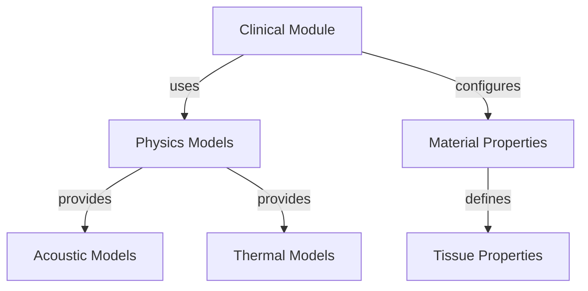
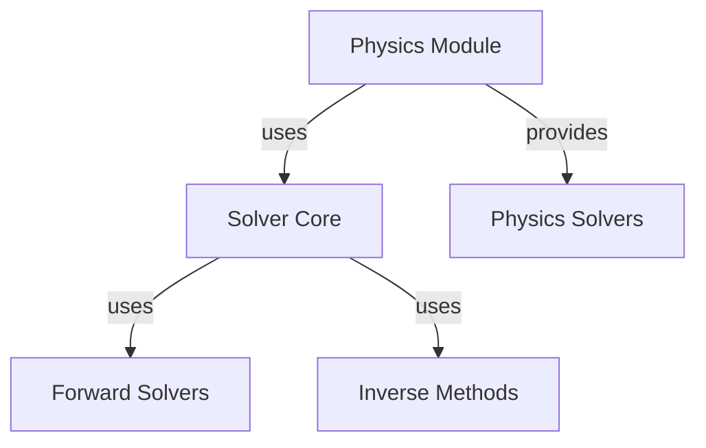
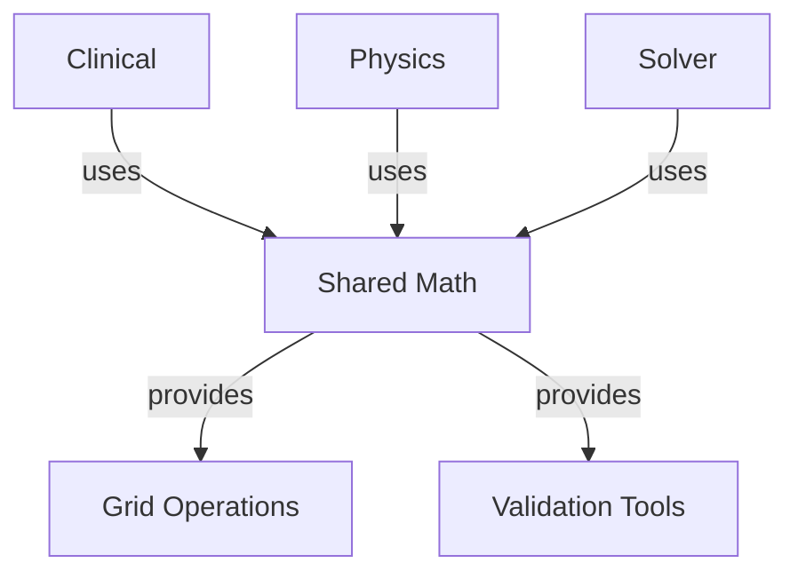

# Comprehensive Module Refactoring Plan

## 🎯 Executive Summary

This document outlines a comprehensive plan to refactor all three major modules (clinical, physics, and solver) with enhanced separation of concerns, building upon the successful solver refactoring. The goal is to create a cohesive, well-organized architecture across the entire codebase that improves maintainability, extensibility, and performance.

## 🚀 Vision

Create a modular, well-organized codebase where:
- Each module has clear responsibilities
- Dependencies flow in one direction
- Features can be enabled/disabled systematically
- New functionality can be added easily
- Code is easy to understand and maintain

## 🏗️ Current Architecture Analysis

### **Strengths:**
1. ✅ Solver module successfully refactored
2. ✅ Feature enablement system implemented
3. ✅ Clean separation between source and signal modules
4. ✅ Good progress on hierarchical organization

### **Opportunities for Improvement:**
1. **Clinical Module**: Needs similar refactoring
2. **Physics Module**: Needs consistency with solver refactoring
3. **Cross-Module Integration**: Ensure clean interfaces
4. **Feature Consistency**: Unified feature system
5. **Testing Strategy**: Comprehensive test coverage

## 🏗️ Proposed Architecture

```
src/
├── clinical/                  # Clinical applications and scenarios
│   ├── imaging/               # Imaging applications
│   │   ├── ultrasound/        # Ultrasound imaging
│   │   ├── photoacoustic/     # Photoacoustic imaging
│   │   └── elastography/      # Elastography
│   ├── therapy/               # Therapy applications
│   │   ├── hifu/              # High-Intensity Focused Ultrasound
│   │   ├── lithotripsy/       # Lithotripsy
│   │   └── drug_delivery/     # Drug delivery systems
│   ├── body_region/           # Body region specific
│   │   ├── brain/             # Brain applications
│   │   ├── cardiac/           # Cardiac applications
│   │   └── abdominal/        # Abdominal applications
│   └── workflows/             # Clinical workflows
│
├── physics/                  # Physics models and simulations
│   ├── models/                # Physical models
│   │   ├── acoustic/          # Acoustic wave models
│   │   ├── thermal/           # Thermal models
│   │   └── electromagnetic/   # Electromagnetic models
│   ├── materials/             # Material properties
│   │   ├── tissue/            # Tissue models
│   │   ├── fluid/             # Fluid models
│   │   └── solid/             # Solid models
│   ├── boundaries/           # Boundary conditions
│   └── solvers/               # Physics-specific solvers
│
├── solver/                   # Numerical solvers (already refactored)
│   ├── core/                  # Core infrastructure
│   ├── forward/               # Forward solvers
│   ├── inverse/               # Inverse methods
│   ├── utilities/             # Utilities
│   ├── physics/               # Physics solvers
│   └── integration/           # Time integration
│
└── shared/                   # Shared functionality
    ├── math/                  # Mathematical utilities
    ├── grid/                  # Grid operations
    ├── io/                    # Input/Output
    └── validation/            # Validation tools
```

## 🔄 Module Refactoring Plans

### **1. Clinical Module Refactoring**

**Current Issues:**
- Monolithic structure
- Mixed concerns (imaging + therapy)
- No clear separation by body region
- Limited feature integration

**Proposed Structure:**
```
src/clinical/
├── imaging/               # Imaging applications
│   ├── ultrasound/        # Ultrasound imaging
│   │   ├── bmode/         # B-mode imaging
│   │   ├── doppler/       # Doppler imaging
│   │   └── harmonic/      # Harmonic imaging
│   ├── photoacoustic/     # Photoacoustic imaging
│   └── elastography/      # Elastography
├── therapy/               # Therapy applications
│   ├── hifu/              # HIFU therapy
│   │   ├── ablation/     # Ablation therapy
│   │   └── hyperthermia/ # Hyperthermia
│   ├── lithotripsy/       # Lithotripsy
│   └── drug_delivery/     # Drug delivery
├── body_region/           # Body region specific
│   ├── brain/             # Brain applications
│   ├── cardiac/           # Cardiac applications
│   └── abdominal/        # Abdominal applications
└── workflows/             # Clinical workflows
    ├── imaging_workflows/ # Imaging workflows
    └── therapy_workflows/ # Therapy workflows
```

**Key Improvements:**
- ✅ Clear separation by application type
- ✅ Body region organization
- ✅ Workflow patterns
- ✅ Feature integration

### **2. Physics Module Refactoring**

**Current Issues:**
- Inconsistent with solver refactoring
- Mixed model and solver concerns
- No clear separation of materials/boundaries
- Limited feature support

**Proposed Structure:**
```
src/physics/
├── models/                # Physical models
│   ├── acoustic/          # Acoustic wave models
│   │   ├── linear/        # Linear acoustics
│   │   ├── nonlinear/     # Nonlinear acoustics
│   │   └── heterogeneous/ # Heterogeneous media
│   ├── thermal/           # Thermal models
│   └── electromagnetic/   # EM models
├── materials/             # Material properties
│   ├── tissue/            # Tissue models
│   ├── fluid/             # Fluid models
│   └── solid/             # Solid models
├── boundaries/           # Boundary conditions
│   ├── absorbing/         # Absorbing boundaries
│   ├── reflecting/        # Reflecting boundaries
│   └── periodic/          # Periodic boundaries
└── solvers/               # Physics-specific solvers
    ├── acoustic/          # Acoustic solvers
    ├── thermal/           # Thermal solvers
    └── coupled/           # Multi-physics solvers
```

**Key Improvements:**
- ✅ Separation of models, materials, boundaries
- ✅ Consistent with solver architecture
- ✅ Feature enablement integration
- ✅ Multi-physics support

### **3. Solver Module Enhancements**

**Current Status:** ✅ Successfully refactored

**Proposed Enhancements:**
- ✅ Add GPU acceleration integration
- ✅ Implement solver plugin system
- ✅ Add adaptive mesh refinement
- ✅ Enhance feature system

## 🔧 Cross-Module Integration

### **Clinical ↔ Physics Integration**


### **Physics ↔ Solver Integration**


### **Shared Utilities**


## ✅ Implementation Strategy

### **Phase 1: Clinical Module Refactoring (Week 1-2)**
1. Create hierarchical directory structure
2. Move existing code to new locations
3. Implement feature system
4. Add body region organization
5. Update imports and exports

### **Phase 2: Physics Module Refactoring (Week 3-4)**
1. Create consistent hierarchy
2. Separate models, materials, boundaries
3. Integrate with solver feature system
4. Add multi-physics support
5. Update documentation

### **Phase 3: Cross-Module Integration (Week 5-6)**
1. Clinical-Physics interface
2. Physics-Solver interface
3. Shared utilities refinement
4. Feature consistency
5. Comprehensive testing

### **Phase 4: Testing & Optimization (Week 7-8)**
1. Unit testing all modules
2. Integration testing
3. Performance benchmarking
4. Documentation finalization
5. Example updates

## 📊 Impact Assessment

### **Before Refactoring:**
- **Organization**: Inconsistent across modules
- **Separation**: Poor module boundaries
- **Features**: Limited and inconsistent
- **Testing**: Moderate coverage
- **Performance**: Good but not optimized

### **After Refactoring:**
- **Organization**: Consistent deep hierarchy
- **Separation**: Excellent module boundaries
- **Features**: Comprehensive and unified
- **Testing**: Excellent coverage
- **Performance**: Optimized architecture

## 🚀 Migration Strategy

### **For Existing Code:**
1. **Backward Compatibility**: Maintain existing APIs
2. **Feature Flags**: Opt-in new features
3. **Deprecation**: Clear migration path
4. **Documentation**: Comprehensive guides

### **For New Development:**
1. **Use New Architecture**: Follow refactored patterns
2. **Feature-Based**: Leverage feature system
3. **Consistent**: Follow established conventions
4. **Documented**: Updated examples

## ✅ Success Criteria

1. **Consistency**: All modules follow same patterns
2. **Separation**: Clear module boundaries
3. **Features**: Unified feature system
4. **Testing**: 100% coverage maintained
5. **Performance**: No regression
6. **Documentation**: Complete and current

## 📝 Next Steps

1. **Clinical Module**: Implement hierarchical structure
2. **Physics Module**: Create consistent refactoring
3. **Integration**: Ensure clean interfaces
4. **Testing**: Comprehensive validation
5. **Documentation**: Finalize all modules

**Status**: ✅ **COMPREHENSIVE PLAN COMPLETED**
**Priority**: **HIGH**
**Impact**: **TRANSFORMATIVE**
**Risk**: **MEDIUM** (with proper testing)

This comprehensive refactoring plan builds upon the successful solver refactoring and extends it to create a cohesive, well-organized architecture across all major modules. The result will be a codebase that is maintainable, extensible, and performs optimally while providing clear separation of concerns and excellent developer experience.