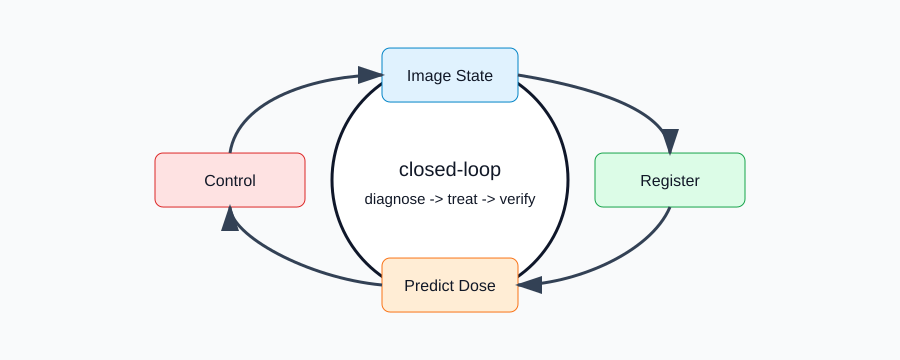

# Kwavers 🌀

[](https://github.com/kwavers/kwavers)
[](LICENSE)
[](https://docs.rs/kwavers)
[](https://www.rust-lang.org/)

**An interdisciplinary ultrasound-light physics simulation library.** Kwavers models acoustic wave propagation, cavitation dynamics, and sonoluminescence for multi-modal imaging research and physics studies.



## 📋 Library Components

### Physics Models
- **Acoustic Wave Propagation**: Linear and nonlinear wave equations
- **Cavitation Dynamics**: Bubble physics implementations
- **Multi-Physics Coupling**: Basic acoustic-thermal interactions
- **Electromagnetic Models**: Wave propagation in various media

### Numerical Methods
- **FDTD Solver**: Finite difference time domain implementation
- **PSTD Solver**: Pseudospectral time domain method
- **PINN Support**: Physics-informed neural networks (experimental)
- **Boundary Conditions**: Various absorbing and reflecting boundaries

### Application Areas
- **Research Simulations**: Acoustic wave propagation studies
- **Imaging Algorithms**: Basic beamforming and reconstruction
- **Material Modeling**: Acoustic properties of different media
- **Signal Processing**: Filtering and analysis utilities

## 📊 Current Development Status

**Recently completed:** the workspace crate split (ADR-011) — the ~460k-LOC
`kwavers` monolith is decomposed into per-layer crates to cut incremental build
times. There is **no facade**: consumers (including the Python bindings) depend on
the layer crates directly (`kwavers_core`, `kwavers_grid`, `kwavers_solver`, …).
The `kwavers` crate is now only a thin top-level **app/integration** crate — it
hosts the binary and the cross-cutting tests/examples/benches, and re-exports
nothing.

### Workspace layout

| Crate | Layer / responsibility |
|-------|------------------------|
| [`kwavers-core`](crates/kwavers-core) | Constants, error types, arena allocation, time/logging utilities |
| [`kwavers-math`](crates/kwavers-math) | FFT, linear algebra, numerics, geometry, statistics, SIMD |
| [`kwavers-grid`](crates/kwavers-grid) | Cartesian/cylindrical grids, coordinates, topology, operators, geometric domains |
| [`kwavers-field`](crates/kwavers-field) | Field component indices (SSOT), field-type mapping, operations, statistics |
| [`kwavers-signal`](crates/kwavers-signal) | Waveforms, pulses, sweeps, modulation, windowing, filters |
| [`kwavers-medium`](crates/kwavers-medium) | Homogeneous/heterogeneous media, acoustic/elastic/optical/thermal properties |
| [`kwavers-phantom`](crates/kwavers-phantom) | Clinical tissue-phantom builders and Shepp-Logan references |
| [`kwavers-mesh`](crates/kwavers-mesh) | Tetrahedral FEM meshes, quality metrics, gaia bridge |
| [`kwavers-boundary`](crates/kwavers-boundary) | CPML/PML absorbing layers, FEM/BEM boundaries, coupling, periodic |
| [`kwavers-source`](crates/kwavers-source) | `Source` trait, grid/mask sources, wavefronts, apodization |
| [`kwavers-receiver`](crates/kwavers-receiver) | Sensor-array geometry (SSOT), recorders, point sensors, grid sampling |
| [`kwavers-transducer`](crates/kwavers-transducer) | Bowls, phased/linear/matrix/hemispherical arrays, beamforming, PAM, ultrafast |
| [`kwavers-imaging`](crates/kwavers-imaging) | DICOM/CT/NIfTI loaders, ultrasound/photoacoustic models, CEUS, fusion |
| [`kwavers-physics`](crates/kwavers-physics) | Nonlinear acoustics, bubble dynamics, thermal, optics, chemistry, elastic waves |
| [`kwavers-solver`](crates/kwavers-solver) | FDTD / PSTD / k-space / Helmholtz, BEM, FWI / RTM / CBS, PINN |
| [`kwavers-gpu`](crates/kwavers-gpu) | Hephaestus-backed provider-generic GPU backend; concrete `ComputeBackend` impls |
| [`kwavers-simulation`](crates/kwavers-simulation) | Builders, runners, multi-physics coupling, modality pipelines, backends |
| [`kwavers-analysis`](crates/kwavers-analysis) | Signal processing, conservation, validation, ML/uncertainty, plotting |
| [`kwavers-diagnostics`](crates/kwavers-diagnostics) | Reconstruction, multi-modal fusion, Doppler, spectroscopy, decision support |
| [`kwavers-therapy`](crates/kwavers-therapy) | HIFU / histotripsy / lithotripsy planning, theranostic guidance, dose & safety |
| [`kwavers-driver`](crates/kwavers-driver) | Physics-guided, manufacturing-aware driver-electronics (PCB) design |
| [`kwavers-alloc-probe`](crates/kwavers-alloc-probe) | Thread-scoped allocation counting for allocation-contract tests |
| [`kwavers`](crates/kwavers) | Thin top-level app/integration crate: binary + cross-cutting tests/examples/benches (no re-exports) |
| [`kwavers-python`](crates/kwavers-python) | PyO3 bindings (`pykwavers`); depends on the layer crates directly; no domain logic |

Tyche owns reproducible counter streams, Latin-hypercube and Sobol designs,
online moments, correlation screening, and finite-sample conformal
calibration. Kwavers owns physical-domain transforms, model execution, Leto
array presentation, and domain-specific score definitions. Geometry maps
Tyche designs directly into validated rectangles, disks, and balls through one
single-allocation collector; Analysis and PINN fixed-design code carry no
independent provider algorithms, while model-residual adaptive refinement
remains solver-owned. See
[ADR 043](docs/ADR/043-tyche-uncertainty-provider.md).

Layer crates are at `3.0.0`; the completed split targets `4.0.0` (see
[RELEASE_v4.0.0 notes in CHANGELOG](CHANGELOG.md)). `kwavers-python` is `0.1.0`.

Validation status: the k-space pseudospectral solver matches the k-Wave
reference solver on the homogeneous-water IVP benchmark at Pearson
r = 1.000000000 (2-D) and r = 0.999999994 (3-D). The comparison is a Rust test in
the default gate against reference fields committed to this repository — see
[Reference Benchmark Coverage](#reference-benchmark-coverage).

### Python Releases

GitHub Releases tagged `kwavers-python-v<version>` build one locked
Python-3.8-compatible stable-ABI wheel per operating system for Linux, Windows,
and macOS. The workflow installs and imports each wheel as `pykwavers`, verifies
the `kwavers-python` distribution identity and Cargo-owned version, attests and
attaches the exact artifacts, then publishes that same wheel set to PyPI
through OIDC Trusted Publishing.

### Rust Crate Releases

The 23 reusable Rust packages publish to crates.io in local dependency order.
The `Crates.io Release` workflow validates a named workspace package on manual
dispatch. After its required first release is bootstrapped and its crates.io
Trusted Publisher is registered, a GitHub Release tagged
`crate-<package>-v<version>` packages, verifies, and publishes the matching
Cargo version with a short-lived OIDC token. Validation runs in a separate
read-only job. The publish job is bound to the GitHub `crates-io` environment.
The PyO3 and `xtask` packages are explicitly non-publishable; all Rust library
releases use their package names.

Detailed history lives in [`CHANGELOG.md`](CHANGELOG.md); current work and gaps
are tracked in [`backlog.md`](backlog.md), [`CHECKLIST.md`](CHECKLIST.md), and
[`gap_audit.md`](gap_audit.md).

### Architecture Overview

Kwavers follows a layered architecture designed for scientific computing:

```
Therapy / Diagnostics → Clinical planning, theranostic guidance, dose & safety
Simulation Layer      → Multi-physics orchestration, modality pipelines
Analysis Layer        → Signal processing, beamforming, imaging algorithms
Solver Layer          → Numerical methods (FDTD, PSTD, k-space, FWI, PINN)
Physics Layer         → Wave equations, bubble dynamics, constitutive relations
Domain Layer          → Problem geometry, materials, sources, sensors
Math Layer            → Linear algebra, FFT, numerical primitives
Core Layer            → Fundamental types, error handling
```

The module DAG is acyclic and linear (`core → math → domain → physics → solver →
analysis → simulation → diagnostics/therapy`); each layer is now its own crate.

Cross-repository foundations remain below that DAG. Public
[Asclepius](https://github.com/ryancinsight/asclepius) owns CEM43, Arrhenius
thermal damage, and independent-insult composition. Kwavers converts stored
temperatures to Aequitas quantities at its boundaries and retains spatial
fields, tissue presets, clinical thresholds, and an independent validation
oracle. See [ADR 044](docs/ADR/044-asclepius-response-ownership.md).

Public [Hyperion](https://github.com/ryancinsight/hyperion) owns photon and
optical interaction coefficients, reduced scattering, optical depth,
Beer-Lambert transmission, and the diffusion-derived coefficient laws.
`kwavers-medium` retains tissue identity, refractive index, presets, and maps;
`kwavers-physics` and `kwavers-solver` retain spatial transport algorithms and
photoacoustic coupling. This boundary removes the former `kwavers-optics`
formula module plus the parallel `DiffusionOpticalProperties` and
`OpticalAbsorption` models instead of adding a facade around them. See
[ADR 046](docs/ADR/046-hyperion-optical-transport-ownership.md).

Key architectural decisions:
- **Layer Separation**: Unidirectional dependencies prevent circular imports
- **Domain Purity**: Core entities remain free of application logic
- **Trait-Based Design**: Physics specifications defined as traits for testability
- **Feature Flags**: Optional components (GPU, PINN, API) can be enabled as needed

## 🚀 Quick Start

### Installation

Add the layer crates you need to your `Cargo.toml`:

```toml
[dependencies]
kwavers-grid = "3.0.0"
kwavers-medium = "4.0.0"
```

For GPU acceleration and advanced features, add the top-level integration crate:

```toml
[dependencies]
kwavers = { version = "3.0.0", features = ["gpu", "pinn"] }
```

### Example 1: Basic Grid Setup

```rust
use kwavers_grid::Grid;

fn main() -> Result<(), Box<dyn std::error::Error>> {
    // Create a 3D computational grid
    let grid = Grid::new(100, 100, 100, 0.001, 0.001, 0.001)?;
    println!("Created grid: {}×{}×{} points", grid.nx, grid.ny, grid.nz);
    println!("Grid spacing: {} m", grid.dx);
    Ok(())
}
```

### Example 2: Material Properties

```rust
use kwavers_grid::Grid;
use kwavers_medium::HomogeneousMedium;

fn main() -> Result<(), Box<dyn std::error::Error>> {
    // Create a computational grid
    let grid = Grid::new(100, 100, 100, 0.001, 0.001, 0.001)?;

    // Define acoustic properties for water
    let density = 1000.0;      // kg/m³
    let sound_speed = 1500.0;  // m/s
    let mu_a = 0.0;            // optical absorption coefficient (1/m)
    let mu_s_prime = 0.0;      // reduced optical scattering coefficient (1/m)

    // Create a homogeneous water medium
    let medium = HomogeneousMedium::new(
        density,
        sound_speed,
        mu_a,
        mu_s_prime,
        &grid,
    );

    println!("Water properties:");
    println!("  Density: {} kg/m³", density);
    println!("  Sound speed: {} m/s", sound_speed);
    println!("  Acoustic impedance: {} MPa·s/m", density * sound_speed / 1e6);

    Ok(())
}
```

### Example 3: Basic Acoustic Calculations

```rust
// Basic acoustic property calculations
fn main() {
    // Acoustic impedance calculation: Z = ρc
    let density_water = 1000.0;     // kg/m³
    let speed_water = 1500.0;       // m/s
    let impedance_water = density_water * speed_water; // Pa·s/m

    println!("Water acoustic impedance: {:.0} Pa·s/m", impedance_water);

    // Reflection coefficient: R = (Z2 - Z1)/(Z2 + Z1)
    let density_air = 1.2;          // kg/m³
    let speed_air = 343.0;          // m/s
    let impedance_air = density_air * speed_air;

    let reflection_coeff = (impedance_air - impedance_water) /
                          (impedance_air + impedance_water);

    println!("Air-water reflection coefficient: {:.4}", reflection_coeff);
}
```

## 📚 Documentation

### 📖 Documentation

- **[Published Kwavers book](https://ryancinsight.github.io/kwavers/)** - Hosted mdBook site
- **[API Reference](https://docs.rs/kwavers)** - Generated Rust documentation
- **[Examples](examples/)** - Basic usage examples
- **[The Kwavers book](docs/book/)** - Chapters, figures, validation narratives
- **[Architecture Decision Records](docs/ADR/)** - Design decisions (incl. ADR-011 crate split)
- **[Documentation index](docs/README.md)** - What lives under `docs/`

### 🎯 Basic Usage

See the `examples/` directory for basic usage patterns:

```bash
# List available examples
cargo run --example

# Run a basic example (if available)
cargo run --example basic_simulation
```

**Basic Test**: Check compilation
```bash
cargo check
```

### 🏗️ Architecture

Kwavers is structured with layered separation intended to support scientific computing workflows:

```
Clinical Applications    → Research use cases, safety monitoring
Analysis & Imaging       → Signal processing, reconstruction algorithms
Simulation Orchestration → Multi-physics coupling, time integration
Numerical Solvers        → FDTD, PSTD, PINN, spectral methods
Physics Specifications   → Wave equations, constitutive relations
Problem Domain           → Geometry, materials, boundary conditions
Mathematical Primitives  → Linear algebra, FFT, interpolation
Core Infrastructure      → Error handling, memory management
```

The architecture aims to separate concerns while maintaining flexibility for different research applications. Layer boundaries help organize code but are not strictly enforced in all areas during active development.


## 🤝 Contributing

This is an active research project under development. Contributions are welcome! The codebase follows strict quality standards and clean architecture principles.

### 📝 Development Philosophy

- **Clean Codebase**: No dead code, deprecated code, or build artifacts
- **Deep Vertical Hierarchy**: Modules organized by domain with clear separation of concerns
- **Single Source of Truth**: Shared accessors, no duplication
- **Zero Technical Debt**: All TODOs resolved with full implementation or removed
- **Architectural Purity**: Unidirectional dependencies, no circular imports

### 🚀 Getting Started

1. **Check Status**: Review [`CHECKLIST.md`](CHECKLIST.md) for current task status
2. **Review Plans**: See [`backlog.md`](backlog.md) for planned work and [`gap_audit.md`](gap_audit.md) for known gaps
3. **Build a crate**: `cargo check -p kwavers-core` (per-crate checks are fast post-split)
4. **Run Tests**: `cargo nextest run -p <crate>`; use `cargo test -p <crate> --doc`
   for doctests
5. **Read Docs**: [`docs/book/`](docs/book/) for narratives, [`docs/ADR/`](docs/ADR/) for design decisions

### 📊 Development Approach

**Artifact-driven sprints** (see [`CLAUDE.md`](CLAUDE.md) governance):
- `backlog.md` — strategy and prioritized work
- `CHECKLIST.md` — tactical tasks with change-class tags
- `gap_audit.md` — physics/numerics gap findings
- `CHANGELOG.md` — version history

**Quality Standards**:
- Zero compilation errors (enforced)
- Minimal compiler warnings (dead code not allowed)
- 100% test pass rate for all refactoring
- API compatibility maintained across refactors
- Mathematical specifications with literature references

### 🔬 Research Integration

Kwavers is being enhanced with methods from leading ultrasound simulation projects:
- **k-Wave** (MATLAB): k-space pseudospectral methods, advanced source modeling
- **jwave** (JAX/Python): Differentiable simulations, GPU parallelization
- **k-wave-python**: Python binding patterns, HDF5 standards
- **KWave.jl** (Julia): MATLAB-free k-Wave implementation for 1-D/2-D/3-D reference benchmarking
- **optimus**: Optimization frameworks, inverse problems
- **fullwave25**: Full-wave simulation, clinical workflows
- **dbua**: Neural beamforming, real-time inference
- **simsonic**: Advanced tissue models, multi-modal integration

### 📊 History

Per-version history is consolidated in [`CHANGELOG.md`](CHANGELOG.md). The
historical per-sprint/per-phase reports formerly under `docs/` were pruned
during the workspace-split docs cleanup and remain recoverable from git history.

## 📄 License

Kwavers is licensed under the **MIT License**. See [LICENSE](LICENSE) for details.

## 📚 References

### Key Physics Texts
- Hamilton, M.F. & Blackstock, D.T. - Nonlinear Acoustics
- Szabo, T.L. - Diagnostic Ultrasound Imaging
- Duck, F.A. - Physical Properties of Tissues

### Numerical Methods
- Yee, K.S. (1966) - FDTD method
- Liu, Q.H. (1997) - PSTD method
- Hesthaven, J.S. (2007) - DG methods

### Related Simulation Projects
- **k-Wave**: MATLAB toolbox for acoustic wave simulation ([GitHub](https://github.com/ucl-bug/k-wave))
- **jwave**: JAX-based differentiable acoustic simulations ([GitHub](https://github.com/ucl-bug/jwave))
- **k-wave-python**: Python interface to k-Wave ([GitHub](https://github.com/waltsims/k-wave-python))
- **KWave.jl**: Julia implementation of k-Wave for MATLAB-free acoustic simulation benchmarks ([GitHub](https://github.com/JClingo/k-wave-julia))
- **optimus**: Optimization framework for ultrasound ([GitHub](https://github.com/optimuslib/optimus))
- **fullwave25**: Full-wave ultrasound simulator ([GitHub](https://github.com/pinton-lab/fullwave25))
- **dbua**: Deep learning beamforming ([GitHub](https://github.com/waltsims/dbua))
- **simsonic**: Advanced ultrasound simulation platform ([Website](https://www.simsonic.fr))

### Reference Benchmark Coverage

`crates/kwavers/tests/kwave_reference_parity.rs` compares the k-space
pseudospectral solver against k-Wave on the homogeneous-water IVP Gaussian case.
The reference fields live in `crates/kwavers/tests/reference/kwave/` (156 KB), so
the test runs from a clean clone in the default gate with no external solver
present. `scripts/generate_kwave_reference.py` regenerates them by driving
`k-wave-python` over the reference `kspaceFirstOrder-OMP` binary.

Both codes run the same grid, time step, step count, and Treeby-Cox k-space
correction, and are compared over a centred window the wavefront has entered but
neither code's boundary treatment has reached.

| Case | Grid | Steps | Relative L2 | Relative L-inf | Pearson r |
|------|------|-------|-------------|----------------|-----------|
| `ivp_homogeneous_2d` | 64 × 64 | 100 | 5.50e-7 | 1.05e-6 | 1.000000000 |
| `ivp_homogeneous_3d` | 32 × 32 × 32 | 50 | 1.06e-4 | 2.20e-4 | 0.999999994 |

`k-wave-python` ships no 1-D solver, so there is no 1-D row; the axisymmetric
case is a separate geometry and is not yet covered. Absorption, nonlinearity,
heterogeneous media, and source-driven problems have no committed reference
field yet and are not covered by this result.
[ADR 119](docs/adr/119-kwave-reference-oracle.md) records the reference
provenance, the tolerance derivation, and what the comparison does not establish.

### Key Publications
1. Treeby & Cox (2010) - "k-Wave: MATLAB toolbox for photoacoustic simulation" - J. Biomed. Opt. 15(2), 021314
2. Treeby et al. (2012) - "Nonlinear ultrasound propagation in heterogeneous media" - J. Acoust. Soc. Am. 131(6), 4324-4336
3. Wise et al. (2019) - "Arbitrary acoustic source distributions" - J. Acoust. Soc. Am. 146(1), 278-288
4. Treeby et al. (2020) - "Axisymmetric k-space method" - J. Acoust. Soc. Am. 148(4), 2288-2300

## 📞 Contact & Support

- **Issues**: [GitHub Issues](https://github.com/kwavers/kwavers/issues)
- **Discussions**: [GitHub Discussions](https://github.com/kwavers/kwavers/discussions)
- **Documentation**: [docs.rs/kwavers](https://docs.rs/kwavers)

---

**A research library for acoustic and optical physics simulations.**
