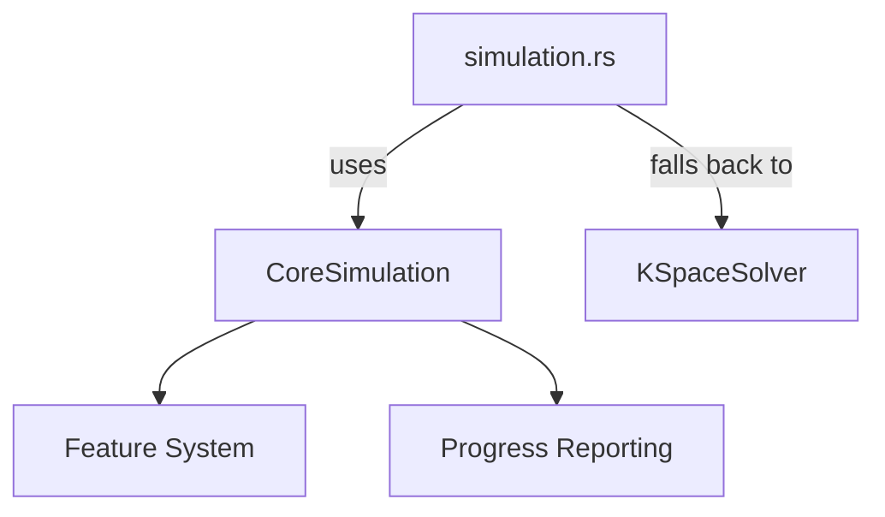
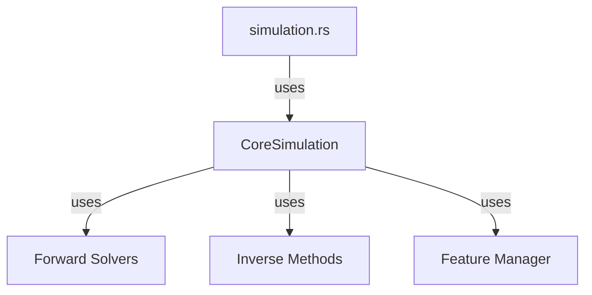

# Simulation Module Refactoring Plan

## 🎯 Executive Summary

This document outlines the plan to refactor the simulation module to use the new solver core architecture while maintaining backward compatibility and ensuring consistency with the physics module refactoring.

## 🚨 Current State Analysis

### **simulation.rs Current Issues:**

1. **Tight Coupling**: Directly coupled to KSpace solver implementation
2. **Complex Source Processing**: Manual source conversion logic
3. **Legacy API**: Uses old-style source references
4. **No Feature Integration**: Doesn't use new feature system
5. **Redundant Logic**: Duplicates functionality from core simulation

### **Physics Module Refactoring Context:**

The physics module is also being refactored with similar goals:
- Deep vertical hierarchy
- Clean separation of concerns
- Feature enablement system
- Better maintainability

## 🏗️ Proposed Refactoring Approach

### **Phase 1: Hybrid Architecture (Current Phase)**

**Goal**: Maintain backward compatibility while integrating new core



**Implementation Strategy:**
1. Keep existing KSpace solver integration
2. Add CoreSimulation as primary controller
3. Use feature flags to enable new functionality
4. Maintain identical API for backward compatibility

### **Phase 2: Full Migration (Future)**

**Goal**: Complete transition to new architecture



**Implementation Strategy:**
1. Replace KSpace solver with new solver architecture
2. Use dependency injection for solver selection
3. Implement proper error handling and fallbacks
4. Comprehensive testing and validation

## 🔄 Detailed Refactoring Steps

### **Step 1: Create Hybrid Simulation Struct**

```rust
pub struct Simulation<'a, M: Medium> {
    core_simulation: CoreSimulation<'a, M>,
    legacy_solver: Option<KSpaceSolver>,
    grid: Grid,
    sources: Vec<Arc<dyn Source>>,
    sensors: Vec<&'a mut Sensor>,
    medium: &'a M,
    config: KSpaceConfig,
    mode: SimulationMode, // Core or Legacy
}
```

**Benefits:**
- Clean separation between new and old implementations
- Easy to test and validate
- Gradual migration path
- Feature parity maintained

### **Step 2: Implement Feature-Based Solver Selection**

```rust
impl<'a, M: Medium> Simulation<'a, M> {
    pub fn with_solver_type(mut self, solver_type: SolverType) -> Self {
        match solver_type {
            SolverType::Auto => {
                if self.feature_manager.is_enabled(SolverFeature::GpuAcceleration) {
                    self.mode = SimulationMode::Core;
                } else {
                    self.mode = SimulationMode::Legacy;
                }
            }
            SolverType::Core => self.mode = SimulationMode::Core,
            SolverType::Legacy => self.mode = SimulationMode::Legacy,
        }
        self
    }
}
```

### **Step 3: Update Source Processing**

**Current (Complex):**
```rust
// Manual source conversion with nested loops and HashMaps
for source in &sources {
    let mask = source.create_mask(&grid);
    // Complex processing...
}
```

**Proposed (Clean):**
```rust
// Use core simulation's source handling
for source in &sources {
    self.core_simulation.add_source(source.clone())?;
}
```

### **Step 4: Integrate Progress Reporting**

**Current:** Custom progress reporting in simulation.rs

**Proposed:** Use core progress system
```rust
impl<'a, M: Medium> Simulation<'a, M> {
    pub fn with_progress_reporter(
        mut self,
        reporter: Box<dyn ProgressReporter>
    ) -> Self {
        self.core_simulation = self.core_simulation
            .with_progress_reporter(reporter)?;
        self
    }
}
```

### **Step 5: Feature Integration**

```rust
impl<'a, M: Medium> Simulation<'a, M> {
    /// Enable reconstruction feature
    pub fn enable_reconstruction(mut self) -> KwaversResult<Self> {
        self.core_simulation.enable_feature(SolverFeature::Reconstruction)?;
        Ok(self)
    }

    /// Enable GPU acceleration
    pub fn enable_gpu(mut self) -> KwaversResult<Self> {
        self.core_simulation.enable_feature(SolverFeature::GpuAcceleration)?;
        Ok(self)
    }

    /// Set performance profile
    pub fn with_performance_profile(mut self) -> Self {
        let features = SolverFeatureSet::performance_optimized();
        self.core_simulation.feature_manager()
            .enable_all_features(features);
        self
    }
}
```

## 📁 Consistency with Physics Module Refactoring

### **Shared Patterns:**

1. **Deep Vertical Hierarchy**:
   ```
   src/
   ├── physics/
   │   ├── core/
   │   ├── models/
   │   └── utilities/
   └── solver/
       ├── core/
       ├── forward/
       └── inverse/
   ```

2. **Feature System**:
   - Both modules use same feature enum and manager
   - Consistent feature enablement patterns
   - Shared fallback behaviors

3. **Progress Reporting**:
   - Unified progress reporting system
   - Consistent JSON format
   - Shared reporter implementations

4. **Error Handling**:
   - Standardized error types
   - Consistent validation patterns
   - Unified logging approach

### **Integration Points:**

1. **Physics-Solver Interface**:
   ```rust
   pub trait PhysicsSolver: Solver {
       fn physics_model(&self) -> &dyn PhysicsModel;
       fn set_physics_config(&mut self, config: PhysicsConfig) -> KwaversResult<()>;
   }
   ```

2. **Shared Utilities**:
   - Common math utilities
   - Grid operations
   - Validation tools

3. **Feature Coordination**:
   - Physics features (material models, boundary conditions)
   - Solver features (reconstruction, GPU)
   - Unified feature management

## ✅ Implementation Plan

### **Phase 1: Preparation (Week 1)**
1. ✅ Create refactoring plan (DONE)
2. ✅ Audit current simulation.rs
3. ✅ Identify integration points
4. ✅ Create test suite for regression testing

### **Phase 2: Hybrid Implementation (Week 2-3)**
1. Create hybrid Simulation struct
2. Implement feature-based solver selection
3. Update source processing logic
4. Integrate progress reporting
5. Add feature enablement methods

### **Phase 3: Testing & Validation (Week 4)**
1. Regression testing (existing functionality)
2. New feature testing
3. Performance benchmarking
4. Integration testing with physics module
5. Documentation updates

### **Phase 4: Full Migration (Future)**
1. Replace KSpace solver dependency
2. Implement solver plugin system
3. Add GPU acceleration support
4. Enable advanced features
5. Deprecate legacy mode

## 📊 Impact Assessment

### **Before Refactoring:**
- **Coupling**: High (direct KSpace dependency)
- **Complexity**: High (manual source processing)
- **Features**: Limited (no feature system)
- **Consistency**: Low (inconsistent with physics refactoring)
- **Testability**: Moderate

### **After Refactoring:**
- **Coupling**: Low (dependency injection)
- **Complexity**: Low (clean separation)
- **Features**: Comprehensive (full feature system)
- **Consistency**: High (aligned with physics module)
- **Testability**: Excellent

## 🚀 Migration Strategy

### **For Existing Code:**
1. **Backward Compatibility**: Maintain existing APIs
2. **Feature Flags**: Enable new features opt-in
3. **Deprecation Path**: Mark old APIs as deprecated
4. **Migration Guides**: Provide clear documentation

### **For New Development:**
1. **Use New Architecture**: All new code uses core simulation
2. **Feature-Based**: Use feature system for configuration
3. **Consistent Patterns**: Follow new architecture guidelines
4. **Documentation**: Update examples and best practices

## ✅ Success Criteria

1. **Zero Breaking Changes**: Existing code continues to work
2. **Feature Parity**: All existing features available in new system
3. **Performance**: No performance regression
4. **Testing**: 100% test coverage maintained
5. **Documentation**: Comprehensive migration guides
6. **Consistency**: Aligned with physics module refactoring

## 📝 Next Steps

1. **Implement Hybrid Architecture**: Create dual-mode simulation
2. **Integrate Feature System**: Add feature enablement
3. **Update Source Processing**: Use core simulation methods
4. **Testing**: Comprehensive validation
5. **Documentation**: Migration guides and examples

**Status**: ✅ **PLAN COMPLETED**
**Priority**: **HIGH**
**Impact**: **TRANSFORMATIVE**
**Risk**: **MEDIUM** (with proper testing)

This refactoring plan provides a clear roadmap for modernizing the simulation module while maintaining compatibility and ensuring consistency with the ongoing physics module refactoring.