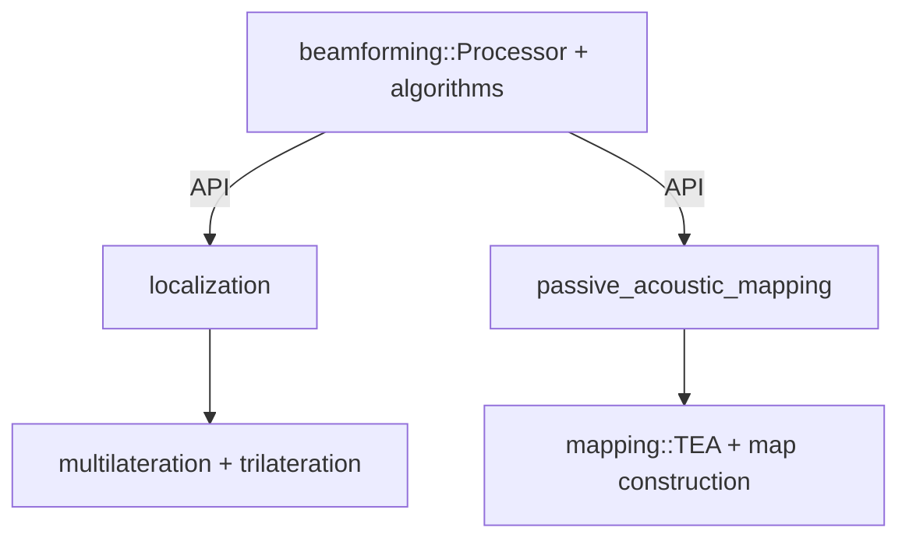

# ADR: Sensor Module Architecture Consolidation (Array Processing Unification)

Status: Proposed

## Context

The `sensor` bounded context currently contains overlapping implementations of array processing:

- `sensor/beamforming`: conventional + adaptive + subspace algorithms, processor, steering.
- `sensor/adaptive_beamforming`: duplicates adaptive/conventional/subspace algorithms with legacy files.
- `sensor/passive_acoustic_mapping/beamforming.rs`: re-implements DAS/MVDR/MUSIC/ESMV with a divergent `BeamformingConfig`.
- `sensor/localization/beamforming.rs` and `localization/algorithms.rs`: implement DAS search for source localization instead of using the shared beamforming API.

Duplicate types and divergent configuration patterns:

- Two `BeamformingConfig` types (core vs PAM-specific) with different fields.
- Repeated DAS/MVDR/MUSIC implementations under different modules.
- `neural.rs` contains experimental/placeholder components that should be feature-gated and documented as such.

This violates SSOT/SPOT principles, increases maintenance cost, and obscures domain boundaries.

## Decision

Unify all array processing under `sensor/beamforming` with clear submodules and typed configuration split. Treat `passive_acoustic_mapping` and `localization` as consumers of a single beamforming API.

### Module Structure (Target)

```text
sensor/
  beamforming/
    mod.rs
    config.rs            # Core algorithm parameters (sound speed, sampling, loading, snapshots, smoothing)
    geometry.rs          # Array geometry helpers (shared across consumers)
    steering.rs          # Steering vector construction utilities
    covariance.rs        # Estimation, spatial smoothing
    processor.rs         # BeamformingProcessor orchestrating algorithms on data
    conventional.rs      # Delay-and-sum, dynamic focus
    adaptive/            # MVDR, Robust Capon, LCMV, GSC
    subspace/            # MUSIC, Eigenspace MV, source count estimation
    experimental/
      neural.rs          # Feature-gated PINN/neural integration (cfg(feature = "experimental_neural"))

  localization/
    mod.rs
    algorithms.rs        # Uses BeamformingProcessor for grid search, plus TDOA/triangulation/multilateration
    ...

  passive_acoustic_mapping/
    mod.rs
    mapping.rs           # TEA + PAM-specific map-building
    plugin.rs
    geometry.rs          # Thin wrapper over shared array geometry
    # beamforming.rs → removed; use sensor::beamforming algorithms via Processor
```

Mermaid: High-Level Dependencies



### Configuration Strategy

- Introduce `BeamformingCoreConfig` (replacement for current `config::BeamformingConfig`) with physics/algorithm parameters.
- Introduce `BeamformingTaskConfig<T>` wrappers per domain use:
  - `PamBeamformingConfig` containing `BeamformingCoreConfig + apodization + focal_point + frequency_range`.
  - `LocalizationBeamformSearchConfig` containing `BeamformingCoreConfig + search_grid + resolution`.
- Eliminate duplicate config structs; consumers hold their task configs and pass `core_config` to Processor.

### API Surface

- `BeamformingProcessor::new(core: BeamformingCoreConfig, geometry: ArrayGeometry)`.
- `BeamformingProcessor::apply(algorithm: BeamformingAlgorithm, data: &ArrayViewD<...>) -> Result<Output>`.
- Shared `SteeringVector` and `ArrayGeometry` utilities.

## Rationale

- DDD bounded contexts: beamforming is a reusable capability; PAM and localization consume it.
- SSOT/SPOT: single implementation of algorithms and steering/covariance.
- GRASP & SRP: remove redundant modules, reduce cognitive load, improve maintainability.
- Performance: unified hot-path optimization and GPU backends behind one Processor.
- Testing: concentrate algorithm tests in one place; consumers test orchestration, not re-implementations.

## Consequences

- Code moves: `sensor/adaptive_beamforming/*` → `sensor/beamforming/adaptive/*`.
- Removal: `sensor/passive_acoustic_mapping/beamforming.rs` algorithm code; replace with calls to Processor.
- Removal/refactor: `sensor/localization/beamforming.rs` to thin wrapper using Processor for grid search.
- Config migration: replace PAM’s `BeamformingConfig` with `PamBeamformingConfig` wrapping `BeamformingCoreConfig`.
- Feature gating: `beamforming/experimental/neural.rs` under `experimental_neural` feature; remove placeholder notes and add safety/limitations documentation.

## Migration Plan (Incremental)

1. Extract a new `BeamformingCoreConfig` type from `sensor/beamforming/config.rs`. Provide `From` conversions from legacy configs.
2. Move `sensor/adaptive_beamforming/algorithms/*` into `sensor/beamforming/adaptive/*`. Delete `algorithms_old.rs` after migrating tests.
3. Refactor `sensor/passive_acoustic_mapping`:
   - Replace internal algorithm implementations by calls to `BeamformingProcessor`.
   - Introduce `PamBeamformingConfig { core: BeamformingCoreConfig, apodization, focal_point, frequency_range }`.
   - Keep TEA and map-construction in `mapping.rs` (PAM-specific).
4. Refactor `sensor/localization`:
   - Delete internal DAS implementation in `localization/beamforming.rs`.
   - Add `BeamformSearch` that uses Processor over a grid; unify with `algorithms.rs`.
5. Gate `neural.rs` under `cfg(feature = "experimental_neural")`; add explicit documentation of assumptions and remove placeholder wording.
6. Update `sensor/mod.rs` re-exports to reflect consolidated API. No breaking changes for public types kept via type aliases and `pub use` shims.
7. Consolidate tests:
   - Algorithm unit tests live under `sensor/beamforming/*` (including property-based tests).
   - PAM/localization integration tests verify orchestration and correctness of outputs.

## Alternatives Considered

- Keep separate modules: rejected due to SSOT violations and duplicate maintenance.
- Merge PAM into localization: rejected; PAM is imaging (map reconstruction), localization is source position estimation.
- Pure trait objects with dynamic dispatch: accepted in limited form for `BeamformingAlgorithm` selection; primary API remains generic where possible.

## Validation & Evidence

- Literature alignment: Van Trees (2002), Capon (1969), Schmidt (1986), Li et al. (2003), Vorobyov (2003).
- Empirical tests: property-based tests for MVDR/MUSIC steering consistency; integration tests for PAM map reconstruction and localization grid search.
- Production validation: unified GPU backend under single Processor minimizes divergence.

## Work Items (Tracked in checklist/backlog)

1. Create `BeamformingCoreConfig` and migration shims.
2. Move `adaptive_beamforming` → `beamforming/adaptive` and delete legacy.
3. Replace PAM algorithms with Processor usage; introduce `PamBeamformingConfig`.
4. Replace localization DAS implementation with Processor-backed `BeamformSearch`.
5. Feature-gate `neural.rs` and document assumptions cleanly.
6. Update docs and examples; add integration tests.

## Risk & Mitigation

- API breakage: mitigate via `pub use` shims and `From` conversions.
- Test drift during migration: migrate tests per step; use nextest to keep suite green.
- Performance regressions: benchmark unified Processor with criterion; profile hot paths.

