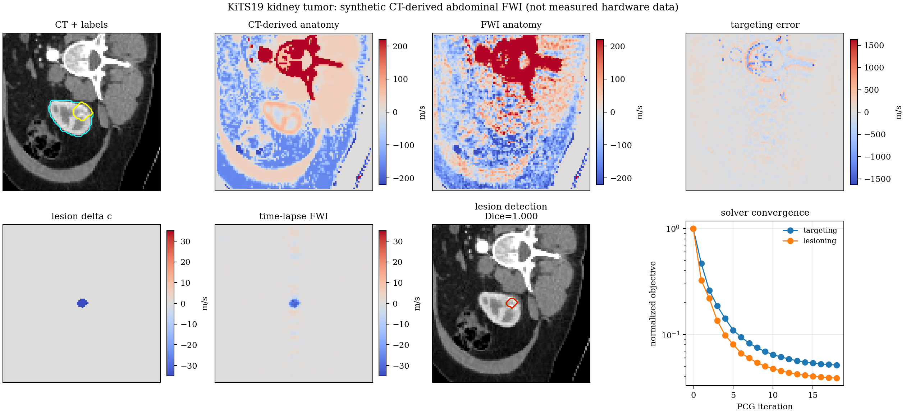
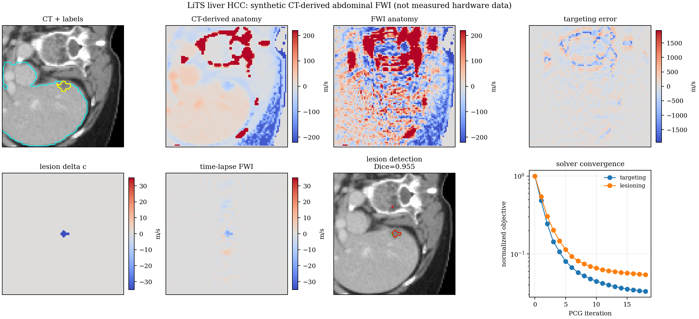
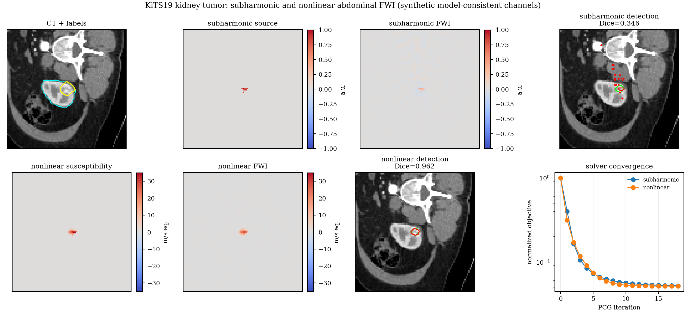
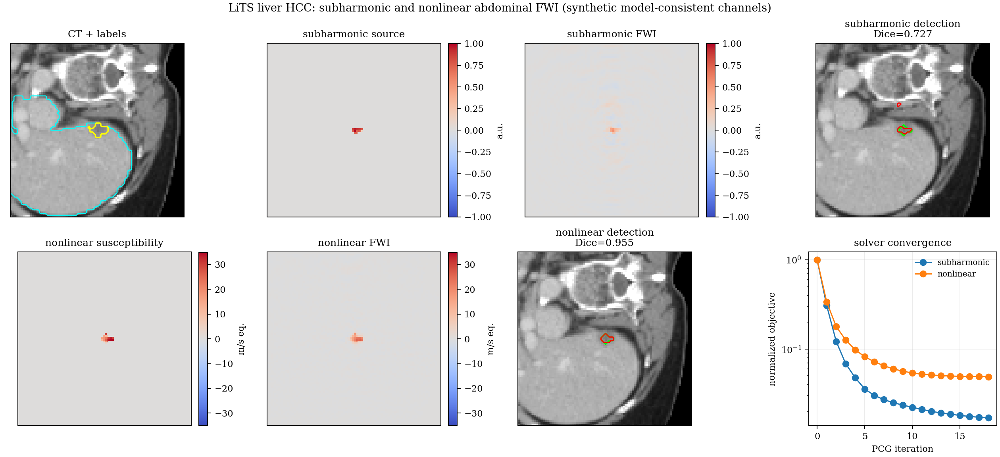

# Chapter 27 — Abdominal Histotripsy FWI Targeting and Lesion Monitoring

This chapter implements a CT-derived abdominal full-waveform inversion analysis
for the existing kidney and liver histotripsy examples. The workflow loads the
KiTS19 kidney CT and LiTS liver CT through the Chapter 14 (Histotripsy) CT
loaders, extracts the
tumor-centered slice, maps labels plus HU texture to acoustic sound speed, and
reconstructs local anatomical sound-speed contrast from synthetic
finite-frequency pitch-catch data. The same chapter reconstructs
lesion-localized subharmonic cavitation source density and nonlinear harmonic
susceptibility from source maps generated by a bounded 2-D Westervelt solve and
a Rayleigh-Plesset bubble response model.

The field of view is the largest tumor-centered anatomical plane available
from each resampled CT case, then resampled to a `96 x 96` inversion grid. The
generated metrics record `0.202 m x 0.202 m` for the kidney case and
`0.156 m x 0.156 m` for the liver case.

## 27.1 Aperture Contract

The acquisition uses a HistoSonics-like public-geometry analog, not a
proprietary Edison device model. The therapy aperture is a projected 2-D
section of a concave histotripsy treatment head with 256 therapy elements,
0.142 m focal radius, 0.230 m lateral extent, a 0.040 m central cutout, and a
750 kHz upper continuation frequency. A 64-channel coaxial imaging receiver
line occupies the central cutout, and each FWI source uses both therapy-aperture
pitch-catch receivers and sampled imaging probe receivers.

This geometry follows public histotripsy literature describing a simulated
HistoSonics Edison-like liver-treatment array with similar dimensions and 256
subdivided elements
([Yeats et al., 2025](https://pmc.ncbi.nlm.nih.gov/articles/PMC12679210/)).
HistoSonics public materials describe Edison as an image-guided histotripsy
platform with continuous visualization, but do not publish a complete
proprietary element layout
([HistoSonics technology page](https://histosonics.com/our-technology-2/)).

## 27.2 Mathematical Contract

Let `m = (c - c_ref) / c_ref` be the unknown sound-speed contrast on the active
anatomical voxels. The active support is the CT-derived body/tissue mask plus
segmented organ and target voxels. Each acquisition row is one source element,
receiver element, and frequency:

```text
d_i = sum_j A_ij m_j
A_ij = dx^2 exp(-alpha_ij f_MHz) cos(k_f (r_sj + r_rj)) / sqrt(r_sj r_rj)
```

Rows are normalized before inversion. The inverse problem solves the
regularized normal equations:

```text
(A^T A + lambda I) m = A^T d
```

The solver uses diagonal-preconditioned conjugate gradients without forming the
normal matrix. It includes an H1 graph-Laplacian regularizer on the active
anatomical support:

```text
(A^T A + lambda I + gamma L) m = A^T d
```

Targeting FWI reconstructs the baseline CT-derived anatomy contrast. The
lesioning pass uses the same matrix on time-lapse data generated from a
deterministic lesion-core sound-speed perturbation.

The nonlinear source maps are no longer reduced analytic source formulas. The
chapter runs an explicit second-order heterogeneous Westervelt update on the CT
slice:

```text
p(t+dt) = 2 p(t) - p(t-dt) + dt^2 c(x)^2 Laplacian[p(t)]
          + beta(x)/(rho(x)c(x)^2) [p(t)^2 - 2p(t-dt)^2 + p(t-2dt)^2]
```

The source is a finite 750 kHz focused burst emitted from the proximal aperture
boundary with delays chosen to focus at the segmented target centroid. The run
length includes propagation time from the boundary to the target, the pulse
duration, and a ringdown interval before demodulation. The second-harmonic
source inverted by the nonlinear channel is the demodulated `2 f0` Westervelt
pressure multiplied by the lesion activity map.

The subharmonic channel models cavitation emissions conditioned by the therapy
source field and received at half-frequency. The source map is produced by a
Rayleigh-Plesset radius integration driven by the simulated lesion pressure:

```text
rho (R R_ddot + 3/2 R_dot^2)
  = p_g0 (R0/R)^(3 gamma) + p_v - p0 - p_ac(t)
    - 2 sigma/R - 4 mu R_dot/R
```

The vapor pressure `p_v` is the bubble's internal vapor and adds to the outward
internal pressure, matching the kwavers solver
(`rayleigh_plesset`: `p_gas = (p0 + 2σ/R0 − p_v)(R0/R)^{3γ} + p_v`, where the
non-condensable gas partial pressure `p_g0 = p0 + 2σ/R0 − p_v` scales
polytropically and the near-constant vapor term is added back).

The emitted source density is the demodulated `f0/2` response of
`(R/R0)^3 - 1` inside the deterministic lesion core. The inversion rows remain
the reduced half-frequency receiver operator:

```text
A_sub,ij = dx^2 e^(-alpha_s f - alpha_r f/2)
           cos(k_f r_sj) cos(k_f r_rj / 2) / sqrt(r_sj r_rj)
```

The nonlinear receiver operator remains a reduced second-harmonic sensitivity
with a CT-derived nonlinear scattering weight `w_j`:

```text
A_nl,ij = dx^2 w_j e^(-2 alpha_s f - 2 alpha_r f)
          cos(2 k_f r_sj) cos(2 k_f r_rj) / (r_sj sqrt(r_rj))
```

Both channels use the same normalized-row PCG solver and the same active
anatomical support. They reconstruct synthetic lesion-state quantities from the
time-domain source maps, not measured RF data.

## 27.3 Figures

Generated by `crates/kwavers-python/examples/book/ch28_abdominal_histotripsy_fwi.py` (which calls
`pykwavers.run_theranostic_inverse_from_ritk`; all physics in the Rust core) into
`docs/book/figures/ch28/`:



*Figure 27.1. Kidney abdominal FWI (KiTS19): CT-derived targeting reconstruction and the time-lapse lesion-state sound-speed contrast.*



*Figure 27.2. Liver abdominal FWI (LiTS): CT-derived targeting reconstruction and the time-lapse lesion-state sound-speed contrast.*



*Figure 27.3. Kidney nonlinear/subharmonic channels: subharmonic cavitation-source density (Rayleigh–Plesset) and second-harmonic susceptibility (Westervelt) lesion-state reconstructions.*



*Figure 27.4. Liver nonlinear/subharmonic channels: subharmonic cavitation-source density and second-harmonic susceptibility lesion-state reconstructions.*

The run also writes `metrics.json`: objective histories, Pearson correlation, NRMSE,
equal-volume lesion Dice, lesion CNR, field of view, active voxel count, aperture geometry,
channel identity, and measurement count.

## 27.4 Scope Limits

The figures are synthetic, model-consistent CT-derived FWI outputs. They are not
measured histotripsy transducer data, not calibrated hardware reconstructions,
and not clinical targeting validation. The current implementation is a 2-D
slice model with straight-ray Born receiver sensitivities, CT-textured acoustic
contrast, CT-derived attenuation, H1 regularization, and a projected 2-D
aperture analog. The source maps now use a bounded 2-D Westervelt wavefield and
Rayleigh-Plesset bubble integration, but the inversion is still not a full 3-D
adjoint Westervelt/Rayleigh-Plesset FWI. The generated metrics report focal
pressure values from the bounded model so the pressure calibration limits remain
visible. Clinical targeting would require measured array data, calibrated
coupling, full 3-D propagation, proprietary or measured element geometry, motion
handling, uncertainty bounds, and prospective phantom or in-vivo validation.
