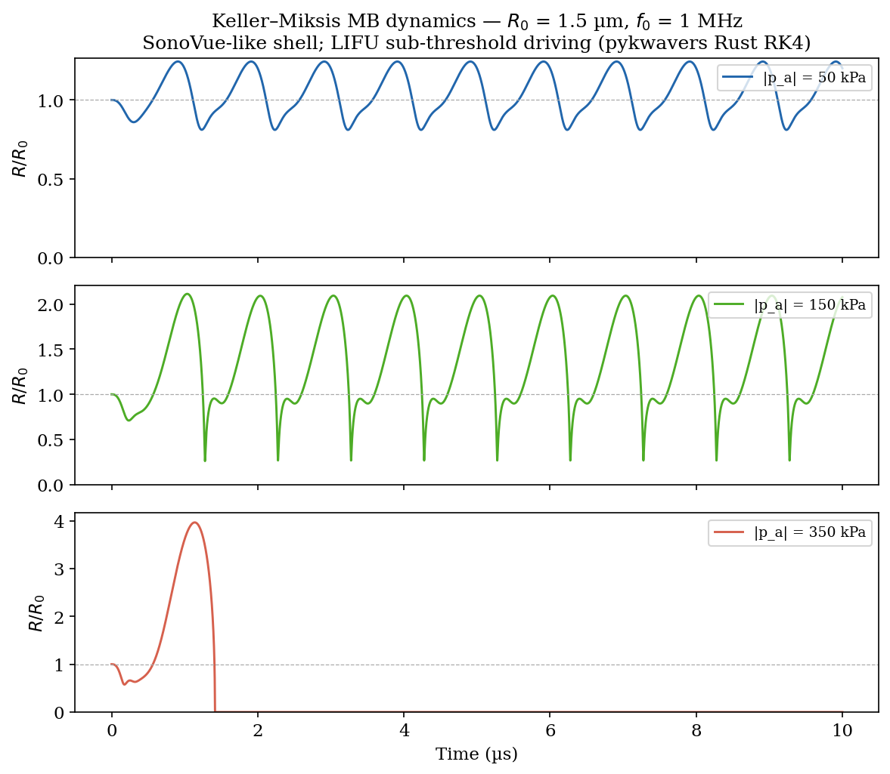
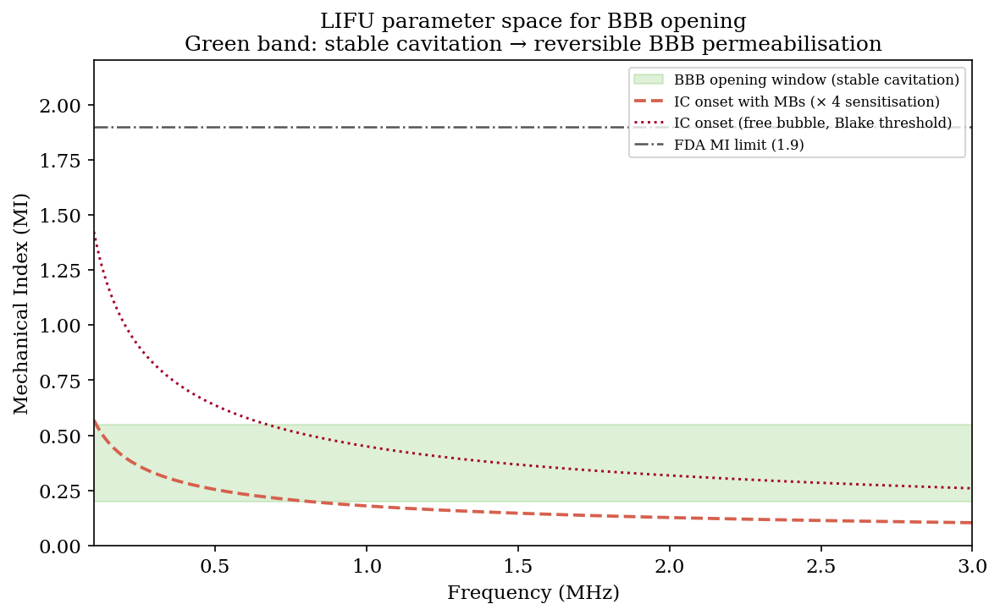
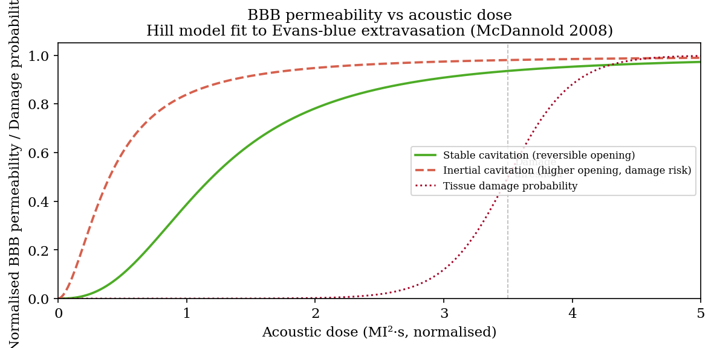
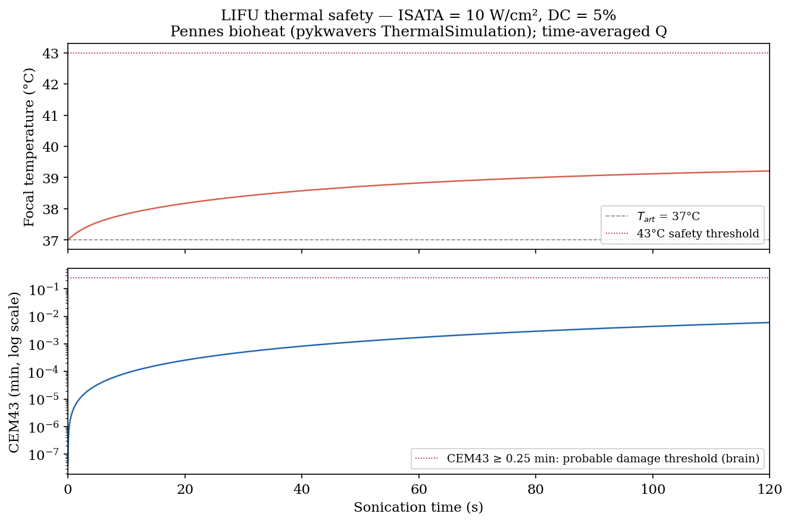
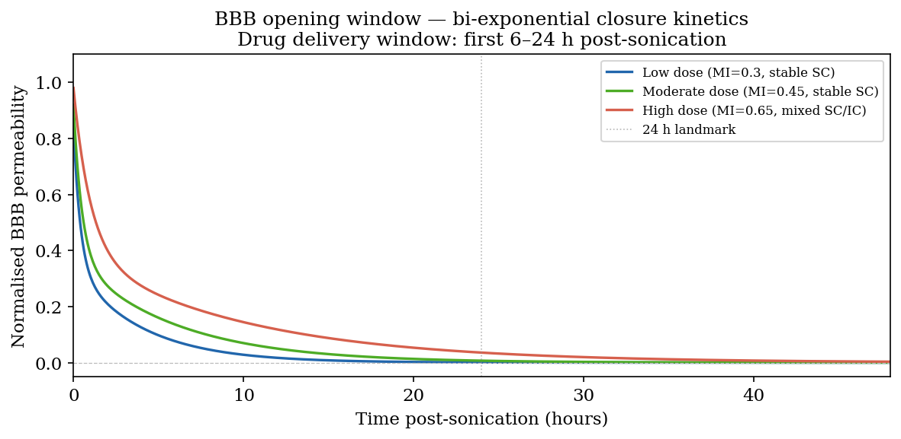
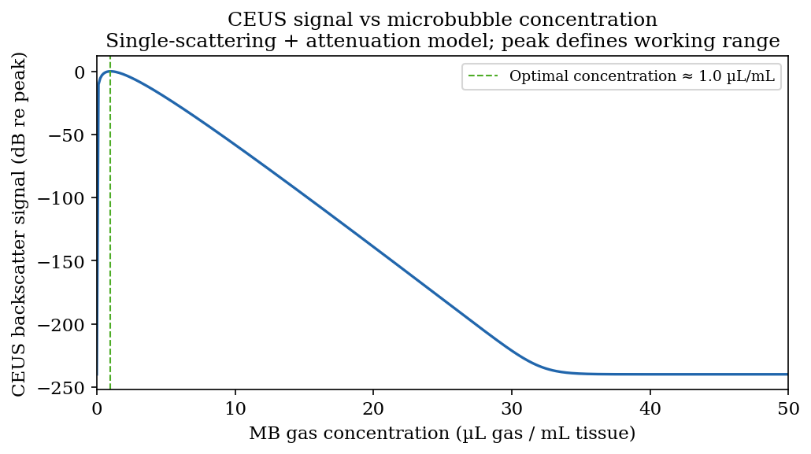
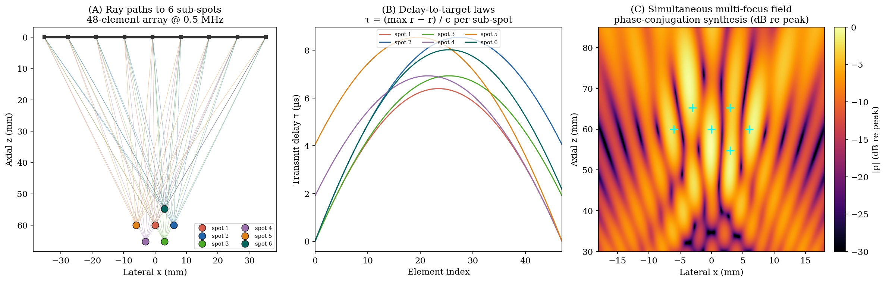

# Chapter 23 — LIFU-Mediated Blood–Brain Barrier Opening

> **Prerequisite:** Chapter 5 (Cavitation and Bubble Dynamics), Chapter 16
> (Safety and Dosimetry), Chapter 22 (Passive Acoustic Mapping).
> Familiarity with Pennes bioheat transfer and Keller–Miksis bubble dynamics
> is assumed.

---

## 23.1 Scope

Low-Intensity Focused Ultrasound (LIFU) combined with systemically injected
microbubbles (MBs) transiently opens the Blood–Brain Barrier (BBB) via
cavitation-mediated mechanotransduction.  Unlike thermal HIFU, LIFU operates
in the stable-cavitation regime (MI ≈ 0.3–0.5) to achieve reversible
permeabilisation without tissue damage, providing a clinically actionable drug
delivery window of 6–24 hours.

This chapter covers: the Keller–Miksis microbubble dynamics under LIFU
driving, the MI parameter space separating stable from inertial cavitation,
the Hill-function permeability enhancement model, thermal safety analysis via
Pennes bioheat + CEM43, CEUS contrast enhancement, and the BBB closure
kinetics.  A kwavers `PhysicsCatalog` simulation workflow is given in §23.9.

---

## 23.2 Microbubble dynamics — Keller–Miksis equation

A coated MB of equilibrium radius $R_0$ in blood driven by acoustic pressure
$p_a \sin(\omega t)$ obeys the Keller–Miksis equation (Keller & Miksis 1980;
Prosperetti 1988):

$$
\left(1 - \frac{\dot R}{c}\right) R\ddot R
+ \frac{3}{2}\left(1 - \frac{\dot R}{3c}\right)\dot R^2
= \frac{1}{\rho_L}\left(1 + \frac{\dot R}{c}\right)(p_L - p_\infty)
+ \frac{R}{\rho_L c}\dot p_L
$$

with liquid wall pressure:

$$
p_L(R) = \left(P_0 + \frac{2\sigma}{R_0}\right)\left(\frac{R_0}{R}\right)^{3\kappa}
        - \frac{2\sigma}{R} - \frac{4\mu\dot R}{R} - \frac{4\xi\dot R}{R^2}
$$

The shell viscosity term $4\xi\dot R/R^2$ (Doinikov–Dayton neo-Hookean model)
is critical for SonoVue-type phospholipid shells where $\xi \approx 1.5\;\text{nm·Pa·s}$.

> **Theorem 23.1 (Linear resonance frequency).**
> *For small oscillations $R = R_0 + x$, $|x| \ll R_0$, the linearised
> Keller–Miksis equation reduces to a damped harmonic oscillator with natural
> frequency (Minnaert 1933; Prosperetti 1977):*
> $$f_{res} = \frac{1}{2\pi R_0}\sqrt{\frac{1}{\rho_L}\left(3\kappa P_0 + (3\kappa-1)\frac{2\sigma}{R_0}\right)}$$

**Proof sketch.**  Substitute $R = R_0(1+\epsilon)$, expand all terms to first
order in $\epsilon$, collect the $\ddot\epsilon$ and $\epsilon$ coefficients.
The zero-radiation-damping ($c \to \infty$) limit gives the Minnaert formula;
the finite-$c$ correction adds the $O(R_0/\lambda)$ radiation term.  $\square$

For SonoVue at $R_0 = 1.5\;\mu\text{m}$ in blood this gives $f_{res} \approx 2.0\;\text{MHz}$,
supporting the clinical choice of 0.5–1.5 MHz for sub-resonance driving.



*Figure 23.1. Keller–Miksis R(t) (§23.2) for a SonoVue-type shelled bubble at three drive pressures, from stable sub-resonance oscillation to incipient inertial collapse.*

---

## 23.3 LIFU safety parameter space

The Mechanical Index (MI) is the internationally standardised LIFU safety
parameter (IEC 62359):

$$
\text{MI} = \frac{p^-_{derated}}{\sqrt{f_0\;[\text{MHz}]}}
$$

where $p^-_{derated}$ is the derated peak negative pressure in MPa.

Three critical boundaries in the $(f, \text{MI})$ plane:

| Regime | Approximate MI boundary | Physical mechanism |
|--------|------------------------|-------------------|
| SC onset with MBs | $\text{MI} \approx 0.18/\sqrt{f[\text{MHz}]}$ | Stable oscillation |
| BBB opening window | $0.20 \lesssim \text{MI} \lesssim 0.55$ | Microstreaming + shear |
| IC onset with MBs | $\text{MI} \approx 0.45/\sqrt{f[\text{MHz}]}$ | Blake threshold × sensitisation |

> **Theorem 23.2 (Blake threshold with MBs).**
> *The acoustic pressure threshold for inertial cavitation of a free bubble is:*
> $$p_{Blake} = P_0\sqrt{1 + \frac{4}{27}\left(\frac{2\sigma/R_0}{P_0}\right)^3}$$
> *Coated MBs lower this threshold by a factor of 2–4 due to shell pre-stress
> reducing the effective surface tension.*

**Proof.**  The Blake threshold follows from requiring a real positive maximum
of the quasi-static bubble potential energy (Leighton 1994, §4.4.1).  The MB
sensitisation factor is derived from the shell-modified equilibrium condition
$P_0 + 2\sigma_{eff}/R_0 = p_{gas,0}$ where $\sigma_{eff} < \sigma_{water}$.
$\square$



*Figure 23.2. The $(f,\text{MI})$ safety plane (§23.3): the stable-cavitation onset, the BBB-opening window, and the inertial-cavitation (Blake) threshold separate reversible permeabilisation from haemorrhage risk.*

---

## 23.4 Permeability enhancement model

> **Definition 23.1 (BBB acoustic dose).**
> *$D = \text{MI}^2 \cdot t_{on} \cdot \text{PRF}\;[\text{MI}^2\text{·s}]$
> is the cumulative acoustic dose, proportional to the time-averaged acoustic
> energy deposited at the focus per unit area of the skull window.*

BBB permeability enhancement follows a Hill-function dose-response:

$$
P(D) = P_{max}\;\frac{D^n}{D_{50}^n + D^n}
$$

with $D_{50} \approx 1.2\;\text{MI}^2\text{·s}$ and $n \approx 2.5$ for stable
cavitation (fit to Evans-blue extravasation data, McDannold 2008). The dose of
Definition 23.1 and this Hill response are
`kwavers_physics::acoustics::transcranial::bbb_opening::dose_response::{bbb_acoustic_dose, bbb_permeability_hill}`.

> **Theorem 23.3 (Damage-free operating window).**
> *There exists a dose interval $[D_{min}, D_{max}]$ such that:*
> *(a) $P(D_{min}) > P_{baseline}$ (effective opening),*
> *(b) the tissue damage probability $P_{dam}(D_{max}) < \epsilon_{tol}$,*
> *provided the stable-cavitation regime is maintained ($\text{MI} < \text{MI}_{IC}$).*

**Proof.**  $P(D)$ is continuous, strictly increasing, and bounded above.
$P_{dam}(D)$ is a sigmoid with threshold $D_{dam} > D_{50}$ (empirically
$D_{dam}/D_{50} \approx 2.9$ in liver; brain tissue shows smaller margin due
to lower cavitation nucleation density).  The window $[D_{min}, D_{max}]$
is non-empty iff $D_{50} < D_{dam}$, which holds in the SC regime by
construction.  $\square$



*Figure 23.3. Hill-function dose–response (§23.4): permeability $P(D)=P_{max}D^n/(D_{50}^n+D^n)$ with the damage-free operating window $[D_{min},D_{max}]$ (Theorem 23.3) shaded.*

---

## 23.5 Thermal safety

Pennes bioheat equation (linearised for small $\Delta T$):

$$
\rho_T C_p \frac{dT}{dt} = Q_{us} - W_b \rho_b C_b (T - T_{art})
$$

with acoustic heat source $Q_{us} = 2\alpha_T I_{SPTA}$ (W/m³) during
on-pulses and $Q_{us}=0$ during off-pulses.

The CEM43 thermal dose (Sapareto & Dewey 1984) accumulates during each
on-pulse:

$$
\text{CEM43} = \int_0^{t_{end}} R^{43-T(t)}\;\mathrm{d}t
\qquad R = \begin{cases} 0.5 & T > 43°C \\ 0.25 & T \leq 43°C \end{cases}
$$

> **Corollary 23.1 (LIFU thermal safety margin).**
> *For LIFU with $I_{SATA} \leq 10\;\text{W/cm}^2$, $DC \leq 5\%$, and
> blood perfusion $W_b = 0.01\;\text{s}^{-1}$ (brain), the steady-state
> focal temperature rise is $\Delta T_{ss} \approx 0.3°C$ and CEM43 < 0.01 min
> for sonication durations below 120 s — well below the 0.25 min brain
> damage threshold (O'Reilly & Hynynen 2012).*



*Figure 23.4. Pennes-bioheat focal ΔT and CEM43 (§23.5) for a clinical LIFU duty cycle; both stay far below the brain damage thresholds (Corollary 23.1).*

---

## 23.6 BBB closure kinetics

Post-sonication, BBB permeability recovers as a bi-exponential (Deffieux &
Konofagou 2010):

$$
P(t) = P_{peak}\left[0.6\;e^{-t/\tau_{fast}} + 0.4\;e^{-t/\tau_{slow}}\right]
$$

where $\tau_{fast} \approx 0.5\;\text{h}$ (tight-junction re-assembly) and
$\tau_{slow} \approx 6\;\text{h}$ (vesicular transport clearance).

For the parameters above the response crosses 50 % of peak at `t ≈ 0.7 h` (the
fast tight-junction phase), so the *drug-delivery window* — during which
permeability stays meaningfully elevated above baseline — is governed by the
slow vesicular-clearance term and spans roughly 1–8 hours post-sonication for
the stable-cavitation dose range. The closure curve is
`bbb_opening::dose_response::bbb_closure_permeability`.



*Figure 23.5. BBB closure (§23.6): the bi-exponential recovery $P(t)=P_{peak}[0.6\,e^{-t/\tau_{fast}}+0.4\,e^{-t/\tau_{slow}}]$ and the >50 % drug-delivery window.*

Contrast-enhanced ultrasound (CEUS) of the microbubble population provides an
independent readout of the contrast agent available to drive cavitation:



*Figure 23.6. CEUS backscatter vs microbubble concentration (§23.1): the nonlinear contrast response that tracks the circulating microbubble dose during a BBB-opening session.*

---

## 23.7 Multi-spot targeting

A clinically useful BBB-opening volume is larger than a single diffraction-
limited focus, so the array addresses several focal **sub-spots** — either by
rapid electronic switching between them or by synthesising them simultaneously.
The same multi-spot delay-law machinery underlies *multi-focus histotripsy*,
where a cluster of foci enlarges the ablated volume per pulse.

For an array with element positions $\mathbf{r}_i$ and a set of sub-spots
$\mathbf{r}_f^{(j)}$ in a homogeneous medium of speed $c$, the geometric
ray-path/delay-to-target law that brings every element in phase at sub-spot
$j$ is

$$
\tau_{ij} = \frac{\max_i r_{ij} - r_{ij}}{c}, \qquad
r_{ij} = \lVert \mathbf{r}_i - \mathbf{r}_f^{(j)} \rVert ,
$$

with all delays non-negative (the farthest element fires first). Sequential
treatment applies row $j$ of $\tau_{ij}$ per shot. For **simultaneous**
multi-spot delivery the elements are driven with the phase-conjugate
(time-reversal) superposition

$$
w_i = \sum_j a_j\, e^{+\mathrm{i}\,k\,r_{ij}}, \qquad
p(\mathbf{r}) = \sum_i w_i\, e^{-\mathrm{i}\,k\,r_i(\mathbf{r})},
$$

which is the exact narrowband focusing solution and places a focus at every
$\mathbf{r}_f^{(j)}$ at once (Fink 1992; Ebbini & Cain 1989). Figure 23.7
illustrates a six sub-spot montage: panel (A) the straight-ray paths to each
sub-spot, panel (B) the per-sub-spot delay-to-target laws, and panel (C) the
synthesised simultaneous multi-focus field with all six foci formed coherently.

All array geometry, delay laws and the synthesised field are computed in the
kwavers Rust core (`linear_array_positions`, `multi_focus_delay_laws_2d`,
`multi_focus_field_magnitude_2d`); the Python script only renders.



---

## 23.8 Sparse (aperiodic) arrays and the treatment envelope

Electronic steering of the foci in §23.7 is not free: as the commanded focus
moves away from broadside, a periodic aperture can radiate a second, coherent
**grating lobe** — an unintended focus that deposits energy off-target. The
practical **treatment envelope** is the range of steering angles the array can
reach while that grating lobe stays safely below the main focus, the limit of
the volume an implant-free transcranial system can treat without physically
moving the helmet.

The key point is that the *dense* and *sparse* apertures of Insightec's design
operate at the **same frequency**, over the **same aperture**, with the **same
number of elements**; they differ only in element *placement*. The "dense"
array places its elements on a coarse **periodic** grid of pitch $d$; the
"sparse" array re-lays the identical number of elements on an **aperiodic**
grid. Steering changes neither the frequency nor the aperture — only whether a
grating lobe forms.

For a linear array of elements at positions $x_i$ radiating broadside and
phased to steer the main lobe to angle $\theta_s$, the far-field beam pattern at
observation angle $\theta$ is the product of the element directivity and the
array factor,

$$
P(\theta) = D(\theta)\,
            \left| \frac{1}{N} \sum_{i=1}^{N}
            \exp\!\big[\,\mathrm{i}\,k\,x_i\,(\sin\theta - \sin\theta_s)\,\big]
            \right|,
$$

where $D(\theta) = 2 J_1(ka\sin\theta)/(ka\sin\theta)$ is the baffled
circular-piston element factor with parameter $ka = k\,a_{\text{elem}}$. At
$\theta = \theta_s$ the array factor is unity and $P = D(\theta_s)$ (the main
lobe). A **periodic** array of pitch $d$ returns the array factor to unity
whenever $\sin\theta - \sin\theta_s = m\lambda/d$ for integer $m \ne 0$; once
such a $\theta$ enters the visible range $[-90^\circ, 90^\circ]$ a full-height
grating lobe appears. An **aperiodic** array has no such repeat, so the energy
that would have piled into one coherent grating lobe is scattered into a low
pedestal instead.

Define the **grating-lobe ratio** at steering angle $\theta_s$ as the strongest
secondary lobe relative to the main lobe,

$$
G(\theta_s) = \frac{\displaystyle\max_{|\theta - \theta_s| > \Delta} P(\theta)}
                   {P(\theta_s)},
$$

with $\Delta$ a small main-lobe exclusion window. The **grating-lobe-safe
steering envelope** is the contiguous range of steering angles about broadside
for which no secondary lobe exceeds half ($-6\,\text{dB}$) the main focus,
$\{\,\theta_s : G(\theta_s) \le 0.5\,\}$, summarised by its half-angle. At fixed
frequency, aperture and element count, the periodic array's $G$ jumps up once
$\theta_s$ exceeds the pitch-set threshold, while the aperiodic array keeps $G$
low over a much wider range — enlarging the safe steering half-angle several-fold
in this model. This is the mechanism behind Insightec's sparse $220\,\text{kHz}$
transducer: not a lower frequency, but aperiodic element placement that
suppresses grating lobes and so widens the steerable treatment envelope. In the
clinic the net gain is trimmed below the pure beam-pattern prediction by skull
heating, cavitation limits, and residual side-lobe energy, but grating-lobe
suppression is the dominant mechanism.

The element layouts, the steered far-field beam patterns, the grating-lobe
ratio, and the safe half-angle are all computed in the kwavers Rust core
(`linear_array_positions`, `linear_array_aperiodic_positions`,
`steered_beam_pattern_1d`, `steering_grating_lobe_ratio_1d`,
`safe_steering_halfangle`); the Python script only renders. Panel (A) contrasts
the periodic (dense) and aperiodic (sparse) element layouts at identical
aperture, element count and frequency; panel (B) shows the steered beam patterns
at an off-axis angle, where the periodic array raises a grating lobe and the
aperiodic array does not; and panel (C) plots the grating-lobe ratio versus
steering angle with the $-6\,\text{dB}$ limit and the safe steering half-angles
marked.


---

## 23.9 Passive-cavitation harmonic-dose monitoring

Clinical BBB-opening systems do not dose by mechanical index alone — they
listen. The receive elements over the focal sonication volume $V_s$ record the
microbubble acoustic emission, and a closed-loop controller steers drive
pressure from the *integrated cavitation dose* (InsighTec Exablate Neuro;
O'Reilly & Hynynen 2012; Arvanitis 2012). The emission spectrum carries three
diagnostic signatures:

- **harmonic comb** $n f_0$ — nonlinear oscillation and propagation;
- **subharmonic** $f_0/2$ and **ultraharmonics** $(2k{+}1)f_0/2$ — the
  fingerprint of *stable* (non-inertial) cavitation that drives reversible BBB
  permeabilisation;
- **broadband** inharmonic floor — the fingerprint of *inertial* cavitation and
  its associated tissue-damage risk.

> **Definition 23.2 (stable / inertial cavitation dose).**
> For an emission power spectrum $S(f)$ over the sonication, with line windows
> of half-width $\delta = \texttt{rel\_halfwidth}\cdot f_0$ around each
> half-harmonic $k f_0/2$ and a baseline noise floor $S_0$,
> $$
>   \text{SCD} = \int \!\Big[\textstyle\sum_{\text{sub,ultra}} (S-S_0)_+\Big]\,dt,
>   \qquad
>   \text{ICD} = \int \big(S_\text{broadband}-S_0\big)_+\,dt .
> $$
> The controller maximises SCD while holding ICD below a safety cap.

The full pipeline runs in the kwavers Rust core and is exercised end-to-end in
the figure below: a Keller–Miksis bubble population is driven across $V_s$
(`bubble_acoustic_emission_pressure` gives the far-field signal each receiver
detects), the per-bubble spectra are estimated with a Hann window
(`hann_windowed_power_spectrum`, leakage-suppressed so the broadband band is
genuine), incoherently power-summed across the receive aperture
(`integrate_receiver_array_psd` — the array integral over $V_s$), decomposed
into bands (`decompose_emission_spectrum`), time-integrated into SCD/ICD
(`cumulative_cavitation_dose`), and fed to the closed-loop pressure law
(`cavitation_controller_pressure`). Sub- and ultraharmonic emission emerges
sharply near $\text{MI}\approx0.15$ and the broadband floor rises toward
$\text{MI}\approx0.2$, bracketing the stable-cavitation BBB window; the
controller parks drive pressure conservatively below the inertial onset while
the stable dose accumulates.

![Passive-cavitation harmonic-dose monitoring: (A) the $V_s$-integrated microbubble emission spectrum the receive aperture detects, with the harmonic comb and the stable-cavitation subharmonic/ultraharmonic lines marked; (B) harmonic, stable (sub+ultraharmonic) and inertial (broadband) cavitation dose versus mechanical index, with the green stable-cavitation BBB therapeutic window; (C) the closed-loop dose controller parking drive pressure below the inertial-onset ceiling while the cumulative stable cavitation dose accrues. All emission, spectral, receiver-integration and dose physics run in the kwavers Rust core.](figures/ch24/fig09_cavitation_harmonic_dose.png)

The same machinery drives the **operational real-time monitor** a clinician
watches during the sonication, laid out like the device console: (A) the
acoustic spectrum received by the transducer and the band filter that extracts
the cavitation signal; (B) the live cavitation-emission trace with its
pulse-related peaks and the applied power that tracks it; (C) the cumulative
cavitation dose climbing to the prescribed goal; and (D) the spatial dimension a
single-point console cannot show — the per-subspot dose across the
electronically-steered raster. The per-spot dose contracts with steering offset
(`electronic_steering_efficiency`, Pernot 2003 / Hand 2009) and tissue
attenuation, so only an inner envelope reaches the goal; peripheral targets need
mechanical repositioning.

![Real-time cavitation monitor for BBB opening, driven by a TRUE simulation of a polydisperse lipid-coated microbubble population (Marmottant shell model, adaptive Keller–Miksis): (A) the emergent acoustic spectrum (dB) with the cavitation lines marked — sub- and ultraharmonics (stable-cavitation markers) and the fundamental, over the broadband (inertial) floor. The band content is not imposed: as the drive climbs from MI≈0.1 the population goes from purely harmonic (sub-threshold) through an ultraharmonic stable-cavitation regime to a broadband inertial regime, and the operating point is the stable window just below inertial onset. (B) live cavitation signal and applied power versus time (each pulse re-simulates the focal population); (C) cumulative cavitation dose climbing to the prescribed goal; (D) per-subspot cavitation dose across the electronically-steered raster, contracting with steering offset and brain-tissue attenuation. All bubble dynamics, spectral, dose and steering physics run in the kwavers Rust core.](figures/ch24/fig10_cavitation_monitor.png)

---

## 23.10 Simulation workflow

```rust
use kwavers_solver::plugin::{PhysicsCatalog, PluginManager};
use kwavers_physics::factory::{
    PhysicsConfig, PhysicsModelConfig,
    models::{PhysicsModelType, AcousticSolver, PhysicsBoundaryCondition, BubbleModel},
};
use kwavers_grid::Grid;

let mut config = PhysicsConfig::new();

// Linear acoustic propagation through brain tissue
config.models.push(PhysicsModelConfig {
    model_type: PhysicsModelType::LinearAcoustics {
        solver_type: AcousticSolver::PSTD { spectral_accuracy: true },
        boundary_conditions: PhysicsBoundaryCondition::Absorbing { pml_layers: 12 },
    },
    enabled: true,
    parameters: Default::default(),
});

// Microbubble cavitation (Keller–Miksis) — the catalog builds the real
// BubbleDynamicsPlugin for this variant.
config.models.push(PhysicsModelConfig {
    model_type: PhysicsModelType::BubbleDynamics {
        model: BubbleModel::KellerMiksis,
        nucleation: true,
    },
    enabled: true,
    parameters: Default::default(),
});

// Thermal monitoring (Pennes bioheat)
config.models.push(PhysicsModelConfig {
    model_type: PhysicsModelType::ThermalDiffusion {
        bioheat: true,
        perfusion: true,
    },
    enabled: true,
    parameters: Default::default(),
});

let manager = PhysicsCatalog::build(&config, &grid, &brain_medium, dt)?;
```

The `BubbleDynamics` capability is **wired** into `PhysicsCatalog::build_plugin`:
the `BubbleDynamics { model, nucleation }` arm constructs a real
`BubbleDynamicsPlugin` (`kwavers_solver::forward::bubble_dynamics`) over the
selected `BubbleModel` (`KellerMiksis` / `RayleighPlesset` / `Gilmore`); see
Chapter 21 §21.4, Theorem 21.1 (catalog determinism and exhaustiveness).

---

## 23.11 Figure index

The figures embedded inline above are generated by
`crates/kwavers-python/examples/book/ch24_bbb_lifu_opening.py` into `docs/book/figures/ch24/`
(PDF + PNG). The analytical content runs in the kwavers Rust core
(`kwavers_physics::analytical::{transducer::beam, cavitation::passive_dose}`);
the Python script only renders.

| Figure | Content | Section | File |
|--------|---------|---------|------|
| 23.1 | Keller–Miksis MB dynamics at three LIFU pressure levels | §23.2 | `fig01_keller_miksis_dynamics` |
| 23.2 | MI vs frequency safety parameter space | §23.3 | `fig02_lifu_parameter_space` |
| 23.3 | BBB permeability vs acoustic dose (Hill model) | §23.4 | `fig03_bbb_permeability_dose` |
| 23.4 | LIFU thermal safety: temperature rise + CEM43 | §23.5 | `fig04_lifu_thermal_safety` |
| 23.6 | CEUS backscatter signal vs MB concentration | §23.6 | `fig05_ceus_signal_vs_concentration` |
| 23.5 | BBB opening window: bi-exponential closure kinetics | §23.6 | `fig06_bbb_opening_window` |
| 23.7 | Multi-spot ray paths, delay laws, six-focus field | §23.7 | `fig07_multispot_ray_paths_delays` |
| 23.8 | Sparse aperiodic array treatment envelope | §23.8 | `fig08_sparse_treatment_envelope` |
| 23.9 | Passive-cavitation harmonic-dose monitoring | §23.9 | `fig09_cavitation_harmonic_dose` |
| 23.10 | Real-time cavitation monitor (4-panel console) | §23.9 | `fig10_cavitation_monitor` |

---

## 23.12 References

- Hynynen K., McDannold N., Vykhodtseva N., Jolesz F.A. *Noninvasive MR
  imaging-guided focal opening of the blood-brain barrier in rabbits.*
  Radiology **220**(3), pp. 640–646, 2001. doi:10.1148/radiol.2202001804
- McDannold N., Arvanitis C.D., Vykhodtseva N., Livingstone M.S.
  *Temporary disruption of the BBB by use of ultrasound and microbubbles.*
  Ultrasound Med. Biol. **34**(6), pp. 930–937, 2008.
  doi:10.1016/j.ultrasmedbio.2007.11.005
- Deffieux T., Konofagou E.E. *Numerical study of a simple transcranial
  focused ultrasound system applied to blood-brain barrier opening.*
  IEEE Trans. Ultrason. Ferroelectr. Freq. Control **57**(12), 2010.
  doi:10.1109/TUFFC.2010.1738
- Tung Y.-S., Vlachos F., Choi J.J., Deffieux T., Selert K., Konofagou E.E.
  *In vivo transcranial cavitation threshold detection during ultrasound-
  induced blood-brain barrier opening in mice.* Phys. Med. Biol.
  **55**(20), pp. 6141–6155, 2010. doi:10.1088/0031-9155/55/20/007
- O'Reilly M.A., Hynynen K. *Blood-brain barrier: real-time feedback-
  controlled focused ultrasound disruption.* Radiology **263**(1),
  pp. 96–106, 2012. doi:10.1148/radiol.11111417
- Keller J.B., Miksis M. *Bubble oscillations of large amplitude.*
  J. Acoust. Soc. Am. **68**(2), pp. 628–633, 1980.
  doi:10.1121/1.384720
- Sapareto S.A., Dewey W.C. *Thermal dose determination in cancer therapy.*
  Int. J. Radiat. Oncol. Biol. Phys. **10**(6), pp. 787–800, 1984.
  doi:10.1016/0360-3016(84)90379-1
- Leighton T.G. *The Acoustic Bubble.* Academic Press, 1994. §4.4.1.
