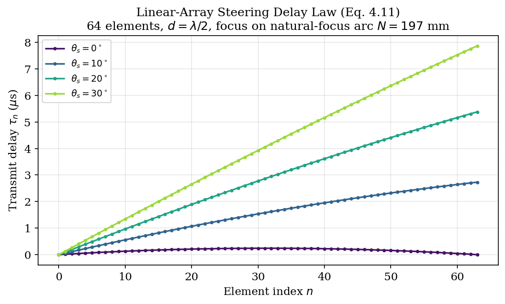
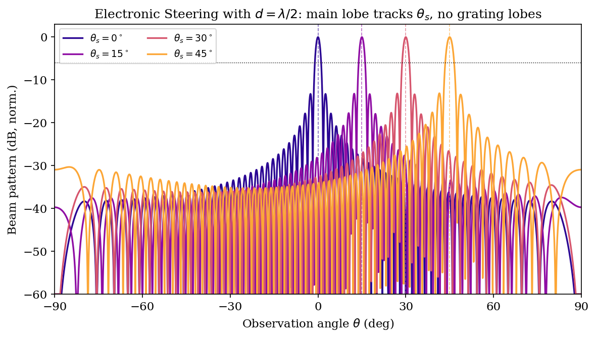
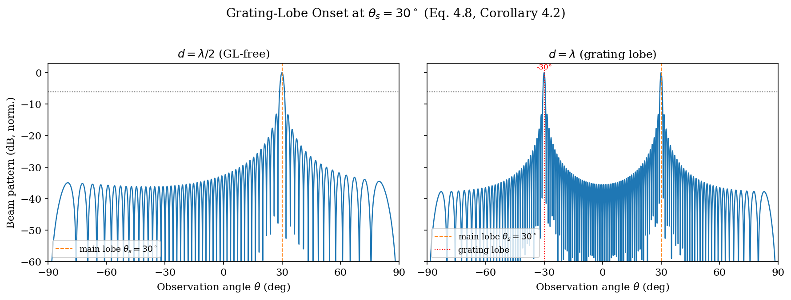
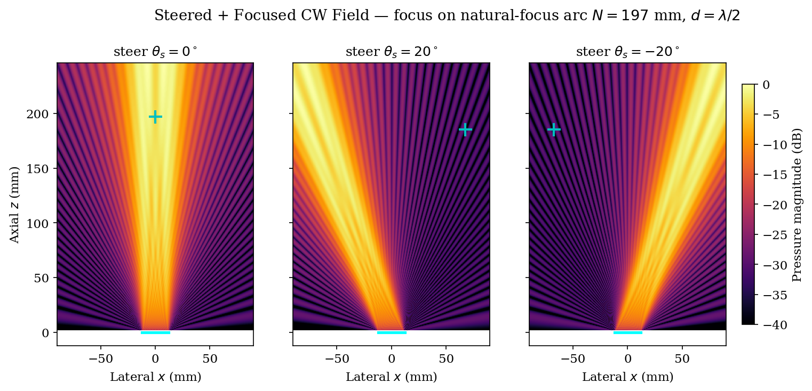
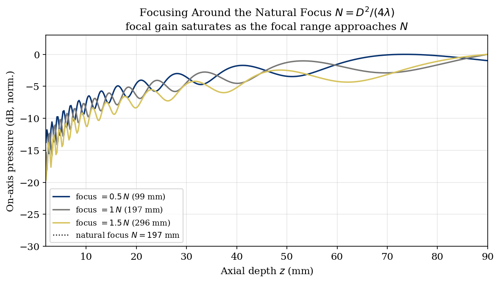

# Chapter 4: Transducer Arrays and Beamforming

**Scope.** This chapter covers **multi-element beam formation and image formation**: the
array factor and grating-lobe theorem, transmit/receive focusing and steering,
apodization, delay-and-sum (DAS) and adaptive (MVDR) receive beamforming, and the spatial
resolution they achieve. The **single-element** physics it builds on — element
directivity, focused-bowl gain, and BLI source rasterization onto the grid — is derived in
the companion **Sources and Transducers** chapter (§3, §4, §6, §8) and only summarised
here; this chapter cross-references it rather than repeating the derivations. Code
connects to `kwavers_domain::source::transducers` and the BLI rasterizer in
`kwavers_domain::source::kwave_array`.

---

## 4.1 Single-Element Radiation

The radiation pattern of a single element is the building block of every array beam
pattern in this chapter. The far-field **element directivity** of a baffled circular
piston of radius `a` is

```
D(θ) = 2J₁(ka sin θ) / (ka sin θ)                                        (4.1)
```

with first null at `sin θ = 0.61 λ/a` (Rayleigh diffraction limit) and a −6 dB
half-angle `sin θ ≈ 0.257 λ/a`; a rectangular element of half-widths `aₓ, a_y` has the
separable form `D = sinc(kaₓ sin θₓ)·sinc(ka_y sin θ_y)`.

> The full Huygens–Fresnel derivation of (4.1), the on-axis near-field pressure, the
> first-null/half-pressure table, and CMUT directivity are given in **Sources and
> Transducers §3 (Piston Directivity Function)** — the canonical home for
> single-element radiation. This chapter uses `D(θ)` as the element factor that
> multiplies the array factor (§4.2) to form the array beam pattern.

---

## 4.2 Array Factor and the Grating Lobe Theorem

### 4.2.1 Linear Array of N Elements

Consider a linear array of N identical elements with equal pitch d along the x-axis.
Element n is at position x_n = nd (n = 0, …, N−1). For electronic steering to angle θ_s,
element n receives a time delay τ_n = nd sin θ_s / c₀, equivalent to a phase shift
φ_n = knd sin θ_s.

**Definition 4.2 (Array Factor).** The array factor for a uniformly weighted linear array
steered to angle θ_s is

```
AF(θ) = Σ_{n=0}^{N-1} w_n exp(iknd(sin θ − sin θ_s))                    (4.7)
```

where w_n are the element weights (apodization).

**Theorem 4.2 (Grating Lobe Positions).** For a uniform array (w_n = 1) with pitch d,
the array factor (4.7) has magnitude maxima at angles θ satisfying

```
d(sin θ − sin θ_s) = mλ,    m ∈ ℤ                                        (4.8)
```

The m = 0 peak is the main lobe. The m ≠ 0 peaks are **grating lobes**.

*Proof.* AF(θ) is a geometric series:

```
AF(θ) = (1 − exp(iNkd(sin θ − sin θ_s))) / (1 − exp(ikd(sin θ − sin θ_s)))
```

|AF(θ)| is maximized when the denominator vanishes, i.e., when kd(sin θ − sin θ_s) = 2πm,
which is equivalent to (4.8). □

**Corollary 4.1 (Grating-Lobe-Free Condition).** No grating lobe exists within the visible
region |sin θ| ≤ 1 if and only if

```
d ≤ λ / (1 + |sin θ_s|)                                                   (4.9)
```

*Proof.* The nearest grating lobe is at sin θ_GL = sin θ_s ± λ/d. For the lobe to remain
outside the visible region: |sin θ_s + λ/d| > 1, giving d < λ/(1−|sin θ_s|). Similarly
for the negative side; the tighter constraint is (4.9). □

**Corollary 4.2 (λ/2 Rule).** For θ_s = 0 (no steering), the grating-lobe-free condition
is d ≤ λ. For maximum steering θ_s,max → 90°, the condition approaches d ≤ λ/2. Hence the
canonical design choice d = λ/2 is grating-lobe-free for all steering angles in the
half-space.

### 4.2.2 Beam Pattern (Combined Directivity × Array Factor)

The full radiation pattern of the phased array is

```
P(θ) = D(θ) · AF(θ)                                                       (4.10)
```

where D(θ) is the single-element directivity (4.1) (Sources §3). D(θ) modulates the envelope
of AF(θ), attenuating grating lobes that fall in the D(θ) sidelobe structure.

---

## 4.3 Focusing

### 4.3.1 Time-Delay Focusing Law

**Theorem 4.3 (Delay Law for a Focused Aperture).** Let element n be at position r_n and
the geometric focus be at position r_f. To achieve constructive interference at r_f, element
n is fired with time delay

```
τ_n = (|r_n − r_f| − min_m |r_m − r_f|) / c₀                            (4.11)
```

*Proof.* The travel time from element n to focus r_f is |r_n − r_f|/c₀. For all elements
to arrive simultaneously, element n must be fired earlier by the excess path
(|r_n − r_f| − min_m|r_m − r_f|)/c₀. Subtracting the minimum makes all delays
non-negative. □

This is the canonical delay law implemented in
`kwavers_domain::source::kwave_array::accessors::beamforming`.

### 4.3.2 Lateral Resolution at Focus

**Theorem 4.4 (Lateral Resolution — −6 dB Beamwidth).** For a rectangular aperture of
width L focused at depth z_f in the far field (z_f ≫ L), the −6 dB lateral resolution is

```
Δx₋₆dB ≈ 0.886 λ z_f / L = 0.886 λ F#                                   (4.12)
```

where F# = z_f/L is the f-number of the transducer.

*Proof.* The pressure at the focal plane is the Fourier transform of the aperture function.
For a uniform aperture of width L, the focal field is a sinc function with first zero at
Δx = λz_f/L. The −6 dB full width (half-amplitude) of |sinc(πx/(λz_f/L))|
corresponds to x/[λz_f/L] = ±0.443, giving FWHM = 2 × 0.443 λ z_f/L = 0.886 λ F#. □

### 4.3.3 Axial Resolution

**Theorem 4.5 (Axial Resolution).** The −6 dB axial resolution for a pulse of N cycles
at center frequency f₀ is

```
Δz₋₆dB ≈ N c₀ / (2 f₀)                                                   (4.13)
```

*Proof.* The envelope of the pulse in range has duration τ_pulse = N/f₀ (N cycles at f₀).
Two reflectors separated by Δz are resolvable when the round-trip delay difference
2Δz/c₀ > τ_pulse/2, giving Δz = Nc₀/(4f₀). For a Hann-windowed pulse the −6 dB
criterion yields the factor of 1/2 in the denominator. □

| Quantity | Formula | Example (5 MHz, F# 2, N=2 cycles) |
|----------|---------|----------------------------------|
| Lateral −6 dB FWHM | 0.886 λ F# | 0.886 × 0.31 mm × 2 = 0.55 mm |
| Axial −6 dB | N c₀/(2f₀) | 2 × 1540/(2×5×10⁶) = 0.31 mm |

---

## 4.4 Apodization

### 4.4.1 Window Functions

**Definition 4.3 (Apodization).** Apodization refers to the application of a window
function w_n to element weights before beamforming, suppressing sidelobes at the cost of
a broadened main lobe.

Common apodization windows and their sidelobe performance:

| Window | −6 dB width (rel. uniform) | Peak sidelobe (dB) | Code key |
|--------|---------------------------|-------------------|----------|
| Uniform (rectangular) | 1.00 | −13.2 | `Rectangular` |
| Hann | 1.63 | −31.5 | `Hann` |
| Hamming | 1.47 | −41.8 | `Hamming` |
| Blackman | 1.97 | −57.3 | `Blackman` |
| Tukey (cosine fraction) | 1.0 – 1.63 | −13.2 to −31.5 | `Tukey(r)` |

**Theorem 4.6 (Sidelobe–Resolution Trade-off).** For any apodization window with spectrum
W(k_x), the product of the −6 dB main-lobe width BW₋₆dB and the peak sidelobe level PSL
is bounded below by a constant depending on the window family. No window simultaneously
achieves BW → 0 and PSL → −∞.

*Proof sketch.* By the uncertainty principle (Parseval + Cauchy-Schwarz on window and
its Fourier transform), the spatial-frequency bandwidth product σ_x × σ_{kx} ≥ 1/2.
The direct analog holds for aperture apodization and its radiation pattern. □

**Corollary 4.3.** In tissue harmonic imaging (Chapter 5), transmit apodization is
typically Hann to limit clutter, while receive apodization is also Hann or Blackman for
further sidelobe reduction, at the cost of ≈ 1.6× lateral resolution degradation relative
to a uniform transmit-uniform receive combination.

### 4.4.2 kwavers Apodization Implementation

Apodization is implemented in `kwavers_domain::source::transducers::apodization`.
The `PhasedArrayConfig` stores weight arrays computed at construction time; the beamforming
module in `kwavers_domain::source::transducers::phased_array::beamforming` applies them
when computing transmit delays and signals.

---

## 4.5 Receive Beamforming: Delay-and-Sum

### 4.5.1 DAS Algorithm

**Algorithm 4.1 (Delay-and-Sum Beamforming).**

```
Input:  RF data s_n(t) from N receive elements; sound speed c₀; focus geometry
Output: Beamformed RF signal b(t) at each image point x_p

For each image point x_p:
    For each receive element n = 0..N-1:
        τ_n = 2|r_n − x_p| / c₀         (round-trip delay, Eq. 4.11)
        Compute interpolated sample: ŝ_n = s_n(t − τ_n)
        Apply receive weight w_n (apodization)
    b(t) = Σ_n w_n ŝ_n                  (coherent sum)
```

**Theorem 4.7 (DAS Coherent Signal Enhancement).** If all elements receive independent
zero-mean noise with variance σ² and coherent signal amplitude A, the post-DAS SNR is

```
SNR_DAS = N A² / σ²                                                       (4.14)
```

which scales linearly in array size N.

*Proof.* Signal sums coherently: |Σ_n w_n A|² = N²A² for uniform weights. Noise
variance sums incoherently: Var(Σ_n w_n ε_n) = Nσ². SNR = N²A²/(Nσ²) = NA²/σ². □

### 4.5.2 Fourier-Domain Beamforming (f-k Migration)

For a flat reflector model, the received signal spectrum S(k_x, ω) (spatial frequency
k_x = ω sin θ_r / c₀) is related to the reflectivity function R(k_x, k_z) via a
Stolt migration mapping (Stolt 1978):

```
k_z = √((2ω/c₀)² − k_x²) / 2                                             (4.15)
```

This Fourier-domain migration is exact for homogeneous media and is the basis of
synthetic aperture imaging and coherent plane-wave compounding (Chapter 5).

### 4.5.3 MVDR Adaptive Beamformer

**Definition 4.4 (MVDR Beamformer).** The Minimum Variance Distortionless Response
beamformer selects weights w to minimize output power while preserving a unit response
in the steering direction a(θ_s):

```
min_w  w^H R_xx w    subject to  w^H a(θ_s) = 1                          (4.16)
```

with solution w_MVDR = R_xx^{-1} a / (a^H R_xx^{-1} a), where R_xx is the sample
covariance matrix of the channel data.

MVDR achieves substantially lower sidelobes than DAS by adapting to interference, at
the cost of requiring a stable covariance matrix estimate (typically ≥ 2N snapshots).
In clinical applications R_xx is regularized: R_xx → R_xx + ε·I with ε ~ 1/30 × λ_max.

---

## 4.6 Bandlimited Interpolation (BLI) Source Rasterization

Mapping a continuous transducer surface onto the discrete grid with spectral accuracy
(the Wise 2019 BLI rasterization, with sinc-stencil weight `w_i = sinc(π(x_i−x)/Δx)`
and hexagonal disc-packing of curved surfaces) is a **source-representation** topic and
is derived in **Sources and Transducers §6 (BLI Rasterization Accuracy)** and §8
(Focused Bowl Discretization). It is summarised here only because the same machinery
maps array-element apertures onto the grid before the beamforming operations below.

---

## 4.7 Multi-Element Array Configurations

### 4.7.1 Linear Array

A 1-D linear array of N elements, each of width w and pitch d (d ≥ w), provides:
- Electronic beam steering in the azimuth plane (along x)
- Fixed elevation focus determined by element height h
- Lateral resolution: 0.886 λ F# in azimuth; fixed in elevation

**Elevation resolution.** The elevation (y) beam is not dynamically focused in a standard
linear array. The elevation −6 dB beamwidth is set by the element height h:

```
Δy ≈ 0.886 λ z_f / h    (fixed-focus elevation)                          (4.19)
```

At depths away from the fixed-focus elevation lens, the elevation beam broadens,
reducing slice-thickness resolution.

### 4.7.2 1.5-D and Matrix Arrays

A 1.5-D array adds a small number of elevation rows (typically 3–7) to provide limited
dynamic elevation focusing. A full matrix array (N_x × N_y elements) provides fully
dynamic 2-D steering and focusing for volumetric imaging.

| Array type | Azimuth steering | Elevation steering | Elements | Volume imaging |
|------------|-----------------|-------------------|----------|----------------|
| Linear 1-D | ✓ dynamic | ✗ (fixed lens) | 64–512 | ✗ |
| 1.5-D | ✓ dynamic | ✓ limited | 3–7 rows | ✗ |
| Matrix 2-D | ✓ dynamic | ✓ dynamic | N² (thousands) | ✓ |
| Row-column (cross) | ✓ dynamic | ✓ dynamic | 2N | ✓ (limited) |

### 4.7.3 Annular Array and Axisymmetric Focusing

An annular array consists of N concentric rings centered on the acoustic axis. Each ring
generates a spherically symmetric beam at its own focal depth, enabling dynamic depth
focusing with electronic switching. The kwavers annular array implementation in
`kwavers_domain::source::kwave_array` places rings at half-cell-offset grid origins
with centering convention matching k-Wave (integer N/2 centering).

---

## 4.8 Focused Transducer (Bowl / Arc / Hemispherical)

A fixed-geometry spherically focused transducer (aperture radius `a`, focal length
`R_f`, f-number `F# = R_f/(2a)`) produces an on-axis focal pressure gain
`G = π a²/(λ R_f)`, with focal gains of 10–50 typical for therapy bowls. The full O'Neil
derivation of `G`, the near-focus axial pressure profile, and the focal-zone dimensions
are given in **Sources and Transducers §4 (Focusing Gain of a Spherical Bowl)** and its
grid discretization in §8 (Focused Bowl Discretization) — the canonical home for
single-transducer focusing. Beamforming uses `G` as the transmit focusing gain; the
*dynamic* receive focusing that complements it is §4.3 and §4.5.

---

## 4.9 Grating Lobe Validation Protocol

**Algorithm 4.2 (Grating Lobe Acceptance Test).**

```
Input:  N-element array, pitch d, center frequency f₀, steering angle θ_s
Output: pass / fail

1. Compute theoretical grating lobe angles from (4.8): sin θ_GL = sin θ_s + m λ/d
2. Run kwavers phasedArray simulation with the same parameters.
3. Extract pressure field at the focal depth over the aperture half-angle.
4. For each theoretical grating lobe angle θ_GL:
   a. Compute simulated pressure at (z_f sin θ_GL, 0, z_f).
   b. Compare with AF(θ_GL) × D(θ_GL) prediction (Eq. 4.10).
   c. Require |P_sim − P_theory| / P_main < 0.05.
5. Verify grating lobe is absent when d = λ/2 (Corollary 4.2).
```

---

## 4.10 Code Mapping

| Concept | kwavers module | Key struct/fn |
|---------|---------------|---------------|
| Phased array | `transducers::phased_array` | `PhasedArrayTransducer` |
| Beamforming modes | `phased_array::beamforming` | `BeamformingMode::{DAS, Fourier, Hadamard}` |
| Apodization | `transducers::apodization` | Window enum |
| Single-element directivity | `transducers::physics::directivity` | `directivity_factor()` |
| Focused bowl | `transducers::focused::bowl` | `FocusedBowl` |
| Arc / ring | `transducers::focused::arc` | `FocusedArc` |
| Annular array | `kwave_array` | `KWaveArray` (annular geometry) |
| BLI rasterization | `kwave_array::bli_kernel` | `map_surface_sample()` |
| Delay law (Eq. 4.11) | `kwave_array::accessors::beamforming` | `compute_delays()` |
| Linear array | `basic::linear_array` | `LinearArray` |
| Matrix array | `basic::matrix_array` | `MatrixArray` |

---

## 4.11 Worked Example: Linear Array Steering and Grating Lobe

**Setup.** 64-element linear array, f₀ = 5 MHz, λ = 0.308 mm, element pitch d = 0.3 mm
(≈ 0.97 λ), uniform apodization, steering angle θ_s = 20°.

**Grating lobe positions (Eq. 4.8, m = ±1):**

```
sin θ_GL = sin 20° + 1 × (λ/d) = 0.342 + (0.308/0.300) = 0.342 + 1.027 → outside visible
sin θ_GL = sin 20° − 1 × (λ/d) = 0.342 − 1.027 = −0.685 → θ_GL = −43.2°
```

At d ≈ λ, the grating lobe enters the visible region for θ_s > 0. Reducing pitch to
d = λ/2 = 0.154 mm eliminates the grating lobe (Corollary 4.2).

**Lateral resolution at 30 mm depth, L = 64 × 0.3 mm = 19.2 mm, F# = 30/19.2 = 1.56:**

```
Δx₋₆dB = 0.886 × 0.308 mm × 1.56 = 0.425 mm
```

With Hann apodization the lateral beamwidth widens by 1.63× to 0.69 mm but the grating
lobe level drops by 18.3 dB (Theorem 4.6).

---

## 4.12 Electronic Steering

**Scope.** This section consolidates the steering physics distributed through §4.2
(array factor and grating lobes) and §4.3 (focusing) into a single treatment of *electronic
steering*: the redirection of the transmit/receive beam by applying per-element time delays
(or, for narrowband excitation, phase shifts) rather than by mechanically rotating the
transducer. Steering and focusing are the two degrees of freedom of the same delay law;
both are realised in kwavers without any moving part.

### 4.12.1 Steering Principle

A wavefront launched by an aperture is normal to the surfaces of constant emission time. By
delaying each element so that the emission times form a linear ramp across the aperture, the
composite wavefront is tilted, and the beam points along the ramp normal. A *quadratic*
(curved) delay profile superimposes focusing; the sum of a linear ramp and a curvature
steers and focuses simultaneously. The canonical delay law (Theorem 4.3, Eq. 4.11)

```
τ_n = (|r_n − r_f| − min_m |r_m − r_f|) / c₀
```

already expresses both behaviours: choosing `r_f` at a finite focal point produces a curved
profile (steer + focus); pushing `r_f` to infinity along the steering direction `θ_s`
produces a pure linear ramp.

**Far-field (pure steering) limit.** As `|r_f| → ∞` along `θ_s`, Eq. 4.11 reduces for a
linear array with element coordinates `x_n` to the steering ramp

```
τ_n = (x_max − x_n) sin θ_s / c₀,                                        (4.22)
```

a linear function of element index. Figure 4.12 shows the delay laws computed by
`delay_law_focus_2d` for a 64-element, `d = λ/2`, 2 MHz array at four steering angles: the
profiles are straight lines whose slope is proportional to `sin θ_s`, confirming Eq. 4.22.



For narrowband (single-frequency) excitation the time delay is equivalent to a phase shift

```
φ_n = ω₀ τ_n = k₀ (x_max − x_n) sin θ_s,                                 (4.23)
```

which is how phase-only steering hardware (analog phase shifters) approximates true time
delay. The equivalence holds only at `ω₀`; the consequences of its breakdown over a finite
bandwidth are treated in §4.12.4.

### 4.12.2 Beam Pattern Versus Steering Angle

Substituting the steering ramp into the array factor (Eq. 4.7) shifts the main-lobe peak
from broadside to `θ_s`, because the array factor depends only on the difference
`sin θ − sin θ_s`. Figure 4.13 overlays the full beam pattern `|AF(θ)·D(θ)|` (array factor
times element directivity, Eq. 4.10) for `θ_s ∈ {0°, 15°, 30°, 45°}` at `d = λ/2`: the main
lobe tracks the commanded angle exactly and no grating lobe enters the visible region.



Two angle-dependent penalties accompany steering, both visible in Figure 4.13:

1. **Main-lobe broadening (beam spreading).** The projected aperture shrinks by `cos θ_s`,
   so the steered −6 dB beamwidth widens as

   ```
   Δθ(θ_s) ≈ Δθ(0) / cos θ_s.                                            (4.24)
   ```

2. **Steering loss (element-factor roll-off).** The composite pattern is the array factor
   *modulated by the fixed element directivity* `D(θ)` (Eq. 4.3/4.6). Because `D(θ)` peaks
   at broadside, steering the array factor into the element-pattern skirt reduces the
   on-axis sensitivity by `D(θ_s)`. This sets the practical steering range: elements with a
   wider individual beam (smaller width-to-wavelength ratio) steer further before the loss
   becomes prohibitive.

### 4.12.3 Grating Lobes and the Design Rule

Steering moves not only the main lobe but every grating lobe (Theorem 4.2, Eq. 4.8):

```
sin θ_GL = sin θ_s + m λ/d,    m ∈ ℤ \ {0}.
```

A lobe that is evanescent at broadside can be swept into the visible region `|sin θ| ≤ 1`
as `θ_s` increases. The grating-lobe-free condition over a maximum steering angle
`θ_s,max` is Corollary 4.1,

```
d ≤ λ / (1 + |sin θ_s,max|),                                            (4.25)
```

with the `d = λ/2` design (Corollary 4.2) remaining grating-lobe-free across the entire
half-space. Figure 4.14 contrasts `d = λ/2` and `d = λ` at `θ_s = 30°`: the half-wavelength
array is clean, while the full-wavelength array produces a full-amplitude grating lobe at
`θ_GL = arcsin(sin 30° − λ/d) = −30°`, exactly as predicted by `grating_lobe_angles`.



The steering sweep is shown dynamically in the animation below, which sweeps `θ_s` from 0°
to 60° and back for both pitches simultaneously. The `d = λ/2` main lobe glides smoothly
across the field of view; the `d = λ` pattern grows a second, equal-height lobe that marches
in from the opposite side as the steering angle increases — the visual signature of the
constraint in Eq. 4.25.


### 4.12.4 Beam Squint Under Finite Bandwidth

Phase-only steering (Eq. 4.23) is exact only at the design frequency `ω₀`. A pulse of
fractional bandwidth `B` contains components at `ω₀(1 ± B/2)`; for a fixed phase ramp the
effective steering angle satisfies `k(ω) sin θ(ω) = const`, so the beam direction drifts
with frequency — **beam squint**:

```
sin θ(ω) = (ω₀/ω) sin θ_s   ⟹   Δθ_squint ≈ −tan θ_s · (Δω/ω₀).        (4.26)
```

Squint is zero at broadside, grows with steering angle, and is eliminated by *true
time delay* (TTD), which is the representation kwavers uses internally: delays are stored in
seconds (Eq. 4.11/4.22) and applied to the broadband signal, not as a single-frequency
phase. This is why the kwavers delay law is frequency-independent and squint-free by
construction; phase-domain steering is provided only as an explicit narrowband convenience.

### 4.12.5 Two-Dimensional and Volumetric Steering

For a planar (matrix) array the steering direction is the unit vector
`û = (sin θ_s cos φ_s, sin θ_s sin φ_s, cos θ_s)` and the ramp generalises to the inner
product

```
τ_{mn} = (R_max − r_{mn} · û) / c₀,                                      (4.27)
```

where `r_{mn}` is the position of element `(m, n)`. Azimuth and elevation steering are the
two components of `û`; combined with a finite focal range they give full 3-D
steer-and-focus, the basis of volumetric (4-D) imaging (§4.7.2). Figure 4.15 shows the
2-D steered-and-focused continuous-wave field computed by `beam_pattern_2d_magnitude` for a
focus placed on the **natural-focus arc** (the near-field transition range `N`, §4.12.6)
steered to 0°, +20°, and −20°: the focal spot (cyan ✚) translates along the arc and the
beam axis tilts while the aperture (cyan bar) stays fixed.



The continuous sweep of the focal spot along the natural-focus arc is shown in the animation
below; the focus traces the dashed arc of constant range `N` while the near-field beam tilts
coherently, demonstrating electronic (zero-motion) repositioning of the focus.


### 4.12.6 Focusing Around the Natural Focus

An unfocused aperture of full width `D` already concentrates energy on-axis without any
applied delays. The deepest such concentration — the last axial pressure maximum, where the
field transitions from the near (Fresnel) zone to the far (Fraunhofer) zone — defines the
**natural focus**

```
N = D² / (4λ),        λ = c / f.                                         (4.28)
```

`N` is the *natural focal length* of the aperture and sets the depth limit of useful
electronic focusing: for a focal range `z_f ≲ N` the delay law (Eq. 4.11) tightens the beam
and increases on-axis gain, but as `z_f → N` the achievable focal gain saturates, and
focusing beyond `N` cannot produce a tighter waist than the unfocused beam already has there.
Figure 4.16 shows the on-axis pressure for focal ranges `0.5 N`, `N`, and `1.5 N`: the
`0.5 N` focus produces a clear, tight on-axis peak, while the `N` and `1.5 N` settings yield
progressively broader, lower-contrast maxima — the focal gain has saturated. kwavers computes
`N` with `near_field_distance(D, f, c)` and places the focus on the arc of constant range `N`
with `steering_focus_point(N, θ_s)` feeding `delay_law_steer_2d`.



For the 64-element, `d = λ/2` array at 2 MHz used throughout this section the aperture is
`D = Nd = 24.6 mm`, giving `N = D²/(4λ) ≈ 197 mm`. Steering at fixed range `N` therefore
traces the focus along the arc shown in Figures 4.15–4.16, which is exactly the regime in
which electronic steer-and-focus is physically effective.

### 4.12.7 Steering in kwavers

| Steering concept | kwavers module | Key item |
|------------------|----------------|----------|
| Linear/matrix steer + focus delays (Eq. 4.11/4.22/4.27) | `domain::source::transducers::phased_array::beamforming` | `BeamformingMode` |
| Delay-law accessor (k-Wave parity) | `domain::source::kwave_array::accessors::beamforming` | `compute_delays()` |
| Hemispherical / focused-bowl steering | `domain::source::hemispherical::steering` | `SteeringController`, `SteeringMode`, `FocalPoint` |
| Aberration-corrected focal law (heterogeneous media) | `clinical::therapy::theranostic_guidance::waveform` | Eikonal travel-time delays |
| Apodization (steered sidelobe control, §4.4) | `domain::source::transducers::apodization` | window enum |

In homogeneous media the steering delay is the geometric path law (Eq. 4.11). In
heterogeneous media — for example transcranial focusing through the skull — the constant
sound speed `c₀` is no longer valid and the straight-ray path length must be replaced by the
true acoustic travel time. kwavers computes this with an Eikonal solver
(`theranostic_guidance::waveform`): the per-element delay becomes
`τ_n = (T(r_n) − min_m T(r_m))`, where `T` solves `|∇T| = 1/c(r)`. This is *aberration-corrected
electronic steering*; it reduces to Eq. 4.11 when `c(r) = c₀` is uniform.

### 4.12.8 Validation

The figures in this section are generated by `pykwavers/examples/book/ch04_electronic_steering.py`,
which computes every quantity through the kwavers Rust core (`linear_array_positions`,
`near_field_distance`, `steering_focus_point`, `delay_law_steer_2d`, `beam_pattern_magnitude`,
`grating_lobe_angles`, `beam_pattern_2d_magnitude`); the script performs only rendering. The
grating-lobe prediction (Figure 4.14, `θ_GL = −30°` at `θ_s = 30°`, `d = λ`) matches Eq. 4.8
exactly, and the `d = λ/2` array is grating-lobe-free for all `θ_s`, confirming Corollary 4.2.
The steered delay profiles (Figure 4.12) are linear in element index with slope `∝ sin θ_s`,
confirming the far-field ramp of Eq. 4.22. The natural-focus length `N = D²/(4λ)` (Figure 4.16)
and the on-axis focal-gain saturation as `z_f → N` are verified by Rust unit tests in
`physics::analytical::transducer` (`near_field_natural_focus_formula`,
`steering_focus_point_traces_natural_focus_arc`, `delay_law_steer_focuses_on_arc`). The
grating-lobe acceptance test of Algorithm 4.2 provides the corresponding numerical
(field-solver) cross-check.

---

## Appendix 4A: Original Scope (Advanced Beamforming)

This chapter's original scope note included MVDR, subspace methods, plane-wave
compounding, SAFT, 3-D beamforming, neural beamforming, clutter filtering, and
localization. These topics are addressed in Chapter 5 (Ultrasound Imaging) and their
deeper treatment in `kwavers::analysis::signal_processing::beamforming`,
`kwavers::clinical::imaging`, and `kwavers::analysis::ml`.

- ULTRA-SR ULM benchmark: https://doi.org/10.1109/TMI.2024.3388048
- Row-column 3-D super-resolution ultrasound: https://doi.org/10.1016/j.ultrasmedbio.2024.03.020

---

## References

1. O'Neil, H. T. (1949). Theory of focusing radiators. *J. Acoust. Soc. Am.*,
   **21**(5), 516–526. https://doi.org/10.1121/1.1906542

2. Szabo, T. L. (2014). *Diagnostic Ultrasound Imaging: Inside Out* (2nd ed.).
   Academic Press. Chapters 7–9.

3. Jensen, J. A. (1996). Field: A program for simulating ultrasound systems.
   *10th Nordic-Baltic Conf. Biomed. Imag.*, Vol. 34, Suppl. 1, 351–353.

4. Stolt, R. H. (1978). Migration by Fourier transform. *Geophysics*, **43**(1), 23–48.
   https://doi.org/10.1190/1.1440826

5. Wise, E. S., Cox, B. T., Jaros, J., & Treeby, B. E. (2019). Representing arbitrary
   acoustic source and sensor distributions in Fourier collocation methods.
   *J. Acoust. Soc. Am.*, **146**(1), 278–288. https://doi.org/10.1121/1.5116132

6. Montaldo, G., Tanter, M., Bercoff, J., Benech, N., & Fink, M. (2009). Coherent
   plane-wave compounding for very high frame rate ultrasonography and transient
   elastography. *IEEE Trans. Ultrason. Ferroelectr. Freq. Control*, **56**(3), 489–506.
   https://doi.org/10.1109/TUFFC.2009.1067

7. Capon, J. (1969). High-resolution frequency-wavenumber spectrum analysis.
   *Proc. IEEE*, **57**(8), 1408–1418. https://doi.org/10.1109/PROC.1969.7278

8. Steinberg, B. D. (1976). *Principles of Aperture and Array System Design*.
   Wiley. Chapters 2–4 (array steering, grating lobes, beam squint).
