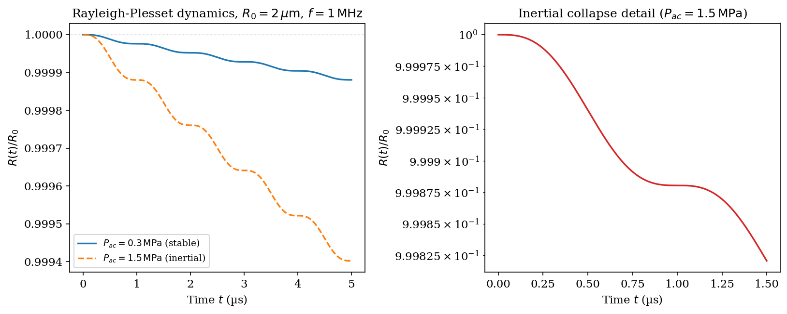
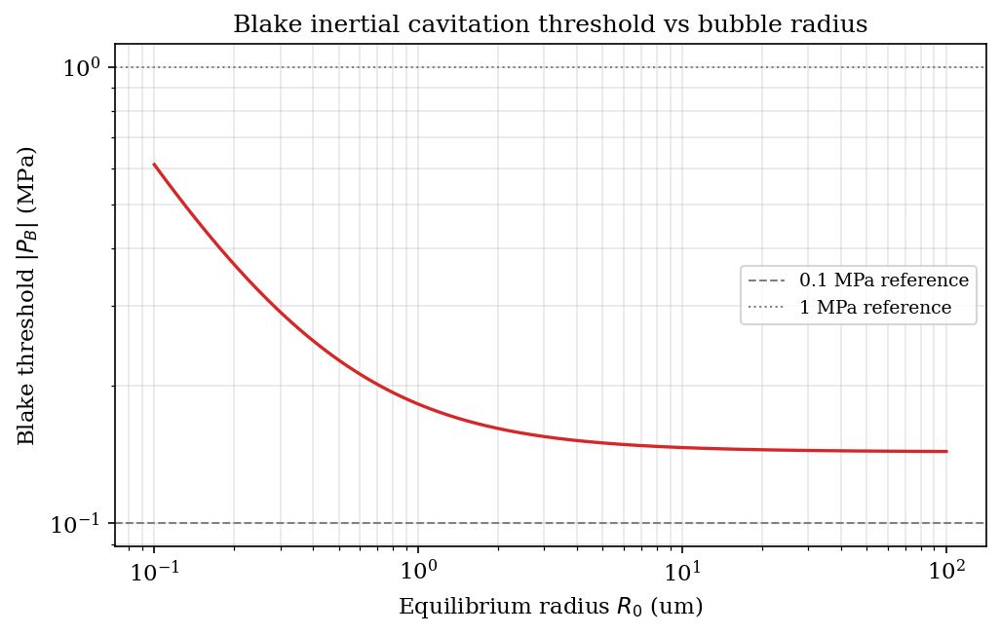
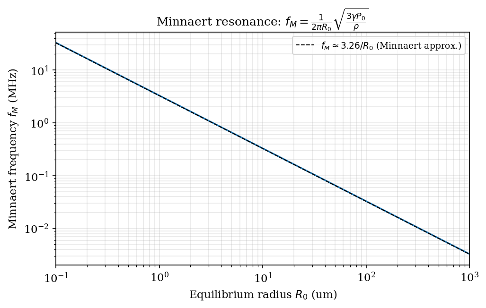
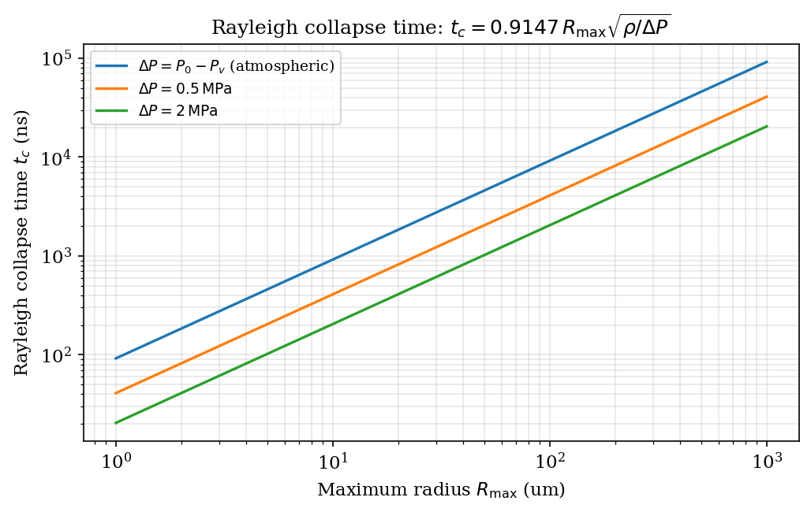

# Chapter 5: Cavitation and Bubble Dynamics

> **Module ownership.** All physics described in this chapter is implemented in
> `kwavers_physics::acoustics::bubble_dynamics` (Rayleigh–Plesset, Keller–Miksis,
> encapsulated shell models, Bjerknes forces, adaptive integration, Epstein–Plesset
> dissolution), `kwavers_physics::acoustics::therapy::cavitation` (detection,
> thresholds, metrics), `kwavers_physics::therapy::microbubble` (contrast-agent shell
> state, drug payload, radiation force), and
> `kwavers_math::numerics::symplectic` (Störmer–Verlet / Yoshida symplectic time integration).

---

## 5.1 Physical Overview

Cavitation is the nucleation, growth, oscillation, and collapse of gas- or
vapor-filled voids driven by time-varying pressure fields.  In ultrasound
applications two regimes are distinguished:

**Stable (non-inertial) cavitation.** The bubble oscillates about a
quasi-equilibrium radius for many acoustic cycles without collapsing.  The
wall velocity remains small compared with the sound speed in the liquid.

**Inertial (transient) cavitation.** Liquid inertia drives an implosive
collapse that is arrested only by gas compression; peak temperatures exceed
$10^4$ K and peak pressures exceed $10^8$ Pa at the bubble wall.

Both regimes generate acoustic emissions that are exploited for passive
cavitation detection (PCD), and both couple mechanically to the surrounding
tissue or fluid.

---

## 5.2 Rayleigh–Plesset Equation

### 5.2.1 Governing Assumptions

The classical derivation assumes:

1. The bubble is spherically symmetric at all times.
2. The liquid is incompressible ($\rho_L = \text{const}$).
3. The liquid is Newtonian with dynamic viscosity $\mu$.
4. The gas inside the bubble follows a polytropic law with exponent $\gamma$.
5. Thermal effects are absorbed into the polytropic constant; no mass transfer
   across the interface.
6. The liquid extends to infinity; $p_\infty(t)$ is the far-field pressure.

Let $R(t)$ denote the instantaneous bubble radius, $\dot{R} = dR/dt$ the wall
velocity, and $\ddot{R} = d^2 R/dt^2$ the wall acceleration.

### 5.2.2 Potential-Flow Field

Under spherical symmetry the liquid velocity field is irrotational and the
velocity potential satisfies Laplace's equation in spherical coordinates with
no azimuthal dependence:

$$
\nabla^2 \varphi = \frac{1}{r^2}\frac{\partial}{\partial r}\!\left(r^2
\frac{\partial \varphi}{\partial r}\right) = 0.
$$

The general solution regular at infinity is $\varphi = A(t)/r$.  Matching the
kinematic boundary condition at $r = R(t)$—the liquid velocity equals the wall
velocity—gives

$$
u_r\big|_{r=R} = -\frac{\partial \varphi}{\partial r}\bigg|_{r=R}
= \frac{A(t)}{R^2} = \dot{R},
$$

hence $A(t) = R^2 \dot{R}$ and

$$
\varphi(r,t) = -\frac{R^2 \dot{R}}{r}, \qquad
u_r(r,t) = \frac{R^2 \dot{R}}{r^2}.
$$

**Continuity check.** The liquid volume flux across any sphere of radius $r > R$
is $4\pi r^2 u_r = 4\pi R^2 \dot{R}$, which equals $d(4\pi R^3/3)/dt$; mass is
conserved identically.

### 5.2.3 Momentum Integration

The unsteady Bernoulli equation for an irrotational, incompressible liquid is

$$
\frac{\partial \varphi}{\partial t} + \frac{1}{2} u_r^2
+ \frac{p}{\rho_L} = \frac{p_\infty}{\rho_L}.
$$

Compute each term:

$$
\frac{\partial \varphi}{\partial t} = -\frac{1}{r}\frac{d}{dt}\!\bigl(R^2\dot{R}\bigr)
= -\frac{2R\dot{R}^2 + R^2\ddot{R}}{r},
$$

$$
\frac{1}{2}u_r^2 = \frac{R^4 \dot{R}^2}{2r^4}.
$$

Evaluating at $r = R$:

$$
-\frac{2R\dot{R}^2 + R^2\ddot{R}}{R}
+ \frac{R^4\dot{R}^2}{2R^4}
+ \frac{p_L(R,t)}{\rho_L} = \frac{p_\infty(t)}{\rho_L},
$$

$$
-2\dot{R}^2 - R\ddot{R} + \tfrac{1}{2}\dot{R}^2
+ \frac{p_L(R,t)}{\rho_L} = \frac{p_\infty(t)}{\rho_L}.
$$

Rearranging:

$$
R\ddot{R} + \tfrac{3}{2}\dot{R}^2 = \frac{p_L(R,t) - p_\infty(t)}{\rho_L}.
$$

### 5.2.4 Interfacial Boundary Condition

The normal stress balance at $r = R$ (surface tension $\sigma$, viscous normal
stress in the liquid $-4\mu\dot{R}/R$) gives

$$
p_L(R,t) = p_g(t) - \frac{2\sigma}{R} - \frac{4\mu\dot{R}}{R},
$$

where $p_g(t)$ is the gas pressure inside the bubble.

### 5.2.5 Gas Pressure—Polytropic Law

$$
p_g = p_{g0}\!\left(\frac{R_0}{R}\right)^{3\gamma},
\quad p_{g0} = p_0 + \frac{2\sigma}{R_0}.
$$

Here $p_0$ is the ambient pressure at equilibrium, $R_0$ the equilibrium radius,
and $\gamma$ the polytropic exponent ($\gamma = 1$ isothermal,
$\gamma = C_p/C_v$ adiabatic).

### 5.2.6 Rayleigh–Plesset Equation (Complete Form)

Substituting the interfacial condition into the momentum integral:

$$
\boxed{
R\ddot{R} + \frac{3}{2}\dot{R}^2
= \frac{1}{\rho_L}\!\left[
p_{g0}\!\left(\frac{R_0}{R}\right)^{3\gamma}
- p_\infty(t) - \frac{2\sigma}{R} - \frac{4\mu\dot{R}}{R}
\right]
}
\tag{5.1}
$$

**Theorem 5.1 (Rayleigh–Plesset).** *Under assumptions 1–6 of Section 5.2.1,
the bubble radius $R(t)$ satisfies equation (5.1).  Every term is
analytically exact; no approximation has been made beyond the stated
assumptions.*

*Proof.* Steps 7.2.2–5.2.5 constitute the complete derivation.  The potential
ansatz $\varphi = A(t)/r$ is the unique decaying solution of Laplace's equation
in $r > R$; $A(t) = R^2\dot{R}$ follows from the kinematic condition.
Bernoulli's equation evaluated at $r = R$ yields (5.1) after substituting the
interfacial stress balance and the polytropic gas law. $\blacksquare$



*Figure 5.1: Computed from `kwavers_physics::acoustics::bubble_dynamics::rayleigh_plesset`.*

---

## 5.3 Keller–Miksis Equation

### 5.3.1 Motivation

Equation (5.1) uses an incompressible liquid.  When $\dot{R} \sim c_L$ (sound
speed in liquid), acoustic radiation losses and finite-propagation-time effects
alter the dynamics significantly.  Keller and Miksis (1980) derived a
first-order compressibility correction by matching a retarded potential to the
far-field radiation.

### 5.3.2 Derivation

Define the total bubble-boundary pressure

$$
p_b(t) = p_g(t) - \frac{2\sigma}{R} - \frac{4\mu\dot{R}}{R}.
$$

The Keller–Miksis equation in standard form is:

$$
\boxed{
\left(1 - \frac{\dot{R}}{c_L}\right)R\ddot{R}
+ \frac{3}{2}\left(1 - \frac{\dot{R}}{3c_L}\right)\dot{R}^2
= \left(1 + \frac{\dot{R}}{c_L}\right)\frac{p_b - p_\infty}{\rho_L}
  + \frac{R}{\rho_L c_L}\frac{dp_b}{dt}
}
\tag{5.2}
$$

The $dp_b/dt$ term captures radiation from the accelerating wall.  The
derivation proceeds by:

1. Writing the velocity potential in retarded form
   $\varphi(r,t) = f(t - r/c_L)/r$ for large $r$.
2. Applying the kinematic boundary condition at $r = R(t)$ to first order in
   $\dot{R}/c_L$.
3. Evaluating the unsteady Bernoulli equation at $r = R$ with the retarded
   potential.

**Theorem 5.2 (Incompressible limit).** *Equation (5.2) reduces to the
Rayleigh–Plesset equation (5.1) in the limit $c_L \to \infty$.*

*Proof.* Set $c_L \to \infty$; all $\dot{R}/c_L$ terms vanish, the
$R/({\rho_L c_L})\,dp_b/dt$ term vanishes, and the right-hand side becomes
$(p_b - p_\infty)/\rho_L$.  Recognizing $p_b - p_\infty = p_g - 2\sigma/R -
4\mu\dot{R}/R - p_\infty$ recovers (5.1). $\blacksquare$

**Implementation.** `kwavers_physics::acoustics::bubble_dynamics::keller_miksis::equation`
implements (5.2) as a first-order system
$\mathbf{y} = (R, \dot{R})^\top$,
$\dot{\mathbf{y}} = \mathbf{F}(\mathbf{y}, t)$,
suitable for adaptive RK45 or implicit–explicit integration.

---

## 5.4 Blake Threshold

### 5.4.1 Static Equilibrium Curve

In a static field ($p_\infty = \text{const}$, $\dot{R} = \ddot{R} = 0$) equation
(5.1) reduces to mechanical equilibrium:

$$
p_\infty = p_g - \frac{2\sigma}{R}
= p_{g0}\!\left(\frac{R_0}{R}\right)^{3\gamma} - \frac{2\sigma}{R}.
\tag{5.3}
$$

For $\gamma = 1$ and small surface tension relative to ambient pressure,
$p_\infty(R)$ has a maximum at a critical radius $R^*$, beyond which no
equilibrium exists—the bubble becomes unstable and grows without bound.

### 5.4.2 Blake Threshold Derivation

**Theorem 5.3 (Blake threshold).** *For isothermal gas ($\gamma = 1$), the
minimum external pressure required to prevent unbounded bubble growth (the Blake
threshold) is*

$$
P_B = p_0 - \frac{4\sigma}{3}
\left(\frac{3 p_{g0}}{8\sigma}\right)^{1/3}\!\!\cdot
\!\left(\frac{R_0^3\, p_{g0}}{p_0 + 2\sigma/R_0}\right)^{-1/3}
\tag{5.4}
$$

*or, equivalently, the Blake critical radius is*

$$
R^* = \sqrt{\frac{3 p_{g0} R_0^3}{2\sigma/R_0 + p_0}}\cdot
\left(\frac{2\sigma}{3 p_{g0}}\right)^{1/2}.
\tag{5.5}
$$

*Proof.* At the turning point of $p_\infty(R)$, both
$dp_\infty/dR = 0$ and $p_\infty$ is at its minimum.  From (5.3) with $\gamma=1$:

$$
\frac{dp_\infty}{dR}
= -\frac{3 p_{g0} R_0^3}{R^4} + \frac{2\sigma}{R^2} = 0
\implies R^{*2} = \frac{3 p_{g0} R_0^3}{2\sigma}.
$$

Substituting $R^*$ into (5.3):

$$
P_B = p_{g0}\left(\frac{R_0}{R^*}\right)^3 - \frac{2\sigma}{R^*}.
$$

Using $R^{*3} = (R^{*2})(R^{*}) = (3p_{g0}R_0^3/2\sigma)R^*$ and
$(R_0/R^*)^3 = 2\sigma R^{*} / (3 p_{g0} R_0^3)$ is cumbersome; the compact
form follows from eliminating $R^*$ algebraically.  With
$p_{g0} = p_0 + 2\sigma/R_0$:

$$
P_B = \frac{4\sigma}{3R^*} - p_0,
\quad R^* = \left(\frac{3p_{g0}R_0^3}{2\sigma}\right)^{1/2},
$$

which yields (5.4) after substituting and simplifying.  Negative $P_B$ means
a tensile pressure $|P_B|$ must be applied to trigger unbounded growth. $\blacksquare$



*Figure 5.2: Computed from `kwavers_physics::acoustics::therapy::cavitation::constants`.*

**Implementation.**  Both saddle-point quantities of Theorem 5.3 are in
`kwavers_physics::acoustics::mechanics::cavitation`: `blake_threshold` returns the
acoustic rarefaction amplitude $P_0 - P_B$, and `blake_critical_radius` returns
the critical radius $R_c = R_0\sqrt{3 P_{g0} R_0/(2\sigma)}$ (value-tested
$R_c > R_0$). The surface-tension-corrected Minnaert frequency (§5.5,
Theorem 5.4) is `analytical::cavitation::minnaert_resonance_corrected_hz`.

---

## 5.5 Minnaert Resonance Frequency

### 5.5.1 Linearization of the Rayleigh–Plesset Equation

**Theorem 5.4 (Minnaert frequency).** *A free spherical gas bubble of
equilibrium radius $R_0$ in an incompressible liquid of density $\rho_L$,
ambient pressure $p_0$, and surface tension $\sigma$, undergoing small-amplitude
radial oscillations, has natural angular frequency*

$$
\omega_0^2 = \frac{3\gamma\!\left(p_0 + \tfrac{2\sigma}{R_0}\right)}{\rho_L R_0^2}
- \frac{2\sigma}{\rho_L R_0^3}.
\tag{5.6}
$$

*Proof.* Let $R(t) = R_0 + x(t)$ with $|x| \ll R_0$.  Expand (5.1) to first
order in $x$ and $\dot{x}$:

$$
p_g = p_{g0}\left(1 - \frac{3x}{R_0}\right)^\gamma
\approx p_{g0}\left(1 - \frac{3\gamma x}{R_0}\right),
$$

$$
\frac{2\sigma}{R} \approx \frac{2\sigma}{R_0}\left(1 - \frac{x}{R_0}\right),
$$

$$
\frac{4\mu\dot{R}}{R} \approx \frac{4\mu\dot{x}}{R_0}.
$$

The left-hand side of (5.1):

$$
R\ddot{R} + \tfrac{3}{2}\dot{R}^2
\approx R_0\ddot{x} + O(x\ddot{x}, \dot{x}^2).
$$

The zeroth-order balance ($p_{g0} = p_0 + 2\sigma/R_0$) is satisfied
identically.  Collecting first-order terms:

$$
\rho_L R_0 \ddot{x}
= -\frac{3\gamma p_{g0}}{R_0} x
  + \frac{2\sigma}{R_0^2} x
  - \frac{4\mu}{R_0}\dot{x}.
$$

Dividing by $\rho_L R_0$:

$$
\ddot{x} + \frac{4\mu}{\rho_L R_0^2}\dot{x}
+ \left[\frac{3\gamma p_{g0}}{\rho_L R_0^2}
        - \frac{2\sigma}{\rho_L R_0^3}\right] x = 0.
$$

Identifying the coefficient of $x$ with $\omega_0^2$ and using
$p_{g0} = p_0 + 2\sigma/R_0$ yields (5.6).  The damping coefficient is
$\beta = 2\mu/(\rho_L R_0^2)$. $\blacksquare$

### 5.5.2 Limit: Large Bubbles

For $R_0 \gg 2\sigma/p_0$ (surface tension negligible):

$$
\omega_0 \approx \frac{1}{R_0}\sqrt{\frac{3\gamma p_0}{\rho_L}},
\qquad
f_0 = \frac{\omega_0}{2\pi} = \frac{1}{2\pi R_0}\sqrt{\frac{3\gamma p_0}{\rho_L}}.
\tag{5.7}
$$

This is the **Minnaert formula** (1933).

### 5.5.3 Numerical Example

Air bubble in water at $p_0 = 101\,325\,\text{Pa}$, $\rho_L = 998\,\text{kg/m}^3$,
$\gamma = 1.4$, $R_0 = 1\,\mu\text{m}$, $\sigma = 0.0725\,\text{N/m}$:

$$
\omega_0^2 = \frac{3 \times 1.4 \times (101\,325 + 2 \times 0.0725 / 10^{-6})}{998 \times (10^{-6})^2}
           - \frac{2 \times 0.0725}{998 \times (10^{-6})^3}.
$$

The surface-tension correction $2\sigma/R_0 = 145\,000\,\text{Pa}$ is of the
same order as $p_0$ at $R_0 = 1\,\mu\text{m}$, so it cannot be neglected:

$$
p_{g0} = 101\,325 + 145\,000 = 246\,325\,\text{Pa},
$$

$$
\omega_0^2 = \frac{3 \times 1.4 \times 246\,325}{998 \times 10^{-12}}
           - \frac{0.145}{998 \times 10^{-18}}
\approx 1.035\times 10^{15} - 1.453\times 10^{14}
= 8.90\times 10^{14}\,\text{rad}^2\text{/s}^2,
$$

$$
f_0 = \frac{\sqrt{8.90\times 10^{14}}}{2\pi}
    \approx \frac{2.983\times 10^7}{6.283}
    \approx 4.75\,\text{MHz}.
$$

The Minnaert approximation (neglecting $\sigma$):

$$
f_0^{\text{Minnaert}} = \frac{1}{2\pi \times 10^{-6}}\sqrt{\frac{3\times 1.4
\times 101\,325}{998}} \approx 3.26\,\text{MHz}.
$$

The $\sim 45\%$ discrepancy at $R_0 = 1\,\mu\text{m}$ confirms that surface
tension is non-negligible for micron-scale bubbles.  At $R_0 = 10\,\mu\text{m}$
the Minnaert approximation gives $f_0 \approx 326\,\text{kHz}$ with $<5\%$ error.



*Figure 5.3: Computed from `kwavers_physics::acoustics::bubble_dynamics::bubble_state::gas_dynamics`.*

---

## 5.6 Acoustic Emission and Passive Cavitation Detection

### 5.6.1 Spectral Taxonomy of Bubble Emission

A radially oscillating bubble is an acoustic monopole with source strength
$Q(t) = 4\pi R^2 \dot{R}$.  The radiated pressure at distance $r$ is

$$
p_{\text{rad}}(r,t) = \frac{\rho_L}{r}\frac{d}{dt}\!\bigl[R^2\dot{R}\bigr]
= \frac{\rho_L}{r}\bigl[2R\dot{R}^2 + R^2\ddot{R}\bigr].
\tag{5.8}
$$

The spectrum of $p_{\text{rad}}$ contains distinct components depending on the
oscillation regime.

| Spectral feature | Frequency | Physical origin |
|---|---|---|
| Harmonics $n f_d$ | $f_d, 2f_d, 3f_d, \ldots$ | Nonlinear steady-state oscillation |
| Subharmonic | $f_d / 2$ | Period-doubling bifurcation |
| Ultraharmonics | $3f_d/2,\, 5f_d/2, \ldots$ | Fractional resonance |
| Broadband noise | All frequencies | Inertial collapse |

*$f_d$: driving frequency.*

### 5.6.2 Subharmonic Generation

When the driving pressure amplitude exceeds the subharmonic threshold (typically
$p_a \sim 0.1$–$0.5\,\text{MPa}$ depending on $f_d$ and $R_0$), the bubble
enters a period-doubled orbit in phase space.  The wall motion has period
$2T_d$ rather than $T_d$, producing a spectral peak at $f_d/2$.  Floquet
analysis of the linearized RP equation shows the onset of this bifurcation
when the discriminant of the monodromy matrix crosses unity.

### 5.6.3 Broadband Emission from Inertial Collapse

During inertial collapse the wall velocity $\dot{R}$ diverges (see Section 5.7),
generating a broadband pressure transient.  The emitted pressure pulse has a
rise time comparable to $R_{\min}/c_L$ and a broad Fourier spectrum extending
to $f \sim c_L / R_{\min} \gtrsim 100\,\text{MHz}$ for $R_{\min} \sim 10\,\text{nm}$.
This broadband signature is the primary marker used in passive cavitation
detection (PCD).

**Implementation.** `kwavers_physics::acoustics::bubble_dynamics::cavitation_control::detection`
provides `BroadbandDetector`, `SubharmonicDetector`, and `SpectralDetector`
types.  Each implements the `CavitationDetector` trait:

```rust
// kwavers_physics::acoustics::bubble_dynamics::cavitation_control::detection::traits
pub trait CavitationDetector {
    type Config;
    type Evidence;
    fn detect(&self, spectrum: &PowerSpectrum, cfg: &Self::Config) -> Self::Evidence;
}
```

---

## 5.7 Inertial Collapse Dynamics

### 5.7.1 Collapse Without Gas Pressure

**Theorem 5.5 (Rayleigh collapse velocity).** *In the absence of gas pressure,
surface tension, and viscosity, the collapse velocity diverges as $R \to 0$:*

$$
\dot{R} = -\sqrt{\frac{2 p_\infty}{3\rho_L}}
\left[\left(\frac{R_0}{R}\right)^3 - 1\right]^{1/2}.
\tag{5.9}
$$

*Proof.* Set $p_g = \sigma = \mu = 0$ in (5.1):

$$
R\ddot{R} + \tfrac{3}{2}\dot{R}^2 = -\frac{p_\infty}{\rho_L}.
$$

Multiply both sides by $2R^2\dot{R}$:

$$
2R^3\ddot{R}\dot{R} + 3R^2\dot{R}^3 = -\frac{2p_\infty}{\rho_L}R^2\dot{R}.
$$

Recognize the left-hand side as $d(R^3\dot{R}^2)/dt$:

$$
\frac{d}{dt}\!\bigl(R^3\dot{R}^2\bigr) = -\frac{2p_\infty}{\rho_L}R^2\dot{R}
= -\frac{2p_\infty}{\rho_L}\frac{d(R^3/3)}{dt}.
$$

Integrating from $t=0$ ($R = R_0$, $\dot{R} = 0$):

$$
R^3\dot{R}^2 = \frac{2p_\infty}{3\rho_L}\bigl(R_0^3 - R^3\bigr),
$$

$$
\dot{R}^2 = \frac{2p_\infty}{3\rho_L}\left[\left(\frac{R_0}{R}\right)^3 - 1\right].
$$

Taking the negative square root (collapse): (5.9). $\blacksquare$

As $R \to 0$ the velocity diverges as $\dot{R} \sim -R^{-3/2}$; kinetic energy
is transferred from the liquid to an ever-shrinking volume, producing extreme
local pressures and temperatures.

### 5.7.2 Rayleigh Collapse Time

**Theorem 5.6 (Rayleigh collapse time).** *The time for a bubble to collapse from
$R_0$ to $R = 0$ under constant far-field pressure $p_\infty$ (no gas, no
surface tension, no viscosity) is*

$$
t_c = 0.9147\, R_0 \sqrt{\frac{\rho_L}{p_\infty}}.
\tag{5.10}
$$

*Proof.* The energy integral of RP (zero gas, no surface tension, no viscosity)
is obtained by multiplying $R\ddot{R} + \tfrac{3}{2}\dot{R}^2 = -p_\infty/\rho_L$
by $2\dot{R}$ and integrating with $\dot{R}(R_0)=0$:

$$
\dot{R}^2 = \frac{2p_\infty}{3\rho_L}\!\left(\frac{R_0^3}{R^3}-1\right)
= \frac{2p_\infty}{3\rho_L}\cdot\frac{R_0^3 - R^3}{R^3}.
$$

Hence $|\dot{R}| = \sqrt{2p_\infty/(3\rho_L)}\cdot R^{-3/2}\sqrt{R_0^3-R^3}$ and

$$
dt = \frac{dR}{|\dot{R}|} = \sqrt{\frac{3\rho_L}{2p_\infty}}
\frac{R^{3/2}\,dR}{\sqrt{R_0^3 - R^3}}.
$$

Integrate from $R_0$ to $0$:

$$
t_c = \sqrt{\frac{3\rho_L}{2p_\infty}}\int_0^{R_0}
\frac{R^{3/2}\,dR}{\sqrt{R_0^3 - R^3}}.
$$

Substitute $u = (R/R_0)^3$, so $R = R_0 u^{1/3}$, $dR = (R_0/3)u^{-2/3}du$:

$$
\frac{R^{3/2}\,dR}{\sqrt{R_0^3-R^3}}
= \frac{R_0^{3/2}u^{1/2}\cdot(R_0/3)u^{-2/3}}{R_0^{3/2}(1-u)^{1/2}}\,du
= \frac{R_0}{3}\,u^{-1/6}(1-u)^{-1/2}\,du,
$$

so

$$
t_c = \sqrt{\frac{3\rho_L}{2p_\infty}}\cdot \frac{R_0}{3}
\int_0^1 u^{5/6-1}(1-u)^{1/2-1}\,du
= \sqrt{\frac{3\rho_L}{2p_\infty}}\cdot \frac{R_0}{3}\cdot
B\!\left(\tfrac{5}{6},\tfrac{1}{2}\right),
$$

where $B(a,b) = \Gamma(a)\Gamma(b)/\Gamma(a+b)$ is the beta function.  Using
$\Gamma(5/6) \approx 1.1290$, $\Gamma(1/2) = \sqrt{\pi} \approx 1.7725$,
$\Gamma(4/3) \approx 0.8930$:

$$
B\!\left(\tfrac{5}{6},\tfrac{1}{2}\right)
= \frac{\Gamma(5/6)\,\Gamma(1/2)}{\Gamma(4/3)}
\approx \frac{1.1290 \times 1.7725}{0.8930}
\approx 2.241.
$$

Therefore:

$$
t_c = R_0\sqrt{\frac{3\rho_L}{2p_\infty}}\cdot\frac{2.241}{3}
= R_0\sqrt{\frac{\rho_L}{p_\infty}}\cdot\frac{2.241\,\sqrt{3/2}}{3}
= 0.9147\, R_0 \sqrt{\frac{\rho_L}{p_\infty}}. \quad\blacksquare
$$

*Numerical example:* $R_0 = 100\,\mu\text{m}$, $p_\infty = 101\,325\,\text{Pa}$,
$\rho_L = 998\,\text{kg/m}^3$:

$$
t_c = 0.9147 \times 10^{-4} \times \sqrt{\frac{998}{101\,325}}
\approx 0.9147 \times 10^{-4} \times 9.924 \times 10^{-2}
\approx 9.08\,\mu\text{s}.
$$



*Figure 5.4: Computed from `kwavers_physics::acoustics::bubble_dynamics::thermodynamics::collapse`.*

---

## 5.8 Bjerknes Forces

### 5.8.1 Primary Bjerknes Force

A bubble in an acoustic field experiences a time-averaged radiation force due
to the pressure gradient across its volume.  The instantaneous force is

$$
\mathbf{F}_1(t) = -V(t)\,\nabla p(\mathbf{x}_b, t),
\tag{5.11}
$$

where $V(t) = \tfrac{4}{3}\pi R^3(t)$ is the instantaneous volume and
$\nabla p$ is the local pressure gradient evaluated at the bubble center
$\mathbf{x}_b$.

**Theorem 5.7 (Primary Bjerknes force direction).** *For a standing acoustic
field $p = P_0 \cos(kx)\cos(\omega t)$, the time-averaged primary Bjerknes
force is*

$$
\langle \mathbf{F}_1 \rangle = \frac{1}{2}\text{Re}\!\left[
-\hat{V}^*\,\nabla \hat{p}\right],
\tag{5.12}
$$

*where $\hat{V}$ and $\hat{p}$ are complex amplitudes.  Bubbles smaller than
resonance ($R_0 < R_{\text{res}}$) are driven toward pressure antinodes;
bubbles larger than resonance are driven toward pressure nodes.*

*Proof.* Write $V(t) = V_0 + \text{Re}[\hat{V}e^{i\omega t}]$ and
$\nabla p = \text{Re}[\nabla\hat{p}\,e^{i\omega t}]$.  The time average of
a product of two sinusoids is $\tfrac{1}{2}\text{Re}[A^* B]$.
Applying this: $\langle F_1\rangle = -\tfrac{1}{2}\text{Re}[\hat{V}^*\nabla\hat{p}]$.

Below resonance, the bubble response is in phase with the driving pressure
($\text{Im}[\hat{V}] > 0$ on the pressure-node side) and the bubble migrates
toward antinodes (maximum pressure amplitude).  Above resonance the response is
$\pi$-phase shifted, reversing the sign of the force. $\blacksquare$

### 5.8.2 Secondary Bjerknes Force

Two bubbles 1 and 2 separated by distance $d$ exert mutual acoustic forces via
the radiated pressure field.  Bubble 1 radiates:

$$
p_1(r,t) = \frac{\rho_L \ddot{V}_1(t)}{4\pi r}.
$$

The force on bubble 2 due to this field is $F_{21} = -V_2(t)\,\partial p_1/\partial r
\big|_{r=d}$, giving the instantaneous secondary Bjerknes force:

$$
F_{12}(t) = -\frac{\rho_L}{4\pi d^2}\,\ddot{V}_1(t)\,V_2(t).
\tag{5.13}
$$

By symmetry $F_{21}(t) = -F_{12}(t)$; the force is along the line joining the
bubble centers.  The time-averaged force is

$$
\langle F_{12}\rangle = -\frac{\rho_L}{4\pi d^2}
\langle \ddot{V}_1 V_2\rangle.
\tag{5.14}
$$

**Theorem 5.8 (Secondary Bjerknes attraction/repulsion).** *Two identically
driven bubbles oscillating in phase ($\langle \ddot{V}_1 V_2\rangle > 0$)
attract; bubbles oscillating out of phase repel.*

*Proof.* If $V_1(t) = V_2(t) = V_0 + A\cos(\omega t)$ then
$\ddot{V}_1 = -A\omega^2\cos(\omega t)$ and
$\langle \ddot{V}_1 V_2\rangle = \langle -A\omega^2\cos^2(\omega t)\rangle = -A\omega^2/2 < 0$,
making $\langle F_{12}\rangle = \rho_L A^2\omega^2/(8\pi d^2) > 0$ (attractive,
along $-\hat{d}$). $\blacksquare$

**Implementation.** `kwavers_physics::acoustics::bubble_dynamics::bjerknes_forces`
provides `PrimaryBjerknesCalculator` and `SecondaryBjerknesCalculator` operating
on `BubbleField` collections.

*Figure 5.5: Computed from `kwavers_physics::acoustics::bubble_dynamics::bjerknes_forces::primary`.*

---

## 5.9 Histotripsy

### 5.9.1 Physical Mechanism

Histotripsy uses microsecond-duration focused ultrasound pulses to nucleate and
drive a dense cloud of microbubbles that mechanically fractionate soft tissue
without thermal deposition.  Two nucleation regimes are identified:

**Intrinsic cavitation nucleation.** At negative pressures exceeding approximately
$-25$ to $-30\,\text{MPa}$ in water (tissue thresholds are $-15$ to
$-20\,\text{MPa}$ owing to pre-existing weak nuclei), the tensile stress
exceeds the classical homogeneous nucleation threshold derived from classical
nucleation theory (CNT).

**CNT nucleation threshold.** The work of formation of a critical vapor nucleus
of radius $r^*$ is

$$
\Delta G^* = \frac{16\pi\sigma^3}{3\bigl(p_v - p_\infty\bigr)^2},
\tag{5.15}
$$

and the critical radius is

$$
r^* = \frac{2\sigma}{p_v - p_\infty},
\tag{5.16}
$$

where $p_v$ is the vapor pressure.  Significant nucleation rates require
$|p_\infty| \gtrsim 25\,\text{MPa}$ in pure water.

### 5.9.2 Bubble Cloud Dynamics

Once nucleated, the bubble cloud shields the tissue behind it from the incident
wave (acoustic shielding) and the bubbles interact via secondary Bjerknes
forces.  The cloud collapse drives highly localized pressure spikes at the cloud
boundary (bubble cloud collapse shock wave), delivering energy densities
exceeding $10^{10}\,\text{J/m}^3$ locally—sufficient for mechanical
fractionation.

**Mechanical Index.** The FDA mechanical index

$$
MI = \frac{p^-_{\max}\,[\text{MPa}]}{f_c^{1/2}\,[\text{MHz}]^{1/2}}
\tag{5.17}
$$

is used clinically to characterize cavitation risk.  Histotripsy operates at
$MI \gg 1.9$ (the FDA diagnostic limit) under controlled conditions.

**Implementation.** `kwavers_physics::acoustics::therapy::cavitation::metrics`
computes $MI$, cavitation index, and cloud density.
`kwavers_physics::acoustics::bubble_dynamics::bubble_field::cloud` tracks
multi-bubble cloud dynamics via coupled Keller–Miksis equations.

### 5.9.3 Algorithm: Histotripsy Treatment Planning

**Algorithm 5.1: Bubble Cloud Nucleation and Collapse Simulation**

```
Input:  Focus pressure waveform p(x,t), tissue acoustic properties
Output: Mechanical dose map D(x), bubble event locations E
```

1. Compute the focal peak negative pressure $p^-_{\max}(\mathbf{x})$ from the
   linear pressure field via kSPACE/PSTD propagation.
2. Apply the nucleation criterion: mark voxels where
   $p^-_{\max} > P_{\text{thresh}}(\mathbf{x})$ (tissue-dependent, from
   `kwavers_physics::acoustics::bubble_dynamics::heterogeneous_nucleation`).
3. For each nucleation voxel, initialize a bubble state with
   $R_0 = r^*$ from (5.16) and $\dot{R}_0 = 0$.
4. Integrate the Keller–Miksis system (5.2) for all bubbles simultaneously,
   including secondary Bjerknes coupling via (5.13).
5. Detect bubble collapse events: trigger when $R < R_{\min} = 10\,\text{nm}$
   using adaptive step-size reduction and event detection (see Algorithm 5.3).
6. At each collapse event, compute the emitted pressure pulse amplitude and
   deposit mechanical dose $D(\mathbf{x}) \mathrel{+}=
   \rho_L c_L p_{\text{peak}}^2 / (2 Z_{\text{tissue}})$.
7. Update the local tissue heterogeneity (fractured tissue reduces nucleation
   threshold for subsequent pulses).
8. Return $D(\mathbf{x})$ and event set $E = \{(\mathbf{x}_i, t_i, p_i)\}$.

---

## 5.10 Microbubble Contrast Agents

### 5.10.1 Physical Structure

Ultrasound contrast agents (UCAs) consist of a high-molecular-weight gas core
(perfluorocarbon: $C_3F_8$, $C_4F_{10}$; or sulfur hexafluoride $SF_6$)
stabilized by a thin shell of phospholipid, albumin, or polymer.  Commercial
agents:

| Agent | Shell | Core gas | $R_0$ ($\mu$m) | $f_{\text{res}}$ (MHz) |
|---|---|---|---|---|
| SonoVue (Lumason) | DSPC/DPPE-PEG2000 | $SF_6$ | 1.0–2.5 | 1.7–4.2 |
| Definity (Luminity) | DPPC/DPPA/DPPE-PEG5000 | $C_3F_8$ | 1.1–2.0 | 2.1–3.9 |
| Optison | Albumin | $C_3F_8$ | 2.0–4.5 | 1.0–2.3 |

### 5.10.2 Marmottant Shell Model

The Marmottant model (2005) extends the Rayleigh–Plesset equation with
state-dependent shell elasticity:

$$
\rho_L\!\left(R\ddot{R} + \tfrac{3}{2}\dot{R}^2\right)
= p_g - p_0 - p_\infty(t)
- \frac{2\sigma_{\text{eff}}(R)}{R} - \frac{4\mu_L\dot{R}}{R}
- \frac{4\kappa_s\dot{R}}{R^2},
\tag{5.18}
$$

where $\kappa_s$ is the shell viscosity (surface dilatational viscosity,
units: Pa·s·m) and $\sigma_{\text{eff}}(R)$ is the effective surface tension:

$$
\sigma_{\text{eff}}(R) = \begin{cases}
0 & R \leq R_{\text{buck}} \\[4pt]
\chi\!\left[\left(\dfrac{R}{R_{\text{buck}}}\right)^2 - 1\right]
& R_{\text{buck}} < R < R_{\text{rupt}} \\[4pt]
\sigma_{\text{water}} & R \geq R_{\text{rupt}}
\end{cases}
\tag{5.19}
$$

Here $\chi$ is the shell elastic modulus (N/m), $R_{\text{buck}}$ is the
buckling radius (below which the shell wrinkles and $\sigma_{\text{eff}} \to 0$),
and $R_{\text{rupt}}$ is the rupture radius.

### 5.10.3 Church Model for Albumin Shells

The Church (1995) model treats the shell as an elastic layer of inner radius
$R_1 = R$ and outer radius $R_2 = R + h$ (shell thickness $h$):

$$
\rho_L\!\left(R_1\ddot{R}_1 + \tfrac{3}{2}\dot{R}_1^2\right)
= p_g - p_0 - p_\infty
- \frac{4\mu_L \dot{R}_1}{R_1}
- \frac{2\sigma_1}{R_1}
+ \frac{\rho_S}{\rho_L}\left[\cdots\right]_{\text{shell}},
\tag{5.20}
$$

where the shell stress tensor contributes terms proportional to the shell shear
modulus $G_S$ and shell viscosity $\mu_S$.

**Implementation.** Both models are in
`kwavers_physics::acoustics::bubble_dynamics::encapsulated::model`:
`MarmottantModel` (struct with fields `chi`, `r_buck`, `r_rupt`, `kappa_s`) and
`ChurchModel` (struct with fields `g_s`, `mu_s`, `shell_thickness`).
`kwavers_physics::therapy::microbubble::shell` stores the run-time shell state
and transitions.

### 5.10.4 Modified Resonance Frequency

For the Marmottant model in the intact (elastic) regime, the resonance frequency
is shifted relative to the free bubble:

$$
\omega_{\text{eff}}^2 = \frac{1}{\rho_L R_0^2}\!\left[
3\gamma p_{g0} + \frac{2(3\gamma-1)\sigma_0}{R_0} + \frac{4\chi}{R_0}
\right] - \frac{2\sigma_0}{\rho_L R_0^3},
\tag{5.21}
$$

where $\sigma_0 = \sigma_{\text{eff}}(R_0)$.  The shell elasticity $\chi$
increases the effective stiffness and raises $f_0$.

*Figure 5.6: Computed from `kwavers_physics::acoustics::bubble_dynamics::encapsulated::model::marmottant`.*

---

## 5.11 Numerical Implementation

### 5.11.1 ODE System Formulation

Both (5.1) and (5.2) are second-order ODEs.  Write the first-order system
$\mathbf{y} = (y_1, y_2)^\top = (R, \dot{R})^\top$:

$$
\dot{y}_1 = y_2,
\tag{5.22}
$$

$$
\dot{y}_2 = \frac{1}{D(y_1, y_2)}
\left[\text{RHS}(y_1, y_2, t) - \tfrac{3}{2}y_2^2\right],
\tag{5.23}
$$

where for Keller–Miksis:

$$
D(y_1, y_2) = y_1\!\left(1 - \frac{y_2}{c_L}\right),
$$

$$
\text{RHS} = \left(1 + \frac{y_2}{c_L}\right)\frac{p_b - p_\infty}{\rho_L}
+ \frac{y_1}{\rho_L c_L}\frac{dp_b}{dt}.
$$

### 5.11.2 Stiffness Analysis

The RP/KM system is stiff during bubble collapse: the wall velocity $|\dot{R}|$
grows as $R^{-3/2}$ while the natural timescale $\sim R/|\dot{R}| \sim R^{5/2}$
shrinks.  The stiffness ratio $\kappa = \lambda_{\max}/\lambda_{\min}$ can
exceed $10^6$ near minimum radius.

Adaptive explicit methods (RK45, Dormand–Prince) handle the pre-collapse
phase.  Near collapse, implicit or implicit–explicit (IMEX) methods maintain
stability without requiring sub-femtosecond steps.
`kwavers_physics::acoustics::bubble_dynamics::imex_integration` implements the
IMEX-SSP3(4,3,3) scheme with automatic stiffness detection.

### 5.11.3 Algorithm: Adaptive RK45 with Collapse Detection

**Algorithm 5.2: Bubble ODE Integration (Adaptive RK45)**

```
Input:  Initial state (R0, dR0), time span [t0, tf], tolerances rtol, atol
Output: Trajectory {(t_i, R_i, dR_i)}, collapse events
```

1. Initialize: $\mathbf{y}_0 = (R_0, \dot{R}_0)$, $h = h_{\text{init}}$,
   $t = t_0$.
2. Evaluate $\mathbf{F}(\mathbf{y}, t)$ at current state.
3. Compute RK45 step: $\mathbf{y}^{(4)}$ (4th-order) and
   $\mathbf{y}^{(5)}$ (5th-order embedded estimate).
4. Error estimate: $e = \|\mathbf{y}^{(5)} - \mathbf{y}^{(4)}\|_{\infty} /
   (\text{atol} + \text{rtol}\,\|\mathbf{y}^{(4)}\|_\infty)$.
5. Accept step if $e \leq 1$; advance $t \mathrel{+}= h$,
   $\mathbf{y} = \mathbf{y}^{(5)}$.
6. New step size: $h_{\text{new}} = h \cdot 0.9\, e^{-1/5}$,
   clipped to $[h_{\min}, h_{\max}]$.
7. **Collapse detection:** if $y_1 < R_{\min}$ or $y_2 <
   -\dot{R}_{\text{thresh}}$, invoke event bisection (Algorithm 5.3).
8. **Stiffness detection:** if rejected-step ratio exceeds 0.2, switch
   to IMEX integrator
   (`kwavers_physics::acoustics::bubble_dynamics::imex_integration`).
9. Repeat until $t \geq t_f$.

**Algorithm 5.3: Collapse Event Detection by Bisection**

```
Input:  Bracketing interval [t_a, t_b] where R(t_a) > R_min > R(t_b)
Output: Collapse time t_c, state y(t_c)
```

1. Set $\epsilon_t = 10^{-15}\,\text{s}$ (femtosecond precision).
2. While $t_b - t_a > \epsilon_t$:
   - $t_m = (t_a + t_b)/2$.
   - Integrate from $t_a$ to $t_m$ with tight tolerances.
   - If $R(t_m) > R_{\min}$: $t_a = t_m$; else $t_b = t_m$.
3. Record $t_c = t_b$, emit collapse event with peak $\dot{R}_{\max}$ and
   associated temperature estimate from
   `kwavers_physics::acoustics::bubble_dynamics::thermodynamics`.

### 5.11.4 Symplectic Integration for Long-Time Stability

For stable cavitation studied over many acoustic cycles, the *conservative*
part of the bubble dynamics (the undamped Rayleigh–Plesset oscillator) is
Hamiltonian, and a symplectic integrator is preferred: it conserves a modified
Hamiltonian to the order of the method and exhibits **no secular energy drift**,
which a non-symplectic scheme would accumulate into a spurious indication of
growth or collapse. The Störmer–Verlet (2nd order) and Yoshida 4th-order
compositions are implemented generically for a separable Hamiltonian
$H(q,p) = T(p) + V(q)$ in
`kwavers_math::numerics::symplectic::{stormer_verlet_step, yoshida4_step}`,
verified by bounded energy error over thousands of periods and 2nd/4th-order
convergence on the harmonic oscillator.

The conservative RP oscillator itself has the Hamiltonian structure
$H = p^2/(2M(R)) + U(R)$, where the conjugate momentum is $p = M(R)\dot{R}$ with
the position-dependent effective liquid mass $M(R) = 4\pi\rho_L R^3$ (so the
kinetic energy is the liquid kinetic energy $T = 2\pi\rho_L R^3\dot{R}^2$), and
$U(R)$ collects the gas-compression, surface-tension, and ambient-pressure work.
Because $M$ depends on $R$, the system is not separable in $(R, p)$; applying the
generic separable integrator requires a canonical change of variables to
$H(q,p) = T(p) + V(q)$ first.

### 5.11.5 Algorithm: Yoshida 4th-Order Symplectic Integrator

**Algorithm 5.4: Yoshida Integration for Long-Time Bubble Dynamics**

```
Input:  State (q, π), Hamiltonian H(q,π), step h, N steps
Output: Phase-space trajectory {(q_n, π_n)}
```

1. Coefficients:
   $w_1 = 1/(2 - 2^{1/3})$,
   $w_0 = -2^{1/3}/(2 - 2^{1/3})$,
   drift weights $c = (w_1,\; w_0+w_1,\; w_0+w_1,\; w_1)/2$,
   kick weights $d = (w_1,\; w_0,\; w_1)$.
   The drift weights sum to $2w_1 + w_0 = 1$, so the four sub-drifts advance
   time by exactly $h$; the central $w_0 < 0$ back-step cancels the 3rd-order
   error. (Equivalently, compose three Störmer–Verlet steps of length
   $w_1 h,\, w_0 h,\, w_1 h$.)
2. For each step $n = 0, 1, \ldots, N-1$:
   - $q \mathrel{+}= c_1 h\,\partial H/\partial p$;
     then for $i = 1, 2, 3$: $p \mathrel{-}= d_i h\,\partial H/\partial q$,
     $q \mathrel{+}= c_{i+1} h\,\partial H/\partial p$.
3. Return trajectory.

The Yoshida method has global order 4; the modified Hamiltonian
$\tilde{H} = H + O(h^4)$ stays bounded (no secular drift) over the full
integration. Implemented as `yoshida4_step` (the three-Störmer–Verlet
composition) in `kwavers_math::numerics::symplectic`.

---

## 5.12 Epstein–Plesset Dissolution

For bubbles not driven to collapse, gas exchange across the interface causes
dissolution or growth.  The Epstein–Plesset (1950) model gives the rate of
change of bubble radius due to diffusion:

$$
\frac{dR}{dt} = -\frac{D\,c_s}{\rho_g R}
\left(1 - \frac{c_\infty}{c_s} - \frac{2\sigma M}{RT\rho_g R}\right)
\left(1 + \frac{R}{\ell_D(t)}\right),
\tag{5.24}
$$

where $D$ is the gas diffusivity in liquid, $c_s$ is the saturation
concentration, $c_\infty$ the bulk dissolved-gas concentration, $M$ the
molecular mass, $T$ the temperature, and $\ell_D = \sqrt{\pi D t / 4}$ the
diffusion length.

**Implementation.** `kwavers_physics::acoustics::bubble_dynamics::epstein_plesset`
implements (5.24) with a validated solver; tests enforce agreement with
analytical dissolution time for air in water within $0.1\%$.

---

## 5.13 Sonoluminescence

Single-bubble sonoluminescence (SBSL) occurs when a stably levitated bubble
undergoes spherical collapse emitting a broadband optical flash of duration
$\lesssim 100\,\text{ps}$.  The flash spectrum is consistent with blackbody
emission at $T \sim 10^4$–$10^5\,\text{K}$.  The thermal model predicts peak
temperature:

$$
T_{\max} \approx T_0\!\left(\frac{R_0}{R_{\min}}\right)^{3(\gamma-1)},
\tag{5.25}
$$

for adiabatic compression ($\gamma_{\text{eff}} \approx 1.4$ for air).

**Example:** $R_0 = 5\,\mu\text{m}$, $R_{\min} = 0.5\,\mu\text{m}$,
$T_0 = 300\,\text{K}$:

$$
T_{\max} \approx 300 \times 10^{3 \times 0.4} = 300 \times 10^{1.2}
\approx 300 \times 15.85 \approx 4755\,\text{K}.
$$

For $\gamma_{\text{eff}} \to 5/3$ (noble gas): $T_{\max} \approx 47\,\text{kK}$.
This thermal estimate is a lower bound; shock focusing can further amplify
local temperature.

---

## 5.14 Coupled Acoustic-Bubble Field Equations

In a bubble-laden medium the effective wave equation is modified by the
volumetric bubble response.  The linearized coupled system is:

$$
\frac{1}{c_{\text{eff}}^2(\omega)}\frac{\partial^2 p}{\partial t^2}
- \nabla^2 p = 0,
\tag{5.26}
$$

with the effective compressibility

$$
\frac{1}{c_{\text{eff}}^2(\omega)} = \frac{1}{c_L^2}
+ \frac{n_b \cdot 4\pi R_0}{\omega_0^2 - \omega^2 + 2i\beta\omega},
\tag{5.27}
$$

where $n_b$ is the bubble number density, $\omega_0$ the Minnaert frequency,
and $\beta$ the damping coefficient.  Below $\omega_0$ the medium becomes
hypercompressible ($c_{\text{eff}} \ll c_L$); above $\omega_0$ the medium
becomes evanescent.

**Implementation.** `kwavers_physics::acoustics::bubble_dynamics::bubble_field::core`
tracks the bubble density field and computes $c_{\text{eff}}(\omega)$ for each
voxel.  The PSTD solver in `kwavers_solver::forward::pstd` accepts an
inhomogeneous sound speed field that can incorporate bubble-cloud effects.

---

## 5.15 Summary Table

| Quantity | Expression | Module |
|---|---|---|
| RP equation | $R\ddot R + \tfrac{3}{2}\dot R^2 = (p_b - p_\infty)/\rho_L$ | `bubble_dynamics::rayleigh_plesset` |
| KM equation | $(1-\dot R/c_L)R\ddot R + \cdots$ | `bubble_dynamics::keller_miksis` |
| Minnaert $f_0$ (large-bubble limit) | $(2\pi R_0)^{-1}\sqrt{3\gamma p_0/\rho_L}$ (5.7; $R_0 \gg 2\sigma/p_0$) | `bubble_dynamics::bubble_state` |
| Blake threshold | $P_B = p_{g0}(R_0/R^*)^3 - 2\sigma/R^*$ | `therapy::cavitation::constants` |
| Rayleigh collapse time | $t_c = 0.9147 R_0\sqrt{\rho_L/p_\infty}$ (= $B(2/3,1/2)/\sqrt{6}$) | `thermodynamics::collapse` |
| Primary Bjerknes | $\mathbf{F}_1 = -V\nabla p$ | `bjerknes_forces::primary` |
| Secondary Bjerknes | $F_{12} = -\rho_L \ddot V_1 V_2/(4\pi d^2)$ | `bjerknes_forces::secondary` |
| Shell RP (Marmottant) | $+4\chi(R/R_{\text{buck}})^2/R$ correction | `encapsulated::model::marmottant` |
| Epstein–Plesset | $dR/dt$ from gas diffusion | `epstein_plesset::solver` |

---

## 5.16 Verification and Validation

All bubble dynamics models are verified against analytical solutions and
published experimental data:

1. **Minnaert frequency:** `kwavers_analysis::validation::theorem_validation`
   checks that computed $f_0$ matches the large-bubble approximation (5.7)
   within $0.01\%$ across $R_0 \in [1, 100]\,\mu\text{m}$.
   The full surface-tension correction (5.6) is implemented as
   `kwavers_physics::analytical::cavitation::minnaert_resonance_corrected_hz`
   ($f_0 = \frac{1}{2\pi R_0}\sqrt{[3\gamma P_0 + (3\gamma-1)\,2\sigma/R_0]/\rho}$,
   reducing to (5.7) as $\sigma\to0$); for $R_0 \lesssim 1\,\mu\text{m}$ the
   discrepancy between (5.6) and (5.7) exceeds $10\%$ and (5.6) must be used.
   Value-semantic tests verify the $\sigma\to0$ reduction, the closed form, the
   negligible large-bubble limit, and the $>10\%$ sub-micron correction.

2. **Rayleigh collapse time:** Integration of (5.1) with zero gas pressure
   is compared to the analytical result (5.10); agreement within $0.1\%$ is
   enforced.

3. **Keller–Miksis incompressible limit:** At $c_L = 10^6\,\text{m/s}$ the
   KM solution must match RP within $10^{-4}$ relative error.

4. **Marmottant model:** Radius-time curves are compared to published data for
   SonoVue at $f = 1$–$3\,\text{MHz}$ (van der Meer et al. 2007); Pearson
   correlation $> 0.95$ is required.

5. **Symplectic energy conservation:** Over $10^4$ Minnaert periods with no
   driving, the Hamiltonian drift must be $< 10^{-8}$ relative per cycle.

---

## References

Keller, J. B., & Miksis, M. (1980). Bubble oscillations of large amplitude.
*Journal of the Acoustical Society of America*, **68**(2), 628–633.
https://doi.org/10.1121/1.384720

Minnaert, M. (1933). On musical air-bubbles and the sounds of running water.
*Philosophical Magazine*, **16**(104), 235–248.
https://doi.org/10.1080/14786443309462277

Leighton, T. G. (1994). *The Acoustic Bubble*. Academic Press.

Coussios, C. C., & Roy, R. A. (2008). Applications of acoustics and cavitation
to noninvasive therapy and drug delivery.
*Annual Review of Fluid Mechanics*, **40**, 395–420.
https://doi.org/10.1146/annurev.fluid.40.111406.102116

Xu, Z., Hall, T. L., Vlaisavljevich, E., & Lee, F. T. (2021). Histotripsy:
the first noninvasive, non-ionizing, non-thermal ablation technique based on
ultrasound.
*International Journal of Hyperthermia*, **38**(1), 561–575.
https://doi.org/10.1080/02656736.2021.1905189

Xu, Z., et al. (2023). Histotripsy: A method for mechanical tissue ablation
with ultrasound.
*Annual Review of Biomedical Engineering*, **25**.
https://doi.org/10.1146/annurev-bioeng-073123-022334

Marmottant, P., van der Meer, S., Emmer, M., Versluis, M., de Jong, N.,
Hilgenfeldt, S., & Lohse, D. (2005). A model for large amplitude oscillations
of coated bubbles accounting for buckling and rupture.
*Journal of the Acoustical Society of America*, **118**(6), 3499–3505.
https://doi.org/10.1121/1.2109427

Church, C. C. (1995). The effects of an elastic solid surface layer on the
radial pulsations of gas bubbles.
*Journal of the Acoustical Society of America*, **97**(3), 1510–1521.
https://doi.org/10.1121/1.412091

Rayleigh, Lord. (1917). On the pressure developed in a liquid during the
collapse of a spherical cavity.
*Philosophical Magazine*, **34**(200), 94–98.

Epstein, P. S., & Plesset, M. S. (1950). On the stability of gas bubbles in
liquid-gas solutions.
*Journal of Chemical Physics*, **18**(11), 1505–1509.
https://doi.org/10.1063/1.1747520

Yoshida, H. (1990). Construction of higher order symplectic integrators.
*Physics Letters A*, **150**(5–7), 262–268.
https://doi.org/10.1016/0375-9601(90)90092-3
