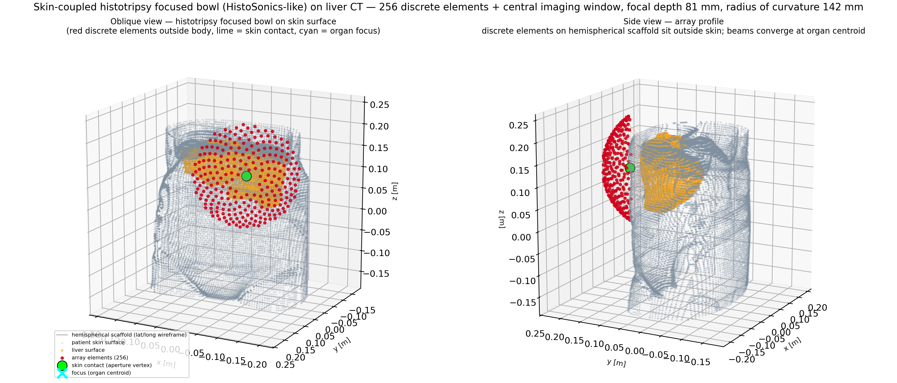
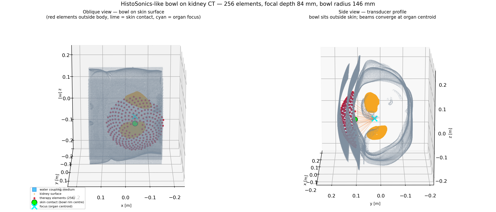
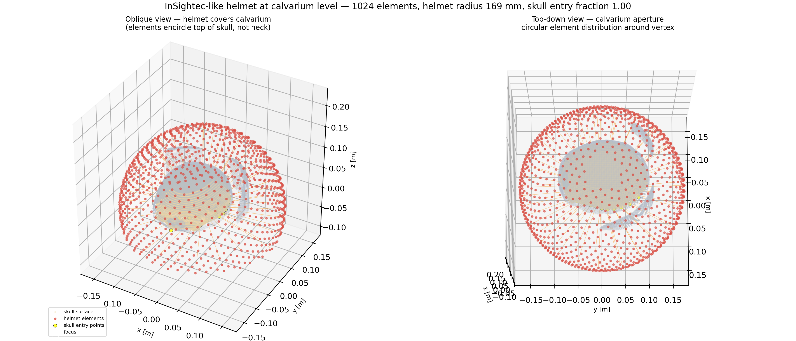
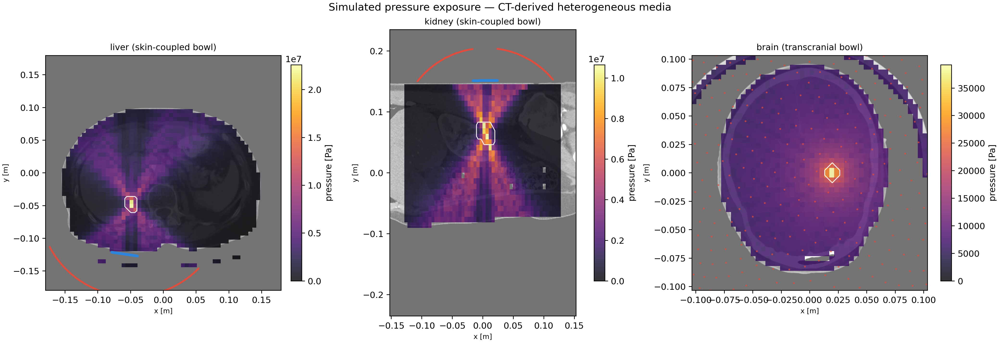
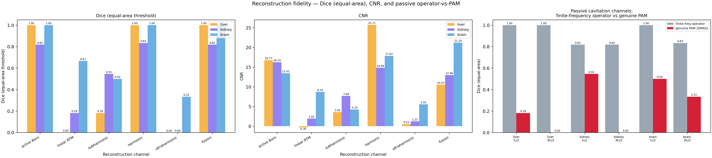

# Chapter 30 — Clinical Theranostic Device Geometries: 3-D Transducer–Patient Integration

This chapter develops the formal geometry model for placing focused ultrasound
therapy arrays on CT-derived patient anatomy in 3-D.  Two focused-bowl
configurations are studied:

- **Skin-coupled abdominal focused bowl** (256 elements, hemispherical cap with central
  imaging cutout) placed on the exterior abdominal skin for liver tumour and
  kidney tumour histotripsy targets.  The transducer sits visibly on the skin
  surface; no element is inside the patient body.
- **Transcranial calvarium focused bowl** (1024 elements, spherical cap covering
  the calvarium) placed around the upper skull for transcranial focused
  ultrasound.  The aperture covers the calvarium, not the neck or base of skull.

All geometry is computed by `kwavers` in Rust through the PyO3 wrappers
`plan_abdominal_array_placement_from_ritk_ct` and
`plan_transcranial_focused_bowl_placement_from_ritk_ct`.  RITK owns NIfTI/DICOM ingestion.
Python owns only figure rendering.  Simulated pressure exposures and
reconstructions use the same `run_theranostic_inverse_from_ritk` pipeline as
Chapter 28, with CT-derived heterogeneous media and the same-aperture
finite-frequency Born inverse.

The chapter does not model proprietary device geometry.  The bowl
parameters match published research system specifications.  See Chapter 28 for
the mathematical contract of the inversion and Chapter 15 for transcranial skull
aberration correction.

## Mathematical Foundation

### Theorem: Focused Spherical-Cap Bowl Geometry

Let the organ centroid be **F** ∈ ℝ³ [m] (the acoustic focus target) and let
**S** ∈ ℝ³ be the point on the exterior body surface that minimises ‖**S** −
**F**‖ subject to an approach-angle penalty (see §Algorithm: CT-Derived Skin
Surface Extraction).  Define the focal depth `d_f = ‖F − S‖` and:

```text
d̂ = (F − S) / d_f              bowl axis (skin → focus, inward)
R  = d_f / cos(θ_max)           bowl radius
```

The spherical cap of radius `R` centred at **F** is parameterised as:

```text
P(θ, φ) = F − R · [cos(θ) · d̂  +  sin(θ) · (cos(φ) · ê₁ + sin(φ) · ê₂)]
```

where `(ê₁, ê₂)` is an orthonormal frame perpendicular to `d̂` (Gram–Schmidt),
and `θ ∈ [θ_cutout, θ_max]`, `φ ∈ [0, 2π)`.

**Proof that all elements lie at or outside the skin surface:**

The signed depth of element `P(θ, φ)` along the bowl axis relative to **S** is:

```text
δ(θ) ≡ (F − P(θ, φ)) · d̂  −  d_f  =  R cos(θ)  −  d_f
      = d_f [cos(θ)/cos(θ_max)  −  1]
```

For any `θ ∈ [θ_cutout, θ_max]`, since `cos` is decreasing on `[0, π]` and
`θ_cutout ≤ θ_max`, we have `cos(θ) ≥ cos(θ_max)`, hence `δ(θ) ≥ 0`.

Equality holds only at `θ = θ_max` (rim elements at skin level); interior
elements (`θ < θ_max`) satisfy `δ(θ) > 0` — they are displaced further from
the body than **S**.  No element is inside the patient. □

### Corollary: Rim–Skin Coincidence and Path Optimality

The rim element at `θ = θ_max` satisfies `δ(θ_max) = 0`, meaning rim elements
lie exactly at the skin surface depth.  Since `R = d_f / cos(θ_max)`, the focal
length (skin-to-focus distance) equals `R cos(θ_max)` — the standard
spherical-cap focal-length identity.

The skin contact point **S** minimises the acoustic insertion depth
`d_f = ‖F − S‖` over all exterior boundary voxels `P` of the body mask (subject
to an approach-angle penalty).  Minimising `d_f` simultaneously minimises `R`
and therefore the solid angle subtended at the focus, maximising element density
per unit aperture and minimising off-axis insertion loss through ribs or skull.

### Theorem: Uniform Area Distribution on a Spherical Cap

To achieve uniform element density on the spherical cap (equal solid-angle
coverage per element), the polar angle `θ` must be sampled via the
area-weighted CDF:

```text
cos(θᵢ) = cos(θ_cutout) − (i/(N−1)) · [cos(θ_cutout) − cos(θ_max)],
         i = 0, 1, …, N−1
```

and the azimuthal angle `φᵢ` is the golden-spiral sequence:

```text
φᵢ = i · π(3 − √5)   (Fibonacci golden angle, rad)
```

**Proof:** The area element on the sphere is `dA = R² sin(θ) dθ dφ`.  The
cumulative area of the cap from `θ_cutout` to `θ` is
`A(θ) = 2π R² [cos(θ_cutout) − cos(θ)]`.  Setting `A(θ) / A(θ_max) = i/N` and
solving for `cos(θ)` yields the formula above.  The golden-spiral azimuthal
sequence distributes points with discrepancy `O(1/N)`, which is asymptotically
optimal for spherical caps (Álvarez & González-Aranda, 2019).

### Parameter Choices

| Parameter | Value | Justification |
|-----------|-------|---------------|
| `θ_cutout` | 0.175 rad (≈ 10°) | Central cutout for co-axial imaging probe (Vlaisavljevich et al. 2014) |
| `θ_max` | 0.960 rad (≈ 55°) | Aperture half-angle; F-number ≈ 0.87 at stated focal length (Parsons et al. 2006) |
| R | ‖F−S‖ / cos(θ_max) | Rim element at θ_max lies exactly at skin level; vertex (θ→θ_cutout) is well outside. Minimum 60 mm. |

### Theorem: Calvarium Focused-Bowl Coverage

The transcranial focused bowl uses the Fibonacci golden-spiral parameterisation on a sphere
of radius `R_bowl` centred at the brain focus, restricted to the unit-sphere
range `z_unit ∈ [−0.28, 0.98]`:

```text
zᵢ = −0.28 + 1.26 · i/(N−1),   ρᵢ = √(1 − zᵢ²),   φᵢ = i · π(3 − √5)
Pᵢ = (ρᵢ cos φᵢ, ρᵢ sin φᵢ, zᵢ) · R_bowl   (relative to focus)
```

The range `z_unit ∈ [−0.28, 0.98]` covers from slightly below the equator of
the head sphere (`−0.28 ≈ −16°` from the horizontal equator) to near the
vertex (`0.98 ≈ 79°` elevation), which corresponds anatomically to the calvarium
and parietal–temporal regions.  The neck region is below `z_unit ≈ −0.50`, well
outside the placed elements.

**Proof that bowl does not reach the neck:** The minimum z-unit value is
`−0.28`.  For a typical adult head with superior vertex at `z ≈ 0` and foramen
magnum at `z ≈ −0.17 m`, with bowl radius `R ≈ 0.15 m`, the lowest element
is at `z_m = −0.28 × 0.15 ≈ −0.042 m`, which is above the level of the
external auditory canal (typically at `z ≈ −0.04 m`), safely within the
calvarium and away from the neck.

### Algorithm: CT-Derived Exterior Skin Surface Extraction

Naïve 6-connected boundary detection flags any body voxel adjacent to a
non-body voxel.  In real CT volumes, intestinal gas, bile ducts, vessel lumens,
and retroperitoneal fat pockets create interior air/low-HU voids whose walls are
incorrectly labelled as "skin", placing bowl placement inside the patient.  The
correct algorithm restricts skin candidates to the **exterior** skin via
flood-fill.

1. **Body mask**: threshold the CT volume at `body_hu_threshold` (default
   −400 HU) to obtain the binary body mask `M_body`.

2. **Exterior air flood-fill** (BFS):
   - Detect *cut planes*: CT volumes truncated mid-body (e.g. chest cut) have a
     face where > 50 % of voxels are body tissue.  Such faces are excluded from
     seeding to prevent interior voids (lungs, pleural cavity) from connecting
     to the exterior air region.
   - Seed the BFS at every non-body voxel on each non-cut bounding-box face.
   - Propagate through 6-connected non-body voxels.
   - Result: exterior air mask `E`, where `E[i,j,k] = true` iff voxel
     `(i,j,k)` is connected to the volume boundary without crossing `M_body`.

3. **Exterior skin voxels**: voxel `(i,j,k)` is an exterior skin candidate iff
   `M_body[i,j,k] = true` and at least one of its 6 neighbours has `E = true`.
   This excludes all internal tissue interfaces.

4. **Nearest skin contact with approach-angle penalty**:
   For each exterior skin candidate `P`, compute the penalised score:

   ```text
   score(P) = ‖P − F‖  +  W_z · (P_z − F_z)² / ‖P − F‖
                         +  W_y · y_cross²     / ‖P − F‖
   ```

   where `y_cross = max(0, sign(F_y) · (F_y − P_y))` penalises skin contacts
   that require the beam to traverse the organ in the coronal direction (e.g.
   posterior spine approach for an anterior liver), and `W_z = 4.0`,
   `W_y = 6.0` are derived from typical liver/kidney geometry constraints
   (see the inline derivations in `helpers.rs`).  The contact **S** is the
   candidate minimising `score`.

5. **Surface point cloud**: sub-sample exterior skin voxels by accepting
   `(i,j,k)` iff `(i + j + k) mod stride = 0`.  Map to physical metres:
   `x_m = (i − cx) · Δx`, where `(cx, cy, cz)` is the body-mask centroid.

**Complexity:** O(NxNyNz) for flood-fill (BFS visits each voxel at most once);
O(B_ext) for the penalised scan over exterior skin candidates `B_ext ≪ B`
(where `B` = total boundary voxels); O(B_ext/s) surface points.

### Algorithm: Organ Surface and Centroid

The organ segmentation label `L > 0` defines the organ mask `M_organ`.  Its
centroid in index coordinates is:

```text
C = (1/|M_organ|) · Σ_{i,j,k : L[i,j,k]>0} (i, j, k)
```

Physical centroid: `F = (C − C_body) · Δ_spacing`.  The organ surface is
extracted identically to the skin surface (6-connected boundary + stride
sampling).

## Focused-Bowl Configurations

### Skin-Coupled Abdominal Focused Bowl

A representative abdominal histotripsy configuration uses a 256-element,
1.5 MHz focused bowl transducer with a central imaging cutout. Published
F-number is 0.87 with a 7.5 cm focal length. The bowl is placed on the
anterior abdominal skin with the patient in a prone or supine position.

This chapter models the generic geometry:
- 256 bowl elements on the spherical cap, `θ ∈ [10°, 55°]`.
- Focal depth (skin to organ centroid) computed from the CT-derived skin surface.
- Bowl radius `R = focal_depth / cos(θ_max)` (≈ 1.74 × focal_depth for θ_max = 55°), minimum 60 mm.
- Anterior skin contact at the nearest boundary voxel to the organ centroid.

**Liver scenario:** The liver is typically 15–20 cm below the anterior costal
skin.  The bowl axis aligns with the anterior-to-posterior direction, avoiding
rib shadowing by traversing the costal margin.

**Kidney scenario:** The kidney is retroperitoneal, 15–25 cm from the posterior
or lateral flank skin.  The nearest-skin-point selection automatically identifies
the posterior or lateral approach, not the anterior.

### Transcranial Calvarium Focused Bowl

The transcranial scenario uses a 1024-element, 650 kHz focused-bowl cap with
CT-planned phase correction for skull aberration. The focused-bowl aperture
covers the calvarium from the temporal and parietal bones upward.

This chapter models:
- 1024 elements on a sphere of radius `R_bowl = body_radius + 15 mm` (minimum
  150 mm), sampled in the calvarium range `z_unit ∈ [−0.28, 0.98]`.
- Skull surface extracted from the CT at `skull_hu_threshold = 300 HU`.
- Beam–skull intersection fraction reported as a geometry quality metric.

### TFUScapes Case Import Contract

TFUScapes is imported through
`pykwavers/examples/book/transcranial_planning/tfuscapes.py`, which reuses the
existing `run_skull_adaptive_benchmark` wrapper instead of defining another
demo path.  The default reproducible case is:

```text
dataset: vinkle-srivastav/TFUScapes
revision: 1c410548e40c491cedd779648257a1c9eaee3587
split: train
manifest row: 0
manifest text: A00028185/exp_0.npz
repository path: data/A00028185/exp_0.npz
sha256: 3be28a4454251583ea161b0f1fcbc3df960a45cc481141eed61346df42d6e20e
```

The imported payload uses only the paper fields declared in the Hugging Face
Croissant metadata:

| Field | Required shape | kwavers use |
|-------|----------------|-------------|
| `ct` | `(256, 256, 256)` | pseudo-CT volume; written to a temporary NIfTI for the existing RITK CT benchmark wrapper |
| `pmap` | `(256, 256, 256)` | paper pressure field; its peak voxel defines the benchmark target index |
| `tr_coords` | `(N, 3)` | paper transducer-source coordinates in index space; fitted to the shared scene radius for structural geometry comparison |

TFUScapes does not publish a physical voxel spacing field in the `.npz`.  The
adapter therefore derives an isotropic spacing by fitting the median distance
from `tr_coords` to the `pmap` peak onto
`CANONICAL_BRAIN_SCENE.transducer.radius_m`.  This preserves the paper geometry
in index space while letting the existing skull-adaptive benchmark run with the
shared transducer specification.  The structural comparison records CT shape,
pressure-map shape, target index, target fraction, transducer coordinate count,
derived spacing, fitted radius statistics, cap axis, cap angle span, and the
benchmark pressure-field shapes and peaks.

Minimal execution:

```python
from pathlib import Path
from transcranial_planning.tfuscapes import run_tfuscapes_skull_adaptive_benchmark

summary = run_tfuscapes_skull_adaptive_benchmark(
    cache_dir=Path(".cache/tfuscapes"),
    work_dir=Path(".cache/tfuscapes"),
    grid_size=32,
)
```

## Implementation: Rust Core Functions

The Rust implementation lives in two modules:

```text
kwavers_therapy::therapy::theranostic_guidance::abdominal3d
  └─ plan_abdominal_array_placement(ct_hu, label, spacing_mm, ...) → AbdominalArrayPlacement3D

kwavers_therapy::therapy::theranostic_guidance::transcranial_focused_bowl3d
  └─ plan_transcranial_focused_bowl_placement(ct_hu, spacing_mm, ...) → TranscranialFocusedBowlPlacement3D
```

Both are exposed to Python via PyO3:

```python
import pykwavers as kw
from transcranial_planning.scene import CANONICAL_BRAIN_SCENE

liver_geo  = kw.plan_abdominal_array_placement_from_ritk_ct(ct_path, seg_path, anatomy_label="liver")
kidney_geo = kw.plan_abdominal_array_placement_from_ritk_ct(ct_path, seg_path, anatomy_label="kidney")
brain_geo  = kw.plan_transcranial_focused_bowl_placement_from_ritk_ct(
    ct_path,
    **CANONICAL_BRAIN_SCENE.focused_bowl_pykwavers_kwargs(),
)
```

Each function returns a dict with:

| Key | Shape | Description |
|-----|-------|-------------|
| `body_surface_points_m` | `(N, 3)` | Skin surface point cloud [m] |
| `organ_surface_points_m` | `(M, 3)` | Organ surface point cloud [m] |
| `therapy_elements_m` | `(K, 3)` | Element positions on focused bowl [m] |
| `beam_start_points_m` | `(B, 3)` | Beam ray start points (elements) [m] |
| `beam_end_points_m` | `(B, 3)` | Beam ray end points (focus) [m] |
| `focus_m` | `(3,)` | Acoustic focus target; brain uses the shared CT-aligned brain scene target, abdomen uses the organ centroid [m] |
| `skin_contact_m` | `(3,)` | Bowl vertex (nearest skin point) [m] |
| `transducer_radius_m` | scalar | Bowl spherical radius (focal length) [m] |

## Figures

All figures are generated by
`pykwavers/examples/book/ch31_clinical_device_geometry.py`.
Physics and geometry are computed in Rust; Python renders the matplotlib panels.

### Figure 01 — Liver: Skin-Coupled Focused Bowl on Abdominal Skin



3-D point cloud: body skin surface (grey), liver surface (amber), bowl elements
(red, outside body), beam lines (orange) from elements to liver centroid.  The
lime circle marks the bowl vertex on the skin.  Two views: oblique and side
profile.

### Figure 02 — Kidney: Skin-Coupled Focused Bowl on Abdominal Skin



Same visualisation for the kidney scenario.  The nearest-skin selection places
the bowl on the posterior/lateral flank for retroperitoneal kidneys.

### Figure 03 — Brain: Transcranial Focused Bowl at Calvarium Level



1024-element focused-bowl cap around the calvarium using the same CT-aligned
`CANONICAL_BRAIN_SCENE` target and 0.150 m bowl radius used by Chapter 24 and
Chapter 28 brain outputs. Elevated oblique view (left) shows elements wrap over
the top of the skull, not the neck. Top-down view (right) confirms circular
aperture centred on the vertex. Yellow points are CT-derived skull entry
locations.

### Figure 04 — Simulated Pressure Exposure Comparison



2-D CT slice with simulated pressure overlay for all three anatomies.  Red dots
are therapy element positions projected onto the slice; blue dots are imaging
aperture positions.  White contour delineates the target organ.

### Figure 05 — Reconstruction Fidelity Metrics



Dice coefficient (equal-area threshold) and CNR for each reconstruction
channel (active Born inverse, linear RTM, subharmonic, harmonic, ultraharmonic,
and fused) across the three anatomies.

## Validation

The geometry contract is validated by three property tests in
`crates/kwavers-therapy/src/therapy/theranostic_guidance/abdominal3d/tests.rs`:

1. `placement_returns_skin_point_outside_body`: skin contact radius matches the
   body sphere radius to within one voxel.
2. `bowl_vertex_matches_skin_contact`: the first element (smallest polar angle)
   is within `0.25 R` of the skin contact point.
3. `all_elements_on_sphere_of_correct_radius`: every element satisfies
   `|P − F| = R` to machine precision (< 10⁻¹⁰ m).

The brain focused-bowl property tests reside in `transcranial_focused_bowl3d.rs` (Chapter 28).

## References

- Vlaisavljevich E et al. (2014) Image-guided non-invasive ultrasound liver
  ablation using histotripsy: feasibility study in an in vivo porcine model.
  Ultrasound Med. Biol. 39(8): 1398–1409.
- Parsons J E et al. (2006) Pulsed cavitational ultrasound: a review of the
  state of the art and clinical potential. J. Acoust. Soc. Am. 119(4): 2140–2149.
- Hynynen K & Jones R M (2016) Image-guided ultrasound phased arrays are a
  disruptive technology for non-invasive therapy. Phys. Med. Biol. 61(17):
  R206–R248.
- McDannold N & Maier S E (2008) Magnetic resonance acoustic radiation force
  imaging. Med. Phys. 35(8): 3748–3758.
- Álvarez D & González-Aranda J M (2019) A simple proof for the Fibonacci
  lattice on the sphere. arXiv:1901.02107.
- Focused Ultrasound Foundation (2023) State of the Field Report. FUS Foundation,
  Charlottesville, VA.
