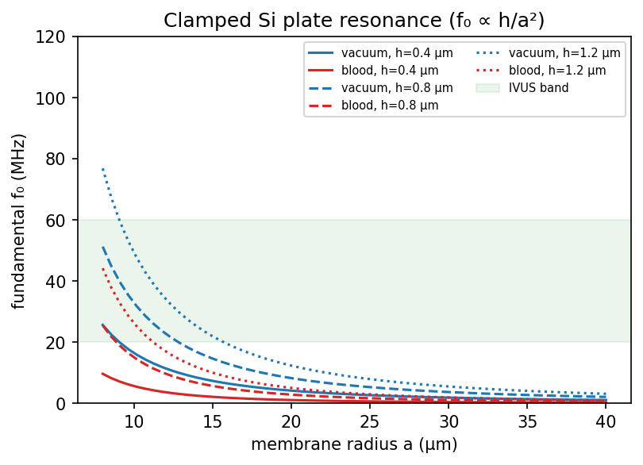
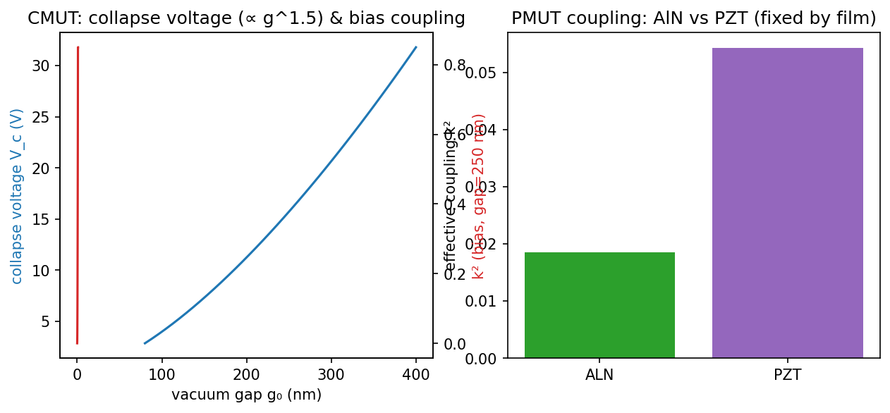
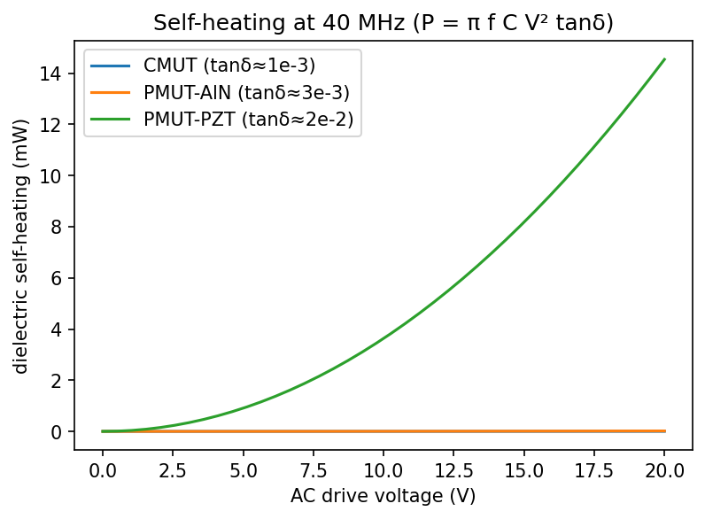
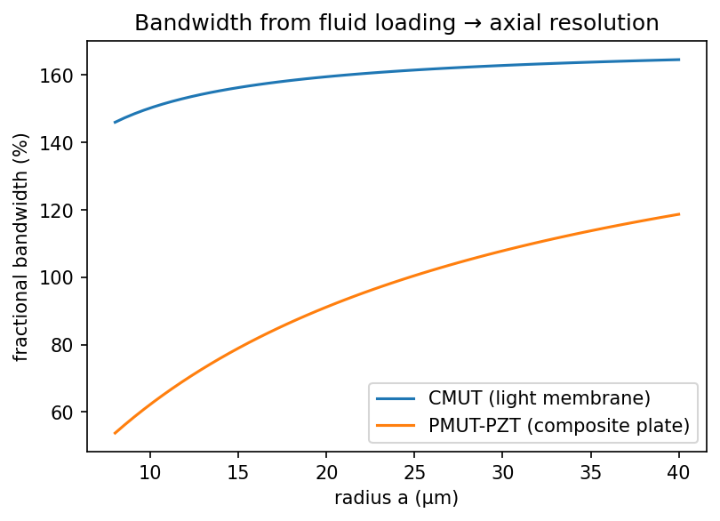
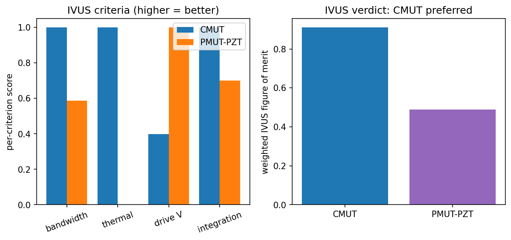
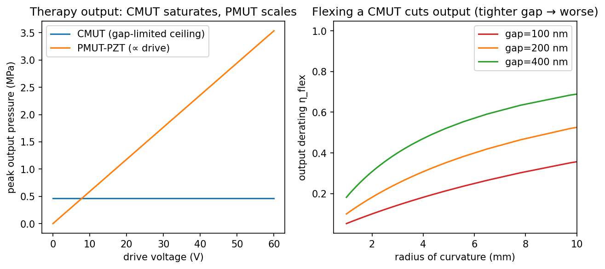

# Chapter 33 — CMUT vs PMUT: Micromachined and Flexible Transducers for IVUS

**Scope.** This chapter compares the two micromachined ultrasonic transducer (MUT)
technologies — **CMUT** (capacitive) and **PMUT** (piezoelectric) — as element technologies for
**flexible, catheter-integrated arrays**, and shows, by simulation, that the better choice
*depends on the application*: **CMUT for IVUS imaging** (bandwidth + CMOS integration, §33.8) but
**PMUT / bulk-piezo for therapy** (high output pressure at 2–5 MHz, §33.9). It covers operating
principle, electrical properties, microfabrication, self-heating, bandwidth/resolution, output
pressure, and the flexible-output limitation. Every quantitative comparison is computed by the
first-principles models in `kwavers_transducer::mems` (ADR 015); the figures are generated from
that Rust core.

> **Prerequisites:** Sources and Transducers (Chapter 6) for the single-element radiation and the
> clamped-plate / piston background; Safety and Dosimetry (Chapter 16) for the in-vessel thermal
> limit; Intravascular Ultrasound (Chapter 29) for the IVUS imaging context.

---

## 33.1 Why Micromachined Transducers

Bulk-piezoelectric (PZT) elements dominate conventional probes but scale poorly to the tiny,
conformal, high-frequency arrays that catheter-based imaging needs: dicing 40 MHz PZT to a
catheter pitch is hard, the elements are stiff (not conformal), and there is no monolithic path
to the front-end electronics. **Micromachined** transducers — patterned lithographically on a
silicon wafer — solve all three: arbitrary element layout at micron pitch, thin (flexible)
membranes/plates, and (for CMUT) the *same* silicon process as the CMOS receive ASIC.

Two physical mechanisms compete:

| | CMUT | PMUT |
|---|------|------|
| Actuation | Electrostatic (vibrating membrane over a vacuum gap) | Piezoelectric (flexing unimorph plate) |
| Drive | DC bias near collapse + AC | Low-voltage AC |
| Material | Si / SiN membrane, vacuum gap | AlN or PZT film on Si |
| Coupling | Bias-dependent, rises toward collapse | Fixed by film `e₃₁,f` |
| Bandwidth | Very wide (light membrane, strong fluid coupling) | Moderate |
| CMOS integration | Monolithic (same Si) | Hybrid (PZT needs its own process) |

Both are modelled here as a **clamped circular plate** (radius `a`, thickness `h`); the shared
physics is in `kwavers_transducer::mems::plate`.

---

## 33.2 Shared Mechanics: the Clamped Circular Plate

Both a CMUT membrane and a PMUT plate are clamped circular plates. The flexural rigidity and
in-vacuo fundamental are

$$
D = \frac{E h^3}{12(1-\nu^2)}, \qquad
f_0 = \frac{\lambda^2}{2\pi}\,\frac{h}{a^2}\sqrt{\frac{E}{12\rho(1-\nu^2)}},\quad \lambda^2 = 10.2158.
$$

The key scaling is **`f₀ ∝ h/a²`** — high IVUS frequencies (20–60 MHz) require thin, small plates.
In immersion the radiated fluid mass lowers the resonance (Lamb added-mass),

$$
f_\text{imm} = \frac{f_0}{\sqrt{1 + \beta}}, \qquad \beta = \Gamma\,\frac{\rho_f\,a}{\rho\,h},\ \ \Gamma = 0.6689 .
$$

`β` is the **fluid-loading ratio** — the added fluid mass relative to the structural areal mass.
It is the single most important number in this chapter: a *light* structure (large `β`) couples
strongly to the fluid and therefore radiates over a *broad* band.

*Figure 33.1. In-vacuo and in-blood fundamental resonance of a clamped Si plate vs radius for
several thicknesses (`kwavers_transducer::mems::plate`). The `f₀ ∝ h/a²` scaling sets the IVUS
operating point; immersion lowers `f₀` by the Lamb factor.*

---

## 33.3 Electrical Properties

### 33.3.1 CMUT — capacitance, collapse, bias-dependent coupling

A CMUT is a parallel-plate capacitor whose top plate is the membrane:

$$
C_0 = \frac{\varepsilon_0 A}{g_0}, \qquad A = \pi a^2 .
$$

Electrostatic attraction softens the membrane; beyond the **collapse (pull-in) voltage** the
membrane snaps to the substrate:

$$
V_\text{collapse} = \sqrt{\frac{8\,k\,g_0^3}{27\,\varepsilon_0 A}},
$$

with `k` the effective modal stiffness (self-consistent with `f₀`). Because `V_c ∝ g₀^{3/2}`, the
sub-micron gaps needed for high sensitivity put the bias in the tens-of-volts range. The
electromechanical coupling **rises with bias**, approaching unity near collapse:

$$
k^2_\text{eff} \approx \left(\frac{V_\text{DC}}{V_\text{collapse}}\right)^2 .
$$

CMUTs are therefore biased just below collapse (or operated in *collapse mode*) to maximise
coupling — a defining operational constraint.

**DC pull-down and spring softening.** Under a sub-collapse bias the membrane settles at a
static deflection `u = x/g₀` set by the force balance `k x = ε₀ A V²/(2(g₀−x)²)`, which
non-dimensionalises (using `V_c`) to

$$
u\,(1-u)^2 = \tfrac{4}{27}\left(\frac{V_\text{DC}}{V_\text{collapse}}\right)^2,
\qquad u \in [0, \tfrac13].
$$

`g(u)=u(1-u)^2` increases monotonically to its maximum `4/27` at `u = 1/3`, which is reached
exactly at `V = V_c` — the **pull-in** instability (no stable equilibrium beyond it). The bias
raises the small-signal capacitance to `C(V)=C₀/(1−u)` and **softens** the effective stiffness,
because the electrostatic force adds a negative spring `dF_\text{elec}/dx = 2k\,u/(1-u)`:

$$
k_\text{eff} = k\left(1 - \frac{2u}{1-u}\right),
\qquad f(V) = f_\text{imm}\sqrt{k_\text{eff}/k},
$$

so the resonance falls with bias and **vanishes at pull-in** (`u = 1/3 ⇒ k_eff = 0`). These are
`CmutCell::{bias_pulldown_fraction, biased_gap, biased_capacitance, bias_softened_resonance}`
(`kwavers_transducer::mems::cmut`), solved by bisection on the monotone branch `u ∈ [0, 1/3]`.

### 33.3.2 PMUT — film capacitance, fixed coupling, low voltage

A PMUT is driven through the piezoelectric film capacitance `C₀ = ε₀ ε_r A / t_p`. Its coupling
is set by the film, not the bias:

$$
k^2_\text{eff} \approx \eta_\text{geo}\,\frac{e_{31,f}^2}{\varepsilon_0 \varepsilon_r\, Y},
$$

so **PZT** (`e₃₁,f ≈ −10 C/m²`) couples far more strongly than **AlN** (`e₃₁,f ≈ −1.05 C/m²`),
at the cost of a much higher permittivity and loss. Crucially, a PMUT needs **no DC bias** and
operates at a few volts — a decisive advantage for catheter electronics.

### 33.3.3 Phase-type FZP-pMUT focusing

Shimoyama, Teshigahara, and Yoshida (2026) show a different way to spend PMUT
layout freedom: keep one shared electrical drive, but alternate the electrode
geometry so selected cells emit the opposite acoustic phase. A circle-electrode
cell is modeled as phase `0`; a donut-electrode cell is modeled as phase `pi`.
Placing those cells on the phase-type Fresnel-zone-plate rows gives short-axis
focusing without a separate acoustic lens or a second-axis phased-array driver.

The article prototype is represented acoustically as a 29 short-axis row by 25
long-axis column source grid with 84 um pitch, 60 um diaphragms, 12 MHz drive in
FC-70, 4 mm design focus, and the eight D-type rows visible in Fig. 3(a-1). The
source-level evidence tier is value-semantic: tests should pin the reported grid,
row phases, and Fresnel radius formula, then verify that the resulting
Rayleigh-Sommerfeld source gives higher focal pressure than the same array with
all C-type phases. The article's piezoelectric FEM stack, measured crosstalk,
resonant frequency splitting, and hydrophone spatial averaging are separate
device and measurement models, not implied by the acoustic source geometry.

*Figure 33.2. (left) CMUT collapse voltage vs gap (`V_c ∝ g^{3/2}`) and bias-dependent coupling;
(right) PMUT fixed coupling `k²` for AlN vs PZT (`kwavers_transducer::mems::{cmut,pmut}`). CMUT
trades a high bias for tunable coupling; PMUT-PZT gives high coupling at low voltage.*

---

## 33.4 Microfabrication

| Step | CMUT | PMUT |
|------|------|------|
| Cavity / plate | Sacrificial-release **or** wafer-bonding (SOI) to define the vacuum gap | DRIE-etched Si cavity; plate = device layer |
| Active layer | None (the gap *is* the transducer) | Sputtered **AlN** or sol-gel/sputtered **PZT** film + electrodes |
| Poling | Not required | PZT must be **poled** (high field, elevated T) |
| CMOS path | **Monolithic** — low-temperature bonding over a finished CMOS wafer | Hybrid — PZT's high process temperature and lead contamination preclude monolithic CMOS |
| Yield risk | Gap uniformity, charging of the dielectric | Film stress / cracking, poling uniformity |

The manufacturing story is the second decisive axis: **CMUT integrates monolithically with the
receive ASIC** (Stanford CMUT-on-CMOS), which is exactly the constraint a 1 mm catheter tip
imposes. PMUT-AlN is CMOS-compatible in temperature but still typically hybrid-integrated;
PMUT-PZT is not CMOS-compatible.

---

## 33.5 Heating Properties

Self-heating matters because an IVUS array sits inside a coronary artery, where the thermal
budget is tight (Chapter 16). The dominant loss in a MUT is dielectric:

$$
P_\text{diel} = \pi f\, C_0\, V_\text{ac}^2\, \tan\delta .
$$

The loss tangents differ by an order of magnitude: **CMUT** `tan δ ≈ 10⁻³` (a vacuum gap has
almost no loss), **AlN** `≈ 3×10⁻³`, **PZT** `≈ 2×10⁻²`. PZT also has mechanical (hysteretic)
loss not present in a CMUT. For comparable drive, **PZT PMUTs run substantially hotter than
CMUTs** — a real safety critique for prolonged in-vessel imaging.

*Figure 33.3. Dielectric self-heating power vs drive for CMUT, PMUT-AlN, and PMUT-PZT
(`self_heating_power`). The vacuum-gap CMUT dissipates least; PZT (high `tan δ`) most.*

---

## 33.6 Bandwidth and Resolution

Axial resolution `δz ≈ c/(2·BW)` is set by fractional bandwidth (FBW). FBW is driven by the
fluid-loading ratio `β` of §33.2:

$$
\text{FBW} \approx \text{FBW}_\text{max}\,\frac{\beta}{\beta+1},\quad \text{FBW}_\text{max}\approx 1.7 .
$$

A CMUT's bare membrane is far lighter than a PMUT's piezo+passive composite, so `β_CMUT ≫
β_PMUT` and the CMUT radiates over a much broader band (often >120% vs ~70–90%). For IVUS — where
distinguishing a thin fibrous cap from a lipid core demands fine axial resolution — **this is the
CMUT's headline advantage.**

For *vented* or non-evacuated CMUTs a second damping channel appears: **squeeze-film** damping of
the gas in the gap, `c = 3π μ a⁴/(2g₀³)` (`CmutCell::squeeze_film_damping`). Its steep `a⁴/g₀³`
scaling makes it dominant for wide, narrow-gap cells, and the squeeze number `σ = 12μωa²/(p_a g₀²)`
sets the crossover from viscous damping (`σ≪1`) to a trapped-gas spring (`σ≫1`). A sealed-vacuum
immersion CMUT (the IVUS case) has no gap gas and is **radiation-damped** instead: the loading
fluid carries energy away through the baffled-piston radiation resistance, which in the
small-`ka` limit is

$$
R_\text{rad} \approx \tfrac12\,\rho_f c_f A\,(ka)^2,\qquad ka = \omega_0 a / c_f,
$$

giving a radiation-limited quality factor and bandwidth

$$
Q_\text{rad} = \frac{\omega_0 m}{R_\text{rad}},\qquad \text{FBW} \approx \frac{1}{Q_\text{rad}},
$$

with `m` the modal mass (§33.2). Because `R_rad ∝ (ka)²` rises steeply with size and frequency,
the small, high-frequency IVUS cell radiates efficiently (low `Q`, broad band) — the physical
reason a sealed immersion CMUT reaches the wide FBW of Figure 33.4. This is
`CmutCell::radiation_q` (and `fractional_bandwidth` via the fluid-loading ratio `β`).

*Figure 33.4. Fractional bandwidth vs fluid-loading ratio `β`, with the CMUT and PMUT IVUS
operating points marked (`fractional_bandwidth`). The lighter CMUT membrane sits far up the
curve → finer axial resolution.*

---

## 33.7 Flexible / Conformal Transducers

Both technologies thin to flexible form: CMUT wafers can be back-ground to <50 µm and tiled on a
polymer carrier; PMUT-on-polyimide is an active research line. kwavers models the conformal array
geometry/calibration in `kwavers_transducer::flexible::FlexibleTransducerArray` (Chapter 6),
which the per-element CMUT/PMUT models of this chapter populate. For a *catheter wrap*, the CMUT's
silicon process (and monolithic CMOS) again wins on integration density; PMUT's low-voltage drive
eases the flex-cable and isolation design.

---

## 33.8 The IVUS Verdict (Proven by Simulation)

IVUS prioritises, in order: **axial resolution** (fractional bandwidth), **thermal safety**,
**drive-voltage feasibility**, and **monolithic integration**. `mems::comparison::evaluate_ivus`
scores both technologies on these weighted criteria (0.40 / 0.30 / 0.15 / 0.15). For representative
40 MHz designs in blood (CMUT: a=14 µm, h=0.4 µm, gap=0.25 µm; PMUT-PZT: a=20 µm, 1 µm PZT on
2 µm Si):

- **Bandwidth** — CMUT FBW > PMUT FBW (lighter membrane) → better axial resolution. ✔ CMUT
- **Thermal** — CMUT (`tan δ≈10⁻³`) self-heats far less than PZT (`≈2×10⁻²`). ✔ CMUT
- **Drive voltage** — PMUT runs at a few volts vs the CMUT's tens-of-volts collapse bias. ✔ PMUT
- **Integration** — CMUT is monolithic with CMOS. ✔ CMUT

The weighted figure of merit favours **CMUT for IVUS**, driven by bandwidth, thermal safety, and
CMOS integration — the verdict the simulation returns (`recommended == MutKind::Cmut`). PMUT's
genuine advantages (low drive voltage, high transmit sensitivity) make it preferable when the
weighting is drive-dominated; the comparison reproduces that flip when the drive weight is raised.

*Figure 33.5. Weighted IVUS figure of merit, CMUT vs PMUT, with the per-criterion scores
(`evaluate_ivus`). CMUT wins the default IVUS weighting; the verdict flips to PMUT only under a
drive-voltage-dominated weighting.*

### Critiques (honest limitations)

- **CMUT:** needs a high DC bias and is sensitive to dielectric charging (drift); collapse-mode
  operation is nonlinear (the pre-collapse nonlinear electrostatics — bias pull-down, capacitance
  rise, and **spring-softening to pull-in** — are modelled in `CmutCell::{bias_pulldown_fraction,
  biased_gap, biased_capacitance, bias_softened_resonance}`, the equilibrium of
  `k x = ε₀ A V²/(2(g₀−x)²)`; the resonance vanishes at `V = V_c`); low transmit pressure per volt
  vs piezo.
- **PMUT:** PZT is not CMOS-compatible and runs hot; AlN is CMOS-friendly but low-coupling (low
  sensitivity); both have narrower bandwidth than CMUT.
- **Model scope:** these are lumped clamped-plate models (ADR 015) — first-order for design
  comparison. Squeeze-film gap-gas damping is modelled (`CmutCell::squeeze_film_damping`,
  `squeeze_number`, §33.6). **Inter-element acoustic crosstalk** (the fluid path) is modelled in
  `mems::crosstalk`: the baffled-monopole mutual radiation impedance
  `Z_ij = jωρ A_iA_j/(2π d)\,e^{-jkd}` between cells and the array `crosstalk_matrix` (reciprocal,
  `1/d` decay; valid for `d≫a`, `ka≲1`). The **substrate** crosstalk path (dispersive Lamb/Stoneley
  membrane-support waves) and full coupled-field FEM remain out of scope (require a meshed model).
- **Conformal flexible array:** a deformable CMUT/PMUT aperture refocuses after it bends via the
  geometry-driven beamformer in `flexible::beamforming` — `focusing_delays`
  (`τ_i=(d_max−d_i)/c`, in-phase arrival at the focus for *any* tracked geometry), `steering_delays`,
  `per_element_curvature` (Menger), and `cmut_flex_apodization` (per-element transmit weight from
  `CmutCell::flex_gap_derating` at the local curvature). This is the array "populated" by the cell
  model: output falls where the wrap is tight (sub-micron gap perturbed by the sag).

---

## 33.9 Therapeutic Regime: High Pressure at 2–5 MHz

The IVUS verdict above optimised for **bandwidth and integration** — the priorities of *imaging*.
**Therapy** (HIFU, histotripsy, BBB opening) is a different problem: it needs **high acoustic
pressure** (often >1 MPa, up to tens of MPa for histotripsy) at **2–5 MHz**, and the governing
metric is *deliverable output pressure*, not bandwidth. This flips the comparison.

### 33.9.1 The CMUT output ceiling — a gap-limited electrostatic "lever"

A CMUT is an **electrostatic actuator**: the membrane is pulled toward the substrate by the
field, and the force `∝ V²/g²` rises steeply as the gap closes (the "lever"/snap-in behaviour).
But the membrane **cannot displace more than the gap** before it collapses, so the peak surface
velocity — and hence the peak radiated pressure — is *hard-capped*:

$$
p_\text{max}^\text{CMUT} \approx \rho c\,\omega\,(g_0\,s),\qquad s \lesssim \tfrac{1}{3}\ \text{(conventional)},
$$

with `g₀` the sub-micron gap. **Driving harder cannot beat this ceiling** — once at collapse, the
output saturates. This is `CmutCell::max_output_pressure` (verified: output `∝ g₀`, independent of
drive). For therapy that demands large volume displacement, the sub-micron gap is the bottleneck.

### 33.9.2 PMUT (and bulk piezo) scale with drive

A PMUT bends by **piezoelectric strain**, `w ∝ d₃₁·V` — *not* gap-limited. Output rises with the
drive up to the piezo breakdown field, so a PZT PMUT (high `e₃₁,f`) delivers more pressure, and a
**bulk-PZT** stack (thick active material, large strain volume) more still. `PmutCell::
max_output_pressure` verifies output `∝ drive` and PZT > AlN. For high-pressure 2–5 MHz therapy,
**PMUT beats CMUT, and bulk PZT remains the clinical workhorse.**

### 33.9.3 Flexing a CMUT cuts its output (your concern, quantified)

The capacitive mechanism makes CMUTs *especially* hard to flex: wrapping the die to a radius
`1/κ` sags each cell by `δ = ½κa²`, perturbing the **sub-micron gap** by `δ/g₀`. Non-uniform gap
spreads the collapse voltage and detunes cells, so coherent output falls as

$$
\eta_\text{flex} = \frac{1}{1 + \delta/g_0}.
$$

`CmutCell::flex_gap_derating` confirms this and that **tighter gaps lose more** — exactly the
limitation you noted: the smaller the gap (the higher the sensitivity), the more a flexible CMUT
sacrifices output. A PMUT has *no gap* to perturb, so it keeps its piezo drive on a flexible
carrier (it still loses the shared substrate-recoil factor `flexible_output_factor`, but not the
gap penalty).

### 33.9.4 Therapeutic verdict

`mems::comparison::evaluate_therapy` scores both on deliverable output pressure (with the flex
penalty). For 2–5 MHz designs in water at therapy drive, **PMUT > CMUT** on output, and the gap
penalty *widens* the margin on a flexible catheter (`recommended == MutKind::Pmut`):

- **High-pressure therapy → piezoelectric** (PMUT for MEMS, **bulk PZT** for the highest output).
- CMUT's strengths (bandwidth, receive sensitivity, CMOS integration) are imaging virtues, not
  therapy ones; its gap-limited, flex-sensitive output makes it the weaker therapeutic choice.

*Figure 33.6. (left) Peak output pressure vs drive — CMUT saturates at its gap-limited ceiling
while PMUT scales with drive (`max_output_pressure`); (right) CMUT output vs catheter curvature
for several gaps, showing the flex penalty `1/(1+δ/g₀)` — tighter gaps fall fastest
(`flex_gap_derating`).*

---

## 33.10 Implementation in kwavers

| Concept | path | Key item |
|---------|------|----------|
| Clamped-plate physics | `kwavers_transducer::mems::plate` | `flexural_rigidity`, `vacuum_resonance`, `immersion_resonance`, `fluid_loading_beta` |
| CMUT cell | `kwavers_transducer::mems::cmut` | `CmutCell` (`capacitance`, `collapse_voltage`, `coupling_k2`, `self_heating_power`, `fractional_bandwidth`, `max_output_pressure`, `flex_gap_derating`, `squeeze_film_damping`, `squeeze_number`) |
| PMUT cell | `kwavers_transducer::mems::pmut` | `PmutCell`, `PiezoFilm::{Aln, Pzt}` (`coupling_k2`, `self_heating_power`, `transmit_sensitivity`, `deflection_per_volt`, `max_output_pressure`) |
| IVUS comparison | `kwavers_transducer::mems::comparison` | `evaluate_ivus`, `IvusVerdict`, `IvusWeights`, `MutKind` |
| Therapy comparison | `kwavers_transducer::mems::comparison` | `evaluate_therapy`, `TherapyVerdict` |
| Flexible array geometry | `kwavers_transducer::flexible` | `FlexibleTransducerArray` |

Figures are generated by `crates/kwavers-python/examples/book/ch33_cmut_vs_pmut.py`, which imports
`pykwavers` directly and calls the Rust models through the PyO3 binding layer
(physics in Rust, plotting in Python).

---

## References

1. Oralkan, Ö., et al. (2002). Capacitive micromachined ultrasonic transducers: next-generation
   arrays for acoustic imaging? *IEEE TUFFC*, 49(11), 1596–1610.
2. Khuri-Yakub, B. T., & Oralkan, Ö. (2011). Capacitive micromachined ultrasonic transducers for
   medical imaging and therapy. *J. Micromech. Microeng.*, 21(5), 054004.
3. Muralt, P., et al. (2005). Piezoelectric micromachined ultrasonic transducers based on PZT thin
   films. *IEEE TUFFC*, 52(12), 2276–2288.
4. Jung, J., et al. (2017). Review of piezoelectric micromachined ultrasonic transducers and their
   applications. *J. Micromech. Microeng.*, 27(11), 113001.
5. Lamb, H. (1920). On the vibrations of an elastic plate in contact with water. *Proc. R. Soc. A*,
   98(690), 205–216.
6. Wildes, D., et al. (2016). 4-D ICE: A 2-D array transducer with integrated ASIC in a 10-Fr
   catheter for real-time 3-D intracardiac echocardiography. *IEEE TUFFC*, 63(12).
