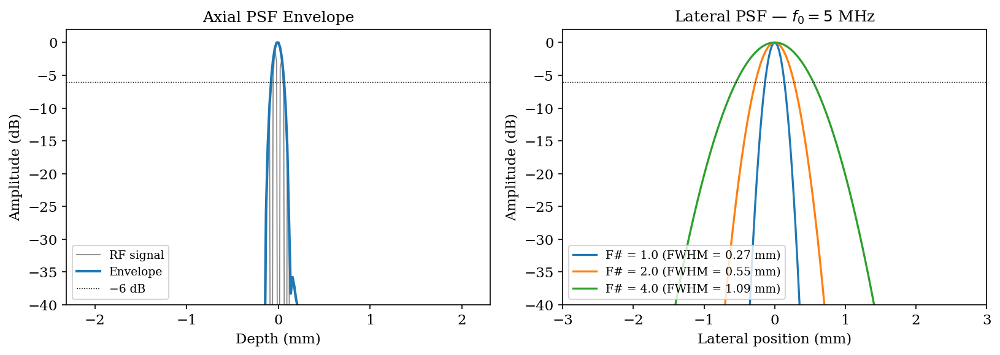
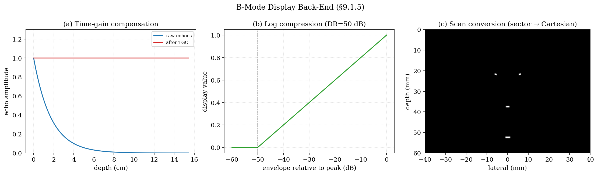
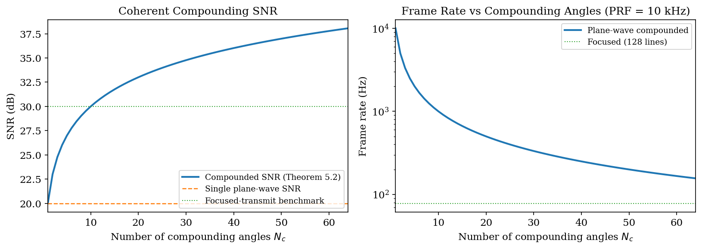
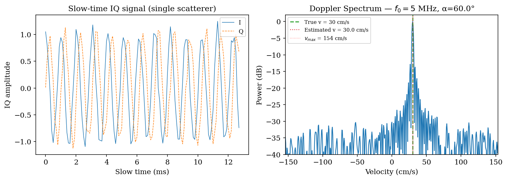
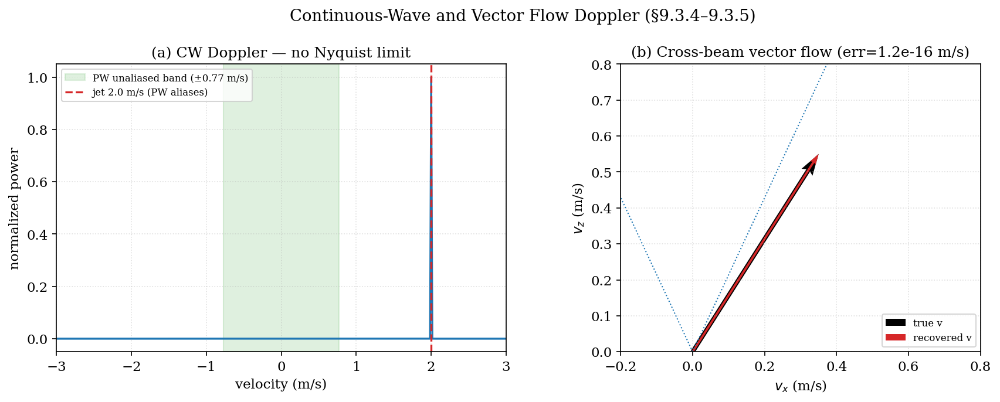
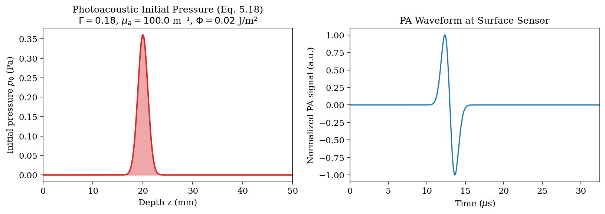
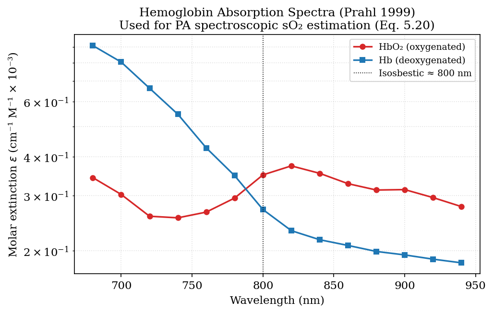
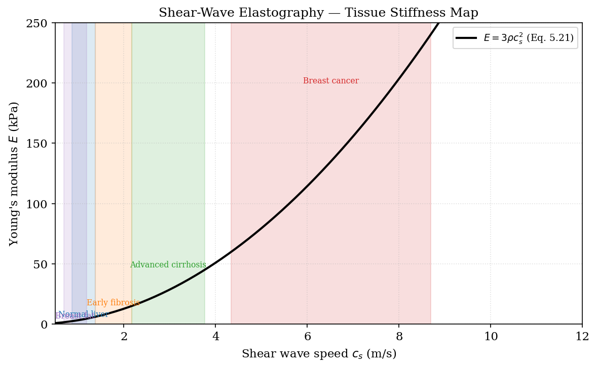

# Chapter 9: Diagnostic Ultrasound Imaging

**Scope.** This chapter covers the diagnostic ultrasound imaging pipeline: B-mode
pulse-echo, plane-wave coherent compounding, Doppler velocity estimation, contrast-enhanced
ultrasound (CEUS), ultrasound localization microscopy (ULM), speed-of-sound shift imaging,
and image-quality metrics. Photoacoustic imaging and shear-wave elastography are summarized
here for completeness; their full theory lives in the dedicated **Photoacoustic Imaging**
and **Elastography** chapters. Each modality is derived from first principles with formal
theorems. Code references map to `kwavers_diagnostics` and
`kwavers_analysis::signal_processing`.

---

## 9.1 B-Mode Pulse-Echo Imaging

### 9.1.1 Signal Model

In a pulse-echo configuration the transmitted pulse p_tx(t) propagates into tissue,
scatters from heterogeneities, and returns to the receive aperture. Ignoring multiple
scattering, the received signal from a point scatterer at depth z is

```
s(t) = p_tx(t − 2z/c₀) · r(z) · α_geo(z)                                (9.1)
```

where r(z) is the reflection coefficient at depth z, and α_geo(z) ∝ 1/z is the
geometric spreading factor.

**Definition 9.1 (Point Spread Function).** The PSF of a pulse-echo system is the
response to a single point scatterer:

```
h(x, z) = h_lat(x, z) · h_ax(z)                                           (9.2)
```

where h_lat(x,z) is the lateral beam profile (Chapter 7, Theorem 7.4) and h_ax(z) is
the axial pulse envelope.

### 9.1.2 Time-Gain Compensation

Tissue absorption attenuates the signal as exp(−α₀ f z) (α₀ in dB/cm/MHz, z in cm). The
time-gain compensation (TGC) amplification is

```
TGC(t) = exp(+α₀ f c₀ t / 2)                                             (9.3)
```

compensating round-trip attenuation. The factor of 2 accounts for the round-trip path.

### 9.1.3 Envelope Detection

The B-mode image is the envelope of the beamformed RF signal. Denoting the analytic
signal z(t) = s(t) + i·H{s(t)} (where H is the Hilbert transform):

```
env(t) = |z(t)| = √(s²(t) + H{s}²(t))                                   (9.4)
```

**Theorem 9.1 (Hilbert Transform Envelope).** For a narrowband signal s(t) = A(t)cos(ω₀t + φ),
the analytic signal envelope is |z(t)| = A(t).

*Proof.* The Hilbert transform of cos(ω₀t + φ) is sin(ω₀t + φ). Therefore
z(t) = A(t)(cos + i·sin)(ω₀t + φ) = A(t)exp(i(ω₀t + φ)), and |z| = A(t). □

The log-compressed display dynamic range is typically 40–60 dB:

```
B(t) = 20 log₁₀(env(t) / env_max)    [dB]                               (9.5)
```

### 9.1.4 Lateral Resolution and Contrast

**Definition 9.2 (Contrast-to-Noise Ratio).** For a lesion with mean intensity μ_l
and background mean μ_b and standard deviation σ_b:

```
CNR = |μ_l − μ_b| / σ_b                                                   (9.6)
```

**Definition 9.3 (Contrast Ratio).** CR = 20 log₁₀(μ_l/μ_b) [dB].

### 9.1.5 Display Back-End: Log Compression and Scan Conversion

After TGC (§9.1.2) and envelope detection (§9.1.3), two stages produce the
displayed grayscale frame.

**Log compression.** Tissue echo amplitudes span 50–70 dB, far beyond a
display's perceptual range. The envelope `e` is compressed relative to its peak,

```text
I = clamp( (20·log₁₀(e/e_max) + D) / D , 0, 1 ),                          (9.7)
```

mapping the peak to 1, a point `D` dB below the peak to 0, and clamping the rest.
The dynamic range `D` (typically 40–60 dB) is the operator "contrast" control.

**Scan conversion.** Sector (phased) and convex arrays acquire data along beams
that fan out in `(range, angle)` space; the display is Cartesian. Each Cartesian
pixel `(x, z)` maps back to polar coordinates `r = √(x²+z²)`,
`θ = atan2(x, z)`, and — when `(r, θ)` lies inside the acquired fan — is
bilinearly interpolated from the four surrounding beam samples:

```text
I(x, z) = bilerp( beam[(θ − θ_min)/Δθ, (r − r₀)/Δr] ),                    (9.8)
```

with apex radius `r₀ = 0` for a sector array and `r₀ > 0` for a convex array.
Pixels outside the fan are background. This pipeline is implemented in
`kwavers_analysis::signal_processing::b_mode` (`TgcConfig`, `envelope`,
`log_compress`, `ScanConverter`); value-semantic tests verify that TGC exactly
flattens attenuated reflectors, that log compression maps the −20 dB and −40 dB
points to 0.5 and 0, and that a beam sample lands at its analytic Cartesian
location after conversion.

---



*Figure 9.1. Lateral and axial point-spread-function profiles of the pulse-echo system (§9.1); the −6 dB widths set lateral and axial resolution (Theorem 7.4).*



*Figure 9.2b. B-mode display back-end (§9.1.5): TGC flattens the depth-dependent
echo decay, log compression fits the dynamic range, and scan conversion maps the
polar sector beams to a Cartesian image.*

---

## 9.2 Plane-Wave Coherent Compounding

### 9.2.1 Plane-Wave Transmit

**Definition 9.4 (Plane-Wave Transmit).** A plane-wave transmit at steering angle θ_i
fires all array elements simultaneously with linear phase ramp. The received channel data
s_i,n(t) are collected for each transmit angle θ_i and receive element n.

**Theorem 9.2 (Plane-Wave Compounding SNR).** Let s_i(r) be the complex beamformed image
for transmit angle θ_i (i = 1,…,N_c). Under coherent compounding:

```
S(r) = Σ_{i=1}^{N_c} s_i(r)                                              (9.7)
```

If speckle noise is zero-mean and independent across angles, the compounded SNR scales as

```
SNR_comp = √N_c × SNR_single                                               (9.8)
```

*Proof.* Signal sums coherently: E[S] = N_c μ. Noise variance sums incoherently:
Var(Σ_i n_i) = N_c σ². SNR = N_c μ / (√(N_c)σ) = √N_c × μ/σ. □

**Corollary 9.1.** N_c = 16 plane-wave angles yield √16 = 4× SNR improvement over a
single plane wave, recovering focused-transmit image quality at a higher frame rate
(frame rate = PRF/N_c versus PRF/(N_scanlines) for focused mode).

### 9.2.2 Fourier-Domain Reconstruction (f-k)

The Stolt mapping (Chapter 7, Eq. 7.15) extends to each plane-wave transmit angle:

```
k_z(ω, k_x) = √((ω/c₀)² − k_x²) + √((ω/c₀)² − (k_x − k_x,tx)²)       (9.9)
```

where k_x,tx = (ω/c₀)sinθ_i is the transmit plane-wave spatial frequency. The coherent plane-wave compounding path is implemented in
`kwavers_diagnostics::workflows::plane_wave_compounding` (`PlaneWaveCompound`); the explicit
f-k (Stolt) migration is implemented in
`kwavers_diagnostics::workflows::fk_migration::fk_stolt_migration` (exploding-reflector
remap with obliquity Jacobian); coherent compounding remains the default production path.

---



*Figure 9.2. Coherent plane-wave compounding: image SNR vs number of compounded angles N_c, scaling as √N_c (Theorem 9.2, §9.2).*

---

## 9.3 Doppler Ultrasound

### 9.3.1 Doppler Frequency Shift

**Theorem 9.3 (Doppler Shift).** A scatterer moving at velocity v along the beam axis
(angle α to beam) returns a signal shifted by

```
f_D = 2 f₀ v cos α / c₀                                                   (9.10)
```

*Proof.* In the scatterer frame, the incident frequency is f₀(1 + v·cos α/c₀) (Doppler
effect for moving receiver). The scattered wave is further Doppler-shifted by the moving
source: f_r = f₀(1 + v·cos α/c₀)² ≈ f₀(1 + 2v·cos α/c₀) for v ≪ c₀. Subtracting f₀:
f_D = 2f₀ v·cos α/c₀. □

**Definition 9.5 (Maximum Unambiguous Velocity).** For a pulsed wave system with pulse
repetition frequency PRF, the maximum velocity without aliasing (Nyquist limit) is:

```
v_max = c₀ PRF / (4 f₀ cos α)                                             (9.11)
```

The maximum range (depth) is z_max = c₀/(2 PRF). These constraints form the
range-velocity uncertainty of pulsed Doppler.

### 9.3.2 Autocorrelation Velocity Estimator

**Algorithm 9.1 (Kasai Autocorrelation Estimator — Kasai et al. 1985).**

```
Input:  I+Q channel data x_m(t) for ensemble m = 1..M (slow-time packets)
Output: Mean velocity estimate v̂

1. Form complex signal z_m(t) = I_m(t) + i·Q_m(t)
2. Compute lag-1 autocorrelation: R(1) = Σ_{m=1}^{M-1} z_m+1(t) · z_m*(t)
3. Phase estimate: φ̂ = arg(R(1))
4. Velocity estimate: v̂ = c₀ φ̂ / (4π f₀ cos α T_prf)
```

**Theorem 9.4 (Autocorrelation Estimator Variance).** For M ensemble members and
signal-to-clutter ratio SCR, the variance of the velocity estimate is

```
Var(v̂) ≈ v_max² (1 − |R(1)|²) / (π² M |R(1)|²)                         (9.12)
```

*Proof.* The Doppler phase of the lag-1 autocorrelation `R(1) = |R(1)|exp(iΦ)` encodes
velocity as `Φ = 2π f_d T_PRF = π v / v_max`, where `v_max = c₀/(4 f₀ T_PRF)` is the
Nyquist velocity.  For `M` independent ensemble samples at high SCR, `Φ` has Gaussian
distribution with variance `σ²_Φ = (1 − |R(1)|²) / (M |R(1)|²)` by the Cramér-Rao
bound for circular phase estimation (Kay 1993, §3.7).  The velocity is a linear function
of phase: `v = (v_max/π) Φ`, so the velocity variance is

```
Var(v̂) = (v_max/π)² · σ²_Φ = v_max²(1 − |R(1)|²) / (π² M |R(1)|²).
```

The Jacobian `dv/dΦ = v_max/π` is the phase-to-velocity scale factor from the Doppler
relation above. □

Implemented in `kwavers_analysis::signal_processing::doppler` (`AutocorrelationEstimator`).

### 9.3.3 Color Flow Mapping

Color flow imaging applies the Kasai estimator to every pixel in a 2-D frame. The
wall filter (`kwavers_analysis::signal_processing::doppler::WallFilter`) suppresses slow-moving
tissue clutter (typically by high-pass FIR filter with cutoff ≈ 100–500 Hz) before the
autocorrelation step.

### 9.3.4 Continuous-Wave Doppler

Pulsed-wave Doppler trades velocity range for range resolution: its
pulse-repetition frequency `f_PRF` caps the unambiguous Doppler shift at the
Nyquist limit `f_PRF/2`, giving a maximum velocity

```text
v_Nyquist = c · f_PRF / (4 f₀ cos θ).
```

**Continuous-wave (CW) Doppler** insonifies with an unmodulated tone and receives
on a separate element. With no pulsing there is **no PRF and hence no Nyquist
velocity limit**: the full Doppler spectrum is recovered without aliasing, at the
cost of range resolution (all scatterers along the beam contribute). This is the
method of choice for high-velocity jets (aortic stenosis, mitral regurgitation)
that alias under PW Doppler.

The processor (`ContinuousWaveDoppler`) quadrature-demodulates the received tone
against the transmit carrier `f₀`, producing a complex baseband whose signed
instantaneous frequency is the Doppler shift `f_d`. Decimating to a baseband rate
`f_bb` (chosen by the receiver, **independent of depth or PRF**) sets the velocity
resolution `Δv = c·f_bb/(2 f₀ N_bb)` and an unambiguous range `±c·f_bb/(4 f₀)`
that is made arbitrarily large. The two-sided baseband spectrum maps bin frequency
to signed velocity via `v = f_d c/(2 f₀ cos θ)`; the sign encodes flow direction.

### 9.3.5 Vector Flow Imaging

Conventional Doppler measures only the velocity *component along the beam*,
`v_i = v · d̂_i`, and must assume the beam-to-flow angle `θ` to report a speed.
**Cross-beam vector flow** removes this ambiguity by insonifying the same sample
volume from two or more directions.

**Theorem 9.5 (Cross-Beam Velocity Recovery).** Given Doppler measurements
`{v_i}` along unit beam directions `{d̂_i}` (i = 1..N, N ≥ 2 non-collinear), the
velocity vector `v` minimizing `Σ_i (d̂_i · v − v_i)²` is the unique solution of
the normal equations

$$
\Big(\sum_i \hat d_i \hat d_i^{\mathsf T}\Big)\, v \;=\; \sum_i v_i\, \hat d_i .
$$

*Proof.* The objective `J(v) = Σ_i (d̂_iᵀ v − v_i)²` is convex quadratic with
gradient `∇J = 2 Σ_i d̂_i(d̂_iᵀ v − v_i)`. Setting `∇J = 0` gives the normal
equations. The Hessian `M = Σ_i d̂_i d̂_iᵀ` is symmetric positive-definite iff the
directions span the plane (non-collinear), so the stationary point is the unique
minimizer. For two non-collinear beams the fit is exact (`N = 2` equations,
2 unknowns). $\blacksquare$

The estimator (`VectorFlowEstimator`) precomputes `M` and solves the 2×2 system
by Cramer's rule per pixel, returning the full `(v_x, v_z)` vector — hence
angle-independent speed `‖v‖` and direction `atan2(v_x, v_z)`. Collinear or
single-beam geometries are rejected (singular `M`).

---



*Figure 9.3. Doppler power spectrum and the autocorrelation (Kasai) mean-velocity estimate (§9.3).*



*Figure 9.4. (a) CW Doppler resolves a high-velocity jet that aliases under PW
Doppler (Theorem above, §9.3.4). (b) Cross-beam vector flow recovers the full
velocity vector from two angled beams, removing the angle assumption (§9.3.5).*

---

## 9.4 Contrast-Enhanced Ultrasound (CEUS)

### 9.4.1 Microbubble Scattering

**Theorem 9.6 (Rayleigh–Plesset Bubble Dynamics — linearized).** For a microbubble of
equilibrium radius R₀, shell stiffness χ, shell viscosity κ_s, and internal gas pressure
p_gas, driven by an incident pressure p_inc(t), the linearized radius perturbation
x = R − R₀ satisfies

```
ρ_l R₀ ẍ + (4κ_s/R₀² + 4μ_l/R₀) ẋ + (3κ_p0/(R₀²) + 2χ/R₀) x = −p_inc(t)  (9.13)
```

where ρ_l is liquid density, μ_l is liquid viscosity, p_0 is ambient pressure, and
κ = 3γ (polytropic index × initial gas pressure).

The natural frequency of the bubble is

```
f_0^{bubble} = (1/2πR₀) √(3κp_0/ρ_l + 2χ/(ρ_l R₀))                     (9.14)
```

For SonoVue-type microbubbles (R₀ ≈ 1–3 μm, χ ≈ 0.5 N/m): f₀ ≈ 2–5 MHz, matching
diagnostic frequencies.

*Proof sketch.* The full Rayleigh-Plesset equation linearized about R₀ gives a damped
harmonic oscillator (9.13). Natural frequency follows from the restoring coefficient. □

**Theorem 9.7 (Scattered Pressure from a Single Bubble).** In the far field
(`kr ≫ 1`, equivalently `r ≫ λ/(2π) ≈ R₀/kR₀`; for `R₀ = 2 μm` and `f = 2 MHz`,
`λ/(2π) ≈ 119 μm`, so the approximation holds for `r ≳ 1 mm` — well within
clinical imaging depth), the scattered pressure is

```
p_s(r) = ρ_l R₀ R̈ / r · exp(−ikr)                                        (9.15)
```

proportional to the bubble wall acceleration R̈. *Proof sketch:* The full multipole
expansion of the radiated pressure retains only the monopole term at `kr ≪ 1` bubble
size (source compactness), giving `p_s = ρ_l Ṡ_bubble / (4πr)` where `Ṡ = d²(4πR³/3)/dt²
= 4π R₀(2Ṙ² + RR̈) ≈ 4π R₀² R̈` (linearized about `R₀` with `Ṙ ≪ 1`). □

Below the resonance frequency this scales as `ω² R₀³` (Rayleigh scattering).
At resonance the scattering cross-section far exceeds the geometric cross-section
(`σ_s ≫ πR₀²`).

**Scope note:** Eq. (9.13) assumes shell stiffness χ is a constant (linear shell
model).  At mechanical index MI > 0.3, lipid and polymer shells exhibit
strain-dependent stiffness and rupture; the linear model loses validity exactly where
clinical contrast imaging is performed.  The kwavers implementation uses the constant-χ linearized model for resonance-frequency
estimation; the full nonlinear Rayleigh–Plesset / Keller–Miksis bubble dynamics (Cavitation
chapter) drive CEUS/cavitation simulation. CEUS contrast pulse sequences — pulse inversion,
amplitude modulation, and general CPS — are implemented in
`kwavers_physics::acoustics::imaging::modalities::ceus::pulse_sequences`
(`pulse_inversion`, `amplitude_modulation`, `cps_combine`).

### 9.4.2 Nonlinear Bubble Scattering for Contrast Imaging

At higher driving pressures (MI > 0.1), the bubble response becomes nonlinear and
generates sub-harmonics (f₀/2), ultra-harmonics (3f₀/2), and super-harmonics (2f₀, 3f₀).
Clinical CEUS receives the fundamental or second harmonic with tissue suppression:

```
CTR = 20 log₁₀(p_bubble_2f / p_tissue_2f)    [dB]                        (9.16)
```

Tissue harmonic ratio p_tissue_2f is set by B/A ≈ 6 (Eq. 3.25).
Bubble harmonic ratio p_bubble_2f is enhanced by resonance by a factor of Q = f₀/(Δf).
Typical CTR at second harmonic: 15–25 dB.

### 9.4.3 Ultrasound Localization Microscopy (ULM)

**Definition 9.6 (ULM Resolution Limit).** At ultra-low microbubble concentration (one
bubble per resolution cell), the center of each bubble PSF can be localized to:

```
σ_loc ≈ FWHM / (2.35 √SNR)                                                (9.17)
```

where FWHM is the diffraction-limited PSF width. For SNR = 25 dB (316), FWHM = 200 μm:
σ_loc ≈ 200/(2.35 × 17.8) ≈ 5 μm. This is 40× sub-diffraction resolution.

**Algorithm 9.2 (ULM Processing Pipeline).**

```
Input:  Ultrafast plane-wave sequence s_frame(t, n, θ) at frame rate ≥ 500 Hz
Output: Super-resolved vascular map

1. CLUTTER FILTER: SVD decomposition of spatio-temporal data matrix;
   retain singular vectors beyond the tissue subspace (typically sv ≥ 10).
2. LOCALIZE: fit Gaussian PSF model to isolated bright spots.
   Report: centroid (x,z), amplitude, width.
3. FILTER: discard localizations with |width − FWHM_expected| > 30%.
4. TRACK: assign localizations across frames using Hungarian algorithm.
   Motion model: constant velocity Kalman filter.
5. ACCUMULATE: bin localizations to 10× oversampled grid.
   Velocity map: mean trajectory velocity per bin.
6. VALIDATE: σ_loc < FWHM/10, track length ≥ 3 frames, flow continuity ≥ 0.9.
```

Implemented in `kwavers_analysis::signal_processing::ulm` (`UlmDetector`, `HungarianTracker`, `SuperResReconstructor`, `VelocityMapper`).

---

## 9.5 Photoacoustic Imaging

Photoacoustic (PA) imaging forms an ultrasound image from optical absorption: a
nanosecond laser pulse absorbed by chromophores (chiefly hemoglobin) deposits, under
thermal and stress confinement, an initial pressure `p₀(r) = Γ μ_a(r) Φ(r)` — where
Γ = βc₀²/C_p is the Grüneisen parameter, μ_a the optical absorption coefficient, and Φ
the local fluence. Reconstructing the acoustic field recovers `p₀(r)`
(spherical-Radon / universal back-projection or time-reversal), and multi-wavelength
acquisition unmixes oxy/deoxy-hemoglobin to map blood oxygen saturation `sO₂`.

The thermoelastic derivation, reconstruction operators, and spectroscopic unmixing are
developed in full in the dedicated **Photoacoustic Imaging** chapter — the canonical home.
kwavers models PA generation in `kwavers_diagnostics::photoacoustic` and reconstructs in
`kwavers_diagnostics::reconstruction::acoustic_projection`.

---



*Figure 9.4. Photoacoustic bipolar pressure transient from an absorbing target (§9.5; full treatment in the Photoacoustic Imaging chapter).*



*Figure 9.5. HbO₂ / Hb molar absorption spectra used for spectroscopic sO₂ unmixing (§9.5).*

---

## 9.6 Shear-Wave Elastography

Elastography maps tissue stiffness. An acoustic radiation force impulse (ARFI, body force
`F = 2αI/c₀`) displaces tissue at the focus and launches a shear wave whose phase speed
gives the shear modulus `μ = ρ c_s²` (Young's modulus `E ≈ 3μ` for nearly-incompressible
tissue) — e.g. normal liver `c_s ≈ 1` m/s versus advanced cirrhosis `≈ 3` m/s, and a
20–200 kPa stiffness contrast for breast cancer. Ultrafast (plane-wave) imaging tracks the
shear-wave propagation to map `c_s(r)`.

The full elasticity theory (Helmholtz P/S decomposition, shear/strain/MR elastography,
viscoelastic models, and the inversion kernels) is in the dedicated **Elastography**
chapter — the canonical home. kwavers implements the forward shear-wave solver in
`kwavers_solver::forward::elastic::swe`, stiffness inversion in
`kwavers_solver::inverse::elastography`, and tissue mechanics in
`kwavers_physics::acoustics::imaging::modalities::elastography` (+ `kwavers_medium`).

---



*Figure 9.6. Shear-wave speed → stiffness map (μ=ρc_s²) for a stiff inclusion (§9.6; full treatment in the Elastography chapter).*

---

## 9.7 Ultrasonic Speed-of-Sound Shift Imaging

Speed-of-sound shift imaging estimates a perturbation map δc(r) = c(r) − c₀ from
differential ultrasonic travel-time shifts measured across a transmit/receive aperture.
It is distinct from B-mode reflectivity: the data are phase or time shifts relative to a
reference sound speed, and the image is a quantitative sound-speed contrast.

For a straight transmit/receive ray Γᵣ with observed-minus-reference time shift δtᵣ:

```
δtᵣ = ∫_{Γᵣ} [1/(c₀ + δc(r)) − 1/c₀] ds
    ≈ −1/c₀² ∫_{Γᵣ} δc(r) ds                                      (9.23)
```

After voxelization with exact ray/pixel intersection lengths ℓᵣᵥ:

```
Σ_v ℓᵣᵥ δc_v = −c₀² δtᵣ                                           (9.24)
```

**Dense regime.** Dense shift imaging uses all measured aperture rows and solves:

```
min_δc  1/2 ||Aδc − b||₂² + λ/2 ||δc||₂² + γ/2 δcᵀLδc              (9.25)
```

where L is the active-pixel graph Laplacian. This produces a spatially dense quantitative
sound-speed shift field for diffuse thermal, fat, fibrosis, or skull-aberration contexts.

**Sparse regime.** Sparse shift imaging uses a deterministic row subset and an L1 prior:

```
min_δc  1/2 ||A_Sδc − b_S||₂² + λ/2 ||δc||₂² + γ/2 δcᵀLδc
        + μ ||δc||₁                                                 (9.26)
```

This targets compact lesions, focal ablation changes, or localized acoustic-property
changes when a full aperture sweep is not available. The implementation keeps dense and
sparse behavior in one API: `ShiftSampling` selects measurement rows and `ShiftPrior`
selects the image prior, while the forward operator remains the same straight-ray
speed-shift model. Ray assembly traverses only the crossed grid cells and stores
nonzero segment lengths in flat row-offset, column, and length arrays, so
construction and operator storage scale with ray path length rather than the full
active-pixel count. Iterative inversion uses caller-reusable PCG/ISTA scratch
buffers through `SoundSpeedShiftWorkspace`, so repeated dense or sparse
reconstructions over compatible grids retain row, Laplacian, prediction,
residual, diagonal, and power-iteration allocations instead of rebuilding them
for each solve.

**Fixed-acquisition planning.** When the aperture, active mask, propagation
model, sensitivity model, and sampling policy are fixed across a time series,
`SoundSpeedShiftPlan` caches the generated acquisition rows and the assembled
operator. A frame then supplies only the measured shift vector in original
acquisition order:

```
b_S^(n)[r] = -c0^2 Delta t_i(r)^(n)
```

where `i(r)` is the original acquisition-row index retained by the sampled
operator row. This preserves the inverse model in (9.25)-(9.26) while
amortizing curved-array row generation, curved-ray subsegment traversal, and
finite-frequency weight assembly across repeated frames.
For frame batches, the same plan drives all frames through one solver workspace
and one reusable sampled-row RHS buffer. `SoundSpeedShiftBatchConfig` defaults
to compact objective retention:

```
summary_n = (J_n(0), J_n(final), iteration_count_n).                         (9.27)
```

Full per-frame objective histories are retained only when explicitly requested,
so long time series do not store every solver objective value by default.

**Curved-array acquisition.** A 2-D curved array is represented as a circular
arc:

```
p_i = c + r[cos(theta_0 + i Delta theta), sin(theta_0 + i Delta theta)]      (9.28)
```

`CurvedArrayShiftScan` emits same-aperture pitch-catch rows in deterministic
transmitter-major order with receiver index `(i + offset) mod N`. These rows
are ordinary `SoundSpeedShiftSample` values, so curved-array acquisition does
not create a separate inverse model; it supplies curved-array transmitter and
receiver coordinates to the same straight-ray operator in (9.24)-(9.26).

**Curved-ray and finite-frequency sensitivity.** The same reconstruction API
also supports a circular-arc propagation row:

```
Γ_r = union_k [q_k, q_{k+1}],   q_k on the transmitter-receiver circular arc.  (9.29)
```

Each subsegment uses the same exact segment/pixel traversal as the straight-ray
case, so the curved row is a sum of exact voxel intersections over the declared
piecewise-linear circular-arc discretization. For finite-frequency sensitivity,
each subsegment uses a compact Fresnel tube around the propagation path:

```
K_vk = exp(-d(v, Γ_k)^2 / (2σ_k²)),   σ_k² = λ s_k(L - s_k) / L.              (9.30)
```

The implementation normalizes the active voxel weights on each subsegment so a
uniform sound-speed shift integrates to the geometric path length. This keeps the
linearized shift equation in (9.24) dimensionally identical while broadening
sensitivity to off-axis pixels.

**OpenPros limited-view benchmark.** The clinical benchmark fixture follows the
OpenPros prostate USCT structure: 2-D SOS maps, top and bottom probe rows, 20
sources split across the body-surface and rectal probes, receiver lines spanning
the lateral aperture, a 1 MHz Ricker excitation expectation, 1,000 recorded
time steps, and a 120-point absorbing boundary contract. The default kwavers
fixture decimates the paper lattice from 401 x 161 at 0.375 mm to 41 x 17 at
3.75 mm so it can run in bounded tests while preserving the limited-view
top/bottom source-receiver channel topology. The waveform metadata remains
attached to the benchmark result for auditability; the current reconstruction
uses the existing finite-frequency speed-shift operator rather than a separate
full-waveform inversion API.

Dense and sparse branches are selected only through existing configuration:
`ShiftSampling::Dense` plus `ShiftPrior::Dense` for the dense branch, and
`ShiftSampling::Sparse` plus `ShiftPrior::Sparse` for the sparse branch. Both
branches run through `SoundSpeedShiftPlan` on the same samples and frame shift
vector. The Criterion entry point is:

```
cargo bench -p kwavers --bench clinical_sound_speed_shift_openpros
```

Implemented in `kwavers_diagnostics::reconstruction::sound_speed_shift`.

---

## 9.8 Image Quality Metrics

### 9.8.1 Spatial Resolution Metrics

**Definition 9.7 (FWHM).** Full-width at half-maximum of the PSF cross-section. Measured
from a point target or wire phantom.

**Definition 9.8 (Lateral Resolution, Axial Resolution).** Measured FWHM in lateral and
axial directions for the combined transmit-receive PSF h(x,z).

### 9.8.2 Contrast Metrics

**Definition 9.9 (CR, CNR, gCNR).** For lesion intensity distribution p_l and background
p_b:
- CR = 20 log₁₀(μ_l/μ_b) [dB]
- CNR = |μ_l − μ_b| / √(σ_l² + σ_b²)
- gCNR = 1 − OVL(p_l, p_b), where OVL is the overlap integral of the two distributions

**Theorem 9.8 (gCNR Bound).** For any monotone increasing transformation of the image
data (log compression, TGC), gCNR is invariant. CNR is not invariant under nonlinear
transformations.

*Proof.* The overlap integral OVL = ∫ min(p_l(x), p_b(x)) dx is invariant under monotone
reparameterization by the change-of-variables theorem. □

### 9.8.3 Validation Pass Criteria

| Metric | Formula | Pass criterion |
|--------|---------|----------------|
| Lateral FWHM | PSF cross-section | ≤ 0.886 λ F# × 1.1 |
| Axial FWHM | Pulse envelope | ≤ N_cyc c₀/(2f₀) × 1.1 |
| CNR (anechoic cyst) | Eq. 9.6 | ≥ 3 |
| Doppler velocity error | |v̂ − v| / v | < 2% |
| PA sO₂ error | |sO₂ − sO₂_ref| | < 3% |
| SWE stiffness error | |Ê − E_ref| / E_ref | < 10% |

---

## 9.9 Code Mapping

| Modality | kwavers module | Key struct/fn |
|----------|---------------|---------------|
| Plane-wave compounding | `kwavers_diagnostics::workflows::plane_wave_compounding` | `PlaneWaveCompound` |
| DAS beamforming | `kwavers_analysis::signal_processing::beamforming::time_domain::das` | `delay_and_sum()` |
| Envelope detection | `kwavers_signal::analytic` | `instantaneous_envelope()` |
| Doppler autocorr. (Kasai) | `kwavers_analysis::signal_processing::doppler` | `AutocorrelationEstimator` |
| Wall filter | `kwavers_analysis::signal_processing::doppler` | `WallFilter` |
| Color flow | `kwavers_analysis::signal_processing::doppler` | `ColorFlowImaging` |
| PA generation | `kwavers_diagnostics::photoacoustic` | thermoelastic source |
| PA reconstruction | `kwavers_diagnostics::reconstruction` | `AcousticProjectionGeometry` |
| PA spectroscopy | `kwavers_analysis::signal_processing::spectroscopy` | `SpectralUnmixer` |
| Hemoglobin spectra | `kwavers_optics::chromophores` | `HemoglobinDatabase` |
| ULM localization | `kwavers_analysis::signal_processing::ulm` | `UlmDetector` |
| ULM tracking | `kwavers_analysis::signal_processing::ulm` | `HungarianTracker` |
| ULM super-resolution | `kwavers_analysis::signal_processing::ulm` | `SuperResReconstructor` |
| ULM velocity mapping | `kwavers_analysis::signal_processing::ulm` | `VelocityMapper` |
| Vasculature segmentation | `kwavers_analysis::signal_processing::vasculature` | `VesselSegmentation::segment` (Frangi vesselness) |
| Speed-of-sound shift | `kwavers_diagnostics::reconstruction::sound_speed_shift` | `reconstruct_sound_speed_shift()` |
| OpenPros shift benchmark | `kwavers_diagnostics::reconstruction::sound_speed_shift` | `run_openpros_shift_benchmark()` |
| Image-quality metrics (§9.8) | `kwavers_analysis::signal_processing::image_quality` | `contrast_ratio_db` / `contrast_to_noise_ratio` / `generalized_cnr` / `fwhm` |


---

## 9.10 Worked Example: B-Mode SNR after Coherent Compounding

**Setup.** 16 plane-wave angles, single plane-wave SNR = 20 dB (√100 = 10 amplitude ratio).

**Compounded SNR (Theorem 9.2):**

```
SNR_comp = √16 × SNR_single   (linear amplitude gain 4× = +20 log₁₀(4) = +12 dB)
         = 20 dB + 12 dB = 32.0 dB     (linear check: 4 × 10 = 40 → 20 log₁₀(40) = 32.0 dB)
```

The 12 dB improvement recovers image quality comparable to focused transmit scanning
(typically SNR 30–35 dB) while maintaining the high frame rate of plane-wave imaging:

```
Frame rate = PRF / N_c = 10,000 Hz / 16 = 625 frames/s
```

versus ~30 frames/s for focused scanning with 128 lines.

---

## References

1. Szabo, T. L. (2014). *Diagnostic Ultrasound Imaging: Inside Out* (2nd ed.).
   Academic Press. Chapters 10–13.

2. Kasai, C., Namekawa, K., Koyano, A., & Omoto, R. (1985). Real-time two-dimensional
   blood flow imaging using an autocorrelation technique. *IEEE Trans. Sonics Ultrason.*,
   **32**(3), 458–464. https://doi.org/10.1109/T-SU.1985.31615

3. Montaldo, G., Tanter, M., Bercoff, J., Benech, N., & Fink, M. (2009). Coherent
   plane-wave compounding for very high frame rate ultrasonography and transient
   elastography. *IEEE Trans. Ultrason. Ferroelectr. Freq. Control*, **56**(3), 489–506.
   https://doi.org/10.1109/TUFFC.2009.1067

4. Errico, C., Pierre, J., Pezet, S., et al. (2015). Ultrafast ultrasound localization
   microscopy for deep super-resolution vascular imaging. *Nature*, **527**, 499–502.
   https://doi.org/10.1038/nature16066

5. Dencks, S., & Schmitz, G. (2023). Ultrasound localization microscopy: a review.
   *Z. Med. Phys.*, **33**(4), 394–410. https://doi.org/10.1016/j.zemedi.2023.02.004

6. Wang, L. V. (2009). Multiscale photoacoustic microscopy and computed tomography.
   *Nature Photonics*, **3**, 503–509. https://doi.org/10.1038/nphoton.2009.157

7. Treeby, B. E., & Cox, B. T. (2010). k-Wave: MATLAB toolbox for the simulation and
   reconstruction of photoacoustic wave fields. *J. Biomed. Opt.*, **15**(2), 021314.
   https://doi.org/10.1117/1.3360308

8. Bercoff, J., Tanter, M., & Fink, M. (2004). Supersonic shear imaging: a new technique
   for soft tissue elasticity mapping. *IEEE Trans. Ultrason. Ferroelectr. Freq. Control*,
   **51**(4), 396–409. https://doi.org/10.1109/TUFFC.2004.1295425

9. Rodriguez-Molares, A., Rindal, O. M. H., D'hooge, J., et al. (2020). The generalized
   contrast-to-noise ratio: a unified framework for assessing ultrasound image quality.
   *IEEE Trans. Ultrason. Ferroelectr. Freq. Control*, **67**(4), 745–759.
   https://doi.org/10.1109/TUFFC.2019.2956855

10. Dines, K. A., & Kak, A. C. (1979). Ultrasonic attenuation tomography of soft
   tissues. *Ultrasonic Imaging*, **1**(1), 16–33.

11. ULTRA-SR benchmark: https://doi.org/10.1109/TMI.2024.3388048
