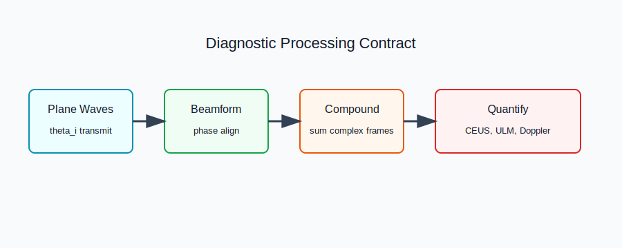

# Ultrasound Diagnostics



## Scope

Diagnostics chapters cover beamforming, ultrafast plane-wave imaging, Doppler, CEUS, elastography, photoacoustics, and ultrasound localization microscopy. Code ownership currently maps to `kwavers::analysis::signal_processing`, `kwavers::domain::sensor`, `kwavers::domain::imaging`, and `kwavers::clinical::imaging`.

## Theorem: Plane-Wave Coherent Compounding

Let `s_i(r)` be the complex beamformed image for transmit angle `theta_i`. Under phase-aligned receive reconstruction, coherent compounding computes

```text
S(r) = sum_i s_i(r).
```

If speckle noise is independent across `N` angles and phase correction is unbiased, coherent signal amplitude scales as `N` while incoherent noise amplitude scales as `sqrt(N)`.

### Proof Sketch

Linearity gives `E[S] = N mu` for common signal mean `mu`. For independent zero-mean noise `n_i`, `Var(sum_i n_i) = N sigma^2`. Therefore the compounded signal-to-noise ratio scales as `N / sqrt(N) = sqrt(N)`.

## Algorithm: ULM Processing Contract

1. Suppress tissue clutter with an SVD or frequency-domain filter.
2. Localize isolated microbubble responses using a point-spread model.
3. Track localizations with a motion model and assignment solver.
4. Accumulate super-resolved density and velocity maps.
5. Validate localization error, track continuity, flow direction, and vessel-density statistics.

## Implementation Targets

- Keep CEUS bubble scattering, ULM super-resolution, and velocity mapping under separate vertical modules.
- Replace diagnostic shortcuts with value-semantic tests derived from analytical PSF, flow, and Doppler identities.
- Use `pykwavers` to validate k-wave-python examples where wave propagation or sensor contracts are involved.

## Recent Research Anchors

- ULTRA-SR benchmark work formalizes ULM algorithm comparison: https://doi.org/10.1109/TMI.2024.3388048
- Row-column ultrafast 3-D super-resolution ultrasound has recent in vitro, animal, and human study coverage: https://doi.org/10.1016/j.ultrasmedbio.2024.03.020
- ULM review material and clinical transition context: https://doi.org/10.1016/j.zemedi.2023.02.004

## 2026 Implementation Synchronization

- k-wave-python parity tests should prefer the unified `kspaceFirstOrder` entry point where available, while retaining legacy `kspaceFirstOrder1D/2D/3D` fixtures for regression coverage against published example scripts.
- Diagnostic ULM examples must expose PSF localization error, track continuity, flow-vector direction, and vessel-density statistics; a reconstructed image alone is not a validation artifact.
- Plane-wave, CEUS, and ULM pipelines should keep raw RF/channel data, beamformed fields, and post-processed maps as separate artifacts so numerical parity can localize discrepancies to propagation, receive reconstruction, or diagnostic post-processing.
