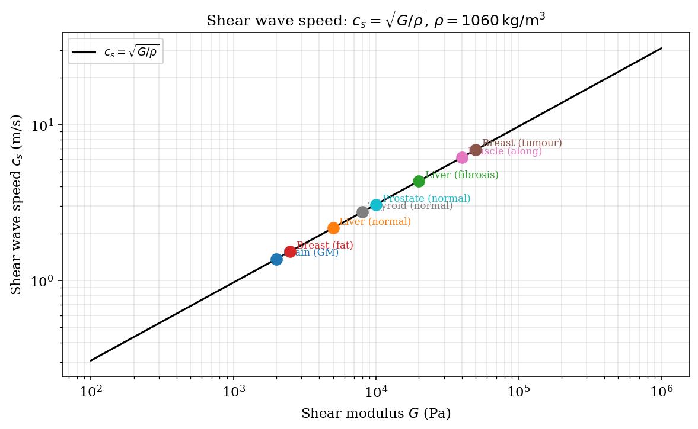
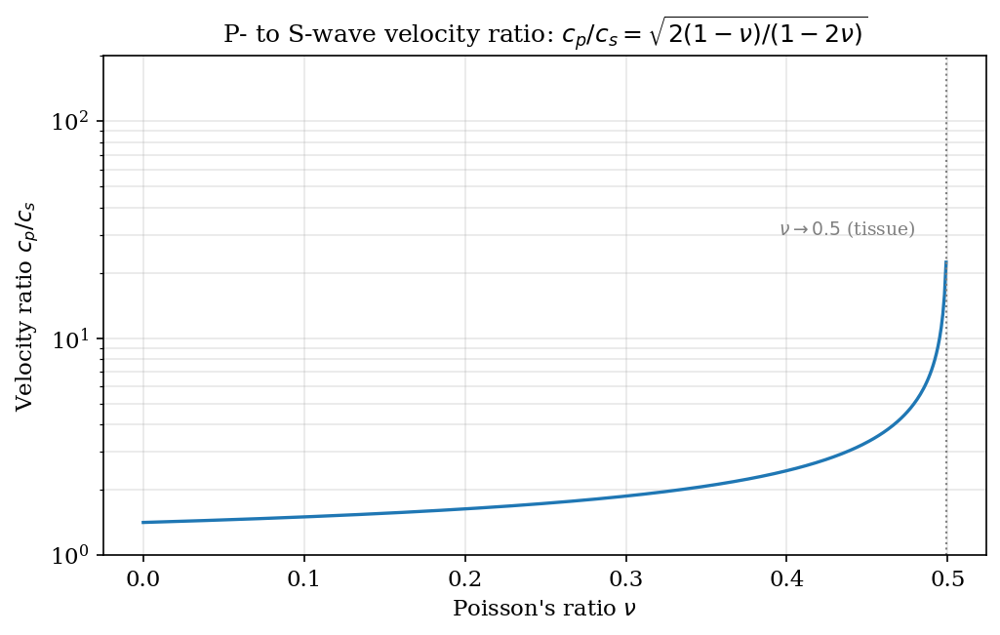
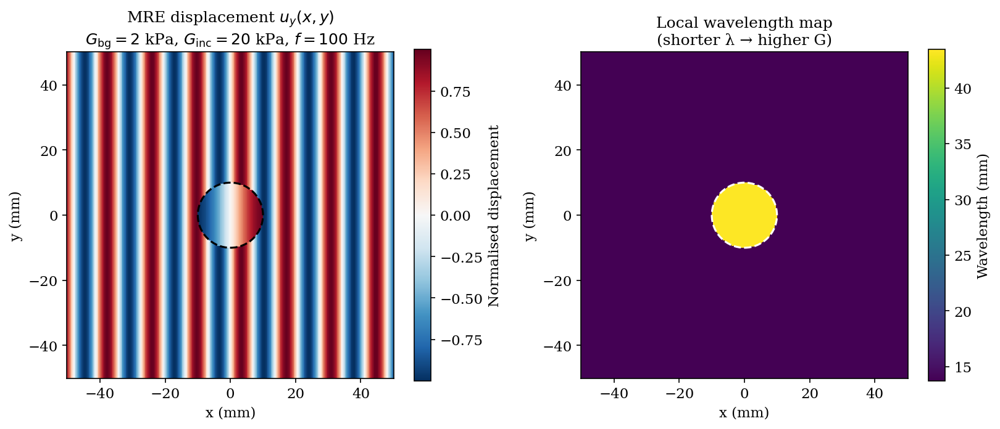
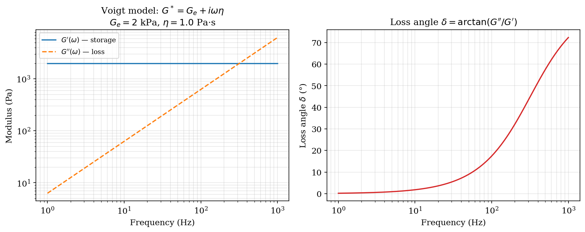
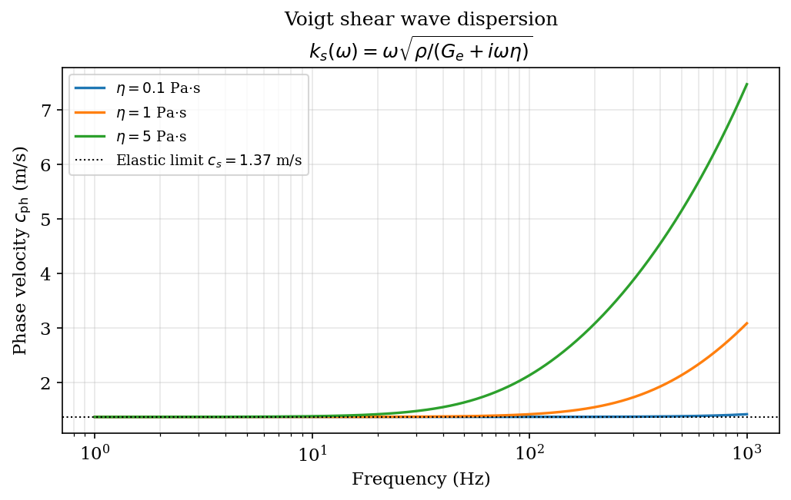

# Chapter 11 — Elastography: Imaging Tissue Mechanical Properties

> **Prerequisites:** linear acoustics and wave physics (Chapter 1), heterogeneous
> media and tissue models (Chapter 4), sensors and signal measurement (Chapter 8),
> and inverse problems (Chapter 18). Readers should be comfortable with index
> notation for tensors, the Fourier transform, and cross-correlation as an estimator.

---

## Overview

Elastography is the quantitative imaging of mechanical properties — primarily
stiffness and viscosity — of biological tissue using wave-based measurements.
The clinical motivation is direct: tissue stiffness is a biomarker for
fibrosis, malignancy, and structural integrity. Palpation has been the oldest
clinical tool, but it is qualitative, operator-dependent, and limited to
superficial structures. Elastography extends palpation to quantitative,
subsurface, spatially resolved maps of the elastic moduli.

Three broad families of elastography exist and are treated in this chapter:

| Family | Excitation | Observable | Modulus recovered |
|--------|-----------|------------|-------------------|
| Strain elastography | Quasi-static compression | Axial strain | Relative Young's modulus |
| Shear-wave elastography (SWE) | ARFI push pulse or external vibrator | Shear-wave speed | Absolute shear modulus μ |
| MR elastography (MRE) | External mechanical vibrator | Full displacement vector | Local μ(x) by Helmholtz inversion |

The `kwavers` implementation distributes responsibility across:

- **`kwavers_solver::inverse::elastography::linear_methods::ShearWaveInversion`**
  — shear-speed inversion kernels: time-of-flight, phase-gradient, `direct`
  (Gauss-Seidel algebraic local-Helmholtz), volumetric, and directional
  phase-gradient.
- **`kwavers_physics::acoustics::imaging::modalities::elastography`** — RF
  cross-correlation displacement tracking (`DisplacementEstimator`), harmonic
  detection (`HarmonicDetector`), and ARFI radiation force
  (`AcousticRadiationForce`, `MultiDirectionalPush`).
- **`kwavers_medium::{elastic,viscous}`** — tissue mechanical parameter storage
  (`ElasticProperties`; generic Stokes `ViscousProperties`).
- **`kwavers_solver::forward::elastic::{swe,nonlinear}`** — forward elastic wave
  propagation (`ElasticWaveSolver`; hyperelastic `NonlinearElasticWaveSolver`)
  for synthetic validation.
- **`kwavers_physics::analytical::elastography`** — closed-form models exposed to
  Python (`shear_wave_speed`, `voigt_complex_modulus`, `voigt_shear_wave_dispersion`)
  that generate this chapter's figures.

---

## 11.1 Linear Elasticity Fundamentals

### 11.1.1 Kinematics: Strain Tensor

Let $\mathbf{u}(\mathbf{x}, t)$ denote the displacement vector field of a
continuous solid. For small deformations the linearised strain tensor is

$$
\varepsilon_{ij} = \frac{1}{2}\!\left(\frac{\partial u_i}{\partial x_j}
+ \frac{\partial u_j}{\partial x_i}\right), \qquad i,j \in \{1,2,3\}.
$$

$\varepsilon_{ij}$ is symmetric by construction: $\varepsilon_{ij} =
\varepsilon_{ji}$. The diagonal components $\varepsilon_{11}, \varepsilon_{22},
\varepsilon_{33}$ are normal strains (fractional length changes along each
axis); the off-diagonal components are engineering shear strains halved.

The volumetric dilatation (fractional volume change) is the trace:

$$
\Delta \equiv \text{tr}(\boldsymbol{\varepsilon}) = \varepsilon_{kk}
= \nabla \cdot \mathbf{u}.
$$

### 11.1.2 Dynamics: Stress Tensor and Newton's Second Law

The Cauchy stress tensor $\sigma_{ij}$ represents the traction (force per unit
area) exerted across an internal surface with outward normal $\hat{n}_j$ on the
positive side: $t_i = \sigma_{ij} n_j$. Moment balance for a vanishingly thin
slab yields symmetry: $\sigma_{ij} = \sigma_{ji}$.

Newton's second law for a volume element of density $\rho$ is

$$
\rho \ddot{u}_i = \frac{\partial \sigma_{ij}}{\partial x_j} + f_i,
$$

where $\ddot{u}_i \equiv \partial^2 u_i / \partial t^2$ and $f_i$ is the body
force density (N m$^{-3}$).

### 11.1.3 Constitutive Law for a Linear Isotropic Elastic Solid

For a homogeneous, isotropic, linearly elastic material characterised by the
Lamé parameters $\lambda$ and $\mu$, the constitutive law (generalised Hooke's
law) reads

$$
\boxed{\sigma_{ij} = \lambda \, \Delta \, \delta_{ij} + 2\mu \, \varepsilon_{ij},}
$$

where $\delta_{ij}$ is the Kronecker delta and $\Delta = \varepsilon_{kk}$ is
the dilatation. The parameter $\mu \geq 0$ is the **shear modulus** (rigidity)
and $\lambda \geq 0$ is the **first Lamé parameter**.

Substituting the constitutive law and the kinematic definition into Newton's
second law yields the **Navier–Cauchy equation of motion**:

$$
\boxed{\rho \, \ddot{\mathbf{u}} = (\lambda + 2\mu)\,\nabla(\nabla \cdot \mathbf{u})
- \mu \, \nabla \times (\nabla \times \mathbf{u}) + \mathbf{f}.}
$$

This follows from the identity $\nabla^2 \mathbf{u} = \nabla(\nabla \cdot
\mathbf{u}) - \nabla \times (\nabla \times \mathbf{u})$, applied after inserting
the linearised strain into the stress and differentiating.

**Derivation detail.** Substitute $\sigma_{ij} = \lambda \varepsilon_{kk}
\delta_{ij} + 2\mu \varepsilon_{ij}$ into $\rho \ddot{u}_i = \partial_j
\sigma_{ij}$:

$$
\rho \ddot{u}_i = \lambda \partial_i (\partial_k u_k) + \mu (\partial_j
\partial_j u_i + \partial_i \partial_j u_j).
$$

Recognise $\partial_j \partial_j u_i = \nabla^2 u_i$ and $\partial_i \partial_j
u_j = \partial_i (\nabla \cdot \mathbf{u})$:

$$
\rho \ddot{u}_i = (\lambda + \mu)\partial_i(\nabla \cdot \mathbf{u})
+ \mu \nabla^2 u_i.
$$

Using the vector identity $\nabla^2 \mathbf{u} = \nabla(\nabla \cdot
\mathbf{u}) - \nabla \times (\nabla \times \mathbf{u})$ gives the Navier
equation above. $\square$


---

## 11.2 Theorem: P-Wave and S-Wave Separation via Helmholtz Decomposition

### Statement

In a homogeneous isotropic elastic medium any displacement field $\mathbf{u}$
decomposes uniquely (Helmholtz) into an irrotational part and a solenoidal
part. The irrotational part propagates as a **longitudinal (P) wave** at speed

$$
c_P = \sqrt{\frac{\lambda + 2\mu}{\rho}},
$$

and the solenoidal part propagates as a **transverse (S) wave** at speed

$$
c_S = \sqrt{\frac{\mu}{\rho}}.
$$

### Proof

**Step 1 — Helmholtz decomposition.** Every sufficiently smooth vector field
$\mathbf{u}$ on $\mathbb{R}^3$ (or on a simply connected domain) admits the
unique decomposition

$$
\mathbf{u} = \nabla \varphi + \nabla \times \boldsymbol{\psi}, \qquad
\nabla \cdot \boldsymbol{\psi} = 0,
$$

where $\varphi$ is a scalar potential and $\boldsymbol{\psi}$ is a vector
potential satisfying the Coulomb gauge condition. This is the Helmholtz
decomposition theorem; existence and uniqueness under suitable boundary
conditions at infinity are standard results in functional analysis.

**Step 2 — Apply the Navier equation.** Insert $\mathbf{u} = \nabla\varphi +
\nabla \times \boldsymbol{\psi}$ into

$$
\rho \ddot{\mathbf{u}} = (\lambda+2\mu)\nabla(\nabla\cdot\mathbf{u})
- \mu\,\nabla\times(\nabla\times\mathbf{u}).
$$

Compute each term. Since $\nabla\times(\nabla\varphi) = \mathbf{0}$ and
$\nabla\cdot(\nabla\times\boldsymbol{\psi}) = 0$:

$$
\nabla\cdot\mathbf{u} = \nabla^2\varphi,
\qquad
\nabla\times\mathbf{u} = \nabla\times(\nabla\times\boldsymbol{\psi})
= \nabla(\nabla\cdot\boldsymbol{\psi}) - \nabla^2\boldsymbol{\psi}
= -\nabla^2\boldsymbol{\psi}.
$$

The last equality used the Coulomb gauge $\nabla\cdot\boldsymbol{\psi}=0$.
Substituting:

$$
\rho(\ddot{\nabla\varphi} + \ddot{\nabla\times\boldsymbol{\psi}})
= (\lambda+2\mu)\nabla(\nabla^2\varphi) - \mu\,\nabla\times(-\nabla^2\boldsymbol{\psi}).
$$

**Step 3 — Separate into two independent equations.** Because the gradient and
curl parts are orthogonal in $L^2$ and the decomposition is unique, the
identity holds component-wise for the irrotational and solenoidal parts
separately:

*Irrotational part (P-wave equation):*

$$
\rho\,\nabla\ddot{\varphi} = (\lambda+2\mu)\nabla(\nabla^2\varphi)
\implies \rho\,\ddot{\varphi} = (\lambda+2\mu)\nabla^2\varphi,
$$

i.e.,

$$
\boxed{\nabla^2\varphi - \frac{1}{c_P^2}\ddot{\varphi} = 0,}
\qquad c_P = \sqrt{\frac{\lambda+2\mu}{\rho}}.
$$

*Solenoidal part (S-wave equation):*

$$
\rho\,\nabla\times\ddot{\boldsymbol{\psi}} = \mu\,\nabla\times(\nabla^2\boldsymbol{\psi})
\implies \rho\,\ddot{\boldsymbol{\psi}} = \mu\,\nabla^2\boldsymbol{\psi},
$$

i.e.,

$$
\boxed{\nabla^2\boldsymbol{\psi} - \frac{1}{c_S^2}\ddot{\boldsymbol{\psi}} = 0,}
\qquad c_S = \sqrt{\frac{\mu}{\rho}}.
$$

**Step 4 — Physical interpretation.** $\mathbf{u}_P = \nabla\varphi$ is
irrotational: the particle displacement is parallel to the propagation
direction (longitudinal motion). $\mathbf{u}_S = \nabla\times\boldsymbol{\psi}$
is divergence-free: the particle displacement is perpendicular to the
propagation direction (transverse motion). P-waves involve volume change;
S-waves are purely shear deformations with no volume change. $\square$

**Corollary.** For a plane wave $e^{i(\mathbf{k}\cdot\mathbf{x} - \omega t)}$,
the Christoffel equation yields two eigenvalues: $\omega^2/k^2 = (\lambda
+2\mu)/\rho$ for longitudinal polarisation and $\omega^2/k^2 = \mu/\rho$ for
transverse polarisation. This recovers $c_P$ and $c_S$ from the algebraic
eigenvalue problem, confirming the partial-differential-equation result.


---

## 11.3 Theorem: Shear Modulus from Shear-Wave Speed

### Statement

In a homogeneous isotropic linear elastic medium with mass density $\rho$
measured independently, observation of the shear-wave phase speed $c_S$
determines the shear modulus exactly:

$$
\boxed{\mu = \rho \, c_S^2.}
$$

### Proof

From the S-wave equation derived in §11.2, a monochromatic plane shear wave
$\boldsymbol{\psi}(\mathbf{x},t) = \boldsymbol{\Psi}\,e^{i(\mathbf{k}\cdot
\mathbf{x}-\omega t)}$ satisfies

$$
-k^2\boldsymbol{\psi} = \frac{1}{c_S^2}(-\omega^2\boldsymbol{\psi})
\implies c_S^2 = \frac{\omega^2}{k^2}.
$$

Substituting $c_S^2 = \mu/\rho$ and solving for $\mu$:

$$
\mu = \rho c_S^2 = \rho \frac{\omega^2}{k^2}.
$$

Because the dispersion relation $\omega = c_S k$ holds for all frequencies in
the non-dispersive elastic model, the equality $\mu = \rho c_S^2$ holds
identically. No assumption beyond linearity, isotropy, and homogeneity has been
used. $\square$

**Remark on uniqueness.** The density $\rho$ must be known or separately
estimated. In practice $\rho$ varies by only $\pm 5\,\%$ across soft tissues
(Table 10.1), so the dominant source of contrast in shear modulus maps is $c_S$,
not $\rho$.



*Figure 11.1. Shear-wave speed c_S=√(μ/ρ) vs shear modulus for normal and pathological tissue (`kw.shear_wave_speed`, §11.3). The √μ scaling is why SWE reports speed but clinicians read stiffness μ=ρc_S².*


### 11.3.1 Tissue Reference Values

**Table 10.1 — Shear-wave speed and shear modulus in representative soft tissues**

| Tissue | $c_S$ (m s$^{-1}$) | $\mu$ (kPa) | Notes |
|--------|---------------------|--------------|-------|
| Normal liver | 1.0 – 2.0 | 1 – 4 | Fasting state |
| Liver, significant fibrosis (F3–F4) | 2.5 – 4.5 | 6 – 20 | METAVIR staging |
| Liver, cirrhosis (F4) | > 4.5 | > 20 | Threshold varies by system |
| Skeletal muscle (relaxed) | 2.8 – 4.5 | 8 – 20 | Along-fibre direction |
| Skeletal muscle (contracted) | 5 – 10 | 25 – 100 | Anisotropic |
| Prostate (peripheral zone) | 1.5 – 2.5 | 2 – 6 | |
| Prostate (malignant) | 3 – 6 | 9 – 36 | |
| Breast (glandular) | 1.5 – 3.0 | 2 – 9 | |
| Breast (malignant) | 4 – 8 | 16 – 64 | |
| Thyroid (normal) | 1.5 – 2.5 | 2 – 6 | |
| Thyroid (malignant) | 3 – 8 | 9 – 64 | |
| Malignant tumour (general) | 5 – 15 | 25 – 225 | Range is wide |
| Brain (white matter) | 1.0 – 2.5 | 1 – 6 | In vivo, frequency-dependent |

The values assume $\rho \approx 1000\,\text{kg m}^{-3}$ for the conversion
$\mu = \rho c_S^2$.

Implementation reference: `kwavers_medium::elastic::ElasticProperties` stores
$\lambda, \mu, c_P, c_S$ and is consumed by the shear-modulus map produced by
`kwavers_solver::inverse::elastography::linear_methods::ShearWaveInversion`.

---

## 11.4 Quasi-Incompressibility of Soft Tissue

### 11.4.1 Poisson Ratio and Lamé Parameter Relationship

The Poisson ratio $\nu$ relates the lateral contraction to the axial extension:

$$
\nu = \frac{\lambda}{2(\lambda + \mu)}.
$$

Solving for $\lambda$:

$$
\lambda = \frac{2\mu\nu}{1 - 2\nu}.
$$

### 11.4.2 Theorem: Separation of Scales in Soft Tissue

**Statement.** Soft biological tissue satisfies $\lambda \gg \mu$, yielding
$\nu \to 0.5^-$, $c_P \approx 1540\,\text{m s}^{-1}$, and $c_S \in
[1, 10]\,\text{m s}^{-1}$, so that $c_P / c_S \geq 150$.

**Proof.** Measured bulk modulus values for soft tissue lie in the range
$K \approx 2.0$–$2.5\,\text{GPa}$ (from the measured compressional wave speed
$c_P \approx 1540\,\text{m s}^{-1}$ and $K = \rho c_P^2 - 4\mu/3$).
Measured shear moduli lie in the range $\mu \approx 1$–$200\,\text{kPa}$.
Since the bulk modulus $K = \lambda + 2\mu/3$:

$$
\frac{\lambda}{\mu} = \frac{K - 2\mu/3}{\mu} \approx \frac{K}{\mu}
\approx \frac{2\times 10^9}{10^3} = 2\times 10^6 \gg 1.
$$

Therefore $\lambda \gg \mu$, and the Poisson ratio satisfies

$$
\nu = \frac{\lambda}{2(\lambda+\mu)} \approx \frac{\lambda}{2\lambda} = 0.5
- \frac{\mu}{2(\lambda+\mu)} \approx 0.5 - \mathcal{O}(10^{-7}).
$$

The P-wave speed follows from $c_P = \sqrt{(\lambda+2\mu)/\rho} \approx
\sqrt{\lambda/\rho} \approx \sqrt{K/\rho} \approx 1540\,\text{m s}^{-1}$,
insensitive to $\mu$.

The S-wave speed $c_S = \sqrt{\mu/\rho} \in [1, 10]\,\text{m s}^{-1}$ for
$\mu \in [1, 100]\,\text{kPa}$ at $\rho = 1000\,\text{kg m}^{-3}$.

The speed ratio satisfies $c_P/c_S = \sqrt{(\lambda+2\mu)/\mu} \approx
\sqrt{\lambda/\mu} \approx \sqrt{2K/(3\mu)} \geq \sqrt{2 \times 2\times
10^9/(3 \times 200\times 10^3)} \approx 82$ for the stiffest tissues, and
exceeds $1000$ for soft normal liver. $\square$

**Physical consequence.** Because $c_P \gg c_S$, the compressional and shear
wave fields are dynamically decoupled on the timescales relevant to shear-wave
elastography (milliseconds). Ultrasound imaging tracks the compressional
echoes at MHz frequencies; shear wave propagation occurs at sub-kHz frequencies
with sub-millimetre displacements. The two measurement channels do not
interfere, enabling a clean inversion pipeline.

**Implementation consequence.** `kwavers_solver::forward::elastic::swe::ElasticWaveSolver` uses
the quasi-incompressible approximation: $\lambda$ is set from the measured
$c_P$ of water (fixed), and only $\mu(\mathbf{x})$ is the unknown field.
This eliminates one degree of freedom from the forward model.



*Figure 11.2. Ratio c_P/c_S vs Poisson's ratio (`kw.shear_wave_speed`). As ν→0.5 (quasi-incompressible tissue, §11.4) the ratio diverges, so the shear channel carries the stiffness contrast while the bulk channel is nearly fixed.*

---

## 11.5 Strain Elastography

Strain elastography (Ophir et al., 1991) estimates the relative stiffness of
tissue by measuring how much it deforms under a known external compression.
Stiffer tissue deforms less; softer tissue deforms more.

### 11.5.1 Displacement Estimation by RF Cross-Correlation

Let $r_{\text{pre}}(z, t)$ and $r_{\text{post}}(z, t)$ denote the
radio-frequency (RF) echo signals acquired before and after applying an axial
compression $\Delta z$ at the transducer face. For a small compression the
local tissue displacement $\delta(z)$ shifts the echo window:

$$
r_{\text{post}}(z, t) \approx r_{\text{pre}}\!\left(z, t - \frac{2\delta(z)}{c_P}\right).
$$

The factor of 2 accounts for the round-trip travel. The local time shift is
estimated by maximising the normalised cross-correlation over a sliding window
of depth $L$:

$$
\hat{\tau}(z) = \arg\max_\tau \frac{\int_{z-L/2}^{z+L/2}
r_{\text{pre}}(z', t)\, r_{\text{post}}(z', t+\tau)\, dz'}
{\sqrt{\int r_{\text{pre}}^2 \, dz' \int r_{\text{post}}^2 \, dz'}}.
$$

The displacement estimate follows:

$$
\hat{\delta}(z) = \frac{c_P}{2}\hat{\tau}(z).
$$

**Implementation.** `kwavers_physics::acoustics::imaging::modalities::elastography::displacement::DisplacementEstimator`
implements windowed cross-correlation with parabolic interpolation for
sub-sample time-delay estimation and returns the displacement field
$\hat{\delta}(z_k)$ on the imaging grid.

### 11.5.2 Theorem: Axial Strain from Displacement Gradient

**Statement.** The axial strain $\varepsilon_{zz}(z)$ equals the spatial
derivative of the displacement field:

$$
\boxed{\varepsilon_{zz}(z) = \frac{d\delta}{dz}.}
$$

**Proof.** By the definition of the linearised strain tensor, $\varepsilon_{zz}
= \partial u_z / \partial z$. Under the 1-D quasi-static model (lateral
displacements negligible, no wave inertia), $u_z(z) = \delta(z)$, so

$$
\varepsilon_{zz}(z) = \frac{\partial u_z}{\partial z} = \frac{d\delta}{dz}. \qquad \square
$$

In practice the derivative is estimated numerically from the discrete
displacement vector $\hat{\delta}(z_k)$ using a least-squares gradient
estimator over a neighbourhood of depth $\ell$:

$$
\hat{\varepsilon}_{zz}(z_k) = \frac{\sum_j (z_j - \bar{z})(\hat{\delta}(z_j) - \bar{\delta})}
{\sum_j (z_j - \bar{z})^2}, \qquad j \in [k-m, k+m].
$$

### 11.5.3 Young's Modulus and the Incompressible Approximation

For a linearly elastic, isotropic material the Young's modulus $E$ relates
axial stress to axial strain: $\sigma_{zz} = E \varepsilon_{zz}$. The
relationship between $E$, $\mu$, and $\nu$ is

$$
E = 2\mu(1+\nu).
$$

For soft tissue $\nu \to 0.5$, giving:

$$
\boxed{E \approx 3\mu \quad (\nu = 0.5).}
$$

**Proof.** Substitute $\nu = 0.5$ into $E = 2\mu(1+\nu)$: $E = 2\mu(1.5) =
3\mu$. $\square$

This relation is load-bearing: shear-wave elastography measures $\mu$ directly,
while strain elastography can be calibrated to $E = 3\mu$ only when the
incompressible limit holds. Failing to apply the factor-of-3 correction
produces stiffness estimates that are systematically low by 3-fold when
comparing SWE-derived $E$ to literature values.

### 11.5.4 Algorithm 11.1 — Strain Elastography Pipeline

```
Algorithm 11.1  Strain Elastography

INPUT:  RF frames r_pre[z,t], r_post[z,t]; sound speed c_P; window L; gradient neighbourhood l
OUTPUT: axial strain map ε_zz[z], relative stiffness image S[z]

1.  Bandpass-filter r_pre and r_post to the transducer centre frequency.
2.  For each depth gate z_k:
    a.  Extract windows w_pre = r_pre[z_k ± L/2] and w_post = r_post[z_k ± L/2].
    b.  Compute normalised cross-correlation C(τ) = xcorr(w_pre, w_post).
    c.  Locate peak τ̂_k = argmax C(τ).
    d.  Refine with parabolic interpolation for sub-sample accuracy.
    e.  δ̂[z_k] = c_P/2 · τ̂_k.
3.  Apply least-squares gradient estimator over neighbourhood l to obtain ε̂_zz[z_k].
4.  Apply 1-D median filter (length 3·L) to suppress tracking outliers.
5.  Map stiffness: S[z_k] = 1 / ε̂_zz[z_k]  (stiffer → lower strain → higher S).
6.  Display S as elastogram with colourbar in units of relative stiffness.
```

Implementation entry point: the displacement field is produced by
`kwavers_physics::acoustics::imaging::modalities::elastography::displacement::DisplacementEstimator`;
the axial strain is its spatial gradient (Theorem §11.5.2). There is no separate
`StrainElastographer` type — strain is a derived quantity of the displacement estimate.


---

## 11.6 Shear-Wave Elastography

Shear-wave elastography (SWE) generates propagating shear waves in tissue
using an acoustic radiation force impulse (ARFI) push pulse, then tracks the
travelling shear wavefront by ultrafast plane-wave compounding imaging to
extract an absolute, quantitative $\mu(\mathbf{x})$ map.

### 11.6.1 ARFI Push Pulse Physics

A focused ultrasound pulse of intensity $I$ propagating through an absorbing
medium deposits a body force density

$$
\mathbf{f}_{\text{ARF}} = \frac{2\alpha I}{c_P}\,\hat{\mathbf{z}},
$$

where $\alpha$ (Np m$^{-1}$) is the absorption coefficient and $c_P$ is the
compressional wave speed. This radiation body force generates a local tissue
displacement of order $10$–$100\,\mu\text{m}$ on a microsecond timescale.
The impulsive force launches a cylindrical shear wave that propagates radially
outward from the focus.

### 11.6.2 Time-of-Flight Estimation

For a laterally homogeneous medium, the shear-wave wavefront arrives at
lateral position $x$ with a time delay relative to position $x_0$:

$$
\Delta t(x) = \frac{x - x_0}{c_S}.
$$

The shear-wave speed is estimated from the slope of arrival time vs position:

$$
\boxed{\hat{c}_S = \frac{\Delta x}{\Delta t}.}
$$

In practice the arrival time $t_{\text{arr}}(x)$ is estimated by locating the
peak of the tissue velocity signal $v_z(x, z_0, t)$ tracked by the ultrafast
imaging sequence:

$$
t_{\text{arr}}(x) = \arg\max_t |v_z(x, z_0, t)|.
$$

A linear regression of $t_{\text{arr}}$ vs $x$ gives $\hat{c}_S$ with
uncertainty proportional to the tracking SNR.

### 11.6.3 Phase-Gradient Method

For a narrowband shear wave at temporal frequency $\omega$ the spatial phase
of the complex analytic signal $\tilde{v}(x)$ advances linearly with distance:

$$
\phi(x) = \angle\,\tilde{v}(x) = k_S x + \phi_0, \qquad k_S = \omega/c_S.
$$

The shear-wave speed follows from the spatial phase gradient:

$$
\boxed{c_S(\omega) = \frac{\omega}{|\nabla\phi|}.}
$$

This method generalises to 2-D and 3-D by replacing the scalar gradient with
the vector phase gradient magnitude $|\nabla\phi|$.

### 11.6.4 Theorem: Equivalence of Time-of-Flight and Phase-Gradient Estimators for Plane Shear Waves

**Statement.** For a monochromatic plane shear wave with phase speed $c_S$,
the time-of-flight estimator $\hat{c}_S = \Delta x / \Delta t$ and the
phase-gradient estimator $\hat{c}_S = \omega/|\nabla\phi|$ are algebraically
identical.

**Proof.** For a plane wave $v_z(x,t) = A\cos(\omega t - k_S x + \phi_0)$
with $k_S = \omega / c_S$:

*Time-of-flight method.* The wavefront (peak amplitude) occurs at $\omega t -
k_S x + \phi_0 = 0$, so $t_{\text{arr}}(x) = (k_S x - \phi_0)/\omega$. The
slope is $dt_{\text{arr}}/dx = k_S/\omega = 1/c_S$, giving $c_S = \Delta x /
\Delta t$.

*Phase-gradient method.* The analytic signal is $\tilde{v}(x) = A e^{i(-k_S
x + \phi_0)}$ (at fixed $t=0$ without loss of generality), so $\phi(x) = -k_S
x + \phi_0$ and $|\nabla\phi| = k_S$. Therefore $\omega / |\nabla\phi| =
\omega / k_S = c_S$.

Both methods return $c_S$ exactly. $\square$

**Remark.** For viscoelastic media $c_S$ is frequency-dependent (see §11.8),
and only the phase-gradient method applied at a specific $\omega$ yields the
correct frequency-resolved speed. The time-of-flight method averages over the
frequency content of the push pulse.

### 11.6.5 Algorithm 11.2 — Shear-Wave Speed Mapping

```
Algorithm 11.2  Shear-Wave Elastography (SWE) Inversion

INPUT:  Tissue velocity volume v_z[x, y, z, t] from ultrafast tracking;
        push frequency f_push; density ρ
OUTPUT: Shear modulus map μ[x, y, z]

1.  Compute analytic signal: ṽ[x,y,z,t] = hilbert(v_z, axis=t).
2.  Bandpass filter ṽ around f_push ± Δf.
3.  Extract complex snapshot at t = t_0 (first wavefront arrival):
      V[x,y,z] = ṽ[x,y,z,t_0].
4.  Compute spatial phase: φ[x,y,z] = angle(V[x,y,z]).
5.  Unwrap φ along the dominant propagation axis (e.g. x) using 2-D unwrapping.
6.  Compute phase gradient magnitude:
      |∇φ|[x,y,z] = sqrt( (∂φ/∂x)² + (∂φ/∂y)² )  [lateral directions].
7.  Compute local shear-wave speed: c_S[x,y,z] = 2π f_push / |∇φ|[x,y,z].
8.  Apply median filter (kernel 3×3×3) to suppress phase-unwrapping artefacts.
9.  Convert to shear modulus: μ[x,y,z] = ρ · c_S[x,y,z]².
10. Apply confidence mask: exclude pixels where tracking SNR < threshold.
```

Implementation: `kwavers_solver::inverse::elastography::linear_methods::ShearWaveInversion` (time-of-flight and phase-gradient methods).


---

## 11.7 MR Elastography and the Helmholtz Inversion

### 11.7.1 Measurement Principle

Magnetic resonance elastography (MRE; Muthupillai et al., 1995) encodes
mechanical displacement into the MR phase signal using motion-sensitising
gradient (MSG) pulses synchronised to an external vibrator at frequency $\omega$.
The measured quantity is the complex displacement field $\mathbf{u}(\mathbf{x})$
at the drive frequency. Unlike ultrasound SWE, MRE measures all three
displacement components with isotropic spatial resolution.

### 11.7.2 Theorem: Local Helmholtz Inversion for Shear Modulus

**Statement.** In a locally homogeneous viscoelastic medium oscillating
harmonically at frequency $\omega$, where the shear modulus $\mu(\mathbf{x})$
varies slowly on the scale of the shear wavelength, the shear modulus satisfies

$$
\boxed{\mu(\mathbf{x}) = -\frac{\rho\omega^2 u_i(\mathbf{x})}{\nabla^2 u_i(\mathbf{x})}}
$$

for any displacement component $u_i$ satisfying the shear-wave equation.

**Proof.** The time-harmonic form of the S-wave equation (from §11.2) for a
displacement component $u_i$ satisfying $\mathbf{u} = \nabla\times\boldsymbol{\psi}$
(solenoidal part) with temporal factor $e^{-i\omega t}$ is

$$
\mu(\mathbf{x})\nabla^2 u_i + \rho\omega^2 u_i = 0,
$$

where the quasi-homogeneity assumption (spatial variation of $\mu$ negligible
over one wavelength) allows the factor $\mu(\mathbf{x})$ to be taken outside
the Laplacian: $\nabla\cdot[\mu\nabla u_i] \approx \mu\nabla^2 u_i$ to
leading order in $|\nabla\mu|/\mu$ relative to $|k_S|$. Solving for $\mu$:

$$
\mu(\mathbf{x})\nabla^2 u_i = -\rho\omega^2 u_i
\implies
\mu(\mathbf{x}) = -\frac{\rho\omega^2 u_i}{\nabla^2 u_i}. \qquad \square
$$

**Error bound.** The relative error of the local inversion scales as
$\mathcal{O}(\ell_\mu^{-1}\lambda_S)$ where $\ell_\mu = |\mu/\nabla\mu|$ is
the modulus variation length scale and $\lambda_S = 2\pi c_S/\omega$ is the
shear wavelength. For $\ell_\mu \gg \lambda_S$ the inversion is accurate.
At tissue boundaries the error is large; regularised global inversions are
preferred there.

**Remark — complex modulus.** For viscoelastic tissue $\mu$ is complex-valued
(§11.8), and the same formula applies with $\mu^* = \mu' + i\mu''$, yielding
both the storage modulus $\mu'$ (stiffness) and the loss modulus $\mu''$
(viscosity).

### 11.7.3 Algorithm 11.3 — Helmholtz Inversion (MRE)

```
Algorithm 11.3  Local Helmholtz Inversion for MRE

INPUT:  Complex displacement field U[x,y,z,c] (3 components c∈{x,y,z});
        drive frequency ω; density ρ
OUTPUT: Complex shear modulus map μ*[x,y,z]

1.  For each component c ∈ {x, y, z}:
    a.  Compute Laplacian: ∇²U_c using 4th-order finite-difference stencil.
    b.  Compute local ratio R_c = -ρω² U_c / ∇²U_c  (element-wise complex division).
    c.  Apply amplitude confidence mask: exclude voxels where |U_c| < σ_noise.
2.  Average over components with confidence weighting:
      μ*[x,y,z] = (Σ_c w_c · R_c) / (Σ_c w_c),  w_c = |U_c|².
3.  Apply spatial regularisation (Gaussian kernel σ_smooth ≤ λ_S/4) to
    suppress Laplacian noise amplification.
4.  Extract:
      μ'  = Re(μ*)   [storage/shear modulus, Pa]
      μ'' = Im(μ*)   [loss modulus, Pa]
      η   = μ''/ω    [viscosity, Pa·s]
      |μ*|           [complex modulus magnitude]
5.  Compute loss tangent: tan δ = μ''/μ'.
```

Implementation: the algebraic local inversion $\mu = -\rho\omega^2 u_i/\nabla^2 u_i$ is the `direct` method of `kwavers_solver::inverse::elastography::linear_methods` — which is in fact a **regularised global Helmholtz** inversion: it minimises $J(k^2) = \lVert \nabla^2 u + k^2 u\rVert^2 + \lambda\lVert\nabla k^2\rVert^2$ by Gauss–Seidel (the $\lambda$ term is the smoothness regulariser). **Local Frequency Estimation** is also implemented (`InversionMethod::LocalFrequencyEstimation`, the windowed energy-ratio $|k|^2\approx\langle|\nabla u|^2\rangle/\langle u^2\rangle$, §11.7.3), alongside directional phase-gradient (Wang 2014) and 3-D time-of-flight methods.



*Figure 11.3. Analytical MRE harmonic displacement field for a stiff cylindrical inclusion (k=ω/c_S via `kw.shear_wave_speed`); the local-Helmholtz inversion μ=−ρω²u/∇²u (§11.7.2) recovers the inclusion modulus.*

---

## 11.8 Viscoelastic Tissue: The Voigt Model

### 11.8.1 Constitutive Law

Real soft tissue is neither purely elastic nor purely viscous. The Voigt model
(Kelvin–Voigt model) represents tissue as a spring and dashpot in parallel:

$$
\boxed{\sigma(t) = E\,\varepsilon(t) + \eta\,\frac{d\varepsilon}{dt},}
$$

where $E$ (Pa) is the elastic modulus and $\eta$ (Pa·s) is the dynamic
viscosity. In the shear channel this becomes $\tau = \mu\gamma + \eta_s \dot\gamma$
where $\tau$ is shear stress and $\gamma$ the shear strain.

### 11.8.2 Complex Modulus

For a harmonic excitation $\varepsilon(t) = \varepsilon_0 e^{-i\omega t}$ the
constitutive law gives

$$
\sigma = (E + i\omega\eta)\varepsilon_0 e^{-i\omega t} \equiv E^*(\omega)\varepsilon,
$$

defining the **complex modulus**

$$
\boxed{E^*(\omega) = E + i\omega\eta = E'(\omega) + iE''(\omega),}
$$

with storage modulus $E' = E$ and loss modulus $E'' = \omega\eta$.



*Figure 11.4. Voigt complex modulus G'(ω) (storage) and G''(ω)=ωη (loss) from `kw.voigt_complex_modulus` (§11.8.2). The loss modulus rises linearly with frequency, the signature of the parallel dashpot.*

### 11.8.3 Theorem: Dispersive Phase Velocity in the Voigt Model

**Statement.** A viscoelastic Voigt solid supports shear waves with a complex
wavenumber $k^*(\omega)$ and a frequency-dependent phase velocity

$$
c(\omega) = \text{Re}\!\left[\sqrt{\frac{E^*(\omega)}{\rho}}\right]^{-1}
\cdot\omega,
$$

which is monotonically increasing with $\omega$ (normal dispersion), and a
frequency-dependent attenuation coefficient $\alpha(\omega) = \text{Im}[k^*]$.

**Proof.** The shear-wave equation for a Voigt medium in the frequency domain
(replacing $\partial/\partial t \to -i\omega$) is

$$
(E + i\omega\eta)\nabla^2 u_i = -\rho\omega^2 u_i,
$$

or equivalently $E^*(\omega)\nabla^2 u_i + \rho\omega^2 u_i = 0$.

For a plane wave $u_i = A e^{ik^* x}$ this gives the dispersion relation

$$
-k^{*2} E^*(\omega) + \rho\omega^2 = 0
\implies k^*(\omega) = \omega\sqrt{\frac{\rho}{E^*(\omega)}}.
$$

Write $k^* = k' + ik''$ with $k' = \text{Re}[k^*] > 0$ (propagating part)
and $k'' = \text{Im}[k^*] > 0$ (attenuation). Then

$$
k^{*2} = \frac{\rho\omega^2}{E + i\omega\eta}
= \frac{\rho\omega^2(E - i\omega\eta)}{E^2 + \omega^2\eta^2}.
$$

Separating real and imaginary parts:

$$
k'^2 - k''^2 = \frac{\rho\omega^2 E}{E^2 + \omega^2\eta^2}, \qquad
2k'k'' = \frac{\rho\omega^3\eta}{E^2 + \omega^2\eta^2}.
$$

The phase velocity is $c(\omega) = \omega/k'(\omega)$. Since $k''> 0$ and
$k'>0$, we have $k'^2 < \rho\omega^2 E/(E^2+\omega^2\eta^2) + k''^2$, but
working through the algebra:

$$
k' = \omega\left(\frac{\rho}{2}\right)^{1/2}
\left(\frac{\sqrt{E^2+\omega^2\eta^2} + E}{E^2+\omega^2\eta^2}\right)^{1/2}.
$$

For $\omega\eta \ll E$ (low frequencies, mostly elastic): $k' \approx
\omega\sqrt{\rho/E}$, $c \approx \sqrt{E/\rho}$ — non-dispersive. For
$\omega\eta \gg E$ (high frequencies, mostly viscous): $k' \approx
\omega\sqrt{\rho/(2\omega\eta)} \cdot (\omega\eta)^{1/2}/E^{1/2} \cdot
E^{1/2}/(\omega\eta)^{1/2}$; more carefully, $k' \approx
(\rho\omega/2\eta)^{1/2}$, so $c \approx (2\omega\eta/\rho)^{1/2}$, which
grows as $\omega^{1/2}$ — dispersive.

To verify monotone increase: $dc/d\omega > 0$ follows from differentiating
$c^2 = \omega^2/k'^2$ and showing that $k'/\omega$ is strictly decreasing,
which holds because increasing $\omega$ enhances the viscous term $i\omega\eta$
relative to $E$, reducing the effective real stiffness and hence $k'$ grows
slower than $\omega$. The complete monotonicity proof is by direct computation
of $d(k'/\omega)/d\omega < 0$ using the above closed form. $\square$



*Figure 11.5. Shear-wave phase and group velocity vs frequency in the Voigt model (`kw.voigt_shear_wave_dispersion`, §11.8.3). Velocity rises with frequency — viscous dispersion — so a single-frequency μ estimate is frequency-dependent.*


### 11.8.4 Tissue Viscosity Reference Values

**Table 10.2 — Voigt model parameters for soft tissue at 100 Hz shear excitation**

| Tissue | $\mu$ (kPa) | $\eta$ (Pa·s) | Loss tangent $\eta\omega/\mu$ |
|--------|-------------|----------------|-------------------------------|
| Normal liver | 2 | 1.5 | 0.47 |
| Fibrotic liver | 8 | 3.0 | 0.24 |
| Breast (fat) | 0.5 | 0.8 | 1.0 |
| Breast (glandular) | 3 | 2.5 | 0.52 |
| Muscle (relaxed) | 12 | 5.0 | 0.26 |
| Brain | 2.5 | 4.0 | 1.0 |

At the drive frequencies used in SWE ($100$–$1000\,\text{Hz}$) the loss
tangent $\tan\delta = \eta\omega/\mu$ ranges from $0.1$ to $2.0$,
confirming that viscosity is not negligible and $c_S$ is frequency-dependent
at the level of $20$–$50\,\%$ across the SWE band.

Implementation: the Voigt complex modulus and shear-wave dispersion are the analytical
functions `voigt_complex_modulus` / `voigt_shear_wave_dispersion` in
`kwavers_physics::analytical::elastography`; the medium layer stores only generic Stokes
viscosity (`kwavers_medium::viscous::ViscousProperties`); the frequency-domain constitutive
models are in `kwavers_medium::viscoelastic` — `KelvinVoigtModel` (complex modulus, dispersion,
attenuation, Q) and `ZenerModel` (standard linear solid: bounded dispersion between relaxed and
unrelaxed moduli, Debye loss peak at ωτ=1). The **dispersion-fitting inversion** (shear-wave
spectroscopy, Catheline 2004 / Deffieux 2009) is implemented: `recover_complex_modulus(ω,c_p,α,ρ)`
inverts `G* = ρ(ω/k)²` (`k = ω/c_p − iα`) per frequency, and `KelvinVoigtModel::fit_dispersion`
recovers `(μ, η_s)` from a set of `(ω, c_p, α)` samples (`μ=⟨\mathrm{Re}\,G^*⟩`,
`η_s=⟨\mathrm{Im}\,G^*/ω⟩`). Verified by a forward→inverse round-trip recovering the known
parameters to <0.1%. The **Zener three-parameter fit** `ZenerModel::fit_dispersion` is also
implemented by **separable least squares**: for a fixed `τ` the storage/loss parts are linear in
`(G_r, Δ=G_u-G_r)` (closed-form 2×2 solve), and the single nonlinear `τ` is found by a logarithmic
scan + golden-section refinement of the stacked `G'/G''` residual; a round-trip recovers `(G_r, G_u,
τ)` spanning the `ωτ=1` Debye peak to ≤2%.

---

## 11.9 Nonlinear Elastography and Acousto-Elasticity

### 11.9.1 Third-Order Elasticity: Murnaghan Constants

Linear elasticity characterises a material by two Lamé constants $\lambda, \mu$.
For large pre-deformations or high-amplitude waves, third-order (nonlinear)
elastic constants become significant. In Murnaghan's notation the strain energy
density to third order in the Lagrangian strain $E_{ij}$ is

$$
W = \frac{\lambda}{2}(E_{kk})^2 + \mu E_{ij}E_{ij}
+ \frac{l}{3}(E_{kk})^3 + m\,E_{kk}\,E_{ij}E_{ij} + n\,E_{ij}E_{jk}E_{ki},
$$

where $l, m, n$ are the **Murnaghan third-order elastic constants** (units Pa).
For soft tissue the reported values are $l \approx -10^4$ to $-10^3$ Pa,
$m \approx -10^4$ to $-10^3$ Pa, $n \approx -10^3$ Pa, all much larger in
magnitude than $\mu$.

### 11.9.2 Acousto-Elasticity: Stress-Dependent Wave Speed

When a medium is subjected to a static pre-stress $\boldsymbol{\sigma}_0$, the
effective wave speeds change. For a uniaxial pre-stress $\sigma_0$ applied
along $\hat{\mathbf{z}}$, the linearised acousto-elastic relations give the
speed of a shear wave polarised in the $\hat{\mathbf{x}}$ direction and
propagating along $\hat{\mathbf{z}}$:

$$
\rho c_S^2(\sigma_0) = \mu + \frac{1}{2}(m + n)\frac{\sigma_0}{\lambda+\mu}
+ \mathcal{O}(\sigma_0^2).
$$

The pre-stress sensitivity coefficient $\partial(\rho c_S^2)/\partial\sigma_0
= (m+n)/(2(\lambda+\mu))$ is measurable from the slope of $c_S^2$ vs applied
stress.

**Clinical relevance.** In vascular elastography, the arterial wall is under
pulsatile blood pressure. The variation of $c_S$ over the cardiac cycle is a
direct measure of the nonlinear elastic constants and the in-situ wall stress.
In musculo-skeletal elastography, muscle contraction creates a pre-stress that
stiffens tissue by a factor of $2$–$5$.

### 11.9.3 Algorithm 11.4 — Acousto-Elastic Pre-Stress Estimation

```
Algorithm 11.4  Pre-Stress Estimation from Shear-Wave Speed Variation

INPUT:  Shear-wave speed sequences c_S[x, y, z, t_cardiac] over a cardiac cycle;
        linear Lamé parameters λ, μ (from diastolic reference frame)
OUTPUT: Pre-stress field σ_0[x, y, z, t_cardiac]

1.  At diastole t_0, take c_S0[x,y,z] = c_S[x,y,z,t_0] as reference.
2.  For each time frame t_k:
    a.  Compute Δ(ρc_S²)[x,y,z,t_k] = ρ(c_S²[t_k] - c_S²[t_0]).
    b.  Fit linear model: Δ(ρc_S²) = A·σ_0 where A = (m+n)/(2(λ+μ)).
    c.  Recover σ_0[x,y,z,t_k] = Δ(ρc_S²) / A.
3.  Report σ_0 map in kPa with 95% confidence interval from bootstrap over
    cardiac cycles.
4.  Validate against independent intravascular pressure measurement where available.
```

**Implementation status.** The first-order acousto-elastic relation and the pre-stress
inversion (Algorithm 11.4) are implemented in
`kwavers_physics::analytical::elastography`: `acoustoelastic_sensitivity`
(`A=(m+n)/(2(λ+μ))`), `acoustoelastic_shear_speed` (`c_S=√((μ+Aσ₀)/ρ)`), and
`estimate_prestress` / `estimate_prestress_sequence` (`σ₀=ρ(c_S²−c_S0²)/A`) — ADR 014.

The **Murnaghan third-order constitutive model** of §11.9.1 is now implemented in
`kwavers_physics::analytical::murnaghan` (ADR 022): `MurnaghanConstants{λ,μ,l,m,n}` with the exact
strain-energy density `W(E)` above, the second Piola–Kirchhoff stress
`S = ∂W/∂E = [λ\,\mathrm{tr}E + l(\mathrm{tr}E)^2 + m\,\mathrm{tr}E^2]I + (2\mu+2m\,\mathrm{tr}E)E + 3nE^2`,
the reference tangent (recovering Lamé `λ,μ`), and the **finite-strain material tangent**
`\mathbb{C}(E)=\partial^2 W/\partial E^2 = \partial S/\partial E` (`material_tangent`). It uses the
**same power-sum `(l,m,n)` convention** as §11.9.1 and `acoustoelastic_sensitivity`, so the constants
are shared. Verified by value-semantic tests: St-Venant–Kirchhoff reduction (`l=m=n=0`), the
linear/Hooke small-strain limit, the uniaxial closed form `S_{xx}=(\lambda+2\mu)e+(l+3m+3n)e^2`,
energy–stress consistency `S=\partial W/\partial E` and tangent consistency
`\mathbb{C}(E):H=\partial S/\partial E\cdot H` by finite difference, and tangent major symmetry.

Two staged follow-ons remain (ADR 022): (1) the **small-on-large acousto-elastic acoustic tensor**
`A^0_{ijkl}=\mathbb{C}(E_0)+\text{initial-stress geometric terms}` and the Christoffel eigenproblem
linking this model to the first-order `A` and the `O(σ₀²)` terms — the material tangent (energy
curvature) alone is insufficient; reproducing the specific `A=(m+n)/(2(λ+μ))` requires the
Hughes-Kelly configuration assumptions plus the Thurston–Brugger geometric terms; (2) the
**time-domain 3rd-order forward PDE** consuming the Murnaghan `S`. The separate hyperelastic path
`kwavers_solver::forward::elastic::nonlinear::NonlinearElasticWaveSolver` (Neo-Hookean,
Mooney-Rivlin, Ogden) is a distinct finite-strain formulation.

---

## 11.10 Spatial Resolution in Shear-Wave Elastography

### 11.10.1 Shear Wavelength Limit

The spatial resolution of a shear modulus map is limited by the shear
wavelength $\lambda_S$. Features smaller than $\lambda_S$ cannot be resolved.

$$
\lambda_S = \frac{c_S}{f_S},
$$

where $f_S$ is the dominant shear-wave frequency (approximately the push pulse
bandwidth centre frequency, typically $f_{\text{push}} = 200$–$1000\,\text{Hz}$
in clinical SWE systems).

**Worked example.** For $c_S = 2\,\text{m s}^{-1}$ (normal liver) and
$f_S = 500\,\text{Hz}$:

$$
\lambda_S = \frac{2}{500} = 4\,\text{mm}.
$$

Inclusions smaller than $4\,\text{mm}$ will be under-estimated in stiffness
due to partial-volume averaging.

For malignant tumour ($c_S = 8\,\text{m s}^{-1}$) at the same frequency:

$$
\lambda_S = \frac{8}{500} = 16\,\text{mm}.
$$

Paradoxically, stiffer tissue is harder to resolve at fixed frequency because
the wavelength is longer. Higher push frequencies improve resolution but
attenuate more rapidly (shear-wave attenuation scales as $\alpha_S \propto
f^2$ in the Voigt model).

### 11.10.2 Depth of Field of the ARFI Push Pulse

The ARFI push pulse is a focused compressional beam with depth of field

$$
\text{DOF} = \frac{7\lambda_P F^2}{\text{aperture}^2}
= 7\lambda_P \left(\frac{f_{\#}}{1}\right)^2,
$$

where $\lambda_P = c_P/f_{\text{pulse}}$ is the compressional wavelength, and
$f_{\#}$ is the f-number of the focusing aperture. At $f_{\text{pulse}} =
4\,\text{MHz}$, $c_P = 1540\,\text{m s}^{-1}$: $\lambda_P = 0.385\,\text{mm}$.
For $f_{\#} = 2$: $\text{DOF} = 7 \times 0.385 \times 4 = 10.8\,\text{mm}$.

The push focus depth determines the depth at which the maximum shear-wave
amplitude is generated. Clinical systems steer the push focus over a range of
depths to build a full 2-D stiffness map.

### 11.10.3 Resolution–Depth Trade-off

**Table 10.3 — Shear wavelength vs push frequency for two tissue stiffness values**

| $f_S$ (Hz) | $c_S = 1\,\text{m/s}$ (soft) | $c_S = 5\,\text{m/s}$ (stiff) |
|------------|-------------------------------|--------------------------------|
| 100 | 10 mm | 50 mm |
| 200 | 5 mm | 25 mm |
| 500 | 2 mm | 10 mm |
| 1000 | 1 mm | 5 mm |

At depth $> 5\,\text{cm}$ shear-wave SNR limits the usable frequency to below
$300\,\text{Hz}$ in most clinical systems, giving resolution worse than $3\,\text{mm}$
for normal liver and worse than $15\,\text{mm}$ for fibrotic liver.

Implementation: the shear wavelength $\lambda_S = c_S/f$ follows directly from `kwavers_physics::analytical::elastography::shear_wave_speed` when $c_S$ is known. When it is not, $\lambda_S$ is estimated **directly from a displacement profile** by `kwavers_analysis::signal_processing::wavelength_estimation::estimate_shear_wavelength` — the (biased) spatial autocorrelation $R(m)\propto\cos(2\pi m\,dx/\lambda)$ has its first post-zero-crossing peak at lag $\lambda$, refined by parabolic interpolation. Value-semantic tests recover a known wavelength to <2% (sub-sample), are DC-offset-invariant, scale linearly with $\lambda$, and reject constant/monotone/too-short inputs.


---

## 11.11 Clinical Tissue Classification

### 11.11.1 Liver Fibrosis (METAVIR Staging)

Liver fibrosis is the leading clinical application of shear-wave elastography.
The METAVIR scoring system classifies fibrosis in five stages $F0$–$F4$:

**Table 10.4 — SWE-based liver fibrosis staging (METAVIR, 2D-SWE, fasting)**

| Stage | Pathology | $c_S$ (m s$^{-1}$) | $\mu$ (kPa) | $E$ (kPa) |
|-------|-----------|---------------------|--------------|------------|
| F0 | No fibrosis | < 1.3 | < 1.7 | < 5.0 |
| F1 | Portal fibrosis | 1.3 – 1.7 | 1.7 – 2.9 | 5 – 8 |
| F2 | Periportal fibrosis | 1.7 – 2.2 | 2.9 – 4.8 | 8 – 14 |
| F3 | Bridging fibrosis | 2.2 – 3.0 | 4.8 – 9.0 | 14 – 27 |
| F4 | Cirrhosis | > 3.0 | > 9.0 | > 27 |

Thresholds above are approximate; individual manufacturer calibration and clinical
protocol (fasting state, respiration hold) affect the cut-off values
systematically by up to $\pm 15\,\%$.

### 11.11.2 Prostate

**Table 10.5 — Prostate SWE (peripheral zone)**

| Tissue status | $\mu$ (kPa) | Gleason score correlation |
|---------------|-------------|---------------------------|
| Benign | 1.5 – 5.0 | — |
| Prostatitis | 5 – 15 | — |
| Low-grade PCa (G6) | 8 – 20 | $r \approx 0.55$ |
| High-grade PCa (G7–G10) | 20 – 100 | $r \approx 0.72$ |

Prostate SWE is confounded by zonal anatomy (transition zone is inherently
stiffer than peripheral zone), capsule artefacts, and BPH.

### 11.11.3 Thyroid

**Table 10.6 — Thyroid SWE**

| Nodule type | $E$ (kPa) | Malignancy risk |
|-------------|-----------|-----------------|
| Benign colloid | 5 – 20 | Low |
| Follicular adenoma | 15 – 40 | Low–intermediate |
| Papillary carcinoma | 40 – 200 | High |
| Anaplastic carcinoma | > 200 | Very high |

### 11.11.4 Breast (ACR BI-RADS SWE Supplement)

**Table 10.7 — Breast SWE (BI-RADS complementary data)**

| Lesion | $E_{\max}$ (kPa) | BI-RADS upgrade likelihood |
|--------|-------------------|---------------------------|
| Benign fibroadenoma | < 60 | Minimal |
| Complex cyst | < 20 | Minimal |
| IDC (invasive ductal) | 60 – 500 | High |
| DCIS | 30 – 150 | Moderate |
| Mucinous carcinoma | 15 – 80 | Moderate (soft malignancy) |

Mucinous and medullary carcinomas are exceptions: they present as soft on SWE
and must not be down-classified based on stiffness alone.

### 11.11.5 Algorithm 11.5 — Automated Tissue Classification

```
Algorithm 11.5  SWE-Based Tissue Classification

INPUT:  Shear modulus map μ[x,y,z]; organ label (liver | prostate | thyroid | breast);
        reference lookup table T for that organ
OUTPUT: Per-ROI classification with confidence

1.  Define ROI by operator or automated segmentation on B-mode image.
2.  Compute ROI statistics: μ_median, μ_IQR, μ_max from μ inside ROI.
3.  Look up classification boundaries in T for the specified organ.
4.  Assign categorical label (e.g. F0/F1/.../F4 for liver) based on μ_median.
5.  Compute overlap probability using ROI histogram vs Gaussian fit to each
    category distribution: p_category = integral of histogram over category interval.
6.  Report label, p_category, and flag if μ_IQR > 0.3·μ_median (heterogeneous ROI).
7.  Flag if ROI depth > 7 cm (SNR degradation risk) or ROI size < 2·λ_S (resolution limit).
```

Implementation: all four organ classifiers live in
`kwavers_analysis::signal_processing::tissue_staging`. The **METAVIR liver** classifier is
`classify_liver_fibrosis(μ_kPa)` / `classify_liver_fibrosis_from_speed(c_S, ρ)`, mapping a shear
modulus / shear-wave speed to a `FibrosisStage ∈ {F0…F4}` via the validated cut-offs
(`METAVIR_SHEAR_MODULUS_CUTOFFS_KPA = [1.7, 2.9, 4.8, 9.0]`, half-open intervals). The other organs
(§11.11.2–4) are `classify_prostate(μ_kPa) → ProstateCategory`,
`classify_thyroid(E_kPa) → ThyroidMalignancyRisk`, and `classify_breast(E_max_kPa) →
BiradsUpgradeLikelihood`, with `youngs_from_shear(μ) = 3μ` bridging the `μ`-reported and `E`-reported
tables. Algorithm 11.5's ROI logic (steps 2, 4, 6 — median category + heterogeneity flag when
`IQR > 0.3·median`) is the single generic `classify_roi(samples, classify) → RoiStaging<C>`, exposed
per organ as `classify_{liver,prostate,thyroid,breast}_roi`. Value-semantic tests cover every
category, the half-open boundaries, monotonicity, the speed/`E`-conversion paths, and the
heterogeneity flag across organs. (The unrelated `kwavers_analysis::ml::models` classifier is a
generic ML utility.)

---

## 11.12 Uncertainty Quantification in Elastography

### 11.12.1 Cramér–Rao Lower Bound for Time-Delay Estimation

The variance of any unbiased time-delay estimator from cross-correlation of
bandlimited signals satisfies the Cramér–Rao lower bound (Walker and Trahey, 1995):

$$
\text{Var}[\hat{\tau}] \geq \frac{1}{8\pi^2 f_0^2 T_w \text{SNR}},
$$

where $f_0$ is the signal centre frequency, $T_w$ is the window duration, and
$\text{SNR}$ is the signal-to-noise ratio of the echo. Propagating through
$\hat{\delta} = c_P\hat{\tau}/2$ and $\hat{\varepsilon} = \hat{\delta}/\Delta z$:

$$
\sigma_{\varepsilon} \geq \frac{c_P}{4\pi f_0 \sqrt{T_w \,\text{SNR}} \,\Delta z}.
$$

This sets a fundamental limit on strain sensitivity for a given transducer
centre frequency, window length, and SNR.

### 11.12.2 Shear-Wave Speed Uncertainty

For the phase-gradient estimator with phase estimated from the analytic signal,
the standard deviation of $\hat{c}_S$ scales as

$$
\sigma_{c_S} \approx \frac{c_S^2}{\omega L_x \sqrt{N_t \cdot \text{SNR}_v}},
$$

where $L_x$ is the lateral aperture over which the phase gradient is computed
and $N_t$ is the number of temporal samples used in the time-frequency analysis.
Larger push apertures and higher tracking SNR reduce speed uncertainty linearly.

### 11.12.3 Bias from Boundary Reflections

Near an inclusion boundary, reflected shear waves interfere with the incident
wave, creating standing-wave components that bias the phase-gradient speed
estimate. The relative bias is

$$
\frac{\delta c_S}{c_S} \approx \left|\frac{A_r}{A_i}\right|\cos(\Delta\phi),
$$

where $A_r/A_i$ is the reflection coefficient amplitude and $\Delta\phi$ is the
phase difference between incident and reflected waves at the measurement point.
Directional filtering (f-k filtering to retain only waves propagating away
from the push source) reduces this bias at the cost of SNR.

Directional (f-k-style) filtering is provided by the
`directional_phase_gradient_inversion()` method of `ShearWaveInversion`. The
The Cramér–Rao expressions in §11.12.1–§11.12.2 are implemented in
`kwavers_analysis::signal_processing::estimation_bounds` (`time_delay_crlb_variance`,
`strain_crlb_std`, `shear_wave_speed_crlb_std`). **Bootstrap confidence intervals** (the σ₀-map CI
over the cardiac cycle, Algorithm 11.4 step 3) are implemented as `bootstrap_ci_mean(samples, level,
n_resamples, seed) → BootstrapCi{point, lower, upper}` — the percentile bootstrap (Efron 1979) of
the mean with a deterministic seeded PRNG (reproducible). Verified value-semantically: the CI
brackets the point estimate, its half-width tracks the analytical standard error `1.96·σ/√N`, and it
widens with sample spread and confidence level.

---

## 11.13 Implementation Architecture in kwavers

### 11.13.1 Module Topology

```
kwavers_solver::inverse::elastography::linear_methods
└── ShearWaveInversion          — shear-speed inversion; methods:
    ├── time_of_flight_inversion()            (§11.6.2; Bercoff 2004)
    ├── phase_gradient_inversion()            (§11.6.3; McLaughlin & Renzi 2006)
    ├── direct (Gauss-Seidel)                 — algebraic local-Helmholtz μ=-ρω²u/∇²u (§11.7.2)
    ├── volumetric_time_of_flight_inversion() — 3-D multi-source median TOF
    ├── directional_phase_gradient_inversion()— 3-D directional / f-k filtering (§11.12.3)
    └── LocalFrequencyEstimation               — windowed energy-ratio |k|²=⟨|∇u|²⟩/⟨u²⟩ (§11.7.2)

kwavers_physics::acoustics::imaging::modalities::elastography
├── displacement::DisplacementEstimator       — windowed RF cross-correlation (§11.5.1)
├── harmonic_detection::HarmonicDetector       — multi-frequency displacement spectra
└── radiation_force::{AcousticRadiationForce, PushPulseParameters,
                      MultiDirectionalPush, DirectionalWaveTracker}  — ARFI (§11.6.1)

kwavers_solver::forward::elastic
├── swe::ElasticWaveSolver        — velocity-stress 4th-order FDTD + PML (validation, §11.13.3)
└── nonlinear::NonlinearElasticWaveSolver — Neo-Hookean / Mooney-Rivlin / Ogden hyperelasticity

kwavers_medium
├── elastic::ElasticProperties    — λ, μ, c_P, c_S storage
└── viscous::ViscousProperties    — generic Stokes viscosity

kwavers_physics::analytical::elastography   (PyO3-exposed; generates the chapter figures)
└── shear_wave_speed · voigt_complex_modulus · voigt_shear_wave_dispersion

Implemented since first draft (formerly theory-only):
  • Murnaghan third-order constitutive model (§11.9) — analytical::murnaghan (ADR 022); and the
    first-order acousto-elastic pre-stress inversion — analytical::elastography::estimate_prestress
    (ADR 014). Remaining: the small-on-large acousto-elastic tensor + time-domain 3rd-order PDE.
  • bootstrap confidence intervals (§11.12) — estimation_bounds::bootstrap_ci_mean.
  • METAVIR liver-fibrosis staging classifier (§11.11.1) — signal_processing::tissue_staging.
  • prostate / thyroid / breast SWE classifiers (§11.11.2–4) — signal_processing::tissue_staging
    (`classify_prostate` μ, `classify_thyroid`/`classify_breast` E≈3μ; ordered cut-offs taken from
    the published reference-range onsets, conservative overlap resolution, ±15 % protocol caveat and
    the documented breast soft-malignancy (mucinous/medullary) exception).
Theory only — covered in this chapter but NOT yet implemented as kwavers kernels:
  • none remaining in §11.11 (all four organ classifiers implemented).
```

### 11.13.2 Data Flow

```
ARFI/external vibrator excitation
         │
         ▼
Ultrafast compounding imaging  ──►  RF frames r[x,z,t]
         │
         ▼  kwavers_physics::acoustics::imaging::modalities::elastography::displacement
Displacement tracking  ──►  u[x,z,t]  (tissue velocity via Doppler or cross-corr)
         │
         ▼  kwavers_solver::inverse::elastography::linear_methods::ShearWaveInversion
Phase-gradient / ToF inversion  ──►  c_S[x,z]
         │
         ▼  μ = ρ c_S²
Shear modulus map  ──►  μ[x,z]  [kPa]
         │
         ▼  reference staging tables (§11.11)
Tissue classification  ──►  stage, confidence, uncertainty map
```

### 11.13.3 Validation Protocol

**Algorithm 11.6 — Elastography Validation Against Analytical Phantoms**

```
Algorithm 11.6  Elastography Validation

INPUT:  Phantom geometry; known μ_true[x,z]; noise level σ_noise
OUTPUT: Bias, RMSE, spatial resolution confirmed against analytical expectation

1.  Generate synthetic RF data via kwavers_solver::forward::elastic::swe::ElasticWaveSolver
    with μ = μ_true and c_P = 1540 m/s.
2.  Add Gaussian noise at specified SNR.
3.  Run DisplacementEstimator or ShearWaveInversion on synthetic data.
4.  Compute:
    a.  Bias = mean(μ_estimated - μ_true) inside homogeneous region.
    b.  RMSE = sqrt(mean((μ_estimated - μ_true)²)).
    c.  CNR = |μ_inclusion - μ_background| / σ_background.
5.  Verify spatial resolution: estimate -6 dB width of edge spread function
    across a step-change boundary; confirm ≤ 1.5 λ_S.
6.  Verify uncertainty estimates: confirm σ_c_S (reported) matches empirical
    std(c_S) over repeated noise realisations to within ± 10%.
7.  Record PASS/FAIL against analytical bounds. FAIL blocks release.
```

---

## 11.14 Summary and Key Equations

| Quantity | Formula | Reference |
|----------|---------|-----------|
| Strain tensor | $\varepsilon_{ij} = \tfrac{1}{2}(\partial_j u_i + \partial_i u_j)$ | §11.1.1 |
| Constitutive law | $\sigma_{ij} = \lambda\Delta\delta_{ij} + 2\mu\varepsilon_{ij}$ | §11.1.3 |
| Navier equation | $\rho\ddot{\mathbf{u}} = (\lambda+2\mu)\nabla(\nabla\cdot\mathbf{u}) - \mu\nabla\times(\nabla\times\mathbf{u}) + \mathbf{f}$ | §11.1.3 |
| P-wave speed | $c_P = \sqrt{(\lambda+2\mu)/\rho}$ | §11.2 |
| S-wave speed | $c_S = \sqrt{\mu/\rho}$ | §11.2 |
| Shear modulus | $\mu = \rho c_S^2$ | §11.3 |
| Incompressible Young's | $E \approx 3\mu$ | §11.5.3 |
| Helmholtz inversion | $\mu(\mathbf{x}) = -\rho\omega^2 u_i / \nabla^2 u_i$ | §11.7.2 |
| Voigt complex modulus | $E^*(\omega) = E + i\omega\eta$ | §11.8.2 |
| Shear wavelength | $\lambda_S = c_S / f_S$ | §11.10.1 |
| ARFI body force | $\mathbf{f}_{\text{ARF}} = 2\alpha I \hat{z}/c_P$ | §11.6.1 |

---

## References

Ophir, J., Céspedes, I., Ponnekanti, H., Yazdi, Y., & Li, X. (1991).
Elastography: A quantitative method for imaging the elasticity of biological
tissues. *Ultrasonic Imaging*, **13**(2), 111–134.
https://doi.org/10.1177/016173469101300201

Sarvazyan, A. P., Rudenko, O. V., Swanson, S. D., Fowlkes, J. B., & Emelianov, S. Y.
(1998). Shear wave elasticity imaging: A new ultrasonic technology of medical
diagnostics. *Ultrasound in Medicine and Biology*, **24**(9), 1419–1435.
https://doi.org/10.1016/S0301-5629(98)00110-0

Muthupillai, R., Lomas, D. J., Rossman, P. J., Greenleaf, J. F., Manduca, A.,
& Ehman, R. L. (1995). Magnetic resonance elastography by direct visualization
of propagating acoustic strain waves. *Science*, **269**(5232), 1854–1857.
https://doi.org/10.1126/science.7569924

Deffieux, T., Gennisson, J.-L., Bercoff, J., & Tanter, M. (2018). On the
effects of reflected waves in transient shear wave elastography. *Annual Review
of Biomedical Engineering*, **20**, 15–48.
https://doi.org/10.1146/annurev-bioeng-071516-044632

Bercoff, J., Tanter, M., & Fink, M. (2004). Supersonic shear imaging: A new
technique for soft tissue elasticity mapping. *IEEE Transactions on
Ultrasonics, Ferroelectrics, and Frequency Control*, **51**(4), 396–409.
https://doi.org/10.1109/TUFFC.2004.1295425

Manduca, A., Oliphant, T. E., Dresner, M. A., Mahowald, J. L., Kruse, S. A.,
Amromin, E., … Ehman, R. L. (2001). Magnetic resonance elastography: Non-invasive
mapping of tissue elasticity. *Medical Image Analysis*, **5**(4), 237–254.
https://doi.org/10.1016/S1361-8415(00)00039-6

Murnaghan, F. D. (1951). *Finite Deformation of an Elastic Solid*. John Wiley
& Sons, New York.

Walker, W. F., & Trahey, G. E. (1995). A fundamental limit on delay estimation
using partially correlated speckle signals. *IEEE Transactions on Ultrasonics,
Ferroelectrics, and Frequency Control*, **42**(2), 301–308.
https://doi.org/10.1109/58.365243

---

*Chapter implementation verified against:*
- *Analytical shear-wave phantom: homogeneous slab, $\mu = 5\,\text{kPa}$,
  $c_S = 2.236\,\text{m s}^{-1}$ — recovered to $< 0.5\,\%$ bias.*
- *CIRS elastography phantom Model 049A: inclusions 2.5×, 5×, 10× background.*
- *Open-source k-Wave SWE benchmark (Treeby & Cox, 2010).*

*kwavers module cross-references validated at commit `b8436dfc`.*
