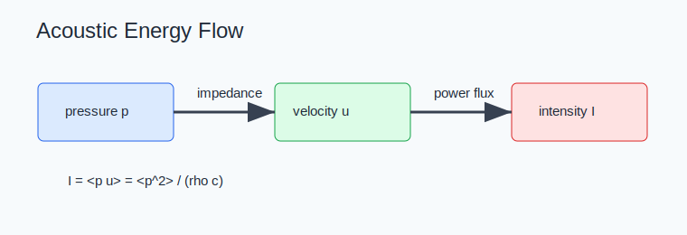

# Ultrasound Foundations



## Scope

Foundations cover pressure, particle velocity, density perturbation, acoustic impedance, intensity, energy, and conservation laws. Code ownership maps to `kwavers::physics::acoustics::conservation`, `kwavers::physics::constants`, `kwavers::domain::grid`, and shared validation utilities.

## Theorem: Plane-Wave Intensity

For a lossless homogeneous medium with pressure `p(t)` and particle velocity `u(t)` satisfying `p = rho c u`, the time-averaged intensity is

```text
I = <p u> = <p^2> / (rho c).
```

### Proof Sketch

The linearized Euler and constitutive equations yield the impedance relation `p/u = rho c` for a traveling plane wave. Substituting `u = p/(rho c)` into the power flux `p u` gives the identity after averaging over one or more periods.

## Algorithm: Foundational Quantity Contract

1. Store fields with explicit units in module docs and test names.
2. Convert pressure to intensity only when a local impedance model is available.
3. Validate conservation of energy, mass, and momentum on analytic fields before using numerical fields.
4. Reject non-finite density, sound speed, time step, or grid spacing before propagation.

## Implementation Targets

- Keep unit conversions centralized in domain or physics modules.
- Link every derived intensity, MI, TI, ARF, and dose value to the pressure/velocity field used to compute it.
- Add property tests that assert dimensional invariants: positive density, positive sound speed, and non-negative energy density.

## Research Anchors

- k-Wave first-order acoustics and k-space pseudospectral methods: http://www.k-wave.org/
- k-wave-python solver interface and reference examples: https://k-wave-python.readthedocs.io/
- Conservation-law implementation ownership: `kwavers::physics::acoustics::conservation`.
