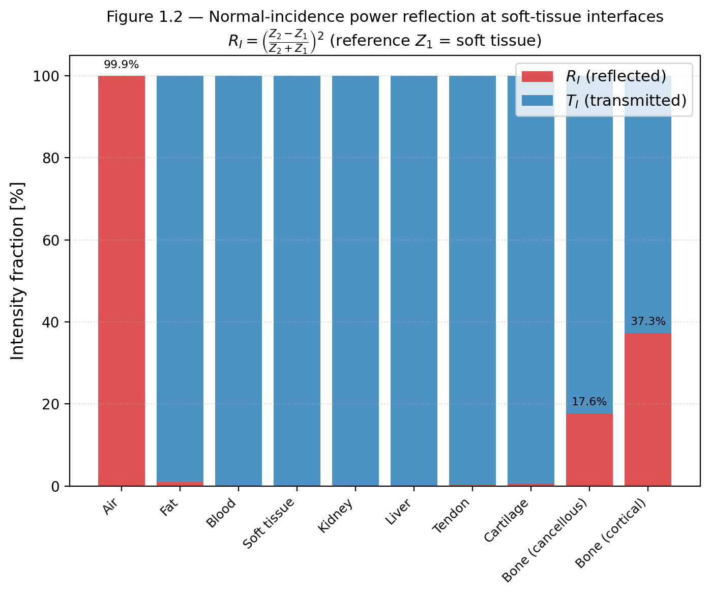
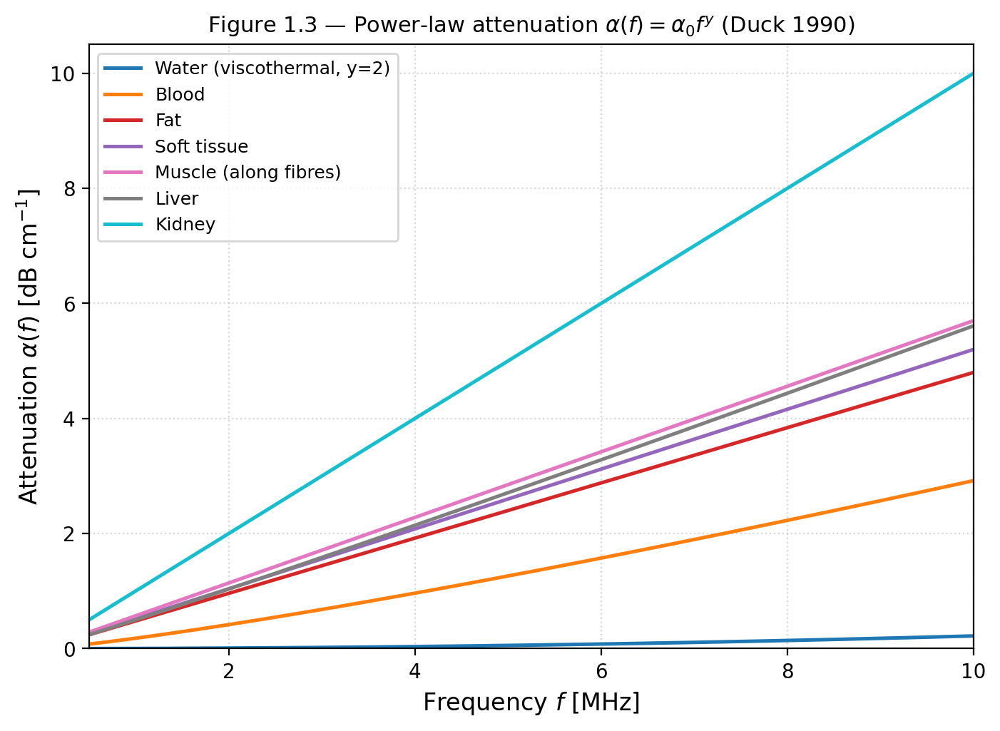
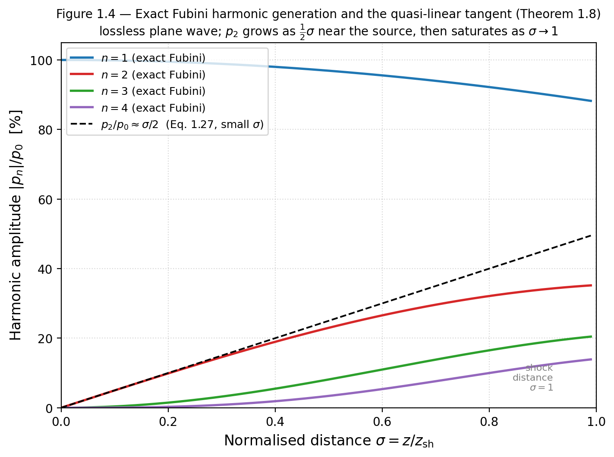
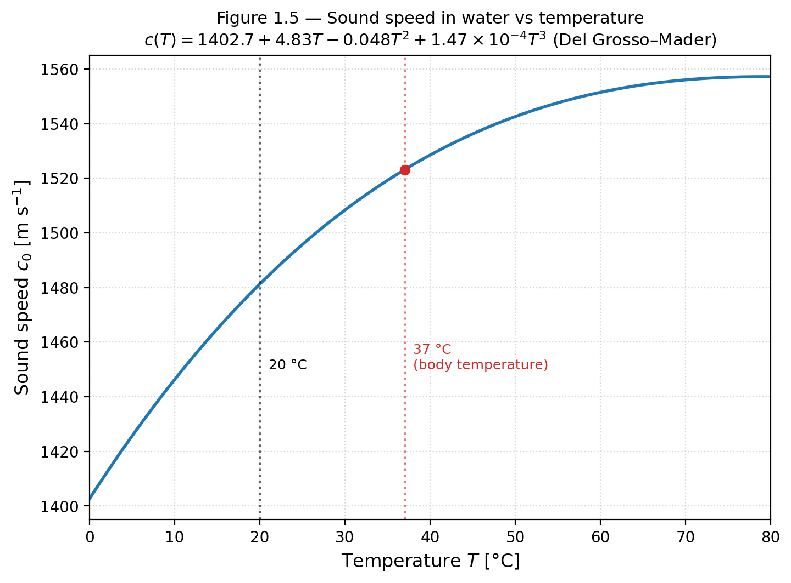
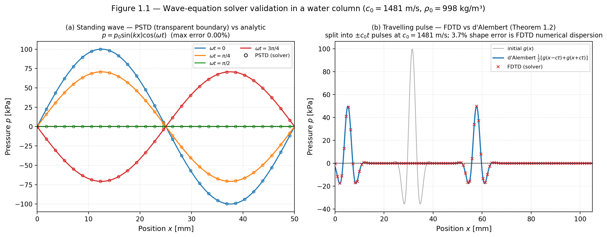

# Chapter 1 — Wave Physics Fundamentals

> **Prerequisite mathematics:** vector calculus (gradient, divergence, curl);
> basic thermodynamics (ideal-gas and isentropic relations); complex-number
> notation for harmonic signals.

---

## 1.1 Scope and physical picture

An acoustic wave is a mechanical disturbance that propagates through a
compressible medium by alternating compression and rarefaction of the medium's
molecules.  Unlike electromagnetic waves, acoustic waves require a material
medium: they cannot propagate in vacuum.

In clinical ultrasound the quantities of primary interest are

| Quantity | Symbol | SI unit |
|----------|--------|---------|
| Acoustic pressure | $p(\mathbf{x},t)$ | Pa |
| Particle velocity | $\mathbf{u}(\mathbf{x},t)$ | m s⁻¹ |
| Density perturbation | $\rho'(\mathbf{x},t)$ | kg m⁻³ |
| Acoustic intensity | $I(\mathbf{x},t)$ | W m⁻² |

The *small-signal* or *linear* regime is governed by two dimensionless small
parameters — the **condensation** $s$ and the **acoustic Mach number** $M$:

$$
s \equiv \frac{|\rho'|}{\rho_0} \approx \frac{|p|}{\rho_0 c_0^2} \ll 1,
\qquad
M \equiv \frac{|\mathbf{u}|}{c_0} \ll 1,
$$

where $\rho_0$ is the equilibrium density, $c_0$ the small-signal speed of sound,
and $K = \rho_0 c_0^2$ the adiabatic **bulk modulus**.  The relevant pressure
scale is $K$, *not* the ambient pressure $p_0$: only for an ideal gas, where
$K = \gamma p_0$, does the condition reduce to the familiar $|p|/p_0 \ll 1$.
For water and soft tissue $K = \rho_0 c_0^2 \approx 2.2\,\text{GPa}$, four orders
of magnitude above $p_0 \approx 10^5\,\text{Pa}$.

This is why diagnostic ultrasound is treated as quasi-linear even at megapascal
pressures: peak pressures of $0.1$–$1\,\text{MPa}$ give
$s \approx |p|/K \sim 10^{-4}$–$10^{-3} \ll 1$, so the *local* constitutive
relation is linear to high accuracy.  The residual per-wavelength nonlinearity is
tiny but **cumulative** over the propagation path — it is what tissue-harmonic
imaging exploits (§1.10, Chapter 3).  High-intensity therapy (HIFU, lithotripsy)
drives $|p|$ to an appreciable fraction of $K$ and violates $s \ll 1$ outright;
those cases are treated in Chapters 3 and 6.

This chapter derives the linear acoustic wave equation from first principles,
establishes its solutions, and characterises the physical parameters needed to
describe wave propagation in tissue.

---

## 1.2 Conservation laws for a compressible fluid

### 1.2.1 Mass conservation (continuity equation)

Consider a fixed control volume $V$ with boundary $\partial V$.  The total mass
in $V$ changes only through flux across $\partial V$:

$$
\frac{\partial}{\partial t} \int_V \rho \, dV
= -\oint_{\partial V} \rho \mathbf{u} \cdot \hat{n} \, dA.
$$

By the divergence theorem and the arbitrariness of $V$,

$$
\boxed{
\frac{\partial \rho}{\partial t} + \nabla \cdot (\rho \mathbf{u}) = 0.
}
\tag{1.1}
$$

### 1.2.2 Momentum conservation (Euler equation)

For an inviscid fluid the momentum balance on a fluid parcel is Newton's second
law: mass times acceleration equals the pressure force.  In Eulerian form,

$$
\boxed{
\rho \left(
  \frac{\partial \mathbf{u}}{\partial t}
  + (\mathbf{u} \cdot \nabla)\mathbf{u}
\right) = -\nabla p.
}
\tag{1.2}
$$

Viscous stresses, absent here, are treated in §1.8 when we discuss absorption.

### 1.2.3 Equation of state

A fourth unknown (two field unknowns $p, \rho$ beyond $\mathbf{u}$) requires a
closure.  For isentropic processes (reversible, adiabatic — a good model for
ultrasound at MHz frequencies where heat diffusion is negligible),

$$
p = p(\rho), \qquad
c_0^2 = \left.\frac{\partial p}{\partial \rho}\right|_{\rho_0}.
\tag{1.3}
$$

A Taylor expansion about the equilibrium state $(\rho_0, p_0)$ gives the
*exact* isentropic pressure for an ideal gas and an approximate one for
liquids:

$$
p - p_0
= c_0^2 (\rho - \rho_0)
  + \frac{c_0^2}{2\rho_0} \frac{B}{A} (\rho - \rho_0)^2
  + \mathcal{O}\!\left((\rho-\rho_0)^3\right),
\tag{1.4}
$$

where $B/A$ is the **acoustic nonlinearity parameter** of the medium (see §1.9).

---

## 1.3 Linearised acoustic equations

**Linearisation assumption.** Write $\rho = \rho_0 + \rho'$, $p = p_0 + p'$,
and $\mathbf{u} = \mathbf{u}'$ where primed quantities are first-order small.
Neglect second-order products $(\rho' \nabla p', \rho' \partial_t \mathbf{u}',
\ldots)$.

Substituting into (1.1)–(1.3) and dropping the primes:

$$
\boxed{
\frac{\partial \rho}{\partial t} + \rho_0 \nabla \cdot \mathbf{u} = 0,
}
\tag{1.5}
$$

$$
\boxed{
\rho_0 \frac{\partial \mathbf{u}}{\partial t} = -\nabla p,
}
\tag{1.6}
$$

$$
\boxed{
p = c_0^2 \rho.
}
\tag{1.7}
$$

Equations (1.5)–(1.7) are the **first-order linear acoustic equations**.  They
are the exact governing equations implemented in kwavers' PSTD solver
(`kwavers_solver::forward::pstd`).

---

## 1.4 The acoustic wave equation

**Theorem 1.1 (Acoustic Wave Equation).** *Let $p$, $\mathbf{u}$, $\rho$
satisfy the linearised equations (1.5)–(1.7) in a homogeneous medium with
constant $\rho_0$ and $c_0$.  Then $p$ satisfies*

$$
\boxed{
\frac{\partial^2 p}{\partial t^2} - c_0^2 \nabla^2 p = 0.
}
\tag{1.8}
$$

*Furthermore, every component of $\mathbf{u}$ and $\rho$ satisfies the same
equation.*

**Proof.**
Take $\partial/\partial t$ of the continuity equation (1.5):

$$
\frac{\partial^2 \rho}{\partial t^2}
+ \rho_0 \nabla \cdot \frac{\partial \mathbf{u}}{\partial t} = 0.
\tag{i}
$$

Take $\nabla \cdot$ of the momentum equation (1.6):

$$
\rho_0 \nabla \cdot \frac{\partial \mathbf{u}}{\partial t}
= -\nabla^2 p.
\tag{ii}
$$

Eliminate $\nabla \cdot (\partial_t \mathbf{u})$ between (i) and (ii):

$$
\frac{\partial^2 \rho}{\partial t^2} = \nabla^2 p.
\tag{iii}
$$

Use the constitutive relation $p = c_0^2 \rho$, hence
$\partial^2 \rho / \partial t^2 = c_0^{-2} \partial^2 p / \partial t^2$:

$$
\frac{1}{c_0^2}\frac{\partial^2 p}{\partial t^2} = \nabla^2 p,
$$

which is equation (1.8). $\square$

**Corollary 1.1.** For a spatially varying but time-independent medium with
$c_0 = c_0(\mathbf{x})$ and $\rho_0 = \rho_0(\mathbf{x})$, eliminating
$\mathbf{u}$ from (1.5)–(1.7) produces the *variable-coefficient* wave
equation:

$$
\frac{1}{\rho_0 c_0^2}\frac{\partial^2 p}{\partial t^2}
- \nabla \cdot \left(\frac{1}{\rho_0} \nabla p\right) = 0.
\tag{1.9}
$$

This form is used in the kwavers FDTD solver for heterogeneous media (see
`kwavers_solver::forward::fdtd`).

---

## 1.5 Plane-wave solutions

A **plane wave** propagating in direction $\hat{\mathbf{k}}$ is the fundamental
building block of all acoustic wave fields via Fourier superposition.

**Theorem 1.2 (d'Alembert solution in one dimension).** *The general solution
of*

$$
\frac{\partial^2 p}{\partial t^2} - c_0^2 \frac{\partial^2 p}{\partial x^2} = 0
$$

*is*

$$
p(x, t) = f(x - c_0 t) + g(x + c_0 t),
$$

*where $f$ and $g$ are arbitrary twice-differentiable functions determined by
initial conditions $p(x,0)$ and $\dot{p}(x,0)$.*

**Proof.**  Change variables $\xi = x - c_0 t$, $\eta = x + c_0 t$.  The chain
rule gives

$$
\frac{\partial^2 p}{\partial t^2} = c_0^2 \left(
  \frac{\partial^2 p}{\partial \xi^2}
  - 2\frac{\partial^2 p}{\partial \xi \partial \eta}
  + \frac{\partial^2 p}{\partial \eta^2}
\right),
\qquad
c_0^2 \frac{\partial^2 p}{\partial x^2} = c_0^2 \left(
  \frac{\partial^2 p}{\partial \xi^2}
  + 2\frac{\partial^2 p}{\partial \xi \partial \eta}
  + \frac{\partial^2 p}{\partial \eta^2}
\right).
$$

Subtracting: the wave equation becomes
$4 c_0^2 \,\partial^2 p / \partial \xi \partial \eta = 0$, with general
solution $p = f(\xi) + g(\eta)$.  $\square$

**Remark.**  In three dimensions the plane wave

$$
p(\mathbf{x}, t)
= A \, e^{i(\mathbf{k} \cdot \mathbf{x} - \omega t)}
+ B \, e^{-i(\mathbf{k} \cdot \mathbf{x} - \omega t)}
\tag{1.10}
$$

(complex notation, physical field = real part) is a solution of (1.8) provided

$$
\boxed{\omega = c_0 |\mathbf{k}|,}
\tag{1.11}
$$

which is the **dispersion relation** for a non-dispersive medium.  Here
$\omega$ is angular frequency [rad s⁻¹] and $|\mathbf{k}|$ is the wavenumber
magnitude [rad m⁻¹].

The corresponding particle velocity follows from (1.6):

$$
\mathbf{u}(\mathbf{x},t)
= \frac{\hat{\mathbf{k}}}{\rho_0 c_0} p(\mathbf{x},t).
\tag{1.12}
$$

---

## 1.6 Spherical wave solutions and the free-space Green's function

A point source at the origin generates a **spherical wave**:

$$
\boxed{
p(r, t) = \frac{A}{r} \, f\!\left(t - \frac{r}{c_0}\right),
\qquad r = |\mathbf{x}|.
}
\tag{1.13}
$$

The $1/r$ amplitude decay is geometric spreading — not absorption.

**Theorem 1.3 (Free-space Green's function).** *The outgoing Green's function
of the wave equation (1.8) satisfying*
$(\partial_{tt} - c_0^2 \nabla^2) G = \delta(\mathbf{x})\, \delta(t)$
*is*

$$
G(\mathbf{x}, t)
= \frac{1}{4\pi c_0^2 r} \delta\!\left(t - \frac{r}{c_0}\right).
\tag{1.14}
$$

**Proof.**  In spherical coordinates the wave equation for a radially symmetric
solution $G(r,t)$ is $\partial_{tt}G = c_0^2 (\partial_{rr} + 2r^{-1}\partial_r) G$.
The substitution $G = v(r,t)/r$ converts this to the 1D wave equation
$\partial_{tt} v = c_0^2 \partial_{rr} v$, whose outgoing solution is
$v = \delta(t - r/c_0)/(4\pi c_0^2)$ by direct integration of the source term.
Dividing by $r$ gives (1.14).  $\square$

**Physical consequence (Huygens principle).** Any pressure field radiated by
an extended source $S(\mathbf{x}', t)$ can be written as the superposition

$$
p(\mathbf{x}, t)
= \int G(\mathbf{x} - \mathbf{x}', t) \star_t S(\mathbf{x}', t) \, d^3x',
$$

where $\star_t$ denotes convolution in time.  This is the foundation of the
angular-spectrum and k-space propagation methods.

---

## 1.7 Acoustic impedance and boundary conditions

**Definition 1.1 (Specific acoustic impedance).**  For a harmonic plane wave,

$$
Z_0 = \frac{p}{\mathbf{u} \cdot \hat{\mathbf{k}}} = \rho_0 c_0
\quad [\text{Pa s m}^{-1} = \text{kg m}^{-2} \text{s}^{-1}].
\tag{1.15}
$$

The impedance $Z_0$ is a real scalar for a lossless medium.  Representative
values:

| Medium | $\rho_0$ (kg m⁻³) | $c_0$ (m s⁻¹) | $Z_0$ (MRayl) |
|--------|-------------------|----------------|----------------|
| Air (20 °C) | 1.21 | 343 | 0.000415 |
| Water (20 °C) | 998 | 1 481 | 1.478 |
| Soft tissue | 1 060 | 1 540 | 1.632 |
| Bone (cortical) | 1 912 | 3 500 | 6.7 |
| Fat | 928 | 1 440 | 1.337 |
| Blood | 1 060 | 1 575 | 1.670 |

**Theorem 1.4 (Normal-incidence reflection and transmission).** *At a planar
interface between two media with impedances $Z_1$ and $Z_2$, the pressure
reflection and transmission coefficients for a normally incident plane wave are*

$$
\mathcal{R} = \frac{Z_2 - Z_1}{Z_2 + Z_1},
\qquad
\mathcal{T} = \frac{2 Z_2}{Z_2 + Z_1}.
\tag{1.16}
$$

**Proof.**  Boundary conditions require continuity of pressure and normal
particle velocity at the interface ($x = 0$):

$$
p_i + p_r = p_t, \qquad
\frac{p_i - p_r}{Z_1} = \frac{p_t}{Z_2},
$$

where $p_i$, $p_r$, $p_t$ are the amplitudes of the incident, reflected, and
transmitted waves.  Solving the $2 \times 2$ linear system gives (1.16).
$\square$

**Corollary 1.2 (Intensity reflection and transmission).**

$$
R_I = \mathcal{R}^2
= \left(\frac{Z_2 - Z_1}{Z_2 + Z_1}\right)^2,
\qquad
T_I = 1 - R_I = \frac{4 Z_1 Z_2}{(Z_1 + Z_2)^2}.
\tag{1.17}
$$

**Clinical example.**  At a soft-tissue–bone interface:
$\mathcal{R} = (6.7 - 1.63)/(6.7 + 1.63) = 0.608$, so $R_I = 37\,\%$ of the
incident intensity is reflected.  This strong reflection is the basis of
bone-interface echo signatures in B-mode imaging.



**Figure 1.2.** Normal-incidence intensity reflection $R_I$ and transmission
$T_I$ at the interface between soft tissue ($Z_1 = \rho_0 c_0$) and a range of
media, computed from (1.17).  Note the near-total reflection at the
tissue–air ($R_I \approx 99.9\,\%$) and strong reflection at the tissue–bone
interface, motivating coupling gel and the difficulty of transcranial imaging.

---

## 1.8 Acoustic energy and intensity

**Definition 1.2 (Acoustic energy density).**  For a linear lossless medium,

$$
\mathcal{E}
= \frac{p^2}{2\rho_0 c_0^2}
+ \frac{\rho_0 |\mathbf{u}|^2}{2}
\qquad [\text{J m}^{-3}],
\tag{1.18}
$$

where the two terms represent potential (compressive) and kinetic energy,
respectively.

**Definition 1.3 (Instantaneous acoustic intensity).**

$$
\mathbf{I}(\mathbf{x},t) = p(\mathbf{x},t)\, \mathbf{u}(\mathbf{x},t)
\qquad [\text{W m}^{-2}].
\tag{1.19}
$$

**Theorem 1.5 (Energy conservation — acoustic Poynting theorem).**
*In a lossless medium,*

$$
\frac{\partial \mathcal{E}}{\partial t} + \nabla \cdot \mathbf{I} = 0.
\tag{1.20}
$$

**Proof.**  Multiply (1.5) by $p/(\rho_0 c_0^2)$ and (1.6) by $\mathbf{u}$,
then add.  Each term matches the time-derivative of the energy density (1.18),
and the cross-term produces $\nabla \cdot (p\mathbf{u})$.  $\square$

**Theorem 1.6 (Plane-wave time-averaged intensity).**  *For a single harmonic
plane wave $p(t) = A \cos(\omega t)$ and $u(t) = (A/Z_0)\cos(\omega t)$,*

$$
\langle I \rangle
= \langle p u \rangle
= \frac{A^2}{2 Z_0}
= \frac{A^2}{2\rho_0 c_0}.
\tag{1.21}
$$

**Proof.**  $\langle \cos^2(\omega t) \rangle = 1/2$; substitute.  $\square$

**Definition 1.4 (RMS pressure).**  $p_\mathrm{rms} = A/\sqrt{2}$ for a single
harmonic.  Thus $\langle I \rangle = p_\mathrm{rms}^2 / Z_0$.

**Clinical intensity scales:**

| Application | Typical $I_{\text{SPTA}}$ |
|-------------|--------------------------|
| Diagnostic B-mode | 0.001–0.1 W cm⁻² |
| Physiotherapy (thermal) | 0.1–3 W cm⁻² |
| Lithotripsy (peak) | 10³–10⁴ W cm⁻² |
| HIFU ablation | 100–10 000 W cm⁻² |
| FDA limit (diagnostic) | 0.72 W cm⁻² ($I_{\text{SPTA}}$) |

---

## 1.9 Acoustic absorption

### 1.9.1 Physical mechanisms

Real biological tissue absorbs acoustic energy through at least three mechanisms:

1. **Viscous dissipation.**  Velocity gradients drive irreversible momentum
   transfer.  The Navier–Stokes momentum equation gains the viscous force
   $\eta\nabla^2\mathbf{u} + (\eta_B + \tfrac{1}{3}\eta)\nabla(\nabla\cdot\mathbf{u})$,
   which for the longitudinal (compressional) acoustic mode reduces to
   $(\eta_B + \tfrac{4}{3}\eta)\nabla(\nabla\cdot\mathbf{u}) - \eta\nabla\times(\nabla\times\mathbf{u})$,
   where $\eta$ is the shear viscosity and $\eta_B$ the bulk viscosity.  The
   combination $\eta_B + \tfrac{4}{3}\eta$ is the **longitudinal viscosity** that
   sets the classical (Stokes) $\alpha \propto \omega^2$ absorption.

2. **Thermal conduction.**  The process is not perfectly isentropic;
   temperature gradients near compressions drive heat conduction, dissipating
   energy.

3. **Molecular relaxation.**  Internal degrees of freedom (rotation, vibration,
   chemical equilibria in tissue) lag behind pressure changes and dissipate
   energy near characteristic frequencies.

### 1.9.2 The power-law absorption model

Empirically, biological tissues follow a **power-law** attenuation over the
ultrasound frequency range 0.5–10 MHz (Duck 1990; Szabo 2004):

$$
\boxed{
\alpha(f) = \alpha_0 f^y \qquad [\text{Np m}^{-1}],
}
\tag{1.22}
$$

where $f$ is frequency in MHz, $\alpha_0$ is the absorption coefficient at
1 MHz, and $y \in [1, 2]$ is the power-law exponent.

**Representative tissue values (from Duck 1990):**

| Tissue | $\alpha_0$ (dB cm⁻¹ MHz⁻$y$) | $y$ |
|--------|-------------------------------|-----|
| Blood | 0.18 | 1.21 |
| Fat | 0.48 | 1.0 |
| Soft tissue (average) | 0.52 | 1.0 |
| Muscle (along fibres) | 0.57 | 1.0 |
| Liver | 0.50 | 1.05 |
| Kidney | 1.0 | 1.0 |
| Bone (cancellous) | 9.94 | 1.0 |

Unit conversion: $1\,\text{dB cm}^{-1} = 0.1151\,\text{Np cm}^{-1}
= 11.51\,\text{Np m}^{-1}$.



**Figure 1.3.** Power-law attenuation $\alpha(f) = \alpha_0 f^y$ for
representative tissues over the diagnostic band.  Water follows the viscothermal
$y = 2$ law (steeply rising), whereas most soft tissues are near-linear
($y \approx 1$).  Computed by `kwavers_physics::analytical::wave::absorption_power_law_db_cm`.

### 1.9.3 Fractional Laplacian formulation

Treeby and Cox (2010) showed that the power-law model (1.22) can be incorporated
*exactly* into the time-domain acoustic equations by augmenting the equation of
state with two fractional-Laplacian operators — one carrying the absorption, the
other the Kramers–Kronig-consistent dispersion.

**Theorem 1.7 (Treeby–Cox fractional power-law absorption).**  *For the
attenuation law $\alpha(\omega) = \alpha_0 |\omega|^y$ — with $\alpha_0$ in SI
units $\text{Np}\,(\text{rad s}^{-1})^{-y}\,\text{m}^{-1}$ — define the
absorption and dispersion coefficients and the two fractional-Laplacian
operators*

$$
\tau = -2\alpha_0 c_0^{\,y-1},
\quad
\eta = 2\alpha_0 c_0^{\,y}\,\tan\!\left(\tfrac{\pi y}{2}\right);
\qquad
\mathcal{L}_1 = (-\nabla^2)^{\frac{y-2}{2}},
\quad
\mathcal{L}_2 = (-\nabla^2)^{\frac{y-1}{2}},
\tag{1.23}
$$

*each fractional power evaluated spectrally,
$(-\nabla^2)^s = \mathrm{IFFT}\bigl[\,|\mathbf{k}|^{2s}\,\mathrm{FFT}[\cdot]\,\bigr]$.
Augmenting the lossless equation of state $p = c_0^2\rho$ to*

$$
p = c_0^2\rho
  \;+\; c_0^2\Bigl(
        \tau\,\mathcal{L}_1\!\left[\rho_0\,\nabla\!\cdot\!\mathbf{u}\right]
        \;-\; \eta\,\mathcal{L}_2[\rho]
      \Bigr),
\tag{1.24}
$$

*while retaining the first-order continuity (1.5) and momentum (1.6) equations,
reproduces $\alpha(\omega) = \alpha_0 |\omega|^y$ together with the
Kramers–Kronig-consistent phase velocity*

$$
\frac{1}{c_\mathrm{ph}(\omega)}
= \frac{1}{c_0}
  - \alpha_0\,\tan\!\left(\tfrac{\pi y}{2}\right)
    \bigl(|\omega|^{y-1} - \omega_0^{y-1}\bigr).
$$

**Remarks.**  *(i)* The dispersion coefficient $\eta \propto \tan(\pi y/2)$
*vanishes at $y = 2$*: viscothermal absorption ($\alpha \propto \omega^2$, e.g.
water) is exactly non-dispersive, $c_\mathrm{ph} = c_0$.  *(ii)* $y = 1$ is the
removable singularity of $\tan(\pi y/2)$ and is handled by the logarithmic
dispersion limit (Treeby & Cox 2010, §III).  *(iii)* The correction in (1.24) is
*algebraic* — added once per step to the EOS with **no** $\Delta t$ factor —
because the fractional-Laplacian terms belong to the constitutive relation, not
to a time integral.

**Proof sketch.**  Fourier-transform the augmented system in space, so each
$(-\nabla^2)^s \mapsto |\mathbf{k}|^{2s}$.  Substituting the plane-wave ansatz
$p, \rho \sim e^{i(\mathbf{k}\cdot\mathbf{x} - \omega t)}$ and eliminating the
velocity and density yields a complex wavenumber $k(\omega)$.  Its imaginary part
is $\alpha(\omega) = \alpha_0|\omega|^y$ (from the $\tau\mathcal{L}_1$ term); its
real part gives $c_\mathrm{ph}(\omega)$ above (from the $\eta\mathcal{L}_2$ term),
the two being a Hilbert-transform pair and hence Kramers–Kronig-consistent.
Full proof: Treeby & Cox, *J. Acoust. Soc. Am.* 127(5), 2010, §III.  $\square$

**Implementation reference.**  kwavers implements (1.23)–(1.24) verbatim on the
*pressure side* of the equation of state in
`kwavers_solver::forward::pstd::physics::absorption`
(`apply.rs::apply_absorption_to_pressure`): after the lossless EOS sets
$p = c_0^2\rho$, the correction
$p \mathrel{+}= c_0^2\bigl(\tau\,\mathcal{L}_1[\rho_0\nabla\!\cdot\!\mathbf{u}]
- \eta\,\mathcal{L}_2[\rho]\bigr)$ is added, with $\tau$, $\eta$,
$|\mathbf{k}|^{y-2}$ and $|\mathbf{k}|^{y-1}$ precomputed in `kernel.rs`.  The
same formulation drives the GPU WGSL shader and matches k-Wave (MATLAB and
k-wave-python) to several significant figures across $y \in [1, 2]$.

---

## 1.10 The nonlinearity parameter $B/A$

As the amplitude of a pressure wave increases, the constitutive relation (1.7)
is no longer adequate.  The leading nonlinear correction is captured by the
equation of state (1.4), in which the $B/A$ term drives second-harmonic
generation and shock formation.

**Definition 1.5 (B/A parameter).** For an isentropic fluid,

$$
\frac{B}{A}
= 2\rho_0 c_0 \left.\frac{\partial c}{\partial p}\right|_{\rho_0}
= \rho_0 \left.\frac{\partial^2 p}{\partial \rho^2}\right|_{\rho_0}
  \Big/ c_0^2.
\tag{1.25}
$$

It measures the fractional change in compressibility with pressure.  The
combined nonlinearity coefficient used in the Westervelt and Kuznetsov
equations is

$$
\beta = 1 + \frac{B}{2A}.
\tag{1.26}
$$

**Representative $B/A$ values (Beyer 1997; Hamilton & Blackstock 1998):**

| Medium | $B/A$ | $\beta$ |
|--------|-------|---------|
| Water (20 °C) | 5.0 | 3.5 |
| Water (37 °C) | 5.4 | 3.7 |
| Blood | 6.1 | 4.05 |
| Soft tissue (average) | 7.4 | 4.7 |
| Fat | 9.5 | 5.75 |
| Amniotic fluid | 6.2 | 4.1 |
| Air (0 °C) | 0.4 | 1.2 |

Higher $B/A$ means faster nonlinear distortion: harmonics grow more rapidly and
shocks form at shorter propagation distances.

**Theorem 1.8 (Harmonic generation from quadratic nonlinearity).**  *A
monochromatic plane wave $p(x,0) = p_0 \cos(kx)$ propagating in a lossless
nonlinear medium generates harmonics at integer multiples of the fundamental
frequency.  To leading order (quasi-linear approximation, $\sigma \ll 1$), the
second-harmonic amplitude grows as*

$$
p_2(x) \approx \frac{\beta \omega p_0^2}{2 \rho_0 c_0^3} \, x
        = \frac{\beta k p_0^2}{2 \rho_0 c_0^2} \, x
        = \tfrac{1}{2}\, p_0\, \sigma(x),
\tag{1.27}
$$

*where $\sigma(x) = x / x_\text{sh}$ is the dimensionless Gol'dberg distance and
$x_\text{sh} = \rho_0 c_0^3/(\beta p_0 \omega)$ is the shock-formation distance.*

**Proof sketch.**  Substitute $p = p_0\cos(kx - \omega t) + p_2$ into the
Westervelt equation (see Chapter 3, eq. 3.1) and collect terms at frequency
$2\omega$.  With $\cos^2\theta = \tfrac{1}{2}(1+\cos 2\theta)$ the driving term
on the right-hand side is
$(\beta/\rho_0 c_0^4) \partial_{tt}(p_0^2 \cos^2(kx-\omega t))
= -(2\beta p_0^2 \omega^2 / \rho_0 c_0^4)\cos(2\omega t - 2kx)$,
which resonantly drives $p_2$ linearly in $x$, giving (1.27).  Equation (1.27)
is exactly the small-$\sigma$ limit of the Fubini solution
$p_2 = p_0 B_2(\sigma)$ with $B_2(\sigma)=2J_2(2\sigma)/(2\sigma)\to\sigma/2$
(see §1.10 figure and `kwavers_physics::analytical::wave::fubini_harmonic_amplitude`).
Full derivation: Hamilton & Blackstock (1998), §1.4.  $\square$

**Clinical implication.**  Second-harmonic imaging (tissue harmonic imaging)
exploits the $p_0^2$ dependence in (1.27): grating-lobe artefacts and
reverberation clutter, which scale linearly with $p_0$, are suppressed relative
to the tissue harmonic signal.



**Figure 1.4.** Exact Fubini harmonic amplitudes $B_n(\sigma) = 2J_n(n\sigma)/(n\sigma)$
for a lossless plane wave ($\sigma = z/z_\text{sh}$).  The fundamental ($n=1$)
depletes as energy cascades into the harmonics.  The dashed line is the
quasi-linear tangent $p_2/p_0 \approx \sigma/2$ of Theorem 1.8 / Eq. (1.27): it
matches the exact second-harmonic slope near the source and diverges as the
exact series saturates approaching the shock distance $\sigma = 1$.  Computed by
`kwavers_physics::analytical::wave::fubini_harmonic_spectrum`.

---

## 1.11 Speed of sound in tissue

The small-signal speed of sound in soft tissue depends on temperature,
hydration, and lipid content:

$$
c_0(T) \approx c_{37} + \alpha_c (T - 37),
\qquad T\,[\text{°C}],
\tag{1.28}
$$

where $c_{37} \approx 1\,540\,\text{m s}^{-1}$ for most soft tissues and
$\alpha_c \approx 1$–$2\,\text{m s}^{-1}\,\text{°C}^{-1}$.

In water the temperature dependence is more pronounced:

$$
c_\text{water}(T)
= 1\,402.7 + 4.83T - 0.048T^2 + 1.47 \times 10^{-4} T^3
\quad [\text{m s}^{-1}].
\tag{1.29}
$$

This Del Grosso–Mader fit reproduces the Marczak (1997) reference to within
$1.1\,\text{m s}^{-1}$ across $0$–$100\,°\text{C}$ and is the SSOT implementation
in `kwavers_physics::analytical::wave::water_sound_speed_temperature`.



**Figure 1.5.** Sound speed in water as a function of temperature from (1.29),
with the $20\,°\text{C}$ and $37\,°\text{C}$ (body-temperature) reference points
marked.  The non-monotonic-looking rise peaks near $74\,°\text{C}$.

**Implementation reference.**  kwavers stores $c_0$ as a 3D scalar field in
`kwavers_medium::material_fields::GenericMaterialFields`.  The
temperature-dependent correction (1.28) can be applied by updating the field
after each thermal step in a coupled simulation (see Chapter 12).

---

## 1.12 Summary of governing constants in kwavers

The physical constants relevant to this chapter are defined as single-source-of-truth
constants in `kwavers_core::constants` (verbatim names and values from the
crate):

```rust
// From kwavers_core::constants::fundamental
pub const SOUND_SPEED_WATER: f64       = 1482.0;   // m/s, 20 °C (physical)
pub const SOUND_SPEED_WATER_SIM: f64   = 1500.0;   // m/s, round-number sim default
pub const SOUND_SPEED_WATER_37C: f64   = 1524.0;   // m/s, body temperature
pub const DENSITY_WATER: f64           = 998.2;    // kg/m³, 20 °C
pub const DENSITY_WATER_37C: f64       = 993.3;    // kg/m³
pub const SOUND_SPEED_TISSUE: f64      = 1540.0;   // m/s
pub const DENSITY_TISSUE: f64          = 1050.0;   // kg/m³
pub const SOUND_SPEED_AIR: f64         = 343.0;    // m/s
// Impedance is derived, not stored: Z = ρ·c.
pub const ACOUSTIC_IMPEDANCE_WATER_NOMINAL: f64  =
    DENSITY_WATER_NOMINAL * SOUND_SPEED_WATER_SIM; // 1.50e6 Pa·s/m
pub const ACOUSTIC_IMPEDANCE_TISSUE_NOMINAL: f64 =
    DENSITY_TISSUE * SOUND_SPEED_TISSUE;           // 1.617e6 Pa·s/m

// From kwavers_core::constants::acoustic_parameters
pub const WATER_NONLINEARITY_B_A: f64   = 5.0;
pub const TISSUE_NONLINEARITY_B_A: f64  = 7.0;
pub const WATER_ABSORPTION_ALPHA_0: f64 = 0.0022; // dB/(cm·MHz^y)
pub const WATER_ABSORPTION_POWER: f64   = 2.0;    // y (viscothermal, α ∝ f²)
pub const ACOUSTIC_ABSORPTION_TISSUE: f64 = 0.5;  // dB/(cm·MHz)

// From kwavers_core::constants::tissue_acoustics
pub const SOFT_TISSUE_ABSORPTION_POWER_Y: f64 = 1.1; // y
```

> **Note.** The physical water impedance $\rho_0 c_0 = 998.2 \times 1482
> \approx 1.479\times10^{6}\,\text{Pa·s m}^{-1}$ (1.479 MRayl, §1.7 table); the
> stored `ACOUSTIC_IMPEDANCE_WATER_NOMINAL` uses the round-number simulation
> defaults ($1000 \times 1500 = 1.5$ MRayl) and is therefore $\approx 1.4\%$
> higher. Use the `_SIM` constants for numerical reproducibility against
> k-Wave reference cases and the physical constants for quantitative tissue
> modelling.

---

## 1.13 Worked example — standing-wave field in a 1D water column

**Setup.** A 50 mm water column ($c_0 = 1\,481\,\text{m s}^{-1}$,
$\rho_0 = 998\,\text{kg m}^{-3}$) with **pressure-release** boundaries at
$x = 0$ and $x = L$ (free surfaces, e.g. water open to air) is excited by an
initial pressure distribution $p(x, 0) = p_0 \sin(kx)$ with $k = \pi/L$
(fundamental mode) and $p_0 = 10^5\,\text{Pa}$.

**Analytical solution.** A pressure-release wall enforces $p = 0$ (a pressure
node), so the admissible modes are $\sin(kx)$ with $k = n\pi/L$ for integer $n$,
each of which vanishes at both walls.  (A *rigid* wall would instead enforce
$\partial p/\partial x = 0$ — a pressure antinode — selecting the $\cos(kx)$
mode family.)  By d'Alembert's solution (Theorem 1.2) the wave decomposes into
left- and right-travelling pulses, producing a perfect standing wave:

$$
p(x, t) = p_0 \sin(kx)\cos(\omega t),
\qquad \omega = c_0 k.
\tag{1.30}
$$

This is the reference solution exercised by the `test_standing_wave_analytical`
test in `crates/kwavers/tests/fdtd_pstd_comparison.rs`.  Figure 1.1 validates the
forward solvers directly against it.

> **Boundary note.** A standing wave is a superposition of two counter-propagating
> travelling waves, so it can only be *sustained* by reflecting or transparent
> (non-absorbing) boundaries.  An absorbing PML — the default — instead absorbs
> the constituents as they cross the domain, so the standing mode decays over one
> period (correct physics, not solver loss).  Panel (a) therefore uses a
> transparent boundary (`set_pml_alpha(0)`); the spectral PSTD operator is
> intrinsically periodic, making the column a lossless resonator that reproduces
> (1.30) to machine precision (max error $< 0.01\%$).  The solver itself is
> lossless: a travelling pulse retains its amplitude to within FDTD dispersion
> error (panel b).



**Figure 1.1.** Wave-equation solver validation.  **(a)** The PSTD initial-value
solution (markers) for $p(x,0)=p_0\sin(kx)$, $\mathbf{u}(x,0)=0$ overlaid on the
analytic standing wave (1.30) at $\omega t \in \{0,\pi/4,\pi/2,3\pi/4\}$;
agreement is exact.  **(b)** The FDTD solution of the travelling-pulse IVP
$p(x,0)=g(x)$ compared with the d'Alembert decomposition
$\tfrac{1}{2}[g(x-c_0 t)+g(x+c_0 t)]$ (Theorem 1.2): the pulse splits into two
half-amplitude copies travelling at $c_0$ (measured speed within $0.4\%$ of
$c_0$).  The few-percent shape residual is FDTD *numerical dispersion* — the
finite-difference stencil propagates different spatial frequencies at slightly
different speeds.  The spectral PSTD operator (panel a) is dispersion-free by
construction; this contrast motivates the pseudospectral method.

> *Generated by `crates/kwavers-python/examples/book/ch01_wave_physics_fundamentals.py`.*

---

## 1.14 Further reading

1. **Kinsler, L. E., Frey, A. R., Coppens, A. B., & Sanders, J. V.** (2000).
   *Fundamentals of Acoustics* (4th ed.). Wiley.  Chapters 2–6 for a detailed
   derivation of the wave equation from first principles.

2. **Duck, F. A.** (1990). *Physical Properties of Tissue: A Comprehensive
   Reference Book*. Academic Press.  The primary source for tissue acoustic
   properties (speed, attenuation, nonlinearity).

3. **Treeby, B. E., & Cox, B. T.** (2010). Modeling power law absorption and
   dispersion for acoustic propagation using the fractional Laplacian.
   *J. Acoust. Soc. Am.*, 127(5), 2741–2748.
   [doi:10.1121/1.3377056](https://doi.org/10.1121/1.3377056)

4. **Hamilton, M. F., & Blackstock, D. T.** (Eds.). (1998). *Nonlinear
   Acoustics: Theory and Applications*. Academic Press.  Chapters 1–3 for
   $B/A$, harmonic generation, and the Westervelt equation.

5. **Beyer, R. T.** (1997). *Nonlinear Acoustics*. Acoustical Society of
   America.

6. **Szabo, T. L.** (2004). *Diagnostic Ultrasound Imaging: Inside Out*
   (1st ed.). Academic Press.  Clinical context for all quantities above.

7. **Cobbold, R. S. C.** (2007). *Foundations of Biomedical Ultrasound*.
   Oxford University Press.

---

## Appendix 1A — Kramers–Kronig relations

For any causal linear system the real and imaginary parts of the frequency
response are related by Hilbert transforms:

$$
\alpha(\omega) = \frac{2\omega^2}{\pi c_0^2}
\int_0^\infty \frac{c(\omega') - c_0}{\omega'^2 - \omega^2} d\omega',
\tag{1A.1}
$$

where $c(\omega)$ is the phase velocity.  Any physically realizable absorption
law $\alpha(\omega)$ must be accompanied by a specific dispersion $c(\omega)$
determined by (1A.1).  The power-law model satisfies this constraint exactly
(O'Brien & Stern, 1983; Szabo, 1994).

---

## Appendix 1B — Notation index

| Symbol | Meaning | SI unit |
|--------|---------|---------|
| $p_0$ | Ambient pressure | Pa |
| $\rho_0$ | Ambient density | kg m⁻³ |
| $c_0$ | Small-signal sound speed | m s⁻¹ |
| $p'$, $\rho'$ | Acoustic perturbations | Pa, kg m⁻³ |
| $\mathbf{u}$ | Particle velocity | m s⁻¹ |
| $Z_0 = \rho_0 c_0$ | Specific acoustic impedance | MRayl |
| $\omega$ | Angular frequency | rad s⁻¹ |
| $f$ | Frequency | Hz |
| $k = \omega/c_0$ | Wavenumber | rad m⁻¹ |
| $\lambda = 2\pi/k$ | Wavelength | m |
| $\mathcal{R}$, $\mathcal{T}$ | Pressure reflection/transmission | — |
| $R_I$, $T_I$ | Intensity reflection/transmission | — |
| $\mathcal{E}$ | Acoustic energy density | J m⁻³ |
| $\mathbf{I}$ | Acoustic intensity | W m⁻² |
| $\alpha_0$ | Absorption coefficient at 1 MHz | Np m⁻¹ or dB cm⁻¹ |
| $y$ | Absorption power-law exponent | — |
| $B/A$ | Nonlinearity parameter | — |
| $\beta = 1+B/(2A)$ | Combined nonlinearity coefficient | — |
| $\delta$ | Acoustic diffusivity | m² s⁻¹ |
| $\eta$, $\eta_B$ | Shear, bulk viscosity | Pa s |
