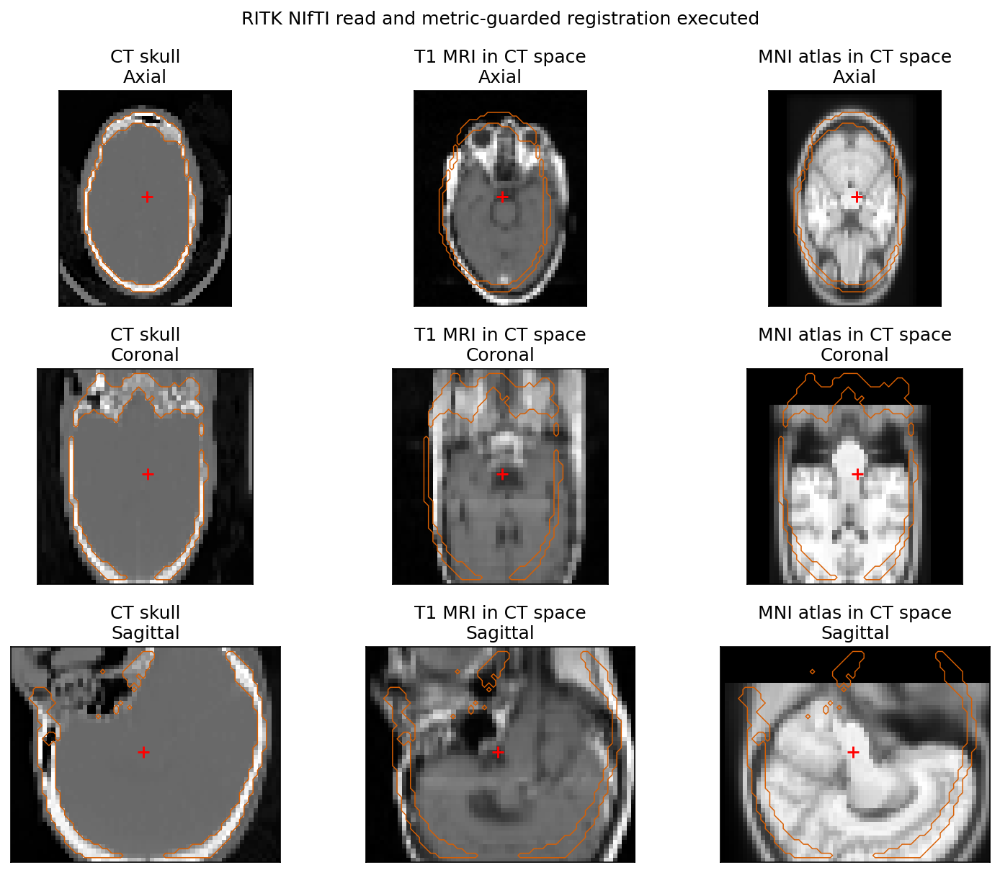
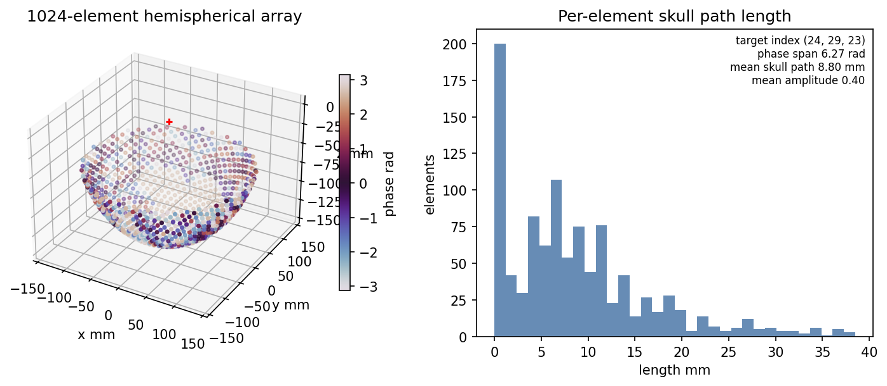
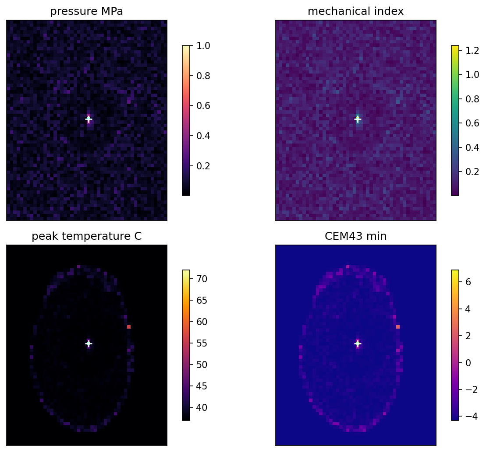
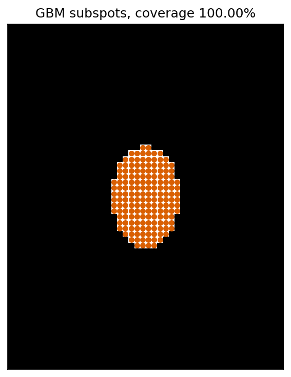
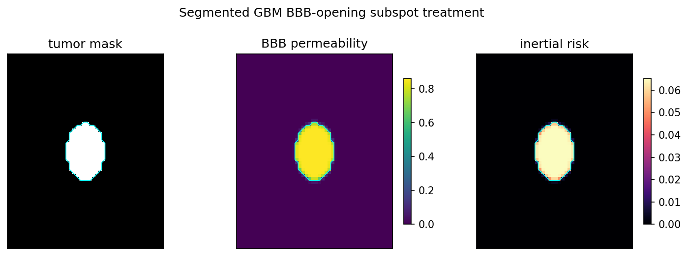

# Chapter 24 — Transcranial HIFU and BBB Treatment Planning

## 24.1 Scope

This chapter extends the histotripsy treatment-planning pattern from Chapter 14
to transcranial focused-ultrasound therapy.  The executable chapter script is
`pykwavers/examples/book/ch25_transcranial_brain_fus_planning.py`.

The chapter has two independent execution contracts:

- HIFU ablation: CT plus registered atlas is sufficient for skull-aware
  targeting, phase correction, attenuation, reflection, thermal dose, and
  cavitation-risk mapping.
- BBB opening: CT plus segmentation is sufficient when the segmentation is
  already defined in CT space. MRI is useful for tumor delineation, but is not
  mandatory for BBB subspot execution once the target mask is in the CT frame.

The workflow covers:

- CT, T1 MRI, and MNI152 atlas ingestion from NIfTI files.  The default CT/MR
  registration pair is RIRE patient 109 when present, because skull acoustics
  and subject MRI must come from the same patient before atlas mapping.
- CT/MRI/MNI registration through the `ritk` Python binding when available.
- Affine CT-to-MRI/MNI resampling before RITK refinement so the validation
  figures compare the same physical CT-space planes.  When NIfTI world
  coordinates are inconsistent across demonstration data, the chapter uses a
  foreground-extent affine initialization and records that method explicitly.
- 1024-element hemispherical focused-bowl array construction.
- Per-element skull-path phase correction.
- Essential-tremor VIM thermal ablation with pressure, MI, Pennes temperature,
  CEM43, and lesion maps.
- Optional segmented planning from CT-space segmentations under
  `data/ct_segmentation_sample`, CT-backed CFB-GBM cases under
  `data/cfb_gbm_sample`, or MRI-backed UPenn-GBM cases under
  `data/upenn_gbm_sample`.
- BBB-opening subspot treatment over the segmented GBM volume using the Chapter
  24 acoustic-dose convention.

The CT-aligned brain target and transducer pose are stored once in
`pykwavers/examples/book/transcranial_planning/scene.py` as
`CANONICAL_BRAIN_SCENE`. Figure 2 phase-correction output, the transcranial brain-imaging nonlinear-reconstruction figure, the 3-D bowl-aperture placement view, and the
skull-adaptive transcranial benchmark resolve their target index from this
scene definition instead of carrying separate centroid or element-count
defaults.

## 24.2 Registration contract

Let `C(x)` be the CT volume, `M(x)` the subject MRI, and `A(x)` the atlas T1.
The registration adapter returns transformed moving images `M'(x)` and `A'(x)`
on the CT lattice.  The verification metric is normalized cross-correlation:

$$
\mathrm{NCC}(u,v) =
\frac{\sum_x (u_x-\bar u)(v_x-\bar v)}
{\sqrt{\sum_x (u_x-\bar u)^2}\sqrt{\sum_x (v_x-\bar v)^2}}.
$$

The chapter records pre- and post-registration NCC, normalized mutual
information, and normalized MSE values in
`docs/book/figures/ch25/metrics.json`.  NCC is retained for same-contrast
diagnostics; normalized mutual information is the primary multimodal metric for
CT/MRI and subject-MRI/MNI-atlas comparison, with MSE reported as a secondary
contrast-dependent error.  Registration is considered executed only when the compiled
`ritk` binding supplies `ritk.io.read_image`, `ritk.Image`, and
`ritk.registration.multires_syn_register`.

The chapter stores internal image data as NumPy `XYZ` arrays.  RITK images expose
NIfTI data through `to_numpy()` in `ZYX` memory order, so the adapter transposes
`XYZ -> ZYX` when constructing `ritk.Image` and `ZYX -> XYZ` when reading RITK
outputs.  This boundary is value-checked against `ritk.io.read_image` for the
MNI atlas so a cubic atlas shape cannot hide an axis-ordering error.

RITK deformable outputs are metric guarded.  A candidate warp is accepted only
when normalized mutual information and the weighted multimodal score do not
regress relative to the affine initialization.  This keeps affine CT/MR or
subject-MRI/MNI alignment as the authoritative output when a cross-contrast SyN
step improves NCC/MSE but worsens NMI.

When a sample CT must be reused for an MRI-space segmentation, the chapter can
resample CT onto the MRI lattice by the NIfTI affine contract:

$$
i_\mathrm{CT} = A_\mathrm{CT}^{-1} A_\mathrm{MRI} i_\mathrm{MRI}.
$$

For the CT/T1/MNI demonstration figure, RIRE MR-T1 is first resampled to the
same-patient RIRE CT lattice.  The MNI atlas is initialized against the
CT-derived intracranial mask intersected with that subject MRI on the CT
lattice, then refined by RITK only if the metric guard accepts the result.  If
the same-patient RIRE MR is absent, the fallback affine searches foreground
extents, axis reflections, and local NMI translation candidates before RITK
refinement, but the output metrics and visual overlay must then be treated as
demonstration-only.  The registration figure shows axial, coronal, and sagittal
planes through the same CT-space target index.

The optional MRI-space GBM fallback produces `fig06_affine_ct_to_mri_qc`, an
MRI/CT contour overlay at the segmentation centroid, plus normalized mutual
information and edge-overlap metrics in `metrics.json`.  The visual overlay is
mandatory evidence because scalar registration metrics cannot prove anatomical
acceptability for cross-subject CT reuse.

The chapter also emits `modality_bridge_manifest.json`.  This manifest records
which modality pairings are present, which simulation scope is valid, and which
external synthesis or reconciliation action is allowed when a modality is
missing.  The executable order is deterministic:

1. Same-patient CT plus CT-space segmentation is authoritative for skull
   acoustics and BBB subspot simulation.
2. Same-patient CT plus MRI-derived segmentation registered into CT space is
   acceptable only after CT/MRI registration QC.
3. MRI-space segmentation is executable for GBM subspot geometry, but it is
   explicitly non-CT-backed until same-patient CT or an accepted synthetic CT
   artifact is supplied.

The ingest contract treats missing MRI channels as missing inputs, not as
aliases to CT or another modality.  CT-space BBB planning requires only real CT
plus a CT-space segmentation.  MRI-space GBM planning requires a real
segmentation plus at least one real in-space MRI volume for spacing and visual
QC; the preferred reference order is FLAIR, T1-Gd, T2, then T1.  This follows
the missing-modality design constraint in Cheng et al. 2025
(`https://huggingface.co/papers/2507.01254`): modality availability is an input
state and processing adapts to the observed set.  TextBraTS
(`https://huggingface.co/papers/2506.16784`) is recorded as a design reference
for optional structured report context; report text can guide segmentation
review, but it cannot replace measured image volumes or expert tumor masks in
this pipeline.

Missing-modality synthesis is an external artifact boundary, not an in-script
fallback.  cWDM
(`https://huggingface.co/papers/2411.17203`) is recorded as the paired 3-D
medical image translation reference for candidate MR-to-CT or missing-MRI
generation.  SLaM-DiMM
(`https://huggingface.co/papers/2509.16019`) is recorded for missing T1w,
T1ce, T2w, or FLAIR MRI synthesis from available brain MRI modalities.  A
generated modality can enter the Chapter 24 pipeline only after it exists as a
real NIfTI volume, is registered to the planning lattice, and has QC metrics
and visual overlays recorded.  Synthetic CT may support research simulation
only after those checks; it is not same-patient measured CT.  Synthetic MRI can
complete MRI segmentation-model inputs, but it never supplies skull acoustic
properties.

The deterministic handoff directory is `bridge/` beside the discovered
segmentation.  The accepted external CT artifact names are
`synthetic_ct_cwdm.nii.gz` or `synthetic_ct.nii.gz`; missing MRI artifacts use
`synthetic_<modality>_slam_dimm.nii.gz`.  These files are inputs to the
existing NIfTI registration/QC path, not generated outputs from the Chapter 24
script.

NV-Segment-CTMR (`https://huggingface.co/nvidia/NV-Segment-CTMR`) is recorded
as a research segmentation reference for CT/MR masks.  It is not treated as an
expert GBM segmentation substitute unless target-label validation and local
review are added.

## 24.3 Skull phase correction

For array element `i`, the corrected delay is:

$$
\tau_i =
\frac{\|r_t-r_i\|}{c_b}
+ L_{s,i}\left(\frac{1}{c_s}-\frac{1}{c_b}\right),
$$

where `r_t` is the target, `r_i` is the element position, `c_b` is brain sound
speed, `c_s` is skull sound speed, and `L_{s,i}` is the skull-mask intersection
length along the ray.  The transmitted phase is:

$$
\phi_i = -2\pi f_0(\tau_i-\bar\tau).
$$

This is the same invariant used by the test suite: if skull path lengths vary,
the phase distribution must vary.

The executable implementation now evaluates the ray through the CT volume, not
only a binary skull mask.  Each sampled CT voxel maps HU to density, sound
speed, and attenuation.  Per-element amplitude is reduced by:

$$
A_i =
\prod_k \sqrt{\frac{4 Z_{k-1}Z_k}{(Z_{k-1}+Z_k)^2}}
\exp\left(-\int_i \alpha(x)\,ds\right),
$$

where `Z = rho c` is acoustic impedance and `alpha` is the CT-derived
attenuation coefficient.  The field synthesis weights each element by `A_i`,
so skull reflection/transmission and absorption affect the Rayleigh sum rather
than being reported as metadata only.

## 24.4 Essential-tremor ablation

The chapter targets the VIM-like atlas coordinate `(14, -18, 2)` mm after that
coordinate has been mapped once into the CT brain-support fraction recorded in
`CANONICAL_BRAIN_SCENE`. All CT-lattice figure and simulation paths resolve the
target index from that fraction, then solve a Rayleigh superposition field
normalized to the prescribed focal pressure.
Thermal response uses the Pennes bioheat model:

$$
\rho C_p \frac{\partial T}{\partial t}
= k\nabla^2T - w\rho C_p(T-T_0) + 2\alpha I.
$$

CEM43 dose uses the Chapter 16 (Safety and Dosimetry §16.5) convention and the lesion mask is the brain-only
region satisfying `CEM43 >= 240 min`.

Generated figures (`docs/book/figures/ch25/`):



*Figure 24.1. CT / T1-MRI / MNI152 registration (§24.2): axial, coronal, and sagittal planes through the same CT-space target index after the metric-guarded RITK alignment.*



*Figure 24.2. Transcranial bowl phase correction (§24.3): per-element skull-ray delays $\tau_i$ and CT-derived amplitude transmission $A_i$ on the 1024-element hemispherical array.*



*Figure 24.3. VIM thermal ablation (§24.4): the skull-corrected Rayleigh field, Pennes temperature rise, and the CEM43 ≥ 240 min lesion mask at the atlas VIM coordinate.*

## 24.5 GBM BBB-opening subspots

When a GBM case is present, the chapter computes a subspot lattice inside the
segmented tumor and evaluates the BBB acoustic dose.  The default executable
sample is UPenn-GBM `sub-002`, which provides co-registered T1, T1-Gd, T2,
FLAIR, and expert tumor segmentation NIfTI volumes.  CFB-GBM remains the
preferred CT-backed dataset when a local case is available.

When a CT-space segmentation is present, subspot planning uses the CT voxel
spacing and the same CT skull acoustic map used for phase/attenuation
correction.  The CT-space fixture does not populate fake T1-Gd or FLAIR paths.
UPenn-GBM remains an MRI-segmentation fallback only; it is not used to infer
skull acoustics.

$$
D(x) = \sum_j \mathrm{MI}^2 t_\mathrm{on}
\exp\left(-\frac{\|x-x_j\|^2}{2\sigma_f^2}\right).
$$

Permeability follows the Chapter 23 Hill model:

$$
P(D) = \frac{D^n}{D_{50}^n + D^n}.
$$

The planned BBB opening mask is `P(D) >= 0.5` inside the tumor segmentation.
The chapter also reports inertial-cavitation risk from the BBB safety window
boundary at `MI = 0.55`.

Generated optional figures (`docs/book/figures/ch25/`, when a GBM case is present):



*Figure 24.4. GBM subspot plan (§24.5): the focal subspot lattice tiled inside the expert tumor segmentation, sized to the diffraction-limited focus.*



*Figure 24.5. GBM BBB opening (§24.5): the acoustic-dose field $D(x)$ and the Hill-model permeability mask $P(D)\ge 0.5$ inside the tumor, with the MI = 0.55 inertial-cavitation boundary.*

The following are emitted only under specific fallbacks and are not produced by a
default run: `fig06_affine_ct_to_mri_qc` (when a sample CT is affine-resampled to an
MRI-space GBM case) and `modality_bridge_manifest.json` (the CT/MRI/segmentation
readiness and synthesis-boundary contract).

## 24.6 Skull-adaptive transcranial benchmark

The skull-adaptive benchmark is the Chapter 24 execution path that maps the
TFUScapes/DeepTFUS paper structure into the existing kwavers brain pipeline
without creating a parallel demonstration.  The reference paper is
`https://huggingface.co/papers/2505.12998`, with manuscript text at
`https://ar5iv.org/pdf/2505.12998` and the public project record at
`https://github.com/camma-public/tfuscapes`.

Already implemented before the benchmark:

- RITK-backed CT NIfTI ingestion and CT/MRI/MNI registration/QC.
- Hemispherical focused-bowl transducer construction.
- CT HU to density, sound speed, impedance, attenuation, phase delay, and
  amplitude transmission.
- Rayleigh pressure synthesis from skull-corrected per-element phases and
  amplitudes.
- Brain and skull masks derived from the CT planning lattice.

The benchmark adds `run_skull_adaptive_transcranial_benchmark` in `kwavers`
and `pykwavers.run_transcranial_skull_adaptive_benchmark_from_ritk_ct` in the
Python package.  The pipeline:

1. Loads the measured CT into the existing planning lattice.
2. Builds the CT skull and brain masks with the same HU and intracranial
   conventions used by Chapter 24.
3. Computes per-element skull rays, phase correction, amplitude transmission,
   and skull path length.
4. Selects the active skull-aware aperture from the existing hemispherical
   focused bowl by choosing the best-transmission skull-hit anchor and retaining
   elements inside a configured aperture diameter.
5. Computes a skull-aware reference pressure field and an uncorrected baseline
   pressure field over the same active aperture.
6. Reports structural paper metrics: relative L2 pressure error, focal-position
   error in meters, and maximum-pressure error in percent.

The executable Python call is:

```python
import pykwavers as kw
from transcranial_planning.scene import CANONICAL_BRAIN_SCENE

result = kw.run_transcranial_skull_adaptive_benchmark_from_ritk_ct(
    "data/rire_patient_109/patient_109_ct.nii.gz",
    grid_size=32,
    **CANONICAL_BRAIN_SCENE.benchmark_pykwavers_kwargs(),
)
print(result["metrics"])
print(result["placement"])
```

The result contains the reference and baseline pressure volumes, active element
mask, element coordinates, phase delays, skull path lengths, amplitude weights,
the resolved `target_fraction_xyz`, placement metadata, metric values, and a
`paper_structural_comparison` record.
The helper `pykwavers/examples/book/transcranial_planning/benchmark.py` converts
that result into a JSON-serializable summary for book scripts and notebooks.

Structural comparison to the paper:

| Paper structure | kwavers benchmark structure | Current boundary |
| --- | --- | --- |
| TFUScapes stores pseudo-CT volumes, transducer coordinates, and k-Wave pressure maps. | The benchmark stores measured CT HU, active bowl-aperture coordinates, skull-aware Rayleigh pressure, and uncorrected baseline pressure. | The pressure backend is the existing deterministic Chapter 24 Rayleigh path, not the paper's full k-Wave simulation backend. |
| Transducer placement adapts to subject skull geometry. | Aperture placement is CT-conditioned by skull-ray transmission, skull path length, and the existing focused-bowl geometry. | The aperture is selected deterministically from the bowl-transducer source rather than through a learned pose model. |
| DeepTFUS is trained and evaluated with relative L2, focal-position error, and max-pressure error. | The benchmark reports the same metric families for corrected reference versus uncorrected baseline. | Neural surrogate training, TFUScapes-scale dataset generation, and DeepTFUS inference are not implemented in this path. |

## 24.7 Verification

The focused tests are:

- `pykwavers/tests/test_transcranial_planning.py`
- `pykwavers/tests/test_book_therapy_chapters.py`

The tests assert the canonical brain scene target index, 1024-element geometry,
skull-dependent phase correction,
thermal lesion formation, segmented tumor subspot coverage, BBB permeability
inside the tumor, modality-bridge readiness boundaries, and
manifest/documentation coverage for Chapters 24 and 25.  The benchmark-specific
checks assert CT-conditioned aperture selection, nonzero skull interaction,
reference pressure normalization, relative-L2/focal-position/max-pressure
metric calculation, and Python summary preservation of TFUScapes-aligned metric
names.
