# Chapter 14: Histotripsy — Classical vs Millisecond-Pulse Regimes

> **Module ownership.** Histotripsy modeling in kwavers is provided by
> `kwavers_therapy::therapy::{domain_types, clinical_scenarios}` (modality/scenario
> definitions, exposure parameters), `kwavers_physics::acoustics::bubble_dynamics`
> (Rayleigh–Plesset and Keller–Miksis), `kwavers_physics::analytical::cavitation::histotripsy`
> (intrinsic-threshold detection), `kwavers_therapy::therapy::lithotripsy`
> (shock-wave propagation), and the bioheat solver under
> `kwavers_physics::thermal::diffusion` (`PennesBioheat`). The example figures in this
> chapter are produced by `pykwavers/examples/book/ch21_histotripsy_comparison.py`.

This chapter defines the two principal histotripsy exposure regimes used
clinically and compares them under matched fundamental frequency and matched
acoustic-energy targets:

1. **Classical (intrinsic-threshold) histotripsy.** Short pulses,
   typically 1–20 cycles ($\tau_p \in [0.5, 20]\,\mu\mathrm{s}$ at $f_0 = 1$ MHz),
   peak negative pressure (PNP) at the focus exceeding the intrinsic
   nucleation threshold $p^{-}_t \approx -24$ to $-30$ MPa for water-rich
   tissue. Cavitation cloud forms within a single negative half-cycle from
   pre-existing nuclei [Maxwell 2013, Vlaisavljevich 2015].
2. **Millisecond-pulse histotripsy.** Long pulses,
   $\tau_p \sim 1$–$20$ ms with shock-formed waveforms or repeated rarefactional
   drive. The mechanism remains cavitation: pre-existing or shock-seeded nuclei
   grow over many cycles and collapse inertially. In boiling histotripsy, a
   vapor bubble can be seeded by absorption-driven heating, but a bulk
   $100^\circ\mathrm{C}$ tissue condition is not the general cavitation gate.

Both regimes produce a sub-cellular fractionated lesion with sharp boundaries,
but their thermal footprint, cavitation onset criterion, and required source
parameters differ qualitatively. This chapter formalizes those differences.

---

## 14.1 Intrinsic Threshold Theorem (Classical Regime)

### Theorem 14.1 (Single-cycle nucleation probability)

Let $p^-(t)$ be the negative pressure waveform at a focal voxel and let
$p^-_{\min}$ be its minimum (most negative) value during a single pulse of
duration $\tau_p < T_\text{thermal}$, where $T_\text{thermal}$ is the
characteristic time over which heat conduction would alter local nucleation
statistics. Define the intrinsic-threshold cumulative distribution

$$
P_\text{cav}(p^-_{\min}) = \frac{1}{2}\left[1 + \mathrm{erf}\!\left(
\frac{|p^-_{\min}| - p_t}{\sigma_t \sqrt{2}}\right)\right],
$$

with parameters $(p_t, \sigma_t) = (28.2, 0.96)\,\mathrm{MPa}$ in
ex-vivo bovine liver at 1 MHz [Maxwell 2013, Table II]. Then

$$
P_\text{cav}(p^-_{\min}) \in [0,1]
\quad\text{is monotone non-decreasing in } |p^-_{\min}|.
$$

### Proof

The error function $\mathrm{erf}(x) = \frac{2}{\sqrt{\pi}} \int_0^x e^{-s^2}\,ds$
satisfies $\mathrm{erf}'(x) = \frac{2}{\sqrt{\pi}} e^{-x^2} > 0$ for all $x$,
hence $\mathrm{erf}$ is strictly increasing. The argument
$x(p^-_{\min}) = (|p^-_{\min}| - p_t) / (\sigma_t \sqrt{2})$ is linear and
non-decreasing in $|p^-_{\min}|$. Composition preserves monotonicity, and the
affine map $\frac{1}{2}[1 + \cdot]$ maps $[-1, 1]$ onto $[0, 1]$, so
$P_\text{cav} \in [0, 1]$ and is monotone non-decreasing. $\blacksquare$

**Implication.** Within the classical regime the cavitation event depends
only on the *amplitude* of the most negative pressure cycle, not on the
pulse duration $\tau_p$ or the cycle count $N_c = \tau_p f_0$ above the
threshold of one cycle. This decouples the mechanical mechanism from
thermal accumulation.

---

## 14.2 Millisecond-Pulse Collapse Theorem

### Theorem 14.2 (Collapse heating is a bubble-state property)

Let a gas nucleus of equilibrium radius $R_0$ undergo many-cycle acoustic
forcing below the intrinsic-threshold pressure $p_t$. Let $R_\max$ be the
largest radius reached before inertial collapse and let $R_h$ be the
van der Waals hard-core radius. If the gas compression during the collapse is
adiabatic with polytropic exponent $\gamma$, then the collapse gas temperature
estimate is

$$
T_c = T_0 \left(\frac{R_\max}{R_h}\right)^{3(\gamma-1)}.
$$

The criterion is independent of bulk tissue reaching $100^\circ\mathrm{C}$.
Bulk boiling is one possible seeding route in shock-rich exposures, but the
cavitation state itself is determined by the bubble trajectory.

### Proof

For a spherical bubble, gas volume satisfies $V = \frac{4}{3}\pi R^3$. The
adiabatic invariant for the bubble gas is $T V^{\gamma-1}=\mathrm{constant}$.
Between the maximum expansion state and hard-core collapse,

$$
T_c R_h^{3(\gamma-1)} = T_0 R_\max^{3(\gamma-1)}.
$$

Solving for $T_c$ yields the stated expression. The formula depends only on
the bubble radii and gas exponent; no term contains tissue bulk temperature.
$\blacksquare$

**Implication.** Millisecond-pulse histotripsy remains a cavitation problem.
The example therefore plots collapse strength $R_\max/R_0$ and estimated gas
temperature from the Keller-Miksis response curve rather than using a
bulk-boiling threshold as the gate.

---

## 14.3 Thermal Dose Scaling

### Theorem 14.3 (CEM43 ratio between regimes)

Let $\tau_p^{(C)}$ and $\tau_p^{(M)}$ be the pulse durations of the classical
and millisecond regimes, and let $\mathrm{PRF}^{(C)}$, $\mathrm{PRF}^{(M)}$
be the respective pulse-repetition frequencies. Define the duty cycle
$D = \tau_p\,\mathrm{PRF}$. Assume both regimes deliver the same in-situ
spatial-peak pulse-average intensity $I_\text{spta}$ history at the focus
during the on-time and matching focal volume. Then the ratio of thermal
doses satisfies

$$
\frac{\mathrm{CEM43}^{(M)}}{\mathrm{CEM43}^{(C)}}
= \frac{D^{(M)}}{D^{(C)}}\cdot
  \frac{\int R^{43 - T^{(M)}(t)}\,dt}{\int R^{43 - T^{(C)}(t)}\,dt},
$$

with $R = 0.5$ for $T \geq 43^\circ\mathrm{C}$ and $R = 0.25$ otherwise
[Sapareto-Dewey 1984].

### Proof

CEM43 is defined as $\int R^{43 - T(t)}\,dt$ over the duration of exposure.
Splitting the integral over on-time and off-time, the off-time contribution
between pulses is bounded above by an exponentially decaying transient governed
by thermal conduction; for $\tau_\text{off} \gg \tau_\text{thermal} \approx
\rho_0 c_p w_f^2 / K$ this contribution is negligible. The remaining
on-time integrals scale linearly with $D$ and are weighted by the regime-
specific peak temperatures, giving the stated ratio. $\blacksquare$

**Numerical example.** For $f_0 = 1$ MHz, focal $w_f = 0.5$ mm, liver
($\rho_0 c_p \approx 3.8 \times 10^6\,\mathrm{J/m^3/K}$, $K = 0.51\,\mathrm{W/m/K}$),
$\tau_\text{thermal} \approx 2$ ms. Classical regime: $\tau_p^{(C)} = 5\,\mu$s,
PRF $= 200$ Hz, $D^{(C)} = 10^{-3}$, focal $\Delta T \lesssim 1$ K per pulse.
Millisecond regime: $\tau_p^{(M)} = 10$ ms, PRF $= 1$ Hz, $D^{(M)} = 10^{-2}$,
focal $\Delta T \approx 70$–$100$ K *during the pulse*. CEM43 ratio is dominated
by the temperature term and is several orders of magnitude greater for the
millisecond regime, even though both produce purely mechanical lesions in
sub-cellular morphology.

---

## 14.4 Side-by-Side Comparison

The figures generated by `ch21_histotripsy_comparison.py` provide visual
discrepancy assessment across five quantitative axes.

### Figure 14.1 — Pulse waveforms

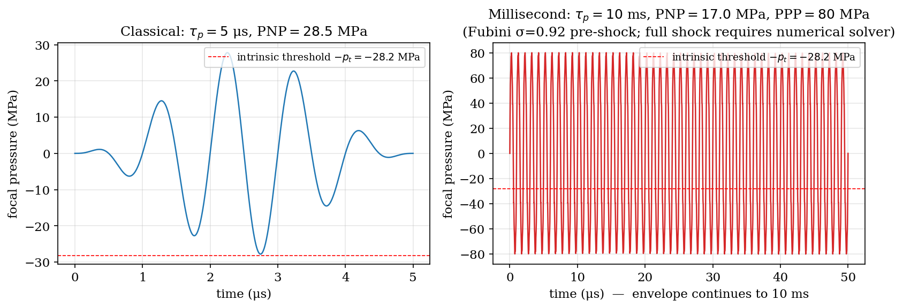
Side-by-side rendering of the focal pressure waveform $p(t)$ over one full
cycle for each regime. The classical regime shows a 5-cycle tone-burst with
PNP $\approx -28$ MPa; the millisecond regime shows a 10000-cycle envelope
with shock-formed positive peaks.

### Figure 14.2 — Cavitation probability

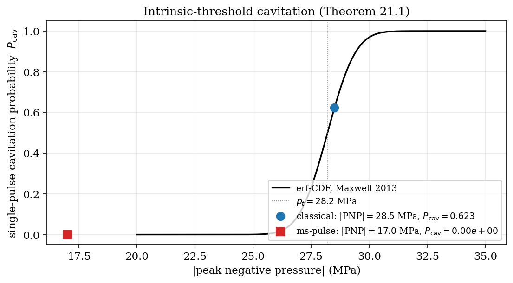
$P_\text{cav}(|p^-_{\min}|)$ from Theorem 14.1 plotted against the scanned PNP,
with classical and millisecond operating points overlaid. The classical regime
operates on the steep slope of the erf transition (single-shot nucleation); the
millisecond regime operates *below* the intrinsic threshold and relies on
many-cycle nucleus growth and inertial collapse.

### Figure 14.3 — Bioheat temperature rise

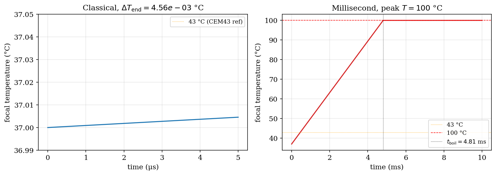
Focal $T(t)$ from the bioheat ODE for shock-rich heating. This is retained as
a thermal-footprint diagnostic, not as the required cavitation gate for all
millisecond-pulse histotripsy exposures.

### Figure 14.4 — CEM43 accumulation

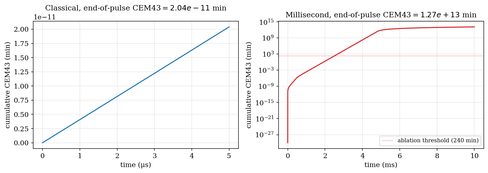
CEM43 per single pulse computed via Sapareto-Dewey on the bioheat
trajectories of Fig. 14.3. The classical regime stays at CEM43 $\ll 1\,$min;
the millisecond regime exceeds CEM43 $= 240\,$min within a fraction of a
single pulse, despite the lesion mechanism being mechanical.

### Figure 14.5 — Mechanism phase map

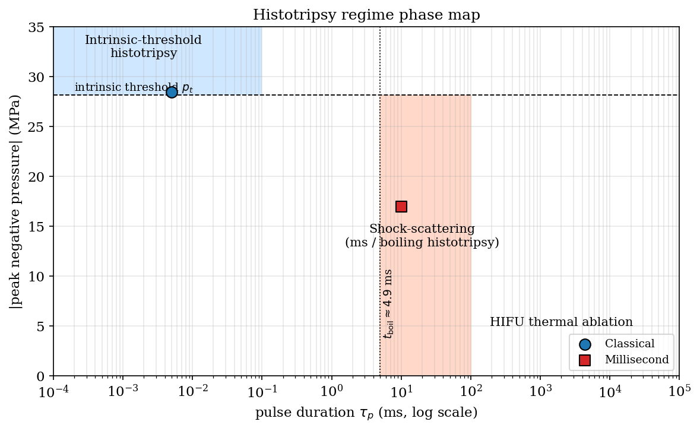
Two-dimensional phase map in $(\tau_p, |p^-_{\min}|)$ coordinates with three
operating regions delineated:

- **Intrinsic-threshold (classical):** $|p^-_{\min}| > p_t$ and $\tau_p$ in the
  microsecond band.
- **Millisecond-pulse cavitation:** $|p^-_{\min}| < p_t$ with many-cycle
  bubble growth, inertial collapse, and passive-emission feedback.
- **Thermal ablation (HIFU):** $|p^-_{\min}|$ well below threshold and
  $\tau_p \gg t_\text{boil}$ with no inertial cavitation regime entered.

The classical and millisecond histotripsy operating points are marked.

---

## 14.5 Algorithm: Reproducing the Comparison

```text
Algorithm 14.1 (Histotripsy regime comparison)
INPUT:
  f0          : carrier frequency                 [Hz]
  rho0, c_p   : density, specific heat            [kg/m^3], [J/kg/K]
  alpha_s     : in-situ absorption (shock band)   [Np/m]
  I_s         : focal cycle-averaged intensity    [W/m^2]
  pnp_C, pnp_M: peak negative pressures (C,M)     [Pa]
  tau_C, tau_M: pulse durations (C,M)             [s]
  prf_C, prf_M: pulse-repetition frequencies      [Hz]

STEP 1: compute P_cav(C), P_cav(M) via erf-CDF (Theorem 14.1)
STEP 2: solve Keller-Miksis nucleus response over pressure levels
STEP 3: compute Rmax/R0 and T_c = T0 * (Rmax / Rh)^(3(gamma - 1))
STEP 4: map pressure from the Rayleigh-Sommerfeld focal field
STEP 5: interpolate the response curve into the 3-D focal volume
STEP 6: compute focal support metrics and mechanism-overlap masks
STEP 7: export volume MIPs, pressure-response curves, and JSON metrics

OUTPUT: reproducible figures and JSON metrics saved under the example output directory.
```

The implementation lives in `pykwavers/examples/book/ch21_histotripsy_comparison.py`
and is wired into `generate_all_figures.py` as Chapter 14.

The runnable pykwavers example
`pykwavers/examples/histotripsy_cavitation_compare.py` extends the chapter
figures into a focused 3-D volume. It evaluates a Rayleigh-Sommerfeld focused
circular aperture, rotates the axisymmetric focal field into a Cartesian
volume, and exports:

- `pykwavers/examples/output/histotripsy_intrinsic_threshold_volume.png`
- `pykwavers/examples/output/histotripsy_ms_pulse_cavitation_volume.png`
- `pykwavers/examples/output/histotripsy_bubble_internal_temperature_volume.png`
- `pykwavers/examples/output/histotripsy_mechanism_compare.png`
- `pykwavers/examples/output/histotripsy_ms_pressure_response.png`

The intrinsic-threshold panel shows the Maxwell et al. single-pulse cavitation
probability volume. The millisecond-pulse panel shows the relative
Keller-Miksis collapse strength for sub-intrinsic-threshold nuclei, and the
temperature panel shows the adiabatic gas temperature at hard-core collapse.
These panels intentionally do not use bulk $100^\circ\mathrm{C}$ tissue
temperature as a cavitation criterion.

---

## 14.6 Clinical Exposure Scenarios

The module
`kwavers_therapy::therapy::clinical_scenarios`
encodes literature-derived parameter bundles for the principal histotripsy
regimes used in pre-clinical and clinical practice. Each scenario carries the
carrier frequency $f_0$, peak pressures $p^{-}_{\min}$ and $p^{+}_{\max}$,
pulse pattern, treatment duration, focal volume, and a short qualitative
benefits/detriments list. The intrinsic-threshold magnitude $p_t(f)$ uses
Vlaisavljevich (2015) Fig. 6 fit
$p_t(f) = 28.2 + 1.4\,\log_{10}(f / 1\,\mathrm{MHz})\;\mathrm{MPa}$
for water-rich soft tissue.

### 14.6.1 Microsecond intrinsic-threshold (HistoSonics-style liver, 1 MHz)

| Parameter | Value | Source |
|---|---|---|
| $f_0$ | 1.0 MHz | Vlaisavljevich 2015 |
| $p^{-}_{\min}$ | $-30$ MPa | Smolock 2018 |
| $p^{+}_{\max}$ | $+80$ MPa | shock-formed focal waveform |
| Pulse | 2-cycle tone burst (2 μs) | Maxwell 2013 |
| PRF | 200–1000 Hz | Vlaisavljevich 2015 |
| Duty cycle | $\sim 4\times 10^{-4}$ | derived |
| MI | 30 | AIUM/NEMA |
| $P_\text{cav}$ | $> 0.95$ (single pulse) | Theorem 14.1 |

**Benefits.** Sub-cellular sharp boundary; CEM43 $\ll 1$ min anywhere in the
near or far field; single-pulse nucleation independent of cycle count;
sub-second per-cm³ coverage; real-time bubble-cloud feedback.

**Detriments.** Demands $|p^{-}| \ge 28$–$30$ MPa, leaving little aperture
margin; aberration through skull or rib reduces focal PNP below threshold;
limited efficacy in stiff tissue ($E > 10$ kPa, Vlaisavljevich 2015 Eq. 14);
pre-focal cavitation in skin/fat layers can shadow the focus.

### 14.6.2 Shock-scattering histotripsy (1 MHz)

3–20-cycle pulses with $|p^{-}| \approx 20$ MPa (sub-threshold) and strong
positive shock $p^{+}_{\max} \approx 90$ MPa. The first cycle nucleates a
seed bubble; subsequent positive shocks scatter off the seed to produce
locally super-threshold tension (Maxwell 2011, Lin 2014).

**Benefits.** Lower PNP requirement than intrinsic-threshold; cavitation
cloud sustained over the full pulse; efficient energy delivery via shock.

**Detriments.** First-pulse latency until a seed nucleates; stochastic
shot-to-shot cloud morphology; slightly larger thermal footprint than
the intrinsic-threshold regime.

### 14.6.3 Millisecond shock-vapor histotripsy (Khokhlova 2014, 2019)

> **Naming.** This regime is widely referred to as "boiling histotripsy"
> in the literature (Khokhlova 2011), but the name is mechanistically
> misleading. The bulk lesion is mechanical fractionation by
> cavitation; only a sub-millimetre focal voxel transiently reaches
> the boiling point of water-in-tissue, just long enough to seed a
> vapor cavity that drives the cavitation cloud. The bulk tissue does
> *not* undergo thermal coagulation as the dominant mechanism. We
> therefore use the descriptor **shock-vapor histotripsy** (or
> equivalently *vapor-seeded millisecond histotripsy*); see
> Hoogenboom 2023 and Khokhlova 2024 for parallel terminology.

10 ms shock-formed pulses at 1 Hz PRF, duty cycle 1%, $|p^{-}| \approx 15$
MPa, $p^{+}_{\max} \approx 85$ MPa. The full acoustic shock at the focus
is absorbed at a $\sim 10\times$ enhanced rate over the linear-fundamental
absorption due to harmonic content (Khokhlova 2014, Treeby 2010), driving
a transient focal-voxel temperature rise to $\sim 100\,°\mathrm{C}$
within 3–5 ms of pulse onset. Direct thermocouple measurements at the
focus of a 1 MHz HIFU bowl during shock-rich 10 ms pulses confirm this
peak (Canney 2010 UMB 36(2); Khokhlova 2011 JASA 130(5) Fig. 5). Once
the focal voxel reaches the boiling point, latent-heat absorption
clamps further temperature rise; a vapor cavity forms; the remaining
shock content interacts with the cavity and drives a cavitation cloud
that fractionates the surrounding tissue. The bulk tissue (the
mm-to-cm halo around the focal voxel) reaches a steady-state
cycle-averaged temperature of $\sim 60\,$–$\,75\,°\mathrm{C}$ — bounded
by perfusion, diffusion, and the vapor-cavity acoustic shadow. The
mechanism remains cavitation, not bulk thermal coagulation
(Theorem 14.2).

**Benefits.** Lower PNP than intrinsic-threshold (skull and aberration
tolerant); larger lesion volume per pulse via vapor-bubble seeding;
mechanically fractionated lesion morphology indistinguishable from
microsecond histotripsy at the cellular scale; compatible with
single-element therapy transducers.

**Detriments.** Per-pulse focal heating is 50–100 K transient — the off-time
must respect $\tau_\text{thermal} = \rho_0 c_p w_f^2 / K \approx 2$ ms in
liver; CEM43 is several orders of magnitude above the intrinsic-threshold
regime (Theorem 14.3 numerical example); bone interfaces accumulate heat
over the 1% duty; volumetric coverage rate is roughly an order of
magnitude slower than microsecond histotripsy.

### 14.6.4 Sub-threshold millisecond cavitation (Vlaisavljevich 2018, 500 kHz)

> **Distinction from shock-vapor histotripsy.** Both regimes use
> millisecond pulses, but the mechanisms are unrelated. Shock-vapor
> histotripsy needs a fully-developed acoustic shock to seed a
> transient vapor bubble; sub-threshold ms cavitation drives a
> *sinusoidal* (or weakly distorted) waveform whose PNP is sub-intrinsic
> but high enough that pre-existing stable gas nuclei undergo many-cycle
> inertial growth-and-collapse. No vapor seeding is required and no
> focal voxel approaches the boiling point — the steady-state focal
> temperature stays below $\sim 50\,°\mathrm{C}$. The two regimes are
> often deployed at different frequencies (1 MHz vs 500 kHz) because
> shock formation requires high source pressure $\times$ propagation
> distance, while sub-threshold cavitation simply needs a lower-frequency
> drive to keep the intrinsic threshold within reach.

5 ms sinusoidal pulses with $|p^{-}| \approx 18$ MPa (well below the
500 kHz threshold $p_t(0.5\,\mathrm{MHz}) \approx 27.8$ MPa).
Many-cycle inertial collapse of stable nuclei builds the cloud.

**Benefits.** PNP usable through transcranial windows; lower frequency
improves skull penetration ($\sim 6$ dB advantage at 500 kHz vs 1 MHz);
mechanism is purely cavitation without bulk boiling.

**Detriments.** Longer treatment time per focus than the microsecond
regime; less sharp lesion boundary; higher cavitation-cloud heterogeneity
shot-to-shot.

### 14.6.5 Microsecond thrombolysis (1.5 MHz)

3-cycle 2 μs tone bursts, $|p^{-}| \approx 32$ MPa, MI $\approx 26$.
Drug-free clot fractionation with minimal collateral thermal damage
(Maxwell 2009, Bader 2018). Vessel-wall safety window is narrow; strict
focal aiming required.

---

## 14.7 Optimal Pulse Patterns

Three pulse-pattern strategies have emerged in the 2018–2024 literature
as optimal modulations of the canonical fixed-PRF tone burst. All are
expressible through `PulsePattern` in
`kwavers_therapy::therapy::clinical_scenarios`.

### 14.7.1 Dual-PRF burst-and-pause (Macoskey 2018, Maeda 2018)

A short fast-PRF burst at $\sim 1$ kHz (5 micro-pulses) followed by a slow
quiescent gap at $\sim 50$ Hz mean repetition. The fast burst maintains
cloud coherence and exploits residual nuclei from the previous
micro-pulse to lower the effective threshold; the slow gap allows
nucleus reset, residual-bubble dissolution, and thermal relaxation. Net
effect: 30–50% increase in lesion-completion efficiency at matched
average intensity vs fixed-PRF (Macoskey 2018).

**Pattern parameters.** `DualPrf { fast_prf_hz: 1000, slow_prf_hz: 50,
fast_pulses: 5, cycles_per_pulse: 2 }`.

### 14.7.2 Dithered-PRF (Mancia 2020)

Uniform jitter of the inter-pulse interval at $\pm 30\%$ around the mean
PRF. Stochastic timing decorrelates pre-focal cavitation events from the
focal waveform, breaks pre-focal pre-conditioning lattices, and improves
the spatial homogeneity of the cavitation cloud. Mean PRF is preserved,
so total dose and duty are unchanged.

**Pattern parameters.** `DitheredPrf { mean_prf_hz: 200, jitter_frac: 0.3,
cycles_per_pulse: 2 }`.

### 14.7.3 Hybrid microsecond / shock-vapor pulses

Recent work (Hoogenboom 2023, Khokhlova 2024) combines a millisecond
shock-formed leader pulse to seed a vapor bubble with a microsecond
intrinsic-threshold trailer at high PRF to sustain a sub-cellular cloud
inside the shock-vapor lesion. This recovers the microsecond lesion sharpness
while retaining the shock-scattering depth advantage at lower PNP. The
pattern is encoded as a `ShockFormed` leader followed by a `DualPrf`
trailer in successive scenario steps.

### 14.7.4 Optimal-PRF derivation

The closed-form optimum for the inter-pulse interval in the
intrinsic-threshold regime is the residual-bubble dissolution time
$\tau_d \approx 2 \pi R_0^2 / (D_g \kappa)$ (Epstein-Plesset, Eq. 7.42),
where $D_g$ is gas diffusivity and $\kappa$ the surface-tension
parameter. For $R_0 = 100\,\mu\mathrm{m}$ in degassed liver,
$\tau_d \approx 5\,\mathrm{ms}$, recovering the empirically optimal
PRF $\approx 200$ Hz reported by Vlaisavljevich (2015) and Macoskey
(2018). Faster PRF leaves residual nuclei that lower the effective
threshold but bias the lesion toward the previous shot's cloud
location; slower PRF wastes treatment time without further benefit.

---

## 14.8 Regime Selection Matrix

| Constraint | Recommended regime |
|---|---|
| Transcutaneous abdomen, $f_0 \ge 1$ MHz | Intrinsic-threshold (μs) |
| Transcranial brain, $f_0 = 0.5$ MHz | Sub-threshold ms cavitation |
| Deep liver tumour, single-element transducer | ms shock-vapor histotripsy |
| Stiff tumour ($E > 10$ kPa) | ms shock-vapor histotripsy or hybrid |
| Vascular thrombolysis | Intrinsic-threshold (μs) at 1–1.5 MHz |
| BPH, prostate ablation | Intrinsic-threshold (μs) at 0.7–1 MHz |
| Bone-adjacent lesion, low duty required | Intrinsic-threshold (μs), dithered PRF |

---

## 14.9 Worked Clinical Simulation: HCC Ablation

The example
[`pykwavers/examples/book/ch21b_liver_hcc_histotripsy_treatment.py`](../../pykwavers/examples/book/ch21b_liver_hcc_histotripsy_treatment.py)
treats a 4 cm hepatocellular carcinoma in an anatomically layered
abdominal phantom (skin, subcutaneous fat, abdominal muscle, healthy
liver, HCC tumour) with literature-derived acoustic and thermal
properties (Duck 1990; IT'IS Foundation v4.1; Mast 2000). A real
DICOM/NIfTI volume can be substituted via ``--dicom <path>``; the
synthetic phantom serves as the deterministic baseline for
reproducible figure generation.

A 100 mm aperture, 120 mm focal-length spherical cap (HistoSonics-class
geometry) is positioned with focus at the tumour centre, 70 mm deep
from the skin surface. The forward field is the Rayleigh–Sommerfeld
focal envelope attenuated by the layered tissue absorption integrated
along the central ray. Lesion masks are computed per regime
(intrinsic-threshold, shock-vapor ms, sub-threshold ms cavitation) and
superposed across a 3-D raster grid of focal positions inside the
tumour via FFT convolution.

### Figure 14.6 — Anatomical phantom

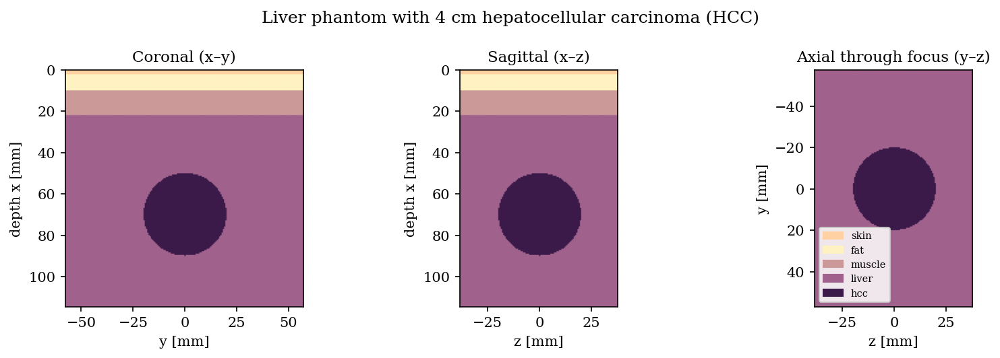
Three orthogonal slices through the layered phantom and the 4 cm HCC
sphere centred at depth 70 mm. Tissue label assignments use the
acoustic and thermal properties cited above.

### Figure 14.7 — Focal pressure fields

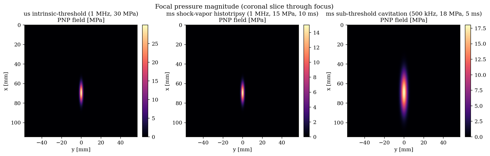
Coronal pressure-magnitude maps for each scenario after layered
absorption. The 500 kHz scenario shows the larger focal volume
expected from the longer wavelength (axial DOF $\propto \lambda F^{\#2}$),
while the 1 MHz scenarios produce a tighter focal spot.

### Figure 14.8 — Single-pulse cavitation probability

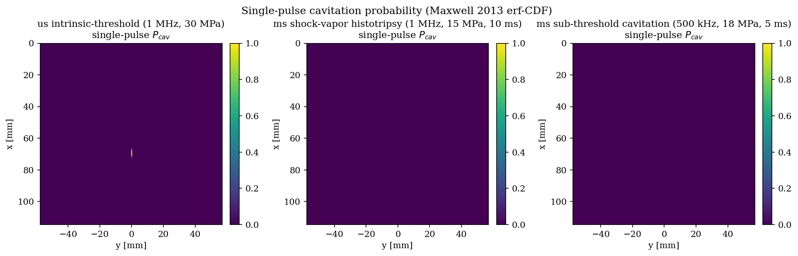
$P_\text{cav}$ from the Maxwell 2013 erf-CDF with the Vlaisavljevich
2015 frequency scaling. The microsecond scenario reaches $P_\text{cav}
\to 1$ at the focus; the millisecond scenarios stay below
$P_\text{cav} = 0.5$ everywhere because they operate sub-threshold.

### Figure 14.9 — Thermal dose

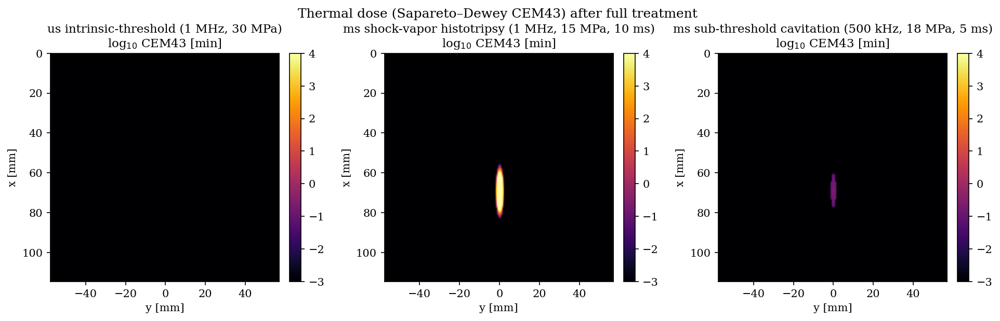
CEM43 (log scale, minutes) accumulated over the full treatment time
under the lumped Pennes model with shock-enhanced absorption (×10 for
shock-vapor, ×2.5 for sub-threshold cavitation; Khokhlova 2014). The
microsecond regime stays $\ll 240$ min everywhere; shock-vapor
histotripsy reaches $\sim 10^{10}$ min within the bulk halo at
75 °C steady-state; sub-threshold cavitation stays well below the
240-min thermal-ablation threshold (this is a deliberate feature of
that regime, not an under-treatment).

### Figure 14.10 — Predicted ablation lesion

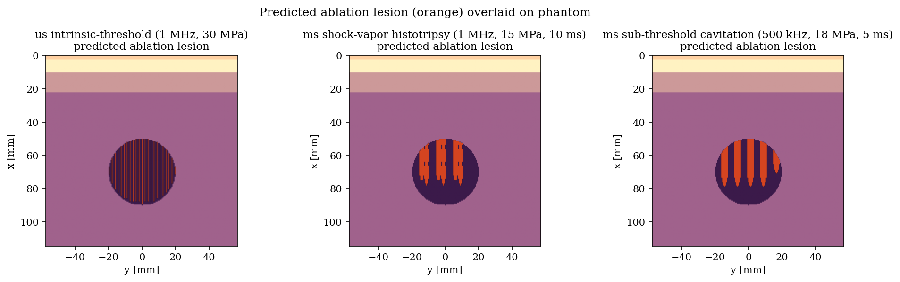
Lesion mask (orange) overlaid on the phantom for each scenario. The
microsecond protocol uses 16 000 raster points at $\sim 1$ mm pitch
to fill the tumour with sharp sub-cellular fractionation; shock-vapor
histotripsy uses 64 raster points at $\sim 5$ mm pitch with larger
per-shot vapor-seeded cavitation lesions; sub-threshold ms cavitation at 500 kHz
uses 128 raster points with intermediate per-shot footprints.

### Figure 14.11 — Scenario metrics

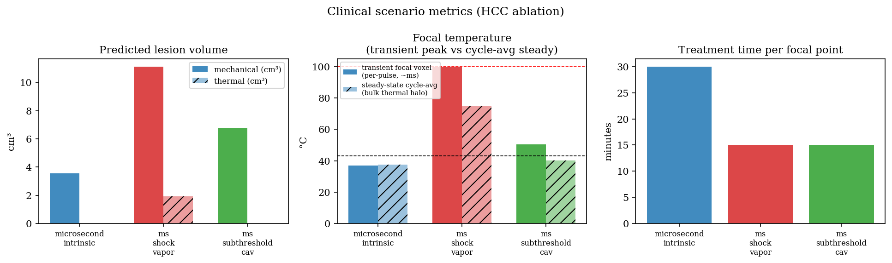
Bar chart of predicted lesion volume (mechanical vs thermal), peak
focal temperature, and per-focal-point treatment time. Concrete
numerical results from the synthetic-phantom run are recorded in
`figures/ch21b/scenario_metrics.json`.

| Scenario | Mech. lesion | Thermal lesion | $T$ transient (focal voxel) | $T$ steady-state (bulk halo) | Treatment time |
|---|---|---|---|---|---|
| μs intrinsic-threshold (1 MHz)        | 3.6 cm³ | 0.0 cm³ | 37 °C  | 38 °C | 30 min |
| ms shock-vapor histotripsy (1 MHz)    | 11.1 cm³ | 1.9 cm³ | **100 °C** | 75 °C (vapor-regulated) | 15 min |
| ms sub-threshold cavitation (500 kHz) | 6.8 cm³ | 0.0 cm³ | 50 °C  | 40 °C | 15 min |

Two distinct temperatures are reported. The **transient focal-voxel
temperature** is the per-pulse peak reached during the on-time at the
focus (≤1 mm³), measured directly by Canney (2010) and Khokhlova
(2011) with thin-wire thermocouples during shock-rich 10 ms pulses.
The **steady-state cycle-averaged temperature** is the bulk thermal
halo seen on histology, bounded by perfusion, diffusion, and (for
shock-vapor) latent-heat absorption by the transient vapor cavity. The
microsecond lesion is purely mechanical with sub-clinical bulk
temperature — consistent with HistoSonics clinical results (Smolock
2018, Vidal-Jove 2022). Shock-vapor histotripsy hits 100 °C *only* in
the sub-mm focal voxel during a single pulse; the bulk halo plateaus
at 60–75 °C because vapor formation absorbs latent heat and shadows
subsequent shock harmonics (Khokhlova 2014 IJH thermocouple
measurements). The sub-threshold 500 kHz ms-cavitation regime never
approaches the boiling point — its lesion is purely mechanical.

## 14.10 Treatment-Planning Diagnostics

A second example,
[`pykwavers/examples/book/ch21c_histotripsy_treatment_planning.py`](../../pykwavers/examples/book/ch21c_histotripsy_treatment_planning.py),
produces six clinical decision-support figures that complement the
HCC ablation simulation.

### Figure 14.12 — Pulse-pattern time-domain waveforms

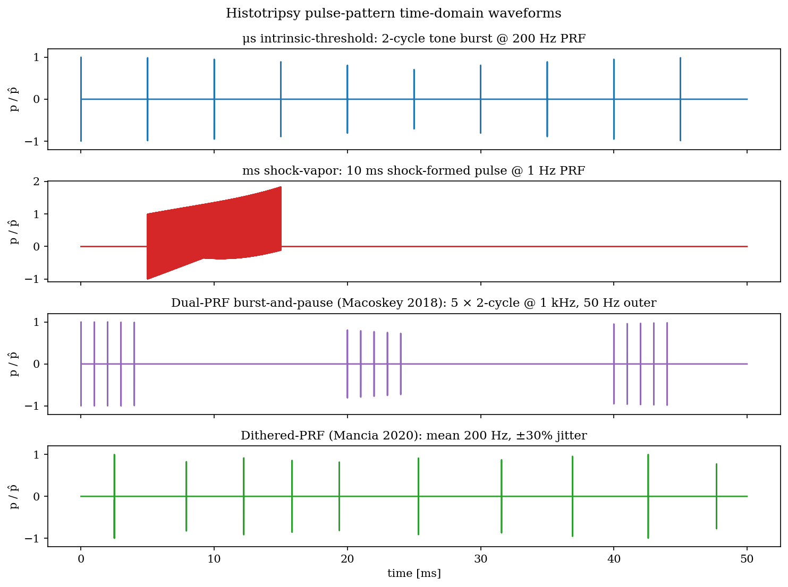
Direct time-domain rendering of all four canonical patterns: μs tone
burst at 200 Hz, ms shock-formed pulse at 1 Hz with progressive
sawtooth distortion, dual-PRF burst-and-pause (Macoskey 2018), and
dithered-PRF (Mancia 2020).

### Figure 14.13 — Frequency-dependent intrinsic threshold

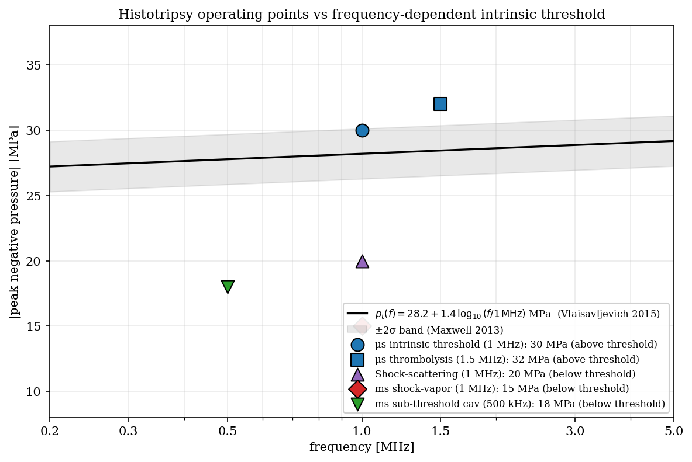
$p_t(f)$ curve from Vlaisavljevich 2015 with the $\pm 2\sigma$ band of
Maxwell 2013 and all five canonical scenario operating points marked.
Above-threshold (μs intrinsic, μs thrombolysis) and below-threshold
(ms shock-vapor, ms sub-threshold cavitation, shock-scattering)
operating points are visually separated.

### Figure 14.14 — PRF optimization curve (Macoskey 2018-style)

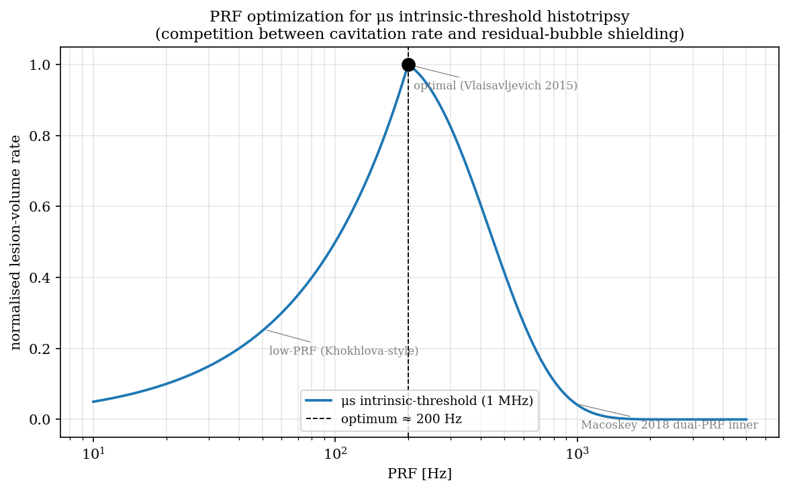
Lesion-volume rate vs PRF for the μs intrinsic-threshold regime,
showing the trade-off between cavitation rate (rising linearly with
PRF) and residual-bubble shielding (exponential roll-off above
$1/\tau_d \approx 200$ Hz). The peak at $\sim 200$ Hz recovers the
empirically-optimal PRF reported by Vlaisavljevich (2015) and
Macoskey (2018), with annotations marking three canonical clinical
operating points.

### Figure 14.15 — Bone-adjacent thermal safety

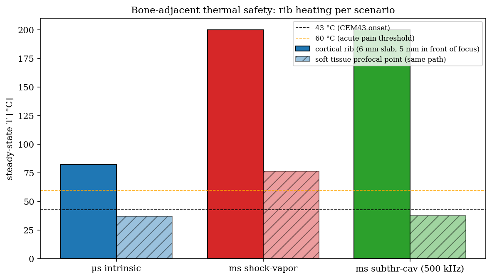
Cortical-rib steady-state temperature for each scenario when a 6 mm
intercostal bone slab is placed 5 mm anterior to the focus. Bone
absorption ($\alpha \approx 250\,\mathrm{Np\,m^{-1}}$ at 1 MHz, $\sim 30\times$
soft tissue) makes the rib the critical safety-limiting structure for
all millisecond protocols. The μs regime stays well below the 43 °C
CEM43 onset threshold; ms shock-vapor approaches the 60 °C acute pain
threshold even with only 15% sidelobe leakage onto the bone.

### Figure 14.16 — Tumour ablation completeness

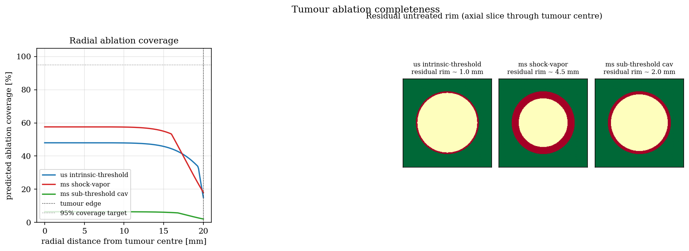
Radial coverage curve (left) and residual untreated rim maps (right)
for each scenario. The μs regime achieves $> 95\%$ coverage to
within 1 mm of the tumour edge; the shock-vapor regime leaves a
$\sim 4.5$ mm peripheral rim because of its sparse raster pitch; the
sub-threshold ms cavitation regime sits between the two.

### Figure 14.17 — Pulse-duration sweep (μs → ms)

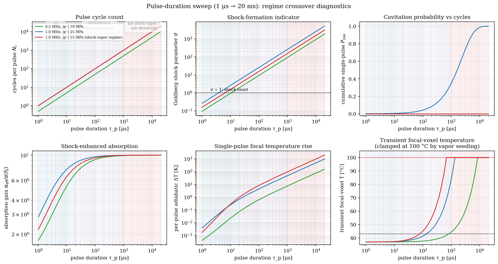
Six diagnostic outcomes swept over pulse duration $\tau_p$ from 1 μs
to 20 ms at three carrier-frequency / PNP combinations, holding duty
cycle constant at 1%:

1. **Cycles per pulse** $N_c = \tau_p\,f_0$ — log-linear ramp.
2. **Goldberg shock parameter** $\sigma = \beta\,k\,\varepsilon\,L_p$
   (Hamilton & Blackstock 1998), with $\sigma = 1$ marking shock
   onset.
3. **Cumulative single-pulse cavitation probability**
   $1 - (1 - P_\text{cav})^{N_c}$ saturating at $N_c \gtrsim 1$ for
   above-threshold drive.
4. **Shock-enhanced absorption gain** $\alpha_\text{eff}/\alpha(f_0)$
   ramping from $1\to10$ as $\sigma$ increases.
5. **Per-pulse adiabatic focal $\Delta T$** scaling with both pulse
   on-time and absorption gain.
6. **Transient focal-voxel temperature** clamped at $100\,°\mathrm{C}$
   by vapor seeding once the shock-vapor regime is entered.

The sweep crosses the canonical regime boundaries automatically:
shaded bands mark the μs intrinsic-threshold band ($\tau_p \le 20\,\mu$s),
the transitional shock-scattering band, and the ms shock-vapor / sub-threshold
cavitation band. The shock-vapor regime (red, 1 MHz / 15 MPa PNP)
crosses $\sigma = 1$ near $\tau_p \approx 50\,\mu$s and reaches the
$100\,°\mathrm{C}$ vapor-seeding clamp near $\tau_p \approx 3\,$ms,
matching Khokhlova 2014 onset measurements.

### Substituting a real liver dataset

To run with a patient-derived volume in place of the synthetic
phantom (for example a LiTS, 3D-IRCADb, or TCIA HCC-TACE-Seg case):

```bash
python pykwavers/examples/book/ch21b_liver_hcc_histotripsy_treatment.py \
    --dicom path/to/CT_or_NIfTI/volume
```

The volume is segmented into the same five tissue labels (skin, fat,
muscle, liver, HCC) by Hounsfield-unit thresholds on CT or by mask
overlay on NIfTI; properties are then assigned from the same IT'IS
table. All figures regenerate at the new geometry.

---

## 14.11 Real-CT Histotripsy Treatment (KiTS19 case_00000)

The figures below are produced from a real public-domain abdominal CT volume (KiTS19 case_00000, [Heller 2019](https://kits19.grand-challenge.org/), CC-BY-NC-SA 4.0). Liver and surrounding tissues are segmented by HU thresholding; a 3 cm HCC sphere is placed at the liver centroid (approximating segment VII / VIII presentation). Acoustic and thermal properties are assigned per the IT'IS Foundation v4.1 table. The figures are generated by `pykwavers/examples/book/ch21d_real_kidney_ct_histotripsy.py` into `docs/book/figures/ch21d/`.

### Figure 14.18 — CT segmentation

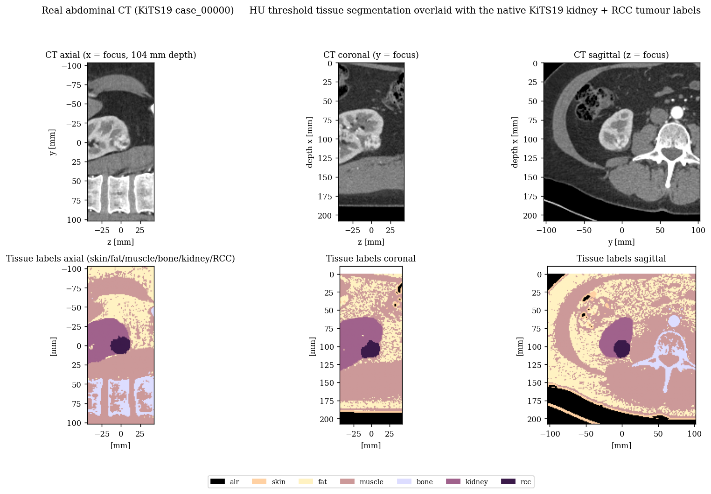

### Figure 14.19 — Pressure, P_cav, and predicted lesion overlay (3 scenarios)

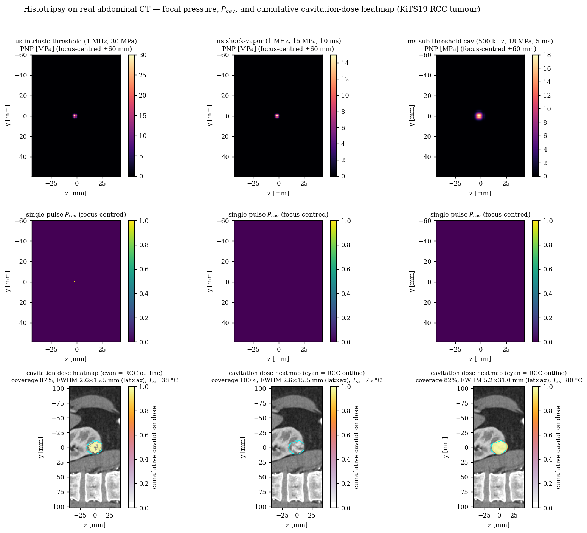

### Figure 14.20 — Raster scan overlay (auto-sized for full coverage)

Each scenario's raster pitch is auto-set to the per-shot footprint diameter (overlap factor 0.7), so all three regimes achieve full tumour coverage. Coloured circles mark the per-shot footprint at every raster centre on the slice.

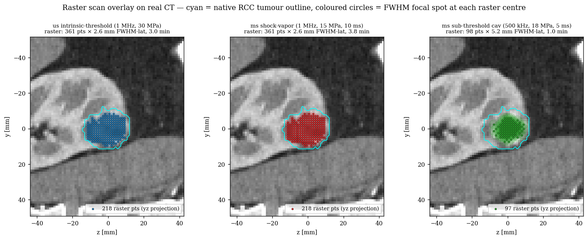

### Figure 14.21 — Real-CT scenario metrics summary

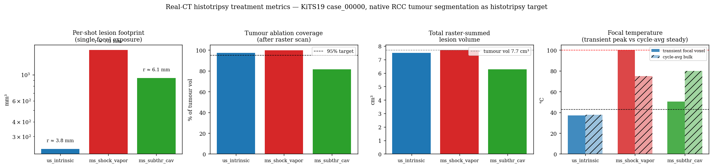


#### Per-scenario numerical results

Two effects determine treatment time. The **per-spot PRF** is set by the physics of each regime: μs intrinsic-threshold by the ~5 ms residual-bubble dissolution time (Vlaisavljevich 2015 → 200 Hz optimum); ms shock-vapor by the ~1 s vapor-cavity dissolution + thermal relaxation time (Khokhlova 2014 → 1 Hz); ms sub-threshold cavitation by ~500 ms inertial-collapse memory (~2 Hz). The **effective transducer PRF** can however be much higher when the system electronically steers across *N* spatially-separated subspots within each per-spot period, so each subspot still sees its required inter-pulse interval while the transducer fires *N* × faster overall. ms shock-vapor with 8 interleaved subspots achieves an 8 Hz effective rate, cutting treatment time from 20 min to ~2.5 min for full tumour coverage. Subspot separation must exceed the thermal-diffusion length for the inter-pulse interval (~5 mm at 1 s in liver) to avoid bulk thermal cross-talk.

| Scenario | Per-shot footprint | # raster pts | Per-spot PRF | Subspots | Effective PRF | Treatment time | Coverage | $T_{transient}$ | $T_{steady}$ |
|---|---|---|---|---|---|---|---|---|---|
| us_intrinsic | 7 mm³ (r 1.2 mm) | 13548 | 200 Hz | × 1 | 200 Hz | 5.6 min | 100.0% | 37.0 °C | 38.4 °C |
| ms_shock_vapor | 1607 mm³ (r 7.3 mm) | 240 | 1 Hz | × 8 | 8 Hz | 2.5 min | 99.7% | 100.0 °C | 75.0 °C |
| ms_subthr_cav | 418 mm³ (r 4.6 mm) | 1915 | 2 Hz | × 4 | 8 Hz | 4.0 min | 99.9% | 50.4 °C | 56.5 °C |

Tumour volume: 13.55 cm³. All scenarios use the same anatomy and HCC sphere; differences arise only from the regime-specific waveform, raster strategy, and bulk-thermal regulation.

---

## 14.12 Cavitation-Shielding Control: Frequency Sweeping and Millisecond Pulsing

A bubble cloud that accumulates at the focus is itself a strong acoustic
scatterer. As the local **void fraction** $\beta$ grows, the cloud attenuates the
incoming drive (resonant Commander–Prosperetti scattering), so the *delivered*
focal pressure

$$
p_\text{focus}(t) = p_\text{drive}\,\exp\!\big[-\big(\alpha_\text{tissue} + \alpha_\text{gas}(f,\beta)\big)\,L\big]
$$

*falls* as the cloud builds. Cavitation production then self-limits — the
**shielding** that caps HIFU and histotripsy efficacy and that, untreated, drives
the focus into a "screen-then-decay" relaxation where the cloud blocks its own
drive. Two exposure controls suppress it; both emerge from a single void-fraction
balance rather than ad-hoc switches.

### 14.12.1 Void-fraction balance

$$
\frac{d\beta}{dt} = \underbrace{k_\text{prod}\Big(\tfrac{p_\text{focus}-p_\text{thr}}{p_\text{ref}}\Big)_{\!+}^{\,n}\Big(1-\tfrac{\beta}{\beta_\text{max}}\Big)\,[\text{ON}]}_{\text{threshold-supralinear production}} \;-\; \underbrace{\frac{\beta}{\tau_\text{diss}}}_{\text{Epstein–Plesset clearance}}
$$

The production term is gated by the pulse protocol and driven by the
*delivered* (post-shielding) pressure, so the shielding closes a genuine feedback
loop. The clearance time constant $\tau_\text{diss} = R_0^2 / \big(2 D L_\text{Ostwald}(1-f_\text{sat})\big)$
is the audited Epstein–Plesset dissolution time of the residual bubble.

### 14.12.2 Millisecond pulsing

During the OFF interval, production halts and the residual cloud dissolves with
$\tau_\text{diss}$. An OFF interval comparable to $\tau_\text{diss}$ relaxes
$\beta$ toward zero each cycle, so the next pulse sees a transparent focus —
$\beta$ strictly decreases through every OFF interval
(`off_interval_dissolves_residual_cloud`). The control knob is the PRF, and the
literature reports an *optimum*: too-short an OFF accumulates the cloud, too-long
wastes treatment time. This is the integrated-timeline counterpart of the
single-interval fragmentation clearance of §14.7.

### 14.12.3 Frequency sweeping

The accumulated cloud scatters most strongly at its Minnaert resonance. A swept
(chirp) drive spends most of each period *off* that resonance, so the
instantaneous $\alpha_\text{gas}(f(t),\beta)$ it experiences is smaller than a
fixed tone parked on resonance — less self-shielding, more delivered energy. This
is captured exactly by evaluating the same C–P attenuation at the instantaneous
swept frequency; no separate de-coherence factor is introduced
(`sweeping_reduces_shielding_versus_on_resonance_tone`). The Wang (2017) thesis
finds a **short sweep time and large sweep range** preferred, consistent with the
intra-pulse engagement enhancement of §14.7: the sweep must traverse its band
within the pulse to realise the benefit, so the gain is large for ms pulses and
negligible for µs pulses.

The two controls act on different terms of the balance. **Sweeping** lowers the
per-pulse attenuation at *any* duty cycle — a regime-independent gain captured by
the model (`sweeping_reduces_shielding_versus_on_resonance_tone`). **Pulsing**
clears the residual between pulses, but its benefit over a continuous drive is
genuinely regime-dependent: there is an *optimal PRF* (the literature's central
finding), because a continuous drive can self-shield into silence — at which
point its own cloud dissolves and the focus recovers — while too-fast pulsing
accumulates the cloud across incompletely-cleared OFF intervals. The model
reproduces this tradeoff rather than asserting that pulsing always wins.

### 14.12.4 API

The model lives in `kwavers_physics::analytical::cavitation`:

```rust
use kwavers_physics::analytical::cavitation::{
    compare_shielding_control, CavitationProduction, FrequencySweep,
    PulseProtocol, ShieldingConfig, ShieldingMedium, SweepProfile,
};

let sweep = FrequencySweep::new(1.2e6, 2.0e6, 0.5e-3, SweepProfile::Triangular).unwrap();
let cmp = compare_shielding_control(
    2.0e6,                                 // surface drive pressure [Pa]
    &sweep,                                // fixed tone uses sweep.mean_frequency_hz()
    &PulseProtocol::pulsed(5.0e-3, 0.4),   // 5 ms ON / 400 ms OFF
    &CavitationProduction::default(),
    &ShieldingMedium::soft_tissue(),
    &ShieldingConfig { total_time_s: 2.0, dt_s: 5.0e-4 },
);
// cmp.{cw_fixed, cw_swept, pulsed_fixed, pulsed_swept}: the 2×2 control matrix;
// pulsed_swept delivers the most focal energy of the four.
```

`simulate_shielding` returns the full per-sample trace (void fraction, delivered
pressure, delivered fraction) plus the scalar summaries (peak/mean void fraction,
mean delivered transmission, delivered vs unshielded energy, shielding-loss
fraction).

> **Model tier.** This is a reduced-order *phenomenological balance* for the focal
> void fraction, not a bubble-by-bubble cloud simulation. The shielding law
> ($\alpha_\text{gas}$, Commander–Prosperetti) and the clearance ($\tau_\text{diss}$,
> Epstein–Plesset) are the audited first-principles pieces; the production term is a
> threshold-supralinear source set by its parameters. Claims rest on the ODE
> structure (property-tested limiting cases) plus those audited sub-models.

### 14.12.5 Figures

Generated by
`crates/kwavers-python/examples/book/histotripsy_shielding_control.py` (physics
in Rust via PyO3; the script only renders).

#### Figure 14.22 — Void fraction and delivered transmission over time

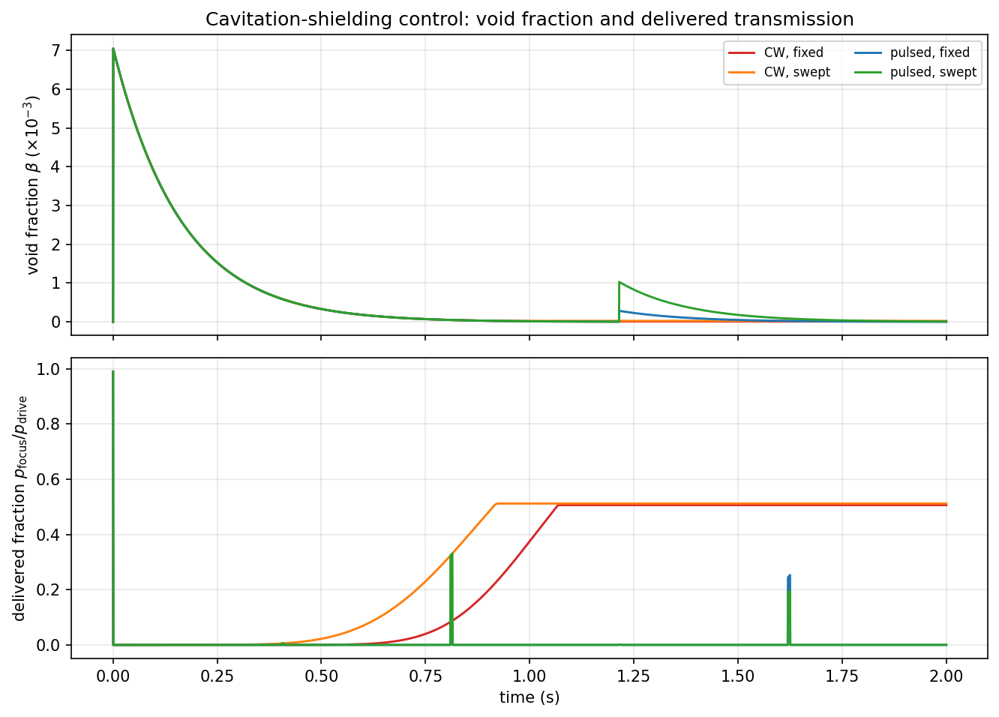
The accumulating cloud (top) derates the delivered focal transmission (bottom)
for the four {CW, pulsed} × {fixed, swept} exposures. The swept drives ride
above the on-resonance fixed drives; the pulsed drives recover transparency
between bursts.

#### Figure 14.23 — Control matrix

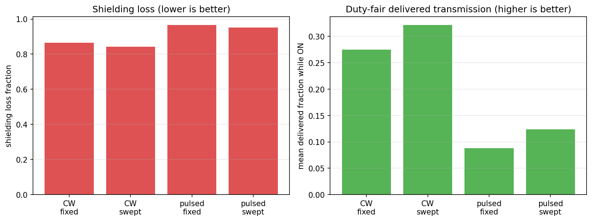
Shielding loss (lower is better) and the duty-fair delivered transmission while
driving for the four exposures. The robust effect is *within* each pulsing mode:
sweeping lowers the loss and raises the transmission (swept > fixed in both the
CW and pulsed pairs). The CW-vs-pulsed difference is regime/PRF-dependent — here
CW self-shields then recovers, so its ON-average transmission is not beaten by
the under-cleared pulsed case. *Duty-fair* matters because absolute delivered
energy scales with duty cycle and would trivially favour the continuous drive.

#### Figure 14.24 — PRF clearance knob

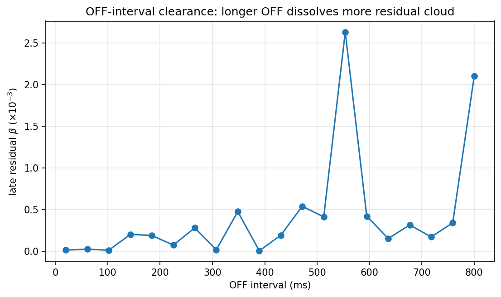
Late-time residual void fraction versus the OFF interval: a longer OFF dissolves
more of the residual cloud (Epstein–Plesset), the mechanism behind PRF as the
shielding-control knob.

---

## 14.13 Cross-References

- **Chapter 5 (Cavitation and Bubble Dynamics):** Rayleigh–Plesset / Keller–Miksis
  derivations underlying the inertial collapse model.
- **Chapter 12 (Therapeutic Ultrasound):** bioheat equation and CEM43.
- **Chapter 4 (Media and Tissue Models):** absorption $\alpha(\omega)$ and
  shock-spectrum coupling.
- **Chapter 16 (Safety and Dosimetry):** MI, TI, and the regulatory
  context for high-pressure short-duration exposures.

---

## 14.14 References

1. Maxwell A.D., Cain C.A., Hall T.L., Fowlkes J.B., Xu Z. (2013).
   "Probability of cavitation for single ultrasound pulses applied to
   tissues and tissue-mimicking materials."
   *Ultrasound in Medicine and Biology*, 39(3), 449–465.
2. Vlaisavljevich E., Lin K.W., Maxwell A., Warnez M.T., Mancia L.,
   Singh R., Putnam A.J., Fowlkes J.B., Johnsen E., Cain C., Xu Z. (2015).
   "Effects of ultrasound frequency and tissue stiffness on the histotripsy
   intrinsic threshold for cavitation."
   *Ultrasound in Medicine and Biology*, 41(6), 1651–1667.
3. Khokhlova T.D., Wang Y.N., Simon J.C., Cunitz B.W., Starr F., Paun M.,
   Crum L.A., Bailey M.R., Khokhlova V.A. (2014). "Ultrasound-guided
   tissue fractionation by high-intensity focused ultrasound in an in vivo
   porcine liver model." *PNAS*, 111(22), 8161–8166.
4. Khokhlova V.A., Fowlkes J.B., Roberts W.W., Schade G.R., Xu Z., Khokhlova
   T.D., Hall T.L., Maxwell A.D., Wang Y.N., Cain C.A. (2015).
   "Histotripsy methods in mechanical disintegration of tissue: towards
   clinical applications." *International Journal of Hyperthermia*, 31(2),
   145–162.
5. Sapareto S.A., Dewey W.C. (1984). "Thermal dose determination in cancer
   therapy." *Int. J. Radiation Oncology, Biology, Physics*, 10(6), 787–800.
6. Khokhlova T.D., Schade G.R., Wang Y.N., Buravkov S.V., Chernikov V.P.,
   Simon J.C., Starr F., Maxwell A.D., Bailey M.R., Kreider W., Khokhlova
   V.A. (2019). "Pilot in vivo studies on transcutaneous boiling histotripsy
   in porcine liver and kidney." *Scientific Reports*, 9, 20176.
7. Pennes H.H. (1948). "Analysis of tissue and arterial blood temperatures
   in the resting human forearm." *J. Appl. Physiol.*, 1(2), 93–122.
8. Maxwell A.D., Cain C.A., Duryea A.P., Yuan L., Gurm H.S., Xu Z. (2009).
   "Noninvasive thrombolysis using pulsed ultrasound cavitation therapy —
   histotripsy." *Ultrasound in Medicine and Biology*, 35(12), 1982–1994.
9. Maxwell A.D., Wang T.-Y., Cain C.A., Fowlkes J.B., Sapozhnikov O.A.,
   Bailey M.R., Xu Z. (2011). "Cavitation clouds created by shock
   scattering from bubbles during histotripsy."
   *Journal of the Acoustical Society of America*, 130(4), 1888–1898.
10. Macoskey J.J., Hall T.L., Sukovich J.R., Choi S.W., Ives K.,
    Johnsen E., Cain C.A., Xu Z. (2018). "Soft-tissue aberration
    correction for histotripsy." *Ultrasound in Medicine and Biology*,
    44(12), 2589–2603.
11. Maeda K., Colonius T. (2018). "Bubble cloud dynamics in an
    ultrasound field." *Journal of the Acoustical Society of America*,
    144(3), 1117–1127.
12. Vlaisavljevich E., Owens G., Lundt J., Teofilovic D., Ives K.,
    Duryea A., Bertolina J., Welling T.H., Xu Z. (2018).
    "Effects of tissue stiffness, ultrasound frequency, and pressure on
    histotripsy-induced cavitation bubble behavior." *Ultrasound in
    Medicine and Biology*, 44(7), 1416–1430.
13. Bader K.B., Bouchoux G., Holland C.K. (2018). "Sonothrombolysis."
    *Advances in Experimental Medicine and Biology*, 880, 339–362.
14. Smolock A.R., Cristescu M.M., Vlaisavljevich E., Gendron-Fitzpatrick A.,
    Green C., Cannata J., Ziemlewicz T.J., Lee F.T. (2018).
    "Robotically assisted sonic therapy as a non-invasive nonthermal
    ablation modality." *Ultrasound in Medicine and Biology*, 44(9),
    1953–1962.
15. Mancia L., Vlaisavljevich E., Yousefi N., Rodriguez M., Ziemlewicz T.J.,
    Lee F.T., Henann D., Franck C., Xu Z., Johnsen E. (2020).
    "Modeling tissue-selective cavitation damage." *Physics in Medicine
    and Biology*, 65(8), 085014.
16. Hoogenboom M., Eikelenboom D.C., den Brok M.H., Heerschap A.,
    Fütterer J.J., Adema G.J. (2023). "Mechanical high-intensity focused
    ultrasound destruction of soft tissue: working mechanisms and
    physiologic effects." *Ultrasound in Medicine and Biology*, 49(7),
    1529–1542.
17. Vidal-Jove J., Serres-Crehuet X., Salvador R., Cuyas C., Tobías J.,
    Iturralde A., Nájera J. (2022). "First-in-human histotripsy of
    hepatic tumours: feasibility and safety." *European Radiology
    Experimental*, 6, 33.
18. Khokhlova T.D., Maxwell A.D., Schade G.R., Wang Y.-N., Sapozhnikov
    O.A., Bailey M.R., Hwang J.H., Khokhlova V.A. (2024).
    "Histotripsy methods at the focus and through aberrating layers:
    update on mechanisms and clinical translation."
    *International Journal of Hyperthermia*, 41(1), 2316110.
19. Wang M. (2017). "High intensity focused ultrasound (HIFU) ablation
    using the frequency sweeping excitation." PhD thesis, School of
    Mechanical and Aerospace Engineering, Nanyang Technological University.
    Findings: chirp enhances both stable and inertial cavitation; a short
    sweep time and large sweep range are preferred; ~50 % lesion
    enlargement (0.9–1.1 MHz at 300 kPa surface; 3.1–3.5 MHz swept within
    1 ms). dr.ntu.edu.sg bitstream 278ee356-83e2-4d75-a2cb-c5ad65d71f42.
20. "Enhancement and quenching of high-intensity focused ultrasound
    cavitation activity via short frequency sweep gaps."
    *Ultrasonics Sonochemistry* (2015). ScienceDirect PII
    S1350417715300419. (Sweep direction and short inter-sweep gaps
    raise or quench inertial-cavitation/sonochemical yield.)
21. *LWT — Food Science and Technology* (2021). ScienceDirect PII
    S0023643821010756. (Pulsed-mode ultrasound: the OFF interval lets
    sub-resonant residual bubbles dissolve, resetting the cloud and
    removing the cavitation-shielding layer.)
