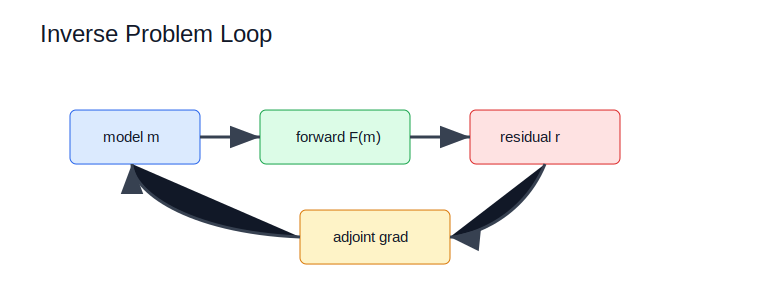

# Inverse Problems and PINNs



## Scope

Inverse problems cover time reversal, FWI, RTM, SIRT, elastography inversion, PINNs, meta-learning, uncertainty, and registration. Code ownership maps to `kwavers::solver::inverse`, `kwavers::analysis::ml`, `ritk`, and Burn-backed PINN modules.

## Theorem: Least-Squares Adjoint Source

For objective

```text
J(m) = 1/2 ||d_syn(m) - d_obs||_2^2,
```

the data-space derivative is the residual

```text
partial J / partial d_syn = d_syn - d_obs.
```

### Proof Sketch

Differentiate the quadratic form `1/2 r^T r` with respect to `r`, then apply `r = d_syn - d_obs`.

## Algorithm: Inverse Solver Acceptance

1. Define the forward model and observed data contract.
2. Define objective scaling and residual sign.
3. Validate gradients by finite differences where feasible.
4. Validate reconstruction or parameter recovery on analytical or published phantoms.

## Implementation Targets

- Keep forward, adjoint, gradient, optimizer, and diagnostics in separate modules.
- Preserve residual sign and time reversal as shared core utilities.
- Avoid PINN losses that assert existence without inspecting residual values.

## Research Anchors

- k-Wave and k-wave-python examples for forward-model parity: http://www.k-wave.org/
- GPU wavefield inversion context: https://arxiv.org/abs/2410.18429
