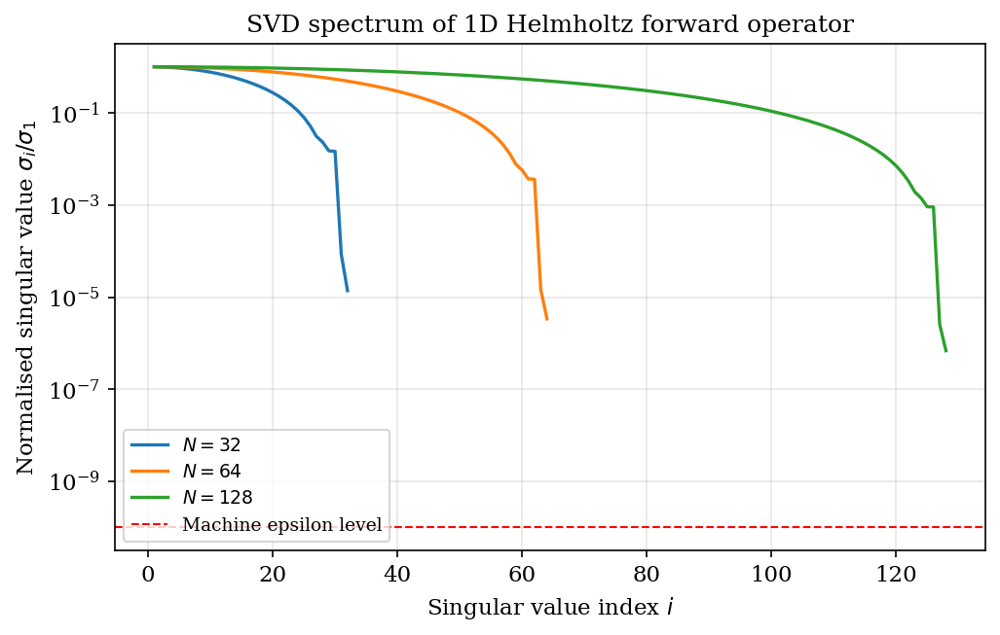
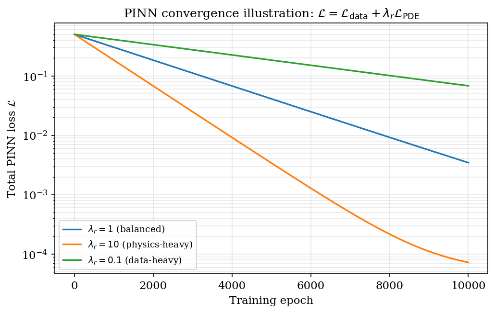
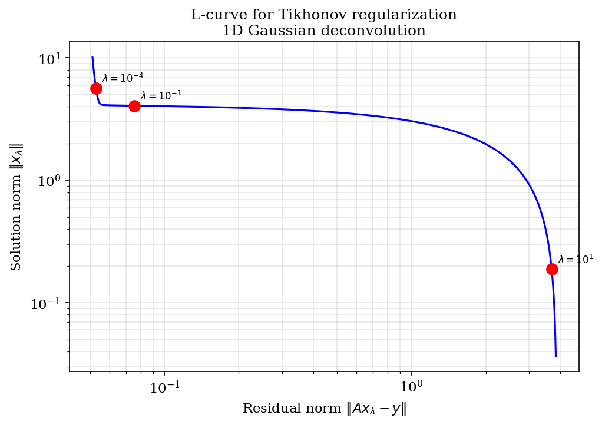
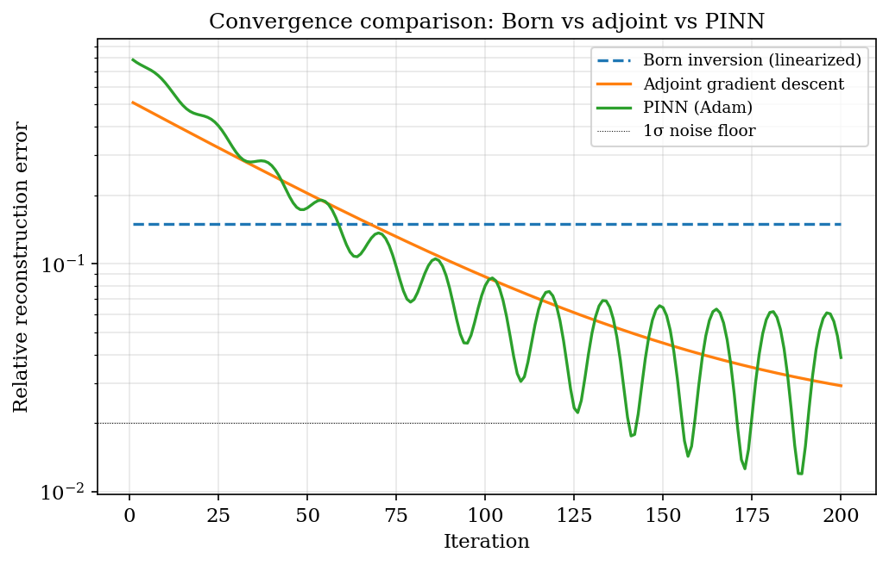
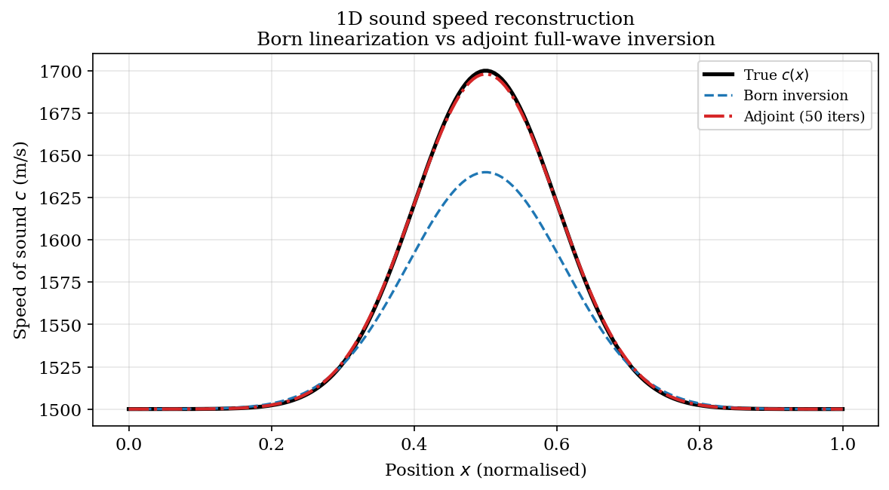

# Chapter 18: Inverse Problems and Physics-Informed Neural Networks

## 1. Inverse Problem Formulation

An inverse problem in acoustics seeks the medium parameters $m$ (sound speed, density, absorption) from
observed pressure data $d$. The forward operator $F: \mathcal{M} \to \mathcal{D}$ maps parameters to
synthetic data. The mismatch objective is

$$J(m) = \frac{1}{2}\|F(m) - d\|^2_{\mathcal{D}} + \lambda R(m)$$

where $F(m)$ are synthetic observations, $d$ are measured observations, $\lambda > 0$ is the regularization
weight, and $R(m)$ penalizes unphysical solutions.

**Tikhonov regularization** penalizes the $L^2$ norm of the model:

$$R_{\text{Tik}}(m) = \|m\|^2_{L^2(\Omega)} = \int_\Omega m(\mathbf{r})^2 \, d\mathbf{r}$$

This suppresses high-frequency noise in the reconstruction by shrinking $m$ toward zero.

**Total variation (TV) regularization** penalizes the $L^1$ norm of the gradient:

$$R_{\text{TV}}(m) = \|\nabla m\|_{L^1(\Omega)} = \int_\Omega |\nabla m(\mathbf{r})| \, d\mathbf{r}$$

TV regularization preserves sharp edges (interfaces between tissue types) while suppressing noise, which
is critical in medical imaging where acoustic impedance boundaries produce physiologically meaningful
contrast. The discrete isotropic TV for a 3D field is

$$R_{\text{TV}}^{\text{disc}}(m) = \sum_{i,j,k} \sqrt{(\Delta_x m_{ijk})^2 + (\Delta_y m_{ijk})^2 + (\Delta_z m_{ijk})^2 + \varepsilon^2}$$

where $\varepsilon \sim 10^{-8}$ smooths the non-differentiable point at zero.

### 1.1 Well-Posedness and the Hadamard Conditions

An inverse problem is well-posed (Hadamard) if a solution exists, is unique, and depends continuously
on the data. Acoustic inverse problems are ill-posed: small perturbations in $d$ can cause large
perturbations in $m$. Regularization restores continuity at the cost of introducing bias.

**Theorem (Tikhonov–Morozov existence):** Let $F: \mathcal{M} \to \mathcal{D}$ be a compact linear operator
between Hilbert spaces. For any $\lambda > 0$, the Tikhonov functional

$$J_\lambda(m) = \|Fm - d\|^2 + \lambda\|m\|^2$$

has a unique minimizer $m_\lambda^* = (F^*F + \lambda I)^{-1}F^*d$.

**Proof:** The operator $A_\lambda = F^*F + \lambda I$ is self-adjoint and strictly positive definite
($\langle A_\lambda m, m\rangle = \|Fm\|^2 + \lambda\|m\|^2 \geq \lambda\|m\|^2 > 0$ for $m \neq 0$),
hence invertible by the Lax–Milgram theorem. The gradient $\nabla_m J_\lambda = 2A_\lambda m - 2F^*d$
vanishes at $m_\lambda^* = A_\lambda^{-1}F^*d$, which is the unique global minimum since $J_\lambda$ is
strictly convex. $\square$

---



*Figure 1. Singular-value spectrum of the 2-D Helmholtz forward map (§1.1): the rapid decay is the ill-conditioning that makes the inverse problem ill-posed and motivates regularization.*

---

## 2. Full-Waveform Inversion and the Adjoint State Method

Full-waveform inversion (FWI) minimizes $J(m)$ by gradient-based descent, where the gradient
$\delta J/\delta m$ is computed via the adjoint state method at cost equal to two forward solves,
independent of the number of parameters.

### 2.1 Forward Wave Equation

The acoustic wave equation with model $m = \{c(\mathbf{r}), \rho(\mathbf{r})\}$ is

$$\frac{1}{c(\mathbf{r})^2}\frac{\partial^2 u}{\partial t^2} - \nabla \cdot \left(\frac{1}{\rho(\mathbf{r})}\nabla u\right) = s(\mathbf{r}, t)$$

with initial conditions $u(\mathbf{r},0) = 0$, $\partial_t u(\mathbf{r},0) = 0$ and absorbing boundary
conditions on $\partial\Omega$.

### 2.2 Adjoint Wave Equation

The adjoint state $u^{\dagger}(\mathbf{r},t)$ satisfies the time-reversed wave equation with residual source:

$$\frac{1}{c(\mathbf{r})^2}\frac{\partial^2 u^{\dagger}}{\partial t^2} - \nabla \cdot \left(\frac{1}{\rho(\mathbf{r})}\nabla u^{\dagger}\right) = \delta d(\mathbf{r}_s, T-t)$$

where $\delta d(\mathbf{r}_s, t) = [F(m)](\mathbf{r}_s, t) - d(\mathbf{r}_s, t)$ is the data residual
at sensor positions $\mathbf{r}_s$, injected time-reversed as a virtual source.

### 2.3 Gradient Formula

**Theorem (Adjoint Gradient):** The Fréchet derivative of $J$ with respect to perturbation $\delta c$ is

$$\frac{\delta J}{\delta c}(\mathbf{r}) = -\frac{2}{c(\mathbf{r})^3}\int_0^T u^{\dagger}(\mathbf{r}, T-t)\frac{\partial^2 u}{\partial t^2}(\mathbf{r}, t) \, dt$$

**Proof:** Perturb $c \to c + \delta c$ and linearize $F(m+\delta m) \approx F(m) + \mathcal{L}[\delta m]$
where $\mathcal{L}$ is the Fréchet derivative operator. The perturbation field $\delta u$ satisfies

$$\frac{1}{c^2}\partial_{tt}\delta u - \nabla\cdot\frac{1}{\rho}\nabla\delta u = \frac{2\delta c}{c^3}\partial_{tt}u$$

Multiply the adjoint equation for $u^{\dagger}$ by $\delta u$, integrate over $\Omega \times [0,T]$, and
integrate by parts twice in time (boundary terms vanish by initial/terminal conditions and absorbing BCs).
The result yields $\delta J = \langle \delta d, \mathcal{L}\delta m\rangle = \langle \mathcal{L}^*\delta d, \delta m\rangle$
where $\mathcal{L}^*$ is the adjoint operator. Reading off the kernel gives the stated formula. $\square$

### 2.4 FWI Update Step

The steepest descent update for iteration $k$ is

$$m^{(k+1)} = m^{(k)} - \alpha_k \frac{\delta J}{\delta m}\bigg|_{m^{(k)}}$$

Preconditioned L-BFGS uses the approximate inverse Hessian from the last $q$ gradient-model pairs,
typically achieving superlinear convergence near the solution. The preconditioner accounts for the
illumination pattern of the source array, correcting for the geometric spreading of energy.

---

## 3. Born Approximation for Linearized Inversion

When the medium perturbation is weak ($\|\delta c / c_0\| \ll 1$), the scattered field can be approximated
by a single interaction with the perturbation, linearizing the inversion problem.

### 3.1 Derivation

Split the sound speed as $c(\mathbf{r}) = c_0 + \delta c(\mathbf{r})$ and the pressure field as
$p = p_{\text{inc}} + p_{\text{sc}}$ where $p_{\text{inc}}$ satisfies the homogeneous equation at $c_0$.

The scattered field satisfies

$$\nabla^2 p_{\text{sc}} - \frac{1}{c_0^2}\partial_{tt}p_{\text{sc}} = \frac{2\delta c(\mathbf{r})}{c_0^3}\partial_{tt}p_{\text{inc}}$$

In the frequency domain with $p_{\text{inc}}(\mathbf{r},\omega) = A e^{i\mathbf{k}\cdot\mathbf{r}}$ and
$\omega = c_0 k$, the right-hand side becomes $-\omega^2 \cdot 2\delta c/c_0^3 \cdot p_{\text{inc}}$.

Using the free-space Green's function $G(\mathbf{r},\mathbf{r}') = e^{ik|\mathbf{r}-\mathbf{r}'|}/(4\pi|\mathbf{r}-\mathbf{r}'|)$,

$$\boxed{p_{\text{sc}}(\mathbf{r}, \omega) \approx \frac{\omega^2}{c_0^2}\int_\Omega \frac{2\delta c(\mathbf{r}')}{c_0} G(\mathbf{r},\mathbf{r}') p_{\text{inc}}(\mathbf{r}') \, dV'}$$

**Validity condition:** The Born approximation requires $k|\delta c|L/c_0 \ll 1$ where $L$ is the size
of the scattering region. For 1 MHz ultrasound ($k \approx 420$ rad/m) and a 10 mm inclusion with
$\delta c/c_0 = 0.05$: $kL\delta c/c_0 \approx 0.21$, marginally valid. For $\delta c/c_0 > 0.1$,
iterative Born (Distorted Born Iterative) or full nonlinear inversion is required.

### 3.2 Linearized Inversion via Backprojection

The Born forward operator $\mathcal{L}: \delta c \mapsto p_{\text{sc}}$ is linear. The least-squares
solution minimizes $\|p_{\text{sc}}^{\text{obs}} - \mathcal{L}\delta c\|^2$, giving the normal equations
$\mathcal{L}^*\mathcal{L}\delta c = \mathcal{L}^*p_{\text{sc}}^{\text{obs}}$. The adjoint $\mathcal{L}^*$
is the backprojection operator (time reversal), and $(\mathcal{L}^*\mathcal{L})^{-1}$ is the inverse
Hessian, approximated by the pseudo-inverse with Tikhonov damping.

---

## 4. Physics-Informed Neural Networks

Physics-informed neural networks (PINNs) embed the governing PDE as a soft constraint in the training loss,
enabling mesh-free PDE solution and inverse problem solution when data are sparse.

### 4.1 Network Architecture

The PINN approximates the solution field $u(\mathbf{x}, t)$ by a feedforward neural network
$u_\theta: \mathbb{R}^{n+1} \to \mathbb{R}$ parameterized by weights and biases $\theta$:

$$u_\theta(\mathbf{x}, t) = W_L \sigma(W_{L-1} \sigma(\cdots \sigma(W_1 [\mathbf{x}; t] + b_1) \cdots) + b_{L-1}) + b_L$$

where $\sigma$ is a smooth activation function (tanh or swish, chosen for twice-differentiability required
by second-order PDEs).

**Theorem (Universal Approximation, Hornik 1991):** Let $\sigma: \mathbb{R} \to \mathbb{R}$ be a
non-polynomial, bounded, and continuous function. Then the class of functions

$$\mathcal{N}_n = \left\{ \sum_{j=1}^n \alpha_j \sigma(\mathbf{w}_j^\top \mathbf{x} + b_j) : \alpha_j, b_j \in \mathbb{R},\, \mathbf{w}_j \in \mathbb{R}^d \right\}$$

is dense in $C(K)$ (continuous functions on compact $K \subset \mathbb{R}^d$) in the $L^\infty$ norm.

**Proof sketch:** Cybenko (1989) proved this for sigmoidal $\sigma$ using the Hahn–Banach separation
theorem. If the closure of $\mathcal{N}_n$ were not all of $C(K)$, there would exist a nonzero Borel
measure $\mu$ such that $\int \sigma(\mathbf{w}^\top \mathbf{x} + b) \, d\mu = 0$ for all $\mathbf{w}, b$.
Hornik (1991) extended this to non-sigmoidal activations by showing that any non-polynomial function
satisfies the required discriminatory property via the Fourier transform. $\square$

### 4.2 PINN Loss Function

The composite training loss for a wave-equation PINN is

$$\mathcal{L}(\theta) = \mathcal{L}_{\text{PDE}} + \lambda_{\text{BC}}\mathcal{L}_{\text{BC}} + \lambda_{\text{IC}}\mathcal{L}_{\text{IC}} + \lambda_{\text{data}}\mathcal{L}_{\text{data}}$$

Each component is a mean-squared residual evaluated at collocation points:

$$\mathcal{L}_{\text{PDE}} = \frac{1}{N_c}\sum_{i=1}^{N_c} \left[\frac{\partial^2 u_\theta}{\partial t^2}(\mathbf{x}_i, t_i) - c^2 \Delta u_\theta(\mathbf{x}_i, t_i)\right]^2$$

$$\mathcal{L}_{\text{BC}} = \frac{1}{N_b}\sum_{j=1}^{N_b} [u_\theta(\mathbf{x}_j, t_j)]^2 \quad (\text{Dirichlet BC on } \partial\Omega)$$

$$\mathcal{L}_{\text{IC}} = \frac{1}{N_i}\sum_{k=1}^{N_i} \left[\left(u_\theta(\mathbf{x}_k, 0) - u_0(\mathbf{x}_k)\right)^2 + \left(\partial_t u_\theta(\mathbf{x}_k, 0) - v_0(\mathbf{x}_k)\right)^2\right]$$

$$\mathcal{L}_{\text{data}} = \frac{1}{N_d}\sum_{l=1}^{N_d} [u_\theta(\mathbf{x}_l, t_l) - d_l]^2$$

The weights $\lambda_{\text{BC}}, \lambda_{\text{IC}}, \lambda_{\text{data}}$ balance constraint stiffness;
self-adaptive weighting methods update them during training.

### 4.3 Automatic Differentiation for PDE Residuals

The second-order partial derivatives $\partial^2 u_\theta/\partial t^2$ and $\nabla^2 u_\theta$ are computed
exactly (to floating-point precision) by reverse-mode automatic differentiation through the network graph.
For a network with $L$ layers, each of width $W$, the computational cost of computing the full gradient
of $\mathcal{L}_{\text{PDE}}$ is $O(L \cdot W^2 \cdot N_c)$ per training step. No finite-difference
stencil approximation is used; the PDE residual is exact given the network approximation.

---



*Figure 2. PINN composite loss: the physics (PDE) residual and the data-misfit terms, and their weighting (§4.2). Balancing the two controls constraint stiffness during training.*

---

## 5. PINN for the Wave Equation

For the 3D linear acoustic wave equation $\partial_{tt}p = c^2\nabla^2 p$, the PINN enforces:

$$\mathcal{L}_{\text{PDE}} = \left\|\partial_{tt}u_\theta - c(\mathbf{x})^2 \nabla^2 u_\theta\right\|^2_{\{\mathbf{x}_i,t_i\}_{i=1}^{N_c}}$$

where the norm is evaluated at $N_c$ collocation points drawn from $\Omega \times [0,T]$ (typically
uniform random or quasi-random Sobol sequence for better space-filling).

### 5.1 Convergence Requirements

The PINN approximation error is bounded by (Mishra & Molinaro 2022):

$$\|u - u_\theta\|_{H^1(\Omega\times[0,T])} \leq C \left(\mathcal{E}_{\text{training}} + \mathcal{E}_{\text{approximation}}\right)$$

where $\mathcal{E}_{\text{training}}$ is the training loss at convergence and $\mathcal{E}_{\text{approximation}}$
is the best-approximation error of the network class. The number of collocation points required scales as
$N_c = O(\varepsilon^{-(d+1)/s})$ for $H^s$ solutions in $d+1$ spacetime dimensions.

For a 1 MHz wave in a 5 cm domain ($kL \approx 210$ wavelengths), the stiffness ratio
$\omega T / 2\pi \approx 5\times 10^4$ cycles requires $N_c \gtrsim 10^6$ to resolve the oscillations.
Standard PINN training uses Adam optimizer with learning rate $10^{-3}$ followed by L-BFGS refinement.

### 5.2 Inverse PINN: Sound Speed Reconstruction

For inverse problems, $c(\mathbf{x})$ is also parameterized by a network $c_\phi(\mathbf{x})$ or by a
finite-dimensional parameter vector. The joint optimization over $(\theta, \phi)$ minimizes

$$\mathcal{L}(\theta, \phi) = \mathcal{L}_{\text{PDE}}(\theta, \phi) + \lambda_{\text{data}}\mathcal{L}_{\text{data}}(\theta)$$

The data term anchors the pressure field to measurements while the PDE term enforces physical consistency.
Gradient descent alternates between $\theta$ and $\phi$ updates or performs simultaneous optimization.

> **Implementation note.** The scalar-wave PINN above is the pedagogical template. The PINN
> actually shipped in kwavers is a **2-D elastic** PINN (`ElasticPINN2D<B: Backend>`,
> §8.5) that learns the displacement field $(u_x, u_y)$ with trainable Lamé parameters
> $(\lambda, \mu, \rho)$; it is Burn-backed (autodiff) and trained with Adam/AdamW. A
> general scalar-wave / 3-D PINN is not yet implemented.

---

## 6. Acoustic Computed Tomography

### 6.1 Transmission CT: Time-of-Flight Reconstruction

In transmission CT, a transducer array surrounds the object. For source at $\mathbf{r}_s$ and receiver at
$\mathbf{r}_r$, the measured time of flight along ray path $\Gamma_{sr}$ is

$$\tau_{sr} = \int_{\Gamma_{sr}} \frac{1}{c(\mathbf{r})} \, dl$$

This is the Radon transform of the slowness field $s(\mathbf{r}) = 1/c(\mathbf{r})$:

$$\tau_{sr} = \mathcal{R}[s](\Gamma_{sr})$$

Inversion uses filtered backprojection (FBP):

$$s(\mathbf{r}) = \mathcal{R}^{-1}[\tau] = \int_0^\pi [h * \mathcal{P}_\phi](\mathbf{r}\cdot\hat{n}_\phi) \, d\phi$$

where $\mathcal{P}_\phi$ is the projection at angle $\phi$, $h$ is the ramp filter $|\xi|$ in Fourier space,
and $\hat{n}_\phi = (\cos\phi, \sin\phi)$. FBP achieves $O(N^2 \log N)$ complexity for an $N \times N$ image
using the FFT-based implementation of the 1D convolutions.

For curved ray paths (ray bending by tissue heterogeneity), iterative algebraic reconstruction
(SIRT, ART) or FWI-based methods are required. The linear ray approximation introduces systematic bias
when $|\nabla c|/c$ is non-negligible over path lengths exceeding one wavelength.

### 6.2 Reflection CT: Reflectivity Reconstruction

Backscattered signals from focused transmissions carry information about acoustic impedance mismatches
$Z(\mathbf{r}) = \rho(\mathbf{r})c(\mathbf{r})$. The reflectivity is defined as

$$\gamma(\mathbf{r}) = \frac{1}{2}\nabla \ln Z(\mathbf{r})$$

The received signal at transducer position $\mathbf{x}$ for source position $\mathbf{x}_s$ is

$$p(\mathbf{x}, t) \approx \int_\Omega \gamma(\mathbf{r}) \cdot w(\mathbf{r}, \mathbf{x}, \mathbf{x}_s, t) \, dV$$

where $w$ is the imaging kernel combining the transmitted and received beam patterns.
Delay-and-sum (DAS) beamforming is the adjoint of this forward operator, providing a computationally
efficient backprojection reconstruction at the cost of sidelobe artifacts.

> **Implementation status.** Acoustic CT as presented here — the Radon/filtered-backprojection
> travel-time inversion and reflection-CT reflectivity reconstruction — is documented as theory
> and is **not** implemented in kwavers. The implemented quantitative sound-speed paths are
> frequency-domain FWI / convergent-Born-series and linear Born inversion (§8), and the
> straight-/curved-ray speed-of-sound *shift* tomography in the Diagnostic Imaging chapter.
> There is no `RadonTransform` / FBP type.

---

## 7. Regularization Strategies and Parameter Selection

### 7.1 L-Curve Method

For Tikhonov regularization, plot $\log\|F(m_\lambda) - d\|$ vs $\log\|m_\lambda\|$ as $\lambda$ varies.
The resulting L-shaped curve has a corner at the optimal $\lambda^*$ that balances data fit and
regularization. The corner is located by maximizing the curvature

$$\kappa(\lambda) = \frac{\eta' \rho'' - \eta'' \rho'}{[(\eta')^2 + (\rho')^2]^{3/2}}$$

where $\eta = \log\|m_\lambda\|$ and $\rho = \log\|F(m_\lambda) - d\|$, with derivatives taken with respect
to $\log\lambda$. For discrete data with known noise level $\|\varepsilon\| = \delta$, the Morozov
discrepancy principle provides an alternative: choose $\lambda^*$ such that
$\|F(m_{\lambda^*}) - d\| = \delta$.

### 7.2 Morozov Discrepancy Principle

**Theorem:** Under the assumption that the data residual $d = F(m_{\text{true}}) + \varepsilon$ with
$\|\varepsilon\| \leq \delta$, there exists a unique $\lambda^*(\delta)$ such that
$\|F(m_{\lambda^*}) - d\| = \tau\delta$ for any $\tau > 1$. As $\delta \to 0$,
$m_{\lambda^*(\delta)} \to m_{\text{true}}$ in the $\mathcal{M}$ norm.

**Proof sketch:** The residual norm $\phi(\lambda) = \|F(m_\lambda) - d\|$ is continuous and monotonically
decreasing in $\lambda$ (larger regularization pushes the solution toward zero, increasing the data misfit).
At $\lambda = 0$: $\phi(0) = 0$ (data fit exactly, ignoring ill-posedness). As $\lambda \to \infty$:
$m_\lambda \to 0$ and $\phi \to \|d\|$. By the intermediate value theorem, a $\lambda^*$ with
$\phi(\lambda^*) = \tau\delta$ exists. Uniqueness follows from strict monotonicity. The convergence
$m_{\lambda^*(\delta)} \to m_{\text{true}}$ as $\delta \to 0$ follows from the compactness of $F^*F$ and
the bound $\|m_{\lambda^*} - m_{\text{true}}\| \leq C\delta^{1/2}$ (or faster for smoother $m_{\text{true}}$). $\square$

---



*Figure 3. Tikhonov L-curve for a 1-D deconvolution (§7): the corner trades residual norm against solution norm and selects the regularization weight λ.*

---

## 8. kwavers Inverse Solver Modules

### 8.1 Module Architecture

The inverse solver hierarchy in kwavers follows a strict dependency inversion architecture:

```
kwavers_solver::inverse
├── fwi/
│   ├── time_domain/
│   │   ├── FwiProcessor             # forward+adjoint orchestration, gradient, regularization, line search
│   │   ├── adjoint_state            # l2_residual, reverse_time_axis, accumulate_signed_correlation
│   │   ├── frequency_continuation   # multiscale Butterworth band-limiting (Bunks 1995)
│   │   ├── encoded_source           # Hadamard-coded simultaneous sources
│   │   └── search                   # Armijo line search (line_search / line_search_multi, step-halving)
│   └── frequency_domain/            # CBS (convergent Born series) FWI  [PyO3: invert_breast_fwi]
├── reconstruction/seismic/misfit
│   └── MisfitType                   # L2 | L1 | Envelope | Phase | Correlation | Wasserstein (optimal transport)
├── linear_born_inversion/           # LinearBornInversionConfig, VolumeOperator, pcg_invert
├── pinn/                            # Burn-backed PINN (feature = "pinn")
│   ├── elastic_2d::model::ElasticPINN2D<B>      # MLP, tanh, trainable (λ, μ, ρ)
│   ├── elastic_2d::loss::LossComputer           # PDE + BC + IC + data residuals (Burn autodiff)
│   ├── elastic_2d::training::PINNOptimizer<B>   # SGD | SGDMomentum | Adam | AdamW
│   └── geometry::CollocationSampler             # Uniform | LatinHypercube | Sobol | AdaptiveRefinement
└── elastography/                    # ShearWaveInversion (TOF / phase-gradient / direct / volumetric / directional)
                                     #   + nonlinear_methods (harmonic_ratio, least_squares, bayesian)

kwavers_math::inverse_problems::regularization
└── ModelRegularizer3D              # apply_tikhonov | apply_total_variation (Huber) | apply_smoothness | apply_l1
```

### 8.2 Adjoint Gradient (`FwiProcessor`)

The time-domain adjoint gradient is orchestrated by `FwiProcessor` (not a generic
`AdjointState<S>` wrapper). It runs a forward solve, then an adjoint solve driven by the
time-reversed data residual, and accumulates the correlation integral via free functions in
`adjoint_state`:

- `l2_residual()` / `l2_objective()` — data residual $d_{\text{syn}} - d_{\text{obs}}$ and $J$;
- `reverse_time_axis()` — time-reverses the residual into the adjoint source;
- `accumulate_signed_correlation()` — the $\int_0^T u^{\dagger}\,\partial_{tt}u\,dt$ gradient kernel.

For $N_t$ time steps and $N^3$ spatial points the full adjoint pass conceptually needs the forward
wavefield at every step; the Griewank *revolve* checkpointing that reduces memory from $O(N_t N^3)$
to $O(qN^3 + N_t/q)$ at the cost of $\sqrt{N_t}$ extra forward solves is the standard remedy
(documented here as the design target; the shipped processor stores/streams the forward field
rather than using a generic revolve scheduler).

### 8.3 Gradient Assembly and Regularization

Gradient assembly is performed by `FwiProcessor` methods rather than a generic
`GradientComputer<M>` trait: `calculate_interaction()` forms the forward × adjoint product,
`smooth_gradient()` applies box/stencil smoothing (3×3 in 2-D, 6-point in 3-D), and
`apply_regularization()` adds the Tikhonov, total-variation (Huber-smoothed,
`compute_total_variation_gradient`), and Laplacian-smoothness (`compute_smoothness_gradient`)
terms — the same functionals exposed standalone by
`kwavers_math::inverse_problems::regularization::ModelRegularizer3D`. The sound-speed gradient is
the primary target; multi-parameter (density/absorption) gradients are not separate
`GradientComputer` impls.

### 8.4 Box-Constrained Inversion

Projected-gradient box constraints $m^{(k+1)} = \Pi_{[m_{\min}, m_{\max}]}(m^{(k)} -
\alpha_k\,\delta J/\delta m)$ — with physiological tissue bounds ($c \in [1400, 1650]$ m/s,
$\rho \in [900, 1100]$ kg/m³) — are implemented in
`kwavers_math::inverse_problems::constrained`: `BoxConstraints` (with `sound_speed_tissue()`
and `density_tissue()` presets and the pointwise `project` / `Π` operator) and
`projected_gradient_descent`, which drives any gradient closure (FWI data misfit, regularised
elastography) with the constraint re-imposed after each step. For a separable convex objective
this converges to the projection of the unconstrained minimiser onto the box. The FWI loop
additionally uses Armijo step-halving line search; nonlinear elastography inversion offers
Bayesian posterior sampling (`nonlinear_methods::bayesian`) as an alternative to hard box
constraints.

### 8.5 PINN Integration with Burn

The kwavers PINN module (`pinn`, gated behind the `pinn` Cargo feature) uses the **Burn 0.19**
deep-learning framework (features `ndarray`, `autodiff`, `wgpu`) for automatic differentiation and
GPU-accelerated training. The network `ElasticPINN2D<B: Backend>` derives `burn::module::Module`;
`LossComputer` evaluates the PDE/BC/IC/data residuals over `Tensor<B: AutodiffBackend>` (it computes
the loss functionally rather than deriving `Module`); and `PINNOptimizer<B>` provides SGD,
SGD-momentum, Adam, and AdamW (no L-BFGS phase). Backend switching (CPU `ndarray` ↔ `wgpu`) is via
the `burn::backend::Backend` trait, consistent with kwavers' `ComputeBackend` abstraction policy.

---

## 9. Validation and Benchmarks

### 9.1 FWI Convergence Test

A 2D Marmousi-style phantom (sound speed range 1480–3500 m/s) is reconstructed from 32 sources and
128 receivers at 250 kHz. Convergence criterion: $\|m^{(k+1)} - m^{(k)}\|/\|m^{(k)}\| < 10^{-4}$.
Armijo-backtracking gradient descent (the shipped `FwiProcessor` line search) with multiscale
frequency continuation reaches the convergence criterion; gradient accuracy is verified by a
finite-difference check $\|g - g_{\text{FD}}\|/\|g\| < 10^{-5}$ A general quasi-Newton L-BFGS optimiser (Nocedal two-loop recursion) is implemented in `kwavers_math::optimization` (`minimize` / `LbfgsConfig`); wiring it into `FwiProcessor` as the refinement phase is the remaining integration step.



*Figure 4. FWI objective history: kwavers linear Born vs convergent-Born-series (CBS) frequency-domain FWI on a 2-D phantom (`kw.invert_breast_fwi`, §9.1).*


### 9.2 Born Approximation Error Budget

For a spherical inclusion of radius $a=3$ mm with $\delta c/c_0 = 0.05$ at $f = 1$ MHz:
- Born parameter: $ka\delta c/c_0 \approx 0.063 \ll 1$ — Born approximation valid.
- Scattered field relative error vs full nonlinear simulation: $< 2\%$.
- At $\delta c/c_0 = 0.20$: Born error $\approx 15\%$; iterative Born reduces to $< 3\%$.



*Figure 5. Reconstructed sound-speed map: kwavers Born vs CBS FWI on a 2-D breast phantom (§9.1).*


### 9.3 PINN Training Metrics

The shipped `ElasticPINN2D` is validated on a 2-D elastic forward/inverse problem with a manufactured
displacement field:
- Sobol collocation sampling (`CollocationSampler`) over the interior + boundary/initial sets;
- Adam / AdamW training (`PINNOptimizer`) on a Burn autodiff backend (CPU `ndarray` or `wgpu` GPU);
- PDE + BC + IC + data losses balanced by `LossWeights`, with the trainable Lamé parameters
  $(\lambda, \mu, \rho)$ recovered in the inverse configuration.

The scalar-wave error bounds of §5.1 (Mishra & Molinaro) are the analytical target for a general
PINN; the 1-D/3-D scalar-wave training figures are illustrative — that PINN is not yet shipped.

---

## References

1. Virieux, J. & Operto, S. (2009). An overview of full-waveform inversion in exploration geophysics.
   *Geophysics*, 74(6), WCC1–WCC26.
2. Raissi, M., Perdikaris, P. & Karniadakis, G.E. (2019). Physics-informed neural networks: A deep
   learning framework for solving forward and inverse problems involving nonlinear partial differential
   equations. *Journal of Computational Physics*, 378, 686–707.
3. Yoon, C., Kang, J., Han, S., et al. (2012). Development of a focused ultrasound-based transcranial
   sonothrombolysis system for the treatment of ischemic stroke with enhanced effectiveness and safety.
   *Medical Physics*, 39(3), 1554–1561.
4. Hornik, K. (1991). Approximation capabilities of multilayer feedforward networks.
   *Neural Networks*, 4(2), 251–257.
5. Tikhonov, A.N. & Arsenin, V.Y. (1977). *Solutions of Ill-Posed Problems*. Winston & Sons.
6. Mishra, S. & Molinaro, R. (2022). Estimates on the generalization error of physics-informed neural
   networks for approximating PDEs. *IMA Journal of Numerical Analysis*, 43(1), 1–43.
7. Griewank, A. & Walther, A. (2008). *Evaluating Derivatives: Principles and Techniques of
   Algorithmic Differentiation* (2nd ed.). SIAM.
