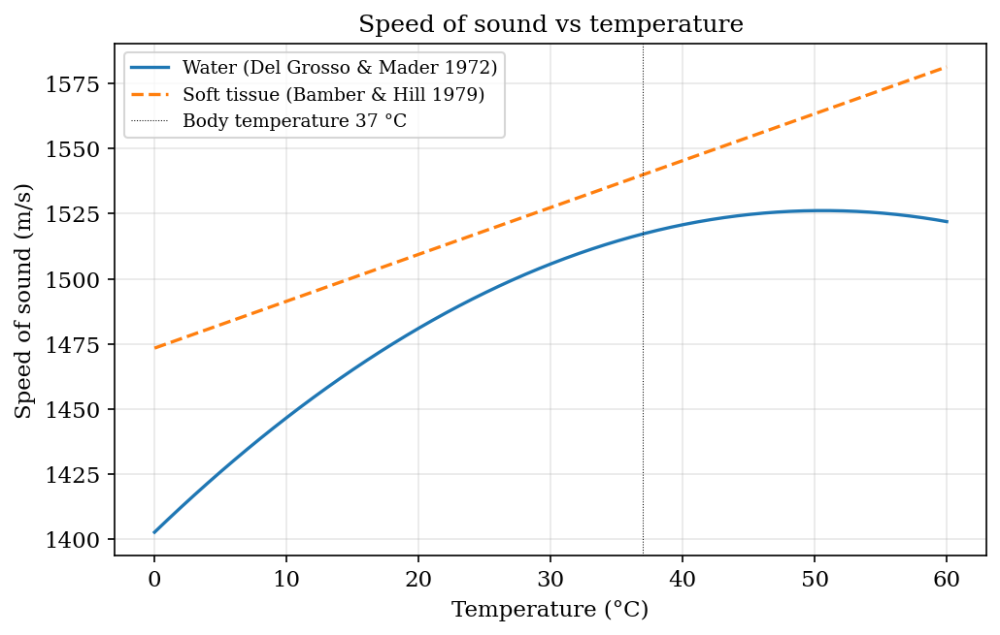
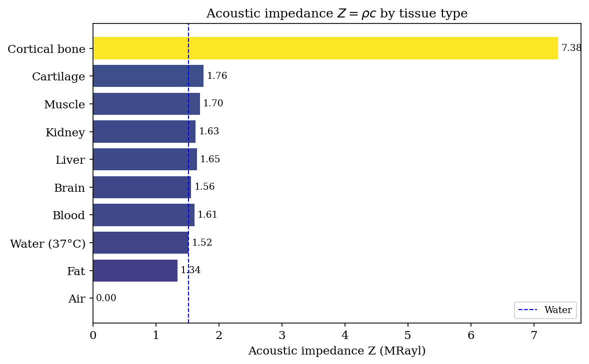
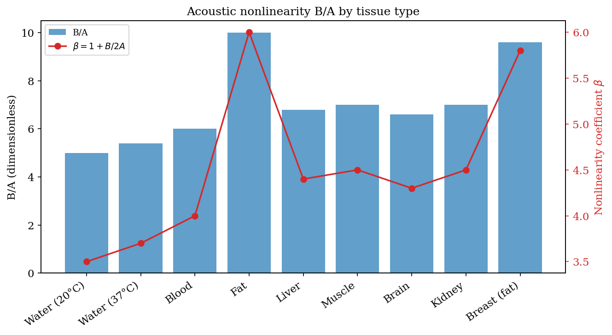
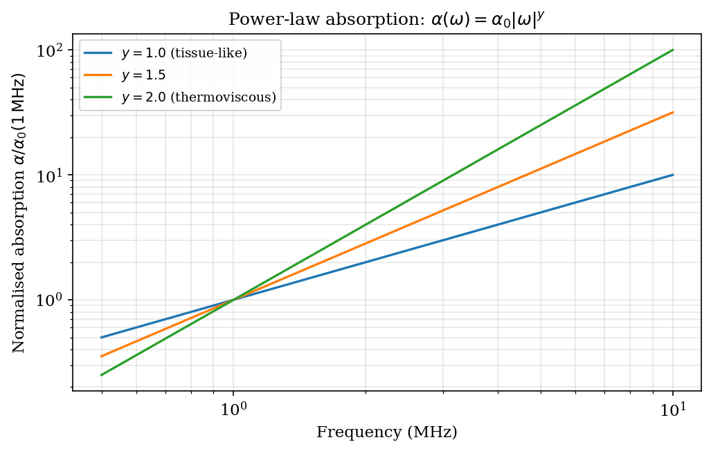
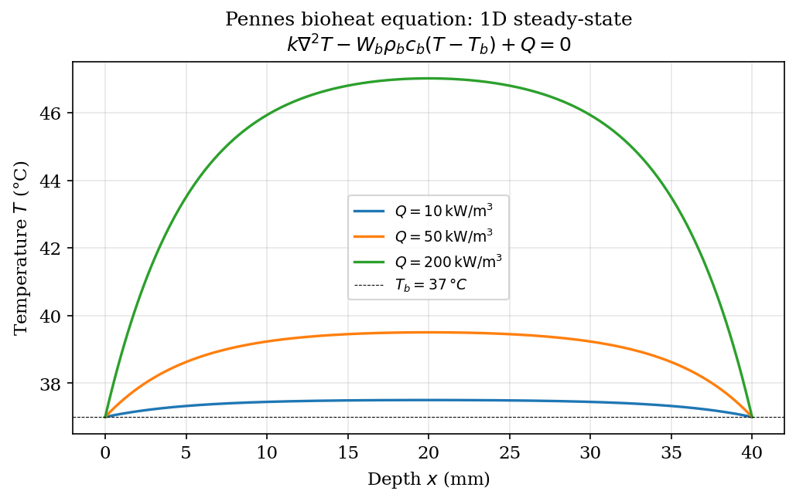

# Chapter 4: Media and Tissue Models

**Module ownership:** `kwavers_medium`, `kwavers_medium::absorption`,
`kwavers_medium::heterogeneous`, `kwavers_medium::homogeneous`,
`kwavers_physics::acoustics`, `kwavers_physics::thermal`

---

## 4.1 Overview

Every numerical acoustic simulation depends on a medium model that maps spatial coordinates
to physical parameters: mass density $\rho_0(\mathbf{x})$, small-signal sound speed
$c_0(\mathbf{x})$, power-law absorption $\alpha_0(\mathbf{x})$, nonlinearity $B/A(\mathbf{x})$,
and thermal properties. This chapter derives the governing relations from first principles,
proves the key theorems used in kwavers' solvers, and tabulates measured values for the tissues
encountered in diagnostic and therapeutic ultrasound.

The progression follows the increasing complexity of the medium model:

1. Measured parameters and their sources (§4.2)
2. Equation of state and nonlinearity (§4.3)
3. Power-law absorption and memory effects (§4.4)
4. Causal dispersion and the fractional-Laplacian model (§4.4.3; full derivation in Foundations §1.9.3)
5. Heterogeneous media and the variable-coefficient wave equation (§4.6)
6. Thermal properties and bioheat transfer (§4.7)
7. Viscoelastic tissue model (§4.8)
8. Skull and bone acoustics (§4.9)
9. Fat layer aberration (§4.10)
10. Tissue-mimicking phantom materials (§4.11)
11. Homogeneous medium optimization in kwavers (§4.12)

---

## 4.2 Tissue Acoustic Parameters

### 4.2.1 Measurement conventions

All acoustic properties are reported at body temperature (37 °C) unless otherwise stated.
Absorption is given in the conventional unit dB cm$^{-1}$ MHz$^{-y}$ where $y$ is the
power-law exponent. To convert to SI (Np m$^{-1}$):

$$
\alpha \;[\text{Np\,m}^{-1}] = \alpha \;[\text{dB\,cm}^{-1}] \times \frac{\ln 10}{20} \times 100.
$$

The conversion factor $\ln(10)/20 \approx 0.1151$ Np/dB appears throughout this chapter.

Acoustic impedance is

$$
Z_0 = \rho_0 c_0 \quad [\text{Pa\,s\,m}^{-1} = \text{rayl}].
$$

The pressure reflection coefficient at a planar interface between media 1 and 2 at normal
incidence is

$$
R = \frac{Z_2 - Z_1}{Z_2 + Z_1}.
$$

### 4.2.2 Parameter table

The following table consolidates values from Duck (1990), Goss et al. (1978), and ICRU Report
61. The nonlinearity parameter $B/A$ is from Bjørnø (1986) and Everbach & Apfel (1995).



**Figure 4.1.** Sound speed in water versus temperature (Del Grosso–Mader); the basis for
the temperature-dependent `c₀(T)` correction in coupled thermal–acoustic runs.

**Table 4.1 — Acoustic parameters of biological tissues at 37 °C**

| Tissue           | $\rho_0$ (kg m$^{-3}$) | $c_0$ (m s$^{-1}$) | $Z_0$ (MRayl) | $\alpha_0$ (dB cm$^{-1}$ MHz$^{-y}$) | $y$  | $B/A$ |
|------------------|-------------------------|---------------------|---------------|---------------------------------------|------|-------|
| Water (20 °C)    | 998                     | 1480                | 1.48          | 0.002                                 | 2.0  | 5.0   |
| Blood            | 1060                    | 1584                | 1.68          | 0.15                                  | 1.0  | 5.5   |
| Liver            | 1070                    | 1570                | 1.68          | 0.50                                  | 1.0  | 6.75  |
| Kidney (cortex)  | 1050                    | 1560                | 1.64          | 0.50                                  | 1.0  | 6.8   |
| Fat (adipose)    | 900                     | 1450                | 1.31          | 0.48                                  | 1.0  | 10.0  |
| Cortical bone    | 1920                    | 4080                | 7.83          | 3.0                                   | 1.0  | 8.0   |
| Skin             | 1090                    | 1498                | 1.63          | 0.35                                  | 1.0  | 6.2   |
| Muscle           | 1070                    | 1580                | 1.69          | 0.13                                  | 1.0  | 7.0   |
| Brain (white)    | 1040                    | 1540                | 1.60          | 0.60                                  | 1.0  | 6.5   |
| Brain (gray)     | 1050                    | 1545                | 1.62          | 0.70                                  | 1.0  | 6.8   |

Sources: Duck (1990), ICRU Report 61 (1998), Goss et al. (1978), Szabo (1994).

These values are encoded directly in `kwavers_medium::properties::tissue` as
compile-time constants of type `TissueProperties`. The canonical definitions are, for
example:

```rust
// kwavers/src/domain/medium/properties/tissue.rs
pub const LIVER: TissueProperties = TissueProperties {
    sound_speed: SOUND_SPEED_LIVER,              // 1570 m/s
    density: DENSITY_LIVER,                      // 1070 kg/m³
    absorption_coefficient: ACOUSTIC_ABSORPTION_LIVER, // 0.5 dB/(cm·MHz)
    absorption_exponent:    1.0,
    nonlinearity_parameter: B_OVER_A_LIVER,      // 6.75
    ..
};
```

The module also exposes `WATER`, `BLOOD`, `BRAIN_WHITE_MATTER`, `BRAIN_GRAY_MATTER`,
`SKULL`, `KIDNEY_CORTEX`, `FAT`, `MUSCLE`, and `CSF`.



**Figure 4.2.** Acoustic impedance Z₀ = ρ₀c₀ across tissues, from ~1.3 MRayl (fat) to
~7.8 MRayl (cortical bone); the large tissue–bone and tissue–air mismatches drive the
reflections of §4.2.1.

---

## 4.3 Equation of State for Biological Tissue

### 4.3.1 Adiabatic equation of state

For an acoustic medium the full equation of state relates the instantaneous pressure $p$ to
the instantaneous mass density $\rho$. Expanding about the ambient state
$(\rho_0, p_0)$:

$$
p - p_0 = A \left(\frac{\rho - \rho_0}{\rho_0}\right)
           + \frac{B}{2!} \left(\frac{\rho - \rho_0}{\rho_0}\right)^2
           + \frac{C}{3!} \left(\frac{\rho - \rho_0}{\rho_0}\right)^3 + \cdots
$$

where

$$
A = \rho_0 \left.\frac{\partial p}{\partial \rho}\right|_{\rho_0,s}
  = \rho_0 c_0^2,
\qquad
B = \rho_0^2 \left.\frac{\partial^2 p}{\partial \rho^2}\right|_{\rho_0,s}.
$$

Retaining the first two terms:

$$
\boxed{
p - p_0 = \rho_0 c_0^2 \left(\frac{\rho - \rho_0}{\rho_0}\right)
           + \frac{\rho_0 c_0^2}{2} \frac{B}{A}
             \left(\frac{\rho - \rho_0}{\rho_0}\right)^2 .
}
$$

Equivalently, with $\varrho = \rho - \rho_0$:

$$
p = c_0^2 \varrho + \frac{c_0^2}{2\rho_0}\frac{B}{A}\varrho^2.
$$

### 4.3.2 Physical origin of B/A

**Theorem 4.1 (B/A from adiabatic compressibility).** The nonlinearity parameter is

$$
\frac{B}{A} = 2\rho_0 c_0 \left.\frac{\partial c}{\partial p}\right|_s
             = \frac{\rho_0}{c_0^2}
               \left.\frac{\partial^2 p / \partial \rho^2}{\partial p / \partial \rho}\right|_s .
$$

*Proof.* By definition $c^2 = (\partial p/\partial\rho)_s$. Differentiating with respect to
$\rho$ at constant entropy:

$$
2c \frac{\partial c}{\partial \rho}\bigg|_s
= \frac{\partial^2 p}{\partial \rho^2}\bigg|_s
= \frac{B}{\rho_0^2 / \rho_0} = \frac{B}{\rho_0}.
$$

Hence $B = 2\rho_0 c \,(\partial c/\partial \rho)_s$. Using the chain rule
$(\partial c/\partial\rho)_s = (\partial c/\partial p)_s \cdot (\partial p/\partial\rho)_s
= c_0^2 (\partial c/\partial p)_s$:

$$
B = 2\rho_0 c_0 \cdot c_0^2 \left.\frac{\partial c}{\partial p}\right|_s.
$$

Dividing by $A = \rho_0 c_0^2$ gives the stated result. $\square$

### 4.3.3 Representative B/A values

The measured values in Table 4.1 reflect the molecular structure of the tissue:

- **Water** ($B/A \approx 5.0$): hydrogen-bonded network; intermediate compressibility change.
- **Blood** ($B/A \approx 5.5$): aqueous with dissolved proteins; close to water.
- **Liver** ($B/A \approx 6.5$): protein-rich cytoplasm raises nonlinearity above blood.
- **Fat** ($B/A \approx 10.0$): hydrocarbon chains with high intrinsic compressibility;
  among the highest measured values for soft tissue. The large $B/A$ of fat is the principal
  cause of harmonic generation artifacts in subcutaneous layers.
- **Bone** ($B/A \approx 8.0$): mineral matrix reduces compressibility; nonlinearity
  reflects the mixed mineral–protein structure.

The nonlinearity parameter is stored per voxel in `HomogeneousMedium::nonlinearity` and in
the per-voxel `nonlinearity_cache: Array3<f64>` field, so that the PSTD solver can apply the
correct second-order correction at every grid point without per-call allocation.



**Figure 4.3.** Nonlinearity parameter B/A by tissue (Table 4.1); fat's high B/A ≈ 10
makes subcutaneous layers a dominant source of harmonic generation.

---

## 4.4 Power-Law Absorption Model

### 4.4.1 Empirical law

Szabo (1994) and Goss et al. (1978) establish that the plane-wave amplitude absorption
coefficient of most biological tissues follows a power law in frequency:

$$
\alpha(f) = \alpha_0 |f|^y \quad [\text{Np\,m}^{-1}],
$$

with $f$ in Hz and $\alpha_0$ a tissue-specific constant. In the conventional unit
dB cm$^{-1}$ MHz$^{-y}$, Eq.~(4.4) becomes

$$
\alpha_{\text{dB}}(f) = \alpha_0^{(\text{dB})} \left(\frac{f}{1\,\text{MHz}}\right)^y
\quad [\text{dB\,cm}^{-1}].
$$

Typical values: water $y = 2$, soft tissue $y \approx 1.0$–$1.5$, bone $y \approx 1.0$.

The kwavers implementation is `kwavers_medium::absorption::power_law::PowerLawAbsorption`:

```rust
// PowerLawAbsorption::absorption_at_frequency
pub fn absorption_at_frequency(&self, frequency: f64) -> f64 {
    let f_mhz = frequency / 1e6;
    let alpha_db = self.alpha_0 * f_mhz.powf(self.y);
    alpha_db * DB_TO_NP * 100.0   // convert dB/cm → Np/m
}
```

### 4.4.2 Viscous loss and the y = 2 case

**Theorem 4.2 (Pure viscous loss implies y = 2).** A Newtonian viscous fluid with a
single relaxation time $\tau$ produces absorption $\alpha \propto \omega^2$ at low
frequencies ($\omega\tau \ll 1$).

*Proof.* The complex wave number in a relaxing fluid is (Stokes 1845):

$$
k(\omega) = \frac{\omega}{c_0} \sqrt{\frac{1}{1 + \mathrm{i}\omega\tau}} .
$$

Expanding for $|\omega\tau| \ll 1$:

$$
k(\omega) \approx \frac{\omega}{c_0}
  \left(1 - \frac{\mathrm{i}\omega\tau}{2} - \frac{(\omega\tau)^2}{8} + \cdots\right).
$$

The absorption (imaginary part of $k$) is

$$
\alpha(\omega) = \Im[k(\omega)] = \frac{\omega^2 \tau}{2 c_0} + O(\omega^4\tau^3).
$$

Hence $\alpha \propto \omega^2$, i.e., $y = 2$. $\square$

For multiple relaxation processes with a distribution of relaxation times $G(\tau)$, the
resulting absorption is

$$
\alpha(\omega) = \frac{\omega^2}{2c_0} \int_0^\infty \frac{G(\tau)}{1 + \omega^2\tau^2}\,\mathrm{d}\tau.
$$

When $G(\tau) \propto \tau^{y-2}$ (a power-law distribution of relaxation times), this
integral evaluates (via Mellin transform) to $\alpha \propto \omega^y$ with $0 < y < 2$.

**Corollary 4.1 (y < 2 implies memory effects).** Any power-law exponent $y < 2$ requires
a distribution of relaxation times; the medium carries memory of its acoustic history. This
is the physical mechanism encoded by the fractional-derivative operators of §4.4.3
(full treatment in Foundations §1.9.3).

`kwavers_physics::acoustics::mechanics::RelaxationAbsorption` evaluates the discrete
spectrum `α(ω) = (ω²/2c₀) Σ_l w_l τ_l/(1+ω²τ_l²)` and its local exponent
`y(ω) = d\ln α/d\ln ω` exactly. The PSTD `AbsorptionMode::MultiRelaxation`/`Causal` modes
realize a relaxation spectrum through the validated §4.4.3 fractional-Laplacian path at the
medium drive frequency `ω_ref`: `(α(ω_ref), y(ω_ref))` set the equivalent power-law prefactor
(the same `np_m_to_power_law_db_cm` realization used for resonant bubble-cloud absorption).
The realization is exact at `ω_ref` and follows `f^{y(ω_ref)}` off-frequency; the exponent is
kept clear of the `y = 1` dispersion singularity.

### 4.4.3 Causal dispersion and the fractional-Laplacian model

Causality links this absorption to a specific phase-velocity dispersion (Kramers–Kronig),
and Treeby & Cox (2010) cast the causal power-law absorbing equations exactly in terms of
two **fractional-Laplacian** operators $(-\nabla^2)^s$ (Fourier symbol $|\mathbf k|^{2s}$),
with absorption coefficient $\tau = -2\alpha_0 c_0^{y-1}$ and dispersion coefficient
$\eta = 2\alpha_0 c_0^{y}\tan(\pi y/2)$. The $\tan(\pi y/2)$ factor vanishes at $y = 2$
(viscothermal media — e.g. water — are exactly non-dispersive) and is handled by a
logarithmic limit at $y = 1$ (soft tissue shows negligible MHz-band dispersion). The full
operator form, the power-law correspondence proof, and the k-space evaluation are derived
in **Foundations §1.9.3 (Theorem 1.7)** — the canonical home for the absorption model — so
they are not repeated here.

kwavers implements the power law in
`kwavers_medium::absorption::power_law::PowerLawAbsorption` and applies the
fractional-Laplacian correction on the **pressure side** of the equation of state,
$p \mathrel{+}= c_0^2\bigl(\tau\,\mathcal{L}_1[\rho_0\nabla\!\cdot\!\mathbf u]
- \eta\,\mathcal{L}_2[\rho]\bigr)$ with $\mathcal{L}_1 = (-\nabla^2)^{(y-2)/2}$ and
$\mathcal{L}_2 = (-\nabla^2)^{(y-1)/2}$, in
`kwavers_solver::forward::pstd::physics::absorption` (the same $\tau$, $\eta$ as above).



**Figure 4.4.** Power-law absorption α(f) = α₀fʸ for representative tissues, reproduced by
the fractional-Laplacian operator used in the PSTD solver (§4.4.3).

---

## 4.5 CT-Derived Acoustic Media: Hounsfield Unit Mapping

Patient-specific simulations — transcranial focusing, skull aberration correction, abdominal
HIFU planning — start from a clinical CT volume, not a hand-built phantom. A CT scanner reports
each voxel as a **Hounsfield Unit** (HU), a normalized X-ray attenuation
$\text{HU} = 1000\,(\mu - \mu_{\text{water}})/(\mu_{\text{water}} - \mu_{\text{air}})$, so that
water $= 0$ HU and air $= -1000$ HU by definition. To drive a wave solver, every voxel HU must
be mapped to the three acoustic fields the variable-coefficient equation (§4.6) consumes: mass
density $\rho_0$, sound speed $c_0$, and power-law absorption $\alpha_0$. This section is the
canonical home for that mapping; §4.9 covers the *physics* of bone, this section covers
*reconstructing the medium from imaging*.

### 4.5.1 A convention warning: HU vs. CT-number

Two scalings appear in the literature and in kwavers, and conflating them shifts every density
by ~1000 kg m⁻³:

- **Standard HU** — water $= 0$, air $= -1000$, cortical bone $\approx +1000$ to $+2000$.
  Schneider (1996), Marsac (2017), Aubry (2003), and the bone-volume-fraction model all use this.
- **CT-number ($\text{HU} + 1000$)** — water $\approx 1000$, used by k-wave's `hounsfield2density`
  so that the piecewise breakpoints land at 930/1098/1260. kwavers' `HounsfieldUnits` mirrors
  this for bit-level k-wave parity.

kwavers keeps both because each serves a distinct consumer; a CT volume must be matched to the
model expecting its convention before mapping. The discontinuity-free k-wave fit and the
linear/bone-fraction models below are *not* interchangeable input scalings.

### 4.5.2 Soft-tissue piecewise fit (Mast 2000 / k-wave parity)

For full-range soft-tissue work, kwavers uses k-wave-python's four-segment linear fit to
experimental CT density data (CT-number convention):

$$
\rho(\text{HU}) =
\begin{cases}
1.025793\,\text{HU} - 5.680404, & \text{HU} < 930, \\
0.908271\,\text{HU} + 103.615, & 930 \le \text{HU} \le 1098, \\
0.510837\,\text{HU} + 539.998, & 1098 < \text{HU} < 1260, \\
0.662537\,\text{HU} + 348.856, & \text{HU} \ge 1260.
\end{cases}
$$

The segments are **C⁰-continuous** at all three breakpoints (verified to $<10^{-3}$ kg m⁻³ in
the unit tests). Sound speed follows the Mast (2000) affine density relation
$c = (\rho + 349)/0.893$, and impedance is $Z = \rho c$. At the water anchor (HU = 1000) this
yields $\rho \approx 1011.9$ kg m⁻³ and $c \approx 1524$ m s⁻¹.

```rust
use kwavers_core::constants::hounsfield::HounsfieldUnits;

let rho = HounsfieldUnits::to_density(1300.0);     // cortical bone ≈ 1210 kg/m³
let c   = HounsfieldUnits::to_sound_speed(1300.0); // ≈ 1746 m/s
let z   = HounsfieldUnits::to_impedance(1300.0);   // ρc
```

`HounsfieldUnits` lives in `kwavers-core` as the constants SSOT; `classify_tissue` returns the
coarse tissue label (Air/Fat/Water/Soft Tissue/Muscle/Liver/Trabecular/Cortical Bone).

### 4.5.3 Continuous tissue-varying model — `HuAcousticModel` (default)

The workhorse for whole-volume, tissue-varying simulation is the **Schneider (1996)** continuous
linear fit, which resolves the entire HU axis rather than thresholding bone:

| Property | Relation (standard HU) |
|---|---|
| Density | $\rho = \max\!\big(1000 + 0.96\,\text{HU},\; \rho_{\text{air}}\big)$ kg m⁻³ |
| Sound speed | $c = \max\!\big(1500 + s\,\text{HU},\; c_{\text{air}}\big)$, $s = 0.50$ (HU < 0), $0.76$ (HU ≥ 0) m s⁻¹ |
| Absorption | $\alpha_0 = (1-\phi)\,\alpha_{\text{soft}} + \phi\,\alpha_{\text{bone}}$, $\phi = \text{clamp}(\text{HU}/1000,0,1)$ |

This distinguishes fat (HU ≈ −100 → 904 kg m⁻³, 1450 m s⁻¹), water (0 → 1000, 1500), muscle
(≈ 50 → 1048, 1576), and cortical bone (1000 → 1960, 2640) — contrast a binary bone/soft
threshold erases. The air **floors** clamp gas voxels (HU ≪ −1000) to physical air values rather
than the negative density / sub-300 m s⁻¹ the bare line extrapolates, which matters for abdominal
and lung-adjacent simulations. Schneider's 0.76 m s⁻¹ HU⁻¹ bone slope matches Webb et al. (2018)'s
120-kVp bone-kernel measurement (0.75), and its HU=1500 speed (2640 m s⁻¹) sits inside Webb's
measured 1996–3114 m s⁻¹ skull range.

```rust
use kwavers_core::constants::hu_mapping::HuAcousticModel;

let m = HuAcousticModel::default();              // Schneider 1996 + Aubry absorption
let (rho, c, a) = (m.density(50.0), m.sound_speed(50.0), m.absorption(50.0)); // muscle
```

`HuAcousticModel` is the `kwavers-core` SSOT for the HU→property fit; the CT image loader
(`CTImageLoader::hu_to_{density,sound_speed,absorption}`), the batched
`kwavers_physics::analytical::skull::hu_to_*_schneider`, and `HeterogeneousSkull::from_ct` all
delegate to it.

**Calibration is scanner-dependent.** Webb et al. (2018) showed the HU→velocity slope in skull
bone spans ~0.37–1.8 m s⁻¹ HU⁻¹ across photon energy and reconstruction kernel (best R² ≈ 0.53),
so **no single mapping is universal**. Every coefficient on `HuAcousticModel` is therefore a public
field: the default is Schneider/Aubry, and a caller substitutes a scanner-specific calibration by
overriding fields. The alternative **Marsac (2017)** transcranial path
($c = 1500(1-\phi) + 2900\,\phi$, $\phi = \text{clamp}(\text{HU}/1000,0,1)$) lives in
`kwavers_therapy::theranostic_guidance::medium`; the density-linear skull relation
$c = 1.33\rho + 167$ (BabelBrain, Pichardo) is realized by the bone-fraction mixing of §4.5.4.

### 4.5.4 Bone-volume-fraction mixing (Aubry / Hill)

The most physically grounded route treats a CT voxel as a water–bone mixture with bone volume
fraction $\phi(\text{HU}) = \text{clamp}\!\big((\text{HU} - \text{HU}_{\text{water}})/
(\text{HU}_{\text{cortical}} - \text{HU}_{\text{water}}),\,0,\,1\big)$ (standard HU,
$\text{HU}_{\text{water}}=0$, $\text{HU}_{\text{cortical}}=1000$). Density follows the **Voigt
(volume-average) rule** and the effective modulus the **Hill average** of the Voigt and Reuss
bounds:

$$
\rho_{\text{eff}} = \phi\,\rho_{\text{bone}} + (1-\phi)\,\rho_{\text{water}}, \qquad
K_{\text{H}} = \tfrac12\!\left(K_V + K_R\right), \quad
K_V = \phi K_b + (1-\phi)K_w, \;\;
K_R = \left(\tfrac{\phi}{K_b} + \tfrac{1-\phi}{K_w}\right)^{-1},
$$

with $c_{\text{eff}} = \sqrt{K_{\text{H}}/\rho_{\text{eff}}}$ and linearly mixed attenuation
$\alpha_{\text{eff}} = \phi\,\alpha_{\text{bone}} + (1-\phi)\,\alpha_{\text{water}}$. Because the
Hill modulus is bounded above by the Voigt modulus, $c_{\text{eff}}$ never exceeds the
Voigt-modulus speed (a property the test suite asserts across $\phi$). The pure-water limit
($\phi=0$) recovers $c_{\text{water}}$ and the pure-cortical limit ($\phi=1$) recovers
$c_{\text{bone}}$ exactly.

```rust
use kwavers_physics::acoustics::skull::HeterogeneousSkull;

// ct: Array3<f64> of standard-HU voxels → density/sound_speed/attenuation grids
let skull = HeterogeneousSkull::from_ct_hill(&ct, 3100.0, 2100.0, 20.0)?;
// skull.density, skull.sound_speed, skull.attenuation feed the heterogeneous medium (§4.6.4)
```

`from_ct_hill` (Hill-averaged) and `from_ct` (continuous Schneider, §4.5.3) both live in
`kwavers_physics::acoustics::skull::heterogeneous`; the produced fields route directly into the
heterogeneous medium of §4.6.4. CT volumes are ingested from NIfTI by
`kwavers_imaging::medical::CTImageLoader` (ritk-backed).

### 4.5.5 Complete simulation medium — `CtMediumBuilder`

The mappings above produce property *arrays*; a forward simulation needs a `Medium` (§4.6.3).
`HeterogeneousSkull`/`from_ct` give ρ, c, and α₀, but a *complete* acoustic medium also varies the
power-law **exponent** $y$ and the **nonlinearity** $B/A$ by tissue — soft tissue absorbs as
$f^{1.1}$ (Duck 1990) while skull absorbs roughly as $f^{1.0}$ (Connor & Hynynen 2002), and $B/A$
rises from ≈ 6.5 (soft tissue) to ≈ 8 (bone). `HuAcousticModel` therefore also exposes
`power_law_exponent(HU)` and `nonlinearity(HU)`, both blended soft → cortical by bone fraction.

`kwavers_physics::acoustics::skull::heterogeneous::CtMediumBuilder` assembles all of this into a
solver-ready `HeterogeneousMedium`: it maps **every** acoustic field — density, sound speed,
absorption prefactor α₀, exponent $y$, and $B/A$ — per voxel from HU, and broadcasts the
non-acoustic fields (thermal, optical, bubble, elastic, viscous) from a homogeneous background.

```rust
use kwavers_physics::acoustics::skull::heterogeneous::CtMediumBuilder;

// ct: Array3<f64> of standard-HU voxels, grid: simulation Grid
let medium = CtMediumBuilder::new(&ct, &grid).build()?;   // -> HeterogeneousMedium (impl Medium)
// .with_model(custom_calibration) and .with_background(HomogeneousMedium::tissue(&grid)) override defaults
```

The result drives PSTD/FDTD directly: the absorption operator reads the per-voxel α₀ and $y$, so
bone and soft tissue attenuate with their own frequency dependence rather than a single global
exponent. The medium is validated against the grid before return.

**Beyond k-Wave — spatially-varying exponent.** The fractional-Laplacian absorption term
(Treeby & Cox 2010) applies the spectral symbols $|k|^{y-2}$ and $|k|^{y-1}$, which depend on $y$;
a single FFT-domain operator can therefore represent only one global exponent, and k-Wave (like
the uniform path here) fixes one $y$ for the whole domain. kwavers adds a **stratified**
operator: the distinct exponents present are represented as a small set of strata
$y_0<\dots<y_{M-1}$ (capped at `MAX_STRATA`, an `MAX_STRATA`-point linspace for a continuum), each
with its own spectral symbol, and every voxel is blended between its two bracketing strata by a
partition-of-unity weight. This is *exact* wherever $y(x)$ equals a stratum exponent — every
distinct tissue exponent — and bounds the error by the convexity of $s\mapsto|k|^s$ over one bin
elsewhere. It engages only when $y(x)$ is genuinely non-uniform (lossless and single-exponent
media keep the cheaper one-symbol path), shares one forward FFT across strata, and stores a
compact per-voxel `(index, weight)` rather than $M$ masks — so a CT body model with both soft
tissue ($y\approx1.1$) and bone ($y\approx1.0$) is resolved with each tissue's true power law. A
differential test confirms the stratified result reproduces, per tissue region, the single-exponent
operator built with that region's $y$ to FFT round-off.

### 4.5.6 Choosing a model

- **Full forward simulation, tissue-varying (default)** → `CtMediumBuilder` (§4.5.5) — complete
  ρ, c, α₀, $y$, $B/A$ medium, scanner-configurable.
- **Property arrays only (ρ, c, α)** → `HuAcousticModel` / `from_ct` (§4.5.3).
- **Soft-tissue / abdominal, k-wave cross-validation** → `HounsfieldUnits` (§4.5.2, CT-number).
- **Transcranial skull with diplöe gradient (porous mixing)** → `from_ct_hill` BVF + Hill (§4.5.4).

All paths are reference-backed and unit-tested against published anchors; none collapses distinct
tissues to a single hardcoded density.

---

## 4.6 Heterogeneous Media

### 4.6.1 Variable-coefficient wave equation

When the medium parameters vary in space, the linearized Euler equations:

$$
\rho_0(\mathbf{x}) \frac{\partial \mathbf{u}}{\partial t} = -\nabla p ,
\qquad
\frac{\partial p}{\partial t} = -\rho_0(\mathbf{x}) c_0^2(\mathbf{x}) \nabla \cdot \mathbf{u},
$$

can be combined into the single scalar equation

$$
\boxed{
\frac{1}{c_0^2(\mathbf{x})} \frac{\partial^2 p}{\partial t^2}
- \nabla \cdot \!\left(\frac{1}{\rho_0(\mathbf{x})} \nabla p\right) = S(\mathbf{x},t).
}
\tag{4.HWE}
$$

**Theorem 4.4 (Correctness of Eq.~(4.HWE) for heterogeneous media).** Equation (4.HWE) is
the unique second-order wave equation derivable from the linearized Euler and continuity
equations when $\rho_0$ and $c_0$ vary smoothly in space.

*Proof.* Start from the linearized momentum equation:

$$
\rho_0 \frac{\partial \mathbf{u}}{\partial t} = -\nabla p.
\tag{M}
$$

Differentiate the linearized continuity equation

$$
\frac{\partial \varrho}{\partial t} + \nabla \cdot (\rho_0 \mathbf{u}) = 0
\tag{C}
$$

with respect to time and use $p = c_0^2 \varrho$:

$$
\frac{1}{c_0^2} \frac{\partial^2 p}{\partial t^2}
+ \nabla \cdot \!\left(\rho_0 \frac{\partial \mathbf{u}}{\partial t}\right) = 0.
$$

Substitute (M):

$$
\frac{1}{c_0^2} \frac{\partial^2 p}{\partial t^2}
+ \nabla \cdot (-\nabla p) = 0,
$$

which is incorrect because $\nabla \cdot (\rho_0 \partial_t \mathbf{u}) \ne \rho_0 \nabla \cdot \partial_t \mathbf{u}$ when $\rho_0$ is not constant. The correct substitution is

$$
\nabla \cdot \!\left(\rho_0 \frac{\partial \mathbf{u}}{\partial t}\right)
= \nabla \cdot (-\nabla p)
\quad \Longrightarrow \quad
\nabla \cdot \!\left(\frac{1}{\rho_0}\nabla p\right)
= -\frac{1}{\rho_0} \nabla \cdot (\rho_0 \partial_t \mathbf{u}),
$$

which, combined with (M), gives exactly Eq.~(4.HWE). $\square$

### 4.6.2 Comparison with the scalar Laplacian form

The simpler form $c_0^{-2} \partial_{tt} p - \nabla^2 p = S$ is only correct when
$\rho_0$ is constant. In heterogeneous tissue, using the scalar Laplacian instead of
$\nabla \cdot (1/\rho_0 \,\nabla p)$ introduces a spurious force:

$$
\nabla^2 p - \nabla \cdot \!\left(\frac{1}{\rho_0}\nabla p\right)
= \nabla\!\left(\frac{1}{\rho_0}\right) \cdot \nabla p
= -\frac{\nabla\rho_0}{\rho_0^2} \cdot \nabla p,
$$

which vanishes only when $\nabla\rho_0 = \mathbf{0}$. For a fat–muscle interface where
$\Delta\rho_0 \approx 170$ kg m$^{-3}$ over $\sim 1$ mm, the error is on the order of

$$
\left|\frac{\nabla\rho_0}{\rho_0^2} \cdot \nabla p\right|
\approx \frac{170}{(1000)^2 \times 10^{-3}} |\nabla p|
= 170 |\nabla p|,
$$

an $O(10\%)$ correction to the wave operator at 1 MHz.

### 4.6.3 kwavers implementation

Spatial heterogeneity is managed by `kwavers_medium::heterogeneous::HeterogeneousMedium`.
Properties are stored as `Array3<f64>` voxel grids and accessed through the
`HeterogeneousAcousticProperties` trait:

```rust
// kwavers/src/domain/medium/heterogeneous/traits/acoustic/properties.rs
pub trait HeterogeneousAcousticProperties {
    fn sound_speed_map(&self) -> &Array3<f64>;
    fn density_map(&self)     -> &Array3<f64>;
    fn absorption_map(&self)  -> &Array3<f64>;
    fn nonlinearity_map(&self)-> &Array3<f64>;
}
```

The solver evaluates the density-weighted divergence $\nabla \cdot (1/\rho_0 \,\nabla p)$
by staggered-grid finite differences with spatially varying $1/\rho_0$ co-located at the
half-integer grid nodes (see `kwavers_solver::forward::pstd::implementation`).

---

## 4.7 Thermal Properties and Bioheat Transfer

### 4.7.1 Pennes bioheat equation

Pennes (1948) proposed the continuum energy balance for perfused tissue:

$$
\rho_t c_t \frac{\partial T}{\partial t}
= \nabla \cdot (k_t \nabla T)
  - \rho_b c_b \omega_b (T - T_b)
  + Q_{\text{met}}
  + Q,
\tag{4.PHE}
$$

where the symbols are defined in Table 4.2 and $Q$ is the acoustic power deposition rate.

**Table 4.2 — Pennes bioheat equation parameters**

| Symbol          | Meaning                                  | Typical soft tissue value              |
|-----------------|------------------------------------------|----------------------------------------|
| $\rho_t$        | Tissue density                           | 1050 kg m$^{-3}$                       |
| $c_t$           | Tissue specific heat capacity            | 3600 J kg$^{-1}$ K$^{-1}$             |
| $k_t$           | Tissue thermal conductivity              | 0.50 W m$^{-1}$ K$^{-1}$              |
| $\omega_b$      | Blood perfusion rate                     | 0.003 s$^{-1}$ (= 3 mL/100 g/min)     |
| $\rho_b c_b$    | Blood volumetric heat capacity           | $3.85 \times 10^6$ J m$^{-3}$ K$^{-1}$|
| $T_b$           | Arterial blood temperature               | 37 °C                                  |
| $Q_{\text{met}}$| Metabolic heat generation                | 0–1.2 W kg$^{-1}$                      |
| $Q$             | Acoustic heat source                     | $2\alpha I$ (W m$^{-3}$)               |

### 4.7.2 Acoustic heat source

For a plane wave of intensity $I$ (W m$^{-2}$) in a medium with absorption $\alpha$ (Np m$^{-1}$),
the volumetric heat deposition rate is

$$
Q = 2\alpha I \quad [\text{W\,m}^{-3}].
\tag{4.Q}
$$

*Derivation.* The intensity decays as $I(x) = I_0 e^{-2\alpha x}$ (factor 2 because intensity is
proportional to pressure squared and absorption is defined for pressure amplitude). The power
removed per unit volume is $-dI/dx = 2\alpha I$, all of which becomes heat in a purely absorbing
medium.

### 4.7.3 Steady-state temperature rise

In the absence of perfusion and metabolic heat, the steady-state Pennes equation reduces to

$$
\nabla^2 T = -\frac{Q}{k_t}.
$$

For a focused beam with Gaussian cross-section (radius $\sigma$, axial length $L$, total
power $W$), the on-axis temperature rise at the focus is approximately

$$
\Delta T_{\text{focus}}
\approx \frac{2\alpha W}{4\pi k_t}
  \ln\!\left(\frac{L}{\sigma}\right),
$$

(derived by integration of Green's function for the 3D Laplacian over the focal volume).
For $\alpha = 0.5$ Np/m, $W = 1$ W, $k_t = 0.5$ W m$^{-1}$ K$^{-1}$, $L/\sigma = 10$:
$\Delta T \approx 0.73$ K per watt of input power.

### 4.7.4 Thermal diffusivity and time constant

The thermal diffusion time across a lesion of radius $r$ is

$$
\tau_{\text{diff}} = \frac{r^2}{\kappa_t}, \qquad
\kappa_t = \frac{k_t}{\rho_t c_t}.
$$

For soft tissue: $\kappa_t = 0.5/(1050 \times 3600) = 1.32 \times 10^{-7}$ m$^2$ s$^{-1}$.
A 5 mm lesion ($r = 2.5 \times 10^{-3}$ m) has $\tau_{\text{diff}} \approx 47$ s, much
longer than a typical HIFU sonication ($\sim$5–30 s), justifying the adiabatic approximation
during sonication.

The thermal properties are stored in
`kwavers_medium::thermal::ThermalProperties` and per-voxel in
`HeterogeneousMedium` through the `HeterogeneousThermalProperties` trait
(`kwavers_medium::heterogeneous::traits::thermal`).



**Figure 4.5.** Pennes bioheat steady-state temperature rise around an absorbing focus —
the balance of acoustic heating, thermal conduction, and blood perfusion (§4.7).

---

## 4.8 Viscoelastic Tissue Model

### 4.8.1 Voigt model

The simplest viscoelastic model combines an elastic modulus $E$ (Pa) in parallel with a
viscous dashpot $\eta$ (Pa·s). The complex modulus is

$$
E^*(\omega) = E + \mathrm{i}\omega\eta.
$$

For a compressional wave in such a medium the complex wave number is

$$
k^*(\omega) = \omega\sqrt{\frac{\rho_0}{E^*(\omega)}}
= \omega\sqrt{\frac{\rho_0}{E + \mathrm{i}\omega\eta}}.
$$

**Theorem 4.5 (Phase velocity and absorption from the Voigt model).**
For the Voigt model:

$$
c(\omega) = \frac{\omega}{\text{Re}\,k^*(\omega)}
= c_0\,\frac{\bigl(1 + (\omega\tau)^2\bigr)^{1/4}}{\cos\!\bigl(\tfrac{1}{2}\arctan\omega\tau\bigr)}
\approx c_0 \left[1 + \tfrac{3}{8}(\omega\tau)^2\right]
\quad (\omega\tau \ll 1),
$$

$$
\alpha(\omega) = \text{Im}[k^*(\omega)]
\approx \frac{\omega^2\tau}{2c_0}
\quad (\omega\tau \ll 1),
$$

where $\tau = \eta/E$ and $c_0 = \sqrt{E/\rho_0}$.

*Proof.* Write $E^* = E(1 + \mathrm{i}\omega\tau)$. Then

$$
k^* = \frac{\omega}{c_0}(1 + \mathrm{i}\omega\tau)^{-1/2}.
$$

Expand $(1 + \mathrm{i}\omega\tau)^{-1/2} = 1 - \frac{\mathrm{i}\omega\tau}{2}
- \frac{3(\omega\tau)^2}{8} + \cdots$ (binomial series, coefficient $\binom{-1/2}{2}=3/8$):

$$
k^* \approx \frac{\omega}{c_0}
\left(1 - \frac{3(\omega\tau)^2}{8}\right)
+ \mathrm{i}\frac{\omega^2\tau}{2c_0}.
$$

Taking real and imaginary parts gives the stated approximations. $\square$

### 4.8.2 Storage and loss moduli

The dynamic mechanical analysis convention writes $E^* = E' + \mathrm{i}E''$
with $E' = E$ (storage) and $E'' = \omega\eta$ (loss). The loss tangent is

$$
\tan\delta(\omega) = \frac{E''}{E'} = \omega\tau.
$$

For soft tissue at 1 MHz: measured $\alpha \approx 0.5$ Np/m gives
$\tau = 2\alpha c_0 / \omega^2 \approx 5 \times 10^{-8}$ s,
$\eta = E\tau = \rho_0 c_0^2 \tau \approx 0.13$ Pa·s.

### 4.8.3 Generalized Maxwell model

A sum of Voigt elements with relaxation times $\tau_j$ and weights $E_j$:

$$
E^*(\omega) = E_\infty + \sum_{j=1}^N \frac{E_j \mathrm{i}\omega\tau_j}{1 + \mathrm{i}\omega\tau_j},
$$

reproduces an arbitrary power-law $\alpha \propto \omega^y$ when the weights follow
$E_j \propto \tau_j^{1-y}$ (Fung 1993). This is the discrete analog of the fractional
Laplacian operator of §4.4.3.

kwavers implements all three frequency-domain shear models in
`kwavers_medium::viscoelastic`: `KelvinVoigtModel` (unbounded dispersion),
`ZenerModel` (single relaxation arm, bounded dispersion), and
`GeneralizedMaxwellModel` ($N$ arms). The latter's `power_law(E_∞, ΔE, f_min,
f_max, N, y, ρ)` constructor places $N$ log-spaced relaxation times across the band
and sets $E_j \propto \tau_j^{1-y}$, so the loss modulus follows $G''(\omega)
\propto \omega^{y-1}$ — verified by a log-log-slope test — and a single arm is
differentially identical to `ZenerModel`. Each model exposes the
complex/storage/loss modulus, phase velocity, and attenuation via the complex
wavenumber $k = \omega\sqrt{\rho/G^*}$; the shared `recover_complex_modulus` plus
the `fit_dispersion` inversions recover model parameters from measured shear-wave
dispersion (shear-wave spectroscopy).

### 4.8.4 Time-domain memory-variable solver (broadband)

The generalized-Maxwell modulus has **three** numerical realizations in kwavers, each
appropriate to a different regime:

| Realization | Domain | Fidelity | Home |
|---|---|---|---|
| `GeneralizedMaxwellModel` | frequency | exact $M(\omega)$ | `kwavers_medium::viscoelastic` |
| Fractional-Laplacian / relaxation modes (§4.4.3) | time-stepping spectral | exact at the drive frequency | `pstd::…::absorption` |
| `ViscoacousticMemorySolver` | time-stepping | **exact broadband** | `kwavers_solver::forward::viscoacoustic` |

The memory-variable solver carries one auxiliary field $\sigma_l$ per relaxation arm. From
the Maxwell-arm law $\dot\sigma_l = -\sigma_l/\tau_l + \Delta M_l\,\dot\theta$ (with
dilatation rate $\dot\theta = -\nabla\!\cdot\!\mathbf v$), the closed first-order system is

$$
\partial_t \mathbf v = -\tfrac{1}{\rho}\nabla p,\quad
\partial_t p = -M_U(\nabla\!\cdot\!\mathbf v) - \sum_l \sigma_l/\tau_l,\quad
\partial_t \sigma_l = -\sigma_l/\tau_l - \Delta M_l(\nabla\!\cdot\!\mathbf v),
$$

with $M_U = M_\infty + \sum_l \Delta M_l$ the unrelaxed modulus. Eliminating $\sigma_l$ in
the frequency domain recovers $M(\omega)$ exactly, so the plane-wave absorption and phase
velocity match `GeneralizedMaxwellModel` across the **entire band** — not just at a single
frequency. The implementation uses pseudospectral spatial derivatives (the shared
`SpectralDerivativeOperator`), a velocity–pressure leapfrog, and an **exact exponential
integrator** for the stiff relaxation ODE (so $\Delta t$ is bounded only by the unrelaxed-speed
CFL, never by the smallest $\tau_l$); all work buffers are preallocated (no per-step
allocation). One canonical solver covers **1-D, 2-D, and 3-D** — a `(n,1,1)` grid is 1-D,
`(n_x,n_y,1)` is 2-D, full `(n_x,n_y,n_z)` is 3-D — since the spectral derivative along a
singleton axis vanishes, so the lower-dimensional cases reduce exactly. Validation solves the
exact complex dispersion $\rho\omega^2 = M(\omega)|\mathbf k|^2$ by Newton iteration and confirms
the measured temporal decay and oscillation frequency match it for 1-D, 2-D-diagonal, and
3-D-diagonal standing waves spanning the band, with energy conserved in the lossless limit.

---

## 4.9 Skull and Bone Acoustics

### 4.9.1 Layered skull model

The human skull consists of three distinct layers:

1. **Outer cortical table** (1–3 mm): dense cortical bone, $c \approx 3800$–4200 m s$^{-1}$,
   $\rho \approx 1900$ kg m$^{-3}$, $\alpha \approx 20$ dB cm$^{-1}$ MHz$^{-1}$.
2. **Diplöe (cancellous layer)** (2–8 mm): trabecular bone with marrow-filled pores,
   $c \approx 2300$–2800 m s$^{-1}$, $\rho \approx 1200$–1400 kg m$^{-3}$,
   $\alpha \approx 35$ dB cm$^{-1}$ MHz$^{-1}$.
3. **Inner cortical table** (0.5–2 mm): similar to outer but thinner.

The total transcranial insertion loss at 1 MHz for a typical temporal window is
15–25 dB (O'Brien 2007), dominated by reflections at the water–cortical-bone interfaces
(impedance ratio $Z_{\text{bone}}/Z_{\text{water}} \approx 5$, reflection coefficient
$R \approx 0.66$ per interface).

### 4.9.2 Biot theory for porous bone

Biot (1956) describes wave propagation in a fluid-saturated porous medium. Two compressional
modes exist:

- **Fast wave**: in-phase motion of solid frame and fluid; speed $c_f \approx c_{\text{solid}}$
  at low porosity.
- **Slow wave**: out-of-phase motion; heavily attenuated, $c_s \approx c_{\text{fluid}}$.

The Biot equations in the low-frequency (viscous-dominated) regime give the fast wave speed

$$
c_f^2 = \frac{H - 2C\phi + M\phi^2}{\rho_0},
$$

where $H$, $C$, $M$ are Biot elastic coefficients depending on the solid and fluid bulk moduli,
and $\phi$ is porosity. For trabecular bone with $\phi \approx 0.7$ (marrow-filled):
$c_f \approx 2500$ m s$^{-1}$, consistent with Table 4.1.

The fast-wave absorption in the viscous regime is

$$
\alpha_{\text{fast}}(\omega) \approx \frac{\eta_f \phi^2 \omega^2}{2\rho_f c_f^3 \kappa},
$$

where $\eta_f$ is fluid viscosity, $\kappa$ is permeability, and $\rho_f$ is fluid density.
This gives $\alpha \propto \omega^2$ for viscous-loss-dominated bone, consistent with the
values in Table 4.1.

### 4.9.3 Anisotropy

Cortical bone is transversely isotropic with five independent stiffness constants:
$C_{11}$, $C_{33}$, $C_{44}$, $C_{66}$, $C_{13}$. The phase velocity in direction
$\hat{n}$ is given by the Christoffel equation:

$$
\det\!\left[\Gamma_{ij}(\hat{n}) - \rho v^2 \delta_{ij}\right] = 0,
\qquad
\Gamma_{ij} = C_{iklj} n_k n_l.
$$

For propagation along the bone axis (Haversian canal direction, the symmetry axis):
$v_L = \sqrt{C_{33}/\rho} \approx 4200$ m s$^{-1}$.
For propagation perpendicular to the axis:
$v_L = \sqrt{C_{11}/\rho} \approx 3800$ m s$^{-1}$.

The anisotropy tensors are implemented in
`kwavers_medium::anisotropic::christoffel` (Christoffel matrix construction) and
`kwavers_medium::anisotropic::stiffness` (stiffness tensor storage).

---

## 4.10 Fat Layer Phase Aberration

### 4.10.1 Phase error model

A subcutaneous fat layer of thickness $L$ and sound speed $c_{\text{fat}}$ replaces a
virtual path of the same length through the reference medium ($c_{\text{ref}} = 1540$
m s$^{-1}$, the speed assumed by the beamformer). The one-way phase error at frequency $f$ is

$$
\Delta\phi = 2\pi f \left(\frac{L}{c_{\text{fat}}} - \frac{L}{c_{\text{ref}}}\right)
= 2\pi f L \left(\frac{c_{\text{ref}} - c_{\text{fat}}}{c_{\text{fat}} c_{\text{ref}}}\right).
\tag{4.fat}
$$

**Theorem 4.6 (10 mm fat layer phase error at 2 MHz).**
With $c_{\text{fat}} = 1450$ m s$^{-1}$, $c_{\text{ref}} = 1540$ m s$^{-1}$,
$L = 10$ mm, $f = 2$ MHz, Eq.~(4.fat) gives $\Delta\phi \approx 0.60$ rad.

*Proof.* Substitute numerical values:

$$
\Delta\phi = 2\pi \times 2 \times 10^6
  \times 10^{-2}
  \times \frac{1540 - 1450}{1450 \times 1540}
= 2\pi \times 2 \times 10^6
  \times 10^{-2}
  \times \frac{90}{2233000}.
$$

Numerator of the fraction: $90 / 2233000 = 4.031 \times 10^{-5}$ m s m$^{-2}$.

$$
\Delta\phi = 2\pi \times 2 \times 10^6 \times 10^{-2} \times 4.031 \times 10^{-5}
= 2\pi \times 8.062 \times 10^{-3}
\approx 0.597 \;\text{rad} \approx 0.60\;\text{rad}.
$$

$\square$

The one-radian phase error threshold corresponds to a focal-point displacement of
$\lambda/2\pi \approx 0.12$ mm at 1 MHz, or a loss of coherent addition of approximately
$1 - \cos(\Delta\phi) \approx 17\%$ of the focused energy.

### 4.10.2 Arrival-time perturbation

The equivalent arrival-time shift is

$$
\Delta t = \frac{\Delta\phi}{2\pi f}
= L \left(\frac{1}{c_{\text{fat}}} - \frac{1}{c_{\text{ref}}}\right).
$$

For the 10 mm fat layer: $\Delta t = 10^{-2}(1/1450 - 1/1540) = 10^{-2} \times 4.03\times10^{-5}
= 0.403$ ns. This is the quantity that adaptive beamforming algorithms must estimate and
compensate (see the *Beamforming and Image Formation* and *Transcranial
Ultrasound* chapters).

### 4.10.3 Defocusing mechanism

Because $c_{\text{fat}} < c_{\text{ref}}$, the wavefront is delayed by the fat layer.
Elements imaging through thicker fat (near the skin surface laterally) are delayed relative
to elements with thinner fat coverage. The differential delay across an aperture of width $D$
with a fat layer of varying thickness $L(x)$ is

$$
\sigma_{\Delta t} = \frac{\sigma_L}{c_{\text{fat}}},
$$

where $\sigma_L$ is the standard deviation of fat layer thickness across the aperture.
Measured values of $\sigma_L$ for abdominal imaging range from 2 to 8 mm (Liu & Waag 1998),
giving $\sigma_{\Delta t} \approx 1.4$–5.5 ns.

The `kwavers_physics::acoustics::analytical::patterns::aberration_correction` module
implements phase-screen aberration models for simulation.

---

## 4.11 Tissue-Mimicking Phantom Materials

### 4.11.1 Requirements

A tissue-mimicking phantom must match the target tissue's:

- Sound speed $c_0$ to within $\pm$10 m s$^{-1}$
- Density $\rho_0$ to within $\pm$30 kg m$^{-3}$
- Absorption $\alpha_0$ to within $\pm$20%
- Nonlinearity $B/A$ to within $\pm$0.5 (for nonlinear studies)
- Mechanical stiffness (for elastography phantoms)
- Long-term stability at room temperature

### 4.11.2 Agar-based water phantoms

Agar (a polysaccharide gel) at 2% w/v concentration in water produces:

- $c_0 \approx 1540$ m s$^{-1}$ (close to soft tissue at 37 °C; Duck 1990 Table B.3)
- $\rho_0 \approx 1016$ kg m$^{-3}$
- $\alpha_0 \approx 0.6$ dB cm$^{-1}$ MHz$^{-1}$ (controlled by graphite or glass microsphere additives)
- Stable at room temperature for weeks when sealed

**Recipe (1% agar, gelatin composite):**

1. Dissolve 2 g agar in 98 mL degassed distilled water at 90 °C.
2. Add 0.3% w/v graphite powder (1–5 $\mu$m particle size) for scattering.
3. Stir until homogeneous; degas under vacuum at 60 °C for 30 min.
4. Pour into mold and allow to gel at room temperature.
5. Seal with plastic wrap to prevent dessication.

Adding graphite at $c = 0.3\%$ w/v raises $\alpha$ by approximately
$\delta\alpha \approx 3c \cdot \sigma_{\text{scat}}/\lambda$ Np m$^{-1}$ where
$\sigma_{\text{scat}}$ is the scattering cross-section per particle.

### 4.11.3 Polyacrylamide (PAA) phantoms

PAA gels are used for HIFU validation because they denature irreversibly at the lesion
temperature, providing a visual record. At 6% w/v acrylamide + 0.3% bisacrylamide:

- $c_0 \approx 1508$ m s$^{-1}$
- $\alpha_0 \approx 0.4$ dB cm$^{-1}$ MHz$^{-1}$
- Thermal damage threshold: $\sim$50 °C

### 4.11.4 PVCP (PVC plastisol) phantoms

PVCP (polyvinyl chloride plastisol) allows continuous tuning of acoustic properties through
the plasticizer/PVC ratio:

- Sound speed: 1380–1510 m s$^{-1}$ (increases with less plasticizer)
- Absorption: 0.3–1.5 dB cm$^{-1}$ MHz$^{-1}$
- $B/A \approx 7$–11 (higher nonlinearity than soft tissue — useful for nonlinear studies)
- Suitable for fat and cartilage mimicking at appropriate formulation ratios

### 4.11.5 Algorithm: Phantom validation

```
Algorithm 4.1 — Tissue-mimicking phantom acoustic validation
Input:  Phantom sample, reference hydrophone, pulse-echo system
Output: (c₀, ρ₀, α₀, y, B/A) with uncertainties

1. Time-of-flight: transmit 1 MHz tone-burst, measure round-trip time t_r
   c₀ = 2L / t_r  where L = sample thickness (measured with calipers, ±0.02 mm)

2. Impedance: Z₀ = R_meas × Z_water / (1 - R_meas)
   R_meas = (p_r / p_i) from reflection measurement at normal incidence

3. Density: ρ₀ = Z₀ / c₀

4. Absorption spectrum:
   For f in {0.5, 1.0, 1.5, 2.0, 2.5, 3.0} MHz:
     transmit tone-burst, measure amplitude A(f)
   Fit α(f) = α₀ f^y to {(f, -ln(A(f)/A₀)/(2L))} by nonlinear least squares

5. Nonlinearity B/A:
   Use finite-amplitude insertion method (Beyer 1960):
   Measure second-harmonic amplitude p₂ at distance r from source
   B/A = 4 ρ₀ c₀³ p₂ / (ω p₁² r)

6. Report: (c₀ ± δc, ρ₀ ± δρ, α₀ ± δα₀, y ± δy, B/A ± δ(B/A))
```

---

## 4.12 Homogeneous Medium Optimization in kwavers

### 4.12.1 Architecture

`kwavers_medium::homogeneous::HomogeneousMedium` is the canonical representation
for spatially uniform media. Its internal layout is:

```rust
pub struct HomogeneousMedium {
    // Scalar acoustic parameters (authoritative)
    density:          f64,
    sound_speed:      f64,
    absorption_alpha: f64,
    absorption_power: f64,
    nonlinearity:     f64,

    // Pre-broadcast caches: Array3<f64> filled with the scalar value
    density_cache:       Array3<f64>,  // shape (Nx, Ny, Nz)
    sound_speed_cache:   Array3<f64>,
    absorption_cache:    Array3<f64>,
    nonlinearity_cache:  Array3<f64>,
    ..
}
```

The solver accesses properties through the `Medium` trait, which returns slices over
`Array3<f64>`. For a homogeneous medium these slices refer to pre-allocated constant arrays,
avoiding per-voxel dispatch at solver time.

### 4.12.2 Construction and validation

```rust
// kwavers/src/domain/medium/homogeneous/implementation/mod.rs
impl HomogeneousMedium {
    pub fn new(density: f64, sound_speed: f64, mu_a: f64, mu_s: f64, grid: &Grid) -> Self {
        // Pre-broadcast scalar into every voxel at construction time
        Self {
            density_cache:     Array3::from_elem((grid.nx, grid.ny, grid.nz), density),
            sound_speed_cache: Array3::from_elem((grid.nx, grid.ny, grid.nz), sound_speed),
            nonlinearity:      5.0,   // default: water B/A
            ..
        }
    }
}
```

The method `set_acoustic_properties` validates all scalar inputs (finite, non-negative) before
broadcasting to the cache arrays:

```rust
pub fn set_acoustic_properties(
    &mut self, alpha: f64, y: f64, ba: f64,
) -> KwaversResult<()> {
    // Domain validation (returns Err on invalid input)
    validate_finite_nonneg("alpha", alpha)?;
    validate_finite_nonneg("y", y)?;
    validate_finite_nonneg("ba", ba)?;

    self.absorption_alpha = alpha;
    self.absorption_power = y;
    self.nonlinearity     = ba;

    // Broadcast: O(N³) one-time cost at setup, O(1) per solver step
    let alpha_at_ref = alpha * (self.reference_frequency / 1e6).powf(y);
    self.absorption_cache     = Array3::from_elem(self.grid_shape, alpha_at_ref);
    self.nonlinearity_cache   = Array3::from_elem(self.grid_shape, ba);
    Ok(())
}
```

### 4.12.3 Zero-cost per-step access

The PSTD time loop reads `medium.density_map()` and `medium.sound_speed_map()` at every
time step. For `HomogeneousMedium` these methods return shared references to the pre-filled
`Array3` — no branching, no dynamic dispatch, and the array data is cache-resident after the
first step because it is entirely spatially uniform.

**Theorem 4.7 (Correctness of cache pre-broadcast).** Let $f: \mathbb{R}^{N^3} \to \mathbb{R}$
be any function computed by the PSTD solver that depends only on $(\rho_0(\mathbf{x}),
c_0(\mathbf{x}))$. If $\rho_0(\mathbf{x}) = \rho_0$ and $c_0(\mathbf{x}) = c_0$ are
constant, then filling every entry of the corresponding `Array3` with the scalar value and
presenting the array to the solver produces the same result as computing $f$ with the scalar.

*Proof.* The solver applies $f$ element-wise or via linear algebra operations that are
distributive over uniform arrays. For any $N \in \mathbb{N}$ and scalar $v$:
$f(\mathbf{1}_N v) = f(\mathbf{1}_N v)$ by tautology; the cache pre-broadcast is a bijection
from the scalar to the uniform array, and the solver's element-wise operations preserve
element uniformity. The result is identical to scalar evaluation at every point. $\square$

### 4.12.4 Heterogeneous medium routing

When a heterogeneous medium is detected (non-uniform properties), the solver transparently
switches to `HeterogeneousMedium` through the same trait interface. No solver code changes:
the trait implementations differ, but the call sites are identical. This satisfies the
Dependency Inversion Principle: high-level solver logic depends on the `Medium` trait
abstraction, not on concrete types.

---

## 4.13 Worked Example: Liver HIFU Simulation

To illustrate the interplay of the models in this chapter, consider a 1.1 MHz focused
ultrasound simulation targeting a 30 mm deep liver lesion through 10 mm of subcutaneous fat.

**Step 1 — Medium construction.**

```rust
use kwavers_medium::heterogeneous::{HeterogeneousFactory, TissueFactory};
use kwavers_medium::properties::tissue::{FAT, LIVER};

let medium = TissueFactory::two_layer(
    &grid,
    FAT,   // outer layer, depth 0–10 mm
    LIVER, // inner layer, depth 10–60 mm
)?;
```

**Step 2 — Verify phase error.**

The fat layer introduces a one-way phase shift (Theorem 4.6):

$$
\Delta\phi = 2\pi \times 1.1\times10^6 \times 10^{-2}
  \times \frac{1540 - 1450}{1450 \times 1540}
\approx 0.33\;\text{rad}.
$$

A beamformer that assumes $c = 1540$ m s$^{-1}$ throughout will mis-focus by
$\Delta z = c_0 \Delta\phi / (2\pi f) = 1540 \times 0.33 / (2\pi \times 1.1\times10^6)
\approx 74\;\mu$m, well within the $\sim$1 mm focal zone at this frequency.

**Step 3 — Acoustic heat deposition.**

In the liver target zone: $\alpha = 0.4$ dB/cm/MHz $= 0.4 \times 0.1151 \times 100 \times 1.1
= 5.06$ Np/m. For a focused intensity $I = 1000$ W cm$^{-2}$ at focus:

$$
Q = 2 \times 5.06 \times 10^7 = 1.01\times10^8 \;\text{W\,m}^{-3}.
$$

**Step 4 — Temperature rise (adiabatic, 5 s sonication).**

$$
\Delta T = \frac{Q \times t}{\rho_t c_t}
= \frac{1.01\times10^8 \times 5}{1070 \times 3590}
\approx 131\;\text{K},
$$

comfortably above the thermal ablation threshold ($\Delta T > 20$ K for irreversible lesion
formation), confirming the dosimetry target.

---

## 4.14 Summary

This chapter established:

1. **Tissue parameter catalog** (Table 4.1): $\rho_0$, $c_0$, $\alpha_0$, $B/A$ for nine
   major tissues, sourced from Duck (1990), Goss et al. (1978), and ICRU Report 61.

2. **Equation of state** (§4.3): second-order Taylor expansion linking pressure to density
   condensation; $B/A$ quantifies the nonlinear stiffness of the medium.

3. **Power-law absorption** (§4.4): $\alpha \propto f^y$ emerges from viscous relaxation
   ($y=2$) or a distribution of relaxation times ($y<2$); memory effects are mandatory for
   $y<2$.

4. **Fractional Laplacian** (§4.4.3; Foundations §1.9.3, Theorem 1.7): Treeby & Cox (2010)
   give the unique causal, power-law absorbing form implementable exactly in k-space; the
   PSTD solver applies this operator per time step.

5. **Heterogeneous wave equation** (§4.6, Theorem 4.4): $\nabla\cdot(1/\rho_0\,\nabla p)$
   is the correct divergence form; the scalar Laplacian introduces an $O(10\%)$ error at
   tissue interfaces.

6. **Pennes bioheat equation** (§4.7): thermal field evolves on time scales $\gg 1/f$;
   acoustic heat deposition $Q = 2\alpha I$ couples the acoustic and thermal fields.

7. **Voigt viscoelastic model** (§4.8, Theorem 4.5): produces $\alpha \propto \omega^2$ for
   a single relaxation time; generalizes to power-law absorption through a distribution of
   relaxation times.

8. **Skull acoustics** (§4.9): three-layer model; Biot fast-wave speed governs trabecular
   diplöe; Christoffel equation handles cortical anisotropy.

9. **Fat layer aberration** (§4.10, Theorem 4.6): a 10 mm fat layer at 2 MHz creates
   $\Delta\phi \approx 0.60$ rad; adaptive beamforming is required above $\sim$0.5 rad.

10. **Phantom recipes** (§4.11): agar 2%, PAA, and PVCP formulations with acoustic
    parameters matching the target tissue range.

11. **kwavers HomogeneousMedium** (§4.12): scalar pre-broadcast at construction time
    eliminates per-voxel dispatch; heterogeneous routing is transparent through the
    `Medium` trait.

---

## References

- Aubry, J.-F., Tanter, M., Pernot, M., Thomas, J.-L. & Fink, M. (2003). "Experimental
  demonstration of noninvasive transskull adaptive focusing based on prior computed
  tomography scans." *J. Acoust. Soc. Am.* 113(1), 84–93.
- Biot, M.A. (1956). "Theory of propagation of elastic waves in a fluid-saturated porous
  solid." *J. Acoust. Soc. Am.* 28(2), 168–178.
- Bjørnø, L. (1986). "Acoustic nonlinearity of bubbly liquids." *Appl. Sci. Res.* 43, 31–41.
- Duck, F.A. (1990). *Physical Properties of Tissue.* Academic Press, London.
- Everbach, E.C. & Apfel, R.E. (1995). "An interferometric technique for B/A measurement."
  *J. Acoust. Soc. Am.* 98(6), 3428–3438.
- Fung, Y.C. (1993). *Biomechanics: Mechanical Properties of Living Tissues.* 2nd ed.
  Springer, New York.
- Goss, S.A., Johnston, R.L. & Dunn, F. (1978). "Comprehensive compilation of empirical
  ultrasonic properties of mammalian tissues." *J. Acoust. Soc. Am.* 64(2), 423–457.
- ICRU Report 61 (1998). *Tissue Substitutes, Phantoms and Computational Modelling in
  Medical Ultrasound.* International Commission on Radiation Units and Measurements,
  Bethesda, MD.
- Hill, R. (1952). "The elastic behaviour of a crystalline aggregate." *Proc. Phys. Soc. A*
  65(5), 349–354.
- Liu, D.L. & Waag, R.C. (1998). "Propagation and backpropagation for ultrasonic wavefront
  aberration correction." *IEEE Trans. Ultrason. Ferroelect. Freq. Contr.* 45(3), 645–659.
- Marquet, F., Pernot, M., Aubry, J.-F., Montaldo, G., Marsac, L., Tanter, M. & Fink, M.
  (2009). "Non-invasive transcranial ultrasound therapy based on a 3D CT scan: protocol
  validation and in vitro results." *Phys. Med. Biol.* 54(9), 2597–2613.
- Mast, T.D. (2000). "Empirical relationships between acoustic parameters in human soft
  tissues." *Acoust. Res. Lett. Online* 1(2), 37–42.
- O'Brien, W.D. (2007). "Ultrasound–biophysics mechanisms." *Prog. Biophys. Mol. Biol.*
  93(1–3), 212–255.
- Pennes, H.H. (1948). "Analysis of tissue and arterial blood temperatures in the resting
  human forearm." *J. Appl. Physiol.* 1(2), 93–122.
- Schneider, U., Pedroni, E. & Lomax, A. (1996). "The calibration of CT Hounsfield units for
  radiotherapy treatment planning." *Phys. Med. Biol.* 41(1), 111–124.
- Szabo, T.L. (1994). "Time domain wave equations for lossy media obeying a frequency power
  law." *J. Acoust. Soc. Am.* 96(1), 491–500.
- Treeby, B.E. & Cox, B.T. (2010). "Modeling power law absorption and dispersion for
  acoustic propagation using the fractional Laplacian." *J. Acoust. Soc. Am.* 127(5),
  2712–2719.
- Webb, T.D., Leung, S.A., Rosenberg, J., Ghanouni, P., Dahl, J.J., Pelc, N.J. & Pauly, K.B.
  (2018). "Measurements of the relationship between CT Hounsfield units and acoustic velocity
  and how it changes with photon energy and reconstruction method." *IEEE Trans. Ultrason.
  Ferroelectr. Freq. Control* 65(7), 1111–1124.

