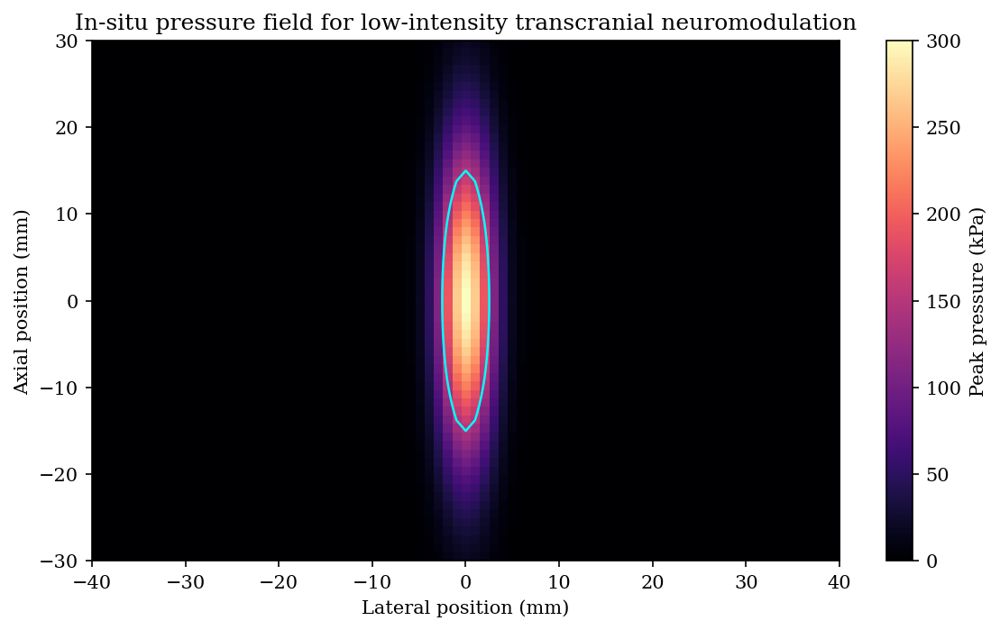
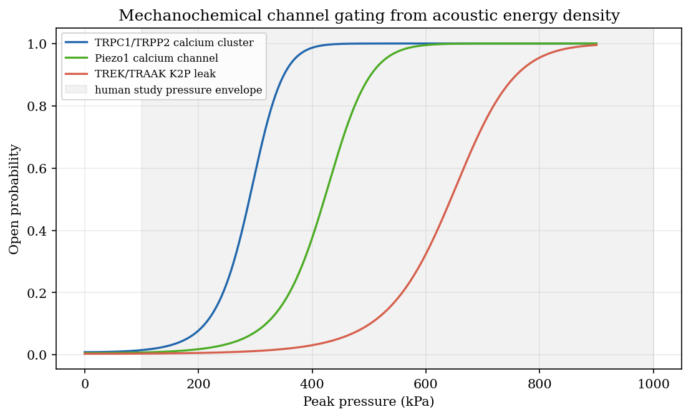
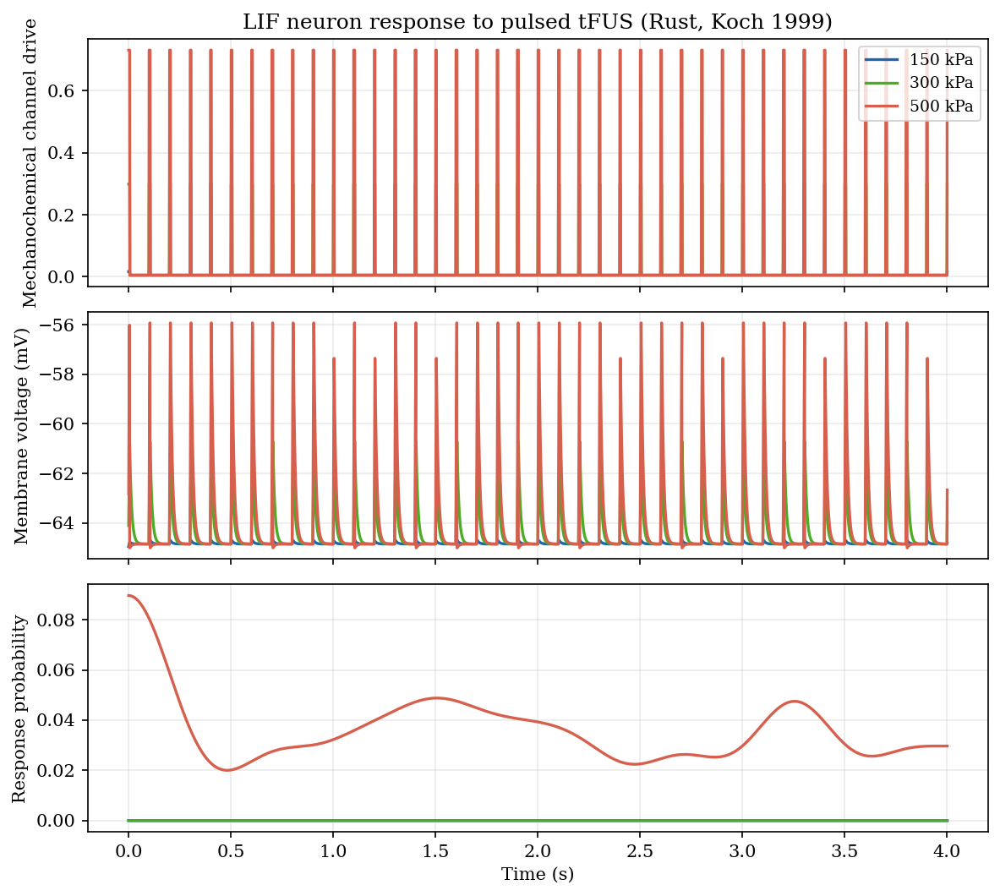
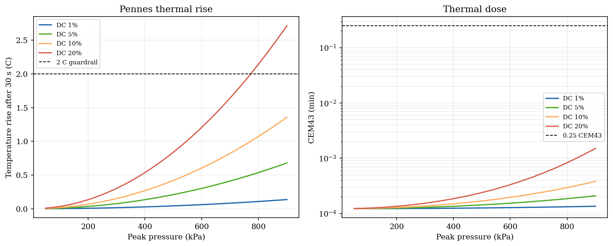
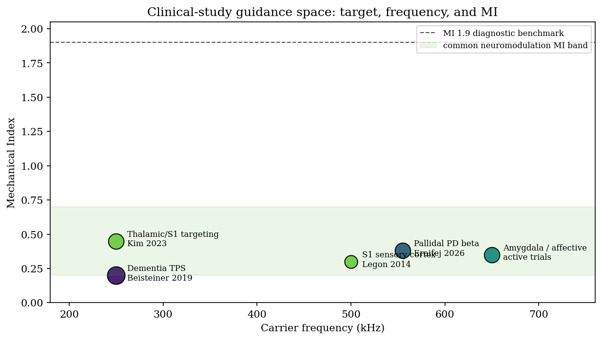
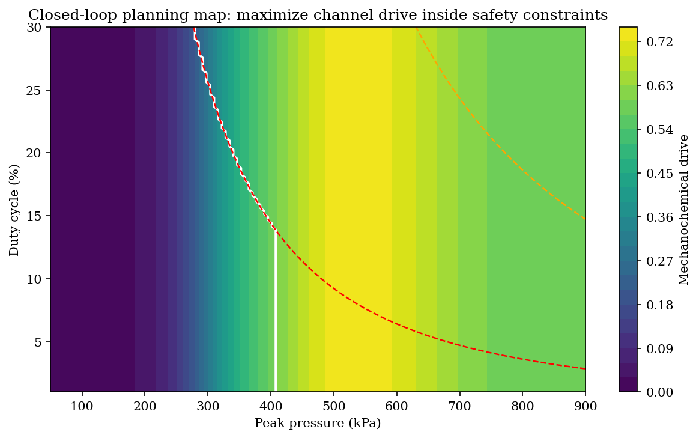

# Chapter 25 — Low-Intensity Ultrasound Neuromodulation

> **Prerequisite:** Chapter 16 (Safety and Dosimetry), Chapter 15
> (Transcranial Ultrasound), Chapter 17 (Sonogenetics), Chapter 23
> (BBB Opening), and Chapter 24 (Transcranial HIFU and BBB Treatment
> Planning).

---

## 25.1 Scope

Low-intensity transcranial ultrasound stimulation (TUS/tFUS/LIFUS) uses
sub-ablative acoustic pulses to reversibly alter neural excitability.  This
chapter covers the non-genetic, microbubble-free neuromodulation case.  It is
therefore distinct from:

- HIFU ablation, where the endpoint is thermal lesioning.
- Histotripsy, where the endpoint is cavitation-mediated tissue fractionation.
- BBB opening, where systemically administered microbubbles are part of the
  intended mechanism.
- Sonogenetics, where genetic expression of ultrasound-sensitive channels
  supplies cell-type selectivity.

The executable chapter script is
`crates/kwavers-python/examples/book/ch26_neuromodulation.py`.  It simulates acoustic
focusing, MI and intensity, Pennes thermal dose, cavitation guardrails,
mechanochemical ion-channel gating, calcium accumulation, membrane-potential
response, and a closed-loop parameter guidance map.

This chapter is a simulation and research-planning specification.  It is not a
clinical treatment protocol.

---

## 25.2 Formal contract

Inputs:

- Patient or template head model with skull transmission estimate.
- Target coordinate and focal dimensions.
- Carrier frequency `f0`, peak rarefactional pressure `p-`, duty cycle, pulse
  repetition frequency, and sonication duration.
- Safety guardrails for MI, derated `I_SPTA`, temperature rise, CEM43, and
  unintended cavitation/BBB-opening risk.

Outputs:

- In-situ pressure, intensity, MI, and focal full-width at half maximum.
- Thermal trajectory `T(t)` and CEM43 dose.
- Mechanochemical drive from acoustic energy density to membrane tension.
- Channel open probabilities for endogenous mechanosensitive channels.
- Calcium and neural-response proxy time series.
- Feasible parameter region satisfying the safety inequalities.

Acceptance criteria:

$$
\mathrm{MI} = \frac{p^-_{\mathrm{MPa}}}{\sqrt{f_0[\mathrm{MHz}]}} \le 1.9
$$

$$
I_{\mathrm{SPTA}} = DC \frac{(p^-)^2}{2\rho c} \le 0.72\;\mathrm{W/cm^2}
$$

$$
\Delta T_{\max} < 2^\circ\mathrm{C}, \qquad
\mathrm{CEM43} < 0.25\;\mathrm{min}, \qquad
P_{\mathrm{cav}}(\mathrm{MI}) < 0.1.
$$

Reject a candidate protocol when any inequality fails, when skull attenuation is
not modeled, when sham/auditory masking is absent from a human-effect claim, or
when a claimed clinical endpoint is inferred from a mechanism-only simulation.

---

## 25.3 Acoustic exposure model

For the simulation chapter, the in-situ focus is represented as an ellipsoidal
Gaussian pressure envelope:

$$
p(x,y,z)=p_0
\exp\left[-\frac{1}{2}\left(
\frac{x^2+y^2}{\sigma_\perp^2}+\frac{z^2}{\sigma_z^2}
\right)\right].
$$

The defaults match the human neuromodulation scale reported in the literature:
`f0 = 500 kHz`, lateral FWHM `5 mm`, axial FWHM `30 mm`,
`p0 = 300 kPa`, `DC = 5%`, and `30 s` sonication.  The pressure and intensity
fields are in-situ values after skull transmission; free-field values must be
back-computed from a skull model rather than substituted.



*Figure 25.1. In-situ ellipsoidal-Gaussian focal pressure (§25.3) with the half-maximum contour (`kw.gaussian_beam_pressure_field_py`).*

Human neuromodulation studies commonly use approximately `0.25-0.65 MHz`,
`0.1-1.0 MPa`, pulsed delivery, and subject-specific skull modeling.  FDA
diagnostic limits (`MI <= 1.9`, `I_SPTA.3 <= 720 mW/cm^2`) are useful
benchmarks, but transcranial adult-skull heating requires additional modeling.

---

## 25.4 Mechanochemical coupling

The acoustic energy density is:

$$
E_a = \frac{p_{\mathrm{rms}}^2}{\rho c^2}.
$$

Approximating the cell membrane as a thin spherical shell with radius `R`,
the effective ultrasound-induced tension increment is:

$$
\Delta \gamma = \frac{E_a R}{2}.
$$

For channel `i`, open probability follows a two-state Boltzmann law:

$$
P_i(\Delta\gamma)=
\left[
1+\exp\left(-\frac{\Delta\gamma-\gamma_{1/2,i}}{s_i}\right)
\right]^{-1}.
$$

The channel drive combines calcium-permeable excitation and K2P leak-current
inhibition:

$$
u(t)=
\frac{\sum_i w_i P_i(\Delta\gamma(t))}
{\sum_i |w_i|}.
$$

The default channel set models the mechanisms reported for endogenous
ultrasound sensitivity:

| Channel family | Role in the chapter model | Mechanism |
|---|---:|---|
| TRPC1/TRPP2 cluster | Excitatory calcium entry | Mechanosensitive calcium accumulation |
| Piezo1 | Excitatory calcium entry | Membrane-tension-gated cation current |
| TREK/TRAAK K2P | Inhibitory leak current | Mechanosensitive potassium conductance |

The channel parameters are not patient-specific biomarkers.  They are a
mechanistic simulation layer used to rank protocols after acoustic and thermal
constraints have already been satisfied.



*Figure 25.2. Per-channel Boltzmann open probability $P_i(\Delta\gamma)$ vs pressure (§25.4; `kw.boltzmann_open_probability_py`, `kw.coupled_channel_drive_py`): excitatory TRPC1/Piezo1 entry against inhibitory TREK/TRAAK leak.*

---

## 25.5 Chemical and neural response model

The chemical state is a calcium proxy:

$$
\frac{dC}{dt}=\frac{C_0 + G_C\max(u,0)-C}{\tau_C}.
$$

The membrane-potential proxy is:

$$
\frac{dV}{dt}=
\frac{V_0 + G_V C - G_K\max(-u,0)-V}{\tau_V}.
$$

The observable target-engagement probability is:

$$
P_{\mathrm{resp}}(t)=
\left[1+\exp\left(-\frac{V(t)-V_{50}}{s_V}\right)\right]^{-1}.
$$

The model encodes four mechanism constraints:

- Mechanical energy reaches the membrane before it becomes a chemical signal.
- Calcium accumulates over tens to hundreds of milliseconds, consistent with
  observed ultrasound-response latencies.
- Potassium leak can suppress excitability even when calcium channels activate.
- Thermal dose and cavitation risk remain separate rejection criteria, not
  explanatory shortcuts.



*Figure 25.3. Mechanochemical response (§25.5): calcium proxy $C(t)$, membrane potential $V(t)$, and target-engagement probability $P_\mathrm{resp}(t)$ across three drive pressures (`kw.simulate_lif_neuron_py`).*

### 25.5.1 Mechanistic electrical pathway: Hodgkin–Huxley + intramembrane cavitation (NICE)

> **Module ownership**: `kwavers_physics::acoustics::therapy::neuromodulation`

The calcium/voltage proxy above is phenomenological. For the *electrical* coupling
mechanism — Blackmore et al. (2019) mechanism (i): membrane-capacitance change via
flexoelectric/conformational and intramembrane-cavitation effects — `kwavers`
provides a conductance-based model behind a `Membrane` trait. Two implementors are
available: the classic Hodgkin–Huxley (1952) squid axon (`HhParams`, validated
against the 1952 reference) and the **Pospischil et al. (2008) cortical neuron**
(`CorticalNeuron`, regular- and fast-spiking presets) — the Na/Kd/M-current/leak
model the NICE framework of Plaksin et al. (2014) actually uses. Because the RS and
FS classes have different conductances and kinetics, they respond differently to
the same intramembrane-cavitation drive (cell-type selectivity, Plaksin et al.
2016). This complements the mechanosensitive-channel pathway of Chapter 17
(mechanism (ii)) and the thermal pathway (`yoo_thermal_neural_response`).

**Hodgkin–Huxley membrane with a displacement current (Plaksin et al. 2014, Eq. 1).**
A time-varying membrane capacitance $C_m(t)$ injects a charge-redistribution
(displacement) current $-V_m\,dC_m/dt$ into the membrane equation:

$$
\frac{dV_m}{dt}=-\frac{1}{C_m}\Big[V_m\frac{dC_m}{dt}
+ \bar g_{Na} m^3 h\,(V_m-E_{Na})
+ \bar g_K n^4\,(V_m-E_K)
+ \bar g_L\,(V_m-E_L)\Big],
$$

with the standard voltage-gated kinetics $\dot x=\alpha_x(V_m)(1-x)-\beta_x(V_m)x$
for $x\in\{m,h,n\}$. With $dC_m/dt=0$ this reduces to the canonical HH model
(`simulate_hh`), validated against the 1952 squid-axon reference (resting
$m_\infty/h_\infty/n_\infty$, $\approx +40$ mV overshoot, monotone f–I curve).

**Intramembrane cavitation and the curved-dome capacitance (Plaksin Eq. 8).**
The acoustic carrier drives a nanoscale gas cavity between the bilayer leaflets,
deflecting them by $Z(t)\ge 0$. The membrane capacitance follows the exact
curved-dome geometry

$$
C_m(Z)=\frac{C_{m0}\,\Delta}{a^2}\left[
Z+\frac{a^2-Z^2-Z\Delta}{2Z}\,
\ln\!\left(\frac{2Z+\Delta}{\Delta}\right)\right],
\qquad C_m(0)=C_{m0},
$$

for a sonophore of radius $a$ and rest gap $\Delta$ (`bls_capacitance`,
`BilayerSonophore`). The resulting *asymmetric* $C_m(t)$ — unlike a symmetric
sinusoid — rectifies the leak current into a net charge accumulation.

**Predicted behaviour (reproduced and tested).** During sonication the membrane
*hyperpolarises* (the carrier-rate capacitive oscillations are hyperpolarising);
the membrane charge $Q=C_mV_m$ accumulates; and when the stimulus ends and $C_m$
returns to baseline, the accumulated charge depolarises the membrane and evokes a
*post-stimulus* action potential, with the characteristic requirement for
sufficiently long pulses (Plaksin et al. 2014, Fig. 2; Manuel et al. 2020). This
indirect, charge-accumulation mechanism — not direct per-cycle excitation — is the
defining feature of the NICE model and is exercised by the module's value-semantic
tests (`bls_hyperpolarises_during_sonication`, `bls_accumulates_membrane_charge`,
`bls_post_stimulus_ap_with_pulse_duration_dependence`).

**Pressure-driven deflection — exact transient dynamics.** The acoustic pressure
(not the deflection) is the input. `BilayerSonophoreDynamic`
(`…::neuromodulation::bls_dynamics`) integrates the **full leaflet
Rayleigh–Plesset ODE** (Plaksin Eq. 2) — inertia, leaflet/fluid viscosity, the
intermolecular attraction/repulsion (Eq. 4–5, exponents 5/3.3, by quadrature),
elastic tension $k_A(Z/a)^2$, electrical Maxwell stress (Eq. 3), and intramembrane
gas diffusion (Eq. 6–7) — with every constant taken from the reference
implementation. The rest gap is solved from the resting-charge balance,
**reproducing Plaksin's Δ ≈ 1.26 nm from first principles**, and the steady-state
peak deflection **reproduces Plaksin Fig. 1: ≈ 10–11 nm at 500 kPa / 0.5 MHz** (vs
≈ 12 nm published), monotone in pressure and resonantly amplified above the
inertia-free value. The `Z=0` curvature singularity ($R\to\infty$) is handled
exactly as the reference — by seeding the integration with the quasi-static
deflection at the first sub-step — not by any ad-hoc regularisation; adaptive
step-doubling RK4 handles the stiffness near the steric wall.

**Evidence tier.** The neuron models (squid HH; Pospischil RS/FS), the
displacement-current coupling (Eq. 1), the capacitance geometry $C_m(Z)$ (Eq. 8),
and the **complete bilayer-sonophore transient dynamics** (Eq. 2–8, all constants
from PySONIC/Krasovitski 2011) are reproduced *exactly* from the references and
validated value-semantically — including the Fig. 1 deflection magnitude. There is
no remaining quasi-static or kinematic approximation in the deflection. Lighter
sources are also provided for speed/analysis: `BilayerSonophoreQuasistatic`
(inertia-free force balance), `BilayerSonophore` (kinematic shape), and
`CapacitanceModulation` (analytic symmetric baseline).

**Neuromodulation-specific safety.** Beyond the conservative FDA *diagnostic*
limits, `itrusst_assess` screens an exposure against the ITRUSST consensus
reference levels (Aubry et al. 2024): non-significant risk requires MI ≤ 1.9 and a
thermal criterion (peak ΔT ≤ 2 °C, or brain thermal dose ≤ 2 CEM43).

**Whole-protocol simulation (SONIC).** Carrier-resolved integration is limited
to single bursts. For second-to-minute protocols, `simulate_sonic`
(`kwavers_physics::…::neuromodulation::sonic`) implements the cycle-averaged
SONIC reduction (Lemaire et al. 2019): the membrane is recast in charge density
$Q = C_m V_m$ (a slow variable) and the Hodgkin–Huxley kinetics are averaged over
one carrier period,

$$
\frac{dQ}{dt}=I_{\mathrm{ext}}-\bar I_{\mathrm{ionic}}(Q;m,h,n),\qquad
\frac{dx}{dt}=\bar\alpha_x(Q)(1-x)-\bar\beta_x(Q)\,x,
$$

with $\langle V_m\rangle = Q\,\langle 1/C_m\rangle$ and
$\bar\alpha_x(Q)=\langle\alpha_x(Q/C_m(t))\rangle$. The reduction reproduces the
carrier-resolved result for a single burst (verified by a differential test —
matching spike count and post-stimulus AP timing) at roughly two orders of
magnitude fewer integration steps.

**Python API.** `pykwavers` exposes `hodgkin_huxley_response`,
`nice_bilayer_sonophore_response`, `nice_sonic_response` (cycle-averaged),
`nice_dynamic_response` (exact transient bilayer-sonophore),
`nice_quasistatic_response`, `bls_deflection_curve`, `cortical_sonic_response`
(RS/FS cell-type selectivity), `bilayer_capacitance_curve`, `pulse_train_dosimetry`
(Blackmore Table 1), `itrusst_safety` (ITRUSST consensus screening), and
`neuromod_threshold_pressure_pa` (bisection threshold search — the
strength–frequency/duration relationship of Plaksin Fig. 3).

---

## 25.6 Safety model

Thermal dose uses the Pennes equation:

$$
\rho C_p \frac{dT}{dt}
=2\alpha I_{\mathrm{SPTA}}
-w_b\rho_b C_b(T-T_0).
$$

CEM43 follows the Chapter 16 (Safety and Dosimetry §16.5) convention:

$$
\mathrm{CEM43}=\int R^{43-T(t)}dt,
\qquad
R=\begin{cases}
0.5 & T>43^\circ\mathrm{C}\\
0.25 & T\le 43^\circ\mathrm{C}.
\end{cases}
$$

Cavitation risk is modeled as a steep guardrail around `MI = 0.7`, below the
diagnostic MI limit but above common neuromodulation operation.  The rejection
criterion is intentionally conservative because microbubble-free
neuromodulation should not depend on cavitation or BBB-opening mechanisms.



*Figure 25.4. Thermal safety (§25.6): focal ΔT and CEM43 (`kw.acoustic_heat_source_density`, `kw.compute_cem43`) across the pressure / duty-cycle plane, with the ΔT < 2 °C and CEM43 < 0.25 min guardrails.*

---

## 25.7 Clinical evidence guidance

Clinical evidence remains heterogeneous.  As of 2026-05-12, low-intensity
transcranial ultrasound neuromodulation should be treated as investigational in
the United States outside cleared or IDE-governed research contexts.  TPS has
jurisdiction-specific authorization for Alzheimer disease in Europe, while
neuronavigated tFUS systems are primarily research devices.

| Evidence class | Example | Guidance use |
|---|---|---|
| Controlled human physiology | S1 stimulation modulated sensory evoked EEG and discrimination performance | Target-engagement and sham-design reference |
| Human systematic review | 35 human studies, 677 participants through 2022 | Safety/event-rate and heterogeneity reference |
| Mechanism experiment | Focused ultrasound excited murine cortical neurons through mechanosensitive calcium channels | Mechanochemical model support |
| Early clinical population study | Chronic pain, dementia, epilepsy, depression, PD, and stroke studies | Hypothesis generation only unless randomized evidence exists |
| 2026 PD proof-of-concept | Four male PD participants, pallidal 130-Hz TUS, STN beta reduction and reaction-time improvement | Biomarker-guided trial-design reference, not efficacy proof |

Clinical planning must include sham control, auditory masking, MRI/CT
targeting, in-situ acoustic simulation, post-sonication adverse-event capture,
and imaging/neurocognitive follow-up when the protocol enters human research.



*Figure 25.5. Clinical-evidence guidance space (§25.7): reported human-study operating points in the $(f_0, \mathrm{MI})$ plane against the diagnostic limits.*

---

## 25.8 Simulation workflow

```bash
python crates/kwavers-python/examples/book/ch26_neuromodulation.py
```

All physics runs in the kwavers Rust core via PyO3 kernels
(`kw.{gaussian_beam_pressure_field_py, mechanical_index_field,
acoustic_intensity_from_amplitude, compute_acoustic_membrane_tension_py,
boltzmann_open_probability_py, coupled_channel_drive_py, acoustic_heat_source_density,
compute_cem43, simulate_lif_neuron_py}`); the Python script only orchestrates and
plots. The closed-loop guidance map (Figure 25.6) sweeps the feasible region.



*Figure 25.6. Closed-loop guidance map (§25.2 acceptance criteria): the feasible parameter region satisfying $\mathrm{MI}\le1.9$, $I_\mathrm{SPTA}\le0.72\,\mathrm{W/cm^2}$, $\Delta T<2^\circ\mathrm{C}$, and $P_\mathrm{cav}<0.1$, with the best feasible operating point marked.*

The figures (`docs/book/figures/ch26/`) are generated by
`crates/kwavers-python/examples/book/ch26_neuromodulation.py`, which also writes `metrics.json`
(default protocol parameters, peak MI, peak `I_SPTA`, default thermal dose, and the
best feasible guidance-grid point):

| Figure | Content | Section |
|---|---|---|
| 25.1 | In-situ focal pressure + half-maximum contour | §25.3 |
| 25.2 | Mechanochemical channel activation vs pressure | §25.4 |
| 25.3 | Calcium, voltage, response probability (150/300/500 kPa) | §25.5 |
| 25.4 | Pennes temperature rise + CEM43 vs pressure/duty cycle | §25.6 |
| 25.5 | Clinical-study guidance space by frequency and MI | §25.7 |
| 25.6 | Closed-loop feasible parameter map | §25.8 |

---

## 25.9 References

- Legon W. et al. *Transcranial focused ultrasound modulates the activity of
  primary somatosensory cortex in humans.* Nature Neuroscience **17**,
  322-329, 2014. doi:10.1038/nn.3620
- Sarica C. et al. *Human studies of transcranial ultrasound
  neuromodulation: a systematic review of effectiveness and safety.* Brain
  Stimulation **15**(3), 737-746, 2022. doi:10.1016/j.brs.2022.05.002
- Pasquinelli C. et al. *Safety of transcranial focused ultrasound
  stimulation: a systematic review of the state of knowledge from both human
  and animal studies.* Brain Stimulation **12**(6), 1367-1380, 2019.
  doi:10.1016/j.brs.2019.07.024
- Yoo S. et al. *Focused ultrasound excites cortical neurons via
  mechanosensitive calcium accumulation and ion channel amplification.*
  Nature Communications **13**, 493, 2022. doi:10.1038/s41467-022-28040-1
- Legon W., Strohman A. *Low-intensity focused ultrasound for human
  neuromodulation.* Nature Reviews Methods Primers **4**, 91, 2024.
  doi:10.1038/s43586-024-00368-6
- Martin E. et al. *ITRUSST Consensus on Standardised Reporting for
  Transcranial Ultrasound Stimulation.* arXiv:2402.10027, 2024.
  doi:10.48550/arXiv.2402.10027
- Beisteiner R. et al. *Transcranial Pulse Stimulation with Ultrasound in
  Alzheimer's Disease-A New Navigated Focal Brain Therapy.* Advanced Science
  **7**(3), 1902583, 2019. doi:10.1002/advs.201902583
- Eraifej J. et al. *Suppression of pathological oscillations with
  transcranial focused ultrasound in Parkinson's disease.* Nature
  Communications, early-access version, 2026.
- FDA. *Marketing Clearance of Diagnostic Ultrasound Systems and Transducers:
  Guidance for Industry and Food and Drug Administration Staff.* Acoustic
  output limits: `I_SPTA.3 <= 720 mW/cm^2`, `MI <= 1.9`, or
  `I_SPPA.3 <= 190 W/cm^2`.
