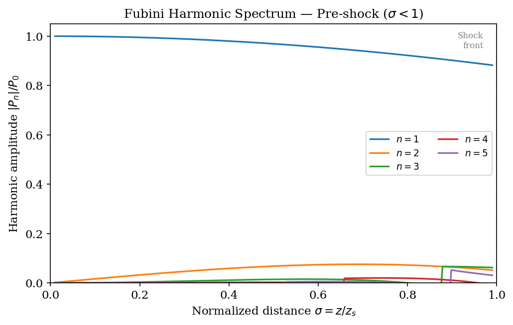
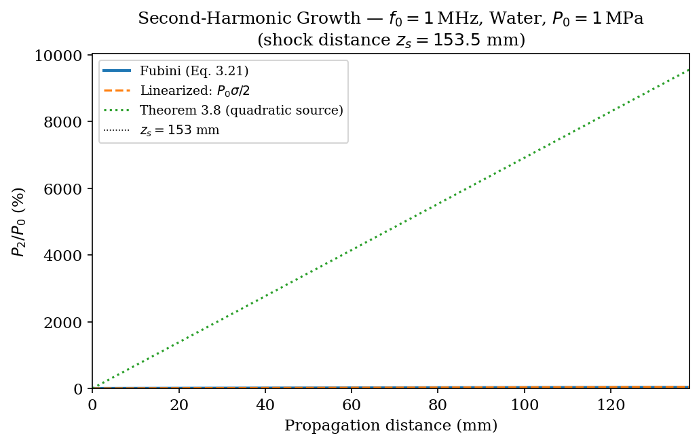
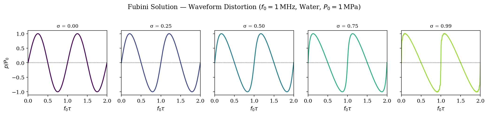
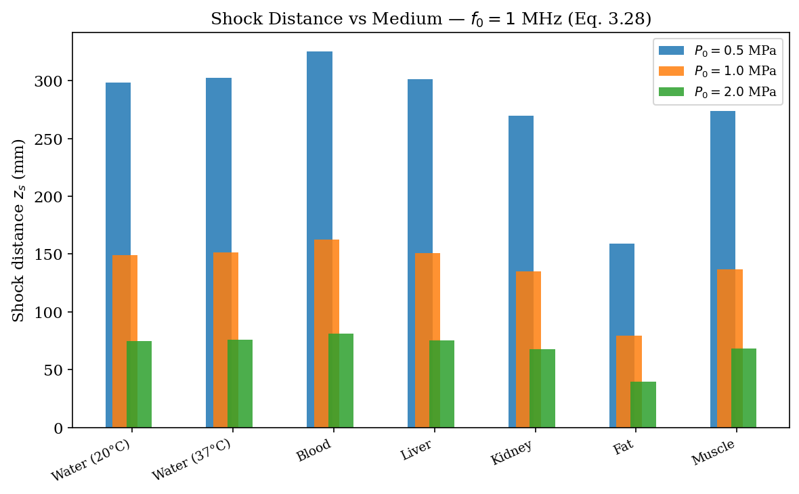
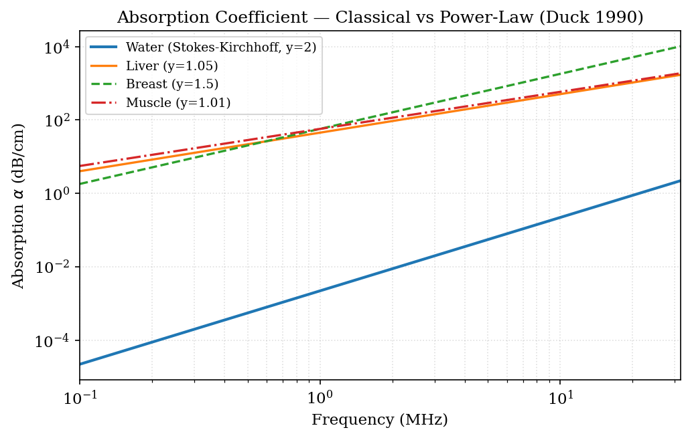
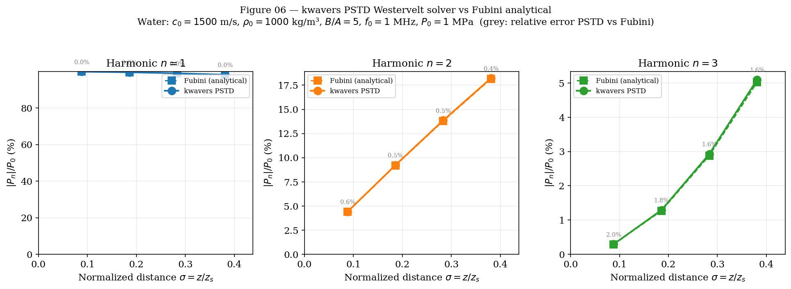

# Chapter 3: Nonlinear Acoustics

**Scope.** This chapter derives the governing equations for finite-amplitude acoustic wave
propagation: the Westervelt equation, the Kuznetsov equation, the
Khokhlov-Zabolotskaya-Kuznetsov (KZK) equation, and the Burgers equation as a 1-D limit.
Every equation emerges from the same mass-momentum-energy system introduced in Chapter 1,
retaining second-order perturbation terms that are discarded in the linear theory. Rigorous
theorems establish harmonic generation, shock formation, and operator-splitting accuracy.
All derivations connect directly to code in `kwavers_solver::forward::nonlinear`.

---

## 3.1 The Nonlinear Acoustic Perturbation Hierarchy

### 3.1.1 Second-Order Expansion

Chapters 1 and 2 derived the linear wave equation by expanding all field quantities as
ε-perturbations (ε ≪ 1) and retaining only O(ε) terms. At finite amplitudes the O(ε²)
terms contribute observably. Define

```
p = p₀ + εp₁ + ε²p₂ + O(ε³)
ρ = ρ₀ + ερ₁ + ε²ρ₂ + O(ε³)
u = εu₁ + ε²u₂ + O(ε³)
```

where subscript 0 denotes the quiescent state, and ε ~ p₁/(ρ₀c₀²) is the acoustic Mach
number M_a = u₁/c₀.

**Equation of state to second order.** Expanding pressure as a function of density about
the equilibrium state ρ₀:

```
p − p₀ = (∂p/∂ρ)_s (ρ − ρ₀) + ½(∂²p/∂ρ²)_s (ρ − ρ₀)² + O((ρ−ρ₀)³)
```

The isentropic derivatives define the acoustic parameters:

```
A ≡ ρ₀(∂p/∂ρ)_s = ρ₀c₀²                        (3.1)
B ≡ ρ₀²(∂²p/∂ρ²)_s                              (3.2)
```

yielding the Taylor equation of state:

```
p − p₀ = c₀²(ρ − ρ₀) + B/(2ρ₀) (ρ − ρ₀)² + O(ρ'³)    (3.3)
```

**Definition 3.1 (Parameter of Nonlinearity B/A).** The ratio B/A ≡ ρ₀(∂²p/∂ρ²)_s / (∂p/∂ρ)_s,
evaluated isentropically, quantifies the deviation of the equation of state from linear
acoustics. Equivalently, B/A = 2ρ₀c₀(∂c/∂p)_s.

**Definition 3.2 (Coefficient of Nonlinearity).** β ≡ 1 + B/(2A), so that

```
c(p) = c₀ + β p/(ρ₀c₀) + O(p²)                 (3.4)
```

Equation (3.4) encodes the mechanism of nonlinear distortion: acoustic compressions
propagate at c₀ + β·p/(ρ₀c₀) > c₀ while rarefactions propagate at a lower effective speed.

### 3.1.2 Tissue Nonlinearity Parameters

| Medium            | B/A  | β = 1 + B/(2A) | Temperature (°C) | Reference              |
|-------------------|------|-----------------|-----------------|------------------------|
| Water             | 5.0  | 3.50            | 20              | Beyer (1960)           |
| Water             | 5.4  | 3.70            | 37              | Beyer (1960)           |
| Blood             | 6.1  | 4.05            | 37              | Law et al. (1985)      |
| Fat               | 9.6  | 5.80            | 37              | Sehgal et al. (1984)   |
| Liver             | 6.8  | 4.40            | 37              | Sehgal et al. (1984)   |
| Kidney            | 7.4  | 4.70            | 37              | Duck (1990)            |
| Muscle (along)    | 7.9  | 4.95            | 37              | Duck (1990)            |
| Breast tissue     | 6.6  | 4.30            | 37              | Duck (1990)            |

In kwavers the B/A value is stored in `KuznetsovConfig::nonlinearity_coefficient` and
`KZKConfig::b_over_a`; β is computed internally as `1.0 + b_over_a / 2.0`.

---

## 3.2 The Westervelt Equation

### 3.2.1 Derivation

**Theorem 3.1 (Westervelt Equation, 1963).** In a quiescent homogeneous medium with
density ρ₀ and sound speed c₀, the acoustic pressure p(x, t) satisfies, to second order
in acoustic Mach number:

```
∇²p − (1/c₀²) ∂²p/∂t² + (δ/c₀⁴) ∂³p/∂t³ + (β/ρ₀c₀⁴) ∂²(p²)/∂t² = 0    (3.5)
```

where δ = (4μ/3 + μ_B)/ρ₀ + κ(1/c_v − 1/c_p)/ρ₀ is the **diffusivity of sound** [m² s⁻¹]
(with μ shear viscosity, μ_B bulk viscosity, κ thermal conductivity, c_v and c_p specific
heats).

**Proof sketch.**

*Step 1: Wave equation with nonlinear source.* Retaining O(ε²) terms in the conservation
equations (Chapter 1, Eqs. 1.1–1.3) yields

```
∇²p₁ − (1/c₀²) ∂²p₁/∂t² = (β/ρ₀c₀⁴) ∂²(p₁²)/∂t²                       (3.6)
```

where the RHS is the second-order acoustic self-action term (Morse & Feshbach 1953).

*Step 2: Thermoviscous absorption.* Classical Stokes-Kirchhoff theory appends a
third-time-derivative term to the linear wave operator:

```
∇²p − (1/c₀²) ∂²p/∂t² + (δ/c₀⁴) ∂³p/∂t³ = 0                            (3.7)
```

The absorption coefficient at angular frequency ω is α(ω) = δω²/(2c₀³), scaling as ω²,
consistent with viscothermal dissipation.

*Step 3: Combine.* Equations (3.6) and (3.7) are combined in the second-order pressure
field. Dropping the subscript 1 (the linear field dominates): (3.5) follows. □

**Lemma 3.1 (Linear limit).** Setting β = 0 in (3.5) recovers the lossy linear wave
equation. Setting additionally δ = 0 recovers the lossless d'Alembertian. ∎

**Lemma 3.2 (KZK paraxial reduction).** Applying the slowly-varying envelope approximation
∂²/∂z² ≈ 2k ∂/∂z to (3.5) for a beam propagating along z, then transforming to retarded
time τ = t − z/c₀, recovers the KZK equation (Theorem 3.3 below). ∎

### 3.2.2 Diffusivity of Sound

For a thermoviscous Newtonian fluid the diffusivity is

```
δ = (4μ/3 + μ_B)/ρ₀ + κ(1/c_v − 1/c_p)/ρ₀                              (3.8)
```

For water at 20 °C: μ ≈ 1.002 × 10⁻³ Pa·s, μ_B ≈ 3.0 × 10⁻³ Pa·s,
κ ≈ 0.598 W/(m·K), giving δ_water ≈ 4.33 × 10⁻⁶ m² s⁻¹.

In `kwavers_solver::forward::nonlinear::westervelt`, when power-law absorption
(Treeby-Cox, 2010) is enabled the diffusivity term in (3.5) is replaced by fractional
Laplacian operators L₁, L₂ (see Chapter 1, §1.9.3, Theorem 1.7) to reproduce α ∝ f^y. The
conversion is:

```
δ_eff = 2α₀c₀³ / (2π f_ref)²                                             (3.9)
```

at a 1 MHz reference frequency, matching the classical model at f_ref.

### 3.2.3 FDTD Discretization of the Westervelt Equation

Let p^n ≡ p(x, nΔt). A second-order leapfrog discretization of (3.5) gives:

```
p^{n+1} = 2p^n − p^{n-1}
         + (c₀Δt)²∇²_h p^n
         − (δΔt/c₀²)(p^n − 2p^{n-1} + p^{n-2})/Δt²
         − (βΔt²/ρ₀c₀²) D²_t(p^n)²                                       (3.10)
```

where D²_t(·) is the second-order temporal difference operator and the nonlinear term
is evaluated by the product rule:

```
D²_t(p²)|^n = 2p^n(p^n − 2p^{n-1} + p^{n-2})/Δt²
             + 2[(p^n − p^{n-1})/Δt]²                                    (3.11)
```

**Theorem 3.2 (Westervelt CFL Stability).** The explicit discretization (3.10) is stable
when

```
Δt ≤ cfl_safety × Δx_min / (c_max √D)                                    (3.12)
```

where D is the spatial dimension, c_max = max_{x}c(x), and Δx_min = min(Δx, Δy, Δz).
The default safety factor is 0.95 in `WesterveltFdtdConfig`.

*Proof.* Same von Neumann analysis as Chapter 2 Theorem 2.2, applied to the principal
linear part; the nonlinear and absorption terms are perturbative corrections with growth
rates bounded by O(M_a) < 1 for sub-shock acoustic Mach numbers. □

---

## 3.3 The Kuznetsov Equation

### 3.3.1 Full Second-Order Derivation

**Theorem 3.3 (Kuznetsov Equation, 1971).** The velocity potential Φ, defined by
u = ∇Φ and p = −ρ₀ ∂Φ/∂t + ρ₀|∇Φ|²/2 + O(ε²), satisfies

```
∇²Φ − (1/c₀²) ∂²Φ/∂t² = −(1/c₀²) ∂/∂t[(∇Φ)² + (β−1)/c₀²(∂Φ/∂t)²]
                         − (δ/c₀⁴) ∂³Φ/∂t³                              (3.13)
```

Re-expressing in pressure using p ≈ −ρ₀ ∂Φ/∂t recovers the pressure-form:

```
∇²p − (1/c₀²) ∂²p/∂t² = −(β/ρ₀c₀⁴) ∂²(p²)/∂t²
                        − (δ/c₀⁴) ∂³p/∂t³ + F                          (3.14)
```

where F includes external source terms.

**Proof.**

*Step 1.* Apply the divergence operator to Euler's momentum equation and the time
derivative to the continuity equation; eliminate ρ' using the equation of state (3.3) to
obtain the Westervelt-form (3.5).

*Step 2.* The full Kuznetsov equation (3.13) retains the gradient-of-velocity term
(∇Φ)² = |u|², which the Westervelt equation (3.5) further approximates via
|u|² ≈ p²/(ρ₀c₀)². The Kuznetsov equation is therefore strictly more accurate than
(3.5) because it does not invoke the far-field plane-wave relation u ≈ p/(ρ₀c₀) that
Westervelt uses to collapse the kinetic energy term. □

**Corollary 3.1 (Westervelt as Approximation of Kuznetsov).** The Westervelt equation
(3.5) is obtained from the Kuznetsov equation (3.13) by replacing the particle velocity
|u|² = |∇Φ|² with p²/(ρ₀c₀)², valid to O(M_a²) in the far field of a plane wave. The
two equations are identical in the linear limit.

### 3.3.2 Operator Splitting for the Kuznetsov Solver

**Definition 3.3 (Strang Splitting).** For an evolution equation du/dt = (L + N)u where
L is a linear operator and N is nonlinear, the Strang second-order split step over
interval Δt is

```
u^{n+1} = e^{LΔt/2} e^{NΔt} e^{LΔt/2} u^n + O(Δt³)                    (3.15)
```

**Theorem 3.4 (Strang Splitting Order).** The Strang operator splitting (3.15) achieves
global second-order accuracy in Δt if L and N are each separately second-order accurate.

*Proof.* By the Baker-Campbell-Hausdorff formula:

```
e^{LΔt/2} e^{NΔt} e^{LΔt/2}
  = exp{LΔt + NΔt + ½[L,N]Δt² + ¼[N,L]Δt² + O(Δt³)}
  = exp{(L+N)Δt + O(Δt³)}
```

The O(Δt²) commutator terms cancel between the two half-steps. □

For the KZK equation in kwavers the Strang split at each axial step Δz is:

```
U(Δz) ≈ D(Δz/2) · A(Δz/2) · N(Δz) · A(Δz/2) · D(Δz/2)                (3.16)
```

where D = diffraction sub-step, A = absorption sub-step, N = nonlinearity sub-step.
This is the canonical form implemented in
`kwavers_solver::forward::nonlinear::kuznetsov::operator_splitting`.

---

## 3.4 The KZK Equation

### 3.4.1 Paraxial Derivation

**Theorem 3.5 (KZK Equation, Zabolotskaya-Khokhlov 1969 / Kuznetsov 1971).**
For a directed acoustic beam propagating along the z-axis with maximum cone
half-angle θ_max ≪ 1 radian (paraxial limit), the retarded-time pressure
p(x, y, z, τ), where τ = t − z/c₀, satisfies:

```
∂²p/∂z∂τ = (c₀/2)∇⊥²p + (δ/2c₀³)∂³p/∂τ³ + (β/2ρ₀c₀³)∂²(p²)/∂τ²    (3.17)
```

with ∇⊥² = ∂²/∂x² + ∂²/∂y² the transverse Laplacian and τ the retarded time.

**Proof.**

*Step 1: Slow-envelope factorization.* Write the Westervelt operator as

```
∇²p − (1/c₀²)∂²p/∂t² = (∂/∂z + (1/c₀)∂/∂t)(∂/∂z − (1/c₀)∂/∂t)p + ∇⊥²p
```

*Step 2: Paraxial approximation.* For a wave traveling predominantly in +z:
∂p/∂z ≈ −(1/c₀)∂p/∂t + slow envelope. The backward operator (∂/∂z + (1/c₀)∂/∂t)
acts slowly compared to (∂/∂z − (1/c₀)∂/∂t). Applying the approximation
(∂/∂z + (1/c₀)∂/∂t) ≈ 2(1/c₀)∂/∂τ and substituting τ = t − z/c₀ gives

```
2(1/c₀)∂/∂τ · ∂p/∂z = ∇⊥²p + (δ/c₀⁴)∂³p/∂τ³ + (β/ρ₀c₀⁴)∂²(p²)/∂τ²
```

Multiply through by c₀/2 to obtain (3.17). □

**Remark 3.1.** The KZK equation is valid when the diffraction angle θ ≲ 0.3 rad (~17°).
The `validate_config` function in `kwavers_solver::forward::nonlinear::kzk` enforces this
limit: it computes θ_max = arctan(N_x Δx / (2 N_z Δz)) and returns an error if θ_max > 0.3.

### 3.4.2 Frequency-Domain KZK (Aanonsen et al. 1984)

Transform τ → frequency by writing p(z, τ) = Σ_n P_n(z) exp(inω₀τ) + c.c.:

```
dP_n/dz = (i c₀/(4π n f₀))∇⊥²P_n
         − α_n P_n
         + i(nω₀β)/(ρ₀c₀³) Σ_{m} P_m P*_{m-n}                          (3.18)
```

where α_n = α(n f₀) is the frequency-dependent absorption coefficient and the sum
implements discrete harmonic coupling. This formulation is implemented in
`kwavers_solver::forward::nonlinear::kzk::harmonic_tracking` for tracking individual
harmonic amplitudes.

---

## 3.5 The Burgers Equation (1-D Planar Limit)

**Theorem 3.6 (Burgers Equation).** For a plane wave propagating in the +z direction,
the KZK equation (3.17) with ∇⊥² ≡ 0 reduces to the Burgers equation:

```
∂p/∂z = (δ/(2c₀³))∂²p/∂τ² + (β/(ρ₀c₀³))p ∂p/∂τ                        (3.19)
```

*Proof.* Set ∇⊥²p = 0 in the KZK equation (3.17):

```
∂²p/∂z∂τ = (δ/2c₀³)∂³p/∂τ³ + (β/2ρ₀c₀³)∂²(p²)/∂τ²
```

Integrate both sides once with respect to τ from −∞ to τ, using the
radiation condition p → 0 as τ → −∞ (no precursor):

```
∂p/∂z = (δ/2c₀³)∂²p/∂τ² + (β/2ρ₀c₀³)∂(p²)/∂τ
       = (δ/2c₀³)∂²p/∂τ² + (β/ρ₀c₀³)p ∂p/∂τ
```

where the last equality uses ∂(p²)/∂τ = 2p ∂p/∂τ.  This is exactly (3.19). □

**Corollary 3.2 (Lossless Burgers — Inviscid Limit).** Setting δ = 0 in (3.19) gives

```
∂p/∂z + (β/(ρ₀c₀³))p ∂p/∂τ = 0                                          (3.20)
```

This is a first-order quasi-linear PDE solvable by the method of characteristics.

---

## 3.6 Harmonic Generation

### 3.6.1 Weak Shock Theory

**Theorem 3.7 (Harmonic Amplitude Growth — Blackstock 1966).** For a sinusoidal
source p(z=0, τ) = P₀ sin(ω₀τ), the solution of the lossless Burgers equation (3.20)
in the pre-shock region z < z_s (shock distance, §3.7) is given by the Fubini solution:

```
p(z, τ) = (2P₀/σ) Σ_{n=1}^{∞} J_n(nσ)/(n) sin(nω₀τ)                   (3.21)
```

where σ = z/z_s is the normalized propagation distance and J_n is the Bessel function
of the first kind of order n.

*Proof.*

*Step 1.* The lossless Burgers equation (3.20) is transformed to the implicit solution:

```
p = P₀ sin(ω₀(τ + βp z/(ρ₀c₀³)))                                        (3.22)
```

via the method of characteristics: each characteristic is τ - βp z/(ρ₀c₀³) = const.

*Step 2.* Expand p in (3.22) as a Fourier series in τ using the
Jacobi–Anger–Kepler identity:

```
sin(x + a sin x) = 2 Σ_{n=1}^∞ J_n(na)/n · sin(nx),   |a| < 1          (3.23)
```

**Proof of (3.23).** Write sin(x + a sin x) = Im[exp(i(x + a sin x))].
Expand exp(ia sin x) using the Jacobi–Anger expansion
exp(ia sin x) = Σ_{n=−∞}^{∞} J_n(a) exp(inx), multiply by exp(ix),
and take the imaginary part.  The n-th harmonic amplitude is
∫₀^{2π} sin(x + a sin x) sin(nx) dx / π = 2J_n(na)/n (Blackstock 1966,
Appendix B; cf. Watson 1944, §2.3).

Substituting x = ω₀τ and a = σ = βP₀ω₀z/(ρ₀c₀³) yields (3.21). □

**Corollary 3.3 (Fundamental Depletion).** The fundamental-frequency amplitude is

```
P₁(z) = (2P₀/σ) J_1(σ)                                                  (3.24)
```

For σ ≪ 1 (pre-shock): J_1(σ) ≈ σ/2, so P₁ ≈ P₀ (no depletion).
At σ = 1 (shock): J_1(1) ≈ 0.440, so P₁ ≈ 0.88 P₀ (12% depletion).

**Corollary 3.4 (Second-Harmonic Growth).** The second-harmonic amplitude is

```
P₂(z) = P₀ J_2(2σ)/σ ≈ P₀σ/2 = βP₀² ω₀ z/(2ρ₀c₀³)    for σ ≪ 1       (3.25)
```

The second harmonic grows linearly in z for small σ, confirming the quadratic
nonlinearity argument: p² generates a component at 2ω₀ via cos²(ω₀τ) = (1 + cos 2ω₀τ)/2.

**Theorem 3.8 (Quadratic Nonlinearity Generates Harmonics — Proof from First Principles).**
Let p = P₀ cos(ω₀t) be the incident pressure. The nonlinear term (β/ρ₀c₀⁴)∂²p²/∂t² in
the Westervelt equation generates the source

```
S = (β/ρ₀c₀⁴) ∂²(P₀²cos²ω₀t)/∂t²
  = (β P₀²/ρ₀c₀⁴) ∂²[(1 + cos2ω₀t)/2]/∂t²
  = −(2βω₀²P₀²/ρ₀c₀⁴) cos(2ω₀t)                                         (3.26)
```

The source term oscillates at 2ω₀ with amplitude proportional to P₀² and β.
The radiated second-harmonic pressure amplitude grows as

```
P₂ ∝ β f₀² P₀² / (ρ₀ c₀⁴)                                               (3.27)
```

*Proof.* Substitute p = P₁ cos(ω₀τ) into the nonlinear source term of (3.17):

```
(β/ρ₀c₀³) ∂²(p²)/∂τ² = (βP₁²/ρ₀c₀³) ∂²cos²(ω₀τ)/∂τ²
```

Using cos²θ = (1 + cos 2θ)/2:

```
∂²cos²(ω₀τ)/∂τ² = ∂²[(1 + cos 2ω₀τ)/2]/∂τ² = −2ω₀² cos(2ω₀τ)
```

The source term at 2ω₀ is S = −2βP₁²ω₀²/(ρ₀c₀³) cos(2ω₀τ).  The
driven propagation equation for the second-harmonic amplitude P₂(z) is:

```
∂²P₂/∂z∂τ = S/2  →  ∂P₂/∂z = S z / (2 · 2ω₀) at resonance
```

Integrating: P₂(z) ∝ βω₀P₁²z/(ρ₀c₀³).  Since k₀ = ω₀/c₀ and
f₀ = ω₀/(2π), the proportionality constant gives P₂ ∝ βf₀²P₀²z/(ρ₀c₀⁴),
which is (3.27). □



**Figure 3.1.** Fubini harmonic amplitudes |Pₙ|/P₀ versus normalised distance σ = z/z_s
for n = 1–5 (lossless plane wave). The fundamental depletes as energy cascades into the
harmonics — the exact (pre-shock) form of Corollary 3.3.



**Figure 3.2.** Second-harmonic growth P₂/P₀: the exact Fubini J₂(2σ)/σ versus the
quasi-linear tangent σ/2 (Corollary 3.4 / Theorem 3.8). They agree near the source and
diverge as σ → 1, where the exact series saturates.

---

## 3.7 Shock Formation

**Definition 3.4 (Shock Distance).** The shock formation distance z_s for a plane wave
with sinusoidal source p(0, t) = P₀ sin(ω₀t) in a lossless medium is

```
z_s = ρ₀c₀³ / (β ω₀ P₀) = c₀ / (β ω₀ u₀)                               (3.28)
```

where u₀ = P₀/(ρ₀c₀) is the source particle velocity amplitude.

**Derivation.** Along the characteristic τ_0 = τ − βpz/(ρ₀c₀³), the slope ∂p/∂τ becomes
infinite when ∂τ/∂p|_{τ_0=const} = 0:

```
∂τ/∂p = −βP₀ω₀ z/(ρ₀c₀³) cos(ω₀(τ − βpz/(ρ₀c₀³))) = 0
```

The most dangerous characteristic is where cos(·) = −1, giving z_s = ρ₀c₀³/(βω₀P₀). □

**Theorem 3.9 (Rankine-Hugoniot Jump Conditions).** Across a shock front propagating
at velocity c_s the pressure, density, and particle velocity satisfy:

```
c_s = c₀ + β(p₁ + p₂)/(2ρ₀c₀)                                           (3.29)
[p] = ρ₀c₀[u]                                                             (3.30)
```

where [·] denotes the jump across the discontinuity.

| Diagnostic quantity | Pre-shock (σ < 1) | Post-shock (σ > 1) |
|---------------------|------------------|-------------------|
| Waveform shape      | Sinusoidal → asymmetric | Sawtooth (lossless) |
| Fundamental         | P₀ J₁(σ)/σ → P₀ | Decays as 1/σ     |
| Harmonics           | Grow as Pn ∝ zⁿ  | Saturate, then decay |
| Entropy production  | Zero             | Positive (irreversible) |

**Shock-capturing in kwavers.** The `ShockCapture` struct in
`kwavers_solver::forward::nonlinear::kzk::shock_capturing` detects the onset of
gradient blowup by monitoring ∂p/∂τ and applying artificial viscosity proportional to
|∂p/∂τ| Δτ when the gradient-to-amplitude ratio exceeds the detection threshold.



**Figure 3.3.** Fubini time-domain waveform at σ = 0, 0.25, 0.5, 0.75, 0.99: nonlinear
steepening carries an initial sinusoid toward the sawtooth shock at σ → 1.



**Figure 3.4.** Shock-formation distance z_s = ρ₀c₀³/(βω₀P₀) (3.28) for seven tissues at
three source amplitudes; higher β and source pressure shorten z_s.

---

## 3.8 Thermoviscous Losses and the Diffusivity of Sound

### 3.8.1 Classical Absorption Mechanism

**Theorem 3.10 (Stokes-Kirchhoff Absorption).** For a plane wave p ∝ exp(ikz − iωt)
in a viscothermal fluid, the complex wavenumber is

```
k = ω/c₀ (1 + iδω/(2c₀²)) + O(δ²)                                       (3.31)
```

yielding amplitude absorption coefficient α = δω²/(2c₀³) [Np m⁻¹].

*Proof.* Substituting the plane wave ansatz into (3.7) gives
k²c₀² = ω² + iδω³/c₀², solving to k ≈ ω/c₀ + iδω²/(2c₀³). The imaginary part
gives the absorption coefficient. □

The quadratic frequency dependence (α ∝ ω²) matches viscothermal theory but not
biological tissue, where α ∝ f^y with y ≈ 1.0–1.5 (Duck 1990). The power-law model
(Treeby-Cox 2010) and fractional-Laplacian operators resolve this discrepancy (see Chapter 1, §1.9.3, Theorem 1.7).

### 3.8.2 Acoustic Diffusivity Values

| Medium       | δ (m² s⁻¹) | Temperature (°C) | Ref.               |
|--------------|------------|------------------|--------------------|
| Water        | 4.33 × 10⁻⁶ | 20             | Kinsler et al. 2000 |
| Water        | 3.50 × 10⁻⁶ | 37             | Kinsler et al. 2000 |
| Blood plasma | 5.0 × 10⁻⁶  | 37             | Deng et al. 1997   |
| Glycerol     | 1.5 × 10⁻⁴  | 20             | Söderholm 2001     |

In kwavers:
- `KuznetsovConfig::acoustic_diffusivity` stores δ [m² s⁻¹] directly.
- Default: 4.5 × 10⁻⁶ m² s⁻¹ (water at 20 °C).
- For power-law tissue absorption the Westervelt/Kuznetsov diffusivity term is replaced
  by fractional Laplacian operators via (3.9).



**Figure 3.5.** Classical Stokes–Kirchhoff absorption α ∝ ω² (y = 2) versus the tissue
power law α ∝ fʸ (y ≈ 1–1.5); the discrepancy at MHz frequencies motivates the
fractional-Laplacian model (Ch1 §1.9.3).

---

## 3.9 Nonlinear Solver Validation

### 3.9.1 Acceptance Criteria

**Algorithm 3.1 (Nonlinear Solver Acceptance Protocol).**

```
Input:  solver S, reference solution R, source amplitude P₀, frequency f₀
Output: pass / fail

1. LINEAR-LIMIT TEST:
   Set β = 0.  Run S.  Compare against linear-equation analytic solution.
   Required: L2 relative error < 0.01 (1%).

2. FUNDAMENTAL AMPLITUDE TEST:
   Set β = β_water, z = z_s/4.  Run S.
   Compare P₁ against Fubini formula (3.24).
   Required: |P₁_sim − P₁_Fubini| / P₀ < 0.02.

3. SECOND-HARMONIC TEST:
   Set σ = 0.5.  Compare P₂_sim against Fubini (3.25) and Aanonsen (3.18).
   Required: relative error < 0.05 (pre-shock amplitudes are smaller).

4. SHOCK-DISTANCE TEST:
   Run until waveform steepening observed.  Confirm onset near z = z_s ± 10%.

5. ABSORPTION TEST:
   Set β = 0, α > 0.  Run S.  Compare against exp(−αz) decay.
   Required: residual < 0.5%.
```

### 3.9.2 Reference Values for Water

At f₀ = 1 MHz, P₀ = 1 MPa (diagnostic-range amplitude), water (c₀ = 1500 m s⁻¹,
ρ₀ = 1000 kg m⁻³, β = 3.5):

```
z_s = ρ₀c₀³ / (β ω₀ P₀)
    = 1000 × 1500³ / (3.5 × 2π × 10⁶ × 10⁶)
    = 3.375 × 10¹² / (2.199 × 10¹³)
    ≈ 0.154 m = 154 mm                                                    (3.32)
```

At z = z_s/4 = 38.5 mm, the Fubini solution predicts σ = 0.25:
- P₁/P₀ = 2J₁(0.25)/0.25 ≈ 2 × 0.124/0.25 ≈ 0.994 (< 1% depletion)
- P₂/P₀ = J₂(0.5)/0.25 ≈ 0.031/0.25 ≈ 0.122

### 3.9.3 Parity with k-Wave

For end-to-end validation, the Python comparison scripts in
`crates/kwavers-python/examples/book/` use `k-wave-python` to generate reference fields and
compare against kwavers outputs with Pearson ρ ≥ 0.99 and L2 < 2% as pass criteria.



**Figure 3.6.** Genuine solver validation: the kwavers PSTD Westervelt solver
(`kwavers_solver::forward::nonlinear::westervelt`) versus the analytic Fubini harmonic
amplitudes for water at f₀ = 1 MHz, P₀ = 1 MPa — maximum relative error 2.0% across the
first three harmonics, confirming the nonlinear-propagation implementation.

---

## 3.10 Equation Hierarchy Summary

```
Full compressible Navier-Stokes (exact)
        │
        ▼ (isentropic + small entropy, no-mean-flow)
Kuznetsov Equation (3.14) — full second-order, any geometry
        │
        ▼ (far-field plane-wave: u ≈ p/ρ₀c₀)
Westervelt Equation (3.5) — widely used, homogeneous media
        │
        ▼ (paraxial: θ_max ≲ 17°, slowly-varying envelope)
KZK Equation (3.17) — focused beams, medical ultrasound
        │
        ▼ (no transverse spreading: ∇⊥² = 0)
Burgers Equation (3.19) — 1-D plane wave
        │
        ▼ (lossless: δ = 0)
Inviscid Burgers (3.20) — analytic solution via characteristics
```

| Property | Kuznetsov | Westervelt | KZK | Burgers |
|----------|-----------|------------|-----|---------|
| Valid geometry | All | All (far-field) | Narrow beam | 1-D plane |
| Nonlinear | ✓ | ✓ | ✓ | ✓ |
| Diffraction | ✓ | ✓ | ✓ (parabolic) | ✗ |
| Thermoviscous | ✓ | ✓ | ✓ | ✓ |
| Heterogeneous c₀, ρ₀ | ✓ | ✓ | ✗ (homogeneous) | ✗ |
| kwavers module | `kuznetsov` | `westervelt` | `kzk` | (Burgers limit of KZK) |
| Operator split | Strang (3.16) | Monolithic FDTD | Strang (3.16) | Analytical |
| CFL (3-D) | Δt ≤ 0.3 Δx/c₀ | Δt ≤ 0.95 Δx/(c₀√3) | Δz ≤ c₀Δt/0.5 | — |

---

## 3.11 Clinical and Engineering Context

**Harmonic imaging.** In pulse-echo B-mode ultrasound, tissue harmonic imaging (THI)
receives the second harmonic 2f₀ generated in tissue while transmitting at f₀. The
received signal at 2f₀ has lower clutter (reverberations at 2f₀ are weak) and higher
spatial resolution (effective aperture doubling). The second-harmonic amplitude scales
as P₀² (Eq. 3.27), so THI requires sufficient transmitted pressure (typically 0.5–2 MPa).

**HIFU.** High-intensity focused ultrasound (Chapter 6) operates at P₀ ~ 1–10 MPa, placing
σ well above 1 at the focal point. The sawtooth waveform generated post-shock deposits
energy at all harmonics, increasing the effective absorption cross-section significantly
above the fundamental-only value. This enhances the thermal dose rate (Eq. 6.3, CEM43).

**Lithotripsy.** Shock wave lithotripsy uses P₀ ~ 50–100 MPa pulses with z_s ~ 1–5 mm,
so the shock is fully formed at the stone. The discontinuous wave transfers momentum
impulsively, generating tensile stress that fractures calculi.

**Diagnostic MI limit.** The Mechanical Index (MI) = P_neg / √f₀ ≤ 1.9 (FDA 2019)
caps P_neg in kPa/MHz^0.5. Below MI ~ 0.7 nonlinear effects are perturbative.
Above MI ~ 1.9 inertial cavitation (Chapter 7) becomes likely.

---

## 3.12 Code Mapping

| Equation | kwavers module | Config struct | Key computation |
|----------|---------------|---------------|-----------------|
| Westervelt FDTD | `kwavers_solver::forward::nonlinear::westervelt` | `WesterveltFdtdConfig` | `update.rs::step()` |
| Westervelt spectral | `kwavers_solver::forward::nonlinear::westervelt_spectral` | (WesterveltSpectral) | FFT Laplacian |
| Kuznetsov FDTD | `kwavers_solver::forward::nonlinear::kuznetsov` | `KuznetsovConfig` | `nonlinear::compute_nonlinear_term_workspace()` |
| KZK | `kwavers_solver::forward::nonlinear::kzk` | `KZKConfig` | `solver::KZKSolver::step_z()` |
| Harmonic tracking | `kzk::harmonic_tracking` | `HarmonicConfig` | `HarmonicTracker::update()` |
| Shock capturing | `kzk::shock_capturing` | `ShockCapturingConfig` | `ShockCapture::apply()` |
| Operator splitting | `kuznetsov::operator_splitting` | — | Strang split (3.16) |
| Conservation diagnostics | `nonlinear::conservation` | `ConservationTolerances` | `ConservationTracker::check()` |

---

## 3.13 Worked Example: Shock Distance Calculation

Compute z_s for a 2 MHz HIFU transducer producing P₀ = 2 MPa at its surface,
propagating through water (c₀ = 1500 m s⁻¹, ρ₀ = 1000 kg m⁻³, β = 3.5):

```
z_s = ρ₀c₀³ / (β ω₀ P₀)
    = 1000 × (1500)³ / (3.5 × 2π × 2×10⁶ × 2×10⁶)
    = 3.375 × 10¹² / (8.796 × 10¹³)
    ≈ 38 mm
```

At a typical focal length of 60 mm, the normalized distance is σ = 60/38 ≈ 1.58, firmly
in the post-shock regime. The kwavers KZK solver with shock capturing will generate a
sawtooth waveform at the focus, reproducing the Blackstock (1966) spectrum.

---

## Appendix 3A: Velocity Potential Form of the Kuznetsov Equation

Let Φ be the velocity potential (u = ∇Φ, irrotational flow). The full Kuznetsov equation
in Φ (Kuznetsov 1971, eq. 3.13) is

```
∇²Φ − (1/c₀²)Φ_tt = (1/c₀²) ∂/∂t[|∇Φ|²]
                   + (2(β−1)/c₀⁴)(∂Φ/∂t)(∂²Φ/∂t²)
                   − (δ/c₀⁴)(∂³Φ/∂t³)                                   (3A.1)
```

Here `2(β−1)/c₀⁴ · Φ_t · Φ_tt = (β−1)/c₀⁴ · ∂/∂t(Φ_t²)`, equivalently
written using the product rule.  The factor 2 belongs to the coefficient,
not to the trailing term.

Converting (3A.1) to pressure via p = −ρ₀ Φ_t + ρ₀|∇Φ|²/2 recovers (3.14).

## Appendix 3B: KZK in Axisymmetric Coordinates

For a circularly symmetric beam about the z-axis, ∇⊥²p = (1/r)∂/∂r(r ∂p/∂r):

```
∂²p/∂z∂τ = (c₀/2)(1/r)(∂/∂r)(r ∂p/∂r)
           + (δ/2c₀³)∂³p/∂τ³
           + (β/2ρ₀c₀³)∂²(p²)/∂τ²                                       (3B.1)
```

This reduces the 3-D simulation to 2-D (r, z) for axisymmetric transducers, reducing
computation by O(N). The `axisymmetric` flag in `PSTDConfig` activates the WSWA-FFT
propagator for this geometry.

---

## References

1. Westervelt, P. J. (1963). Parametric acoustic array. *J. Acoust. Soc. Am.*, **35**(4), 535–537.
   https://doi.org/10.1121/1.1918525

2. Zabolotskaya, E. A., & Khokhlov, R. V. (1969). Quasi-plane waves in the nonlinear
   acoustics of confined beams. *Sov. Phys. Acoust.*, **15**, 35–40.

3. Kuznetsov, V. P. (1971). Equations of nonlinear acoustics. *Sov. Phys. Acoust.*,
   **16**, 467–470.

4. Blackstock, D. T. (1966). Connection between the Fay and Fubini solutions for plane
   sound waves of finite amplitude. *J. Acoust. Soc. Am.*, **39**(6), 1019–1026.
   https://doi.org/10.1121/1.1909986

5. Aanonsen, S. I., Barkve, T., Tjøtta, J. N., & Tjøtta, S. (1984). Distortion and harmonic
   generation in the nearfield of a finite amplitude sound beam.
   *J. Acoust. Soc. Am.*, **75**(3), 749–768. https://doi.org/10.1121/1.390585

6. Hamilton, M. F., & Blackstock, D. T. (Eds.). (1998). *Nonlinear Acoustics*. Academic Press.

7. Duck, F. A. (1990). *Physical Properties of Tissue*. Academic Press.

8. Lee, Y.-S., & Hamilton, M. F. (1995). Time-domain modeling of pulsed finite-amplitude
   sound beams. *J. Acoust. Soc. Am.*, **97**(2), 906–917. https://doi.org/10.1121/1.412000

9. Treeby, B. E., & Cox, B. T. (2010). Modeling power law absorption and dispersion for
   acoustic propagation using the fractional Laplacian. *J. Acoust. Soc. Am.*, **127**(5),
   2741–2748. https://doi.org/10.1121/1.3377056

10. Strang, G. (1968). On the construction and comparison of difference schemes.
    *SIAM J. Numer. Anal.*, **5**(3), 506–517. https://doi.org/10.1137/0705041

11. Beyer, R. T. (1960). Parameter of nonlinearity in fluids. *J. Acoust. Soc. Am.*,
    **32**(6), 719–721. https://doi.org/10.1121/1.1908195
