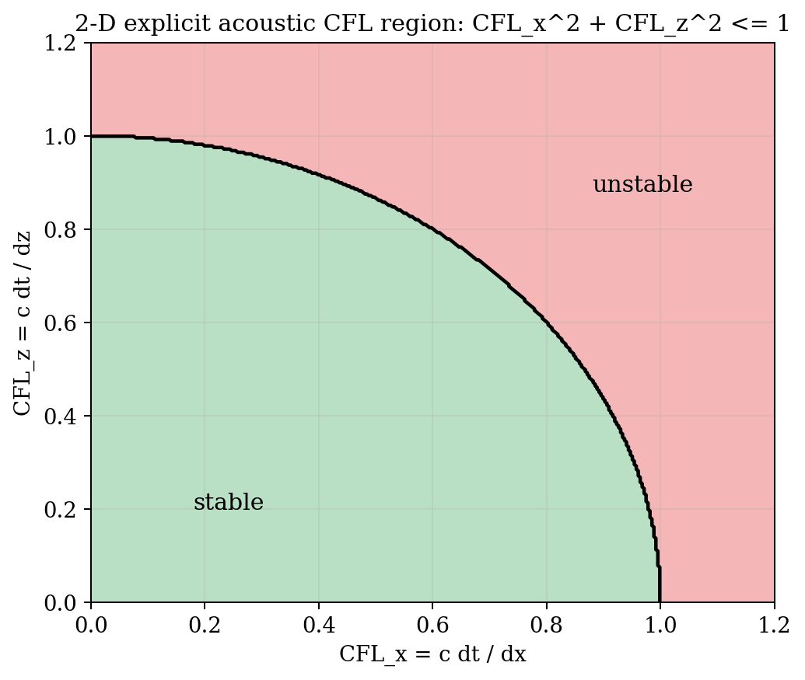
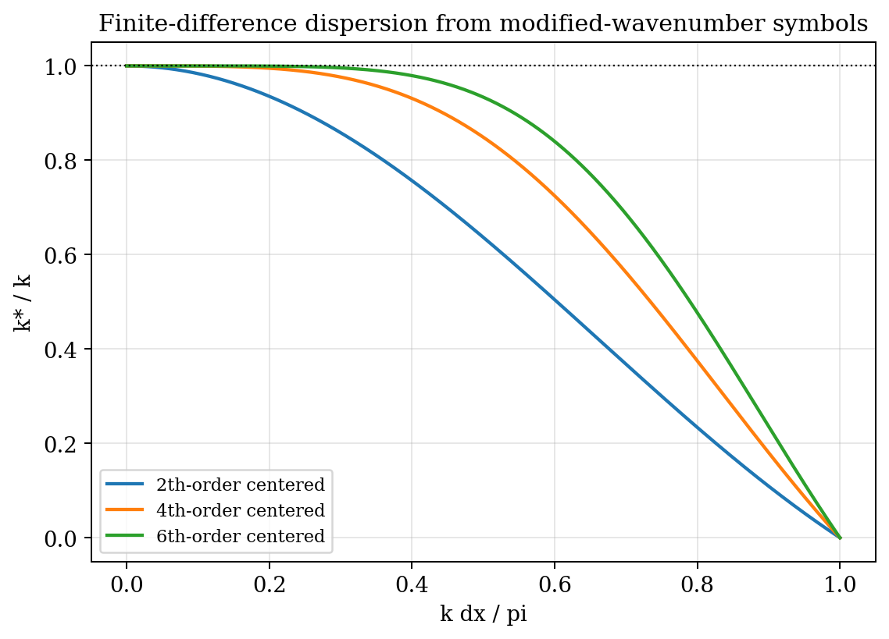
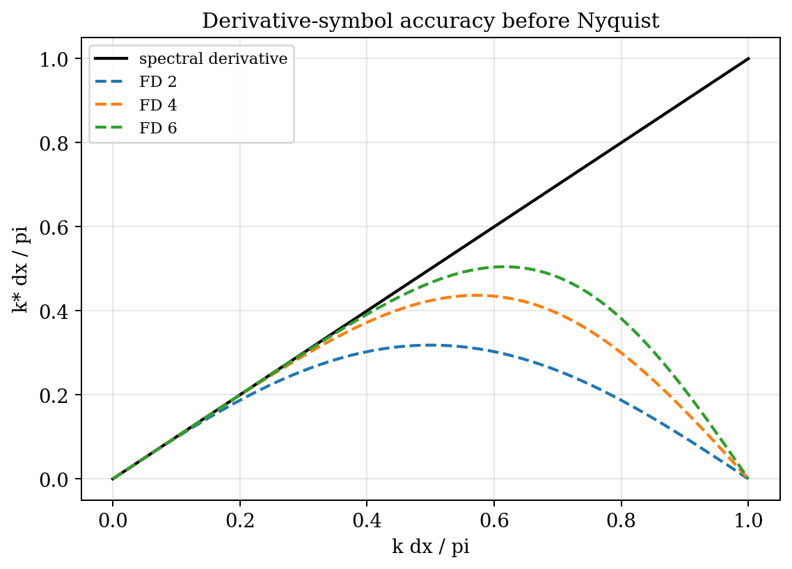
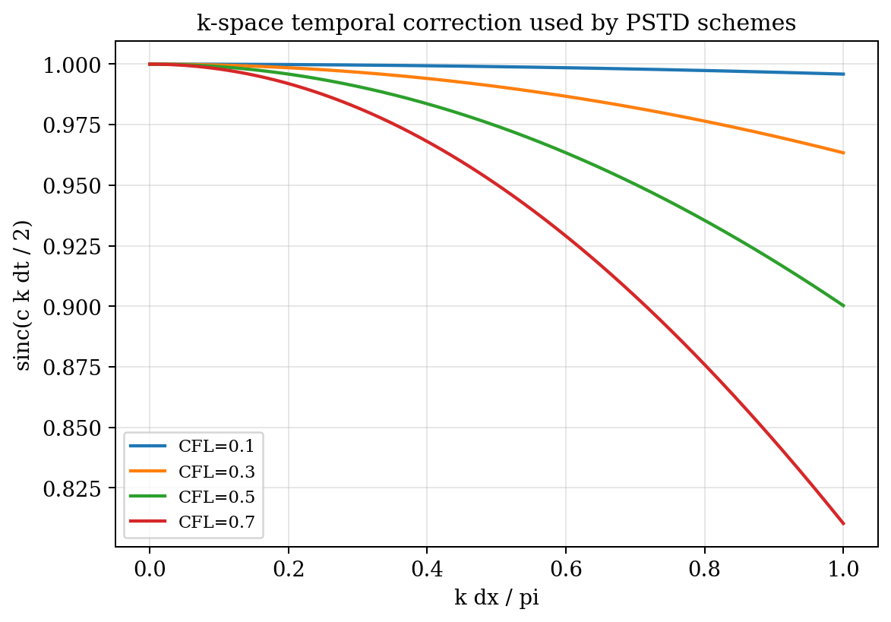
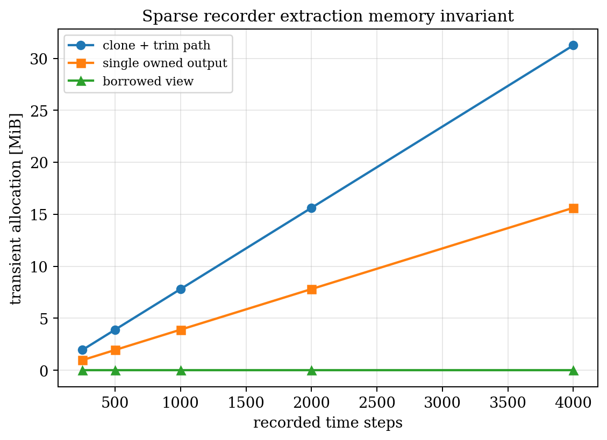

# Chapter 2 — Numerical Methods: FDTD and PSTD

> **Prerequisite:** Chapter 1 (wave equation, plane waves, dispersion);
> basic Fourier analysis (DFT, convolution theorem, sampling theorem).

---

## 2.1 Scope

Two complementary time-domain methods dominate acoustic simulation in
biomedical research:

- **Finite-Difference Time-Domain (FDTD):** approximates spatial derivatives
  with finite-difference stencils on a Cartesian grid.  Low memory per
  grid point, easy to implement, but limited to 2nd–6th order spatial accuracy.

- **Pseudospectral Time-Domain (PSTD):** computes spatial derivatives *exactly*
  (to machine precision) via the Fourier derivative theorem.  Exponentially
  accurate for smooth fields; requires global FFTs per time step.

Both methods share the same *temporal* update: explicit first-order time
differences (leapfrog).  They differ only in how they approximate $\nabla p$
and $\nabla \cdot \mathbf{u}$.

This chapter derives each method from the first-order linear acoustic equations
(1.5)–(1.6), proves stability and accuracy, and documents the implementation
choices in kwavers.

---

## 2.2 The Yee staggered-grid FDTD scheme

### 2.2.1 Staggered space–time grid

The **Yee grid** (Yee 1966, originally for electromagnetics; adapted to
acoustics by Virieux 1986) staggers the pressure and velocity components in
both space and time to achieve second-order accuracy without averaging.

Define a 1D grid with spacing $\Delta x$ and time step $\Delta t$:

$$
x_i = i \,\Delta x, \quad i \in \mathbb{Z}; \qquad
t^n = n\,\Delta t, \quad n \in \mathbb{N}.
$$

Velocity is defined at half-integer spatial positions and integer time levels;
pressure is defined at integer positions and half-integer time levels:

$$
u^n_{i+1/2} \approx u\!\left((i+\tfrac{1}{2})\Delta x,\, n\Delta t\right),
\qquad
p^{n+1/2}_i \approx p(i\Delta x,\, (n+\tfrac{1}{2})\Delta t).
$$

### 2.2.2 Leapfrog update equations

Centering the first-order temporal derivative at the mid-point of each
half-step gives the explicit **leapfrog** update:

$$
\boxed{
u^{n+1/2}_{i+1/2}
= u^{n-1/2}_{i+1/2}
  - \frac{\Delta t}{\rho_0 \Delta x}
    \left( p^n_{i+1} - p^n_i \right),
}
\tag{2.1}
$$

$$
\boxed{
p^{n+1}_i
= p^n_i
  - \frac{\rho_0 c_0^2 \Delta t}{\Delta x}
    \left( u^{n+1/2}_{i+1/2} - u^{n+1/2}_{i-1/2} \right).
}
\tag{2.2}
$$

**Theorem 2.1 (Second-order FDTD is consistent with the wave equation).**
*The leapfrog stencil (2.1)–(2.2) is consistent with the first-order acoustic
system (1.5)–(1.6) with local truncation error $\mathcal{O}(\Delta t^2 + \Delta x^2)$.*

**Proof.**  Expand $u^{n-1/2}_{i+1/2}$ and $p^n_i$ in Taylor series about
$(x_{i+1/2}, t^n)$.  The centred difference approximates the time derivative
as

$$
\frac{u^{n+1/2}_{i+1/2} - u^{n-1/2}_{i+1/2}}{\Delta t}
= \frac{\partial u}{\partial t}\bigg|_{(i+1/2, n)}
+ \frac{\Delta t^2}{24} \frac{\partial^3 u}{\partial t^3}\bigg|_{(i+1/2,n)}
+ \mathcal{O}(\Delta t^4).
$$

Similarly the space difference gives $(\partial p/\partial x)|_{(i+1/2,n)} + \mathcal{O}(\Delta x^2)$.
Comparing with equation (1.6) shows the truncation error is
$\mathcal{O}(\Delta t^2 + \Delta x^2)$. $\square$

### 2.2.3 Higher-order stencils

The 2nd-order spatial stencil can be replaced by the $2M$th-order centred
difference with coefficients $\{a_m\}_{m=1}^M$:

$$
\frac{\partial p}{\partial x}\bigg|_{i+1/2}
\approx \frac{1}{\Delta x} \sum_{m=1}^{M} a_m
  \left( p_{i+m} - p_{i+1-m} \right),
\tag{2.3}
$$

where the coefficients are given by the standard formula (Fornberg 1998):

| Order $2M$ | $a_1$ | $a_2$ | $a_3$ |
|------------|-------|-------|-------|
| 2 | $1$ | — | — |
| 4 | $\frac{9}{8}$ | $-\frac{1}{24}$ | — |
| 6 | $\frac{75}{64}$ | $-\frac{25}{384}$ | $\frac{3}{640}$ |

kwavers supports 2nd, 4th, and 6th order, selectable via `FdtdConfig::spatial_order`
(see `kwavers_solver::forward::fdtd::config`).

---

## 2.3 CFL stability condition

**Theorem 2.2 (CFL stability for FDTD).**  *The leapfrog FDTD scheme is
von Neumann stable if and only if*

$$
\boxed{
\Delta t \leq \frac{\Delta x}{c_0 \sqrt{D}},
}
\tag{2.4}
$$

*where $D$ is the spatial dimension.  In 3D this gives*
$\Delta t \leq \Delta x / (c_0 \sqrt{3})$.

*For the 4th-order stencil (M=2) the effective group velocity is slightly higher
and the stability bound tightens by a factor $\sum_m |a_m|$.*

**Proof (von Neumann analysis, 1D).** Substitute the Fourier mode ansatz
$p^n_j = P(\xi) e^{i j \xi}$, $u^{n+1/2}_{j+1/2} = U(\xi) e^{i(j+1/2)\xi}$
into (2.1)–(2.2), where $\xi = k\Delta x$ is the normalised wavenumber.
The update is a $2\times 2$ linear system in $(U, P)$ whose amplification factor
$\lambda$ satisfies $\lambda^2 - 2\beta\lambda + 1 = 0$ with
$\beta = 1 - 2r^2\sin^2(\xi/2)$ and $r = c_0\Delta t/\Delta x$.  Because the
product of roots is $1$, the scheme is non-dissipative ($|\lambda| = 1$) exactly
when the roots are complex conjugates, i.e.\ when $|\beta| \leq 1$; a real root
pair ($|\beta| > 1$) always contains one $|\lambda| > 1$ (unstable growth).
Thus stability requires $r^2\sin^2(\xi/2) \leq 1$ for all $\xi$, giving
$r \leq 1$ in 1D.  In 3D the gradient contributions add and the constraint
becomes $r\sqrt{3} \leq 1$.  $\square$

**kwavers implementation.**  The CFL constant is set to $1/\sqrt{3}$ and a
safety factor of 0.95 is applied:

```rust
// kwavers_solver::forward::fdtd::config
pub const CFL_3D: f64 = 0.577_350_269_189_625_8;  // 1/√3, 16 significant figures
pub const CFL_SAFETY: f64 = 0.95;
```



**Figure 2.1.** Von Neumann stability region of the leapfrog FDTD scheme: the
Courant number $r = c_0\Delta t/\Delta x$ must lie below $1/\sqrt{D}$, shrinking
from $1$ (1D) to $1/\sqrt{2}$ (2D) to $1/\sqrt{3}\approx 0.577$ (3D).


---

## 2.4 FDTD numerical dispersion

The Yee scheme introduces **numerical dispersion**: the discrete wave speed
$\tilde{c}(\xi)$ depends on wavenumber $\xi$.

**Theorem 2.3 (FDTD numerical dispersion relation, 1D).**  *The 2nd-order
FDTD scheme has a dispersion relation*

$$
\frac{\omega \Delta t}{2} = \arcsin\!\left( r \sin\frac{k\Delta x}{2} \right),
\tag{2.5}
$$

*where $r = c_0 \Delta t / \Delta x$ is the Courant number.  The effective phase
velocity is*

$$
\tilde{c}(k)
= \frac{\omega}{k}
= \frac{2}{\Delta t \, k}
  \arcsin\!\left( r \sin\frac{k\Delta x}{2} \right).
\tag{2.6}
$$

*For well-resolved waves ($k\Delta x \ll 1$) the leading-order fractional
phase-velocity error is*

$$
\frac{\tilde{c}(k) - c_0}{c_0}
\approx -\frac{(k\Delta x)^2}{24} \bigl(1 - r^2\bigr).
\tag{2.7}
$$

*The error vanishes at $r = 1$ (the 1D "magic time step", where FDTD is
dispersion-free) and grows as $r \to 0$.  Near the Nyquist wavenumber
$k_\mathrm{N} = \pi/\Delta x$ this small-argument expansion no longer applies and
the error becomes $\mathcal{O}(1)$.*

**Proof.**  Substitute the mode $p^n_j = P e^{i(jk\Delta x - \omega n\Delta t)}$,
$u^{n+1/2}_{j+1/2} = U e^{i((j+1/2)k\Delta x - \omega(n+1/2)\Delta t)}$
into (2.1)–(2.2).  The characteristic condition reduces to
$\sin^2(\omega\Delta t/2) = r^2 \sin^2(k\Delta x/2)$, yielding (2.5).  Writing
$\theta = k\Delta x/2$, the phase velocity is
$\tilde{c}/c_0 = \arcsin(r\sin\theta)/(r\theta)
= 1 - \tfrac{1}{6}\theta^2(1 - r^2) + \mathcal{O}(\theta^4)$;
substituting $\theta = k\Delta x/2$ gives (2.7).  $\square$

**Practical rule of thumb.** To keep dispersion below 1% at the highest
resolved frequency, use $\Delta x \leq \lambda_\mathrm{min}/10$ (10 points per
shortest wavelength).  kwavers validates this via `Grid::validate_ppw(min_ppw=10)`.



**Figure 2.2.** Modified-wavenumber symbol $\tilde{k}/k$ for 2nd-, 4th-, and
6th-order centred stencils.  Every finite-difference symbol bends below unity and
vanishes at the Nyquist limit $k\Delta x = \pi$; higher order delays the onset of
dispersion.  The spectral PSTD operator is the flat line $\tilde{k}/k \equiv 1$.

**Implementation reference.**  The modified-wavenumber symbols in Figure 2.2,
the k-space temporal-correction factors in Figure 2.3, the spectrally-exact PSTD
curve, the k-space temporal-correction residual (§2.7), and the CFL limits
(§2.3) are `kwavers_physics::analytical::wave::dispersion::{centered_fd_modified_wavenumber,
kspace_temporal_correction, pstd_phase_error, kspace_correction_error,
fdtd_cfl_limit, fdtd_cfl_stability_region_2d}`.  The Python chapter script calls
the corresponding `pykwavers` bindings and only reshapes arrays for plotting.


---

## 2.5 The Pseudospectral Time-Domain (PSTD) method

### 2.5.1 Spectral spatial derivatives

**Theorem 2.4 (Fourier derivative theorem).**  *Let $p \in L^2(\mathbb{T})$
have the Fourier expansion $p(x) = \sum_k \hat{p}_k e^{ikx}$.  Then*

$$
\frac{d^n p}{d x^n}(x) = \sum_k (ik)^n \hat{p}_k e^{ikx}.
\tag{2.8}
$$

*In particular, the derivative at every grid point is computed exactly (to
floating-point precision) by the DFT algorithm.*

**Proof.** Differentiate the Fourier series term by term (valid in $L^2$);
each mode satisfies $(d/dx)e^{ikx} = ik e^{ikx}$.  $\square$

The **PSTD update** replaces the finite-difference stencil with a spectral
gradient.  In 3D at each time step:

1. Compute $\hat{p}_\mathbf{k} = \mathrm{FFT}[p]$.
2. Compute $\widehat{\partial_\alpha p} = i k_\alpha \hat{p}_\mathbf{k}$
   for $\alpha \in \{x, y, z\}$.
3. Recover $\partial_\alpha p = \mathrm{IFFT}[\widehat{\partial_\alpha p}]$.
4. Update velocity: $\mathbf{u}^{n+1/2} = \mathbf{u}^{n-1/2} - (\Delta t/\rho_0)\nabla p^n$.
5. Compute $\hat{\mathbf{u}}$ and $\widehat{\nabla \cdot \mathbf{u}}$ similarly.
6. Update density: $\rho^{n+1} = \rho^n - \rho_0 \Delta t (\nabla \cdot \mathbf{u}^{n+1/2})$.
7. Update pressure: $p^{n+1} = c_0^2 \rho^{n+1}$.

**Implementation reference.**  This sequence is executed in
`kwavers_solver::forward::pstd::implementation::core::stepper::step::step_forward`.


**Figure 2.3.** Derivative symbols: the exact spectral symbol $ik$ (straight
line) versus the finite-difference symbols, which underestimate the wavenumber
increasingly toward Nyquist.  This is the spatial-derivative root cause of the
dispersion in Figure 2.2.


### 2.5.2 Spectral convergence

**Theorem 2.5 (Spectral accuracy of PSTD spatial derivatives).**  *For an
analytic function $p$ with exponential decay of Fourier coefficients
$|\hat{p}_k| \leq C e^{-\alpha |k|}$, the discrete Fourier derivative
satisfies*

$$
\left\| \frac{dp}{dx} - D_N p \right\|_\infty
\leq \frac{C}{\alpha} e^{-\alpha N/2},
\tag{2.9}
$$

*where $N$ is the number of grid points and $D_N p$ is the spectral derivative.
This is exponential (spectral) convergence in $N$, faster than any power of
$N^{-p}$.*

**Proof.** The spectral derivative error is bounded by the aliasing tail:
$\|(d/dx - D_N)p\|_\infty \leq \sum_{|k|>N/2} |k| |\hat{p}_k|$.  The geometric
series gives the bound (2.9).  Trefethen (2000), Theorem 4.1.  $\square$

**Consequence.** PSTD requires as few as **2–4 grid points per wavelength**
(instead of 10–20 for FDTD) for equivalent accuracy.  In 3D this means up to
$5^3 = 125\times$ fewer grid points.

---

## 2.6 CFL condition for PSTD

**Theorem 2.6 (PSTD stability via the $k$-space operator).**  *The PSTD
method with leapfrog time stepping is stable if*

$$
\Delta t \leq \frac{2}{c_0\, |\mathbf{k}|_\mathrm{max}}
= \frac{2\Delta x}{\pi c_0 \sqrt{D}},
\tag{2.10}
$$

*where $|\mathbf{k}|_\mathrm{max} = \pi\sqrt{D}/\Delta x$ is the largest wavenumber
magnitude on a $D$-dimensional grid (the Brillouin-zone corner).  The Courant
number is bounded by $r = c_0\Delta t/\Delta x \leq 2/(\pi\sqrt{D})$: $0.637$ in
1D, $0.450$ in 2D, $0.367$ in 3D.*

**Proof.**  The spectral gradient reproduces $i\mathbf{k}$ exactly, so the
leapfrog pressure update has amplification governed by
$\sin(\omega\Delta t/2) = c_0\Delta t\,|\mathbf{k}|/2$.  A real $\omega$ (neutral
stability) requires $c_0\Delta t\,|\mathbf{k}| \leq 2$ for every resolved mode; the
worst case is the corner mode $|\mathbf{k}|_\mathrm{max} = \pi\sqrt{D}/\Delta x$,
giving (2.10).  Tabei et al. (2002), §III.  $\square$

> **Bare PSTD is *not* cheaper than FDTD per step.**  In 3D the bare-leapfrog
> PSTD bound $0.367$ is *tighter* than the 2nd-order FDTD bound
> $1/\sqrt{3} \approx 0.577$: the spectral operator represents the full wavenumber
> magnitude up to the corner, whereas the FDTD stencil *underestimates* it (its
> modified wavenumber bends below $k$ — Figure 2.2).  PSTD's efficiency comes from
> needing far fewer points per wavelength (§2.5.2) and from the k-space temporal
> correction (§2.7) — which removes the time-step restriction entirely — not from a
> larger CFL.

---

## 2.7 The k-space temporal operator

The leapfrog PSTD still has $\mathcal{O}(\Delta t^2)$ temporal error.  The
**k-space method** (Tabei et al. 2002; Treeby & Cox 2010) replaces the leapfrog
with an exact temporal propagator in Fourier space.

**Theorem 2.7 (k-space exact temporal propagation).**  *In a homogeneous
lossless medium, the exact pressure solution of the wave equation (1.8) at
time $t + \Delta t$ given the pressure and its time derivative at $t$ is*

$$
\hat{p}_\mathbf{k}(t + \Delta t)
= \hat{p}_\mathbf{k}(t) \cos(\omega_k \Delta t)
+ \frac{\hat{\dot{p}}_\mathbf{k}(t)}{\omega_k} \sin(\omega_k \Delta t),
\tag{2.11}
$$

*where $\omega_k = c_0 |\mathbf{k}|$ is the angular frequency of mode
$\mathbf{k}$.  This update is exact in time — no temporal discretisation error.*

**Proof.**  In Fourier space, (1.8) becomes
$\ddot{\hat{p}}_\mathbf{k} + \omega_k^2 \hat{p}_\mathbf{k} = 0$, whose
exact solution is the harmonic oscillator (2.11).  $\square$

**kwavers implementation.**  The k-space propagator is available as an optional
mode (`PSTDConfig::kspace_correction = KspaceMode::FullSpectral`) in
`kwavers_solver::forward::pstd::implementation::core::stepper::step_forward_kspace`.
Rather than storing $\hat{\dot{p}}_\mathbf{k}$, the implementation uses the
mathematically equivalent **two-step recurrence** for the harmonic oscillator,
$$
\hat{p}_\mathbf{k}^{\,n+1} = 2\cos(\omega_k\Delta t)\,\hat{p}_\mathbf{k}^{\,n}
- \hat{p}_\mathbf{k}^{\,n-1},
$$
storing the previous spectral field $\hat{p}_\mathbf{k}^{\,n-1}$.  For the
zero-velocity IVP ($\hat{\dot{p}}_\mathbf{k}(0)=0$) the solution is even in time
($\hat{p}^{-1}=\hat{p}^{1}$), so the first step collapses to
$\hat{p}^{1}=\cos(\omega_k\Delta t)\,\hat{p}^{0}$.  Both forms are exact in time —
no temporal discretisation error — and exact only for a homogeneous $c_0$ (a
single $c_{\text{ref}}$ is used for every mode).



**Figure 2.4.** The k-space temporal correction $\mathrm{sinc}(c_0|\mathbf{k}|\Delta t/2)$
that converts the leapfrog update into the exact harmonic propagator (2.11),
removing the $\mathcal{O}(\Delta t^2)$ temporal dispersion for every mode at once.


---

## 2.8 Gibbs phenomenon and spectral filtering

A discontinuous medium (e.g., a sharp soft-tissue–bone boundary) introduces a
jump discontinuity in $c_0(\mathbf{x})$, which causes the Fourier expansion to
converge only as $1/k$ (Gibbs phenomenon) instead of exponentially.

**Definition 2.1 (Spectral filter).**  A spectral filter multiplies each
Fourier mode by a window function:

$$
\hat{p}_k \leftarrow H(k) \hat{p}_k,
\qquad
H(k) = \exp\!\left(-\alpha_f \left(\frac{|k|}{k_\mathrm{max}}\right)^{2n_f}\right).
\tag{2.12}
$$

The **Hanning-type** filter uses $n_f = 1$; the **super-Gaussian** uses
$n_f \geq 4$ to preserve more of the passband.

**Theorem 2.8 (Gibbs suppression by spectral filtering).**  *A spectral filter
$H(k)$ satisfying $H(0) = 1$, $H(k_\mathrm{max}) = 0$, and $H$ monotone
decreasing, reduces Gibbs overshoot from $\approx 9\%$ of the jump to a value
determined by the support of $1 - H(k)$ near $k_\mathrm{max}$.*

*More precisely, if $H$ transitions smoothly from 1 to 0 over a bandwidth of
$\Delta k$ near $k_\mathrm{max}$, the overshoot is suppressed to
$\mathcal{O}(\Delta k / k_\mathrm{max})$.*

**Proof sketch.**  The Gibbs overshoot arises from the partial-sum kernel
$D_N(x) = \sin((N+1/2)x)/\sin(x/2)$.  Multiplying by $H$ replaces $D_N$ with a
smoother kernel whose sidelobes decay as $1/\Delta k$ instead of $1/k$.
Full proof: Gottlieb & Shu (1997), §3.  $\square$

**kwavers implementation.** The Gaussian spectral filter (2.12) is applied after
the pressure update when `PSTDConfig::apply_filter = true` (default for
heterogeneous media).

---

## 2.9 Perfectly Matched Layer (CPML) boundary conditions

An absorbing boundary condition is required to prevent reflections from the
computational domain boundaries.  The standard method is the **Convolutional
Perfectly Matched Layer** (CPML; Roden & Gedney 2000).

**Definition 2.2 (CPML update equations).**  At a boundary normal to $x$, the
CPML is implemented by replacing the $x$-derivative with a modified derivative:

$$
\frac{\partial p}{\partial x}\bigg|_\mathrm{CPML}
= \frac{1}{\kappa_x} \frac{\partial p}{\partial x} + \psi_{p,x},
\tag{2.13}
$$

where $\psi_{p,x}$ is the **memory variable** that absorbs the outgoing wave:

$$
\psi_{p,x}^{n+1}
= b_x \psi_{p,x}^n
+ a_x \frac{\partial p}{\partial x}\bigg|^{n+1/2},
\qquad
b_x = e^{-(\sigma_x/\kappa_x + \alpha_x)\Delta t},
\quad
a_x = \frac{\sigma_x}{\kappa_x(\sigma_x + \kappa_x \alpha_x)}(b_x - 1).
\tag{2.14}
$$

The conductivity profile is $\sigma_x(x) = \sigma_\mathrm{max}(d/L_\mathrm{PML})^m$
where $d$ is distance into the PML of thickness $L_\mathrm{PML}$.

**Theorem 2.9 (PML zero reflection for plane waves).**  *An unbounded PML
with complex stretch factor $s_x = \kappa_x + \sigma_x/(i\omega)$ produces zero
reflection for all angles and frequencies in the continuous limit.*

**Proof.**  In the PML the wave equation acquires a complex Jacobian.  For a
plane wave $e^{i(k_x x + k_y y - \omega t)}$, the stretched coordinate
$\tilde{x} = \int_0^x 1/s_x(x') dx'$ preserves the wave equation but attenuates
the amplitude by $e^{-\int_0^d \sigma_x/(\kappa_x \omega) dx'}$.  Since the
attenuation depends only on properties inside the PML and not on the incoming
angle, the transmission from the physical medium into the PML is reflection-free
for all angles.  Bérenger (1994).  $\square$

**Discretisation note.** In practice a finite PML of 10–20 cells introduces
a small numerical reflection $\sim 10^{-4}$–$10^{-3}$ due to the discrete
conductivity ramp.  The CPML formulation (Roden & Gedney 2000) improves on the
split-field PML by using memory variables, reducing reflection to
$\sim 10^{-6}$ for a 20-cell layer.

**kwavers implementation:** `kwavers_boundary::cpml::CPMLBoundary`,
used by both FDTD and PSTD solvers.

---

## 2.10 FDTD vs PSTD: quantitative comparison

| Property | 2nd-order FDTD | 6th-order FDTD | PSTD |
|----------|---------------|----------------|------|
| Spatial accuracy | $\mathcal{O}(\Delta x^2)$ | $\mathcal{O}(\Delta x^6)$ | Spectral (exp.) |
| Min PPW for 1% error | ~10 | ~4 | 2–3 |
| Temporal accuracy | $\mathcal{O}(\Delta t^2)$ | $\mathcal{O}(\Delta t^2)$ | $\mathcal{O}(\Delta t^2)$ or exact |
| CFL limit (3D) | $1/\sqrt{3} \approx 0.577$ | $\approx 0.45$ | $2/(\pi\sqrt{3}) \approx 0.367$ bare; unrestricted with k-space corr. |
| Memory per grid pt | $\sim 2$ fields | $\sim 2$ fields | $\sim 4$ fields (complex) |
| FFT cost | None | None | $\mathcal{O}(N\log N)$/step |
| Heterogeneous media | Easy | Easy | Requires filtering |
| Parallel scaling | Perfect (stencil) | Perfect | Blocked by FFT |

**When to prefer PSTD:**
- 3D simulations where memory limits resolution below 10 PPW for FDTD.
- Homogeneous or mildly heterogeneous media (no sharp jumps).
- Long-range propagation where FDTD accumulates unacceptable dispersion.

**When to prefer FDTD:**
- Strongly heterogeneous media with discontinuous properties.
- When parallelism beyond a single GPU is needed.
- When the domain has irregular geometry (use with CPML).

---

## 2.11 Memory layout and implementation details

### 2.11.1 FDTD memory model

kwavers stores the FDTD state in `GenericWaveFields<Array3<f64>>`:

```rust
// kwavers_solver::forward::fdtd
pub struct GenericFdtdSolver<T> {
    pub config: FdtdConfig,
    pub fields: GenericWaveFields<T>,       // p, ux, uy, uz + optional stress
    pub materials: GenericMaterialFields<T>, // rho0, c0, 2D or 3D
    pub cpml_boundary: Option<CPMLBoundary>,
    // Scratch buffers pre-allocated at construction (zero per-step allocation):
    // dp_dx_scratch, dp_dy_scratch, dp_dz_scratch (all Array3<f64>)
}
```

The leapfrog is:
1. Compute $\nabla p$ using the stencil (2.3) — writes into pre-allocated scratch.
2. Update velocity: $\mathbf{u} \mathrel{+}= -(\Delta t / \rho_0) \nabla p$.
3. Apply CPML memory variables to velocity.
4. Compute $\nabla \cdot \mathbf{u}$ — same stencil, in-place.
5. Update pressure: $p \mathrel{-}= \rho_0 c_0^2 \Delta t (\nabla \cdot \mathbf{u})$.
6. Apply CPML memory variables to pressure.

All array operations use `ndarray::Zip::indexed(...).par_for_each(...)` for
Rayon parallelism.  No `Vec` allocations occur inside the time loop.

### 2.11.2 PSTD memory model

PSTD stores both real and complex fields, roughly doubling the memory footprint
of FDTD:

```rust
// kwavers_solver::forward::pstd::implementation::core::orchestrator
pub struct PSTDSolver {
    pub p:    Array3<f64>,    // pressure (real, physical space)
    pub ux:   Array3<f64>,    // velocity x (real)
    pub uy:   Array3<f64>,
    pub uz:   Array3<f64>,
    pub rhox: Array3<f64>,    // density split (real)
    pub rhoy: Array3<f64>,
    pub rhoz: Array3<f64>,
    // k-space (complex) — allocated once, reused every step:
    pub p_k:  Array3<Complex64>,
    pub ux_k: Array3<Complex64>,
    // ... grad_k: single shared Complex64 scratch buffer
}
```

The spectral derivative operator (`SpectralDerivativeOperator`) computes
$ik_\alpha \hat{f}$ for any field $f$ using precomputed $i k_\alpha$ multiplier
arrays, stored as `ikx_dealias`, `iky_dealias`, `ikz_dealias` (incorporating
the 2/3-rule dealiasing mask).

**Allocation budget (256³ grid, f64):**
- 7 real fields: $7 \times 256^3 \times 8 = 952\,\text{MB}$
- 4 complex fields: $4 \times 256^3 \times 16 = 544\,\text{MB}$
- Twiddle tables (Apollo FFT): $3 \times 256 \times 16 \approx 12\,\text{KB}$
- **Total:** $\approx 1.5\,\text{GB}$

For comparison, FDTD on the same grid requires $\approx 544\,\text{MB}$.



**Figure 2.5.** Sparse sensor-recorder memory scaling: borrowing a view of the
recorded field avoids the owned-copy allocation that grows with the number of
recorded time steps.


---

## 2.12 Convergence validation

**Algorithm 2.1 (Method of manufactured solutions).**

To validate a numerical solver independently of any reference implementation:

1. Choose an exact solution $p_\mathrm{exact}(\mathbf{x}, t)$ (e.g., the
   d'Alembert standing wave, §1.13).
2. Compute the residual $F = (\partial_{tt} - c_0^2 \nabla^2) p_\mathrm{exact}$
   analytically.  This is generally nonzero — it is the *forcing term* that
   makes $p_\mathrm{exact}$ an exact solution of the *forced* wave equation.
3. Add $F$ as a source term to the numerical solver.
4. Run the solver and compare against $p_\mathrm{exact}$ at $t_\mathrm{final}$.
5. Verify that the error $\|p_h - p_\mathrm{exact}\|_2$ decreases at the
   expected rate as $\Delta x \to 0$ (power of 2 for FDTD, exponential for PSTD).

**Theorem 2.10 (Lax equivalence theorem).**  *For a well-posed linear
initial-value problem and a consistent linear discretisation, stability is both
necessary and sufficient for convergence.*

**Proof.**  Lax & Richtmyer (1956), Theorem 3.  The condition is
$\|e_h\| \leq C \|\tau_h\|$ where $\tau_h$ is the truncation error.  For
consistent methods $\|\tau_h\| \to 0$ as $\Delta x \to 0$, so stability
guarantees $\|e_h\| \to 0$.  $\square$

This theorem justifies the kwavers validation strategy: pass the CFL check
(stability) and the manufactured-solution check (consistency), and convergence
is guaranteed for the linear equations.

---

## 2.13 Reference implementations and validation data

kwavers validation against the k-Wave C++ backend is automatic via the pykwavers
test suite.  The key parity assertion is:

$$
\frac{\|p_\mathrm{kwavers} - p_\mathrm{kwave}\|_2}{\|p_\mathrm{kwave}\|_2}
< \varepsilon,
\qquad \varepsilon = 10^{-2}.
\tag{2.15}
$$

Pearson correlation $\geq 0.999$ is additionally required for spatial field
comparisons.

Relevant tests:
- `crates/kwavers-python/tests/test_pstd_hybrid_solvers.py`
- `crates/kwavers/tests/fdtd_pstd_comparison.rs` (Chapter 1 standing-wave and dispersion tests)
- `crates/kwavers/tests/test_pstd_kwave_comparison.rs`

---

## 2.14 Worked example — sizing a 3D HIFU focal simulation

This example applies the PSTD resolution rule (§2.5.2) and the CFL bound (§2.6) to
size a realistic focused-bowl simulation and reports the kwavers–vs–k-Wave parity.

**Transducer and medium.** A spherically focused bowl of radius $a = 25$ mm and
focal length $F = 100$ mm radiates at $f = 1$ MHz into water
($c_0 = 1482\,\text{m/s}$, $\rho_0 = 998\,\text{kg/m}^3$):

$$
\lambda = c_0/f = 1.482\,\text{mm}, \qquad
\text{F-number} = \frac{F}{2a} = 2, \qquad
G \approx \frac{\pi a^2}{\lambda F} \approx 13,
$$

where $G$ is the small-signal (linear) on-axis focusing gain.

**Grid (PSTD at 2 PPW).** Because PSTD needs only $\sim 2$ points per wavelength
(§2.5.2):

$$
\Delta x = \lambda/2 = 0.741\,\text{mm}, \qquad
N = \lceil 200\,\text{mm}/\Delta x \rceil = 270 \text{ per axis}
\;\Rightarrow\; 270^3 \approx 2\times 10^7 \text{ cells}.
$$

A 2nd-order FDTD run at 10 PPW would need $5\times$ finer spacing — $125\times$ more
cells — which is the memory argument for PSTD (§2.10).

**Time step (3D PSTD CFL, §2.6).** kwavers uses $C = 0.3$, inside the bound
$2/(\pi\sqrt{3}) \approx 0.367$:

$$
\Delta t = \frac{C\,\Delta x}{c_0}
= \frac{0.3 \times 7.41\times10^{-4}}{1482} \approx 150\,\text{ns}.
$$

**Parity.** The kwavers run
(`crates/kwavers-python/examples/at_focused_bowl_3D_compare.py`) reproduces the
k-Wave reference focal field to Pearson $r = 0.9999$ and PSNR $= 45.8$ dB
(project memory `project_at_focused_bowl_3D_parity.md`).

---

## 2.15 Further reading

1. **Yee, K.** (1966). Numerical solution of initial boundary value problems
   involving Maxwell's equations in isotropic media. *IEEE Trans. Antennas
   Propag.*, 14(3), 302–307.

2. **Virieux, J.** (1986). P-SV wave propagation in heterogeneous media:
   Velocity-stress finite-difference method. *Geophysics*, 51(4), 889–901.

3. **Tabei, M., Mast, T. D., & Waag, R. C.** (2002). A k-space method for
   coupled first-order acoustic propagation equations. *J. Acoust. Soc. Am.*,
   111(1), 53–63.  [doi:10.1121/1.1421344](https://doi.org/10.1121/1.1421344)

4. **Treeby, B. E., & Cox, B. T.** (2010). k-Wave: MATLAB toolbox for the
   simulation and reconstruction of photoacoustic wave fields. *J. Biomed.
   Opt.*, 15(2), 021314.  [doi:10.1117/1.3360308](https://doi.org/10.1117/1.3360308)

5. **Roden, J. A., & Gedney, S. D.** (2000). Convolutional PML (CPML): An
   efficient FDTD implementation of the CFS-PML for arbitrary media. *Microw.
   Opt. Technol. Lett.*, 27(5), 334–339.

6. **Trefethen, L. N.** (2000). *Spectral Methods in MATLAB*. SIAM.
   Chapter 4 for spectral accuracy; Chapter 12 for stability.

7. **Gottlieb, D., & Shu, C.-W.** (1997). On the Gibbs phenomenon and its
   resolution. *SIAM Review*, 39(4), 644–668.

8. **Fornberg, B.** (1998). *A Practical Guide to Pseudospectral Methods*.
   Cambridge University Press.
