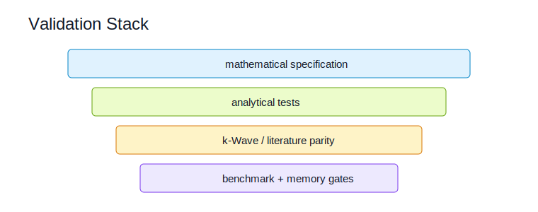

# Numerical Methods

## Scope

Numerical methods cover FDTD, PSTD, FEM, BEM, hybrid coupling, ODE/IMEX solvers, spectral transforms, checkpointing, and error measurement. Code ownership maps to `kwavers::solver`, `kwavers::math`, `kwavers::domain::boundary`, and the Apollo transform submodule.

## Theorem: Consistency Before Convergence

Let `L_h` be a discrete operator approximating a continuous operator `L`. If `||L_h phi - L phi|| -> 0` for every smooth test function `phi`, then `L_h` is consistent with `L`.

### Proof Sketch

Consistency is the definition of pointwise operator convergence on smooth functions. Stability and consistency then become the required ingredients for convergence under Lax-style equivalence for well-posed linear initial-value problems.

## Algorithm: Numerical Method Acceptance

1. State the continuous equation and boundary conditions.
2. State the discrete stencil or spectral operator.
3. Prove or test consistency on manufactured solutions.
4. Validate stability with CFL or energy bounds.
5. Compare against analytical, k-Wave, or literature reference data.

## Implementation Targets

- Keep solver kernels separate from scheduling, transform backend, and diagnostic collection.
- Use caller-owned scratch buffers for hot paths.
- Add `*_into` variants for allocation-sensitive operators.

## Research Anchors

- Mixed finite-element analysis for Westervelt/Kuznetsov equations: https://doi.org/10.1016/j.apnum.2023.12.001
- k-Wave pseudospectral reference implementation: http://www.k-wave.org/
- Apollo transform ownership: `apollo/`.
