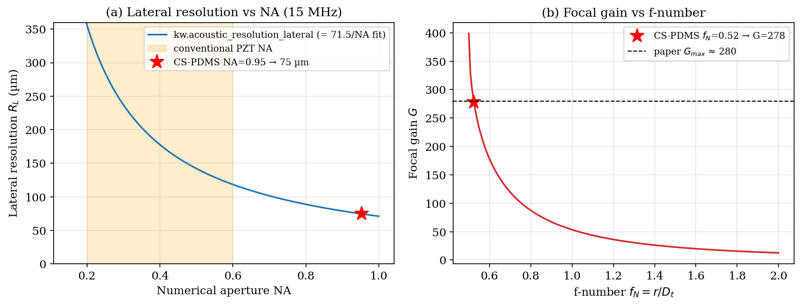

# 34. Optically-Generated Focused Ultrasound for Ultrahigh-Precision Neuromodulation

This chapter develops the physics of **optically-generated focused ultrasound
(OFUS)** produced by a **soft optoacoustic pad (SOAP)**, following Li et al.,
*Optically-generated focused ultrasound for noninvasive brain stimulation with
ultrahigh precision*, **Light: Science & Applications 11, 321 (2022)**. A SOAP
is a spherically curved optoacoustic emitter: a nanosecond laser pulse
illuminates a thin light-absorbing nanocomposite coated on a curved PDMS
surface, and the thermoelastic stress launches an ultrasound wave from every
surface element. Because the surface is a spherical cap, the wavefronts converge
at the geometric centre, producing a focus *by geometry alone* — no electronic
delays and no piezoelectric element. The soft, crack-free absorber reaches a
numerical aperture close to the theoretical limit, giving a focus two orders of
magnitude tighter (≈83 µm lateral) than conventional transcranial-focused
ultrasound, at four orders of magnitude lower acoustic energy.

The chapter cross-references the optoacoustic source model (§10.4, `p₀ = Γ μ_a F`),
the O'Neil focused-bowl on-axis result (§6.4), and the acoustic-resolution
relations of imaging (§7.3). It maps every relation onto the kwavers
implementation in `kwavers_physics::analytical::transducer::optoacoustic`
(geometry, focal gain, resolution) and
`kwavers_medium::properties::optoacoustic` (nanocomposite absorber materials),
and validates the predictions against the paper's reported numbers.

## 34.1 The Optoacoustic Focusing Principle

A piezoelectric (PZT) focused transducer is limited to a numerical aperture
`NA ≲ 0.6` because the brittle ceramic cracks when curved tightly. An
optoacoustic emitter has no such constraint: the absorbing layer is conformally
coated onto an arbitrarily curved soft substrate, so `NA → 1` is achievable. The
ultrasound is generated at the surface and focuses passively, in the same way a
spherical mirror focuses light. Three quantities govern the device:

1. the **optoacoustic conversion** of the absorber (how much pressure per joule
   of light), set by the nanocomposite material (§34.6);
2. the **focal gain** `G`, set by the cap geometry (§34.4);
3. the **lateral resolution** `R_L`, set by the numerical aperture and frequency
   (§34.5).

The focal pressure is the product `p_focus = G · p_surface = G · S · F`, where
`S` is the material's optoacoustic sensitivity [Pa·m²/J] and `F` the laser
fluence [J/m²]. This factorisation — material sensitivity × geometric gain — is
the organising idea of the chapter and of the implementation.

## 34.2 Optoacoustic Source Generation

Under a short laser pulse the absorber deposits an energy density
`A(\mathbf r) = μ_a F` [J/m³], where `μ_a` is the optical absorption coefficient
and `F` the local fluence. If the pulse is short compared with both the thermal
diffusion time (**thermal confinement**) and the acoustic transit time across the
heated zone (**stress confinement**), the deposited heat cannot diffuse or
mechanically relax during illumination, and the entire absorbed energy density
converts to an initial pressure rise

```math
p_0 = \Gamma\, \mu_a\, F, \qquad \Gamma = \frac{\beta\, c^2}{C_p}             (34.1)
```

where `Γ` is the dimensionless **Grüneisen parameter** (volumetric thermal
expansion `β`, sound speed `c`, specific heat `C_p`). Equation (34.1) is the
photoacoustic source law of §10.1; it is implemented in
`kwavers_optics::optical_transport::initial_pressure` and, for emitter
materials, as `OptoacousticEmitter::grueneisen` and `surface_pressure`.

The matrix and the absorber play complementary roles. PDMS supplies the large
thermal expansion (`β ≈ 9×10⁻⁴ K⁻¹`, `Γ ≈ 0.65–0.9`) but is optically
transparent; the embedded carbon absorber supplies the high `μ_a` but expands
little. The composite achieves both, and its pulse shape is fixed by the
absorbing-layer thickness: a thinner, more strongly absorbing layer (candle
soot) confines the stress to a shorter transit and emits a higher-frequency,
shorter pulse (§34.6).

## 34.3 SOAP Geometry and Numerical Aperture

Model the emitter as a spherical cap of radius of curvature `r` and transverse
aperture diameter `D_t`. The half-angle `θ` subtended by the rim satisfies
`sin θ = (D_t/2)/r`, so the numerical aperture (in the surrounding medium) is

```math
\mathrm{NA} = \sin\theta = \frac{D_t}{2r}.                                     (34.2)
```

The **f-number** is the ratio of the radius of curvature to the transverse
diameter, `f_N = r/D_t`, and combining with (34.2) gives the clean reciprocal

```math
f_N = \frac{r}{D_t} = \frac{1}{2\,\mathrm{NA}},                                (34.3)
```

so a full hemisphere (`NA → 1`) is the minimum `f_N = 0.5`. These conversions are
`numerical_aperture_from_geometry`, `f_number_from_na`, and `na_from_f_number`.
For the CS-PDMS device (`r = 6.35 mm`, `D_t = 12.1 mm`): `NA = 0.953`,
`f_N = 0.525`, matching the reported `NA ≈ 0.95–0.96`.

## 34.4 Focal Gain

The on-axis pressure at the geometric focus exceeds the surface pressure by the
**focal gain** `G`. For a spherically focused source (O'Neil 1949) the paper's
Eq. 2 gives

```math
G = \frac{2\pi f}{c_0}\, r\left(1 - \sqrt{1 - \frac{1}{4 f_N^{2}}}\right).      (34.4)
```

**Theorem 34.1 (Focal gain equals the sagitta phase).** *Substituting
`f_N = 1/(2\,\mathrm{NA})` into (34.4) gives `1/(4f_N^2) = \mathrm{NA}^2`, hence*

```math
G = \frac{2\pi f}{c_0}\, r\left(1 - \sqrt{1 - \mathrm{NA}^2}\right)
  = k\,h, \qquad h = r(1 - \cos\theta),
```

*where `k = 2\pi f/c_0` is the wavenumber and `h` is the sagitta (depth) of the
cap. The focal gain is exactly the acoustic phase advance accumulated over the
cap depth.*

*Proof.* `\sqrt{1-\mathrm{NA}^2} = \cos\theta` since `\mathrm{NA} = \sin\theta`,
so `1-\sqrt{1-\mathrm{NA}^2} = 1-\cos\theta` and `r(1-\cos\theta) = h`. This is
identical to the L'Hôpital focal-gain limit `|p(F)|/p_0 = k\,h` of the O'Neil
focused-bowl on-axis pressure (§6.4, `focused_bowl_onaxis`), so the two
derivations agree. □

`soap_focal_gain` implements (34.4). For the device (`f = 15 MHz`, `c_0 = 1500
m/s`, `r = 6.35 mm`, `f_N = 0.525`) it returns `G = 278`, matching the paper's
`G_max ≈ 280` (which rounds `f_N → 0.52`; medium attenuation accounts for the
remaining few percent). This is **5–92×** higher than a PZT transducer with
`f_N = 1` to `4` at the same frequency. A unit test asserts `soap_focal_gain`
equals the `focused_bowl_onaxis` focal limit to machine precision, tying
Theorem 34.1 to code.

## 34.5 Lateral and Axial Resolution

The focal spot is the diffraction-limited point-spread function of the aperture.
The acoustic-resolution **lateral resolution** (−6 dB focal width) is the paper's
Eq. 1,

```math
R_L = 0.71\,\frac{\nu}{\mathrm{NA}\cdot f},                                    (34.5)
```

with `ν` the ambient sound speed and `f` the centre frequency — the standard
acoustic-resolution photoacoustic-microscopy relation. It is implemented as
`acoustic_resolution_lateral`. At the device point (`ν = 1500 m/s`, `f = 15 MHz`,
`NA = 0.953`) it gives `R_L = 74.5 µm`, matching the reported 75 µm (calculation)
and 78 µm (2-D simulation).

Because `R_L ∝ 1/\mathrm{NA}`, evaluating (34.5) at the device's `ν` and `f`
reduces to the paper's empirical fit `R_L[\mu m] \approx 71.5/\mathrm{NA}`
(`0.71·1500/15 = 71.0`): **Eq. 1 and the fit are the same relation.** Figure 34.1
plots both. The axial resolution is set by the focal-zone depth and is obtained
from the 2-D field simulation (≈209 µm); it is not reduced to a single closed
form here.



*Figure 34.1. (a) Lateral resolution `R_L` vs numerical aperture from Eq. (34.5)
(`acoustic_resolution_lateral`); the markers reproduce the paper's `71.5/NA`
fit, and the orange band is the `NA` range of conventional PZT transducers.
(b) Focal gain `G` vs f-number from Eq. (34.4) (`soap_focal_gain`), peaking at
`G ≈ 280` near the hemispherical limit `f_N = 0.5`. The CS-PDMS device point
(`NA = 0.95`, `f_N = 0.52`) is marked.*

## 34.6 Nanocomposite Absorber Materials

Li et al. fabricated SOAPs from four absorbers of identical geometry and measured
their optoacoustic output (Fig. 1g,h). kwavers encodes them as
`OptoacousticEmitter` constants in `kwavers_medium::properties::optoacoustic`,
each carrying the host-dominated acoustic properties (`density`, `sound_speed`,
power-law `absorption`), the thermoelastic `gruneisen`, the optical
`optical_absorption`, the measured `optoacoustic_sensitivity` `S` [Pa·m²/J], and
the emitted pulse `center_frequency` and `pulse_fwhm`.

| Absorber | `S` ranking | Centre freq | Pulse FWHM | Notes |
|----------|-------------|-------------|------------|-------|
| Heat-shrink membrane (HSM) | ×1 (weakest) | ~3 MHz | 0.31 µs | absorber = matrix |
| CNT-PDMS (5 wt% MWCNT) | ×5 | ~5 MHz | 0.24 µs | |
| CNP-PDMS (carbon nanoparticles) | ×5 | ~5 MHz | 0.29 µs | |
| **CS-PDMS (candle soot)** | **×30** | **~15 MHz** | **0.09 µs** | 98 % absorption, chosen |

Candle soot is the most efficient: its porous nanostructure (≈55 nm particles)
absorbs 98 % of the light in a ≈2.15 µm layer and couples strongly to the PDMS,
generating **6× the pressure** of CNT-/CNP-PDMS and ~30× that of HSM. Because the
absorbing layer is thinnest, its stress-confinement window is shortest, so it
emits the highest centre frequency and the tightest focus. The surface and focal
pressures follow §34.1:

```math
p_\text{surface} = S\,F, \qquad p_\text{focus} = G\,S\,F.                      (34.6)
```

For CS-PDMS at the paper's `F = 0.62\,\text{mJ/cm}^2 = 6.2\,\text{J/m}^2` and
`G = 280`, `focal_pressure` returns **48 MPa**, reproducing the reported value;
`surface_pressure` is `48/G ≈ 0.17 MPa`. Arbitrary nanoparticle loadings are
modelled by mixing a transparent host with an absorbing filler at a chosen
volume fraction (density and `μ_a` mix linearly; `Γ` stays matrix-dominated at
the dilute loadings used), so a simulation can sweep filler concentration and
read back the resulting conversion.

## 34.7 Transcranial Focusing

A 2 mm working distance lets the focus clear the SOAP and reach the cortex
through the mouse skull (~0.15 mm). The high centre frequency that gives the
tight focus is also the most vulnerable to skull aberration, yet the measured
**transcranial efficiency is 69 %** and the focus barely broadens: lateral
66 µm → 83 µm and axial 284 µm → 287 µm with the skull in place. The aberration
is a deterministic phase distortion of the converging wavefront; because the SOAP
surface can be fabricated to *any* profile, the skull-induced phase can in
principle be pre-compensated by shaping the cap — the same idea as the CT-derived skull
phase screen used for aberration correction in the transcranial-UST chapter.

## 34.8 Neurostimulation Regime and Safety

OFUS evokes neural responses with a **single optoacoustic cycle**, unlike the
2–12 cycles cavitation requires, which rules out a stable-bubble mechanism and
points to radiation force / mechanosensitive-channel activation. Reported
thresholds are 32.3 MPa (transient) and 48.5 MPa (prolonged) focal pressure, with
a stimulation volume ≈200 µm. The total acoustic energy density to evoke a
response is `5.7×10⁻⁴ J/cm²` — four orders of magnitude below conventional tFUS
(7.5–16 J/cm²).

Safety is bounded by two indices. The mechanical index
`MI = |p_-|/\sqrt{f}` with derated peak-negative pressure 2.7 MPa at 15 MHz gives
`MI ≈ 0.5`, well below the FDA limit of 1.9 and the bubble-cloud threshold. The
temperature rise at the focus is <0.1 K for the pulse trains used — far below the
`ΔT ≳ 5 K` needed for thermal neuromodulation — confirming a non-thermal,
non-cavitational mechanism.

## 34.9 kwavers Implementation Map

| Quantity | Equation | kwavers function |
|----------|----------|------------------|
| Numerical aperture from geometry | (34.2) | `analytical::transducer::optoacoustic::numerical_aperture_from_geometry` |
| f-number ⇄ NA | (34.3) | `…::f_number_from_na`, `…::na_from_f_number` |
| Focal gain | (34.4) | `…::soap_focal_gain` |
| Lateral resolution | (34.5) | `…::acoustic_resolution_lateral` |
| Optoacoustic source `p₀=Γμ_aF` | (34.1) | `kwavers_optics::optical_transport::initial_pressure` |
| Absorber materials & sensitivity | (34.6) | `kwavers_medium::properties::optoacoustic::OptoacousticEmitter` |
| Focused-bowl on-axis field | §6.4 | `analytical::transducer::focused_bowl_onaxis` |

## 34.10 Verification Against Li et al. (2022)

| Quantity | Paper | kwavers | Source |
|----------|-------|---------|--------|
| Numerical aperture (`r`=6.35, `D_t`=12.1 mm) | 0.95–0.96 | 0.953 | (34.2) |
| f-number | 0.52 | 0.525 | (34.3) |
| Focal gain `G` | ≈280 | 278 | (34.4) |
| Lateral resolution at NA 0.95, 15 MHz | 75 µm | 74.5 µm | (34.5) |
| Resolution fit `R_L·NA` | 71.5 µm | 71.0 µm | (34.5) |
| CS-PDMS focal pressure @ 0.62 mJ/cm² | 48 MPa | 48 MPa | (34.6), `G·S·F` |
| CS-PDMS vs CNT-PDMS pressure ratio | 6× | 6× | §34.6 |
| CS-PDMS absorption over 2.15 µm | 98 % | 98 % | Beer–Lambert |

Each row is checked by a value-semantic test in the corresponding crate
(`soap_focal_gain` cross-checked against `focused_bowl_onaxis`;
`OptoacousticEmitter::focal_pressure` against the 48 MPa calibration). This is
empirical-tier agreement with the published device.

## 34.11 Figure Generation

`fig01_soap_resolution_gain` is produced by
`crates/kwavers-python/examples/book/ch34_optoacoustic_focused_ultrasound.py`,
which calls the Rust kernels `kw.acoustic_resolution_lateral` and
`kw.soap_focal_gain` (the single source of truth for Eqs. 34.4–34.5) and overlays
the paper's `71.5/NA` fit and the `G_max ≈ 280` device point.

## 34.12 References

1. Li, Y., Jiang, Y., Lan, L. *et al.* Optically-generated focused ultrasound for
   noninvasive brain stimulation with ultrahigh precision. *Light: Sci. Appl.*
   **11**, 321 (2022). doi:10.1038/s41377-022-01004-2 — §§34.1–34.10.
2. O'Neil, H. T. Theory of focusing radiators. *J. Acoust. Soc. Am.* **21**,
   516–526 (1949) — focal gain (34.4), Theorem 34.1.
3. Chang, W. Y. *et al.* Candle soot nanoparticles-polydimethylsiloxane composites
   for laser ultrasound transducers. *Appl. Phys. Lett.* **107**, 161903 (2015) —
   CS-PDMS material (§34.6).
4. Yao, J. & Wang, L. V. Photoacoustic microscopy. *Laser Photonics Rev.* **7**,
   758–778 (2013) — acoustic-resolution lateral resolution (34.5).
5. Baac, H. W. *et al.* Carbon-nanotube optoacoustic lens for focused ultrasound
   generation. *Sci. Rep.* **2**, 989 (2012) — optoacoustic focusing.
