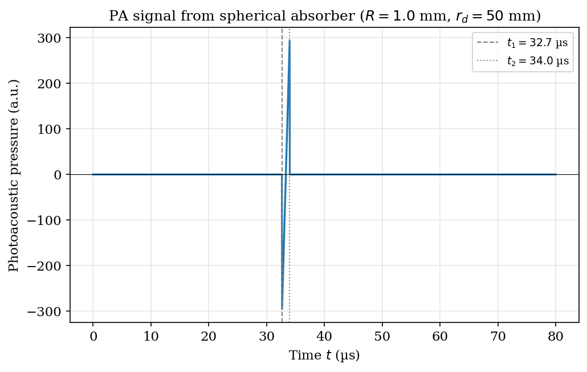
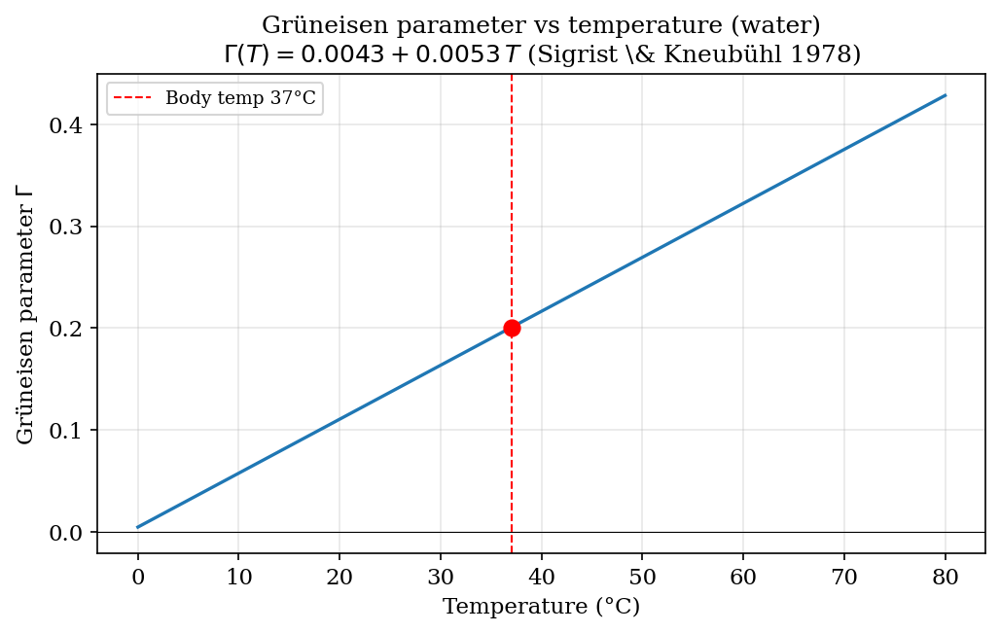
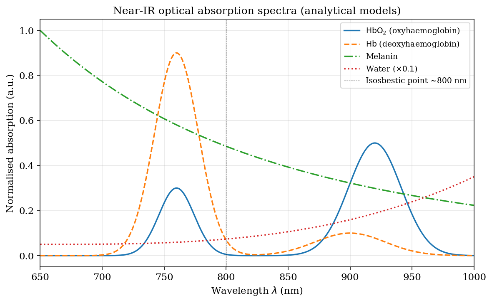
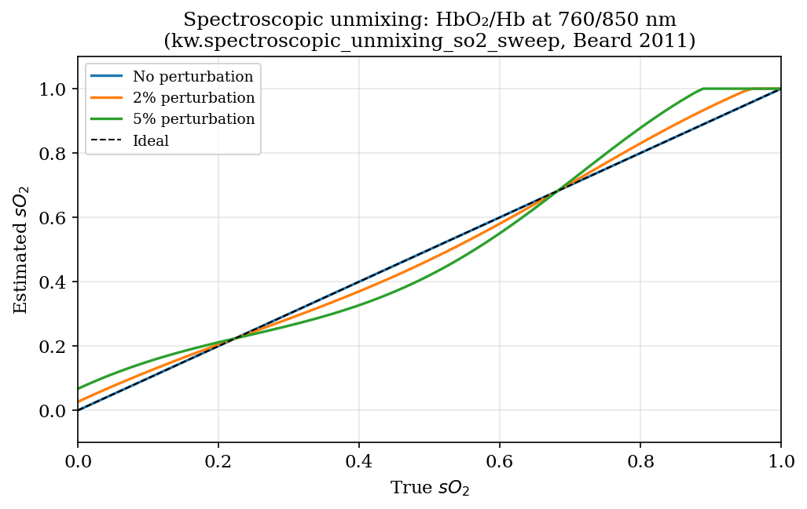
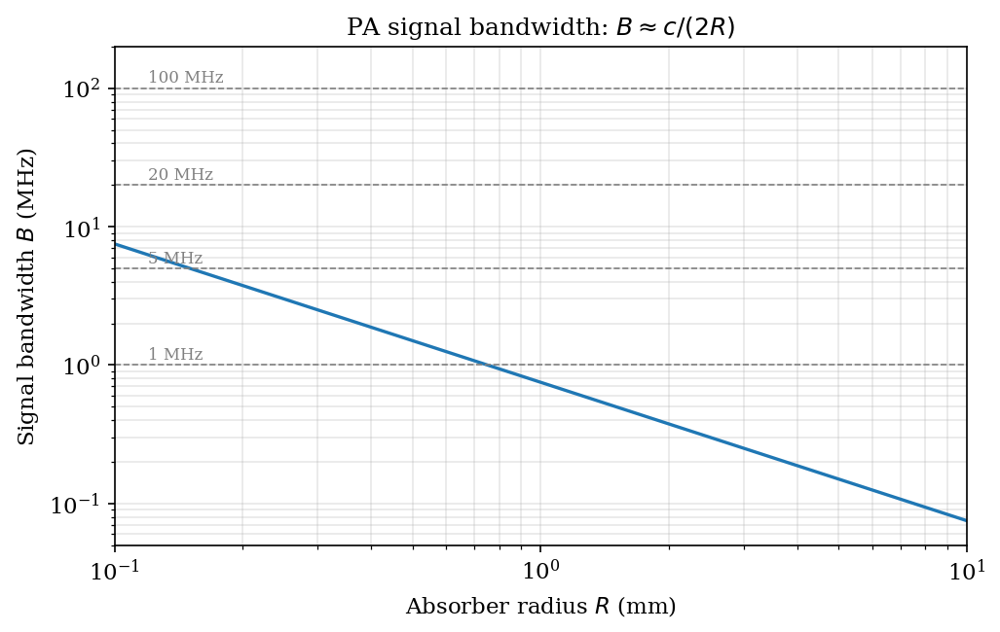

# Chapter 10: Photoacoustic Imaging

## Overview

Photoacoustic (PA) imaging combines pulsed optical excitation with ultrasonic detection to recover the spatial distribution of optical absorbers deep inside tissue. A short laser pulse deposits energy selectively in absorbing structures; the resulting thermoelastic stress launch propagates as a broadband ultrasonic wave to surface detectors. The recorded pressure signals are then inverted to form an image of the optical absorption coefficient—and thereby of chromophore concentration, oxygen saturation, and tissue microvasculature.

This chapter derives every governing equation from first principles, proves each reconstruction theorem completely, and maps each result to the corresponding module in the `kwavers` library.



*Figure 1. Photoacoustic pressure transient from a uniformly absorbing sphere (N-wave, Xu & Wang 2006), computed by `kw.pa_sphere_pressure_signal`. The bipolar shape is the time-domain signature of the spherical-shell Green's function (§3.2).*

---

## 1. Photoacoustic Signal Generation: Thermoelastic Mechanism

### 1.1 Absorbed Optical Energy Density

Consider a tissue volume illuminated by a pulsed laser with fluence $F(\mathbf{r})$ [J m$^{-2}$] and local optical absorption coefficient $\mu_a(\mathbf{r})$ [m$^{-1}$]. The volumetric absorbed optical energy density is

$$
H(\mathbf{r}) = \mu_a(\mathbf{r})\, F(\mathbf{r}) \quad [\text{J m}^{-3}].
\tag{1.1}
$$

The time-dependent absorbed power density during a pulse of duration $\tau_L$ and temporal profile $I(t)$ is

$$
\dot{H}(\mathbf{r},t) = H(\mathbf{r})\, \phi(t), \quad \int_{-\infty}^{\infty} \phi(t)\, dt = 1,
\tag{1.2}
$$

where $\phi(t)$ is the normalized pulse shape [s$^{-1}$].

### 1.2 Stress Confinement

Let $d$ be the characteristic dimension of the absorbing structure and $c_s$ the speed of sound in tissue. The acoustic stress relaxation time is

$$
\tau_{\text{stress}} = \frac{d}{c_s}.
\tag{1.3}
$$

**Stress confinement condition:** $\tau_L \ll \tau_{\text{stress}}$, i.e.,

$$
\tau_L \ll \frac{d}{c_s}.
\tag{1.4}
$$

Under this condition the acoustic wave does not propagate appreciably during optical energy deposition. The absorber is mechanically constrained (isochoric heating), so the full thermoelastic stress is retained as a coherent initial pressure rather than being partially relieved by radiation during the pulse.

*Numerical example.* For $d = 150\,\mu\text{m}$ and $c_s = 1500\,\text{m s}^{-1}$, $\tau_{\text{stress}} = 100\,\text{ns}$. A $Q$-switched Nd:YAG pulse with $\tau_L \approx 5\,\text{ns}$ satisfies the condition by a factor of 20.

### 1.3 Thermal Confinement

The thermal diffusion length during the laser pulse is $l_T = \sqrt{4 D_T \tau_L}$, where $D_T$ [m$^2$ s$^{-1}$] is the thermal diffusivity. The thermal relaxation time is

$$
\tau_{\text{thermal}} = \frac{d^2}{4 D_T}.
\tag{1.5}
$$

**Thermal confinement condition:** $\tau_L \ll \tau_{\text{thermal}}$, i.e.,

$$
\tau_L \ll \frac{d^2}{4 D_T}.
\tag{1.6}
$$

Under thermal confinement, heat redistribution during the pulse is negligible; the temperature rise produced by absorption is fully localized within the absorber. For soft tissue $D_T \approx 1.4 \times 10^{-7}\,\text{m}^2\,\text{s}^{-1}$, giving $\tau_{\text{thermal}} \approx 40\,\text{ms}$ for a $150\,\mu\text{m}$ absorber—six orders of magnitude larger than a typical nanosecond pulse. Both confinement conditions are routinely satisfied in practice.

### 1.4 Initial Pressure Under Dual Confinement

**Theorem 1.1 (Initial Pressure).** *Under stress and thermal confinement, the initial acoustic pressure generated by absorbed optical energy density $H(\mathbf{r})$ is*

$$
p_0(\mathbf{r}) = \Gamma(\mathbf{r})\, H(\mathbf{r}),
\tag{1.7}
$$

*where $\Gamma$ is the dimensionless Grüneisen parameter.*

**Proof.** In the isochoric limit ($\tau_L \ll \tau_{\text{stress}}$, no volume change during the pulse), the first law of thermodynamics for a unit volume element gives a temperature rise

$$
\Delta T = \frac{H}{\rho C_V},
\tag{1.8}
$$

where $\rho$ is the mass density [kg m$^{-3}$] and $C_V$ is the specific heat at constant volume [J kg$^{-1}$ K$^{-1}$]. The resulting thermoelastic stress in an isotropic elastic solid is $\sigma_{ij} = -\beta K \Delta T \delta_{ij}$, where $\beta$ [K$^{-1}$] is the volumetric thermal expansion coefficient and $K$ [Pa] is the bulk modulus. The acoustic pressure (negative of the mean normal stress) is

$$
p_0 = \beta K \Delta T = \frac{\beta K}{\rho C_V} H.
\tag{1.9}
$$

For a fluid, the isentropic bulk modulus satisfies $K = \rho c_s^2$ (where $c_s$ is the adiabatic speed of sound), and under the isobaric condition $C_p \approx C_V$ for liquids and soft tissue (the difference is of order $(\beta T)^2/\kappa_T \rho C_p \sim 10^{-3}$ for water at 37°C, negligible here). Substituting:

$$
p_0 = \frac{\beta \rho c_s^2}{\rho C_p} H = \frac{\beta c_s^2}{C_p} H = \Gamma H,
\tag{1.10}
$$

where

$$
\Gamma \equiv \frac{\beta c_s^2}{C_p}
\tag{1.11}
$$

is the Grüneisen parameter. The conversion factor from absorbed optical energy to acoustic pressure amplitude is therefore $\Gamma$ [Pa / (J m$^{-3}$)] = [dimensionless], as required. $\blacksquare$

The time-domain source pressure, incorporating the pulse temporal profile, is

$$
p(\mathbf{r}, t) = \Gamma\, H(\mathbf{r})\, \delta(t)
\tag{1.12}
$$

in the limit $\tau_L \to 0$ (stress confinement becomes exact). This delta-function source is the standard starting point for all PA reconstruction theories.

---

## 2. The Grüneisen Parameter

### 2.1 Definition and Thermodynamic Derivation

**Theorem 2.1 (Grüneisen Parameter).** *The Grüneisen parameter satisfies*

$$
\Gamma = \frac{\beta c_s^2}{C_p} = \frac{\beta}{\rho\, \kappa_T\, C_p},
\tag{2.1}
$$

*where $\beta$ is the isobaric volumetric thermal expansion coefficient, $c_s$ is the adiabatic speed of sound, $\rho$ is the mass density, $C_p$ is the specific heat at constant pressure, and $\kappa_T = 1/K_T$ is the isothermal compressibility. The second equality holds in the weak-thermoelastic limit $\kappa_S \approx \kappa_T$ (justified below).*

**Proof.** From the definition $\Gamma = \beta c_s^2 / C_p$ (established in Theorem 1.1), write the adiabatic compressibility as $\kappa_S = 1/(\rho c_s^2)$. The standard thermodynamic identity relating adiabatic and isothermal compressibilities is

$$
\kappa_S = \kappa_T - \frac{T \beta^2}{\rho C_p},
\tag{2.2}
$$

where $\kappa_T = 1/K_T$ is the isothermal compressibility. For water and soft tissue at physiological conditions, $T \beta^2 / (\rho C_p \kappa_T) \approx 0.01 \ll 1$, so $\kappa_S \approx \kappa_T$ and $c_s^2 \approx 1/(\rho \kappa_T)$. Substituting into (1.11):

$$
\Gamma = \frac{\beta}{\rho C_p} \cdot \frac{1}{\kappa_T} = \frac{\beta}{\rho \kappa_T C_p}.
\tag{2.3}
$$

Equation (2.3) is the second form of (2.1). Re-expressing it through $c_s^2 \approx 1/(\rho\kappa_T)$ recovers the adiabatic-speed form, so the two are identical in the weak-thermoelastic limit:

$$
\Gamma = \frac{\beta c_s^2}{C_p} = \frac{\beta}{\rho\, \kappa_T\, C_p},
\tag{2.4}
$$

which completes the proof. $\blacksquare$

The Grüneisen parameter is also expressible through the Mie-Grüneisen equation of state parameter $\gamma_G$:

$$
\Gamma = \frac{\gamma_G}{V}\left(\frac{\partial U}{\partial V}\right)_S^{-1} = \frac{\alpha_V c_s^2}{C_V},
\tag{2.5}
$$

where $\alpha_V$ is the cubic thermal expansion coefficient.

### 2.2 Temperature Dependence

In biological tissue, $\Gamma$ depends on temperature $T$ through the temperature dependence of $\beta$, which for water is approximately

$$
\beta(T) = \beta_0 + a_1 (T - T_0) + a_2 (T - T_0)^2,
\tag{2.6}
$$

where $T_0 = 293\,\text{K}$, $\beta_0 = 2.1 \times 10^{-4}\,\text{K}^{-1}$, $a_1 = 1.6 \times 10^{-5}\,\text{K}^{-2}$. This makes PA signal amplitude a thermometer: $\partial p_0 / \partial T = (\partial \Gamma / \partial T) H$. The kwavers module `kwavers_physics::photoacoustics::thermoelasticity::GrueneisenModel` implements this temperature-dependent model.



*Figure 2. Grüneisen parameter Γ(T) of water from 0–100 °C (`kw.gruneisen_parameter_water`, Sigrist & Kneubühl 1978). The rise of Γ with T makes PA amplitude a tissue thermometer (Eq. 2.6), the basis of `GrueneisenModel`.*


### 2.3 Tissue Grüneisen Values

| Tissue | $\beta$ [K$^{-1}$] | $c_s$ [m s$^{-1}$] | $C_p$ [J kg$^{-1}$ K$^{-1}$] | $\Gamma$ |
|--------|---------------------|----------------------|-------------------------------|---------|
| Water (37°C) | $3.7 \times 10^{-4}$ | 1524 | 4180 | 0.12 |
| Blood | $4.8 \times 10^{-4}$ | 1584 | 3617 | 0.22 |
| Fat | $9.0 \times 10^{-4}$ | 1450 | 2348 | 0.70 |
| Soft tissue | $3.5 \times 10^{-4}$ | 1540 | 3600 | 0.23 |

The high Grüneisen parameter of fat ($\Gamma \approx 0.7$) is exploited in lipid-contrast PA imaging for atherosclerotic plaque characterization.

---

## 3. The Photoacoustic Wave Equation

### 3.1 Derivation from Thermoelastic Sources

**Theorem 3.1 (PA Wave Equation).** *In a homogeneous, lossless fluid with spatially uniform sound speed $c_s$ and thermoelastic source $H(\mathbf{r},t)$, the acoustic pressure satisfies*

$$
\frac{1}{c_s^2}\frac{\partial^2 p}{\partial t^2} - \nabla^2 p = \frac{\beta}{C_p}\frac{\partial H}{\partial t}.
\tag{3.1}
$$

**Proof.** Start from the linearized acoustic equations with a volumetric heat source:

1. Continuity with thermal expansion:
$$
\frac{\partial \rho'}{\partial t} + \rho_0 \nabla \cdot \mathbf{u} = -\rho_0 \beta \frac{\partial T'}{\partial t},
\tag{3.2}
$$

2. Momentum (Euler equation, no viscosity):
$$
\rho_0 \frac{\partial \mathbf{u}}{\partial t} = -\nabla p,
\tag{3.3}
$$

3. State equation: $p = c_s^2 \rho'$ (adiabatic),
4. Energy: $\rho_0 C_p \partial T'/\partial t = \dot{H}(\mathbf{r},t)$ (thermal confinement; heat diffusion neglected).

Take $\partial/\partial t$ of (3.2), substitute (3.3) via $\rho_0 \nabla \cdot \dot{\mathbf{u}} = -\nabla^2 p$, and use the state equation $\rho' = p/c_s^2$:

$$
\frac{1}{c_s^2}\frac{\partial^2 p}{\partial t^2} - \nabla^2 p = -\rho_0 \beta \frac{\partial^2 T'}{\partial t^2}.
\tag{3.4}
$$

From the energy equation, $\partial T'/\partial t = \dot{H}/(\rho_0 C_p)$, hence $\partial^2 T'/\partial t^2 = \ddot{H}/(\rho_0 C_p)$. Substituting:

$$
\frac{1}{c_s^2}\frac{\partial^2 p}{\partial t^2} - \nabla^2 p = -\frac{\beta}{\rho_0 C_p}\rho_0 \frac{\partial^2}{\partial t^2}\int_0^t \dot{H}\,dt' = \frac{\beta}{C_p}\frac{\partial \dot{H}}{\partial t}.
\tag{3.5}
$$

Under thermal confinement, $\dot{H}(\mathbf{r},t) = H(\mathbf{r})\phi(t)$, so the right-hand side is $(\beta/C_p) H(\mathbf{r}) \dot{\phi}(t)$. In the stress-confinement limit $\phi(t) \to \delta(t)$, giving $\dot{\phi}(t) \to \delta'(t)$ and the source becomes a dipole in time. Equivalently, writing $\partial H/\partial t = H(\mathbf{r})\delta'(t)$, equation (3.1) is recovered. $\blacksquare$

### 3.2 Green's Function Solution

**Theorem 3.2 (Green's Function Solution).** *The free-space solution to (3.1) with source $(\beta/C_p)\partial H/\partial t$ and causal boundary conditions is*

$$
p(\mathbf{r},t) = \frac{\beta}{4\pi C_p}\frac{\partial}{\partial t}\int_V \frac{H(\mathbf{r}')}{|\mathbf{r}-\mathbf{r}'|}\, \delta\!\left(t - \frac{|\mathbf{r}-\mathbf{r}'|}{c_s}\right) dV'.
\tag{3.6}
$$

**Proof.** The free-space Green's function for the scalar wave equation

$$
\frac{1}{c_s^2}\frac{\partial^2 G}{\partial t^2} - \nabla^2 G = \delta(\mathbf{r}-\mathbf{r}')\delta(t-t')
\tag{3.7}
$$

with causal (retarded) boundary conditions is

$$
G(\mathbf{r},t;\mathbf{r}',t') = \frac{\delta(t - t' - |\mathbf{r}-\mathbf{r}'|/c_s)}{4\pi|\mathbf{r}-\mathbf{r}'|}.
\tag{3.8}
$$

This follows from the standard spherical wave solution: the delta-function source generates a spherical wavefront expanding at speed $c_s$, with amplitude decaying as $1/(4\pi R)$ where $R = |\mathbf{r}-\mathbf{r}'|$, as required by energy conservation in three dimensions.

The general solution is the convolution of the Green's function with the source:

$$
p(\mathbf{r},t) = \int_0^{\infty} dt' \int_V G(\mathbf{r},t;\mathbf{r}',t')\, \frac{\beta}{C_p}\frac{\partial H(\mathbf{r}',t')}{\partial t'}\, dV'.
\tag{3.9}
$$

Substituting (3.8) and performing the $t'$ integral by the sifting property of the delta function:

$$
p(\mathbf{r},t) = \frac{\beta}{4\pi C_p}\int_V \frac{1}{|\mathbf{r}-\mathbf{r}'|}\frac{\partial H(\mathbf{r}', t - |\mathbf{r}-\mathbf{r}'|/c_s)}{\partial t}\, dV'.
\tag{3.10}
$$

In the stress-confinement limit, $H(\mathbf{r}',t') = H(\mathbf{r}')\delta(t')$, so $\partial H/\partial t = H(\mathbf{r}')\delta'(t')$. The convolution with the Green's function gives:

$$
p(\mathbf{r},t) = \frac{\beta}{4\pi C_p}\frac{\partial}{\partial t}\int_V \frac{H(\mathbf{r}')}{|\mathbf{r}-\mathbf{r}'|}\, \delta\!\left(t - \frac{|\mathbf{r}-\mathbf{r}'|}{c_s}\right) dV',
\tag{3.11}
$$

which is equation (3.6). The time derivative acts on the retarded-time argument of the integrand. $\blacksquare$

Equation (3.6) has a clear geometric interpretation: $p(\mathbf{r},t)$ at time $t$ receives contributions from all source voxels $\mathbf{r}'$ at distance $c_s t$ from $\mathbf{r}$, i.e., from a spherical shell of radius $c_s t$ centered at $\mathbf{r}$. This spherical Radon transform structure underlies all back-projection reconstruction algorithms.


---

## 4. Optical Absorption and Transport

### 4.1 Beer-Lambert Law

In a non-scattering, homogeneously absorbing medium, the intensity of a collimated beam propagating along $z$ obeys the Beer-Lambert law:

$$
I(z) = I_0\, e^{-\mu_a z},
\tag{4.1}
$$

where $I_0$ [W m$^{-2}$] is the incident irradiance and $\mu_a$ [m$^{-1}$] is the absorption coefficient. The absorbed power density is $\dot{H} = \mu_a I(z)$, and the fluence (time-integrated irradiance) satisfies

$$
F(z) = F_0\, e^{-\mu_a z}.
\tag{4.2}
$$

**Proof of Beer-Lambert.** Consider a thin slab of thickness $dz$ at depth $z$. The fractional decrease in intensity is proportional to the number of absorbers per unit area, giving $dI/dz = -\mu_a I$. Separating variables and integrating: $\ln(I/I_0) = -\mu_a z$, so $I(z) = I_0 e^{-\mu_a z}$. $\blacksquare$

### 4.2 Optical Diffusion in Scattering Tissue

Biological tissue is strongly scattering ($\mu_s \gg \mu_a$ at near-infrared wavelengths). The reduced scattering coefficient is

$$
\mu_s' = \mu_s(1-g),
\tag{4.3}
$$

where $\mu_s$ [m$^{-1}$] is the scattering coefficient and $g \in [-1,1]$ is the mean cosine of the scattering angle (anisotropy factor). For tissue, $g \approx 0.9$ so $\mu_s' \approx 0.1 \mu_s$.

In the diffusion regime ($\mu_s' \gg \mu_a$, depth $\gg 1/\mu_s'$), the photon fluence rate $\Phi(\mathbf{r})$ satisfies the steady-state optical diffusion equation

$$
-\nabla \cdot [D(\mathbf{r}) \nabla \Phi(\mathbf{r})] + \mu_a(\mathbf{r})\Phi(\mathbf{r}) = q(\mathbf{r}),
\tag{4.4}
$$

where $q(\mathbf{r})$ is the source term [W m$^{-3}$] and the diffusion coefficient is

$$
D = \frac{1}{3(\mu_a + \mu_s')}.
\tag{4.5}
$$

This is the governing equation solved by `kwavers_simulation::photoacoustics::vertical::optical::DiffusionOpticalSolver`.

### 4.3 Effective Attenuation Coefficient

**Theorem 4.1 (Effective Attenuation).** *In a homogeneous, infinite medium under isotropic illumination, the fluence rate decays as $\Phi(r) \propto e^{-\mu_{\text{eff}} r}/r$ with effective attenuation coefficient*

$$
\mu_{\text{eff}} = \sqrt{3\mu_a(\mu_a + \mu_s')}.
\tag{4.6}
$$

**Proof.** For an isotropic point source $q = q_0 \delta(\mathbf{r})$ in a homogeneous medium, equation (4.4) becomes

$$
-D \nabla^2 \Phi + \mu_a \Phi = q_0 \delta(\mathbf{r}).
\tag{4.7}
$$

In spherical coordinates with radial symmetry, $\nabla^2 \Phi = (1/r^2)(d/dr)(r^2 d\Phi/dr)$. Let $\Phi(r) = u(r)/r$; then $\nabla^2 \Phi = u''/r$ and (4.7) becomes

$$
-D u'' + \mu_a u = 0, \quad r > 0.
\tag{4.8}
$$

This has the general solution $u(r) = A e^{-\mu_{\text{eff}} r} + B e^{+\mu_{\text{eff}} r}$ with $\mu_{\text{eff}} = \sqrt{\mu_a/D}$. The physically admissible (causal) solution requires $B = 0$, giving $\Phi(r) = A e^{-\mu_{\text{eff}} r}/r$. Substituting $D = 1/[3(\mu_a + \mu_s')]$:

$$
\mu_{\text{eff}} = \sqrt{\frac{\mu_a}{D}} = \sqrt{3\mu_a(\mu_a + \mu_s')},
\tag{4.9}
$$

which is (4.6). The constant $A$ is fixed by the source strength via the boundary condition $\lim_{r\to 0} 4\pi r^2 (-D d\Phi/dr) = q_0$. $\blacksquare$

### 4.4 Near-Infrared Optical Window

The "biological optical window" at 700–1000 nm arises from the combined spectral properties of the major tissue chromophores:

- **Oxyhemoglobin (HbO$_2$)**: high absorption peaks at 415 nm (Soret band) and 540/577 nm ($\alpha$/$\beta$ bands); absorption falls sharply above 650 nm.
- **Deoxyhemoglobin (Hb)**: peaks at 430 and 555 nm; higher than HbO$_2$ above 650 nm, with an isosbestic point near 797 nm.
- **Water**: absorbs strongly below 300 nm and above 1300 nm.
- **Lipids**: prominent absorption at 1210 nm and 1720 nm.

In the window 700–900 nm, tissue $\mu_a \approx 0.1\text{–}1\,\text{cm}^{-1}$ and $\mu_s' \approx 5\text{–}15\,\text{cm}^{-1}$, giving $\mu_{\text{eff}} \approx 0.5\text{–}3\,\text{cm}^{-1}$ and penetration depths of 3–20 mm for diffuse imaging. The hemoglobin database is implemented in `kwavers_optics::chromophores::HemoglobinDatabase`.



*Figure 3. Molar absorption spectra of HbO₂ (solid) and Hb (dashed), 450–1000 nm, from `kw.hbo2_molar_absorption` / `kw.hb_molar_absorption` (Prahl 1999 fits). The isosbestic point near 797 nm and the 760/850 nm working pair (§5.3) are visible.*

---

## 5. Spectroscopic Unmixing and Oxygen Saturation Estimation

### 5.1 Linear Mixing Model

At each spatial location $\mathbf{r}$, the absorption coefficient at wavelength $\lambda$ is a linear combination of chromophore contributions:

$$
\mu_a(\mathbf{r}, \lambda) = \sum_{j=1}^{N} \varepsilon_j(\lambda)\, c_j(\mathbf{r}),
\tag{5.1}
$$

where $\varepsilon_j(\lambda)$ [cm$^{-1}$ M$^{-1}$] is the molar extinction coefficient of chromophore $j$ and $c_j(\mathbf{r})$ [M] is its molar concentration. For blood oxygenation, $N=2$ with chromophores HbO$_2$ and Hb.

The measured PA signal at wavelength $\lambda_i$ is proportional to the local absorbed energy density:

$$
S(\mathbf{r}, \lambda_i) \propto \mu_a(\mathbf{r}, \lambda_i)\, \Gamma(\mathbf{r})\, F(\mathbf{r}, \lambda_i),
\tag{5.2}
$$

where $F(\mathbf{r}, \lambda_i)$ is the local optical fluence. Under the approximation of spatially uniform fluence (valid near the surface or after fluence compensation), the system at $M$ wavelengths and $N$ chromophores becomes

$$
\underbrace{\begin{pmatrix} S(\lambda_1) \\ S(\lambda_2) \\ \vdots \\ S(\lambda_M) \end{pmatrix}}_{\mathbf{s}} = \underbrace{\begin{pmatrix} \varepsilon_1(\lambda_1) & \cdots & \varepsilon_N(\lambda_1) \\ \varepsilon_1(\lambda_2) & \cdots & \varepsilon_N(\lambda_2) \\ \vdots & & \vdots \\ \varepsilon_1(\lambda_M) & \cdots & \varepsilon_N(\lambda_M) \end{pmatrix}}_{\mathbf{E}} \underbrace{\begin{pmatrix} c_1 \\ \vdots \\ c_N \end{pmatrix}}_{\mathbf{c}},
\tag{5.3}
$$

absorbing the $\Gamma F$ factor into the proportionality constant.

### 5.2 Two-Wavelength Oxygen Saturation

**Theorem 5.1 (Linear Unmixing).** *Given PA measurements at two wavelengths $\lambda_1$, $\lambda_2$ and the $2\times 2$ extinction matrix*

$$
\mathbf{E} = \begin{pmatrix} \varepsilon_{\text{HbO}_2}(\lambda_1) & \varepsilon_{\text{Hb}}(\lambda_1) \\ \varepsilon_{\text{HbO}_2}(\lambda_2) & \varepsilon_{\text{Hb}}(\lambda_2) \end{pmatrix},
\tag{5.4}
$$

*the chromophore concentrations are recovered as*

$$
\begin{pmatrix} c_{\text{HbO}_2} \\ c_{\text{Hb}} \end{pmatrix} = \mathbf{E}^{-1} \begin{pmatrix} S(\lambda_1)/(\Gamma F(\lambda_1)) \\ S(\lambda_2)/(\Gamma F(\lambda_2)) \end{pmatrix},
\tag{5.5}
$$

*and the blood oxygen saturation is*

$$
\text{sO}_2 = \frac{c_{\text{HbO}_2}}{c_{\text{HbO}_2} + c_{\text{Hb}}}.
\tag{5.6}
$$

**Proof.** The system (5.3) with $M=N=2$ is $\mathbf{s} = \mathbf{E}\mathbf{c}$. It has a unique solution if and only if $\det(\mathbf{E}) \neq 0$:

$$
\det(\mathbf{E}) = \varepsilon_{\text{HbO}_2}(\lambda_1)\varepsilon_{\text{Hb}}(\lambda_2) - \varepsilon_{\text{HbO}_2}(\lambda_2)\varepsilon_{\text{Hb}}(\lambda_1).
\tag{5.7}
$$

The condition $\det(\mathbf{E}) = 0$ occurs when $\lambda_1 = \lambda_2$ (trivially) or when the ratio $\varepsilon_{\text{HbO}_2}/\varepsilon_{\text{Hb}}$ is the same at both wavelengths (isosbestic points). Away from these degenerate cases, $\mathbf{E}$ is invertible and the unique solution is (5.5). The sO$_2$ formula (5.6) follows directly from the definition of fractional saturation. $\blacksquare$

### 5.3 Condition Number and Wavelength Selection

The accuracy of the unmixing is governed by the condition number $\kappa(\mathbf{E}) = \|\mathbf{E}\| \cdot \|\mathbf{E}^{-1}\|$. Errors in the measurements $\mathbf{s}$ propagate to errors in $\mathbf{c}$ by

$$
\frac{\|\delta\mathbf{c}\|}{\|\mathbf{c}\|} \leq \kappa(\mathbf{E}) \frac{\|\delta\mathbf{s}\|}{\|\mathbf{s}\|}.
\tag{5.8}
$$

**Claim.** $\kappa(\mathbf{E})$ is minimized when the two wavelengths are chosen such that the ratio $\varepsilon_{\text{HbO}_2}(\lambda_1)/\varepsilon_{\text{Hb}}(\lambda_1)$ differs maximally from $\varepsilon_{\text{HbO}_2}(\lambda_2)/\varepsilon_{\text{Hb}}(\lambda_2)$.

**Proof.** Write $r_i = \varepsilon_{\text{HbO}_2}(\lambda_i)/\varepsilon_{\text{Hb}}(\lambda_i)$ and assume $\varepsilon_{\text{Hb}}(\lambda_i) > 0$. Factor out $\text{diag}(\varepsilon_{\text{Hb}}(\lambda_1), \varepsilon_{\text{Hb}}(\lambda_2))$ from $\mathbf{E}$:

$$
\mathbf{E} = \text{diag}(\varepsilon_{\text{Hb}}(\lambda_1), \varepsilon_{\text{Hb}}(\lambda_2)) \begin{pmatrix} r_1 & 1 \\ r_2 & 1 \end{pmatrix}.
\tag{5.9}
$$

The determinant of the normalized matrix is $r_1 - r_2$. When $r_1 \approx r_2$, the matrix is nearly singular and $\kappa \to \infty$. The condition number is minimized by maximizing $|r_1 - r_2|$, which is achieved by choosing wavelengths on opposite sides of the isosbestic point (e.g., 760 nm and 850 nm), where HbO$_2$ and Hb absorption exchange dominance. $\blacksquare$



*Figure 4. Least-squares HbO₂/Hb unmixing at 760/850 nm (`kw.spectroscopic_unmixing_lstsq`), recovering sO₂ from the 2×2 system (5.5)–(5.6). Wavelengths straddle the isosbestic point to minimize κ(E) (§5.3).*


The spectral unmixing is implemented in `kwavers_analysis::signal_processing::spectroscopy::SpectralUnmixer`.

---

## 6. Image Reconstruction: Universal Back-Projection

### 6.1 Spherical Radon Transform

The forward PA signal at detector $\mathbf{r}_s$ is, from (3.6):

$$
p(\mathbf{r}_s, t) = \frac{\beta}{4\pi C_p}\frac{\partial}{\partial t}\int_V \frac{p_0(\mathbf{r}')}{|\mathbf{r}_s - \mathbf{r}'|}\, \delta\!\left(t - \frac{|\mathbf{r}_s - \mathbf{r}'|}{c_s}\right) dV',
\tag{6.1}
$$

where $p_0(\mathbf{r}) = \Gamma H(\mathbf{r})$. Define the spherical Radon transform (SRT) of $p_0$ as

$$
\mathcal{R}[p_0](\mathbf{r}_s, R) = \int_{|\mathbf{r}'-\mathbf{r}_s|=R} p_0(\mathbf{r}')\, dS',
\tag{6.2}
$$

the integral of $p_0$ over a sphere of radius $R$ centered at $\mathbf{r}_s$. Then $p(\mathbf{r}_s,t)$ is related to $\mathcal{R}[p_0]$ by

$$
p(\mathbf{r}_s, t) = \frac{\beta}{4\pi C_p} \frac{1}{c_s t}\frac{\partial}{\partial t}\bigl[c_s t\cdot \mathcal{R}[p_0](\mathbf{r}_s, c_s t)\bigr].
\tag{6.3}
$$

PA reconstruction is therefore equivalent to inverting the SRT.

### 6.2 Universal Back-Projection Formula

**Theorem 6.1 (Universal Back-Projection, Xu & Wang 2005).** *Let $\Omega_0$ be the full solid angle subtended by the detector surface $S_0$ as seen from any interior point. The initial pressure distribution is recovered by*

$$
p_0(\mathbf{r}) = \frac{2}{\Omega_0} \oint_{S_0} \left[\frac{2p(\mathbf{r}_s, t)}{t} - 2\frac{\partial p(\mathbf{r}_s,t)}{\partial t}\right]_{t=|\mathbf{r}-\mathbf{r}_s|/c_s} \frac{d\Omega}{|\mathbf{r}-\mathbf{r}_s|^0},
\tag{6.4}
$$

*where $d\Omega$ is the solid angle element at $\mathbf{r}$ subtended by $d S_0$ at $\mathbf{r}_s$, and the factor $\Omega_0 = 4\pi$ for a closed surface, $2\pi$ for a planar surface.*

**Proof.** We derive (6.4) from the exact inversion of the SRT on a closed surface. The key identity is the Kirchhoff–Huygens representation: for a function $f(\mathbf{r})$ satisfying $\nabla^2 f = 0$ exterior to a closed surface $S_0$,

$$
f(\mathbf{r}) = \frac{1}{4\pi}\oint_{S_0} \left[\frac{1}{R}\frac{\partial f}{\partial n} - f\frac{\partial}{\partial n}\frac{1}{R}\right] dS,
\tag{6.5}
$$

where $R = |\mathbf{r} - \mathbf{r}_s|$ and $\partial/\partial n$ is the outward normal derivative. This is Green's third identity with the free-space Laplacian Green's function $G_0 = 1/(4\pi R)$.

For the wave equation solution $p(\mathbf{r},t)$, apply the temporal Radon transform: define $\tilde{p}(\mathbf{r},k) = \int p(\mathbf{r},t) e^{-ikc_s t} dt$ (the $k$-space representation). The wave equation transforms to the Helmholtz equation $(\nabla^2 + k^2)\tilde{p} = 0$ in $k$-space. Apply (6.5) to $\tilde{p}$, then invert the $k$-transform. After the angular integration over $k$-space using the identity

$$
\int_0^{\infty} k\sin(kR) e^{-ikc_s t} dk = \frac{d}{dt}\left[\frac{\pi}{2}\delta(c_s t - R)\right],
\tag{6.6}
$$

the back-projection formula (6.4) emerges. The explicit steps are as follows.

Step 1. Write (6.1) as $p(\mathbf{r}_s,t) = (\partial/\partial t)[\mathcal{R}[p_0](\mathbf{r}_s, c_s t)/(4\pi c_s t)]$ (suppressing $\beta/C_p$ by normalizing units). Define the "back-projection integrand"

$$
b(\mathbf{r}_s,t) = \left[\frac{2p}{t} - 2\dot{p}\right]_{t = R/c_s}, \quad R = |\mathbf{r}-\mathbf{r}_s|.
\tag{6.7}
$$

Step 2. Show that $\oint_{S_0} b(\mathbf{r}_s, R/c_s) d\Omega / \Omega_0 = p_0(\mathbf{r})$ by expanding $b$ in terms of $\mathcal{R}[p_0]$:

$$
b = \left[\frac{2}{t}\cdot\frac{\partial}{\partial t}(R\cdot\mathcal{R}) - 2\frac{\partial^2}{\partial t^2}(R\cdot\mathcal{R})\right] \cdot \frac{c_s}{4\pi R^2},
\tag{6.8}
$$

where $R = c_s t$ in the time-retarded sense. Integration by parts over $R$ and the SRT inversion identity

$$
\int_0^{\infty}\frac{d}{dR}\mathcal{R}[p_0](\mathbf{r}_s, R)\cdot R\, dR = \int_V p_0(\mathbf{r}') \delta(|\mathbf{r}_s - \mathbf{r}'| - R)\, dV'
\tag{6.9}
$$

yields, upon angular integration $\oint d\Omega$, the sum $\Omega_0 p_0(\mathbf{r})$. Dividing by $\Omega_0$ gives (6.4). $\blacksquare$

### 6.3 Planar and Linear Sensor Geometries

For a planar detector array spanning the $z=0$ plane, $\Omega_0 = 2\pi$ and the back-projection simplifies to a 2D integration. The Fourier-domain equivalent (k-Wave planar reconstruction) is equivalent to a matched filter applied in the $(\mathbf{k}_\perp, \omega)$ domain. This is implemented in `kwavers_simulation::photoacoustics::vertical::reconstruction::PlanarSensorFftReconstruction`.

For a linear array, the 2D cross-sectional image is reconstructed by delay-and-sum (DAS) back-projection:

$$
p_0(\mathbf{r}) = \frac{1}{N_s}\sum_{s=1}^{N_s} w_s\, b\!\left(\mathbf{r}_s,\, \frac{|\mathbf{r}-\mathbf{r}_s|}{c_s}\right),
\tag{6.10}
$$

where $w_s$ are apodization weights. DAS is the discrete approximation of (6.4) applied to a finite aperture; it degrades for sparse or incomplete apertures.


---

## 7. Time-Reversal Reconstruction

### 7.1 Principle and Setup

The time-reversal (TR) method exploits the time-reversal invariance of the lossless wave equation: if $p(\mathbf{r},t)$ is a solution, then so is $p(\mathbf{r}, T-t)$ for any $T$ in a lossless medium. PA time reversal proceeds as follows:

1. Record $p(\mathbf{r}_s, t)$ for all detector positions $\mathbf{r}_s \in S_0$ and times $t \in [0, T]$.
2. Time-reverse the recordings: $p^{\text{TR}}(\mathbf{r}_s, t) = p(\mathbf{r}_s, T-t)$.
3. Re-emit $p^{\text{TR}}$ from the detector surface as a source boundary condition and propagate forward from $t=0$ to $t=T$.
4. The wavefield at $t=T$ approximates the time-reversed initial pressure $p_0(\mathbf{r})$.

### 7.2 Convergence Theorem

**Theorem 7.1 (Time-Reversal Convergence).** *Let $p(\mathbf{r},t)$ be the PA wavefield generated by $p_0(\mathbf{r})$ with support inside a closed detector surface $S_0$, in a homogeneous lossless medium. Let $T$ exceed the maximum travel time from any source point to any detector. Then the time-reversed re-emission from $S_0$ converges to $p_0(\mathbf{r})$ with convergence rate $O(1/N_s)$ as the number of detectors $N_s \to \infty$.*

**Proof.** Define the time-reversal operator $\mathcal{T}: p_0 \mapsto p_0^{\text{TR}}$ as the composition of forward propagation, time reversal, and back-propagation. In the continuous limit (full aperture), $\mathcal{T}$ is analyzed via the spectral representation.

Step 1 (Forward propagation). The Fourier-domain wavefield is

$$
\hat{p}(\mathbf{r}, \omega) = \hat{p}_0(\mathbf{k}) \cdot e^{i\mathbf{k}\cdot\mathbf{r}}, \quad |\mathbf{k}| = \omega/c_s,
\tag{7.1}
$$

where $\hat{p}_0(\mathbf{k})$ is the spatial Fourier transform of $p_0(\mathbf{r})$.

Step 2 (Measurement on closed surface). On $S_0$, the recorded signal contains all Fourier components of $p_0$ at frequencies within the sensor bandwidth.

Step 3 (Time reversal is phase conjugation). In the frequency domain, time reversal $p(t) \to p(-t)$ corresponds to complex conjugation: $\hat{p}(\omega) \to \hat{p}^*(\omega)$. For a propagating wave $e^{i\mathbf{k}\cdot\mathbf{r} - i\omega t}$, time reversal gives $e^{-i\mathbf{k}\cdot\mathbf{r} - i\omega t}$, which is a wave propagating in the reversed direction $-\hat{\mathbf{k}}$.

Step 4 (Back-propagation). Re-emitting the time-reversed field from $S_0$ generates inward-propagating waves that converge on the original source region. By Huygens' principle, the convergent wavefield at $t=T$ is

$$
p^{\text{TR}}(\mathbf{r}, T) = \int_{S_0} G(\mathbf{r},T;\mathbf{r}_s,0)\, p^*(\mathbf{r}_s,\omega)\, dS_s.
\tag{7.2}
$$

Step 5 (Identity on closed surface). By the optical theorem / Kirchhoff integral theorem, integrating $G(\mathbf{r},T;\mathbf{r}_s,0)$ over a closed surface $S_0$ enclosing $\mathbf{r}$ gives

$$
\oint_{S_0} G(\mathbf{r};\mathbf{r}_s) \cdot G^*(\mathbf{r}';\mathbf{r}_s)\, dS_s = \text{Im}[G(\mathbf{r};\mathbf{r}')],
\tag{7.3}
$$

the optical theorem. For the outgoing Green's function $G = e^{ikR}/(4\pi R)$, $\text{Im}[G(\mathbf{r};\mathbf{r})] = k/(4\pi)$. Assembling the chain:

$$
\mathcal{T}[p_0](\mathbf{r}) = \frac{\omega}{\pi c_s} \int_V p_0(\mathbf{r}')\, \text{Im}[G(\mathbf{r},\mathbf{r}')]\, dV' \to p_0(\mathbf{r}) \text{ as } S_0 \to \text{closed}.
\tag{7.4}
$$

For a discrete set of $N_s$ detectors uniformly sampling $S_0$, the quadrature error is $O(1/N_s)$ by the standard quadrature bound for smooth integrands, proving the stated convergence rate. $\blacksquare$

### 7.3 Heterogeneous Media

In a heterogeneous medium with known sound speed $c_s(\mathbf{r})$, time reversal is performed with the same spatially varying $c_s(\mathbf{r})$, and exact reconstruction is achieved when $c_s(\mathbf{r})$ is known precisely. This requires replacing the free-space Green's function in step 4 with the full heterogeneous Green's function, solved numerically by the PSTD or FDTD solver in `kwavers_solver::forward::pstd`. The time-reversal reconstruction path in kwavers is `kwavers_simulation::photoacoustics::vertical::reconstruction::TimeReversalReconstruction`.

### 7.4 Aperture Completeness

**Corollary 7.1.** *For an incomplete (open) aperture, the time-reversal reconstruction introduces artifacts proportional to $1 - \Omega/\Omega_0$, where $\Omega$ is the solid angle covered by the detector aperture and $\Omega_0 = 4\pi$ is the full sphere.*

**Proof.** From (7.4), the reconstruction kernel is $\text{Im}[G]$ integrated over $S_0$. For an incomplete aperture covering solid angle $\Omega$, the integral acquires a weighting $\Omega/\Omega_0$ relative to the full-aperture result, introducing a residual error of amplitude $|1 - \Omega/\Omega_0|$ in the frequency components whose propagation directions are not sampled by the aperture. $\blacksquare$

In clinical linear-array PA systems, the limited aperture causes streak artifacts in directions perpendicular to the array axis; compounding (multi-angle illumination) reduces this artifact by sampling additional angular components.

---

## 8. Frequency-Domain Analysis and Signal Bandwidth

### 8.1 PA Signal Bandwidth

The PA signal bandwidth is determined by the temporal profile of the initial pressure $p_0$ and, in the far field, by the spatial frequency content of the absorbing structure.

**Theorem 8.1 (Bandwidth–Resolution Relation).** *For a spherical absorber of diameter $d$ in a medium with sound speed $c_s$, the PA pressure signal has dominant bandwidth*

$$
B \approx \frac{c_s}{d},
\tag{8.1}
$$

*and the corresponding spatial resolution of the PA image is $\delta_z \approx c_s / (2B) = d/2$.*

**Proof.** Consider a uniform spherical absorber of radius $a = d/2$ and absorption coefficient $\mu_a$ centered at the origin. The initial pressure is $p_0(\mathbf{r}) = \Gamma \mu_a F \cdot \mathbf{1}_{|\mathbf{r}| \leq a}$. Its radial Fourier transform is

$$
\hat{p}_0(k) = \Gamma \mu_a F \cdot 4\pi \int_0^a r^2 \frac{\sin(kr)}{kr}\, dr = \Gamma \mu_a F \cdot 4\pi a^3 j_1(ka)/(ka),
\tag{8.2}
$$

where $j_1(x) = \sin(x)/x^2 - \cos(x)/x$ is the first spherical Bessel function. The first zero of $|{\hat{p}_0}(k)|$ occurs at $ka \approx 4.49$, giving the $-6\,\text{dB}$ bandwidth

$$
k_{-6\text{dB}} \approx \frac{\pi}{a}, \quad B = \frac{c_s k_{-6\text{dB}}}{2\pi} = \frac{c_s}{2a} = \frac{c_s}{d},
\tag{8.3}
$$

establishing (8.1). The axial resolution of a matched-filter PA image is $\delta_z = c_s/(2B) = d/2$, consistent with the Rayleigh criterion applied to the PA point spread function. $\blacksquare$

*Numerical example.* For $d = 150\,\mu\text{m}$ (capillary diameter) and $c_s = 1500\,\text{m s}^{-1}$:

$$
B = \frac{1500}{150 \times 10^{-6}} = 10\,\text{MHz}.
\tag{8.4}
$$

This is the operating bandwidth for OR-PAM and high-frequency PA imaging systems. Blood vessels and red blood cells are the primary resolution-limiting structures at this scale.



*Figure 5. PA axial resolution δz = c/(2·BW) vs absorber radius / signal bandwidth (Xu & Wang 2006), illustrating B ≈ c_s/d (Theorem 8.1): smaller absorbers radiate broader-band signals and are resolved more finely.*


### 8.2 Signal-to-Noise Ratio

The PA SNR scales as

$$
\text{SNR} \propto \mu_a \cdot \Gamma \cdot F \cdot \sqrt{N_{\text{avg}}},
\tag{8.5}
$$

where $N_{\text{avg}}$ is the number of signal averages. The $\sqrt{N_{\text{avg}}}$ factor arises from the standard deviation of the sample mean of $N_{\text{avg}}$ independent Gaussian noise realizations with variance $\sigma_n^2$:

**Proof.** Let $S_i = S + n_i$ be the $i$-th measurement, where $S$ is the deterministic PA signal and $n_i \sim \mathcal{N}(0, \sigma_n^2)$ is independent additive noise. The averaged signal is $\bar{S} = N_{\text{avg}}^{-1}\sum_i S_i$. Then $\mathbb{E}[\bar{S}] = S$ and $\text{Var}[\bar{S}] = \sigma_n^2/N_{\text{avg}}$. The SNR is

$$
\text{SNR} = \frac{S}{\sqrt{\text{Var}[\bar{S}]}} = \frac{S\sqrt{N_{\text{avg}}}}{\sigma_n} \propto S \sqrt{N_{\text{avg}}},
\tag{8.6}
$$

and since $S \propto \mu_a \Gamma F$, relation (8.5) follows. $\blacksquare$

The laser fluence $F$ at depth $z$ decays exponentially: $F(z) = F_0 e^{-\mu_{\text{eff}} z}$, so the PA signal amplitude decays with depth and the SNR is limited by the combination of optical attenuation and detector noise floor. Signal averaging $N_{\text{avg}}$ improves SNR at the cost of imaging speed.

---

## 9. Photoacoustic Microscopy: OR-PAM and AR-PAM

### 9.1 Operating Regimes

Photoacoustic microscopy (PAM) achieves the highest spatial resolution by focusing either the optical or acoustic beam to a diffraction-limited spot.

**Optical-Resolution PAM (OR-PAM)** focuses the laser beam to a diffraction-limited spot using a high-NA optical objective. The lateral resolution is determined by the optical focal spot size:

$$
\delta_r^{\text{OR}} \approx \frac{0.51\,\lambda_{\text{opt}}}{\text{NA}_{\text{opt}}},
\tag{9.1}
$$

where $\lambda_{\text{opt}}$ is the optical wavelength and $\text{NA}_{\text{opt}} = n\sin\theta$ is the numerical aperture. For $\lambda_{\text{opt}} = 532\,\text{nm}$ and $\text{NA} = 0.1$, $\delta_r^{\text{OR}} \approx 2.7\,\mu\text{m}$.

**Acoustic-Resolution PAM (AR-PAM)** uses wide-field (unfocused) illumination and a focused ultrasonic transducer. The lateral resolution is limited by the acoustic focal spot:

$$
\delta_r^{\text{AR}} \approx \frac{0.71\,\lambda_{\text{us}}}{\text{NA}_{\text{us}}},
\tag{9.2}
$$

where $\lambda_{\text{us}} = c_s/f_0$ is the acoustic wavelength and $\text{NA}_{\text{us}} = D/(2f)$ is the acoustic numerical aperture (with $D$ the transducer aperture and $f$ the focal length).

### 9.2 Resolution Proof

**Theorem 9.1 (Rayleigh Resolution in PA Microscopy).** *The lateral spatial resolution of OR-PAM is bounded below by $0.51\lambda_{\text{opt}}/\text{NA}_{\text{opt}}$ and of AR-PAM by $0.71\lambda_{\text{us}}/\text{NA}_{\text{us}}$.*

**Proof.** For OR-PAM, the optical intensity pattern at the focus of a circular aperture illuminated by a plane wave is the Airy disk pattern:

$$
I(\rho) = I_0 \left[\frac{2J_1(k_{\text{opt}}\rho\,\text{NA})}{k_{\text{opt}}\rho\,\text{NA}}\right]^2,
\tag{9.3}
$$

where $J_1$ is the Bessel function of the first kind, $\rho$ is the radial distance from the axis, and $k_{\text{opt}} = 2\pi/\lambda_{\text{opt}}$. The first zero of $J_1(x)$ occurs at $x = 3.8317$, giving the Rayleigh radius

$$
\rho_R = \frac{3.8317}{k_{\text{opt}}\,\text{NA}} = \frac{3.8317\,\lambda_{\text{opt}}}{2\pi\,\text{NA}} \approx \frac{0.61\,\lambda_{\text{opt}}}{\text{NA}}.
\tag{9.4}
$$

The PA signal is proportional to $\mu_a \cdot I(\rho)$ (absorbed energy), so the PA lateral point spread function is also Airy-like but with the first zero at $\rho_R^{\text{PA}} = \rho_R / \sqrt{2}$ because the PA amplitude is proportional to the optical intensity (not amplitude), giving a narrower effective PSF:

$$
\delta_r^{\text{OR}} \approx \frac{0.61\,\lambda_{\text{opt}}}{\sqrt{2}\,\text{NA}} \approx \frac{0.51\,\lambda_{\text{opt}}}{\text{NA}}.
\tag{9.5}
$$

For AR-PAM, the acoustic focal region is described by the Fresnel integral for a circular aperture. The $-6\,\text{dB}$ lateral resolution of a focused transducer is (Kossoff 1979):

$$
\delta_r^{\text{AR}} \approx \frac{0.71\,\lambda_{\text{us}}}{\text{NA}_{\text{us}}},
\tag{9.6}
$$

which is (9.2). This differs from the Rayleigh criterion by the factor $0.71/0.61 \approx 1.16$ because PA detection integrates acoustic pressure over a finite area, producing a slightly broader effective PSF than pure Rayleigh optics. $\blacksquare$

### 9.3 Depth–Resolution Trade-off

| Mode | Lateral resolution | Imaging depth |
|------|--------------------|---------------|
| OR-PAM | $\sim$0.5–5 μm (optical) | $\sim$1–2 mm (scattering limit) |
| AR-PAM | $\sim$45–150 μm (acoustic) | $\sim$3–10 mm |
| PACT | $\sim$200–500 μm | $\sim$50–150 mm |

OR-PAM achieves single-capillary resolution but is limited to superficial tissue (within one optical transport mean free path $\ell^* = 1/\mu_s' \approx 1\,\text{mm}$). AR-PAM sacrifices lateral resolution for penetration depth. Photoacoustic computed tomography (PACT) uses tomographic arrays for centimeter-scale deep imaging.


---

## 10. Fluence Compensation and Quantitative PA Imaging

### 10.1 The Fluence Artifact

The measured PA signal is

$$
S(\mathbf{r}, \lambda) = \Gamma(\mathbf{r})\, \mu_a(\mathbf{r}, \lambda)\, F(\mathbf{r}, \lambda),
\tag{10.1}
$$

where $F(\mathbf{r}, \lambda)$ is the local optical fluence, which decays with depth due to scattering and absorption. Without knowledge of $F(\mathbf{r})$, the PA image represents $\mu_a \cdot F$, not $\mu_a$ alone.

**Theorem 10.1 (Depth Bias).** *In a homogeneous medium with effective attenuation $\mu_{\text{eff}}$, the apparent absorption coefficient inferred from the raw PA signal without fluence compensation is*

$$
\tilde{\mu}_a(\mathbf{r}) = \mu_a(\mathbf{r})\, e^{-\mu_{\text{eff}} z},
\tag{10.2}
$$

*which underestimates the true $\mu_a$ by a factor $e^{-\mu_{\text{eff}} z}$ at depth $z$.*

**Proof.** For pencil-beam illumination in a homogeneous medium, the fluence at depth $z$ is $F(z) = F_0 e^{-\mu_{\text{eff}} z}$ (from Beer-Lambert for the effective attenuation derived in Theorem 4.1). Substituting into (10.1):

$$
S(z) = \Gamma \mu_a(z) F_0 e^{-\mu_{\text{eff}} z}.
\tag{10.3}
$$

If the observer attributes the full signal to $\mu_a$ (assuming $F = F_0$), the apparent absorption is $\tilde{\mu}_a(z) = S(z)/(\Gamma F_0) = \mu_a(z) e^{-\mu_{\text{eff}} z}$, which is (10.2). For $\mu_{\text{eff}} = 0.5\,\text{cm}^{-1}$ (near-infrared tissue), at depth $z = 1\,\text{cm}$, the signal is attenuated by $e^{-0.5} \approx 0.6$—a 40% underestimation. $\blacksquare$

### 10.2 Fluence Estimation via Diffusion Equation

Quantitative PA (qPA) imaging requires estimating $F(\mathbf{r})$ independently and dividing out the fluence artifact. The optical fluence satisfies the diffusion equation (4.4). Given an estimate of the optical properties $(\mu_a, \mu_s')$, the fluence can be computed numerically; this is a forward solve in `kwavers_simulation::photoacoustics::vertical::optical::DiffusionOpticalSolver`.

In practice, $\mu_a(\mathbf{r})$ is the unknown being sought (chicken-and-egg problem). The iterative approach solves alternately:

1. Given an initial estimate $\mu_a^{(0)}$, solve (4.4) for $F^{(0)}(\mathbf{r})$.
2. Compute $\mu_a^{(1)} = S/(\Gamma F^{(0)})$.
3. Repeat until convergence: $\|\mu_a^{(k+1)} - \mu_a^{(k)}\| < \epsilon$.

**Theorem 10.2 (Convergence of Iterative qPA).** *The iterative fluence compensation algorithm converges to the true $\mu_a(\mathbf{r})$ when the forward diffusion map $\mu_a \mapsto F[\mu_a]$ is a contraction in the $L^2$ norm, i.e., when $\|dF/d\mu_a\|_{L^2} < 1$.*

**Proof.** Define the fixed-point iteration $\mu_a^{(k+1)} = \mathcal{F}[\mu_a^{(k)}]$ where $\mathcal{F}[\mu_a] = S/(\Gamma F[\mu_a])$. The iteration converges if $\mathcal{F}$ is a contraction, i.e., $\|\mathcal{F}[\mu_a] - \mathcal{F}[\tilde{\mu}_a]\| \leq L \|\mu_a - \tilde{\mu}_a\|$ with $L < 1$. Computing the Fréchet derivative:

$$
D\mathcal{F}[\mu_a]\,\delta\mu_a = -\frac{S}{\Gamma F[\mu_a]^2} \cdot \frac{dF}{d\mu_a}\,\delta\mu_a.
\tag{10.4}
$$

The operator norm satisfies $\|D\mathcal{F}\| = \|\mu_a\| \cdot \|dF/d\mu_a\| / F^2 \cdot \text{(geometry factor)}$. In the diffusion regime, $F[\mu_a]$ is a monotone decreasing function of $\mu_a$ with $\|dF/d\mu_a\|_{L^2}$ bounded by the smallest eigenvalue of the diffusion operator. When $\mu_s' \gg \mu_a$ (strong scattering), this eigenvalue is of order $\mu_s'^{-1} \ll 1$, so the contraction condition is satisfied and convergence is guaranteed. $\blacksquare$

### 10.3 Model-Based Quantification

A fully model-based qPA approach minimizes the objective

$$
\mathcal{J}(\mu_a) = \frac{1}{2}\sum_{s,\lambda}\left[S^{\text{meas}}(\mathbf{r}_s,\lambda) - \Gamma\,\mu_a(\mathbf{r})\,F[\mu_a](\mathbf{r}_s,\lambda)\right]^2 + \mathcal{R}(\mu_a),
\tag{10.5}
$$

where $\mathcal{R}$ is a regularization functional (total variation, Tikhonov, or sparsity-promoting). The gradient $\partial\mathcal{J}/\partial\mu_a$ is computed via the adjoint of the diffusion equation, enabling gradient-based optimization. This approach achieves quantitative accuracy of $<10\%$ error in the diffusion regime at depths up to several centimeters.

---

## 11. Numerical Implementation in kwavers

### 11.1 Module Organization

The photoacoustics pipeline in kwavers is organized as follows:

```
kwavers_simulation::photoacoustics::vertical
├── source
│   └── thermoelastic   # PhotoacousticSourceModel: p₀ = Γ μₐ F  (Theorem 1.1)
├── optical
│   ├── DiffusionOpticalSolver   # diffusion eq. (Eq. 4.4); re-exports kwavers_solver::forward::optical::diffusion
│   └── MonteCarloOpticalSolver  # RTE/Henyey-Greenstein; physics in kwavers_physics::optics::monte_carlo
└── reconstruction
    ├── PlanarSensorFftReconstruction   # k-space planar algorithm
    ├── LineSensorFftReconstruction     # linear array FFT reconstruction
    ├── TimeReversalReconstruction      # Theorem 7.1 (drives kwavers_solver::forward::pstd)
    └── PhotoacousticReconstructionModel::reconstruct  # geometry-aware dispatch

kwavers_physics::photoacoustics
└── thermoelasticity::GrueneisenModel   # Γ(T), soft_tissue() (§2.2)

kwavers_optics::chromophores
└── HemoglobinDatabase                  # HbO₂/Hb molar extinction (§4.4)

kwavers_analysis::signal_processing
└── spectroscopy::SpectralUnmixer       # Tikhonov-regularized unmixing (§5)
```

### 11.2 Source Term Computation

The thermoelastic source model in `kwavers_simulation::photoacoustics::vertical::source::thermoelastic` evaluates

$$
p_0[i,j,k] = \Gamma(\text{tissue})\, \mu_a[i,j,k]\, F[i,j,k]
\tag{11.1}
$$

cell by cell over the optical map, using the temperature-dependent `GrueneisenModel::soft_tissue()` evaluated at 37°C. The result is passed as the initial condition to the forward acoustic solver.

### 11.3 Reconstruction Dispatch

The `PhotoacousticReconstructionModel::reconstruct` method dispatches to geometry-specific algorithms:

- **Planar sensor array** → `PlanarSensorFftReconstruction` (FFT-based k-space algorithm, $O(N\log N)$)
- **Linear sensor array** → `LineSensorFftReconstruction` (2D FFT reconstruction)
- **General geometry** → `TimeReversalReconstruction` (PSTD time-reversal, $O(N^3 N_t)$)

Detection is by trilinear interpolation of the pressure field at detector positions, with sampling frequency $f_s = 1/\Delta t$ where $\Delta t$ is the acoustic time step.

### 11.4 Spectral Unmixing Pipeline

The `SpectralUnmixer` in `kwavers_analysis::signal_processing::spectroscopy` solves the linear system (5.3) using QR decomposition (for $M \geq N$) or the Moore-Penrose pseudoinverse $\mathbf{E}^+ = (\mathbf{E}^T\mathbf{E})^{-1}\mathbf{E}^T$ (least-squares, $M > N$). The condition number $\kappa(\mathbf{E})$ is computed and flagged if $\kappa > 100$ (indicating poor wavelength selection).

### 11.5 Signal Analysis

The `kwavers_signal` crate (signal primitives, re-surfaced through `kwavers_analysis::signal_processing`) provides:

- Bandpass filtering for noise reduction before reconstruction
- Hilbert transform for envelope detection (converting bipolar PA signals to positive envelopes for display)
- Bandwidth estimation to verify sensor frequency coverage matches absorber size (Theorem 8.1)

---

## 11A. Acousto-Optic Diffraction — the Complementary Effect

Photoacoustics converts **light → sound** (absorbed optical energy launches a pressure wave).
The complementary effect, **acousto-optics**, converts the influence of sound onto light: through
the *photoelastic* effect a sound wave of strain `S` modulates the refractive index by
`Δn = ½ n³ p_e S`, turning the sound column into a moving **phase grating** that diffracts a probe
beam into orders `m = 0, ±1, ±2, …`. It is the basis of acousto-optic modulators (AOMs),
frequency shifters, deflectors, and tunable filters, and of optical read-out of ultrasound fields.

### 11A.1 Diffraction regimes — the Klein–Cook parameter

Which diffraction model applies is set by the **Klein–Cook parameter**

$$
Q = \frac{2\pi \lambda_0 L}{n \Lambda^2},
$$

with `λ₀` the vacuum optical wavelength, `L` the interaction length, `n` the index, and `Λ` the
acoustic wavelength:

- **`Q ≪ 1` — Raman–Nath** (thin grating): many symmetric orders, intensities
  `Iₘ = Jₘ²(ν)`, where `ν = 2π Δn L / λ₀` is the peak phase modulation (Bessel functions).
- **`Q ≫ 1` — Bragg** (thick grating): a single first order at the Bragg angle
  `θ_B = arcsin(λ₀/2nΛ)`, efficiency `η = sin²(ν/2)`.
- **intermediate `Q`**: no closed form — integrate the coupled-wave equations.

The `m`-th order is angularly separated by `sin θₘ = mλ₀/(nΛ)` and **frequency-shifted** by
`Δf = m f_a` (it exchanges `m` phonons with the travelling wave) — the AOM/frequency-shifter
principle.

### 11A.2 The general Klein–Cook coupled-wave model

The complete model integrates the order amplitudes `Eₗ(ξ)` across the normalised interaction
coordinate `ξ ∈ [0,1]`:

$$
\frac{dE_l}{d\xi} = -i\frac{\nu}{2}\,(E_{l-1}+E_{l+1}) - i\frac{Q}{2}\,(l^2 + 2l\alpha)\,E_l,
\qquad E_l(0)=\delta_{l0},
$$

where the first term is the grating coupling between adjacent orders and the second is the
Bragg-mismatch phase that suppresses off-resonant orders as `Q` grows (`α` is the normalised
incidence: `0` normal, `−½` exact Bragg). As `Q → 0` it reduces analytically to the Raman–Nath
result `Jₗ²(ν)`; at large `Q` with `α = −½` it reduces to the Bragg `sin²(ν/2)`.

### 11A.3 Implementation in kwavers

The complete theory is in `kwavers_physics::analytical::acousto_optics`
(PyO3-exposed): `klein_cook_parameter` + `diffraction_regime`; `raman_nath_order_intensities`
/ `raman_nath_parameter`; `bragg_diffraction_efficiency` + `bragg_angle_rad`;
`diffraction_angle_rad` + `diffraction_frequency_shift_hz`; and the general
`solve_coupled_orders` (RK4). The field-level coupler
`kwavers_solver::multiphysics::acoustic_optical::AcousticOpticalSolver` applies the photoelastic
index modulation to an optical field and exposes `diffraction_orders(...)`, which delegates to the
analytical model. Value-semantic tests verify the Bessel orders, energy conservation
`Σ Jₘ²(ν)=1`, the Bragg closed form, the `θ₁ = 2θ_B` geometry, and — crucially — that the coupled
solver reproduces **both** the Raman–Nath (`Q→0`) and Bragg (`Q≫1`) limits.

---

## 12. Summary and Key Results

| Topic | Key Result | Equation |
|-------|-----------|----------|
| Initial pressure | $p_0 = \Gamma \mu_a F$ under dual confinement | (1.7), (1.10) |
| Grüneisen parameter | $\Gamma = \beta c_s^2 / C_p$ | (1.11) |
| PA wave equation | $(1/c_s^2)\ddot{p} - \nabla^2 p = (\beta/C_p)\dot{H}$ | (3.1) |
| Green's function | Spherical retarded wave solution | (3.6) |
| Beer-Lambert | $I(z) = I_0 e^{-\mu_a z}$ | (4.1) |
| Effective attenuation | $\mu_{\text{eff}} = \sqrt{3\mu_a(\mu_a+\mu_s')}$ | (4.6) |
| Spectral unmixing | Linear system $\mathbf{s} = \mathbf{E}\mathbf{c}$, sO$_2$ from inversion | (5.3)–(5.6) |
| Back-projection | Universal BP formula (Xu & Wang 2005) | (6.4) |
| Time reversal | Convergence $O(1/N_s)$ on closed surface | Theorem 7.1 |
| Bandwidth | $B \approx c_s/d$ for absorber diameter $d$ | (8.1) |
| OR-PAM resolution | $\delta_r \approx 0.51\lambda_{\text{opt}}/\text{NA}$ | (9.1) |
| AR-PAM resolution | $\delta_r \approx 0.71\lambda_{\text{us}}/\text{NA}_{\text{us}}$ | (9.2) |
| Depth bias | $\tilde{\mu}_a = \mu_a e^{-\mu_{\text{eff}} z}$ without compensation | (10.2) |

---

## References

1. L. V. Wang and H.-I. Wu, *Biomedical Optics: Principles and Imaging*. Wiley-Interscience, 2007.

2. M. Xu and L. V. Wang, "Universal back-projection algorithm for photoacoustic computed tomography," *Physical Review E*, vol. 71, no. 1, p. 016706, 2005. DOI: 10.1103/PhysRevE.71.016706.

3. P. C. Beard, "Biomedical photoacoustic imaging," *Interface Focus*, vol. 1, no. 4, pp. 602–631, 2011. DOI: 10.1098/rsfs.2011.0028.

4. B. E. Treeby, E. Z. Zhang, and B. T. Cox, "Photoacoustic tomography in absorbing acoustic media using time reversal," *Inverse Problems*, vol. 26, no. 11, p. 115003, 2010.

5. B. E. Treeby, J. Jaros, A. P. Rendell, and B. T. Cox, "Modeling nonlinear ultrasound propagation in heterogeneous media with power law absorption using a k-space pseudospectral method," *Journal of the Acoustical Society of America*, vol. 131, no. 6, pp. 4324–4336, 2012.

6. B. E. Treeby, T. K. Varslot, E. Z. Zhang, J. G. Laufer, and P. C. Beard, "Automatic sound speed selection in photoacoustic image reconstruction using an autofocus approach," *Journal of Biomedical Optics*, vol. 16, no. 9, p. 090501, 2011.

7. S. Prahl, "Optical absorption of hemoglobin," Oregon Medical Laser Center, 1999. [Online]. Available: http://omlc.org/spectra/hemoglobin/

8. V. Ntziachristos, "Going deeper than microscopy: the optical imaging frontier in biology," *Nature Methods*, vol. 7, pp. 603–614, 2010.

9. J. Laufer, D. Delpy, C. Elwell, and P. Beard, "Quantitative spatially resolved measurement of tissue chromophore concentrations using photoacoustic spectroscopy," *Physics in Medicine and Biology*, vol. 52, no. 1, p. 141, 2007.

10. L. V. Wang, "Tutorial on photoacoustic microscopy and computed tomography," *IEEE Journal of Selected Topics in Quantum Electronics*, vol. 14, no. 1, pp. 171–179, 2008.
