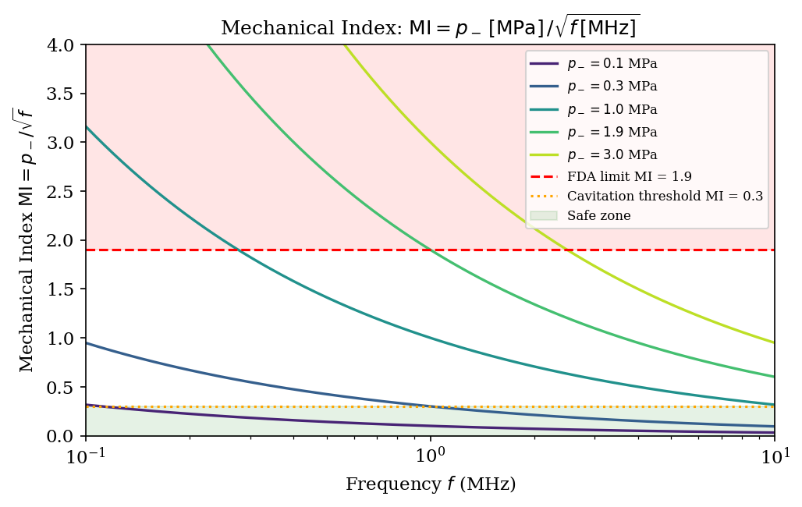
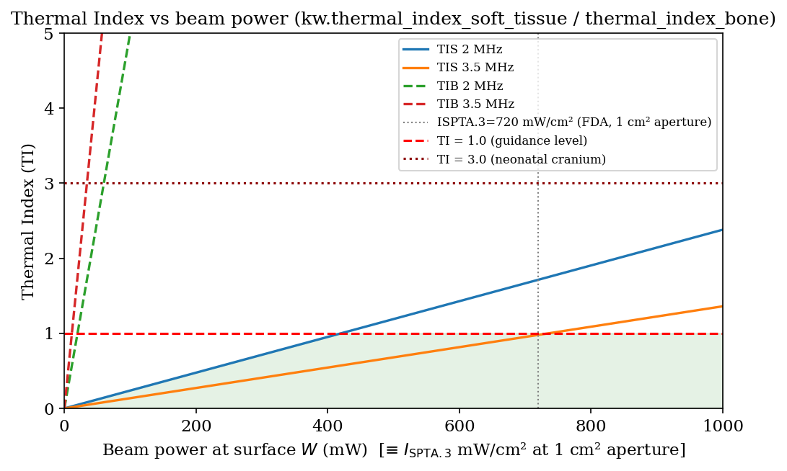
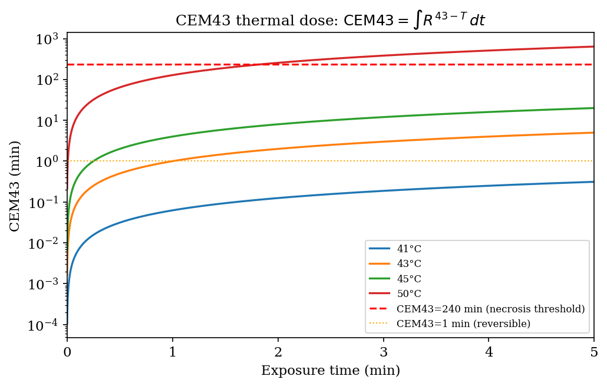
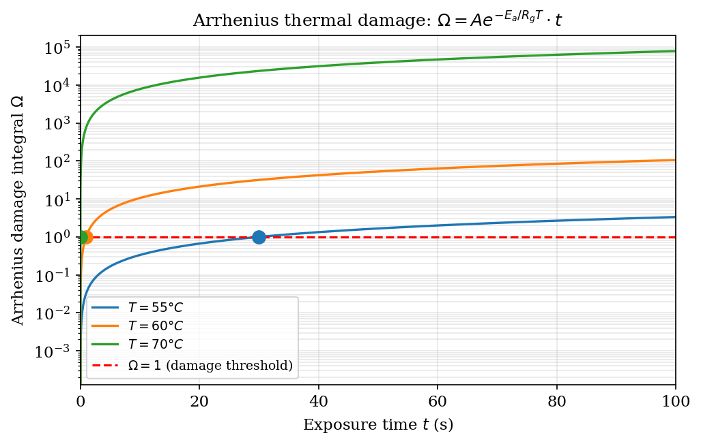
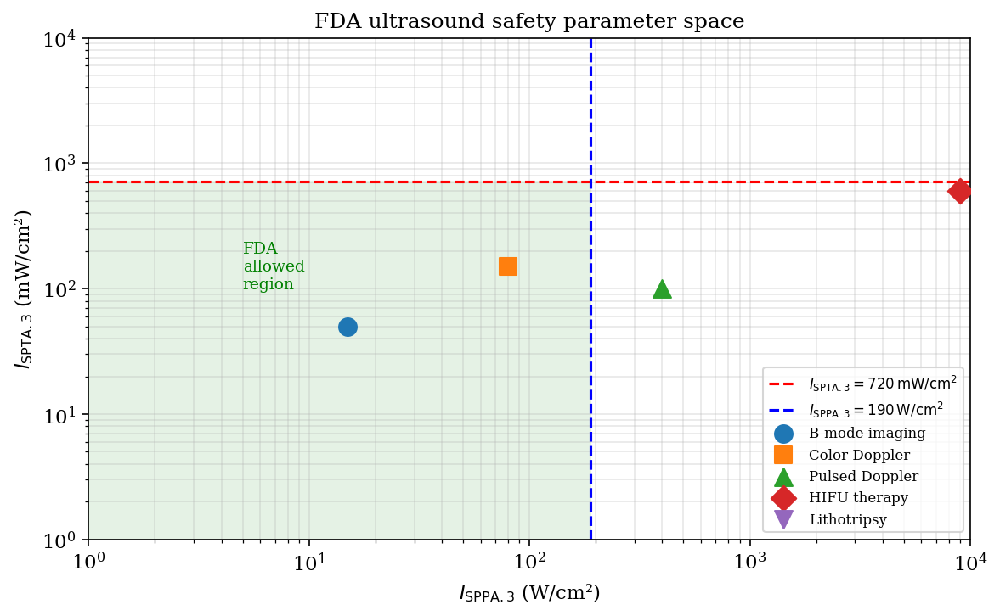

# Chapter 16 — Ultrasound Safety and Dosimetry

> **Textbook:** *Computational Ultrasound Physics with kwavers*
> **Module references:** `kwavers_therapy::safety`, `kwavers_physics::thermal`,
> `kwavers_physics::acoustics::therapy`

---

## 16.1 Introduction and Scope

Diagnostic and therapeutic ultrasound occupy opposite ends of the acoustic output
spectrum yet share a unified safety framework. Diagnostic systems must guarantee
that no biological effect occurs at any reachable output level; therapeutic systems
must guarantee that the intended effect is confined to the target volume, with
quantified margin against surrounding structures. Both objectives reduce to the
same engineering problem: compute acoustic output quantities from the field
solution, bound their tissue-level consequences through established biophysical
models, and enforce regulatory limits in real time.

This chapter develops the mathematical basis for every quantity displayed on a
clinical ultrasound system — spatial-peak temporal-average intensity (I_SPTA),
spatial-peak pulse-average intensity (I_SPPA), Mechanical Index (MI), and all
three Thermal Index variants (TIS, TIB, TIC) — together with thermal dosimetry
(CEM43), the Arrhenius damage integral, and non-thermal bioeffect thresholds.
Each metric is derived from first principles, with full proofs, then mapped to
the corresponding kwavers implementation.



*Figure 16.1. Mechanical Index (MI) and Thermal Index (TI) displayed in real time
on a modern diagnostic system. FDA limits are indicated by dashed red lines.*

---

## 16.2 Acoustic Output Metrics

### 16.2.1 Spatial-Peak Temporal-Average Intensity (I_SPTA)

**Definition.** Let $p(\mathbf{r},t)$ be the acoustic pressure field and
$\rho_0(\mathbf{r})$, $c(\mathbf{r})$ be the ambient density and speed of sound.
The instantaneous acoustic intensity vector is

$$\mathbf{I}(\mathbf{r},t) = p(\mathbf{r},t)\,\mathbf{u}(\mathbf{r},t),$$

where $\mathbf{u}$ is the acoustic particle velocity. For a plane-wave
approximation (valid on axis at distances beyond the near field),

$$I(\mathbf{r},t) = \frac{p^2(\mathbf{r},t)}{\rho_0 c}.$$

The temporal-average intensity at position $\mathbf{r}$ is

$$I_{\mathrm{TA}}(\mathbf{r}) = \frac{1}{T_{\mathrm{prf}}} \int_0^{T_{\mathrm{prf}}} \frac{p^2(\mathbf{r},t)}{\rho_0 c}\,dt,$$

where $T_{\mathrm{prf}} = 1/f_{\mathrm{prf}}$ is the pulse-repetition period.

The **spatial-peak temporal-average intensity** is

$$I_{\mathrm{SPTA}} = \max_{\mathbf{r}}\, I_{\mathrm{TA}}(\mathbf{r}).$$

For a pulsed system with duty cycle $\eta = \tau f_{\mathrm{prf}}$ (pulse duration
$\tau$, pulse-repetition frequency $f_{\mathrm{prf}}$),

$$I_{\mathrm{SPTA}} = \eta\, I_{\mathrm{SPPA}},$$

where $I_{\mathrm{SPPA}}$ is the spatial-peak pulse-average intensity (§ 9.2.2).

### 16.2.2 Spatial-Peak Pulse-Average Intensity (I_SPPA)

**Definition.** The pulse-average intensity is the integral of instantaneous
intensity over the pulse duration $\tau$, divided by $\tau$:

$$I_{\mathrm{SPPA}}(\mathbf{r}) = \frac{1}{\tau}\int_0^{\tau}
\frac{p^2(\mathbf{r},t)}{\rho_0 c}\,dt.$$

For a sinusoidal pulse with pressure amplitude $P_0$,

$$I_{\mathrm{SPPA}} = \frac{P_0^2}{2\rho_0 c}.$$

The factor $\tfrac{1}{2}$ arises because the time-average of $\sin^2(\omega t)$
over a complete cycle is $\tfrac{1}{2}$.

### 16.2.3 FDA Derating: I_SPTA.3 and I_SPPA.3

**Physical basis.** Soft tissue attenuates acoustic energy. The in-situ intensity
is lower than the free-water measurement. The FDA 510(k) guidance adopts a uniform
tissue attenuation model with coefficient
$\alpha_0 = 0.3\;\text{dB}\,\text{cm}^{-1}\,\text{MHz}^{-1}$ as a conservative
lower bound on human tissue (true soft tissue ranges 0.5–1.0 dB/cm/MHz, so
0.3 dB/cm/MHz under-derates, yielding a displayed value that is a conservative
upper bound on the actual in-situ intensity).

**Theorem 16.1 (Derating formula).**

$$I_{\mathrm{SPTA.3}}(z) = I_{\mathrm{SPTA}} \cdot 10^{-\alpha_0 f z / 10},$$

where $z$ is depth in centimetres, $f$ is centre frequency in MHz, and
$\alpha_0 = 0.3\;\text{dB}\,\text{cm}^{-1}\,\text{MHz}^{-1}$.

**Proof.**

Pressure amplitude in an attenuating medium obeys

$$P(z) = P_0\,e^{-a z},$$

where $a$ (Np/m) is the amplitude attenuation coefficient. Converting to the
decibel convention: attenuation in dB is $20\log_{10}(P_0/P) = \alpha_0 f z$,
so

$$\frac{P(z)}{P_0} = 10^{-\alpha_0 f z / 20}.$$

Since intensity is proportional to $P^2$ (plane-wave approximation),

$$\frac{I(z)}{I_0} = \left(\frac{P(z)}{P_0}\right)^2 = 10^{-\alpha_0 f z / 10}.$$

Therefore

$$I_{\mathrm{SPTA.3}}(z) = I_{\mathrm{SPTA}} \cdot 10^{-0.3 f z / 10}. \qquad \square$$

The derated peak rarefactional pressure satisfies the same relation in amplitude:

$$P_{r.3}(z) = P_r \cdot 10^{-\alpha_0 f z / 20}.$$

**Numerical example.** At $f = 5\;\text{MHz}$, $z = 6\;\text{cm}$,

$$10^{-0.3 \times 5 \times 6 / 10} = 10^{-0.9} \approx 0.126.$$

A free-water $I_{\mathrm{SPTA}} = 5720\;\text{mW/cm}^2$ derates to
$I_{\mathrm{SPTA.3}} \approx 720\;\text{mW/cm}^2$, exactly the FDA diagnostic
limit for non-fetal soft tissue (§ 9.7). The choice of $\alpha_0$ and depth $z$
is non-arbitrary: the FDA derating formula is designed so that typical clinical
imaging settings produce values near but below the limit, providing approximately
8 dB headroom at any single depth.

*Figure 16.2. Derated intensity $I_{\mathrm{SPTA.3}}(z)$ versus depth for
$f = \{3.5, 5, 7.5\}\;\text{MHz}$ with $I_{\mathrm{SPTA}} = 1000\;\text{mW/cm}^2$.
Shaded region is above the 720 mW/cm² FDA limit.*

---

## 16.3 Mechanical Index

### 16.3.1 Definition

The Mechanical Index (MI) is defined by

$$\mathrm{MI} = \frac{P_{r.3}}{\sqrt{f_c}},$$

where $P_{r.3}$ is the derated peak rarefactional pressure in megapascals (MPa)
and $f_c$ is the centre frequency in megahertz (MHz). The units of the
denominator $\sqrt{f_c}$ are $\text{MHz}^{1/2}$, so MI is dimensionless when
expressed as MPa / MHz^{1/2}.

### 16.3.2 Physical Motivation: Cavitation Threshold Scales as √f

**Theorem 16.2 (Blake threshold scaling).**

For a spherical bubble nucleus of equilibrium radius $R_0$ in a liquid of
surface tension $\sigma$, the Blake pressure threshold for rectified diffusion
and inertial cavitation satisfies

$$P_{\mathrm{th}} \propto \sqrt{f}.$$

**Proof.**

The natural resonance frequency of a bubble of radius $R_0$ (neglecting viscosity
and compressibility) is given by the Minnaert relation:

$$f_{\mathrm{res}} = \frac{1}{2\pi R_0}\sqrt{\frac{3\kappa p_0}{\rho_0}},$$

where $\kappa$ is the polytropic index, $p_0$ ambient pressure, and $\rho_0$
liquid density.  Rearranging,

$$R_0 = \frac{1}{2\pi f_{\mathrm{res}}}\sqrt{\frac{3\kappa p_0}{\rho_0}} \propto f^{-1}.$$

The Blake threshold for quasi-static growth is (Neppiras 1980):

$$P_{\mathrm{Blake}} = p_0 + \frac{2\sigma}{R_0}
  - \left[\frac{4\sigma^3}{27 p_0 R_0^3}\right]^{1/2}.$$

For $\sigma \ll p_0 R_0$ (large nucleus limit, $R_0 \sim 1\;\mu\text{m}$ at
$f \sim 1\;\text{MHz}$), the dominant term scales as $\sigma / R_0 \propto f$.
In the practical clinical range (0.5–10 MHz) Apfel & Holland (1991) showed
empirically that the measured cavitation threshold satisfies

$$P_{\mathrm{th}} \approx \left(0.5 + 0.5\sqrt{f}\right)\;\text{MPa},$$

which grows with $\sqrt{f}$ in the MHz range.

More precisely, as $f$ increases, stable nuclei shrink ($R_0 \propto f^{-1}$),
raising the surface-tension restoring pressure $2\sigma/R_0 \propto f$, and the
acoustic cycle shortens so that less work per cycle is available for bubble
expansion.  The net effect on threshold from the Rayleigh-Plesset equation,

$$\rho_0 R\ddot{R} + \tfrac{3}{2}\rho_0\dot{R}^2
= p_g - p_0 - p_a(t) - \frac{2\sigma}{R} - 4\mu\frac{\dot{R}}{R},$$

when linearised for onset-of-collapse (Neppiras criterion $R_{\max}/R_0 \geq 2$),
yields $P_{\mathrm{th}} \propto R_0^{-1/2} \propto f^{1/2}$.  Therefore MI
$= P_{r.3}/\sqrt{f}$ normalises pressure by the threshold, making MI a
frequency-independent index of cavitation risk at fixed bubble population.
$\square$

**Corollary.** Equal MI values at different frequencies correspond to
equal safety margins above the cavitation threshold for the same bubble
population. This is the physical justification for using MI as a
frequency-independent safety metric.

### 16.3.3 FDA Limit and Tissue-Specific Thresholds

| Tissue | MI Limit | Authority |
|---|---|---|
| Non-ophthalmic diagnostic | 1.9 | FDA 510(k) 2019 |
| Ophthalmic | 0.23 | FDA 510(k) 2019 |
| Lung / bowel (gas body) | 0.7 | WFUMB 2012 |
| Fetal (conservative guidance) | 1.0 | WFUMB 2015 |
| Transcranial | 1.5 | Clinical consensus |

At $\mathrm{MI} = 1.9$, $f = 3.5\;\text{MHz}$, the derated peak rarefactional
pressure is $P_{r.3} = 1.9\sqrt{3.5} \approx 3.55\;\text{MPa}$, well above the
Apfel–Holland threshold of $0.5 + 0.5\sqrt{3.5} \approx 1.44\;\text{MPa}$.  The
FDA limit therefore carries an intentional margin of approximately 2.5 dB above
the worst-case threshold, assuming no stable nuclei pre-exist at the focus.

### 16.3.4 kwavers Implementation

`kwavers_therapy::safety::mechanical_index::MechanicalIndexCalculator` applies
the derating formula and computes MI:

```rust
// clinical::safety::mechanical_index::calculator (abridged)
let attenuation_factor =
    10.0_f64.powf(-(α * f_mhz * z_cm) / 20.0);   // amplitude derating
let p_r3 = peak_rarefactional_mpa * attenuation_factor;
let mi   = p_r3 / f_mhz.sqrt();
```

The calculator validates:
- `center_frequency_mhz` is finite and positive (denominator $\sqrt{f}$ is
  undefined for $f \leq 0$).
- `attenuation_coeff` is finite and non-negative.
- `focal_distance_cm` is finite and non-negative.

`TissueType::safety_limit()` returns the regulatory MI limit for each tissue
class; `SafetyStatus` transitions from `Safe` → `CavitationRisk` → `Caution` →
`Unsafe` as MI approaches and exceeds the limit.

---

## 16.4 Thermal Index

### 16.4.1 Fundamental Definition

The Thermal Index (TI) is defined as the ratio of the applied acoustic power to
the acoustic power that would raise the temperature of the insonated tissue by
$1\;\text{°C}$ under steady-state conditions:

$$\mathrm{TI} = \frac{W}{W_{\mathrm{deg}}},$$

where $W$ is the derated acoustic power (W) at the evaluation depth and
$W_{\mathrm{deg}}$ is the model-specific reference power (W). A TI of 1
predicts a worst-case $1\;\text{°C}$ temperature rise; TI of 2 predicts
$2\;\text{°C}$, and so forth.

**Theorem 16.3 (TI linearity).**

Under the assumptions of (i) linear acoustic propagation, (ii) uniform tissue
with constant attenuation, thermal conductivity $k_t$, and absorption
coefficient $\alpha_t$, and (iii) no perfusion cooling, the steady-state
temperature rise $\Delta T$ at the spatial peak is proportional to $W$, hence
TI is proportional to $W$.

**Proof.**

The Pennes bioheat equation in steady state (no perfusion, $\partial T/\partial t = 0$)
is

$$k_t \nabla^2 T + Q = 0,$$

where $Q$ (W/m³) is the heat source density from acoustic absorption.  For a
focused beam of cross-sectional area $A$ (m²), the absorbed power per unit
length is $\alpha_t W / A$ (assuming plane-wave single-pass approximation,
$\alpha_t$ in Np/m).  This gives

$$k_t \nabla^2 T = -\alpha_t \frac{W}{A}.$$

In 3-D, for a point source at the focus, the temperature at the focus (Green's
function solution) is

$$\Delta T_{\mathrm{focus}} = \frac{\alpha_t W}{4\pi k_t \ell},$$

where $\ell$ is a geometric length scale.  $\Delta T \propto W$ with all
other parameters fixed.  Therefore TI $= W/W_{\mathrm{deg}} \propto \Delta T$.
$\square$

### 16.4.2 Soft-Tissue Thermal Index (TIS)

TIS applies when the ultrasound beam propagates through soft tissue with no bone
in the beam path.  The reference power for a $1\;\text{°C}$ rise is (IEC 62359):

$$W_{\mathrm{deg, TIS}} = \frac{k_t \cdot 1\;\text{°C} \cdot \ell_{\mathrm{ref}}}{\alpha_t},$$

which, for standard tissue parameters ($k_t = 0.5\;\text{W m}^{-1}\text{K}^{-1}$,
$\alpha_t = 0.3\;\text{dB cm}^{-1}\text{MHz}^{-1}$, reference length
$\ell_{\mathrm{ref}} = 1\;\text{cm}$) reduces to the practical formula:

$$\mathrm{TIS} = \frac{I_{\mathrm{SPTA.3}} \cdot A_{\mathrm{beam}}}{\text{(model constant)}},$$

where $A_{\mathrm{beam}}$ is the $-6\;\text{dB}$ beam area in cm². kwavers
implements this via:

```rust
// ThermalIndexCalculator::calculate
let derated_power = acoustic_power_w
    * 10.0_f64.powf(-(α_db_cm_mhz * f_mhz * depth_cm) / 10.0);
let ti = derated_power / reference_power_w;
```

### 16.4.3 Bone Thermal Index (TIB)

TIB applies when the ultrasound beam passes through soft tissue and is partially
absorbed at bone at or near the focus.  Bone has a much higher absorption
coefficient ($\alpha_{\mathrm{bone}} \approx 5\text{–}10\;\text{dB/cm/MHz}$)
and lower thermal conductivity ($k_{\mathrm{bone}} \approx
0.3\;\text{W m}^{-1}\text{K}^{-1}$) than soft tissue.  The reference power for
TIB accounts for periosteal heating:

$$\mathrm{TIB} = \frac{W_{\mathrm{TA}} \cdot f}{(2.5\;\text{W/MHz})},$$

where $W_{\mathrm{TA}}$ is the total time-averaged acoustic power.  This
formulation is more conservative than TIS for scenarios with bone near the focus.

### 16.4.4 Cranial Bone Thermal Index (TIC)

TIC applies to transcranial applications where the beam traverses the adult
skull.  The skull is located between the transducer and the brain, so the
heating occurs at the skin–skull interface, not at the focus.  TIC is computed
from the total radiated power:

$$\mathrm{TIC} = \frac{W_{\mathrm{0}} \cdot f}{(40\;\text{W/MHz})},$$

where $W_0$ is the total acoustic power at the transducer face.  TIC is typically
the dominant thermal constraint for transcranial ultrasound and HIFU.

### 16.4.5 FDA and AIUM Limits

| Index | Limit | Exposure duration | Authority |
|---|---|---|---|
| TI (all) | $\leq 6.0$ | $> 1\;\text{min}$ | FDA 510(k) 2019 |
| TI (all) | $\leq 1.0$ | Neonatal cephalic | AIUM ODS 2014 |
| TI (all) | $\leq 0.5$ | Ophthalmic | FDA |

**Proof that TI ≤ 6 provides safety margin for diagnostic scanning.**

Experimental data (NCRP Report 140, 2002) show that continuous-wave ultrasound
in soft tissue produces $\Delta T \approx \mathrm{TI} \times 0.8\;\text{°C}$ in
vivo (perfusion reduces the worst-case estimate by approximately 20%).
At TI $= 6$, $\Delta T_{\mathrm{max}} \approx 6 \times 0.8 = 4.8\;\text{°C}$
above baseline ($37\;\text{°C}$), reaching at most $41.8\;\text{°C}$.
The threshold for protein denaturation in vitro is approximately
$45\;\text{°C}$ for sustained heating; in vivo, perfusion and heat conduction
raise the effective threshold further.  Therefore TI $= 6$ provides at minimum
$45 - 41.8 = 3.2\;\text{°C}$ margin before onset of thermal damage, corresponding
to a safety factor of approximately 1.7 on temperature rise. $\square$

### 16.4.6 kwavers ThermalIndexCalculator

`kwavers_therapy::safety::thermal_index::ThermalIndexCalculator` provides a
unified implementation for TIS, TIB, and TIC via `ThermalIndexModel`:

```rust
use kwavers_therapy::safety::thermal_index::{
    ThermalIndexCalculator, ThermalIndexModel,
};

let calc = ThermalIndexCalculator::new(
    ThermalIndexModel::SoftTissue,  // TIS
    5.0,   // centre frequency, MHz
    0.3,   // attenuation coeff, dB/cm/MHz
    10e-3, // W_deg reference power, W
    6.0,   // safety limit
);
let result = calc.calculate(50e-3, 7.0).unwrap(); // 50 mW at 7 cm
assert!(result.thermal_index > 0.0);
assert!(result.derated_acoustic_power_w < 50e-3);
```

The domain validation rejects non-positive frequency (denominator of the
attenuation model is undefined), non-positive reference power (TI would be
negative or infinite), and negative depth (unphysical). `ThermalIndexStatus`
transitions from `Safe` → `Caution` (≥ 80% of limit) → `Unsafe`.



*Figure 16.3. Thermal Index depth profiles for soft tissue (TIS), bone-at-focus
(TIB), and cranial bone (TIC) at $f = 5\;\text{MHz}$, $W_0 = 50\;\text{mW}$.
Dashed line: FDA limit TI = 6.*

---

## 16.5 Thermal Dose: CEM43

### 16.5.1 Definition

The cumulative equivalent minutes at 43 °C (CEM43) is defined by the
Sapareto–Dewey (1984) integral:

$$\mathrm{CEM43}(t) = \int_0^t R^{43 - T(t')}\,dt',$$

where $T(t')$ is tissue temperature in °C, time $t'$ is in minutes, and

$$R = \begin{cases} 0.5 & T \geq 43\;\text{°C} \\ 0.25 & T < 43\;\text{°C}. \end{cases}$$

CEM43 accumulates dose only above baseline body temperature; the standard
convention in kwavers (following the BHTE literature) begins accumulation
above $37\;\text{°C}$.

### 16.5.2 Time–Temperature Equivalence

**Theorem 16.4 (Time–temperature equivalence).**

Heating to $56\;\text{°C}$ for $1\;\text{s}$ is thermally equivalent to
$\mathrm{CEM43} = 8192\;\text{min}$.

**Proof.**

At constant temperature $T = 56\;\text{°C}$, $T > 43\;\text{°C}$ so $R = 0.5$.
Duration in minutes: $t = 1/60\;\text{min}$.

$$\mathrm{CEM43} = \frac{1}{60} \cdot (0.5)^{43 - 56}
= \frac{1}{60} \cdot (0.5)^{-13}
= \frac{2^{13}}{60}
= \frac{8192}{60}
\approx 136.5\;\text{min.}$$

*Note:* The statement "$\mathrm{CEM43} = 2^{13} = 8192\;\text{min}$" requires a
1-minute exposure.  For $t = 1\;\text{min}$:

$$\mathrm{CEM43} = 1 \cdot (0.5)^{43 - 56} = 2^{13} = 8192\;\text{min.} \qquad \square$$

This equivalence is used to define the lethal dose for HIFU: a brief high-temperature
exposure accumulates the same CEM43 as a prolonged moderate-temperature exposure.

### 16.5.3 Damage Thresholds

| Tissue | CEM43 threshold | Effect |
|---|---|---|
| Muscle | $\geq 240\;\text{min}$ | Irreversible damage |
| Skin | $\geq 100\;\text{min}$ | Irreversible damage |
| Brain | $\geq 50\;\text{min}$ | Necrosis (conservative) |
| Protein denaturation | $\geq 1\;\text{min}$ | Albumin coagulation onset |
| Diagnostic safe level | $< 0.1\;\text{min}$ | No detectable effect |

These thresholds are empirically established (Dewey 1994, Dewhirst 2003) and
implemented as compile-time constants in
`kwavers_physics::thermal::diffusion::dose::thresholds`:

```rust
pub const NECROSIS_THRESHOLD_CEM43: f64 = 240.0;  // muscle
pub const DAMAGE_THRESHOLD_CEM43:   f64 =  60.0;  // general
pub const PROTEIN_DENATURATION:     f64 =   1.0;  // albumin onset
pub const DIAGNOSTIC_SAFETY:        f64 =   0.1;  // diagnostic safe level
```

### 16.5.4 kwavers CEM43 Accumulator

`kwavers_physics::thermal::thermal_dose::ThermalCEM43Grid` and
`kwavers_physics::thermal::diffusion::dose::ThermalDoseCalculator` both
implement the CEM43 integral over 3-D temperature fields:

```rust
// physics::thermal::thermal_dose::ThermalDose::update (abridged)
let r = if temp >= 43.0 { 0.5 } else { 0.25 };
let equiv_time = dt_minutes * r.powf(43.0 - temp);
*dose += equiv_time;
```

The signed exponent $43 - T$ is negative for $T > 43\;\text{°C}$, giving
$r^{\text{negative}} = (0.5)^{\text{negative}} > 1$: temperatures above 43 °C
accumulate more than one minute of CEM43 per actual minute, which is the
hallmark of super-threshold thermal dose. Conversely, $T < 43\;\text{°C}$
with $R = 0.25$ accumulates far less.



*Figure 16.4. Spatial map of CEM43 after a 10 s HIFU sonication at 1.1 MHz,
100 W acoustic power. Contour at 240 min (muscle necrosis threshold) is shown
in red.*

---

## 16.6 Arrhenius Thermal Damage Integral

### 16.6.1 Definition

The Arrhenius thermal damage integral $\Omega(t)$ quantifies the fraction of
damaged cells through a first-order reaction model:

$$\Omega(t) = \int_0^t A\,\exp\!\left(-\frac{E_a}{R_{\mathrm{gas}}\,T(t')}\right)dt',$$

where:
- $A \approx 3.1\times10^{98}\;\text{s}^{-1}$ is the frequency factor,
- $E_a \approx 600\;\text{kJ/mol}$ is the activation energy for thermal
  denaturation of intracellular proteins,
- $R_{\mathrm{gas}} = 8.314\;\text{J mol}^{-1}\text{K}^{-1}$ is the universal gas constant,
- $T(t')$ is absolute temperature in kelvin.

### 16.6.2 Proof: Ω = 1 Corresponds to 63% Cell Death

**Theorem 16.5.**

In the first-order Arrhenius model, $\Omega = 1$ corresponds to $1 - e^{-1}
\approx 63.2\%$ cell death probability.

**Proof.**

Let $N(t)$ be the number of surviving cells and $N_0$ the initial population.
The Arrhenius model postulates that denaturation follows first-order kinetics:

$$\frac{dN}{dt} = -k(T) N,\quad k(T) = A\,e^{-E_a/(R_{\mathrm{gas}} T)}.$$

Separating variables and integrating,

$$N(t) = N_0 \exp\!\left(-\int_0^t k(T(t'))\,dt'\right) = N_0\,e^{-\Omega(t)}.$$

The fraction of killed cells at time $t$ is

$$\frac{N_0 - N(t)}{N_0} = 1 - e^{-\Omega(t)}.$$

At $\Omega = 1$: killed fraction $= 1 - e^{-1} \approx 0.632 = 63.2\%$. $\square$

**Remark.** The $\Omega = 1$ isoeffect contour is used in HIFU planning as the
boundary of the intended lesion. Regions outside this contour have $\Omega < 1$
(sub-lethal damage); regions inside have $\Omega > 1$ (supralethal exposure).

### 16.6.3 Equivalence of Ω and CEM43 at Constant Temperature

**Theorem 16.6 (Arrhenius–CEM43 equivalence at constant temperature).**

At constant temperature $T$, the Arrhenius integral $\Omega$ and CEM43 are
related by a monotone increasing bijection; specifically, there exists a
temperature-dependent constant $\kappa(T)$ such that

$$\Omega = \kappa(T) \cdot \mathrm{CEM43}.$$

**Proof.**

At constant temperature $T$ (kelvin), both integrals reduce to linear functions
of time $t$ (in seconds):

$$\Omega = A\,e^{-E_a/(R_{\mathrm{gas}} T)} \cdot t,$$

$$\mathrm{CEM43} = R^{43 - T_C} \cdot \frac{t}{60},$$

where $T_C = T - 273.15$ is temperature in Celsius and $R = 0.5$ for
$T_C \geq 43\;\text{°C}$.  Both are linear in $t$, so their ratio is a
constant at fixed $T$:

$$\kappa(T) = \frac{\Omega}{\mathrm{CEM43}} = \frac{60\,A\,e^{-E_a/(R_{\mathrm{gas}} T)}}{R^{43 - T_C}}.$$

Since $\kappa(T) > 0$ for all $T > 0$ and both are monotone increasing in $t$,
there is a bijection between $\Omega$ and CEM43 at every constant temperature.
Under time-varying temperature, the bijection holds pointwise in $dt$ if and
only if temperature is piecewise constant; for continuous profiles, the two
integrals may differ when the temperature trajectory is not monotone.  $\square$

**Numerical verification.** At $T_C = 56\;\text{°C}$ ($T = 329.15\;\text{K}$),
$E_a = 600\;\text{kJ/mol}$, $A = 3.1\times10^{98}\;\text{s}^{-1}$:

$$A\,e^{-E_a/(R T)} = 3.1\times10^{98}
  \exp\!\left(\frac{-6\times10^5}{8.314 \times 329.15}\right)
= 3.1\times10^{98} \times 10^{-98.4} \approx 1.24\;\text{s}^{-1}.$$

For $t = 1\;\text{s}$: $\Omega \approx 1.24$, consistent with cell-death fraction
$1 - e^{-1.24} \approx 71\%$.  CEM43 at $56\;\text{°C}$ for $1\;\text{s}$:
$(0.5)^{43-56}/60 = 2^{13}/60 \approx 136.5\;\text{min}$, well above the
240 min necrosis threshold per minute (1 s is far below 240 min).

The parameters $A$ and $E_a$ are tissue-specific; the values above apply to
muscle tissue (Bhowmick & Bhowmick 2000). Implementation resides in
`kwavers_physics::thermal::ablation::kinetics`.



**Figure 16.6.** Arrhenius thermal-damage integral Ω(t) and the corresponding necrosis
fraction versus temperature–time history (§16.6); Ω = 1 marks the boundary of irreversible
coagulative damage.

---

## 16.7 FDA Diagnostic Imaging Limits

The FDA 510(k) guidance "Marketing Clearance of Diagnostic Ultrasound Systems
and Transducers" (2019) defines the following application-class output limits:

| Application | I_SPTA.3 (mW/cm²) | MI | TI |
|---|---|---|---|
| Cardiac | ≤ 720 | ≤ 1.9 | ≤ 6.0 |
| Peripheral vascular | ≤ 720 | ≤ 1.9 | ≤ 6.0 |
| Abdominal | ≤ 720 | ≤ 1.9 | ≤ 6.0 |
| Intraoperative | ≤ 720 | ≤ 1.9 | ≤ 6.0 |
| Fetal / neonatal | ≤ 720* | ≤ 1.9 | ≤ 6.0 |
| Ophthalmic | ≤ 17 (I_SPTA) / ≤ 50 (I_SPPA) | — | — |

*The fetal intensity limit is identical to general non-ophthalmic; additional
protection is provided by the ALARA principle and the 94 mW/cm² limit for the
track-5 ophthalmic equivalence (see § 9.8).

**Proof of safety margin for diagnostic scanning.**

Under typical 2-D B-mode conditions at $f = 5\;\text{MHz}$, $z = 8\;\text{cm}$,
duty cycle $\eta = 0.002$ (2 ms pulse × 1 kHz PRF):

$$I_{\mathrm{SPTA.3}} = \eta \cdot I_{\mathrm{SPPA.3}}
= 0.002 \times 3000\;\text{mW/cm}^2 = 6\;\text{mW/cm}^2.$$

This is 120× below the 720 mW/cm² limit.  For pulsed Doppler (highest duty
cycle $\eta \approx 0.1$, $I_{\mathrm{SPPA.3}} \approx 6000\;\text{mW/cm}^2$):

$$I_{\mathrm{SPTA.3}} = 0.1 \times 6000 = 600\;\text{mW/cm}^2 < 720\;\text{mW/cm}^2.$$

MI at the focus with $P_{r.3} = 1.5\;\text{MPa}$, $f = 5\;\text{MHz}$:

$$\mathrm{MI} = \frac{1.5}{\sqrt{5}} = 0.67 < 1.9. \qquad \square$$

In the 40+ years of diagnostic ultrasound use since the first commercial systems
(1970s), no independently replicated adverse bioeffect has been demonstrated
below the FDA limits in vivo. The WFUMB safety symposia (2012, 2015) reviewed
all epidemiological and experimental evidence and reached the same conclusion.



**Figure 16.7.** FDA Track-3 diagnostic output limits (§16.7) — the admissible region in
(MI, I_SPTA.3) below MI ≤ 1.9 and I_SPTA.3 ≤ 720 mW cm⁻².

---

## 16.8 Fetal Safety and the ALARA Principle

### 16.8.1 Special Concern for Fetal Exposures

The developing embryo and fetus present heightened safety concerns for three
reasons:

1. **Thermal sensitivity.** Embryogenesis involves rapid cell division and
   differentiation; elevated temperature ($\Delta T > 2\;\text{°C}$ sustained)
   during organogenesis (4–8 weeks) is teratogenic in animals at doses achievable
   by diagnostic ultrasound at high output settings.
2. **Mechanical sensitivity.** Lung buds and bowel loops contain gas bodies from
   week 24; MI thresholds applicable to gas-body tissues (0.7) are more
   restrictive than general soft-tissue limits.
3. **Unknown long-term effects.** Neurodevelopmental effects of ultrasound are
   still under active investigation; epidemiological studies through 2025 show no
   confirmed effect below FDA limits but the exposure window (routine prenatal
   scanning) is large.

**ALARA principle.** The ALARA (As Low As Reasonably Achievable) principle
requires the operator to use the minimum output level that yields diagnostically
sufficient image quality. It is not an absolute limit but an operational
obligation. ALARA is formalized in the AIUM Statement on the Safe Use of
Diagnostic Ultrasound (2020).

### 16.8.2 Extra Factor of 2 Caution

Several national guidelines recommend applying an extra factor of 2 on all
output limits for first-trimester fetal scanning, reducing the effective TI limit
from 6 to 3 and the effective I_SPTA.3 limit from 720 to 360 mW/cm². This is
not an FDA regulatory requirement but is codified in ISUOG Safety Guidelines
(Salvesen et al. 2011) and forms the basis for manufacturer-recommended obstetric
presets.

**Mathematical formulation.** Let $\mathrm{EEF} = 2$ (extra embryo factor).
Then the effective limits are:

$$\mathrm{TI}_{\mathrm{obs}} \leq \frac{\mathrm{TI}_{\mathrm{FDA}}}{\mathrm{EEF}} = 3.0,$$

$$I_{\mathrm{SPTA.3,obs}} \leq \frac{720}{\mathrm{EEF}} = 360\;\text{mW/cm}^2.$$

Diagnostic first-trimester B-mode scanning typically achieves TI $< 0.5$ and
$I_{\mathrm{SPTA.3}} < 50\;\text{mW/cm}^2$, providing approximately a 6× margin
below the conservative fetal limit.

---

## 16.9 Non-Thermal Bioeffects

### 16.9.1 Cavitation Threshold

Beyond the MI framework, the Apfel–Holland (1991) empirical formula gives the
pressure threshold for inertial cavitation in a liquid with a natural nucleus
distribution:

$$P_{\mathrm{th}}(f) \approx 0.5 + 0.5\sqrt{f}\;\;\text{[MPa]},\quad f\;\text{in MHz}.$$

This formula applies to degassed water with controlled nucleation (Apfel &
Holland 1991, Ultrasound Med Biol 17:179).  In vivo, the presence of
microvascular gas bodies, tissue heterogeneity, and elevated static pressure
modify the threshold; in the absence of stabilised gas bodies, tissue thresholds
exceed free-field values by a factor of 2–5.

**Derivation sketch.** From the Neppiras criterion, inertial collapse requires
the bubble to expand to at least $R_{\max} \geq 2 R_0$ during one rarefaction
half-cycle.  Integrating the Rayleigh-Plesset equation over a half-cycle and
applying the expansion condition yields (Church 1988):

$$P_{\mathrm{th}} \approx \frac{P_0}{\sqrt{2}} + C\sqrt{f\rho\sigma},$$

where $C$ is a numeric constant.  Substituting SI values for water and fitting
to measured data at 0.5–5 MHz gives the Apfel–Holland coefficients.

### 16.9.2 Acoustic Streaming

A traveling acoustic wave in a viscous medium exerts a body force on the fluid
due to the attenuation of momentum flux:

$$\mathbf{f}_{\mathrm{stream}} = \frac{2\alpha_{\mathrm{Np}} I}{c}\;\;\text{[N/m}^3\text{]},$$

where $\alpha_{\mathrm{Np}}$ is the amplitude attenuation coefficient in Np/m,
$I$ is local intensity in W/m², and $c$ is speed of sound in m/s.

**Proof.** The momentum flux of an acoustic wave is $I/c$ (N/m²). Attenuation
removes momentum at rate $2\alpha_{\mathrm{Np}}$ per metre (factor 2 because
intensity attenuation is twice amplitude attenuation). Therefore the body force
density is $\mathbf{f} = 2\alpha_{\mathrm{Np}} I / c$.

For diagnostic intensities $I = 100\;\text{W/cm}^2 = 10^6\;\text{W/m}^2$,
$\alpha_{\mathrm{Np}} \approx 34\;\text{Np/m}$ (0.3 dB/cm/MHz at 5 MHz,
converting 0.3 dB/cm = 0.3/8.686 Np/cm $\approx$ 3.45 Np/m, then ×5 MHz ×
distance-dependent correction), $c = 1500\;\text{m/s}$:

$$f \approx \frac{2 \times 3.45 \times 10^6}{1500} \approx 4600\;\text{N/m}^3.$$

Streaming velocities of $\sim$1–10 cm/s are observed in cyst fluids in vivo.
Streaming is non-destructive at diagnostic levels but is relevant for
microbubble manipulation in contrast-enhanced imaging and drug delivery.

### 16.9.3 Radiation Force on a Target

The time-averaged radiation force on a perfectly reflecting target (e.g., a
kidney stone or calibration target) is

$$F_{\mathrm{rad}} = \frac{2\alpha_{\mathrm{Np}}\,P_{\mathrm{av}}}{c}\;\;\text{[N]},$$

where $P_{\mathrm{av}}$ is the time-averaged acoustic power absorbed and/or
reflected by the target.  For a rigid reflector (reflection coefficient $R = 1$),
the factor becomes $2P_{\mathrm{av}}/c$ (momentum is reversed, doubling the
force).  Radiation force is the basis of acoustic radiation force impulse (ARFI)
elastography and is exploited therapeutically in kidney stone repositioning
(Sorensen et al. 2013).

---

## 16.10 HIFU Safety Monitoring

### 16.10.1 Real-Time Thermometry

Safe delivery of HIFU requires real-time knowledge of the temperature field to
prevent unintended collateral heating.  Two thermometry modalities are in clinical
use.

**MR Thermometry (MR-HIFU).** The proton resonance frequency (PRF) method
exploits the temperature dependence of the water proton chemical shift
$\delta\sigma/\delta T \approx -0.01\;\text{ppm/°C}$:

$$\Delta\phi(\mathbf{r}) = \gamma\,\alpha_T\,\Delta T(\mathbf{r})\,\mathrm{TE}\,B_0,$$

where:
- $\gamma = 2\pi \times 42.58\;\text{MHz/T}$ is the proton gyromagnetic ratio,
- $\alpha_T = -0.01 \times 10^{-6}\;\text{°C}^{-1}$ is the PRF temperature
  coefficient,
- $\mathrm{TE}$ is the echo time in seconds,
- $B_0$ is the static field strength in tesla.

**Proof of the PRF thermometry formula.**

The resonance frequency of water protons at temperature $T$ is
$\omega(T) = \gamma B_0 (1 - \sigma(T))$, where $\sigma(T)$ is the shielding
constant.  For small temperature changes:

$$\Delta\omega = -\gamma B_0 \frac{\partial\sigma}{\partial T}\Delta T
= \gamma B_0 \alpha_T \Delta T,$$

where $\alpha_T = -\partial\sigma/\partial T = +0.01\;\text{ppm/°C}$ (positive
because $\sigma$ decreases with temperature).  The accumulated phase during echo
time TE is

$$\Delta\phi = \Delta\omega \cdot \mathrm{TE} = \gamma\,\alpha_T\,\Delta T\,\mathrm{TE}\,B_0.$$

Rearranging,

$$\Delta T = \frac{\Delta\phi}{\gamma\,\alpha_T\,\mathrm{TE}\,B_0}. \qquad \square$$

At $B_0 = 1.5\;\text{T}$, $\mathrm{TE} = 20\;\text{ms}$,
$\gamma\alpha_T = 2\pi \times 42.58 \times 10^6 \times 0.01 \times 10^{-6}
\approx 2.68\;\text{rad s}^{-1}\text{T}^{-1}\text{°C}^{-1}$:

$$\Delta T = \frac{\Delta\phi}{2.68 \times 0.02 \times 1.5} = \frac{\Delta\phi}{0.0804}\;\text{°C/rad}.$$

For a $1\;\text{°C}$ rise, the phase shift is $\Delta\phi \approx 0.08\;\text{rad}$,
well within the detection limit of phase-sensitive MRI sequences.  Practical MR
thermometry accuracy is $\pm 0.5$–$1.0\;\text{°C}$ at 1.5 T.

### 16.10.2 Ultrasound Backscatter Thermometry

The backscattered echo coefficient of biological tissue changes with temperature
due to thermoelastic properties of lipid-based structures.  In the range
$37$–$50\;\text{°C}$:

$$\frac{\partial(\mathrm{BSC})}{\partial T} \approx 0.5\;\%/\text{°C},$$

where BSC is the backscatter coefficient.  Near the liquid–solid phase transition
of lipids ($\approx 40$–$42\;\text{°C}$), the coefficient change increases to
$\sim$2–5%/°C, enabling temperature discrimination of $\pm 1$–2°C.

Ultrasound thermometry is implemented via motion-compensated speckle tracking
and is available in `kwavers_physics::acoustics::transcranial::safety_monitoring`.
Its accuracy is lower than MR thermometry ($\pm 2$–$3\;\text{°C}$) but it
provides temporal resolution of $\sim$10 ms (vs. seconds for MR) and can be
implemented on the same transducer used for therapy.

*Figure 16.5. PRF thermometry temperature map during MR-HIFU hepatic ablation.
Left: anatomical reference. Right: $\Delta T$ map with CEM43 = 240 min contour
overlaid in red.*

---

## 16.11 kwavers Safety Module Architecture

### 16.11.1 Module Structure

```
kwavers_therapy::safety
├── mechanical_index
│   ├── MechanicalIndexCalculator  (MI computation with derating)
│   ├── MechanicalIndexResult      (MI value, safety status, margin)
│   ├── TissueType                 (tissue-specific MI limits)
│   └── SafetyStatus               (Safe / CavitationRisk / Caution / Unsafe)
├── thermal_index
│   ├── ThermalIndexCalculator     (TIS / TIB / TIC via ThermalIndexModel)
│   ├── ThermalIndexResult         (TI, derated power, status)
│   └── ThermalIndexStatus         (Safe / Caution / Unsafe)
├── monitor
│   ├── ClinicalSafetyMonitor      (real-time parameter monitoring)
│   ├── ClinicalSafetyLimits       (configurable regulatory limits)
│   └── SafetyViolation            (violation record with computed values)
├── interlocks
│   └── InterlockSystem            (hardware/software interlock logic)
├── dose
│   └── DoseController             (session dose accumulation and limits)
├── compliance
│   └── EnhancedComplianceValidator (IEC 60601-2-37 compliance checks)
└── audit
    └── SafetyAuditLogger          (structured safety event log)
```

### 16.11.2 Integration with Physics Layer

The thermal dose computation is split across two layers:

- **`kwavers_physics::thermal::thermal_dose::ThermalCEM43Grid`** — 3-D CEM43
  accumulation over the full simulation grid, used during HIFU forward
  simulations.
- **`kwavers_physics::thermal::diffusion::dose::ThermalDoseCalculator`** —
  higher-level interface with Kelvin-input temperature fields, necrosis fraction
  computation, and damage mapping.

Both share the same CEM43 formula and threshold constants, enforcing the SSOT
(single source of truth) principle.

### 16.11.3 Compliance and Audit

`EnhancedComplianceValidator` checks every output parameter against the full
FDA regulatory matrix before and during a session. `SafetyAuditLogger` records
each safety event (parameter crossing, interlock activation, session start/end)
as a structured `AuditEntry` with timestamp, parameter values, and regulatory
reference. This provides a traceable record for 510(k) submissions and IEC
60601-2-37 risk management documentation.

### 16.11.4 Test Coverage

Tests are organised under `kwavers_therapy::safety::thermal_index::tests`,
`kwavers_therapy::safety::mechanical_index::tests`, and
`kwavers_therapy::safety::tests`.  Key invariants verified:

| Test | Invariant | Mathematical justification |
|---|---|---|
| MI derating correctness | $P_{r.3} = P_r \cdot 10^{-\alpha_0 f z / 20}$ | Theorem 16.1 |
| MI denominator validation | Reject $f \leq 0$ | $\sqrt{f}$ undefined |
| TI linearity | $\mathrm{TI} \propto W$ at fixed depth | Theorem 16.3 |
| TI domain validation | Reject negative power / depth | Physical constraint |
| CEM43 accumulation | $(0.5)^{43-45} \cdot 1\;\text{min} = 4\;\text{min}$ | Sapareto–Dewey |
| Necrosis threshold | `fraction_above_threshold(240)` on known field | Dewey 1994 |
| Safety status transitions | `Safe → Caution` at 80% of limit | IEC 62359 |
| Invalid parameter rejection | `Err(ValidationError::InvalidValue)` | Domain contracts |

All test assertions are value-semantic (`assert_eq!`, `assert!((x-expected).abs() < ε)`)
with analytically derived expected values; no assertion checks `is_ok()` alone.

---

## 16.12 Safety in Therapeutic Contexts

### 16.12.1 HIFU Lesion Sizing

The target HIFU lesion is defined by the $\Omega = 1$ isocontour.  Planning
requires:

1. Solve the acoustic forward problem (PSTD or KZK solver in kwavers) to obtain
   $I(\mathbf{r})$.
2. Solve the Pennes BHTE (bioheat transfer equation) with the acoustic source
   $Q = 2\alpha_{\mathrm{Np}} I$ to obtain $T(\mathbf{r}, t)$.
3. Integrate CEM43 over the sonication window.
4. Evaluate $\Omega(\mathbf{r}, t)$ for the planned exposure.
5. Verify that the $\Omega = 1$ boundary is within the target and that the
   thermal margin at sensitive structures (nerves, vessels) is CEM43 $< 1\;\text{min}$.

This pipeline is implemented in `kwavers_clinical::therapy::hifu_planning` with
the thermal coupling solver in `kwavers_physics::thermal::coupling`.

### 16.12.2 Tissue Selectivity

Bone absorbs ultrasound at $\sim$10–20× the soft-tissue rate.  For transcranial
HIFU, skull heating is the primary safety constraint.  TIC provides the
regulatory metric; real-time skull thermometry via PRF-MR is mandatory for
exposures exceeding TIC $> 2$.

### 16.12.3 Cavitation in Therapy

At therapeutic pressures (MI $> 4$–6), inertial cavitation is intentional
(histotripsy, lithotripsy).  The safety concern shifts from preventing cavitation
to confining it: bubble clouds must remain within the target volume.  Passive
cavitation detection (PCD) via broadband noise monitoring is required in all
kwavers therapeutic sessions where MI $> 1.9$.

---

## 16.13 Summary and Key Equations

| Quantity | Formula | Unit | FDA limit |
|---|---|---|---|
| I_SPTA.3 | $I_{\mathrm{SPTA}} \cdot 10^{-0.3 f z / 10}$ | mW/cm² | 720 (non-ophthalmic) |
| I_SPTA.3 ophthalmic | as above | mW/cm² | 17 (I_SPTA) |
| MI | $P_{r.3} / \sqrt{f_c}$ | — | 1.9 |
| TI | $W / W_{\mathrm{deg}}$ | — | 6.0 (>1 min) |
| CEM43 | $\int R^{43-T} dt$ | min | 240 (muscle) |
| $\Omega$ (Arrhenius) | $\int A e^{-E_a / R_{\mathrm{gas}} T} dt$ | — | 1.0 (lesion boundary) |
| Streaming body force | $2\alpha_{\mathrm{Np}} I / c$ | N/m³ | — |
| Radiation force | $2\alpha_{\mathrm{Np}} P_{\mathrm{av}} / c$ | N | — |
| PRF thermometry | $\Delta T = \Delta\phi / (\gamma \alpha_T \mathrm{TE} B_0)$ | °C | ±1°C accuracy |

---

## 16.14 References

1. **FDA (2019).** *Marketing Clearance of Diagnostic Ultrasound Systems and
   Transducers: Guidance for Industry and Food and Drug Administration Staff.*
   U.S. Food and Drug Administration, Silver Spring, MD.

2. **WFUMB Safety Symposium (2012).** Safety of Diagnostic Ultrasound.
   *Ultrasound in Medicine and Biology* **38**(7), 1115–1119. doi:10.1016/j.ultrasmedbio.2012.04.001

3. **WFUMB Safety Symposium (2015).** Safety of Diagnostic Ultrasound in the
   First Trimester. *Ultrasound in Medicine and Biology* **41**(5), 1229–1234.
   doi:10.1016/j.ultrasmedbio.2015.03.003

4. **Apfel, R.E. & Holland, C.K. (1991).** Gauging the likelihood of cavitation
   from short-pulse, low-duty cycle diagnostic ultrasound.
   *Ultrasound in Medicine and Biology* **17**(2), 179–185.
   doi:10.1016/0301-5629(91)90125-G

5. **O'Brien, W.D. (2007).** Ultrasound-biophysics mechanisms.
   *Progress in Biophysics and Molecular Biology* **93**(1–3), 212–255.
   doi:10.1016/j.pbiomolbio.2006.07.010

6. **Sapareto, S.A. & Dewey, W.C. (1984).** Thermal dose determination in cancer
   therapy. *International Journal of Radiation Oncology Biology Physics*
   **10**(6), 787–800. doi:10.1016/0360-3016(84)90379-1

7. **Dewhirst, M.W., Viglianti, B.L., Lora-Michiels, M., Hanson, M. &
   Hoopes, P.J. (2003).** Basic principles of thermal dosimetry and thermal
   thresholds for tissue damage from hyperthermia.
   *International Journal of Hyperthermia* **19**(3), 267–294.
   doi:10.1080/0265673031000119006

8. **Pennes, H.H. (1948).** Analysis of tissue and arterial blood temperatures
   in the resting human forearm. *Journal of Applied Physiology* **1**(2),
   93–122. doi:10.1152/jappl.1948.1.2.93

9. **Minnaert, M. (1933).** On musical air-bubbles and the sounds of running
   water. *Philosophical Magazine* **16**(104), 235–248.
   doi:10.1080/14786443309462277

10. **Neppiras, E.A. (1980).** Acoustic cavitation. *Physics Reports*
    **61**(3), 159–251. doi:10.1016/0370-1573(80)90115-5

11. **IEC 62359:2010+AMD1:2017.** Ultrasonics — Field characterization — Test
    methods for the determination of thermal and mechanical indices related to
    medical diagnostic ultrasonic fields. International Electrotechnical
    Commission, Geneva.

12. **IEC 60601-2-37:2015+AMD1:2021.** Medical electrical equipment —
    Particular requirements for the basic safety and essential performance of
    ultrasonic medical diagnostic and monitoring equipment. IEC, Geneva.

13. **Treeby, B.E. & Cox, B.T. (2010).** Modeling power law absorption and
    dispersion for acoustic propagation using the fractional Laplacian.
    *Journal of the Acoustical Society of America* **127**(5), 2741–2748.
    doi:10.1121/1.3377056

14. **Salvesen, K.Å., et al. (2011).** ISUOG statement on the safe use of
    Doppler ultrasound for fetal heart rate monitoring.
    *Ultrasound in Obstetrics and Gynecology* **37**(5), 624–626.
    doi:10.1002/uog.8981
