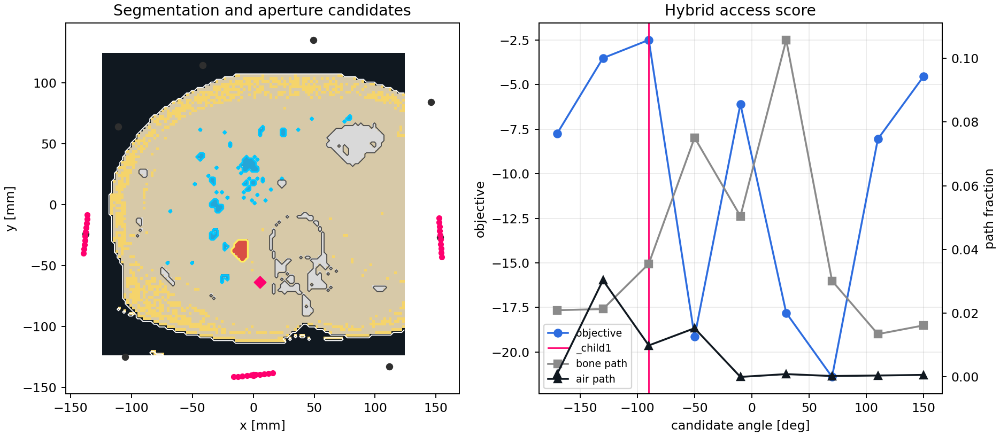
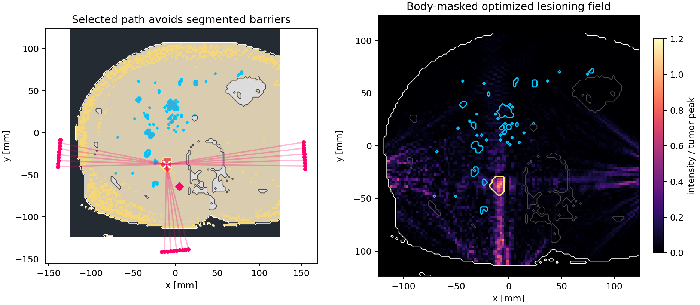
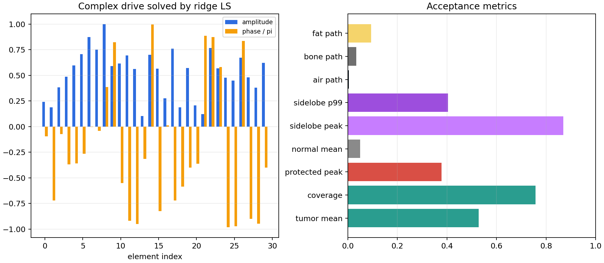

# Chapter 31 — Segmented Tissue Transducer Planning

This chapter example converts normal-tissue, tumor, air, bone, fat, and
protected-structure segmentations into a therapy-head placement problem.  It
uses the local LiTS17 liver CT sample by default: native liver and tumor labels
define normal tissue and target tissue, while CT Hounsfield-unit thresholds
derive air, fat, bone, and a contrast-enhanced vascular avoid channel.  The
workflow is analogous to treatment-planning velocity constraints in
tomotherapy: every candidate aperture is scored by what its acoustic paths cross
before the solver is allowed to shape the focal field.

Run:

```bash
python pykwavers/examples/book/ch32_segmented_tissue_transducer_optimization.py
```

Set `KWAVERS_CH32_SOURCE=phantom` to run the deterministic analytic phantom
used by the unit tests.

## Planning Contract

Input labels have one meaning:

- `air`: exterior air and internal gas pockets. Internal air on a beam path is a
  hard acoustic-access penalty.
- `bone`: rib or skull-like structures. Paths through bone incur attenuation and
  phase-error penalties.
- `fat`: allowed but penalized because it changes sound speed and attenuation.
- `tumor`: desired lesion support.
- `avoid`: sensitive anatomy that must receive a pressure null.
- `normal`: admissible tissue with off-target dose penalties.

For the LiTS17 sample, the mapping is:

- native segmentation `1`: liver parenchyma mapped to `normal`;
- native segmentation `2`: largest connected HCC focus on the selected slice
  mapped to `tumor`; other label-2 foci are mapped to `avoid` for a single
  lesion plan;
- CT `HU < -700` or outside the body mask: `air`;
- CT `-500 <= HU < -100` outside liver/tumor: `fat`;
- CT `HU >= 200` outside liver/tumor: `bone`;
- CT `160 < HU < 400` inside liver parenchyma: vascular `avoid`.

The optimizer is hybrid:

1.  A deterministic ray model evaluates each candidate transducer position
    against the segmentation-derived air, bone, and fat path fractions.
2.  The safest central aperture is paired with angularly separated safe
    apertures to form a crossfire plan, reducing the pre-focal entrance dose
    that a single 2-D aperture would otherwise concentrate.
3.  A complex ridge least-squares solve computes per-element phase and amplitude
    weights for the selected aperture set.
4.  The focal objective requests an elliptical spot in the tumor and zero
    pressure at protected and surrounding normal-tissue control points.
5.  Candidate selection maximizes tumor coverage while penalizing protected
    peak pressure, normal-tissue mean pressure, body sidelobes, and segmented
    path hazards.
6.  Dense-field hotspot refinement rejects plans whose strongest body-masked
    off-target lobe exceeds the tumor peak and re-solves with added null
    constraints at the measured body hotspots.

The default LiTS17 run selects a three-source crossfire plan at `-90`, `-170`,
and `-10` degrees.  The regenerated Chapter 32 metrics report
`target_dominant = true`, tumor coverage `0.7838`, body sidelobe peak ratio
`0.7395`, body sidelobe P99 ratio `0.3297`, protected peak ratio `0.2959`,
air path fraction `0.0035`, and bone path fraction `0.0329`.

This is a planning example, not a clinical approval model.  It establishes the
software interface needed to route patient segmentations into transducer
placement, segmented access scoring, and a higher-fidelity hybrid wave solver.

## Figures







## Verification

The executable tests assert that:

- the segmentation contains nonempty tumor, protected, air, bone, fat, and
  normal-tissue compartments;
- the LiTS17 liver dataset adapter preserves native liver/tumor labels and
  derives nonempty CT hazard masks;
- the optimizer evaluates multiple candidate apertures and selects the best
  objective value;
- the selected plan has lower protected-structure peak intensity than tumor
  peak intensity;
- dense rendered-field acceptance marks the target as dominant over body
  sidelobes for the default LiTS17 figure generation;
- the selected path penalties remain finite and are exported to `metrics.json`.
