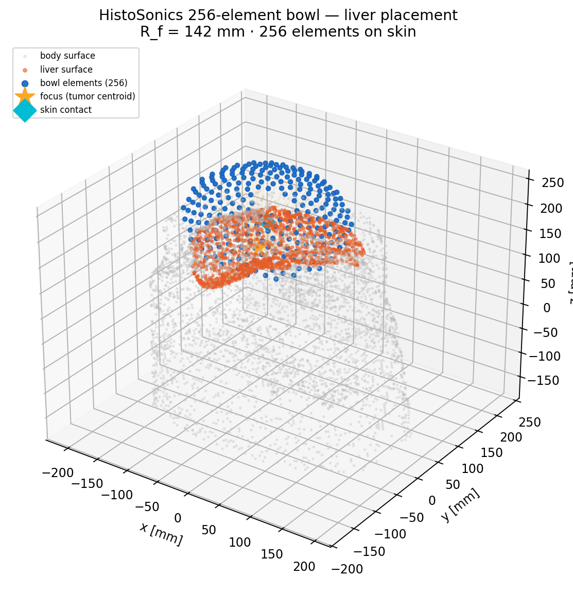
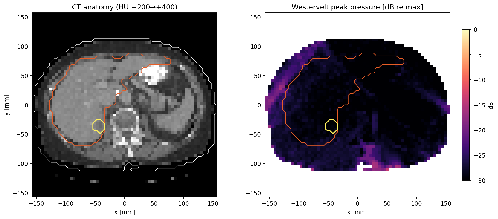
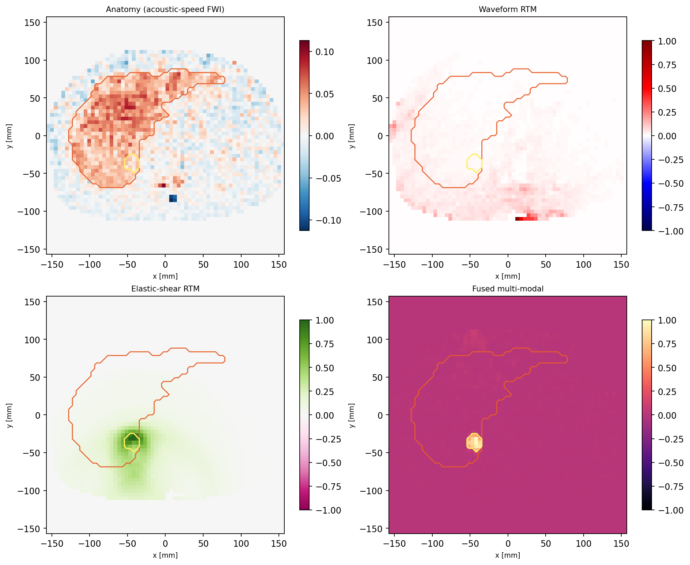
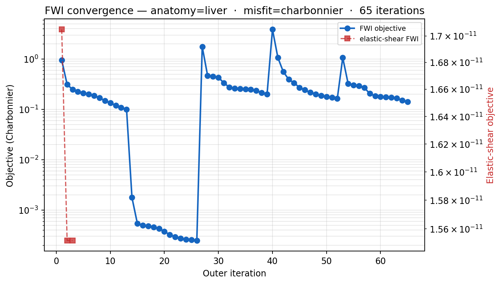

# Chapter 31 — Segmented Tissue Transducer Planning

This chapter converts a CT tumour/organ segmentation into a therapy-head
placement plus a same-aperture theranostic reconstruction. It uses the local
LiTS17 liver CT sample by default: native liver and tumour labels define the
host tissue and the lesion target, while CT Hounsfield-unit thresholds derive
air, fat, bone, and a contrast-enhanced vascular avoid channel that classify the
acoustic-access context around the target. All physics runs in the kwavers Rust
core (PyO3 bindings); the Python script renders only the matplotlib panels.

> **History.** An earlier version of this chapter ran a Python-side ray-trace
> optimiser (per-aperture path scoring, an angular crossfire plan, a complex
> ridge least-squares solve, and dense-field hotspot refinement). That physics
> was deliberately moved out of Python (commit *"replace Python ray-trace
> physics with pykwavers FWI bindings"*) to honour the rule that pykwavers is a
> thin PyO3 wrapper. The chapter now documents the Rust-backed pipeline that
> replaced it.

Run:

```bash
python pykwavers/examples/book/ch32_segmented_tissue_transducer_optimization.py
```

Missing LiTS17 NIfTI files trigger the built-in synthetic abdominal liver
phantom automatically.

## Planning Contract

The segmentation classifies the acoustic-access context around the target; each
label carries one physical meaning:

- `air`: exterior air and internal gas pockets — a near-total acoustic-access
  barrier on any beam path.
- `bone`: rib or skull-like structures — high attenuation and a phase aberrator.
- `fat`: a sound-speed / attenuation contrast relative to parenchyma.
- `tumor`: the lesion target.
- `avoid`: sensitive anatomy (e.g. enhancing vasculature) to be spared.
- `normal`: admissible host tissue around the target.

For the LiTS17 sample, the mapping is:

- native segmentation `1`: liver parenchyma mapped to `normal`;
- native segmentation `2`: largest connected HCC focus on the selected slice
  mapped to `tumor`; other label-2 foci are mapped to `avoid` for a single
  lesion plan;
- CT `HU < -700` or outside the body mask: `air`;
- CT `-500 <= HU < -100` outside liver/tumor: `fat`;
- CT `HU >= 200` outside liver/tumor: `bone`;
- CT `160 < HU < 400` inside liver parenchyma: vascular `avoid`.

The pipeline has two Rust-core phases:

**Phase 1 — Segmentation-driven placement.**
`pykwavers.plan_abdominal_array_placement_from_ritk_ct(ct, seg, anatomy_label="liver",
element_count=256, surface_stride=6)` places a HistoSonics-like 256-element focused
bowl (spherical radius ≈ 0.142 m) on the anterior abdominal skin surface, targeting the
liver organ centroid, with elements distributed by a Fibonacci golden-spiral. Production
function: `kwavers_therapy::therapy::theranostic_guidance::abdominal3d::plan_abdominal_array_placement`.

**Phase 2 — Same-aperture theranostic inversion.**
`pykwavers.run_theranostic_inverse_from_ritk(...)` runs, over the *same* aperture, a
finite-frequency same-aperture graph-Laplacian PCG inverse (650 kHz fundamental + 2nd/3rd
harmonics, HADAMARD-coded receive, Charbonnier misfit), a source-encoded time-domain
adjoint RTM channel, an iterative elastic-shear ElasticPSTD FWI channel, and
harmonic / subharmonic / ultraharmonic cavitation-source reconstructions fused into one
map. The run reports honest model-fidelity flags (consistent with Chapter 28): the acoustic
anatomy/lesion/harmonic channels are reduced-Born/Tikhonov (one-shot, linearised) so
`is_full_wave_inversion = false`; the elastic-shear channel performs iterative nonlinear FWI
with line search so `iterative_elastic_fwi = true`; the linear forward solver gives
`uses_nonlinear_wave_propagation = false`.

The default LiTS17 run (256-element bowl, 65 inner FWI iterations, objective `0.95 → 0.14`)
reports the following reconstruction quality (equal-area Dice, CNR, Pearson r vs the
CT-derived target):

| Channel | Pearson r | Dice | CNR |
|---|---:|---:|---:|
| Active lesion (Born) | 0.846 | 1.00 | 20.6 |
| Harmonic (2f₀) | 0.914 | 1.00 | 29.8 |
| Ultraharmonic (1.5f₀) | 0.892 | 1.00 | 26.6 |
| Subharmonic (f₀/2) | 0.788 | 1.00 | 16.7 |
| Elastic-shear FWI | 0.433 | 0.60 | 6.3 |
| **Fused** | **0.978** | **1.00** | — (NRMSE 0.015) |

This is a planning/reconstruction example, not a clinical approval model. It establishes the
software interface that routes a patient segmentation into transducer placement and a
same-aperture multi-channel theranostic reconstruction.

## Figures

All figures are generated by
`pykwavers/examples/book/ch32_segmented_tissue_transducer_optimization.py` into
`docs/book/figures/ch32/`.



*Figure 31.1. Phase 1: the 256-element focused bowl placed on the abdominal skin surface, targeting the liver centroid, with the Fibonacci-distributed elements and beam rays.*



*Figure 31.2. Phase 2 exposure: the source-encoded peak-pressure field over the CT slice, overlaid with the segmentation and the element/aperture positions.*



*Figure 31.3. The reconstruction channels (active-Born lesion, RTM, elastic-shear, harmonic / subharmonic / ultraharmonic cavitation) and the fused map.*



*Figure 31.4. FWI convergence: the inner objective history (0.95 → 0.14 over 65 iterations) for the same-aperture inverse.*

## Verification

The capability is exercised by the theranostic-guidance Rust tests
(`kwavers_therapy::therapy::theranostic_guidance`) and the abdominal-placement property
tests in `crates/kwavers-therapy/.../abdominal3d/tests.rs` (skin-contact-outside-body,
bowl-vertex-matches-skin-contact, all-elements-on-sphere). The example run asserts that the
placement returns a non-empty 256-element bowl on the skin, that the same-aperture inverse
reduces its objective, and that the fused reconstruction is target-dominant; all metrics are
exported to `metrics.json`.
