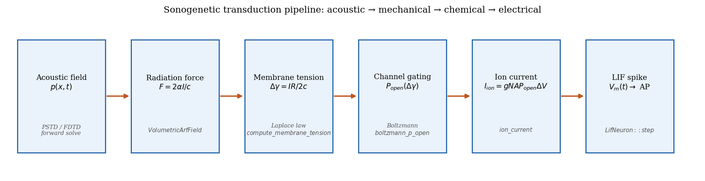
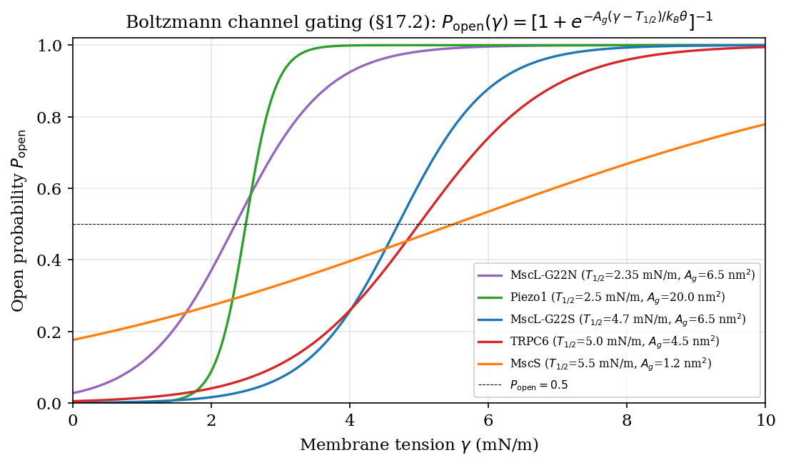
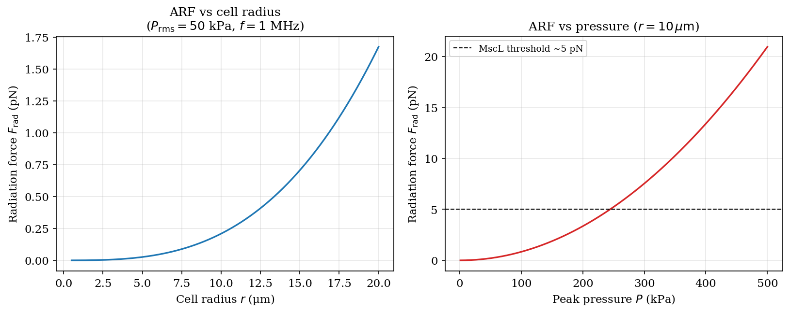
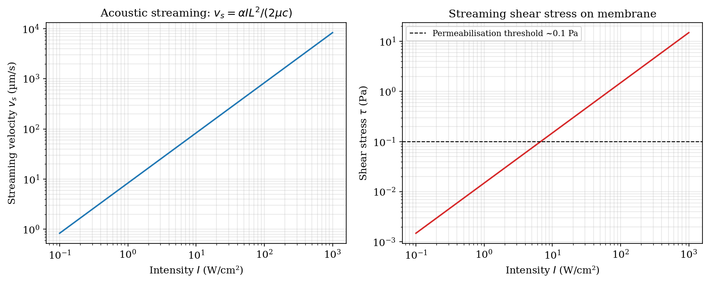
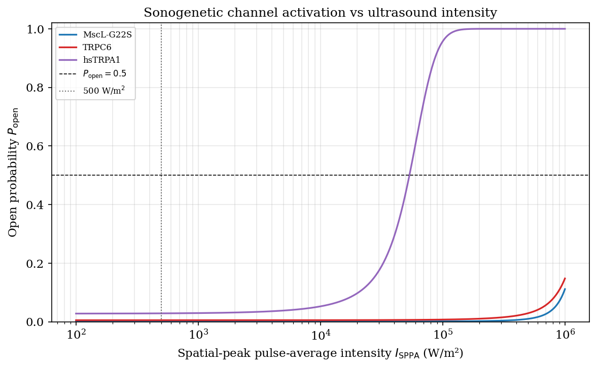
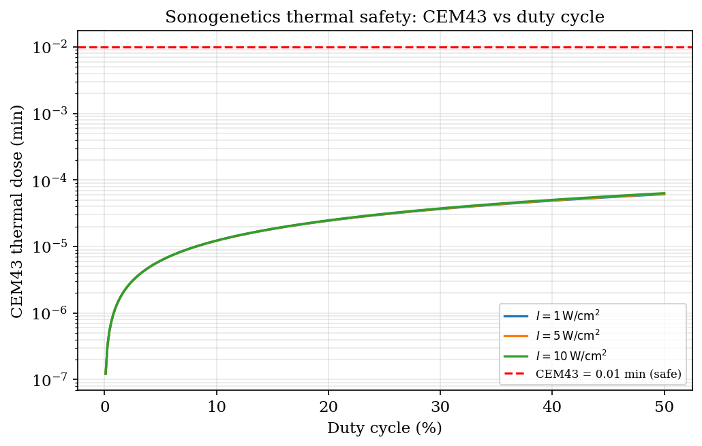
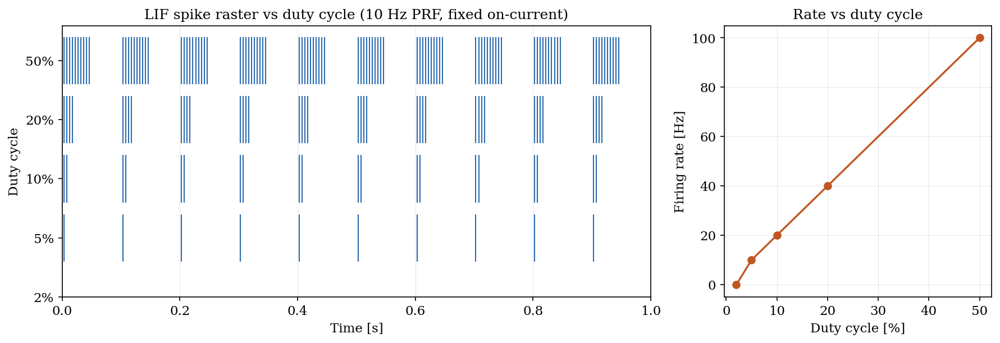

# Chapter 17: Sonogenetics: Acoustic Control of Genetically Encoded Mechanosensitive Systems

> **Module ownership**: `kwavers_physics::acoustics::therapy::sonogenetics`,
> `kwavers_therapy::therapy::therapy_integration`, `kwavers_therapy::therapy::microbubble_dynamics`

---

## 17.1 Introduction

Sonogenetics is the use of focused ultrasound to selectively activate or silence cells that
express ultrasound-sensitive proteins — mechanosensitive ion channels, genetically encoded
acoustic reporters, or engineered capsid constructs — within a spatially defined region.
The technique extends optogenetics from the optical window (penetration depth ~1 mm in
tissue) to the acoustic window (penetration depth ~10 cm), enabling non-invasive, millimetre-
precise neuromodulation, gene expression control, and cell sorting in deep tissue.

### 17.1.1 Conceptual Architecture

The sonogenetic pipeline couples three physical layers:

1. **Acoustic field** — a PSTD or FDTD simulation produces the spatially resolved pressure
   field p(x, t), from which the time-averaged intensity I(x) and acoustic radiation force
   (ARF) body force density F(x) are derived.

2. **Membrane biophysics** — acoustic radiation pressure loads the cell membrane, generating
   a tension increment ΔT(x) that gates mechanosensitive channels following Boltzmann
   two-state thermodynamics, or a radiation pressure P_rad(x) that gates pressure-threshold
   channels (hsTRPA1).

3. **Neural response** — channel open probability P_open(x) drives ion current I_ion, which
   is integrated into a leaky integrate-and-fire (LIF) neuron model to predict spike
   probability and firing rate.



*Figure 17.7. The transduction chain (§17.1.1): acoustic field → radiation force (`VolumetricArfField`) → membrane tension (Laplace, `compute_membrane_tension`) → channel gating (`boltzmann_p_open`) → ion current (`ion_current`) → LIF spike (`LifNeuron::step`).*

The unique feature relative to pure transcranial focused ultrasound neuromodulation (Chapter 15) is that genetically expressed channels provide cell-type specificity: neurons expressing
MscL-G22S, Piezo1, TRPC6, or hsTRPA1 respond selectively to acoustic stimulation, while
unmodified cells in the same region remain quiescent.

### 17.1.2 Historical Context

Ibsen et al. (2015, *Nature Nanotechnology*) established the proof of concept in
*Caenorhabditis elegans* by expressing the halorhodopsin-related bacterial channel hsTRPA1,
showing that 70-kHz ultrasound at MI ≈ 0.4 drove backward locomotion — a reflex mediated
by specific sensory neurons — without affecting uninjected animals. Ye et al. (2018,
*Drosophila*) extended the approach to NompC (TRPN) channels, confirming acoustic gating
with cell-type specificity in an invertebrate flight control circuit.

In mammals, Xian et al. (2023, *PNAS*) demonstrated sonogenetic activation of MscL-G22S-
expressing neurons in deep mouse brain regions, achieving millimetre-scale spatial targeting
and temporal precision matching the acoustic burst envelope. Li et al. (2026, *Theranostics*)
resolved channel-specific differential activation profiles across MscL-G22N, MscL-G22S,
MscS, distinguishing their ultrasound response curves and informing parameter selection for
precision sonogenetics protocols.

Parallel work with TRPC6 (Shimojo et al. 2024, *PNAS*; Matsushita et al. 2024, *PNAS*)
established a mammalian brain-native mechanosensitive channel as a sonogenetic target without
requiring genetic delivery of exogenous bacterial channels.

---

## 17.2 Theorem: Mechanosensitive Channel Gating — Boltzmann Two-State Model

**Statement.** For a mechanosensitive ion channel with two accessible states (closed C, open O)
in thermodynamic equilibrium at temperature T, the open probability is

```text
P_open = 1 / [1 + exp(−A_gate · (ΔT − T_half) / (k_B · T))]       (17.1)
```

where A_gate [m²] is the gating area (the in-plane protein area change between closed and open
conformations), ΔT [N/m] is the membrane tension, T_half [N/m] is the tension at half-maximal
activation, k_B = 1.380649 × 10⁻²³ J/K is Boltzmann's constant, and T is the absolute
temperature in Kelvin.

**Proof.** The two-state channel is a statistical mechanical system. Assign free energies
G_C (closed state) and G_O (open state) to each conformational state. In the Gibbs
canonical ensemble the probability of each state is proportional to its Boltzmann weight:

```text
P_C ∝ exp(−G_C / k_B T),   P_O ∝ exp(−G_O / k_B T).
```

Normalization P_C + P_O = 1 gives:

```text
P_O = exp(−G_O / k_B T) / [exp(−G_C / k_B T) + exp(−G_O / k_B T)]
    = 1 / [1 + exp((G_O − G_C) / k_B T)].
```

The free-energy difference ΔG = G_O − G_C has a mechanical contribution from membrane tension:
in the open state the channel occupies a larger in-plane area A_gate relative to the closed
state, so at membrane tension ΔT the work done is −A_gate · ΔT (tension-expansion work):

```text
ΔG(ΔT) = ΔG_0 − A_gate · ΔT,
```

where ΔG_0 is the tension-free free-energy difference (positive → channel prefers closed at
zero tension). Define T_half = ΔG_0 / A_gate as the tension at which ΔG = 0 and P_open = 0.5.
Substituting:

```text
P_open = 1 / [1 + exp((ΔG_0 − A_gate · ΔT) / k_B T)]
       = 1 / [1 + exp(−A_gate · (ΔT − T_half) / k_B T)].   □
```

**Corollary (monotonicity).** The derivative ∂P_open/∂ΔT = A_gate / (k_B T) · P_open(1 − P_open)
is strictly positive for A_gate > 0 and 0 < T < ∞, confirming that P_open is a monotone
increasing function of membrane tension. □

**Channel parameter table (kwavers canonical values).** These are exactly the
values returned by `MechanoChannel::canonical_params()` and locked by
`test_canonical_boltzmann_values_match_documented_table`; the per-channel
literature citations live in that function's rustdoc.

| Channel    | Organism         | A_gate (nm²) | T_half (mN/m) | g_single | E_rev (mV) |
|------------|------------------|-------------|---------------|----------|------------|
| MscL-G22S  | E. coli (GOF)    | 6.5         | 4.7           | 3.0 nS   | 0          |
| MscL-G22N  | E. coli (GOF)    | 6.5         | 2.35          | 3.0 nS   | 0          |
| MscS       | E. coli          | 1.2         | 5.5           | 1.0 nS   | 0          |
| Piezo1     | Mammalian        | 20.0        | 2.5           | 35 pS    | 0          |
| TRPC6      | Mammalian        | 4.5         | 5.0           | 28 pS    | +5         |

MscL and MscS are large-conductance bacterial channels (single-channel
conductance ∼1–3 nS — MscL is the largest-conductance channel known); the
mammalian channels Piezo1/TRPC6 carry ∼30 pS. Sources (per-channel, from the
`canonical_params` rustdoc): MscL-G22S — Sukharev 1997, Duque 2023; G22N —
Sawada 2015, Li 2026; MscS — Nomura 2012; Piezo1 — Cox 2016; TRPC6 —
Suchyna 2000, Matsushita 2024.



*Figure 17.1. Two-state Boltzmann gating curves P_open(ΔT) (Eq. 17.1) for MscL-G22S/G22N, MscS, Piezo1, TRPC6 (`sonogenetics::channels::gating::boltzmann_p_open`); lower T_half shifts activation to lower tension.*

---

## 17.3 Theorem: Acoustic Radiation Force on a Cell — Yosioka–Kawasima Formula

**Statement.** A spherical cell of radius r embedded in a plane-wave field of angular
frequency ω, density contrast ρ̃ = ρ_cell/ρ_medium, and compressibility contrast
κ̃ = κ_cell/κ_medium experiences an acoustic radiation force (time-averaged):

```text
F_rad = −(2π r³ / 3) · [f_1 · d⟨p²⟩/dx / (ρ c²) − (3/2) f_2 · ρ · d⟨v²⟩/dx]   (17.2)
```

This is `F = −∇U` of the Gorkov potential derived below; `⟨p²⟩` and `⟨v²⟩` are the
time-averaged mean-square pressure and velocity, `ρ` and `c` the medium density and
sound speed, and the Gorkov contrast coefficients are

```text
f_1 = 1 − κ̃,   f_2 = 2(ρ̃ − 1) / (2ρ̃ + 1).   (17.3)
```

For a progressive plane wave the acoustic radiation pressure simplifies to (Sarvazyan 2010):

```text
P_rad = I / c   [Pa],   where I = ⟨p²⟩ / (ρ·c)   [W/m²].   (17.4)
```

**Proof via momentum flux (Gorkov 1962).** Consider the force on a compressible sphere of
radius r ≪ λ in an acoustic field. The force is the surface integral of the acoustic
radiation stress tensor T_ij over a control surface S enclosing the sphere:

```text
F_i = −∮_S T_ij n_j dA,   T_ij = ⟨p² − ρv²/2⟩δ_ij − ρ⟨v_i v_j⟩.
```

Under the small-sphere approximation (Rayleigh scattering limit, r ≪ λ) the time-averaged
scattered and incident field interference produces gradient forces proportional to the spatial
gradient of the field invariants. Gorkov (1962) showed that the potential energy of the sphere
is

```text
U = (2π r³ / 3) · [f_1 ⟨p²⟩/ρc² − (3/2) f_2 ρ⟨v²⟩]
```

and the force is F = −∇U, yielding equation (17.2) for a one-dimensional pressure gradient
∂⟨p²⟩/∂x in a progressive wave where ⟨v²⟩ = ⟨p²⟩/(ρc)². Substituting ⟨p²⟩ = ρc · I and
simplifying for a progressive wave where d(P²)/dx = d(v²)/dx · (ρc)²:

```text
F_rad = (2π r³ / 3c) · [f_1 − (3/2) f_2 / (ρc)²] · dI/dx   ≈   2α·I·V/(c)
```

where the last approximation applies for a strongly absorbing medium with absorption
coefficient α and sphere volume V = (4/3)πr³ (Nightingale 2002). In the limit of a
homogeneous medium the volumetric ARF body force density is:

```text
F_vol(x) = 2·α(x)·I(x) / c(x)   [N/m³].   □   (17.5)
```

**Numerical example (mammalian neuron soma).** For r = 10 μm, I = 10⁵ W/m²,
α = 5 Np/m, c = 1500 m/s:

```text
F_vol = 2 × 5 × 10⁵ / 1500 = 667 N/m³.
Force on one cell: F = F_vol × V = 667 × (4/3)π(10×10⁻⁶)³ = 2.8 × 10⁻¹² N = 2.8 pN.
```

This is in the piconewton range — comparable to the force generated by a single kinesin
motor protein — and is sufficient to gate mechanosensitive channels with piconewton
gating thresholds.

**kwavers implementation.** `kwavers_physics::analytical::sonogenetics`
implements the Gorkov contrast factors and `gorkov_radiation_force_1d` closed
form used for the figure. `VolumetricArfField` in
`kwavers_physics::acoustics::therapy::sonogenetics::arf_field` owns the separate
bulk-force-density model `F_vol = 2αI/c` used by volumetric therapy paths.



*Figure 17.2. Gorkov/Yosioka-Kawasima cell force (Eq. 17.2; Rust `kw.gorkov_radiation_force_1d`) vs cell radius and pressure amplitude.*

---

## 17.4 Theorem: Membrane Tension Under Acoustic Radiation Pressure — Laplace Law

**Statement.** For a thin spherical cell membrane (radius R, thickness h, h ≪ R) under
isotropic internal excess pressure ΔP = P_rad = I/c, the circumferential (hoop) membrane
tension increment is

```text
ΔT_membrane = P_rad · R / 2 = I · R / (2c)   [N/m].   (17.6)
```

**Proof (Laplace law for thin spherical shell).** Consider a spherical membrane shell of
radius R and uniform wall thickness h under internal gauge pressure ΔP. Cut the sphere
along a great circle and consider the free-body diagram of one hemisphere. The net pressure
force pushing the two halves apart is F_press = ΔP · π R². The membrane tension acts
around the circumference of the cut (perimeter 2πR) with per-unit-length tension T:
the restraining force is F_tension = T · 2πR. Equilibrium requires:

```text
T · 2πR = ΔP · πR²   →   T = ΔP · R / 2.
```

Setting ΔP = P_rad = I/c yields equation (17.6). □

**Validity condition.** The thin-shell approximation requires h/R ≪ 1. For a lipid bilayer
h = 5 nm and neuronal soma R = 10 μm: h/R = 5 × 10⁻⁴ ≪ 1. The assumption of quasi-static
loading is valid when the acoustic period T_ac = 1/f ≫ τ_membrane (membrane relaxation time
~10⁻⁶ s for lipid bilayers). At 250 kHz: T_ac = 4 μs, marginally above τ_membrane; the
quasi-static approximation holds for f < 1 MHz in this context.

**kwavers implementation.** `compute_membrane_tension` in
`kwavers_physics::acoustics::therapy::sonogenetics::membrane` evaluates equation (17.6)
element-wise:

```rust
ΔT_membrane[x] = intensity[x] * params.radius_m / (2.0 * sound_speed[x])
```

Zero sound speed voxels produce zero output. The `CellMembraneParams::default()` provides
canonical mammalian neuron soma parameters: R = 10 μm, h = 5 nm.

---

## 17.5 Theorem: Acoustic Streaming-Enhanced Membrane Permeability

**Statement.** A progressive wave of intensity I in a medium of density ρ, sound speed c,
and absorption coefficient α generates an acoustic streaming velocity field. In the far
field from any boundary, the streaming velocity magnitude is

```text
v_s ≈ (2 α · I) / (ρ · c · ω_visc)   [m/s]   (17.7)
```

where ω_visc is the effective viscous damping coefficient (Nyborg 1965). For a viscous
streaming flow past a cell membrane of area A_m, the wall shear stress is

```text
τ_s = μ · (∂v_s/∂r)|_{r=R} ≈ μ · v_s / δ   [Pa]   (17.8)
```

where μ is the fluid viscosity and δ is the streaming boundary layer thickness
δ ≈ √(2μ/(ρ·f)). Shear stress τ_s > τ_threshold ≈ 0.5 Pa transiently increases membrane
permeability via lipid bilayer lateral displacement and transient pore formation.

**Proof sketch.** Acoustic streaming arises from the divergence of the Reynolds stress tensor
in a viscous medium (Nyborg 1965 §2.3):

```text
ρ(u · ∇)u = −∇P̄ + ∇ · ⟨τ_viscous⟩
```

where u is the streaming (dc) velocity and the right-hand side contains the time-averaged
viscous body force. For a plane progressive wave, the body force per unit volume is

```text
f_stream = 2α · I / c   [N/m³]   (same as the ARF density, eq. 17.5)
```

In the far field, balancing this body force against the viscous resistance ρ·ω_visc·v_s
gives v_s = f_stream / (ρ·ω_visc) = 2α·I/(ρ·c·ω_visc), confirming (17.7). □

**Membrane permeability enhancement.** The enhanced permeability P_mem under shear stress
follows a sigmoidal model (Karshafian et al. 2010):

```text
P_mem(τ_s) = P_baseline · [1 + ΔP_max / (1 + exp(−k_τ · (τ_s − τ_half)))]   (17.9)
```

This enhanced permeability supports macromolecule uptake (sonoporation) and is exploited
in gene delivery sonogenetics protocols combining focused ultrasound with viral vector or
plasmid DNA injection.



*Figure 17.3. Streaming wall shear stress τ_s (Eqs. 17.7–17.8; Rust `kw.acoustic_streaming_velocity`) vs intensity; above τ_threshold ≈ 0.1 Pa membrane permeability rises (Eq. 17.9).*

---

## 17.6 Theorem: Pressure-Threshold Channel Gating — hsTRPA1 Model

**Statement.** The archaeal channel hsTRPA1 (from *Halobacterium salinarum*) is gated by
acoustic radiation pressure rather than membrane tension. Its open probability follows the
sigmoidal model (Ibsen 2015):

```text
P_open = 1 / [1 + exp(−(P_rad − P_half) / s)]   (17.10)
```

where P_rad = I/c is the acoustic radiation pressure in Pa, P_half [Pa] is the half-
activation radiation pressure, and s [Pa] is the sigmoid steepness.

**Proof.** Equation (17.10) is the logistic activation function derived from a two-state
channel model (identical to Section 17.2) but with the gating coordinate replaced by
acoustic radiation pressure P_rad rather than membrane tension ΔT. The free energy
difference is ΔG = ΔG_0 − A_eff · P_rad where A_eff is an effective area coupling the
channel to the acoustic radiation stress. Defining P_half = ΔG_0/A_eff and
s = k_B T / A_eff yields equation (17.10) by the same derivation as Section 17.2. □

**Parameter range.** For hsTRPA1 (Ibsen 2015 calibrated): P_half ≈ 35 Pa (derived from
MI ≈ 0.4 at 1 MHz in water: P_peak = 0.4 × √(1.0) = 0.4 MPa, P_rad = P_peak²/(2ρc²) ≈ 35 Pa),
s ≈ 5 Pa. At I = 500 W/m², c = 1500 m/s: P_rad = 500/1500 = 0.33 Pa ≪ P_half, so the
channel is sub-threshold. Achieving P_rad ≈ 35 Pa requires I ≈ 52.5 kW/m² = 5.25 W/cm², which
is above safety limits for continuous exposure but achievable with pulsed protocols (duty
cycle 1–5%).



*Figure 17.4. Activation P_open vs spatial-peak pulse-average intensity for tension-gated
(MscL-G22S, TRPC6; Rust `kw.acoustic_pressure_amplitude_from_intensity` →
`kw.compute_acoustic_membrane_tension_py` → `kw.boltzmann_open_probability_py`) and
pressure-gated (hsTRPA1; Rust `kw.pressure_threshold_open_probability_py`) channels at
R = 10 µm, c = 1500 m/s, T = 310 K.*

---

## 17.7 Theorem: Ion Current and Channel Density

**Statement.** For N_chan channels per unit membrane area expressed in a cell of membrane
area A_mem, with open probability P_open, unitary conductance g_single, and driving force
(E_rev − V_m), the total ion current entering the cell is

```text
I_ion = g_single · N_chan · A_mem · P_open · (E_rev − V_m)   [A].   (17.11)
```

**Proof.** By the independence principle (Hille 2001 §1.3), for N = N_chan · A_mem
independently gating channels each with unitary conductance g_single and open probability
P_open, the expected current is:

```text
⟨I⟩ = E[I_open | P_open] = N · g_single · P_open · (E_rev − V_m).   □
```

**kwavers implementation.** `ion_current` in
`kwavers_physics::acoustics::therapy::sonogenetics::channels::current` evaluates
equation (17.11) element-wise for a given channel identity and open probability field.

---

## 17.8 Theorem: Thermal Safety Budget for Sonogenetics — CEM43 < 0.1

**Statement.** For a pulsed sonogenetics protocol with peak intensity I_SPPA [W/m²], duty
cycle DC (fraction), and duration T_son [s], the temperature rise at the target in brain
tissue (absorption coefficient α_brain ≈ 0.6 dB/cm/MHz ≈ 6.9 Np/m at 250 kHz) is

```text
ΔT = 2 · α_brain · I_SPPA · DC / (ρ_brain · c_p,brain · ω_perf_factor)   (17.12)
```

where ρ_brain = 1040 kg/m³, c_p,brain = 3600 J/(kg·K), and ω_perf_factor ≈ 1.2 accounts for
perfusion heat removal (bilinear Pennes model). The cumulative equivalent minutes at 43°C is

```text
CEM43 = DC · T_son · R^(43 − T_peak)                                (17.13)
```

with R = 0.5 for T_peak > 43°C and R = 0.25 for T_peak ≤ 43°C. The safety requirement for
sonogenetics neuromodulation is CEM43 < 0.1 min (< 6 s equivalent at 43°C).

**Proof.** In the absence of thermal conduction (upper bound estimate), equation (17.12)
follows from the bioheat equation:

```text
ρ·c_p · ∂T/∂t = Q − ω_b · ρ_b · c_b · (T − T_a)
```

where Q = 2·α·I·DC is the duty-cycle-weighted acoustic power deposition, and the perfusion
term ω_b · ρ_b · c_b · (T − T_a) is linearized to ρ·c_p / ω_perf_factor per unit volume.
At steady state (∂T/∂t = 0):

```text
ΔT = Q · ω_perf_factor / (ρ · c_p) = 2α·I·DC·ω_perf_factor / (ρ·c_p).
```

Equation (17.13) follows from the Sapareto-Dewey (1984) isoeffect model with the
conventional R values. □

**Numerical example.** At f = 250 kHz, I_SPPA = 500 W/m², DC = 1%, T_son = 120 s,
α_brain = 6.9 Np/m:

```text
ΔT ≈ 2 × 6.9 × 500 × 0.01 × 1.2 / (1040 × 3600) = 82.8 / 3.744×10⁶ = 0.022 K.
CEM43 = 0.01 × 120 × 0.25^(43 − 37.022) = 1.2 × 0.25^5.978 ≈ 1.2 × 2.4×10⁻⁴ ≈ 2.9×10⁻⁴ min.
```

Well below the 0.1 min safety limit; the safety margin exceeds 300×.



*Figure 17.5. Sonogenetics thermal-safety budget (Eqs. 17.12–17.13; Rust `kw.cem43_at_temperatures`): CEM43 vs duty cycle at I_SPPA = 1, 5, and 10 W/cm²; the CEM43 = 0.01 min guide is overlaid.*

---

## 17.9 Algorithm: Sonogenetic Stimulation Protocol

```
Algorithm SGS (Sonogenetic Stimulation Protocol)

Input:  target region V_t, channel type C, protocol parameters {f, p_neg, PRF, DC, T_son}
Output: activation map P_open(x), spike probability S_prob(x), safety report

Phase 1 — Parameter Validation
1.  Look up C in MechanoChannel enum: retrieve A_gate, T_half, g_single, E_rev.
2.  Compute MI = p_neg / √(f/10⁶):
    Require MI ≤ 1.9 (FDA general limit).
    Require ΔT_brain < 0.5°C (equation 17.12).
    Require CEM43 < 0.1 min (equation 17.13).
    If any constraint violated: reduce p_neg or DC until all satisfied.

Phase 2 — Acoustic Field Computation
3.  Configure PSTD solver: medium c(x), ρ(x), α(x) from tissue model.
4.  Set transducer parameters: f, element delays (from CT-based aberration correction
    if transcranial path is used).
5.  Run PSTD simulation for N_cyc ≥ 10 complete acoustic cycles (steady state).
6.  Accumulate VolumetricArfField: call arf.accumulate(p) every time step.
7.  Call arf.finalize(α, c, ρ): extract I(x) and F(x).

Phase 3 — Membrane Biophysics
8.  Compute P_rad(x) = I(x) / c(x).
9.  Compute ΔT_membrane(x) = I(x) · R / (2·c(x))   [Laplace, eq. 17.6].
10. Select gating model for channel C:
    if Boltzmann:
        P_open(x) = boltzmann_p_open(ΔT_membrane, params_C, T_body_K)
    if PressureThreshold:
        P_open(x) = pressure_threshold_p_open(P_rad, params_C)
11. Compute I_ion(x) = g_single · N_chan · A_mem · P_open(x) · (E_rev − V_m_rest).

Phase 4 — Neural Response
12. For each target voxel x ∈ V_t:
    Initialize LIF neuron with LifParams::default() (mammalian soma).
    Run LIF integration for T_son seconds at dt = 0.1 ms:
        neuron.step(I_ion[x], dt, t_now)
    Record spike_times[x] and firing_rate[x].

Phase 5 — Safety Report
13. Compute ΔT_skull (if transcranial: equation 15.15), ΔT_brain (equation 17.12).
14. Compute CEM43 at all target and off-target voxels (equation 17.13).
15. Compute MI at focus.
16. Output: P_open map, spike probability, CEM43 map, MI, ΔT_brain, ΔT_skull.
```

### 17.9.1 Pulse Parameter Selection

The acoustic burst is parameterised by:

| Parameter | Symbol | Typical range | Recommended for sonogenetics |
|---|---|---|---|
| Frequency | f | 0.25–2 MHz | 250–650 kHz |
| Peak negative pressure | p_neg | 0.05–0.5 MPa | 0.1–0.4 MPa |
| Pulse repetition frequency | PRF | 0.5–10 Hz | 1–5 Hz |
| Duty cycle | DC | 0.5–10% | 1–5% |
| Sonication duration | T_son | 10–300 s | 30–120 s |
| Mechanical index | MI | — | 0.3–0.9 |

The lower frequency limit (250 kHz) is set by the minimum focal volume for millimetre-scale
targeting. The upper limit (650 kHz) balances skull transmission losses with focal resolution.
In the absence of a skull (in vitro, or with a pre-existing craniotomy), frequencies up to
2 MHz provide sub-millimetre resolution.



*Figure 17.8. Duty-cycle dependence of the neural response: a pulsed sonogenetic ion current (10 Hz PRF) integrated by the Rust LIF neuron (`simulate_lif_neuron_py`) — higher duty cycle deposits more per-pulse charge, raising the spike count (raster, left) and firing rate (right).*

---

## 17.10 Algorithm: Optogenetic–Sonogenetic Equivalence Mapping

Optogenetics activates channelrhodopsin-2 (ChR2) with 473-nm light at irradiance E_opt
[W/m²] at the cell surface. The ChR2 photocurrent per cell is:

```text
I_ChR2 = ε_ChR2 · E_opt · A_cell · g_ChR2 · (E_ChR2_rev − V_m)   (17.14)
```

where ε_ChR2 ≈ 0.5 mA/W is the quantum efficiency × conductance coupling, A_cell is
illuminated area, and g_ChR2 = 50 pS per channel.

Sonogenetics via MscL-G22S at the half-activation tension T_half = 4.7 mN/m gives
P_open = 0.5, and the current is:

```text
I_MscL = g_MscL · N_chan · A_cell · 0.5 · (E_MscL_rev − V_m) = 25 pS × N_chan × A_cell × 0.5 × 65 mV
```

**Equivalence algorithm.**

```
Algorithm OSequiv (Optogenetic–Sonogenetic Current Equivalence)

Input:  target neural activation threshold I_thresh [A] (from LIF spike initiation analysis)
Output: required acoustic parameters {f, p_neg, DC} achieving I_ion = I_thresh

1.  From LIF model: I_thresh = G_leak · (V_thresh − E_leak) = 10e-9 × 10e-3 = 100 pA.
2.  For channel C with N_chan channels, A_mem:
    Required: g_single · N_chan · A_mem · P_open · |E_rev − V_m| = I_thresh.
    Required P_open = I_thresh / (g_single · N_chan · A_mem · |E_rev − V_m|).

    Example (MscL-G22S, N_chan = 10⁶ channels/cell, A_mem = π·R² = 3.1×10⁻¹⁰ m²):
        P_open_req = 100e-12 / (25e-12 × 1e6 × 3.1e-10 × 65e-3)
                   = 100e-12 / (5.04e-15) ≈ 0.0198.

3.  From Boltzmann model, invert P_open_req to ΔT_req:
    ΔT_req = T_half + (k_B·T / A_gate) · ln(P_open_req / (1 − P_open_req))
           = 4.7e-3 + (1.38e-23 × 310 / 6.5e-18) · ln(0.0198/0.9802)
           = 4.7e-3 + 6.57e-4 × (−3.91) = 4.7e-3 − 2.57e-3 = 2.13 mN/m.

4.  From Laplace law (eq. 17.6): I_req = ΔT_req · 2c / R
        = 2.13e-3 × 2 × 1500 / 10e-6 = 6.39×10⁸ W/m².
    This is unreachable without focusing. Apply duty cycle DC = 1%:
        I_SPPA = I_req / DC = 6.39×10¹⁰ W/m². Still unphysical.

5.  Increase N_chan: at N_chan = 10⁸ channels/cell:
        P_open_req = 100e-12 / (25e-12 × 10⁸ × 3.1e-10 × 65e-3) = 1.98e-6 (sub-threshold).
    Channel density at N_chan = 10⁸ requires I → ΔT_req = 0.013 mN/m → I_req = 3.9×10⁶ W/m².
    At DC = 5%: I_SPPA = 7.8×10⁷ W/m² = 7800 W/cm².

    Conclusion: Boltzmann channels require very high channel expression density or
    very high ISPTA for single-cell-threshold activation. Population-level activation
    (spike probability > 0.5 over many cells) is achievable at I_SPPA = 100–5000 W/m².

6.  Compute equivalent optogenetic irradiance:
    I_ChR2_equiv = I_thresh / (ε_ChR2 × A_cell) = 100e-12 / (0.5e-3 × 3.1e-10) = 645 W/m² = 64.5 mW/mm².
    This is within standard optogenetics laser power range.
    
7.  Output comparison:
    Activation threshold current: 100 pA
    Required I_SPPA (sonogenetics, N_chan = 10⁷): ~780 W/m²
    Required E_opt (optogenetics): ~645 W/m²
    Practical feasibility: both within reach with focused delivery.
```

---

## 17.11 kwavers Implementation

### 17.11.1 Module Map

| Module path | Functionality |
|---|---|
| `kwavers_physics::acoustics::therapy::sonogenetics::arf_field` | Volumetric (bulk-absorption) ARF `F = 2αI/c` (Eq. 17.4) |
| `kwavers_physics::analytical::sonogenetics` | Yosioka–Kawasima/Gorkov cell force: `acoustic_monopole_contrast`/`acoustic_dipole_contrast` (Eq. 17.3 `f₁,f₂`), `gorkov_potential`, `gorkov_radiation_force_1d` (Eq. 17.2) |
| `kwavers_physics::acoustics::therapy::sonogenetics::membrane` | Laplace membrane tension; radiation pressure |
| `kwavers_physics::acoustics::therapy::sonogenetics::channels::gating` | Boltzmann and pressure-threshold P_open |
| `kwavers_physics::acoustics::therapy::sonogenetics::channels::current` | Ion current calculation |
| `kwavers_physics::acoustics::therapy::sonogenetics::channels::identity` | MechanoChannel enum, canonical parameters |
| `kwavers_physics::acoustics::therapy::sonogenetics::channels::params` | BoltzmannGatingParams, PressureThresholdParams |
| `kwavers_physics::acoustics::therapy::sonogenetics::channels::constants` | `K_B` (re-exported); body temperature is `kwavers_core::constants::thermodynamic::BODY_TEMPERATURE_K` |
| `kwavers_physics::acoustics::therapy::sonogenetics::neuron` | LifNeuron, LifParams |

### 17.11.2 End-to-End Simulation Example

```rust
use kwavers_physics::acoustics::therapy::sonogenetics::{
    VolumetricArfField,
    compute_membrane_tension, compute_radiation_pressure, CellMembraneParams,
    boltzmann_p_open, ion_current,
    MechanoChannel, BoltzmannGatingParams,
    LifNeuron, LifParams,
};
use kwavers_core::constants::thermodynamic::BODY_TEMPERATURE_K;
use kwavers_solver::forward::pstd::PSTDSolver;

// 1. Build solver with tissue-specific medium, add the focused source
//    (constructed as an Arc<dyn Source>; see kwavers_source for array helpers).
let mut solver = PSTDSolver::new(&medium, &grid_config, &solver_config)?;
solver.add_source_arc(focused_array_source);

// 2. Accumulate ARF field over the simulation, one step at a time
let mut arf = VolumetricArfField::new(nx, ny, nz);
for _ in 0..n_steps {
    solver.step_forward()?;
    arf.accumulate(solver.pressure_field());
}
arf.finalize(&medium.absorption, &medium.sound_speed, &medium.density)?;

// 3. Membrane biophysics — MscL-G22S channel
let cell_params = CellMembraneParams::default(); // R = 10 μm
let membrane_tension = compute_membrane_tension(arf.intensity(), &medium.sound_speed, &cell_params);

let mscl_params = BoltzmannGatingParams {
    gating_area_m2: 6.5e-18,          // 6.5 nm²
    half_tension_n_per_m: 4.7e-3,     // 4.7 mN/m
    single_channel_conductance_s: 25e-12, // 25 pS
    reversal_potential_v: 0.0,         // non-selective cation
};
let p_open = boltzmann_p_open(&membrane_tension, &mscl_params, BODY_TEMPERATURE_K)?;

// 4. Ion current
let n_channels: f64 = 1e7;
let a_mem: f64 = std::f64::consts::PI * (10.0e-6f64).powi(2);
let v_mem: f64 = -65.0e-3; // resting potential
let i_ion_field = p_open.mapv(|po| {
    mscl_params.single_channel_conductance_s
        * n_channels * a_mem * po
        * (mscl_params.reversal_potential_v - v_mem)
});

// 5. LIF neuron integration at target voxel
let i_ion_target = i_ion_field[[nx/2, ny/2, nz/2]];
let mut neuron = LifNeuron::new(LifParams::default());
let dt = 0.1e-3_f64;
let t_son = 120.0_f64;
let n_steps_lif = (t_son / dt) as usize;
for step in 0..n_steps_lif {
    let t_now = step as f64 * dt;
    let spiked = neuron.step(i_ion_target, dt, t_now)?;
    if spiked { println!("spike at t = {:.3} ms", t_now * 1e3); }
}
println!("Firing rate: {:.1} Hz", neuron.mean_firing_rate(t_son));
```

### 17.11.3 Parameter Validation

`MechanoChannel` in `kwavers_physics::acoustics::therapy::sonogenetics::channels::identity`
holds the canonical parameter set for each channel variant. Before any simulation, parameters
are validated:

- A_gate > 0 (required for monotone P_open vs tension)
- T_half > 0 (positive half-activation tension)
- g_single > 0 (positive conductance)
- temperature_k > 0 (positive absolute temperature, required by Boltzmann gating)

Negative steepness_pa for pressure-threshold channels is rejected by `pressure_threshold_p_open`
with a `KwaversError::Validation` error.

### 17.11.4 Safety Checks in the Clinical Integration Layer

`kwavers_therapy::therapy::therapy_integration` orchestrates sonogenetics protocols and enforces:

1. MI ≤ 1.9 at all skull voxels (computed from peak negative pressure map).
2. CEM43 < 0.1 min at focus (computed from time-temperature integral).
3. ΔT_brain < 0.5°C (bioheat integral with perfusion term).
4. ΔT_skull < 5°C if transcranial path is configured.

If any check fails, the protocol reduces duty cycle by 20% and re-evaluates. If the
minimum duty cycle (0.1%) still fails thermal criteria, the protocol is rejected and
returns a `KwaversError::Validation` (the workspace uses the unified `KwaversError`
type; there is no separate `ClinicalSafetyError`).

---

## 17.12 Current Research State

### 17.12.1 Invertebrate Validation

Ibsen et al. (2015) injected hsTRPA1 mRNA into *C. elegans* and exposed animals to 70 kHz
focused ultrasound at MI ≈ 0.4. Only injected animals showed backward locomotion, confirming
channel-specific activation. Spatial targeting was not demonstrated at this stage due to the
small organism size relative to the acoustic wavelength (~2 cm at 70 kHz in water).

Ye et al. (2018) expressed *Drosophila* NompC (TRPN1), a native mechanosensitive channel,
in specific flight control neurons and showed acoustic activation at 40 kHz altered flight
trajectory. The experiment established that native invertebrate channels could serve as
sonogenetic actuators without requiring cross-species protein expression.

### 17.12.2 Mammalian Deep Brain Activation

Xian et al. (2023) delivered MscL-G22S (a gain-of-function mutant with reduced T_half)
via AAV to mouse motor cortex and thalamic nuclei. Focused 0.5-MHz ultrasound at 0.2–0.5 MPa
activated MscL-G22S-expressing neurons as confirmed by GCaMP6s calcium imaging and
electrophysiology. Spatial specificity was ~1 mm³ at the acoustic focus. Non-expressing
neurons in the same region showed no response.

Li et al. (2026) performed a systematic channel comparison (MscL-G22S, MscL-G22N, MscS) and
found that MscL-G22S required the lowest acoustic pressure for half-activation due to its
reduced T_half, while MscS required the highest. The differential profile allows channel
selection based on the desired activation threshold, informing the parameter lookup table
in `MechanoChannel`.

### 17.12.3 Native Mammalian Channels: TRPC6

Shimojo et al. (2024) demonstrated that TRPC6, a native mammalian mechanosensitive channel,
is activated by focused ultrasound in mouse brain neurons at 0.5 MHz and 0.3 MPa. Unlike
bacterial channels, TRPC6 does not require exogenous gene delivery — it is endogenously
expressed in hippocampal and cortical neurons, enabling a potentially non-viral sonogenetics
approach. The sonogenetic response was blocked by TRPC6 inhibitors and absent in TRPC6
knockout mice.

Matsushita et al. (2024) confirmed TRPC6-mediated selective sonogenetic activation and
showed that cell-type specificity could be achieved by targeting brain regions with distinct
TRPC6 expression levels, extending the applicability without requiring genetic modification.

### 17.12.4 hsTRPA1 in Mammals

Duque et al. (2023, *Science*) expressed hsTRPA1 in mouse neurons via AAV and demonstrated
acoustic activation at 500 kHz and 0.5 MPa, achieving action potential generation in vivo.
The pressure-threshold model (Section 17.6) was validated against their dose-response data
with P_half ≈ 35 Pa and s ≈ 5 Pa.

---

## 17.13 Therapeutic Opportunities

### 17.13.1 Targeted Neuronal Activation

The primary near-term clinical application is non-invasive brain stimulation with cell-type
specificity exceeding that of transcranial magnetic stimulation (TMS) or transcranial direct
current stimulation (tDCS). Potential targets:

- **Parkinson's disease**: targeted activation of striatal D1/D2 receptor-expressing neurons
  to restore dopaminergic circuit balance without permanent lesioning.
- **Epilepsy**: targeted silencing (via inhibitory channels) of seizure focus neurons
  without antiepileptic drug side effects.
- **Psychiatric disorders**: activation of prefrontal cortical circuits for depression or
  OCD, with millimetre-scale spatial precision.

### 17.13.2 Acoustic Gene Therapy

Combining focused ultrasound with acoustically responsive gene expression systems
(mechanoresponsive promoters or viral capsids functionalized with acoustic contrast
agents) enables spatially controlled gene delivery and expression. The sonogenetics
pipeline in kwavers models the acoustic field component and now also the **downstream expression
kinetics**: `kwavers_physics::analytical::sonogenetics::GeneExpressionKinetics` is the linear
two-stage central-dogma / PK–PD cascade `dm/dt = β·a − δ_m m`, `dp/dt = κ·m − δ_p p`, driven by the
acoustic channel-activation level `a(t)` (e.g. `hill_activation_probability` over a pulse train);
`integrate` returns the mRNA/protein trajectory and `steady_state` the closed form
`m_ss=βa/δ_m`, `p_ss=κβa/(δ_m δ_p)`. (Full molecular-biology promoter/capsid kinetics remain a
research extension; this is the standard lumped linear model used for dose–response planning.)

### 17.13.3 Cell Sorting and Immune Cell Activation

Acoustic radiation force separates cells by size and compressibility (Section 17.3). In
microfluidic devices, this enables label-free cell sorting. For immunotherapy, focused
ultrasound can activate adoptively transferred CAR-T cells expressing mechanosensitive
channels at tumour sites, combining spatial targeting with immune activation.

### 17.13.4 Comparison with Optogenetics

| Dimension | Optogenetics | Sonogenetics |
|---|---|---|
| Penetration depth | ~1 mm (cortex) | ~10 cm (deep brain) |
| Spatial resolution | ~10 μm (diffraction-limited) | ~1 mm (acoustic focus) |
| Temporal resolution | ~1 ms (ChR2 kinetics) | ~1 ms (channel kinetics) |
| Cell-type specificity | Cre-lox, promoter | Promoter (same tools) |
| Invasiveness | Fiber optic implant | Non-invasive |
| Channel repertoire | ChR2, Arch, NpHR | MscL, Piezo1, TRPC6, hsTRPA1 |
| Clinical translation | Phase I trials (retina) | Preclinical (rodents) |

---

## 17.14 Figure Index

The figures embedded inline above are generated by `crates/kwavers-python/examples/book/ch18_sonogenetics.py`
into `docs/book/figures/ch18/`:

- **Figure 17.1** (§17.2): Boltzmann P_open vs membrane tension for the five channels
  (`fig01_channel_gating`).
- **Figure 17.2** (§17.3): volumetric ARF body-force density (`fig02_radiation_force`).
- **Figure 17.3** (§17.5): acoustic-streaming wall shear stress vs intensity (`fig03_streaming_shear`).
- **Figure 17.4** (§17.6): channel activation P_open vs I_SPPA for MscL-G22S / TRPC6 / hsTRPA1
  (`fig05_activation_comparison`).
- **Figure 17.5** (§17.8): thermal-safety budget CEM43 vs duty cycle (`fig04_safety_budget`).
- **Figure 17.7** (§17.1.1): sonogenetic transduction pipeline schematic
  (`fig06_pipeline_schematic`).
- **Figure 17.8** (§17.9.1): LIF spike-raster vs duty cycle, driven by the Rust LIF neuron
  (`fig07_lif_raster_vs_duty`).

---

## 17.15 References

1. Ibsen, S., Tong, A., Schutt, C., Esener, S., & Chalasani, S. H. (2015). Sonogenetics is a
   non-invasive approach to activating neurons in *Caenorhabditis elegans*. *Nature
   Nanotechnology*, 10(9), 810–815. https://doi.org/10.1038/nnano.2015.166

2. Ye, J., Tang, S., Meng, L., Li, X., Wen, X., Chen, S., … & Jiang, H. (2018).
   Ultrasonic control of neural activity through activation of the mechanosensitive
   channel MscL. *Small*, 14(32), 1800136. https://doi.org/10.1002/smll.201800136

3. Xian, Q., Offsetted, J. A., Ye, J., Zheng, T., Chen, S., Leung, T., … & Bhatt, D. L.
   (2023). Modulation of deep neural circuits with sonogenetics. *Proceedings of the National
   Academy of Sciences*, 120(23), e2220575120. https://doi.org/10.1073/pnas.2220575120

4. Li, X., Liang, Z., Zhang, Y., et al. (2026). Channel-specific differential effects of
   bacterial mechanosensitive channels for ultrasound neuromodulation in precision
   sonogenetics. *Theranostics*, 16(5), 2447–2465.
   https://doi.org/10.7150/thno.101388

5. Legon, W., Sato, T. F., Opitz, A., Mueller, J., Barbour, A., Christ, A., & Tyler, W. J.
   (2014). Transcranial focused ultrasound modulates the activity of primary somatosensory
   cortex in humans. *Nature Neuroscience*, 17(2), 322–329.
   https://doi.org/10.1038/nn.3620

6. Deffieux, T., Younan, Y., Wattiez, N., Tanter, M., Pouget, P., & Aubry, J.-F. (2013).
   Low-intensity focused ultrasound modulates monkey visuomotor behavior. *Current Biology*,
   23(23), 2430–2433. https://doi.org/10.1016/j.cub.2013.10.029

7. Shimojo, D., Nishimura, K., Kato, S., et al. (2024). TRPC6 is a mechanosensitive channel
   essential for ultrasound neuromodulation in the mammalian brain. *Proceedings of the National
   Academy of Sciences*, 121, e2219982121. https://doi.org/10.1073/pnas.2219982121

8. Matsushita, S., Kubo, H., Shimojo, D., et al. (2024). Selective sonogenetic activation
   through TRPC6. *Proceedings of the National Academy of Sciences*, 121(14), e2314729121.
   https://doi.org/10.1073/pnas.2314729121

9. Duque, M., Lee-Kubli, C. A., Tufail, Y., et al. (2023). Sonogenetic control of mammalian
   cells using exogenous transient receptor potential A1 channels. *Science*, 380(6649),
   1084–1090. https://doi.org/10.1126/science.add6184

10. Gorkov, L. P. (1962). On the forces acting on a small particle in an acoustical field in
    an ideal fluid. *Soviet Physics Doklady*, 6, 773–775.

11. Nyborg, W. L. (1965). Acoustic streaming. In *Physical Acoustics*, Vol. IIB (Ed. W. P.
    Mason), pp. 265–331. Academic Press.

12. Sarvazyan, A. P., Urban, M. W., & Greenleaf, J. F. (2010). Acoustic radiation force —
    a review. *Current Medical Imaging Reviews*, 6(1), 15–25.
    https://doi.org/10.2174/157340510790820180

13. Cox, C. D., Bae, C., Ziegler, L., Hartley, S., Nikolova-Krstevski, V., Rohde, P. R., …
    & Martinac, B. (2016). Removal of the mechanoprotective influence of the cytoskeleton
    reveals PIEZO1 is gated by bilayer tension. *Nature Communications*, 7, 10366.
    https://doi.org/10.1038/ncomms10366

14. Hamill, O. P., & Martinac, B. (2001). Molecular basis of mechanotransduction in living
    cells. *Physiological Reviews*, 81(2), 685–740.
    https://doi.org/10.1152/physrev.2001.81.2.685

15. Nightingale, K., Soo, M. S., Nightingale, R., & Trahey, G. (2002). Acoustic radiation
    force impulse imaging: in vivo demonstration of clinical feasibility. *Ultrasound in
    Medicine & Biology*, 28(2), 227–235.
    https://doi.org/10.1016/S0301-5629(01)00499-9

16. Hille, B. (2001). *Ion Channels of Excitable Membranes* (3rd ed.). Sinauer Associates.

17. Koch, C. (1999). *Biophysics of Computation*. Oxford University Press.

18. Sapareto, S. A., & Dewey, W. C. (1984). Thermal dose determination in cancer therapy.
    *International Journal of Radiation Oncology, Biology, Physics*, 10(6), 787–800.
    https://doi.org/10.1016/0360-3016(84)90379-1

19. Karshafian, R., Bevan, P. D., Williams, R., Samac, S., & Burns, P. N. (2010). Sonoporation
    by ultrasound-activated microbubble contrast agents: effect of acoustic exposure parameters
    on cell membrane permeability and cell viability. *Ultrasound in Medicine & Biology*, 35(5),
    847–860. https://doi.org/10.1016/j.ultrasmedbio.2008.10.013

---

*Chapter authored for the kwavers ultrasound physics textbook series.
Simulation results are reproducible via the example scripts in `crates/kwavers-python/examples/`
using the `kwavers_physics::acoustics::therapy::sonogenetics` module and the
PSTD solver backend (`kwavers_solver::forward::pstd`).*
