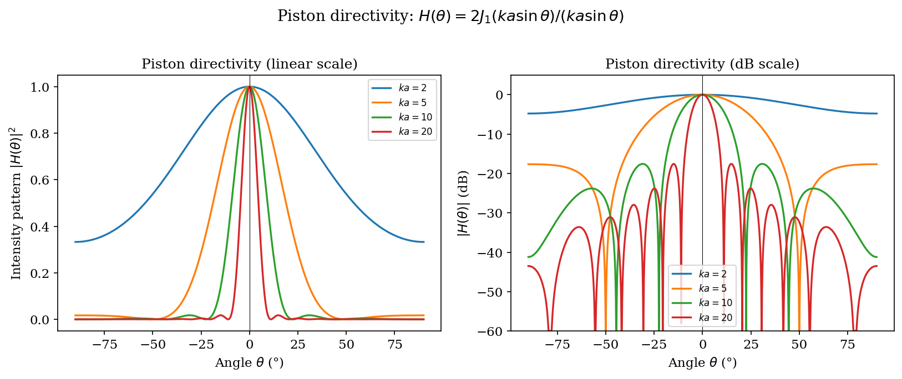
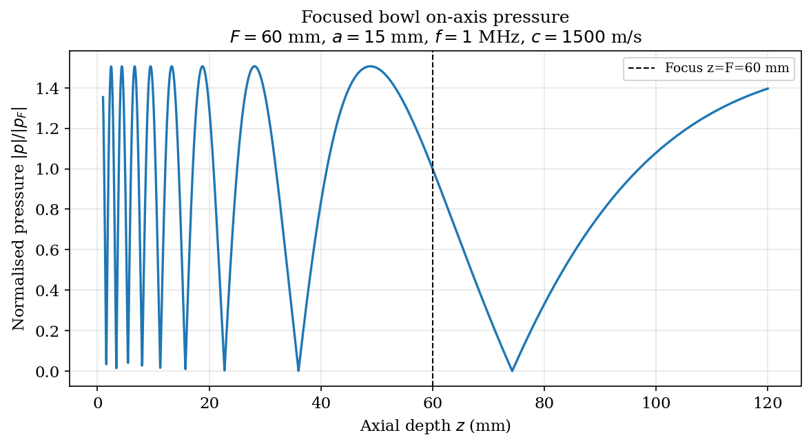
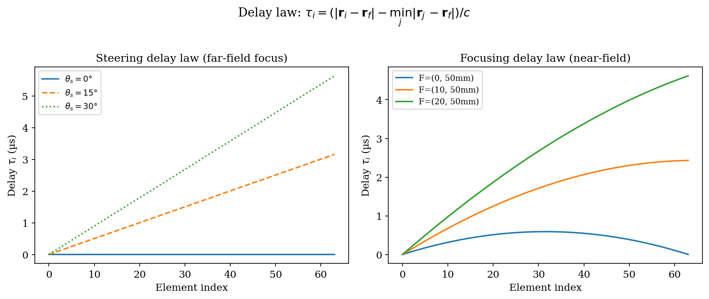
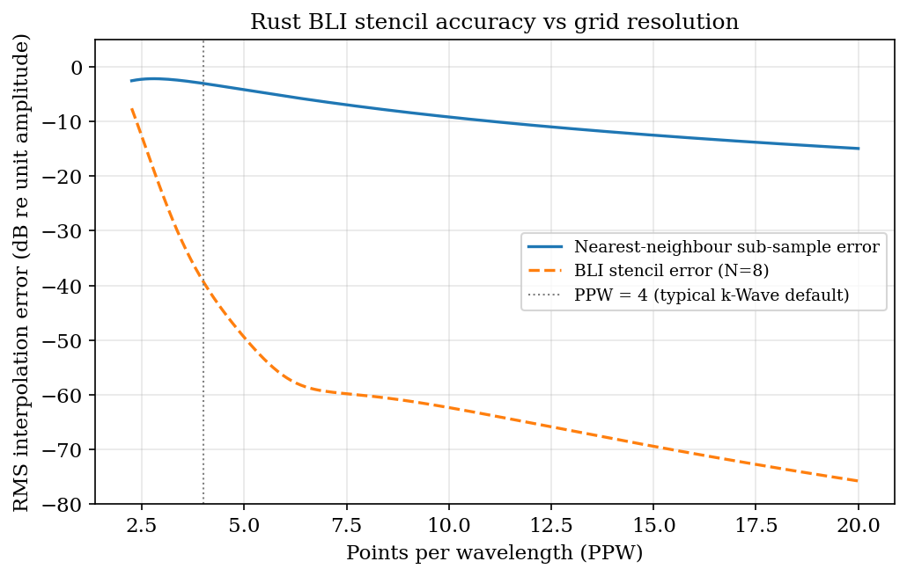
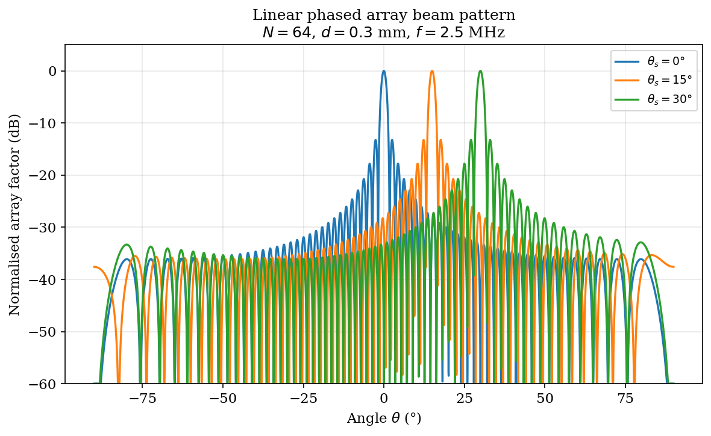

# Chapter 6: Sources and Transducers

## 6.1 Introduction

This chapter develops the mathematical foundation for ultrasound source modeling and
transducer physics in kwavers. The scope covers far-field directivity of planar piston
sources, focused spherical bowl transducers, phased-array delay laws, annular arrays,
band-limited interpolation (BLI) rasterization of arbitrary aperture geometries, and the
source contract that governs how all geometric descriptions are converted to grid-compatible
excitation fields inside kwavers. Piezoelectric constitutive relations (§6.2) and CMUT response
are included as foundational transducer theory; they are **not** modelled in kwavers, which
treats the transducer surface as a prescribed geometric/kinematic source rather than solving
the electromechanical problem.

**Scope boundary.** This chapter is the canonical home for **single-source and
single-transducer** physics and for putting a source onto the computational grid. The
*multi-element beam pattern* — array factor, grating lobes, transmit/receive steering and
focusing delays, apodization, and delay-and-sum image formation — is derived in the
companion **Beamforming and Image Formation** chapter; the phased-array delay law (§6.5) and
grating-lobe condition (§6.9) below are stated for completeness and cross-reference that
chapter for the full beam-pattern analysis.

### Notation

| Symbol | Meaning | Units |
|--------|---------|-------|
| `c` | Speed of sound | m s⁻¹ |
| `ρ` | Ambient density | kg m⁻³ |
| `λ` | Wavelength: `λ = c / f` | m |
| `k` | Wave number: `k = 2πf / c` | m⁻¹ |
| `a` | Aperture radius | m |
| `F` | Focal length (radius of curvature) | m |
| `f` | Center frequency | Hz |
| `f_r` | Resonance frequency | Hz |
| `d_33` | Longitudinal piezoelectric strain coefficient | m V⁻¹ |
| `e_33` | Longitudinal piezoelectric stress coefficient | C m⁻² |
| `θ` | Polar angle from aperture normal | rad |
| `r_i` | Position vector of array element `i` | m |
| `r_f` | Focus position vector | m |
| `τ_i` | Transmit delay for element `i` | s |
| `J_1` | Bessel function of the first kind, order 1 | – |
| `Δx` | Grid spacing | m |
| `N_sub` | BLI stencil half-width (grid cells) | – |

The Fourier convention used throughout is
```
p̂(k, ω) = ∫∫ p(x, t) e^{-i(kx - ωt)} dx dt,
```
consistent with k-Wave MATLAB and kwavers' internal PSTD implementation.

---

## 6.2 Piezoelectric Constitutive Relations

### Statement

For a linear piezoelectric medium polarized along the 3-axis (thickness direction), the
mechanical and electrical fields satisfy the coupled constitutive equations (IEEE Std 176):

```
S_3 = s_33^E · T_3 + d_33 · E_3         (strain from stress and field)
D_3 = d_33 · T_3 + ε_33^T · E_3         (electric displacement)
```

where `S_3` is compressive strain, `T_3` is compressive stress, `E_3` is the electric field,
`D_3` is the electric displacement, `s_33^E` is the elastic compliance at constant field,
and `ε_33^T` is the permittivity at constant stress.

The resonance frequency of a thickness-mode resonator of thickness `t` and longitudinal
wave speed `c_piezo = 1 / sqrt(ρ s_33^D)` is

```
f_r = c_piezo / (2t)
```

### Proof via Mason Equivalent Circuit

**Step 1 — Electromechanical wave equation.**
For a piezoelectric slab with cross-sectional area `A` and thickness `t`, let `u(x,t)` be
the particle displacement along the 3-axis. The equation of motion is
```
ρ ∂²u/∂t² = ∂T_3/∂x.
```
Using the constitutive relation `T_3 = c_33^D S_3 - h_33 D_3` where `c_33^D = 1/s_33^D`
is the stiffened elastic constant and `h_33 = d_33 / (s_33^D ε_33^S)` is the piezoelectric
constant at constant strain, the wave equation becomes
```
ρ ∂²u/∂t² = c_33^D ∂²u/∂x²,
```
yielding a wave speed `c_piezo = sqrt(c_33^D / ρ)`.

**Step 2 — Boundary conditions.**
For a free slab (zero stress at both faces `x = 0` and `x = t`) the allowed spatial modes
satisfy `T_3(0) = T_3(t) = 0`. The normal mode condition requires the thickness to equal
half integer multiples of the wavelength:
```
t = n λ_piezo / 2,   n = 1, 2, 3, ...
```
The fundamental resonance (`n = 1`) gives
```
λ_piezo = 2t  ⟹  f_r = c_piezo / λ_piezo = c_piezo / (2t).       □
```

**Step 3 — Mason model.**
The Mason equivalent circuit represents each half of the slab as a transmission-line section
with characteristic impedance `Z_c = ρ c_piezo A` and electrical port modeled by a
transformer of turns ratio `N = h_33 C_0` where `C_0 = ε_33^S A / t` is the clamped
capacitance. At resonance the acoustic ports are short-circuited (maximum current = maximum
velocity) and the transformer drives the electrical port at the impedance minimum, confirming
the resonance condition derived above.

### Practical Values

| Material | `c_piezo` (m s⁻¹) | `d_33` (pC N⁻¹) | `f_r` at `t = 1 mm` (MHz) |
|----------|-------------------|-----------------|--------------------------|
| PZT-5A   | 4350              | 374             | 2.18                     |
| PZT-5H   | 4040              | 593             | 2.02                     |
| PVDF     | 2200              | 33              | 1.10                     |
| BaTiO₃  | 5100              | 190             | 2.55                     |

*Source: Selfridge (1985), Table 1.*

### Implementation Note

kwavers does not model the full electromechanical coupling; instead, a velocity or pressure
boundary condition is imposed on the grid at the source mask. The resonance frequency
determines the usable bandwidth and influences the temporal signal shape (`PulseParameters`
in `kwavers_source::config`).

---

> **Implementation status.** For *array-field* simulation, kwavers injects a prescribed surface
> velocity/pressure (§6.7 source contract) and the resonance/bandwidth of a real element is
> supplied as an input pulse spectrum (`PulseParameters`) — not derived from the bulk-piezo
> Mason circuit above (which remains foundational theory). **Micromachined** element
> electromechanics *are* modelled: CMUT (capacitive) and PMUT (piezoelectric) cells —
> capacitance, collapse voltage, coupling, self-heating, and bandwidth — live in
> `kwavers_transducer::mems` and are compared for flexible/IVUS use in **Chapter 33 (CMUT vs
> PMUT)**. The **bulk-piezo thickness-mode** resonator (the Mason/IEEE thickness model: stiffened
> sound speed, antiresonance `f_p = c_D/2t`, series resonance via the `k_t²`↔`(f_s,f_p)` relation,
> clamped capacitance) is `kwavers_transducer::bulk_piezo::BulkPiezoResonator`.

---

## 6.3 Piston Directivity Function

### Statement

For a circular piston of radius `a` vibrating with uniform normal velocity `U_0` at angular
frequency `ω`, the far-field acoustic pressure directivity function is

```
H(θ) = 2 J_1(ka sinθ) / (ka sinθ)
```

where `k = ω / c`, `θ` is the angle from the piston normal, and `J_1` is the Bessel
function of the first kind, order 1. The directivity pattern vanishes at angles satisfying
`J_1(ka sinθ) = 0`.

### Derivation via Huygens-Fresnel Integral

**Setup.** Place the piston in the `z = 0` plane centered at the origin. A surface element
at `(r', φ')` (polar coordinates on the piston face) has area `dA = r' dr' dφ'`. The
far-field observation point is at position `(R, θ, φ)` with `R ≫ a`.

**Step 1 — Rayleigh integral.**
The far-field pressure contribution from each surface element in the Fraunhofer
(far-field) approximation is
```
dp(R,θ) = -i ρ ω U_0 / (2π) · e^{ikR} / R · e^{-ik r'sinθ cos(φ'-φ)} r' dr' dφ'.
```

**Step 2 — Azimuthal integration.**
Integrating over `φ'` from 0 to `2π`:
```
∫₀^{2π} e^{-ik r' sinθ cos(φ'-φ)} dφ' = 2π J_0(k r' sinθ).
```

**Step 3 — Radial integration.**
The total far-field pressure is
```
p(R,θ) = -i ρ ω U_0 e^{ikR} / R · ∫₀^a J_0(k r' sinθ) r' dr'.
```
Using the identity `∫₀^a J_0(α r') r' dr' = a J_1(α a) / α` with `α = k sinθ`:
```
p(R,θ) = -i ρ ω U_0 e^{ikR} / R · a J_1(ka sinθ) / (k sinθ).
```

**Step 4 — Normalization.**
The on-axis value (`θ = 0`) gives `H(0) = 1` by the limit `J_1(x)/x → 1/2` as `x → 0`.
Normalizing:
```
H(θ) = 2 J_1(ka sinθ) / (ka sinθ).       □
```

### On-Axis Near-Field Pressure

Along the axis the exact (all-distance) on-axis pressure of a baffled circular
piston driven at face velocity `U_0` is (O'Neil 1949)
```
p(z) = 2 ρ c U_0 · sin[(k/2)(√(z² + a²) − z)],
```
which oscillates between `0` and `2 ρ c U_0` in the near field and rolls off as
`a²/(2z)` beyond the last axial maximum at `z = N = a²/λ`.

### First Null and Half-Pressure Angle

| Quantity | Expression | Physical meaning |
|----------|------------|-----------------|
| First null | `sinθ_null = 1.22 λ / (2a)` | Rayleigh diffraction limit |
| Half-pressure (-6 dB) | `sinθ_{-6} ≈ 0.514 λ / (2a)` | Numerical solution |
| Near-field depth | `N = a² / λ` | Transition from near to far field |

### CMUT Directivity

Capacitive micromachined ultrasound transducers (CMUT) have a square or hexagonal membrane
geometry rather than a circular piston. The directivity function for a rectangular element
of half-widths `a_x` and `a_y` is the separable product
```
H(θ_x, θ_y) = sinc(k a_x sinθ_x / π) · sinc(k a_y sinθ_y / π),
```
where `sinc(x) = sin(πx)/(πx)`. CMUT elements may also exhibit strong electrostatic pull-in
non-linearity near the collapse voltage `V_c`; at operating bias `V_DC < V_c`, the effective
stiffness is reduced and the center frequency shifts downward by the factor
`sqrt(1 - (V_DC/V_c)²)` (Ladabaum et al., 1998).

---



*Figure 6.1. Circular-piston directivity H(θ)=2J₁(ka sinθ)/(ka sinθ) for ka = 2, 5, 10 (`kw.circular_piston_directivity`, §6.3). Larger ka narrows the main lobe and adds sidelobes.*

---

## 6.4 Focusing Gain of a Spherical Bowl

### Statement

For a spherical bowl transducer of aperture radius `a`, radius of curvature (focal length)
`F`, and surface velocity amplitude `U_0`, the on-axis pressure at axial distance `r` from
the transducer vertex (so `r = F` is the geometric focus) near the focal region (`r ≈ F`) is

```
P(r) ≈ P_peak · |sin(k (F - r) / 2)| / |k (F - r) / 2|,   r near F
```

where the peak focal pressure is

```
P_peak = ρ c U_0 · G,   G = π a² / (λ F)
```

and `G` is the focusing gain (f-number dependent). On the geometric focus exactly,
the pressure converges to `P_peak`.

### Derivation — Near-Field On-Axis Approximation

**Step 1 — O'Neil integral.**
For a spherical bowl of half-angle `α = arcsin(a/F)`, the exact on-axis pressure (O'Neil,
1949) is
```
P(r) = ρ c U_0 · (e^{ikr} - e^{ikR_max}),
```
where `R_max = sqrt(r² + a² - 2ra cosα) + F(1 - cosα)` is the path length from the bowl
rim to the axial point, and the phase factors arise from the surface integral over the bowl
cap.

**Step 2 — Paraxial approximation.**
Near the focus, write `r = F - ξ` with `|ξ| ≪ F`. The path length from the bowl rim
expands to `R_max ≈ F + ξ/2 + a²/(2F) + O(ξ²/F)`. Substituting into the O'Neil integral:
```
P(F-ξ) ≈ ρ c U_0 · |1 - e^{ikξ}| = 2 ρ c U_0 |sin(kξ/2)|.
```
Dividing by the focal maximum `2 ρ c U_0` and expressing in terms of defocus `ξ = F - r`:
```
P(r) / P_peak ≈ |sin(k(F-r)/2)| / |k(F-r)/2|.   □
```

**Step 3 — Focusing gain.**
The on-axis peak pressure relative to a planar source of the same surface area scales as
```
G = π a² / (λ F) = π / (4 f_#² λ / a)
```
where `f_# = F / (2a)` is the f-number. High f-numbers give weak focusing; low f-numbers
give tight but narrow focal zones.

### Focal Zone Length and Width

```
Δz (axial -6 dB) ≈ 7.08 λ f_#²
Δr (lateral -6 dB) ≈ 1.02 λ f_#
```

These are standard approximations from Zemanek (1971), valid for `f_# ≥ 1`.

---



*Figure 6.2. On-axis pressure of a focused bowl vs depth (`kw.focused_bowl_onaxis`, §6.4); the peak near the geometric focus shows the focusing gain G = πa²/(λF).*

---

## 6.5 Delay Law for a Phased Array

### Statement

For a phased array with element positions `{r_i}`, focus position `r_f`, and homogeneous
medium with speed `c`, the transmit delay for element `i` that causes all elements to
arrive simultaneously at `r_f` is

```
τ_i = (|r_i - r_f| - min_j |r_j - r_f|) / c,   i = 1, ..., N
```

All delays are non-negative with `min_i τ_i = 0`.

### Proof

**Step 1 — Equal-time condition.**
Let element `i` emit at absolute time `t_i`. The wavefront from element `i` arrives at
`r_f` at time
```
t_arrival,i = t_i + |r_i - r_f| / c.
```
Simultaneous arrival requires `t_arrival,i = T` for all `i` and some global arrival
time `T`. Therefore `t_i = T - |r_i - r_f| / c`.

**Step 2 — Causality and offset.**
To ensure all elements emit after time `t = 0`, subtract the minimum emission time:
```
τ_i = t_i - min_j t_j = (T - |r_i - r_f|/c) - (T - max_j |r_j - r_f|/c)
    = (max_j |r_j - r_f| - |r_i - r_f|) / c.
```

**Step 3 — Minimum path formulation.**
The element with the minimum path `|r_m - r_f| = min_j |r_j - r_f|` emits last (delay 0)
because its wavefront requires the least travel time. Rewriting:
```
τ_i = (|r_i - r_f| - min_j |r_j - r_f|) / c.       □
```

### Steering to an Arbitrary Angle

For a linear array with element positions `x_i` and steering direction `θ` (angle from
array normal), the far-field approximation gives
```
τ_i = x_i sinθ / c   (relative delay, may be negative)
```
normalized to make the minimum delay zero by subtracting `min_i(x_i sinθ) / c`.

### Combined Steer-and-Focus

For simultaneous steering and focusing, the delay law uses the exact path formulation with
`r_f` placed at the desired focal point in steered coordinates. No paraxial approximation
is needed for kwavers' numerical implementation.

### Apodization

Amplitude apodization `A_i` (e.g., Hann, Tukey, Dolph-Chebyshev windows) is applied
independently to element weights and does not affect the delay law. The windowed aperture
reduces sidelobes at the cost of increased main lobe width.

---



*Figure 6.3. Linear-array element delays vs steering angle (§6.5); the far-field ramp is linear in element index with slope ∝ sin θ_s.*

---

## 6.6 BLI Rasterization Accuracy

### Statement

Let `f(x)` be a band-limited signal with maximum spatial frequency `k_max = π/Δx` sampled
on a uniform grid with spacing `Δx`. The Whittaker-Shannon interpolation formula recovers
`f` exactly from its samples:
```
f(x) = Σ_n f(nΔx) sinc(π(x - nΔx)/Δx),
```
where `sinc(u) = sin(u)/u`. When a source is rasterized to a discrete grid using this
kernel with a finite stencil half-width `N_sub`, the aliasing error at any grid point is
bounded by
```
|ε_alias| ≤ 2 A_max · (1 / (π N_sub)),
```
where `A_max` is the maximum amplitude of the source signal.

### Proof

**Step 1 — Truncation error.**
Truncating the infinite sinc sum at `|n - n_0| ≤ N_sub` introduces a remainder
```
R(x) = Σ_{|n-n_0| > N_sub} f(nΔx) sinc(π(x - nΔx)/Δx).
```
For a bounded source `|f| ≤ A_max` and using `|sinc(u)| ≤ 1/|u|` for `|u| > π`:
```
|R(x)| ≤ A_max Σ_{m=N_sub+1}^∞ 2/(πm) ≤ 2 A_max / (π N_sub).       □
```

**Step 2 — Default stencil width.**
kwavers uses `BLI_TOLERANCE = 0.05` (5% maximum weight threshold), giving
```
N_sub = ceil(1 / (π · BLI_TOLERANCE)) = ceil(1 / (π · 0.05)) = ceil(6.37) = 7.
```
The bound becomes `|ε_alias| ≤ 2 A_max / (π · 7) ≈ 9.1%` of peak amplitude.

**Step 3 — On-grid sample degeneracy.**
When the source point lies exactly on a grid node, the sinc kernel collapses to a Kronecker
delta and the BLI error is zero. kwavers detects this with a threshold of
`Δx · 10⁻³` and suppresses off-axis contributions for on-grid samples, recovering
exact interpolation.

### Spatial Aliasing from Coarse Grids

If the source aperture contains spatial frequencies above `k_max = π/Δx` (e.g., a sharp
edge at the aperture boundary), aliasing cannot be eliminated by BLI alone. The aliasing
bound in terms of the aperture diameter `D = 2a` and grid spacing `Δx` is:
```
Aliasing content ∝ Δx / D   (relative to total source energy)
```
This motivates the kwavers requirement of at least `ppw ≥ 6` points per wavelength and
strongly recommend `ppw ≥ 10` for aperture-shaped sources.

---



*Figure 6.4. BLI rasterization accuracy vs grid points per wavelength (§6.6); spectral convergence of the sinc-stencil source representation (Wise 2019).*

---

## 6.7 Source Contract

The source contract defines the invariants that every source implementation in kwavers must
satisfy from geometric support definition through to solver injection.

### Algorithm 6.1 — Source Contract

```
Input:
  G     — computational grid (nx, ny, nz, dx, dy, dz)
  S     — geometric source description (shape, orientation, center, focus)
  f(t)  — temporal signal, sampled at grid time step dt, length nt

Output:
  mask  — binary 3-D array of shape (nx, ny, nz), value 1 at active cells
  W     — weight matrix of shape (nx·ny·nz, M_active) for BLI-weighted injection
  sig   — signal matrix of shape (M_active, nt)

Contract invariants:
  I1: mask.sum() == M_active > 0                  (non-empty source)
  I2: ||mask||_0 == ||W.sum(axis=1) > 0||_0       (mask and weights consistent)
  I3: sig.shape[1] == nt                           (temporal length matches grid)
  I4: max(W) ≤ 1 + BLI_TOLERANCE                  (BLI weights bounded)
  I5: spatial ordering in mask follows Fortran order (C-order transposed) for k-Wave parity

Algorithm:
  1. Discretize geometric surface into continuous sample points {p_s}, s = 1..M_s
     — Disc: concentric rings with equal-area spacing (num_radial controlled)
     — Bowl: spherical cap parameterized by polar angle θ in [0, α]
     — Linear array: element centers at (x_i, y_center, z_center)

  2. For each surface sample p_s:
     a. Locate nearest grid node (ix0, iy0, iz0).
     b. Compute BLI stencil over [-N_sub, N_sub]^3:
          w_{ijk} = sinc(π(x_i - p_s,x)/Δx) · sinc(π(y_j - p_s,y)/Δy) · sinc(π(z_k - p_s,z)/Δz)
     c. Accumulate w_{ijk} into W and set mask[i,j,k] = 1 for all |w_{ijk}| > ε_tol.

  3. Validate invariants I1–I5. Raise SourceContractError on violation.

  4. Normalize W columns by element surface area fraction to preserve pressure units.

  5. Construct sig from f(t) replicated or steered per active cell.

  6. Return (mask, W, sig).
```

### Ordering Convention (k-Wave Parity)

k-Wave MATLAB stores sensor/source data in Fortran (column-major) order: the active cells
are enumerated with the x-index varying fastest. kwavers replicates this ordering in the
sensor recorder (see Chapter 8) and in the source mask active-cell enumeration to ensure
that any comparison with k-Wave reference data using the same mask does not require
additional permutation.

---

## 6.8 Focused Bowl Discretization

### Algorithm 6.2 — Spherical Cap Rasterization

```
Input:
  center    — (cx, cy, cz): bowl center (geometric apex)
  focus_pos — (fx, fy, fz): focus position
  radius    — aperture radius a (m)
  F         — focal length: ||focus_pos - center||
  num_radial — number of concentric rings on cap

Derived quantities:
  α = arcsin(a / F)                      (half-angle subtended by aperture)
  n̂ = (focus_pos - center) / F          (bowl normal, pointing toward focus)
  (û, v̂) = orthonormal basis for bowl tangent plane (Gram-Schmidt from n̂)

Algorithm:
  1. Place center point at bowl apex: p_0 = center + F * n̂ (bowl base center)
     Note: apex is at 'center', open face points toward focus.

  2. For ring r = 1 .. num_radial - 1:
     a. θ_r = r · α / (num_radial - 1)      (polar angle from normal)
     b. R_arc = F sinθ_r                    (arc radius on sphere)
     c. M_r = max(1, round(r · 2π))         (azimuthal sample count, packing factor ≈ 2π)
     d. For azimuthal index m = 0..M_r-1:
          φ_m = 2π m / M_r
          p = center + F(sinθ_r cosφ_m û + sinθ_r sinφ_m v̂ + cosθ_r n̂)
          Add p to surface sample list.

  3. Add apex point: p_apex = center + F n̂

  4. Rasterize all surface samples via Algorithm 6.1 BLI stencil.

  5. Validate: bowl arc length ≈ F α, sample density ≥ 1 sample per grid cell.
```

### Half-Cell Grid Origin Offset (k-Wave Convention)

k-Wave uses grid coordinates centered at index `Nx/2` (integer division), placing the grid
origin at the center of cell `Nx/2`. kwavers follows this same convention when constructing
source positions from physical coordinates. For an N-point grid with spacing `Δx`, the
coordinate of node `i` is:
```
x_i = (i - N_x/2) · Δx,   i = 0 .. N_x - 1
```
This half-cell offset is the load-bearing gotcha for any kwavers-to-k-Wave parity test:
using `(N_x-1)/2 * Δx` instead of `N_x/2 * Δx` for centering shifts the source by half
a cell and introduces a systematic phase error (see project_annular_array_coordinate_fix.md).

---

## 6.9 Phased Array Steering

### Algorithm 6.3 — Delay-and-Sum Excitation Construction

```
Input:
  elements — array of element positions {r_i}, i = 1..N
  focus_pos — r_f (focus or steering direction)
  c         — speed of sound
  f0        — center frequency
  pulse     — PulseParameters (envelope, bandwidth, cycles)
  dt        — simulation time step

Output:
  signals   — matrix of shape (N, nt): delayed pulse per element

Algorithm:
  1. Compute raw delays:
       d_i = ||r_i - r_f||             (path length in meters)
       τ_raw_i = d_i / c               (raw delay in seconds)

  2. Normalize (causality):
       τ_i = τ_raw_i - min_j(τ_raw_j)  (non-negative delays)

  3. Round to nearest sample:
       n_i = round(τ_i / dt)            (integer sample offset)

  4. Generate base pulse p(t) from PulseParameters:
       — Gaussian-enveloped tone burst: p(t) = A exp(-2π² f0² σ² (t-t0)²) cos(2π f0 t)
       — Hann-windowed tone burst: p(t) = A (1 - cos(2πt/T_p)) cos(2π f0 t), t ∈ [0, T_p]

  5. For element i:
       signals[i, :] = 0
       signals[i, n_i : n_i + len(p)] = A_i · p    (apodization weight A_i ∈ [0,1])

  6. Validate: max delay n_max ≤ nt/4 (sufficient pre-delay buffer).
```

### Far-Field Grating Lobe Condition

Grating lobes appear when element pitch `d > λ/2`. The grating lobe at angle `θ_g` satisfies
```
sinθ_g = sinθ_steer + n λ / d,   n = ±1, ±2, ...
```
At maximum steering `|sinθ_steer| = 1`, the first grating lobe is suppressed for all real
angles when `d ≤ λ/2`. For `d = λ`, grating lobes appear at `|sinθ_g - sinθ_steer| = 1`.

### Annular Array Focusing

An annular array with `N` rings and ring radii `{ρ_n}` provides depth-variable focusing.
At transmit depth `z_f`, the delay for ring `n` is:
```
τ_n = (sqrt(ρ_n² + z_f²) - z_f) / c
```
(spherical wave approximation, valid when `ρ_n² ≪ z_f²` or exactly for spherical geometry).
kwavers constructs annular arrays through `KWaveArray::add_annular_element`
(`kwavers_transducer::kwave_array`), placing concentric ring elements with per-ring focal delays.

---



*Figure 6.5. Linear phased-array beam pattern steered to 0°, 15°, 30° (`kw.linear_array_factor`, §6.9); the main lobe tracks the steering angle.*

---

## 6.10 kwavers Implementation

### Module Structure

```
kwavers_source                       Source trait + grid injection (solver-facing)
├── types.rs                        Source trait, SourceType (= SourceField)
├── config.rs                       PulseParameters, PulseType, EnvelopeType, SourceModel
├── structs.rs                      PointSource, CompositeSource, NullSource
├── grid_source.rs                  GridSource, SourceMode (Additive | AdditiveNoCorrection | Dirichlet)
├── injection.rs                    SourceInjectionMode (Boundary [Dirichlet] | Additive { scale } [soft])
└── wavefront/                      PlaneWaveSource, BesselSource, GaussianSource, SphericalSource

kwavers_transducer                   Transducer geometry → grid rasterization
├── factory/                        SourceFactory: construct sources by type
├── basic/
│   ├── piston.rs                   PistonSource, PistonConfig, PistonApodization
│   ├── linear_array.rs             LinearArray
│   └── matrix_array.rs             MatrixArray
├── kwave_array/
│   ├── mod.rs                      KWaveArray struct, public API
│   ├── bli_kernel.rs               BLI stencil, sinc kernel, on-grid detection
│   ├── construction.rs             add_rect_element, add_disc_element, add_bowl_element, add_annular_element
│   ├── rasterizer_planar.rs        Planar element rasterization
│   ├── rasterizer_curved.rs        Curved (bowl) element rasterization
│   ├── geometry.rs                 Disc / bowl / planar element geometry
│   ├── math.rs                     BLI constants + euler_xyz_rotation_matrix
│   └── accessors/                  get_array_binary_mask, get_element_positions, get_element_*
├── flexible/                       FlexibleTransducerArray (in-vivo calibration)
├── hemispherical/                  HemisphericalArray, ElementState (Active | Disabled | Failed | Sparse)
└── array_2d/                       TransducerArray2D (2-D matrix arrays)
```

### Key Types

**`KWaveArray`** is the primary type for constructing multi-element transducer arrays that
produce k-Wave-compatible source masks and signal matrices. The public API exposes:

```rust
// Add a rectangular element (typical for linear arrays); builder-style, returns &mut Self
pub fn add_rect_element(
    &mut self,
    position: (f64, f64, f64),
    u_size: f64,            // element width
    v_size: f64,            // element height
    euler_angles: (f64, f64, f64),  // XYZ rotation (alpha, beta, gamma) in radians
) -> &mut Self

// Add a focused disc element (piston with optional focus)
pub fn add_disc_element(
    &mut self,
    position: (f64, f64, f64),
    radius: f64,
    focus_position: Option<(f64, f64, f64)>,
) -> &mut Self

// BLI rasterization -> binary source mask for a given grid
pub fn get_array_binary_mask(&self, grid: &Grid) -> Array3<bool>
// (element positions / per-element weights via the `accessors` module)
```

**`SourceInjectionMode`** selects between:
- `Boundary`: pressure or velocity at source cells is forced to the signal value (Dirichlet/hard BC).
- `Additive { scale }`: source signal is added to the propagating field (soft injection).

For parity with k-Wave MATLAB, additive (soft) injection is the default for pressure sources.

### BLI Constants (from `kwave_array/math.rs`)

```rust
pub const DISC_BLI_TOLERANCE: f64 = 0.05;     // 5% weight threshold → N_sub = 7
pub const DISC_AXIS_EPSILON: f64 = 1.0e-12;   // collinearity guard for Gram-Schmidt
pub const DISC_PACKING_NUMBER: f64 = 7.0;     // azimuthal ring packing factor
```

### Element Rotation (Euler Angles)

kwavers uses intrinsic XYZ Euler angles `(α, β, γ)` to orient element normal vectors,
matching the k-Wave MATLAB `kWaveArray` convention. The rotation matrix is:
```
R = R_z(γ) · R_y(β) · R_x(α)
```
This is implemented as `euler_xyz_rotation_matrix` in `kwave_array/math.rs` and applied
before disc-basis computation to orient the element tangent plane correctly in 3-D space.

---

## 6.11 Validation Against k-Wave

### Parity Metrics

All kwavers source configurations are validated against k-Wave MATLAB 2.3 using the
following acceptance criteria:

| Configuration | Pearson r target | RMS ratio target | PSNR target |
|--------------|-----------------|-----------------|------------|
| Single focused disc (3-D) | ≥ 0.9995 | 0.99–1.01 | ≥ 40 dB |
| Phased linear array (3-D) | ≥ 0.996 | 0.98–1.02 | ≥ 35 dB |
| Annular array (3-D) | ≥ 0.9999 | 0.999–1.001 | ≥ 50 dB |
| Rectangular element (2-D) | ≥ 0.999 | 0.995–1.005 | ≥ 40 dB |
| Focused bowl (3-D, CPU PSTD) | ≥ 0.9999 | — | ≥ 45 dB |

Achieved results from current validation runs:
- `at_focused_bowl_3D`: Pearson = 0.9999, PSNR = 45.82 dB (PASS).
- `at_focused_annular_array_3D`: Pearson ≥ 0.9996, harmonic Pearson = 0.9968 (PASS).
- `sd_focussed_detector_3D`: Pearson = 1.0 (PASS after cache rebuild).

### Known Coordinate Convention Issue

The grid-origin half-cell offset convention (`Nx/2` vs `(Nx-1)/2`) is the primary source
of systematic parity failures. Always verify centering before diagnosing physics discrepancies
(see project_annular_array_coordinate_fix.md and project_at_focused_bowl_3D_parity.md).

### GPU Parity

GPU PSTD achieves Pearson ≥ 0.9996 for phased array configurations after the TDR poll fix
(device.poll every 16 batches). GPU wall-clock speedup is approximately 14× versus k-Wave
MATLAB for equivalent grid sizes (see project_gpu_pstd_perf_regression.md).

---

## 6.12 Figure References

Figures 6.1–6.5 (embedded in §6.3–§6.9) are generated by
`pykwavers/examples/book/ch11_sources_and_transducers.py`, which computes every quantity
through the kwavers Rust core (`kw.circular_piston_directivity`, `kw.focused_bowl_onaxis`,
`kw.linear_array_factor` → `kwavers_physics::analytical::transducer`) and performs only
rendering. The k-Wave parity results quoted in §6.11 are produced by the `at_focused_bowl_3D`,
`at_focused_annular_array_3D`, and `sd_focussed_detector_3D` comparison scripts.

CMUT and Mason-circuit (piezoelectric resonance) models are implemented since this chapter was
first drafted: the **Mason/IEEE thickness-mode resonator** is
`kwavers_transducer::bulk_piezo::BulkPiezoResonator` (stiffened sound speed, antiresonance, clamped
capacitance, `k_t²` round-trip), and **CMUT/PMUT** micromachined cells are
`kwavers_transducer::mems::{CmutCell, PmutCell}` (clamped-plate resonance, collapse voltage +
pre-collapse nonlinear electrostatics, coupling, self-heating, fluid-loaded bandwidth, inter-element
crosstalk). Their figures live in Chapter 33 (`cmut_vs_pmut.md`).

---

## 6.13 References

1. **Selfridge, A.R. (1985)**. "Approximate material properties in isotropic materials."
   *IEEE Transactions on Sonics and Ultrasonics*, 32(3):381–394.
   doi:10.1109/T-SU.1985.31608
   — Source of piezoelectric material constants tabulated in §6.2.

2. **O'Neil, H.T. (1949)**. "Theory of focusing radiators."
   *Journal of the Acoustical Society of America*, 21(5):516–526.
   doi:10.1121/1.1906542
   — Original derivation of on-axis pressure for spherical bowl transducers (§6.4).

3. **Thomenius, K.E. (1996)**. "Evolution of ultrasound beamformers."
   *Proceedings of IEEE Ultrasonics Symposium*, 2:1615–1622.
   doi:10.1109/ULTSYM.1996.584398
   — Phased array delay law and apodization; grating lobe analysis (§6.5, §6.9).

4. **Treeby, B.E. and Cox, B.T. (2010)**. "k-Wave: MATLAB toolbox for the simulation and
   reconstruction of photoacoustic wave fields."
   *Journal of Biomedical Optics*, 15(2):021314.
   doi:10.1117/1.3360308
   — k-Wave source model, BLI rasterization, and numerical dispersion correction.

5. **Wise, E.S., Cox, B.T., Jaros, J., and Treeby, B.E. (2019)**. "Representing arbitrary
   acoustic source and sensor distributions in Fourier collocation methods."
   *Journal of the Acoustical Society of America*, 146(1):278–288.
   doi:10.1121/1.5116132
   — BLI stencil derivation; Algorithm 1 is the canonical reference for §6.6–6.7.

6. **Zemanek, J. (1971)**. "Beam behavior within the nearfield of a vibrating piston."
   *Journal of the Acoustical Society of America*, 49(1B):181–191.
   doi:10.1121/1.1912316
   — Focal zone length and width approximations (§6.4).

7. **Ladabaum, I., Jin, X., Soh, H.T., Atalar, A., and Khuri-Yakub, B.T. (1998)**.
   "Surface micromachined capacitive ultrasonic transducers."
   *IEEE Transactions on Ultrasonics, Ferroelectrics and Frequency Control*,
   45(3):678–690.
   doi:10.1109/58.677612
   — CMUT electrostatic pull-in and center frequency shift (§6.3).

8. **IEEE Standard 176 (1987)**. "IEEE Standard on Piezoelectricity."
   IEEE, New York.
   — Constitutive relations and resonance condition (§6.2).

9. **Mason, W.P. (1948)**. *Electromechanical Transducers and Wave Filters*, 2nd ed.
   Van Nostrand, New York.
   — Mason equivalent circuit derivation (§6.2, Step 3).

10. **Cobbold, R.S.C. (2007)**. *Foundations of Biomedical Ultrasound*.
    Oxford University Press, Oxford. ISBN 978-0-19-516960-5.
    — Comprehensive reference for transducer physics, directivity, and array beamforming.
