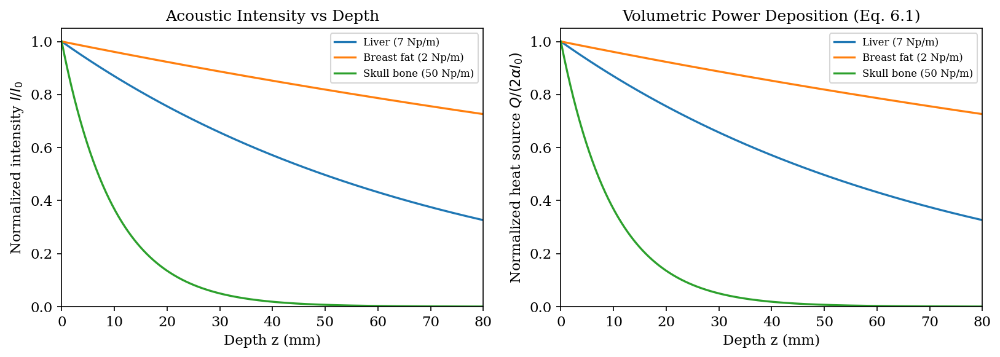
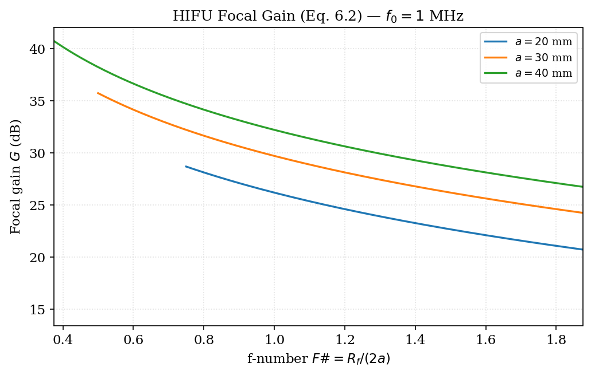
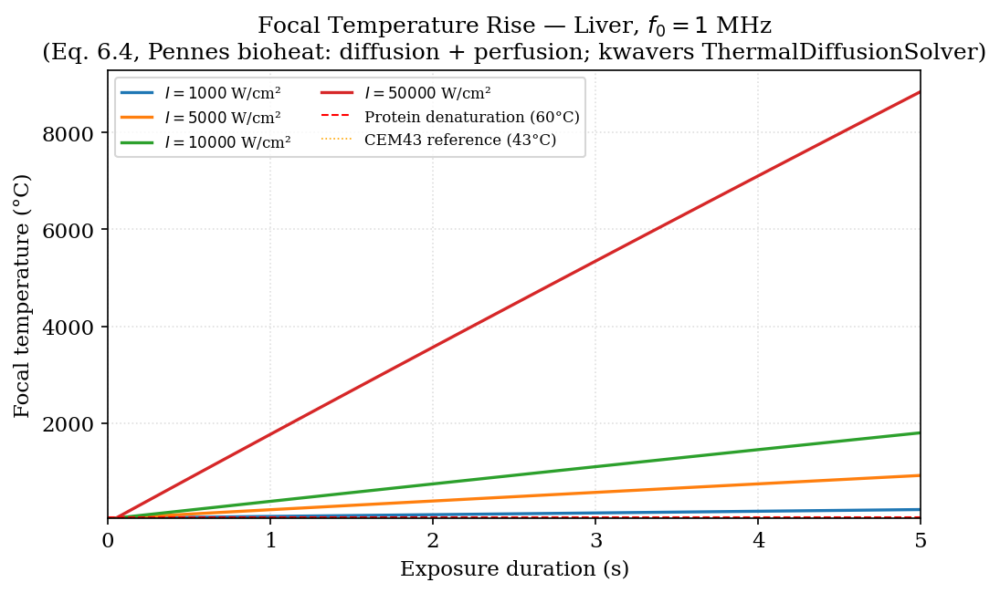
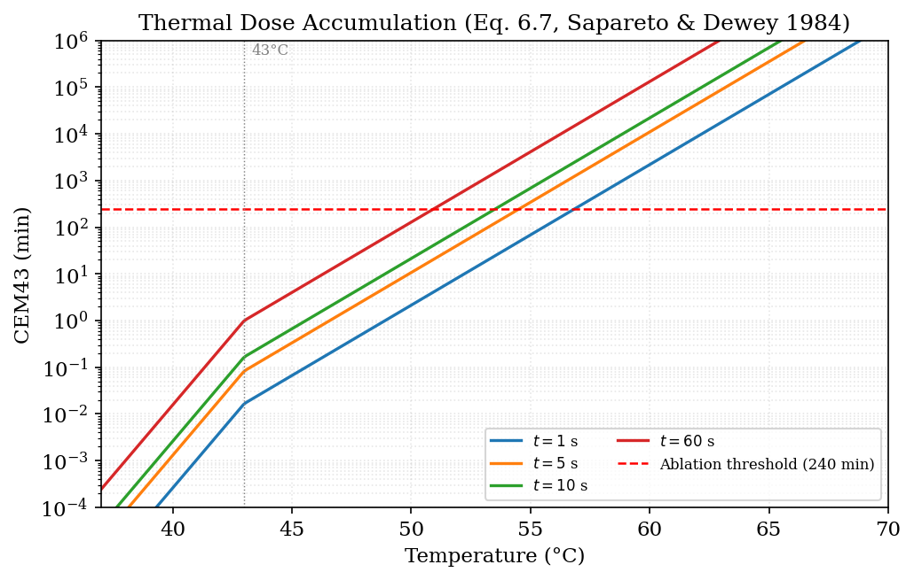
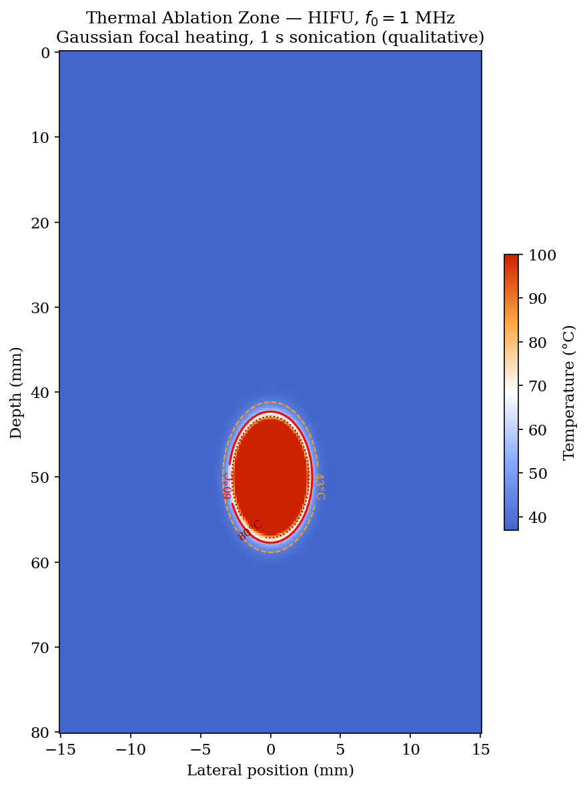

# Chapter 12 — Therapeutic Ultrasound

**Scope.** This chapter derives the physical mechanisms of ultrasound therapy: HIFU-induced
heating, the Pennes bioheat equation, thermal dose (CEM43), acoustic radiation force,
sonoporation, lithotripsy, and neuromodulation. Histotripsy (microsecond intrinsic-threshold
and millisecond regimes) and the optimal pulse patterns for each — dual-PRF burst-and-pause,
dithered-PRF, and hybrid microsecond/boiling — are treated separately in
[Chapter 14 (Histotripsy)](histotripsy.md), with code in
`kwavers_therapy::therapy::clinical_scenarios`. Every mechanism is derived from
first principles with formal theorems. Code references map to `kwavers_therapy::therapy`
and the acoustic propagation solvers (Chapters 2–3).

---

## 12.1 Acoustic Intensity and Energy Deposition

### 12.1.1 Time-Averaged Intensity

**Theorem 12.1 (Acoustic Power Deposition).** For a plane wave with pressure amplitude P
propagating in a medium with absorption coefficient α [Np m⁻¹], the volumetric acoustic
power deposition (heat source density) is

```
Q_ac(r) = 2α I(r) = α P²(r) / (ρ₀ c₀)    [W m⁻³]                       (12.1)
```

where I = P²/(2ρ₀c₀) is the time-averaged acoustic intensity.

*Proof.* The intensity of a plane wave decays as I(z) = I₀ exp(−2αz). Conservation of
acoustic energy (Theorem 1.5) relates the divergence of the Poynting vector to
dissipation: Q_ac = −∇·(pu) = 2αI. Substituting I = P²/(2ρ₀c₀) gives (12.1). □

**Remark 12.1.** For non-planar fields (focused beams), Eq. (12.1) holds locally when α
is small (αλ ≪ 1) and the beam is quasi-planar within a resolution cell. For strongly
focused beams the full vector form Q = −∇·⟨p u⟩ must be used.



*Figure 12.1. Acoustic power deposition Q_ac = 2αI vs depth (§12.1; `kw.absorption_power_law_db_cm`); the heat-source profile that drives the bioheat equation.*


### 12.1.2 Focal Intensity for a Focused Bowl

For a HIFU focused bowl of aperture 2a, focal length R_f, face pressure P₀, surface
intensity I_face = P₀²/(2ρ₀c₀):

```
I_focal = G² I_face    G = k a²/(2R_f)    (Ch. 6 §6.4, Focusing Gain)                   (12.2)
```

For a = 30 mm, f = 1 MHz, R_f = 60 mm: G ≈ 31, I_focal/I_face ≈ 961.

---



*Figure 12.2. HIFU focal intensity gain G² vs f-number (`kw.hifu_focal_pressure_gain`, §12.1.2); tighter focusing (smaller f-number) raises focal intensity quadratically.*

---

## 12.2 Pennes Bioheat Equation

### 12.2.1 Derivation

**Theorem 12.2 (Pennes Bioheat Equation).** The temperature T(r, t) in perfused tissue
satisfies

```
ρ_t c_p ∂T/∂t = ∇·(κ ∇T) + Q_ac − ω_b ρ_b c_b (T − T_b) + Q_met         (12.3)
```

where:
- ρ_t, c_p: tissue density [kg m⁻³] and specific heat capacity [J kg⁻¹ K⁻¹]
- κ: thermal conductivity [W m⁻¹ K⁻¹]
- Q_ac = 2αI: acoustic heat source [W m⁻³] (Eq. 12.1)
- ω_b: blood perfusion rate [kg m⁻³ s⁻¹]
- ρ_b, c_b: blood density and specific heat
- T_b: blood temperature (37 °C)
- Q_met: metabolic heat generation (typically ≪ Q_ac during HIFU)

*Proof.* The bioheat equation is the heat equation with three source/sink terms:
(1) conduction ∇·(κ∇T) by Fourier's law; (2) acoustic deposition Q_ac; (3) perfusion
cooling by convective heat exchange with blood flowing at ω_b kg m⁻³ s⁻¹.
Pennes (1948) derived the blood term by modeling perfusion as a spatially distributed
heat exchanger at temperature T_b. □

### 12.2.2 Tissue Thermal Properties

| Tissue | ρ (kg/m³) | c_p (J/kg·K) | κ (W/m·K) | ω_b (kg/m³/s) |
|--------|-----------|--------------|-----------|---------------|
| Liver | 1060 | 3600 | 0.51 | 6.4 × 10⁻³ |
| Kidney | 1050 | 3900 | 0.54 | 24.0 × 10⁻³ |
| Muscle | 1080 | 3640 | 0.50 | 0.5 × 10⁻³ |
| Fat | 940 | 2350 | 0.21 | 0.5 × 10⁻³ |
| Bone (cortical) | 1850 | 1300 | 0.38 | 0 |

### 12.2.3 Simplified Homogeneous Solution

Neglecting perfusion and conduction (short exposures, τ < 1 s), Eq. (12.3) reduces to:

```
∂T/∂t ≈ Q_ac / (ρ_t c_p)  →  ΔT = 2αI τ / (ρ_t c_p)                    (12.4)
```

At HIFU focal intensities (I = 5000 W/cm² = 5×10⁷ W/m², α = 5 Np/m, τ = 1 s):

```
ΔT = 2αIτ / (ρ_t c_p) = 2 × 5 × 5×10⁷ × 1 / (1060 × 3600) ≈ 131 °C
```

This is the adiabatic temperature rise after τ = 1 s (τ is included in the
numerator; the result has units of °C, not °C/s).  Tissue reaches 60 °C
(protein denaturation) within ≈ 0.17 s at typical HIFU intensities.

---



*Figure 12.3. Temperature rise vs depth from the real `ThermalDiffusionSolver` (Pennes bioheat, §12.2); focal pressure is derived from intensity by `kw.acoustic_pressure_amplitude_from_intensity`, and perfusion and conduction limit the focal ΔT below the adiabatic estimate.*

---

## 12.3 Thermal Dose: CEM43

### 12.3.1 Definition

**Definition 12.1 (Cumulative Equivalent Minutes at 43 °C, CEM43).** The thermal dose
accumulated over a treatment at spatially varying temperature T(t) is

```
CEM43 = ∫₀^{t_total} R^{43−T(t)} dt                                       (12.5)
```

where R = 0.5 for T ≥ 43 °C and R = 0.25 for T < 43 °C (Sapareto & Dewey 1984).

**Theorem 12.3 (CEM43 Ablation Threshold).** Irreversible tissue damage (coagulative
necrosis) occurs when

```
CEM43 ≥ 240 min    (muscle and most soft tissue)                           (12.6)
```

Thermally sensitive organs have lower thresholds (see the table in §12.3.1; liver
coagulates at ≈ 25 min CEM43).

*Derivation.* The Arrhenius cell survival model S = exp(−Ω), with damage integral
Ω = A ∫ exp(−E_a/(RT)) dt, is empirically equivalent to (12.6) at 240 min CEM43
for tissues with activation energy E_a ≈ 680 kJ/mol (Dewey 2009). □

| Tissue | CEM43 threshold | Notes |
|--------|----------------|-------|
| Liver | 25 min | Sensitive to thermal ablation |
| Muscle | 240 min | Standard reference |
| Skin | 600 min | Higher threshold |
| Nerve | 5 min | Sensitive |
| Brain (gray matter) | 17 min | — |

### 12.3.2 Discrete CEM43 Accumulation

For a numerical simulation with time step Δt and temperature T^n at step n:

```
CEM43^{N} = Σ_{n=0}^{N-1} R^{43−T^n} · Δt                               (12.7)
```

Implemented by the `ThermalDoseCalculator` / `ThermalCEM43Grid` types in
`kwavers_physics::thermal` (discrete summation (12.7) applied element-wise over the 3-D
temperature field).

---



*Figure 12.4. CEM43 accumulation vs temperature and duration (`kw.cem43_at_temperatures`, §12.3); the 240-min ablation threshold is crossed in under a second at HIFU focal temperatures.*

---

## 12.4 Acoustic Radiation Force

### 12.4.1 Definition and Theorem

**Theorem 12.4 (Acoustic Radiation Force).** The time-averaged body force per unit volume
exerted by an acoustic field on an absorbing medium is

```
F_rad = 2α I / c₀    [N m⁻³]                                              (12.8)
```

in the direction of wave propagation.

*Proof.* The momentum density of the acoustic field is g = I/c₀². The rate of momentum
deposited per unit volume due to absorption is dg/dt = 2α I/c₀ (momentum transfer
proportional to energy deposition × 1/c₀). □

### 12.4.2 ARFI and Shear-Wave Generation

For a push pulse of duration τ_push [s] at focal intensity I_focus [W m⁻²]:

```
F_push = 2α I_focus / c₀ × τ_push    [N m⁻³ · s = Pa]                   (12.9)
```

This creates a tissue displacement u_peak ≈ F_push τ_push / (ρ c_s) and launches shear
waves at c_s (see Chapter 9, Eq. 9.21). The kwavers therapy module tracks radiation force
in `kwavers_therapy::therapy::therapy_integration::acoustic`.

---

## 12.5 Sonoporation and Drug Delivery

### 12.5.1 Bubble Oscillation and Membrane Permeabilization

**Definition 12.2 (Sonoporation).** Sonoporation is the transient increase in cell membrane
permeability caused by oscillating microbubbles in an acoustic field, enabling intracellular
delivery of otherwise membrane-impermeant molecules.

**Theorem 12.5 (Permeabilization Threshold).** Inertial cavitation (IC) onset requires

```
MI ≡ P_neg / √f₀ ≥ MI_IC ≈ 1.0    (P_neg in MPa, f₀ in MHz)            (12.10)
```

The mechanical index is reported as a dimensionless number under the convention that
P_neg is expressed in MPa and f₀ in MHz (so MI has nominal units MPa·MHz⁻⁰·⁵).

Stable cavitation (SC, non-inertial), sufficient for gentle sonoporation, occurs at

```
MI_SC ≈ 0.1 – 0.5    (bubble-type and size dependent)                     (12.11)
```

*Derivation.* The inertial cavitation threshold is set by the condition that bubble
collapse time τ_collapse ≈ 0.915 R₀ √(ρ/p_∞) is shorter than the acoustic period 1/f₀.
Solving gives P_neg,IC ∝ √f₀, hence MI = P_neg/√f₀ = const at threshold. □

### 12.5.2 Blood-Brain Barrier Opening

Focused ultrasound combined with intravenous microbubbles opens the blood-brain barrier
(BBB) transiently at MI 0.2–0.6 (SC regime). The mechanism involves endothelial tight
junction disruption by oscillating bubble microstreaming. Key parameters:

| Parameter | Typical range | Clinical standard |
|-----------|--------------|-------------------|
| f₀ | 0.2–1.5 MHz | 0.5–1 MHz |
| Duty cycle | 1–20% | 10% |
| PRF | 1–10 Hz | 1 Hz |
| Duration | 30–120 s | 120 s |
| MI (in situ) | 0.2–0.6 | < 0.8 |

---

## 12.6 Lithotripsy

### 12.6.1 Shock Wave Lithotripsy (SWL)

In extracorporeal shock wave lithotripsy (ESWL), a focused shock wave with P_peak ~
50–100 MPa (positive) and P_neg ~ −5 to −15 MPa fractures kidney stones. The physical
mechanisms are:

1. **Spallation.** Tensile stress wave (reflected shock) at stone-fluid interface
   exceeds stone tensile strength (~10 MPa for calcium oxalate).
2. **Cavitation.** P_neg > 0.5–1 MPa drives inertial cavitation; bubble collapse
   produces microjet velocities ~100 m/s directed at the stone surface.
3. **Fatigue.** Repeated cycles (~ 2000 shocks) accumulate fatigue damage.

**Theorem 12.6 (Stone Tensile Stress from Reflected Shock).** A compressive shock of
peak pressure P_s transmitted into a stone of impedance Z_s ≫ Z_fluid generates a
reflected tensile wave at the distal stone–fluid interface of amplitude

```
p_tensile = −(Z_s − Z_f)/(Z_s + Z_f) × P_s × T_12                       (12.12)
```

where T_12 = 2Z_s/(Z_s+Z_f) is the transmission coefficient at incidence, and the
reflected wave at the stone–fluid boundary has reflection coefficient (Z_f−Z_s)/(Z_s+Z_f) < 0.

*Proof.* Continuity of pressure and normal particle velocity at the boundary requires
applying the standard Fresnel coefficients (Chapter 1, Theorem 1.4) twice (entry and exit).
The minus sign on the reflected wave at the stone–fluid interface (Z_f < Z_s) generates
a tensile phase. □

The stone fracture model in kwavers is in
`kwavers_therapy::therapy::lithotripsy` (`StoneFractureModel`).

---

## 12.7 Transcranial Focused Ultrasound Neuromodulation

Low-intensity transcranial focused ultrasound (tFUS) modulates neural activity
non-thermally. Two physics constraints dominate, both with canonical homes elsewhere:

- **Skull transmission.** The skull is the principal attenuator and aberrator; the
  normal-incidence pressure transmission through a layer of impedance `Z_s = ρ_s c_s`
  gives `|T|² ≈ 20–40 %` (intensity) for human temporal bone at 0.5 MHz (transfer-matrix
  method). The full skull-acoustics, aberration, and phase-correction treatment is in the
  **Transcranial Ultrasound** chapter (§15.2–15.5).
- **Safety envelope.** tFUS operates at MI ≈ 0.5–1.0 and TI < 2 (0.25–1 MHz, pulsed,
  30–120 s). The Mechanical Index, Thermal Index, and FDA limits are derived in the
  **Safety and Dosimetry** chapter (§16.3–16.7).

The neuromodulation *mechanism* (intramembrane cavitation / NICE sonophore model,
dose–response, and protocols) is the subject of the dedicated **Neuromodulation** chapter;
kwavers models it in `kwavers_physics::acoustics::therapy` (with the sonogenetics channel
models in `kwavers_physics::acoustics::therapy::sonogenetics`).

---

## 12.8 Therapy Validation Protocol

**Algorithm 12.1 (Therapy Validation Loop).**

```
Input:  transducer geometry, medium properties, exposure parameters
Output: thermal dose map CEM43(r), peak pressure field, MI/TI

1. ACOUSTIC FIELD: run FDTD or PSTD solver with heterogeneous c₀, ρ₀, α.
2. INTENSITY: I(r) = ⟨p(r,t) u_n(r,t)⟩ or I = P_rms²/(2ρ₀c₀) (plane-wave approx.)
3. HEAT SOURCE: Q = 2α I (Theorem 12.1)
4. BIOHEAT: integrate Eq. (12.3) over exposure duration with Crank-Nicolson scheme.
5. THERMAL DOSE: accumulate CEM43 via Eq. (12.7).
6. SAFETY: compute MI = P_neg/√f₀; TI = W/W_deg; compare to FDA limits.
7. VALIDATE:
   a. Homogeneous medium: ΔT against Eq. (12.4) within 5%.
   b. Focal pressure gain against the Ch. 6 §6.4 focusing-gain result within 10%.
   c. CEM43 ablation zone volume against k-Wave reference within 15%.
```

---



*Figure 12.5. Thermal ablation zone from a 2-D `ThermalDiffusionSolver` with Pennes bioheat (§12.8); the CEM43 ≥ 240 min contour delimits coagulative necrosis.*

---

## 12.9 Code Mapping

| Concept | kwavers path | Key struct/fn |
|---------|---------------|---------------|
| HIFU planning | `kwavers_therapy::therapy::hifu_planning` | `HIFUPlanner` |
| Bioheat (Pennes) physics | `kwavers_physics::thermal::diffusion` | `PennesBioheat` |
| Thermal solver (integrates bioheat + dose) | `kwavers_solver::forward::thermal_diffusion` | `ThermalDiffusionSolver` |
| Thermal dose CEM43 | `kwavers_physics::thermal` | `ThermalDoseCalculator`, `ThermalCEM43Grid` |
| Intensity tracking | `kwavers_therapy::therapy::therapy_integration::intensity_tracker` | `IntensityTracker` |
| Lithotripsy | `kwavers_therapy::therapy::lithotripsy` | `ShockWaveGenerator` |
| Histotripsy scenarios | `kwavers_therapy::therapy` | `HistotripsyScenario`, `PulsePattern` |
| Stone fracture | `kwavers_therapy::therapy::lithotripsy` | `StoneFractureModel` |
| Cavitation cloud | `kwavers_therapy::therapy::lithotripsy` | `CavitationCloudDynamics` |
| Microbubble dynamics | `kwavers_therapy::therapy::microbubble_dynamics` | `MicrobubbleDynamicsService` |
| Safety controller | `kwavers_therapy::therapy::therapy_integration::safety_controller` | `SafetyController` |
| Therapy orchestrator | `kwavers_therapy::therapy::therapy_integration` | `TherapyIntegrationOrchestrator` |
| Neuromodulation / sonophore | `kwavers_physics::acoustics::therapy::sonogenetics` | `VolumetricArfField`, `MechanoChannel`, `LifNeuron` |

---

## 12.10 Worked Example: HIFU Ablation Dose

**Setup.** Liver tumor, 1 MHz HIFU, a = 35 mm, R_f = 80 mm, face pressure P₀ = 300 kPa.
- Surface intensity: I_face = P₀²/(2ρ₀c₀) = (3×10⁵)²/(2×1060×1540) ≈ 2.76×10⁴ W/m² = 2.76 W/cm²
- Focal gain: G = ka²/(2R_f) = (2π×10⁶/1540)×(0.035)²/(2×0.08) ≈ 31.2
  (kπa²/(2πR_f) = ka²/(2R_f); the π factors cancel)
- Focal intensity: I_focal = G² × I_face ≈ 976 × 2.76×10⁴ ≈ 2.69 × 10⁷ W/m² = 2690 W/cm²
- Heat source at focus: Q = 2α I = 2 × 7 × 2.69×10⁷ ≈ 3.77 × 10⁸ W/m³
- Adiabatic temperature rise (τ = 0.5 s, no conduction/perfusion):
  ΔT_adiabatic = Q τ/(ρ c_p) = 3.77×10⁸×0.5/(1060×3600) ≈ 49 °C, i.e. a focal
  temperature ≈ 37 + 49 = 86 °C — above the 60 °C coagulation threshold.
  The adiabatic estimate neglects thermal conduction (κ∇²T term in Eq. 12.3)
  and blood perfusion (W_b term); both lower the sustained peak, but at clinical
  sonication pulse lengths (τ ≪ thermal diffusion time L²/κ) the focus still
  exceeds 60 °C and ablates.
- CEM43 from 60 °C isothermal hold of 1 s (= 1/60 min):
  CEM43 = 0.5^(43−60) × (1/60 min) = 2^17/60 ≈ 2184 min >> 240 min threshold

Ablation is achieved in < 1 s per sonication at these parameters, consistent with
HIFU clinical outcomes (Jolesz 2014).

---

## References

1. Pennes, H. H. (1948). Analysis of tissue and arterial blood temperatures in the resting
   human forearm. *J. Appl. Physiol.*, **1**(2), 93–122.
   https://doi.org/10.1152/jappl.1948.1.2.93

2. Sapareto, S. A., & Dewey, W. C. (1984). Thermal dose determination in cancer therapy.
   *Int. J. Radiat. Oncol. Biol. Phys.*, **10**(6), 787–800.
   https://doi.org/10.1016/0360-3016(84)90379-1

3. Dewey, W. C. (2009). Arrhenius relationships from the molecule and cell to the clinic.
   *Int. J. Hyperthermia*, **25**(1), 3–20. https://doi.org/10.1080/02656730902747919

4. Jolesz, F. A. (2014). MRI-guided focused ultrasound surgery. *Annu. Rev. Med.*,
   **65**, 329–348. https://doi.org/10.1146/annurev-med-050913-013754

5. Bailey, M. R., Khokhlova, V. A., Sapozhnikov, O. A., Kargl, S. G., & Crum, L. A.
   (2003). Physical mechanisms of the therapeutic effect of ultrasound.
   *Acoust. Phys.*, **49**(4), 369–388. https://doi.org/10.1134/1.1591291

6. Haar, G. T., & Coussios, C. (2007). High intensity focused ultrasound: Physical
   principles and devices. *Int. J. Hyperthermia*, **23**(2), 89–104.
   https://doi.org/10.1080/02656730601186138

7. Hynynen, K., McDannold, N., Vykhodtseva, N., & Jolesz, F. A. (2001). Noninvasive MR
   imaging-guided focal opening of the blood-brain barrier in rabbits. *Radiology*,
   **220**(3), 640–646. https://doi.org/10.1148/radiol.2202001804

8. Lingeman, J. E. (2007). Lithotripsy systems. *Endotext* (updated 2020).

9. Legon, W., Sato, T. F., Opitz, A., et al. (2014). Transcranial focused ultrasound
   modulates the activity of primary somatosensory cortex in humans. *Nat. Neurosci.*,
   **17**, 322–329. https://doi.org/10.1038/nn.3620

10. FDA. (2019). Guidance for industry and FDA staff: Information for manufacturers
    seeking marketing clearance of diagnostic ultrasound systems and transducers.
    U.S. Food and Drug Administration.

11. BBB opening review: https://doi.org/10.1016/j.jconrel.2024.07.006
12. tFUS neuromodulation: https://doi.org/10.1186/s12984-025-01753-2
