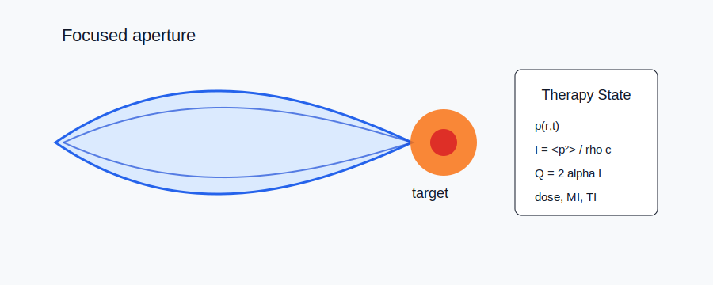

# Ultrasound Therapy



## Scope

Therapy chapters cover HIFU heating, histotripsy, cavitation-mediated effects, neuromodulation, and focused-ultrasound microbubble delivery. Code ownership currently maps to `kwavers::clinical::therapy`, `kwavers::physics::acoustics::therapy`, `kwavers::physics::acoustics::bubble_dynamics`, and acoustic propagation solvers.

## Theorem: Intensity-Temperature Coupling

For a homogeneous medium with density `rho`, heat capacity `c_p`, thermal conductivity `k`, absorption `alpha`, and time-averaged acoustic intensity `I`, the local bioheat source term is

```text
Q = 2 alpha I.
```

The temperature satisfies the Pennes-type balance

```text
rho c_p dT/dt = div(k grad T) + Q - omega_b c_b (T - T_b).
```

### Proof Sketch

Acoustic pressure amplitude decays as `p(x) = p0 exp(-alpha x)`, so intensity decays as `I(x) = I0 exp(-2 alpha x)`. Conservation of energy gives deposited power density `-dI/dx = 2 alpha I`. Substitution into the heat equation yields the source term.

## Algorithm: Therapy Validation Loop

1. Compute the acoustic field with FDTD, PSTD, or a validated analytical transducer model.
2. Convert pressure to intensity using the local impedance where the plane-wave assumption is valid, or integrate particle velocity when available.
3. Couple intensity to thermal or cavitation state equations.
4. Validate dose, peak negative pressure, MI, TI, and spatial deposition against analytical references or published benchmarks.

## Implementation Targets

- Remove remaining therapy paths that use Gaussian or uniform-field shortcuts when grid-based fields are available.
- Route cavitation, thermal dose, and sonogenetic actuation through shared acoustic intensity and ARF helpers.
- Add chapter-linked examples that emit figures from real solver outputs.

## Recent Research Anchors

- Focused ultrasound with microbubbles is actively reviewed for CNS therapeutic delivery: https://doi.org/10.1016/bs.acr.2024.06.003
- BBB opening and focused-ultrasound drug delivery remain active translation topics: https://doi.org/10.1016/j.jconrel.2024.07.006
- Transcranial focused ultrasound neuromodulation has recent clinical-translation review coverage: https://doi.org/10.1186/s12984-025-01753-2
