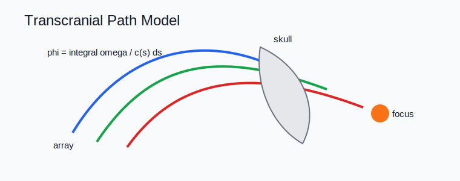

# Transcranial Ultrasound



## Scope

Transcranial chapters cover skull CT conversion, aberration correction, phase screens, attenuation, treatment planning, neuromodulation, BBB opening, and transcranial photoacoustics. Code ownership maps to `kwavers::physics::acoustics::skull`, `kwavers::physics::acoustics::transcranial`, RITK-backed DICOM loading, and therapy planning modules.

## Theorem: Phase Delay Through a Heterogeneous Skull Path

For path coordinate `s`, angular frequency `omega`, and sound speed `c(s)`, the accumulated phase is

```text
phi = integral omega / c(s) ds.
```

### Proof Sketch

The local wavenumber is `k(s) = omega / c(s)`. Phase is the line integral of local wavenumber along the propagation path.

## Algorithm: Transcranial Validation

1. Load skull geometry and material maps with DICOM/CT provenance.
2. Compute phase, attenuation, and transmission corrections.
3. Validate corrected focus position, peak pressure, sidelobe level, and safety metrics.
4. Compare against k-Wave or measured hydrophone data where available.

## Implementation Targets

- Keep CT conversion, phase-screen calculation, and solver propagation as separate modules.
- Report skull transmission correction with MI/TI and pulse parameters.
- Validate registration when image-guided therapy uses CT or MRI coordinates.

## Research Anchors

- Transcranial ultrasound neuromodulation systematic review: https://doi.org/10.1016/j.brs.2024.06.005
- Transcranial focused ultrasound clinical translation review: https://doi.org/10.1186/s12984-025-01753-2
