# Chapter 26 - Transcranial UST Brain Imaging

> **Prerequisite:** Chapter 15 (Transcranial Ultrasound), Chapter 18
> (Inverse Problems and PINNs), Chapter 24 (Transcranial HIFU and BBB
> Treatment Planning), and Chapter 25 (Neuromodulation).

---

## 26.1 Scope

This chapter adds a reproducible, CT-derived seismic-imaging workflow for
transcranial brain sound-speed reconstruction.  It follows the published
brain-FWI study reported by UCL and npj Digital Medicine:

- UCL news summary:
  <https://www.ucl.ac.uk/news/2020/mar/seismic-imaging-technology-could-deliver-detailed-images-brain>
- Guasch et al. 2020, npj Digital Medicine:
  <https://www.nature.com/articles/s41746-020-0240-8>
- 2024 transcranial-ultrasound FWI attenuation study:
  <https://pubmed.ncbi.nlm.nih.gov/40039691/>
- 2025 polar-coordinate structural-prior INR-FWI study:
  <https://papers.miccai.org/miccai-2025/0662-Paper2163.html>
- Protopapa and Cueto 2021, frequency-adaptive brain FWI:
  <https://arxiv.org/abs/2111.04700>
- Recent ultrasound-CT FWI work using source/frequency encoding and
  regularized multiscale inversion:
  <https://pubmed.ncbi.nlm.nih.gov/40197542/>
  <https://cpb.iphy.ac.cn/EN/article/downloadArticleFile.do?attachType=PDF&id=127579>
- 2024-2025 histotripsy monitoring work showing lesion visibility from
  Nakagami/B-mode features and cavitation-emission features:
  <https://www.sciencedirect.com/science/article/pii/S1350417724002505>
  <https://pubmed.ncbi.nlm.nih.gov/40015999/>
- 2025 comparison of TFM, RTM, and FWI for ultrasonic defect imaging:
  <https://arxiv.org/abs/2412.07347>
- 2025 pressure-modulated shockwave histotripsy lesion-control study:
  <https://www.nature.com/articles/s41598-025-11512-x>
- 2025 passive-cavitation mapping with higher-order correlation beamforming:
  <https://www.sciencedirect.com/science/article/pii/S0041624X25000903>
- 2026 sparse-aperture 3-D passive acoustic mapping:
  <https://www.nature.com/articles/s41598-026-42764-w>

The published study used a 1024-element hemispherical ultrasound acquisition
with unfocused source/receiver positions and adapted seismic full-waveform
inversion to recover
brain acoustic properties through the skull.  The in-repository chapter
implements a bounded reproduction of that acquisition contract with the same
1024-element count used elsewhere in kwavers for hemispherical focused-bowl
transcranial arrays.

The executable chapter script is:

`crates/kwavers-python/examples/book/ch27_transcranial_ust_brain_imaging.py`

The production implementation is not in the plotting script.  The computation is
owned by:

- `kwavers_diagnostics::reconstruction::transcranial_ust`
- `pykwavers.run_transcranial_ust_volume_inversion_from_ritk_ct`
- `ritk-io` for CT NIfTI ingestion

No SciPy, nibabel, or pydicom dependency is required for this chapter path.

---

## 26.2 Formal contract

Inputs:

- Head CT volume readable by `ritk-io`.
- CT voxel spacing from the RITK image metadata.
- Hemispherical focused-bowl element count `N = 1024`.
- Encoded finite-frequency transmit/receive channels over the 1024-element
  hemispherical cap.
- Iteration schedule for the reconstruction optimizer.

Outputs:

- Resampled CT volume in HU.
- Skull mask, brain inversion mask, and CT-derived acoustic speed target volume.
- Initial model with frozen skull and homogeneous brain speed.
- Encoded synthetic data generated from the finite-frequency sensitivity model.
- Single-pass adjoint migration volume reconstructed from the same simulated data.
- Optimized reconstructed brain sound-speed volume.
- Structure-enhanced display image derived from the optimized FWI reconstruction.
- Nonlinear second-harmonic encoded channels from a weak-Westervelt model.
- Multi-slice stack of CT HU, CT-derived acoustic target, regularized FWI
  reconstruction, and error images sliced from the reconstructed 3-D array.
- Centroid-cropped reconstruction stack over the central brain region for
  deep midline inspection from pons-level through thalamus-level slices.
- Objective history and visibility metrics.

**Theorem 26.1 (Born Linearity).** Let the true sound-speed field be
`c(x) = c₀ + δc(x)` with relative contrast `m(x) = δc(x)/c₀`.  Under the
single-scattering (first Born) approximation `|m(x)| ≪ 1`, every multiply
scattered wave is O(m²) and is dropped.  The scattered pressure at receiver `r`
from source `s` at frequency `f` satisfies

$$
p_s(s,r,f) = \int_V G(r,x,f)\,\delta c(x)\,G(x,s,f)\,dV(x)
= \sum_{x\in V_{\mathrm{active}}} A_{srfx}\,m(x) + O(m^2),
$$

where `G(a,b,f)` is the background Green's function evaluated along the path
`a→b` at frequency `f`.  The operator `A: ℝⁿ → ℝᵍ` is linear in `m`; the
forward model `d = Am` is therefore linear.  For regularization coefficient
`λ > 0` the normal equations `(AᵀA + λI)m = Aᵀd` are strictly positive-definite
and have a unique minimizer.

*Proof sketch.* Each row `A_{srfx}` is determined entirely by background Green's
function evaluations (source and receiver path lengths, attenuation, and wave
number); it does not depend on `m(x)`.  Linearity of `d = Am` follows from
linearity of row summation.  Strict positive definiteness of `AᵀA + λI` follows
because `λ > 0` lower-bounds every eigenvalue, regardless of the rank of `A`.
The unique minimizer is the global minimum of the convex quadratic `J`. □

**Scope limitation.** The Born approximation is valid when `|δc/c₀| ≲ 0.03`
and `k|m|L ≲ 1`, where `L` is the scatterer diameter.  For skull bone
(`c_skull ≈ 2900 m/s`, contrast ≈ 0.88) this condition fails; the skull is
therefore excluded from the inversion domain and held fixed at its CT-derived
value.  Soft-tissue brain contrast (`|δc/c₀| ≲ 0.02`) remains within the Born
regime for the carrier frequencies used here.

The inverse problem minimizes:

$$
J(m)=\frac{1}{2}\|A m-d\|_2^2+\frac{\lambda}{2}\|m\|_2^2
+\gamma\sum_{(i,j)\in E}\left(\sqrt{(m_i-m_j)^2+\epsilon^2}-\epsilon\right),
\qquad
m(x)=\frac{c(x)-c_0}{c_0}.
$$

Here `A` is a finite-frequency Born sensitivity matrix assembled from the
source, receiver, and frequency schedule; `d` is generated from the CT-derived
target contrast; `c0 = 1540 m/s`; `E` is the active-mask 6-neighbor voxel edge
set; and the skull model is CT-derived and frozen.  The last term is a
Charbonnier edge-preserving first-difference penalty.  It is a differentiable
TV-style prior and uses no CT target values during inversion.

Acceptance criteria:

$$
J_{\mathrm{final}} < J_{\mathrm{initial}},
\qquad
\frac{J_{\mathrm{initial}}-J_{\mathrm{final}}}{J_{\mathrm{initial}}} \ge 0.50,
$$

$$
\frac{\Delta c_{\mathrm{recon,p95-p5}}}
{\Delta c_{\mathrm{target,p95-p5}}} \ge 0.35.
$$

These criteria define a visible reconstruction for the chapter artifact.  They
do not define diagnostic accuracy or clinical adequacy.

Reject the run when CT loading bypasses RITK, when fewer than 1024 elements are
used for the chapter default, when the output image is independent of CT values,
or when the reconstruction fails the objective and contrast criteria.

---

## 26.3 Acquisition model

The chapter now solves one coupled 3-D inverse problem and slices the returned
volume for display.  The acquisition geometry is not a ring.  The 1024 elements
are placed on a deterministic equal-area hemispherical cap with radius
`0.11 m`. Receiver offsets are interpreted as azimuthal rotations on the cap
and mapped to the nearest physical element.  The default frequency set is:

$$
f \in \{200, 350, 500, 650, 800\}\ \mathrm{kHz}.
$$

The default receiver-offset set is:

$$
\Delta r \in \{512,384,640,256,768,128,448,576\}.
$$

For 3-D source `s`, receiver `r`, frequency `f`, harmonic order `h`, and active
volume voxel `x = (x,y,z)`, the row of the encoded matrix-free sensitivity
operator is:

$$
A_{srfhx}
=
\Delta V
\frac{
\exp(-h f_{\mathrm{MHz}}\alpha(x)(|x-s|+|x-r|))
H_h(x)\cos(h k_f(|x-s|+|x-r|))}
{\sqrt{|x-s||x-r|}},
\qquad
k_f=\frac{2\pi f}{c_0}.
$$

`H1 = 1`.  The optional nonlinear channel uses `h = 2` with weak-Westervelt
second-harmonic scaling:

$$
H_2(x)=\frac{1}{4}\frac{|x-s|+|x-r|}{x_s},
\qquad
x_s=\frac{\rho_0 c_0^3}{\beta\omega p_0}.
$$

Here `xs` is the pre-shock formation distance, `beta = 1 + B/(2A)`, and `p0`
is the configured source pressure.  This is a bounded second-order nonlinear
encoding model: it adds harmonic information without claiming to be a full
time-domain Westervelt solve.

The CT-derived attenuation path integral is:

$$
\Gamma(a,b)=\int_{a}^{b}\alpha_{\mathrm{CT}}(q)\,dq,
$$

where `alpha_CT` is in `Np/m/MHz`.  The bounded model uses
`0.5 dB/cm/MHz` converted to `Np/m/MHz` for soft tissue and blends toward
`70 Np/m/MHz` through the same skull bone-volume fraction used for sound speed.
The 3-D operator uses the active voxel's CT-derived attenuation as a local path
attenuation factor.  This is still model-consistent synthetic data, not a
measured attenuation calibration.

Each row is normalized before inversion.  This keeps the optimizer scale
defined by encoded channel geometry rather than by arbitrary source amplitude.

---

## 26.4 CT-to-acoustic model

The RITK-loaded CT tensor is transposed from `[z,y,x]` to `[x,y,z]` before
resampling.  The non-air head support is cropped and resampled onto an isotropic
cubic FWI grid.  Skull speed follows a bone-volume-fraction mapping:

$$
\phi(\mathrm{HU})=\mathrm{clamp}(\mathrm{HU}/1000,0,1),
$$

$$
c_{\mathrm{skull}}(\mathrm{HU})
=1500(1-\phi)+2900\phi\ \mathrm{m/s}.
$$

Soft-tissue speed is mapped from CT HU into the brain range used by the
transcranial examples.  The same CT grid also produces the attenuation map used
by the acquisition model.  The skull remains fixed during inversion; only voxels
in the CT-derived central brain mask are updated.

### 26.4.1 Guidance-free skull-template alignment (MOFI)

Freezing the CT skull presumes it is correctly *aligned* to the patient. In a
clinical session the CT and the ultrasound cap are acquired separately, so the
skull template carries a rigid pose error. The classical remedy registers the CT
to a concurrent MRI guidance image; MOFI (manifold optimisation for FWI; Bates et
al. 2026) removes that requirement by aligning the template using **only the
acoustic data**. It minimises the FWI misfit over a low-dimensional rigid SE(2)
reparametrisation of the template, $\varphi=\{\theta,\delta_1,\delta_2\}$, with the
chained gradient $\partial J/\partial\varphi=(\partial c_\varphi/\partial\varphi)^\top\,\partial J/\partial c$
evaluated on the exact self-adjoint gradient (Inverse-Problems chapter §18.2.5). The
shipped pipeline (`inverse::fwi::time_domain::mofi`, ADR 017/018) composes a
Wasserstein global pose search, a Wasserstein→envelope→L2 misfit homotopy
(cycle-skipping-robust at large pose error), a block-coordinate sound-speed
calibration that corrects the CT→speed mapping, and an optional cubic-B-spline
free-form deformation for residual non-rigid mismatch. In silico it recovers a
known pose to $<1°$ / $<1$ mm. Once the template is aligned and calibrated, the
frozen-skull brain inversion below proceeds as described.

The frozen-skull brain inversion can be further regularised with a **Plug-and-Play
(PnP) prior** borrowed from medical-imaging reconstruction. Compressed-sensing MRI
(Lustig et al. 2007) and model-based iterative CT (MBIR) reconstruct by alternating
a data-fidelity step with an edge-preserving **denoiser** applied to the image
estimate; the PnP framework (Venkatakrishnan et al. 2013) makes any such denoiser a
drop-in proximal operator. Here the denoiser is the ROF total-variation proximal map
solved by Chambolle's dual algorithm (`kwavers_math::inverse_problems::tv_denoise_chambolle`),
alternated with short masked-FWI bursts and applied only to the updatable brain
(the known skull is frozen and excluded from the difference stencils). As Figure
26.12 shows, this removes high-frequency streak/checkerboard artefacts while
preserving the lesion boundary, but it cannot remove the **coherent**
limited-aperture artefacts that dominate the through-skull residual — priors
complement, rather than replace, better data and misfits.

The PnP prior is the *image-domain* half of MBIR; low-dose CT also teaches a
*data-domain* lesson. Model-based iterative CT does not minimise an unweighted
least-squares data misfit — it minimises a **penalized weighted least squares
(PWLS)** objective `J = ½ (d − f(c))ᵀ W (d − f(c)) + β R(c)` with `W = diag(1/σ_i²)`,
so that low-photon rays through dense bone — which are noise-dominated — are
*down-weighted* instead of corrupting the reconstruction with equal authority
(Sauer & Bouman 1993; Thibault et al. 2007). The transcranial ultrasound analogue
is exact: traces that traverse the skull are strongly attenuated and noise-dominated,
yet the default unweighted L2 FWI misfit lets every trace drive the gradient
equally. Weighting each trace by its inverse noise variance is the maximum-likelihood
estimator under heteroscedastic Gaussian noise (the Gauss–Markov / BLUE result).
kwavers implements this as `FwiProcessor::with_data_weighting(DataWeighting::
InverseNoiseVariance { noise_window })`, estimating each trace's noise level from a
quiet pre-first-arrival window (there is no closed-form photon-count variance as in
CT). A differential test (`pwls_robustness`) confirms that when a minority of
channels is much noisier — faulty, poorly-coupled, or skull-shadowed elements — the
PWLS reconstruction recovers the lesion contrast more accurately than the
equally-weighted L2 reconstruction. The trade-off mirrors CT's: down-weighting
noisy channels reduces effective aperture, so PWLS protects the
quantity-of-interest where there is *redundant* coverage (thousands of CT rays;
large clinical FWI arrays) but is not a free lunch on a sparse aperture.

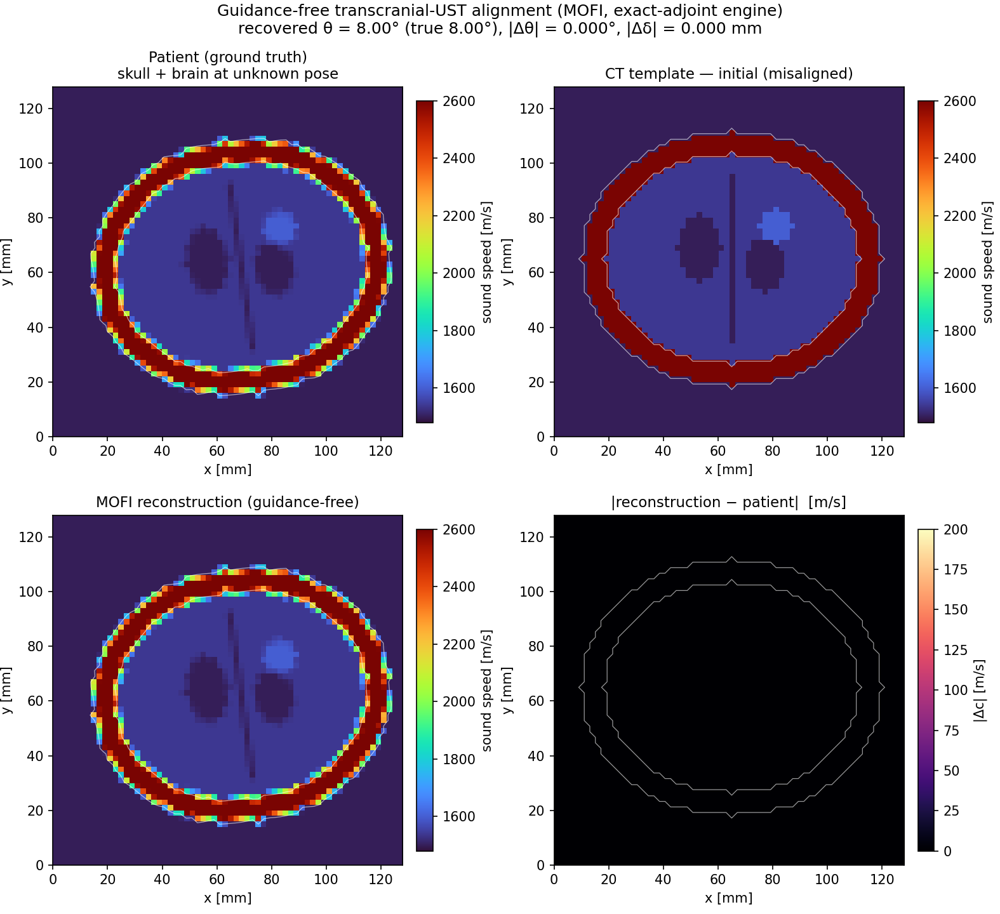

*Figure 26.11. MOFI pose **identifiability/registration** verification (§26.4.1) —
not a brain reconstruction. A 2-D head phantom (skull annulus 2600 m/s, brain
1540 m/s with ventricles, falx, lesion) is placed at an unknown rigid pose
(top-left); from the upright CT template (top-right) MOFI recovers the pose with a
Wasserstein→envelope→L2 homotopy on the exact self-adjoint gradient
(bottom-left), error map bottom-right. **Honesty note:** this is an idealised
self-consistency test (an "inverse crime") — the data are generated by the same
solver, grid, and template the inversion fits, and no noise is added, so a pose
exists that drives the misfit to round-off ($8.9\times10^{-3}\!\to\!10^{-19}$;
$\theta$ to $<0.01°$). It demonstrates that the rigid pose is **identifiable from
acoustic data and that the exact-adjoint optimiser finds it** — the brain
interior is taken from the template, not reconstructed. For a genuine
brain-tissue reconstruction (unknown anomaly recovered from noisy data) see
Figure 26.12.*

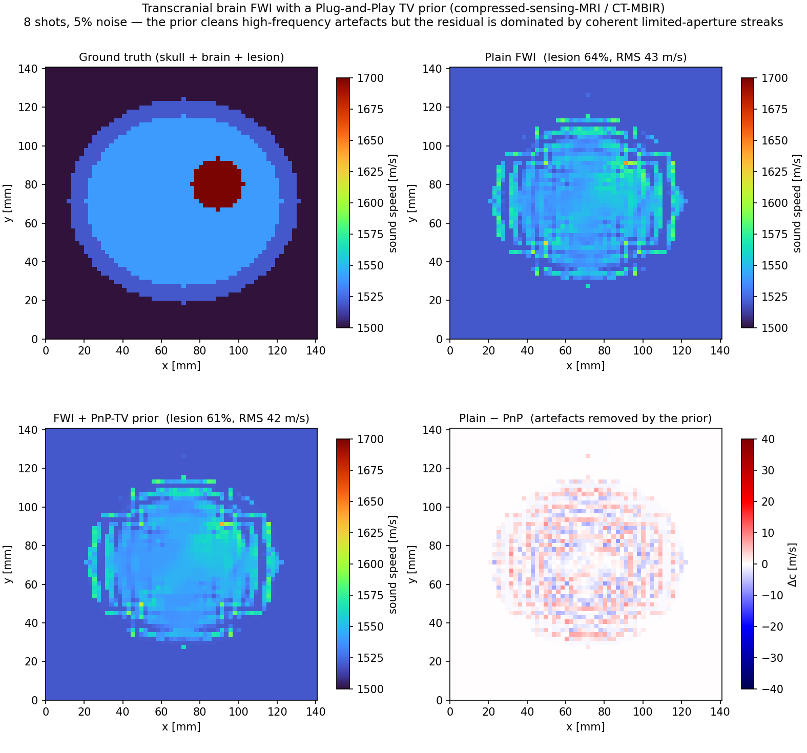

*Figure 26.12. **Genuine** transcranial brain-FWI reconstruction (contrast with
the idealised Figure 26.11), generated by the Rust example
`transcranial_brain_fwi` and rendered by `ch26_brain_fwi_reconstruction.py`. The
skull (frozen to its known value) surrounds a homogeneous brain into which an
unknown +160 m/s lesion is embedded (top-left). Starting from the homogeneous
brain, pixel-wise masked FWI (`invert_multi_source_masked`, exact self-adjoint
gradient, 8 shots, 5 % additive noise) recovers the lesion at the correct
location but **only partially** — ≈64 % of its sound-speed contrast, RMS
≈43 m/s over the brain, with realistic limited-aperture streak artefacts
(top-right). The bottom-left panel adds a **Plug-and-Play (PnP) total-variation
prior** — the canonical compressed-sensing-MRI / CT model-based iterative
reconstruction regulariser (Lustig 2007; Venkatakrishnan 2013), here
`kwavers_math::inverse_problems::tv_denoise_chambolle` — alternated with short
masked-FWI bursts (7 bursts of 4 iterations, ROF weight 0.4). The
prior–minus–plain difference (bottom-right) shows the PnP step removing
**high-frequency** streak/checkerboard structure while preserving the lesion
edge, but the net metric change is small (lesion ≈61 %, RMS ≈42 m/s): the
residual is dominated by **coherent** limited-aperture artefacts that a
denoising prior cannot remove. This is the honest behaviour of an ill-posed,
limited-aperture, through-skull inversion — unlike the registration of Figure
26.11 the misfit does **not** collapse to round-off, and full recovery would
require lower-frequency data, more shots, multiscale continuation, and
crime-free (cross-grid) data. The brain structure here is genuinely
reconstructed from data, not copied from a template. The instructive conclusion:
priors **complement** but do not **replace** better data and misfits in
transcranial FWI.*

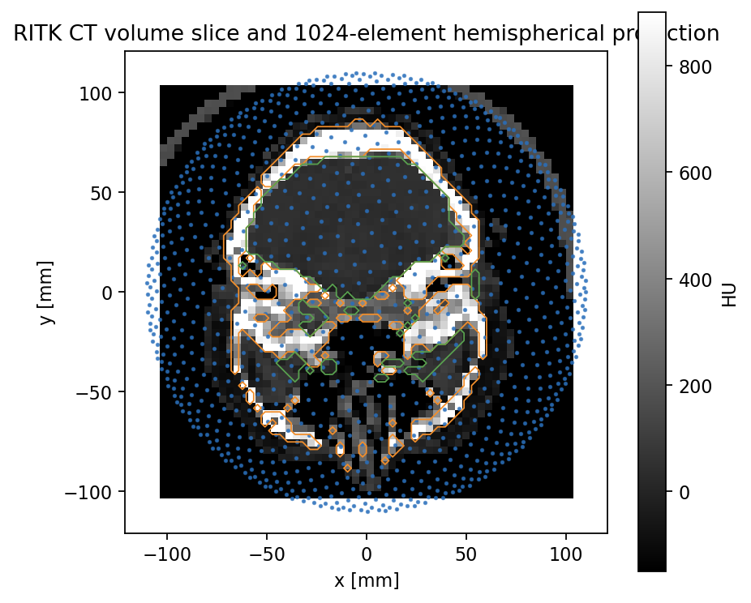

*Figure 26.1. CT-derived acquisition geometry (§26.3): the resampled head CT and the 1024-element hemispherical source/receiver cap.*

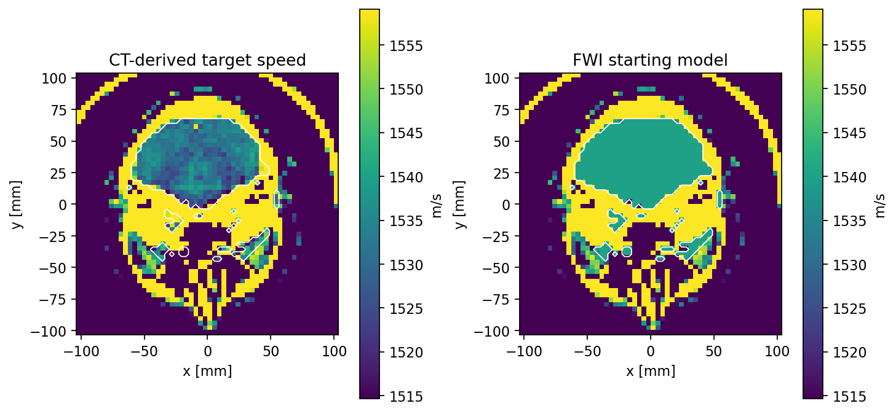

*Figure 26.2. CT-to-acoustic mapping (§26.4): the bone-volume-fraction skull speed $c_\mathrm{skull}(\mathrm{HU})$, brain sound-speed target, and attenuation map with the frozen skull / updatable brain masks.*

---

## 26.5 Optimization

The first reconstruction is a migration image:

$$
m_{\mathrm{mig}}
=
\mathrm{clip}\left(
(\mathrm{diag}(A^T A)+\lambda I)^{-1}A^T d,
m_{\min},m_{\max}
\right).
$$

It is the diagonal-normalized adjoint of the simulated ultrasound data.  This
image is not the final FWI result; it is the explicit simulated-data
reconstruction baseline used to verify that the encoded source/receiver data
contain spatial brain-speed contrast before iterative inversion.

The optimizer solves the regularized normal equations with a projected,
diagonal-preconditioned conjugate-gradient iteration:

$$
H=A^T A+\lambda I,\qquad b=A^T d,\qquad r_k=b-Hm_k,
$$

with preconditioner:

$$
z_k=(\mathrm{diag}(A^T A)+\lambda I)^{-1}r_k.
$$

Each step applies the matrix-free normal operator to the Krylov direction and
accepts the clipped update only when the composite stage objective is
non-increasing.  Row-normalization factors and per-row source/receiver/frequency
constants are computed once per acquisition row and reused across data
generation, migration, objective evaluation, and Krylov updates.  The optimizer
uses low-to-high frequency continuation and a Sobolev-smoothed preconditioned
residual before the full-band pass.  At each continuation-stage boundary, a
mask-local edge-preserving proximal projection is accepted only when the
full-band composite objective decreases.  This follows current ultrasound-FWI
practice: multiscale low-frequency information reduces cycle skipping,
regularized gradients stabilize updates, and edge-preserving priors suppress
checkerboard artifacts without imposing the CT target.  The
chapter script repeats the run over an iteration schedule and keeps the first
run that satisfies the visible-reconstruction contract.

For a time-domain, gradient-based refinement (rather than the frequency-domain
linear-Born normal equations above), the exact self-adjoint engine
(`FwiEngine::SecondOrderSelfAdjoint`; Inverse-Problems chapter §18.2.5) supplies a
machine-accurate $\partial J/\partial c$ ($\kappa\approx 1$), which is required
when the absolute gradient magnitude is used — Gauss–Newton, fixed-step updates,
or the MOFI pose/calibration chained gradient of §26.4.1. The default FDTD/PSTD
adjoint gives only a correct descent direction (line-search-absorbed) and is
adequate for the steepest-descent and L-BFGS drivers.

The returned enhanced volume and the Figure 06 regularized FWI row are display
products, not second physical estimates.  The Figure 06 display applies
mask-aware diffusion plus clipped residual detail to the accepted FWI
sound-speed field so checkerboard artifacts do not dominate the sliced book
figure.  It uses only the FWI reconstruction and brain mask; metrics remain tied
to the physical FWI reconstruction.

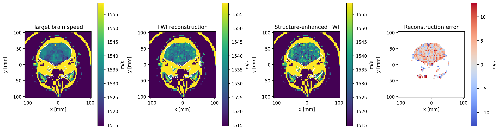

*Figure 26.3. Born-FWI brain sound-speed reconstruction (§26.5) against the CT-derived target over the active brain mask.*

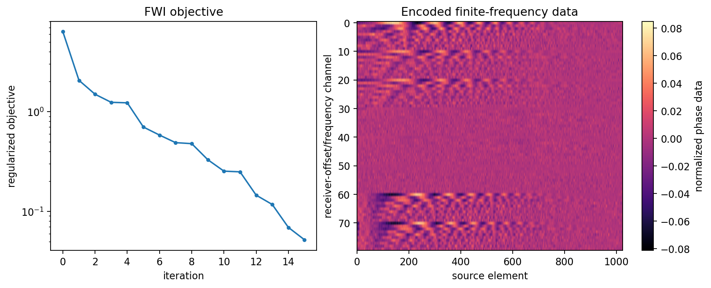

*Figure 26.4. Optimization diagnostics (§26.5): the multiscale objective history and the encoded finite-frequency data used by the inversion.*

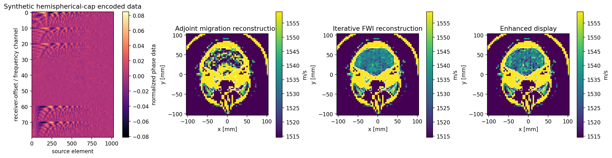

*Figure 26.5. Adjoint-migration baseline (§26.5): the diagonal-normalized $A^\mathrm{T}d$ image that verifies spatial brain-speed contrast before iterative FWI.*

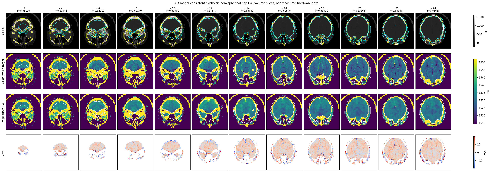

*Figure 26.6. Multi-slice stack (§26.5): CT HU, CT-derived acoustic target, regularized FWI reconstruction, and error across thirteen planes of the reconstructed 3-D volume.*

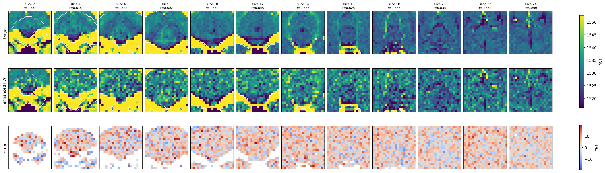

*Figure 26.7. Centroid ROI (§26.5): deep-midline crop around the CT brain-mask centroid as a pons-through-thalamus coverage proxy (not an anatomical segmentation).*

---

## 26.6 Nonlinear and therapy-monitoring variants

| Variant | Data stream | Inverted quantity | Histotripsy role | Implemented here |
| --- | --- | --- | --- | --- |
| RTM / migration | Active or passive | Reflector or emission image | Fast localization and QC | Active migration baseline |
| Linear acoustic FWI | Active inter-burst | `c`, optionally `rho` | Post-packet lesion-property update | Brain speed FWI |
| Multiparameter attenuation FWI | Active inter-burst | `c`, `rho`, `alpha` | Amplitude/attenuation lesion contrast | Attenuation in forward rows |
| Tissue-harmonic FWI | Active inter-burst harmonic bands | `c`, `alpha`, `beta` | Nonlinear contrast at `2f0` | Weak second-harmonic row model |
| Passive cavitation source inversion | Passive intra-burst | `q_cav(x,t)` | Real-time bubble-cloud tracking | Subharmonic source FWI in custom simulator |
| Bubble-dynamics nonlinear FWI | Passive and active | Bubble state plus acoustic fields | Sub/ultraharmonic histotripsy feedback | Emission-band diagnostics; bubble state pending |
| Elastic/shear FWI | Post-burst mechanical wave data | `mu` (`lambda`, `rho` fixed) | Lesion stiffness confirmation | Implemented (μ-only, 2-D): `kwavers_solver::inverse::elastography::elastic_fwi::ElasticFwi` — adjoint-state FWI over the `swe::ElasticWaveSolver` forward model with the `K_μ` strain-cross-correlation kernel (ADR 033). Joint `λ`/`ρ` and 3-D deferred |

Therapy monitoring must separate active inter-burst transmissions from passive
cavitation emissions during therapy bursts.  The current implementation covers
active migration, acoustic FWI, attenuation-weighted rows, weak
second-harmonic rows, passive multiband RTM, and subharmonic cavitation-source
FWI. The histotripsy simulator now adds deterministic receiver noise,
gain/phase jitter, low-to-high frequency continuation, Huber IRLS weighting,
multiparameter speed/attenuation inversion, and a weak nonlinear harmonic
`beta` branch. Bubble-state FWI should be added as a separate
therapy-monitoring orchestrator over existing Chapter 14, 22, 24, and 26
components.

The custom executable monitoring simulation is:

`crates/kwavers-python/examples/book/ch27_histotripsy_fwi_rtm.py`

It uses the RITK-backed Chapter 26 CT baseline, all 1024 receiver elements,
active continuation stages (`110 kHz`, `160 kHz`, `220 kHz`) ending at the
`220 kHz` therapy-monitoring carrier, passive cavitation diagnostics
(`110 kHz`, `220 kHz`, `440 kHz`), and three synthetic lesion states: compact
intrinsic-threshold, shock-elongated, and multi-packet. Reconstruction now
reports normal FWI, multiparameter speed/attenuation FWI, weak nonlinear
harmonic FWI, passive multiband RTM, subharmonic cavitation-source FWI from the
`110 kHz` row, and frequency-gated fusion. The fusion treats the subharmonic
image as cavitation support rather than as a boundary-resolution measurement.

---

## 26.7 Minimal usage example

The PyO3 binding exposes the full pipeline via a single call.  No NumPy,
SciPy, nibabel, or pydicom dependency is required on the Python side.

```python
import pykwavers

# Load CT, build acoustic model, run Born FWI, return reconstructed volume.
result = pykwavers.run_transcranial_ust_volume_inversion_from_ritk_ct(
    ct_nifti_path="data/rire_patient_109/patient_109_ct.nii.gz",
    element_count=1024,
    frequencies_hz=[200_000, 350_000, 500_000, 650_000, 800_000],
    receiver_offsets=[512, 384, 640, 256, 768, 128, 448, 576],
    grid_size=56,
    iterations=12,
    regularization=1e-3,
    source_pressure_mpa=0.15,
    nonlinear_beta=4.5,
    attenuation_model=True,
    nonlinear_harmonic_model=True,
    edge_preserving_weight=1e-4,
    edge_preserving_epsilon=4e-3,
    edge_preserving_step=0.12,
    edge_preserving_iterations=1,
)

# result["reconstruction_m_s"]  — 3-D f64 array, shape (Nx, Ny, Nz), m/s
# result["target_m_s"]          — CT-derived ground-truth sound speed
# result["brain_mask"]          — bool array, inversion domain
# result["skull_mask"]          — bool array, fixed CT-derived skull
# result["metrics"]["pearson"]        — Pearson r vs CT target (active voxels)
# result["metrics"]["normalized_rmse"]
# result["metrics"]["objective_reduction_fraction"]
# result["metrics"]["active_voxels"]
# result["metrics"]["measurements"]
# result["metrics"]["continuation_stages"]

# Same-device theranostic: pass the same result dict to the therapy pipeline.
therapy = pykwavers.run_theranostic_nonlinear_3d_from_ritk(
    ct_nifti_path="data/rire_patient_109/patient_109_ct.nii.gz",
    anatomy="brain",
    element_count=1024,
    source_pressure_pa=150_000,
    target_fraction_xyz=[0.5926, 0.5, 0.4889],
    skull_hu_threshold=300.0,
    body_hu_threshold=-350.0,
)
# therapy["inverse_results"]["fusion"]["pearson"] — same-aperture fusion metric
```

The `run_transcranial_ust_volume_inversion_from_ritk_ct` call performs all
computation in Rust: CT ingest via RITK, acoustic model assembly, Born
sensitivity matrix construction, adjoint migration, and the regularized
PCG iteration.  The 1024-element hemispherical focused-bowl geometry satisfies
the same-device aperture contract (§28.2): every element index used as a
transmitter also appears as a receiver.

## 26.8 Reproducible figures

Run:

```powershell
python crates/kwavers-python/examples/book/ch27_transcranial_ust_brain_imaging.py
```

The script writes:

- `docs/book/figures/ch27/fig01_ct_geometry.{pdf,png}`
- `docs/book/figures/ch27/fig02_acoustic_model.{pdf,png}`
- `docs/book/figures/ch27/fig03_brain_reconstruction.{pdf,png}`
- `docs/book/figures/ch27/fig04_optimization_and_data.{pdf,png}`
- `docs/book/figures/ch27/fig05_simulated_ultrasound_reconstruction.{pdf,png}`
- `docs/book/figures/ch27/fig06_multislice_reconstruction_stack.{pdf,png}`
- `docs/book/figures/ch27/fig07_centroid_pons_thalamus_roi.{pdf,png}`
- `docs/book/figures/ch27/metrics.json`
- `docs/book/figures/ch27/fig08_histotripsy_custom_reconstruction_scenarios.{pdf,png}`
- `docs/book/figures/ch27/fig09_histotripsy_reconstruction_metrics.{pdf,png}`
- `docs/book/figures/ch27/fig10_histotripsy_passive_band_rtm.{pdf,png}`
- `docs/book/figures/ch27/histotripsy_monitoring_metrics.json`

The default CT is:

`data/rire_patient_109/patient_109_ct.nii.gz`

The grid and iteration schedule can be changed without editing the script:

```powershell
$env:KWAVERS_CH27_GRID_SIZE="56"
$env:KWAVERS_CH27_FREQUENCIES_HZ="200000,350000,500000,650000,800000"
$env:KWAVERS_CH27_RECEIVER_OFFSETS="512,384,640,256,768,128,448,576"
$env:KWAVERS_CH27_ITERATIONS="12"
$env:KWAVERS_CH27_STACK_OFFSETS="-8,-6,-4,-2,0,2,4,6,8,10,12,14,16"
$env:KWAVERS_CH27_CENTROID_ROI_HALF_WIDTH_MM="35"
$env:KWAVERS_CH27_ATTENUATION_MODEL="1"
$env:KWAVERS_CH27_NONLINEAR_HARMONIC_MODEL="1"
$env:KWAVERS_CH27_SOURCE_PRESSURE_MPA="0.15"
$env:KWAVERS_CH27_NONLINEAR_BETA="4.5"
$env:KWAVERS_CH27_EDGE_PRESERVING_WEIGHT="0.0001"
$env:KWAVERS_CH27_EDGE_PRESERVING_EPSILON="0.004"
$env:KWAVERS_CH27_EDGE_PRESERVING_STEP="0.12"
$env:KWAVERS_CH27_EDGE_PRESERVING_ITERATIONS="1"
python crates/kwavers-python/examples/book/ch27_transcranial_ust_brain_imaging.py
```

`KWAVERS_CH27_STACK_OFFSETS` is relative to the source index in the resampled
3-D inversion volume.  The default stack is
`-8,-6,-4,-2,0,2,4,6,8,10,12,14,16`, which requests thirteen
planes from the same reconstructed 3-D array and records every nonempty
CT-derived brain slice in `metrics.json`.  The centroid ROI figure crops each
valid slice around the CT-derived brain-mask centroid and skips empty mask
planes.  This is a reproducible
deep-midline proxy for inspecting pons-through-thalamus coverage; it is not an
anatomical segmentation.

Run the custom histotripsy-monitoring simulation separately:

```powershell
python crates/kwavers-python/examples/book/ch27_histotripsy_fwi_rtm.py
```

Its metrics file records equal-area Dice, AUPRC, and contrast-to-noise ratio for
each reconstruction family. The latest generated fusion metrics are:

| Scenario | Fusion Dice | Fusion AUPRC | Fusion CNR |
| --- | ---: | ---: | ---: |
| compact intrinsic | 0.897 | 0.724 | 3.74 |
| shock elongated | 0.826 | 0.802 | 3.90 |
| multi-packet | 0.933 | 0.995 | 3.96 |

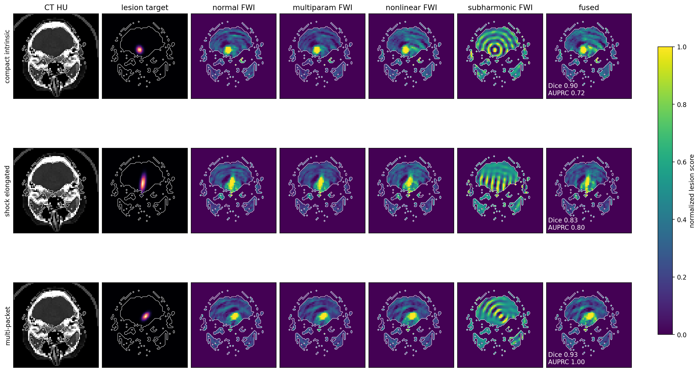

*Figure 26.8. Histotripsy-monitoring reconstructions (§26.6): FWI, multiparameter, weak-harmonic, and fused images for compact, shock-elongated, and multi-packet lesions.*

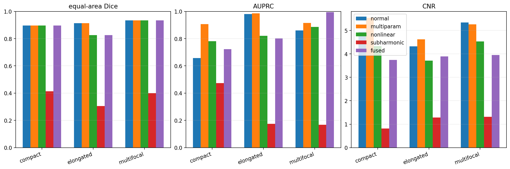

*Figure 26.9. Per-family reconstruction metrics (§26.6): equal-area Dice, AUPRC, and CNR across the reconstruction families.*

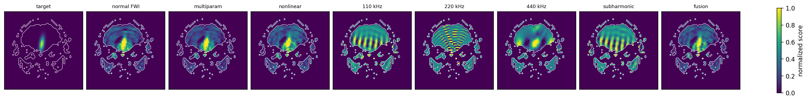

*Figure 26.10. Passive-emission monitoring (§26.6): multiband RTM and the subharmonic cavitation-source FWI image used as cavitation support in the fusion.*

---

## 26.9 Boundary of replication

The published npj Digital Medicine study is a full 3-D time-domain FWI pipeline.
This chapter is a bounded in-repository reproduction of the acquisition and
inversion contract:

- same documented 1024-element hemispherical focused-bowl count;
- CT-derived skull and brain acoustic model;
- finite-frequency source/receiver phase sensitivity;
- weak-Westervelt second-harmonic encoded channels;
- adjoint migration from simulated encoded ultrasound data;
- optimization of a 3-D brain sound-speed volume from simulated bowl-aperture data;
- frequency continuation, Sobolev update conditioning, Charbonnier
  edge-preserving proximal regularization, and separate enhanced display output
  for visual inspection;
- multi-slice visualization by slicing the reconstructed simulated 3-D volume;
- centroid-cropped reconstruction visualization for deep midline slices;
- value-semantic verification in the Rust core.

It is not a substitute for the full clinical-scale time-domain pipeline,
measured transducer calibration, skull attenuation calibration, or patient
diagnostic validation.  The histotripsy-monitoring subchapters define the
selected architecture for the next therapy-tracking increment; active 3-D
migration, active 3-D acoustic FWI, attenuation-weighted rows, and weak
second-harmonic encoded rows are implemented in this chapter today.
