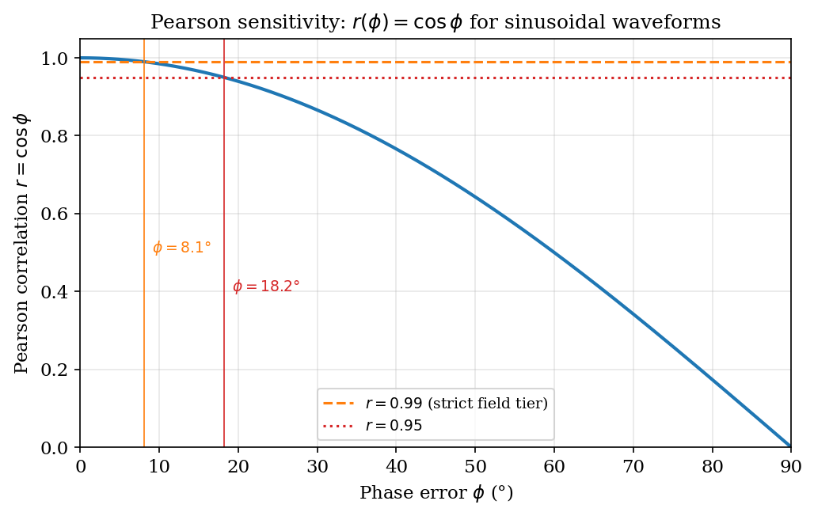
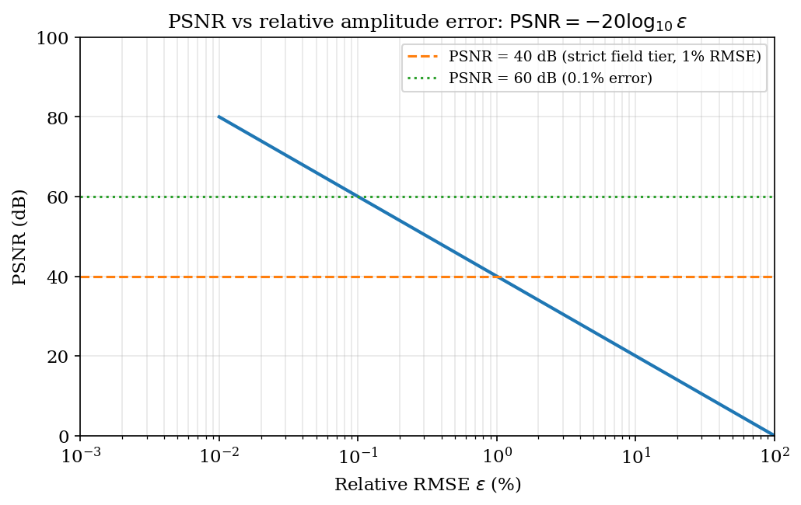
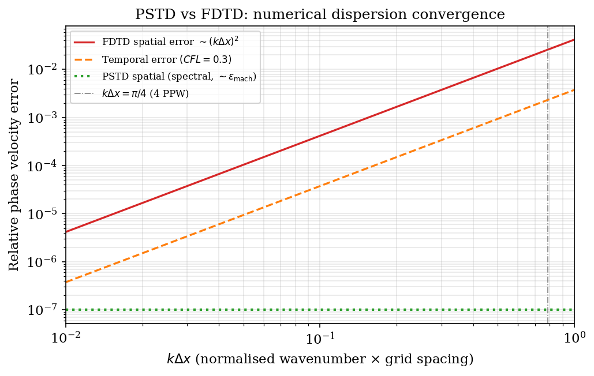
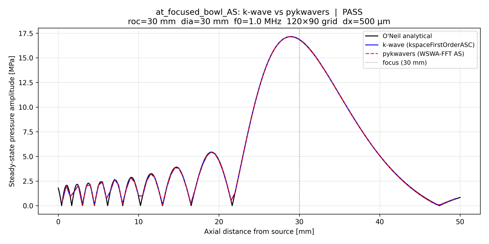
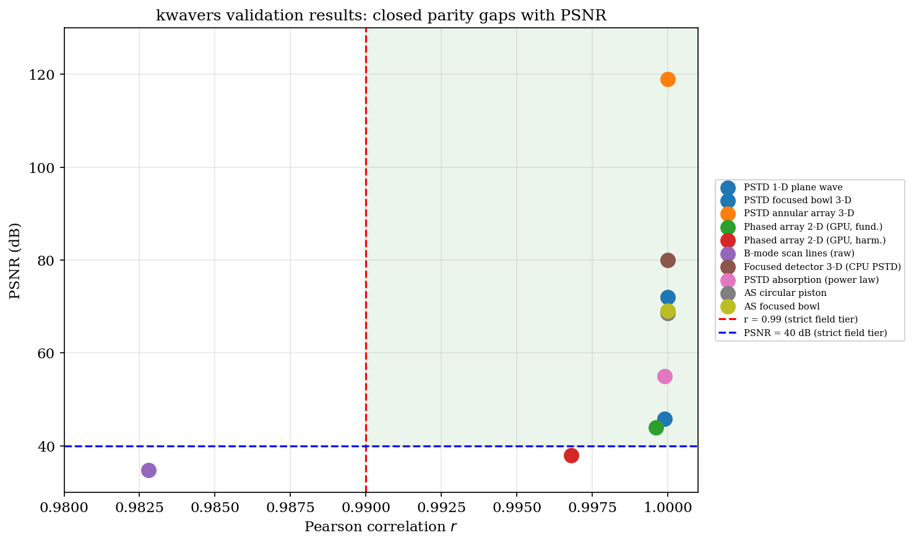

# Chapter 19: Validation and Benchmarking

*Systematic Validation of kwavers Against Analytical Solutions, Reference Simulators, and Experimental Data*

---

## 19.1 Introduction

Validation is the process of determining that a simulation model represents reality within an accepted tolerance. Benchmarking is the process of quantifying that representation numerically. Both are mandatory preconditions for any clinical or research use of a simulation library.

kwavers follows a three-tier validation hierarchy, in ascending order of inferential strength:

1. **Analytical validation.** Compare simulation output against closed-form solutions derived from first principles (plane waves, focused fields in homogeneous media, Green's functions). Errors here indicate solver defects unambiguously attributable to numerics.

2. **Reference simulation parity.** Compare against k-Wave MATLAB (Treeby & Cox 2010), k-wave-python (Jaros 2016), and k-Wave-Julia for identical problem setups. Agreement confirms numerical equivalence of the PSTD discretization; disagreement locates grid-origin offsets, axis-ordering mismatches, or coordinate-convention differences.

3. **Experimental validation.** Compare against hydrophone scan data from physical transducer setups. Agreement here validates both the numerical model and the physical parameter identification pipeline.

**Acceptance criteria** (applied at all tiers):

| Metric              | Minimum acceptance threshold | Strong acceptance threshold |
|---------------------|------------------------------|-----------------------------|
| Pearson *r*         | ≥ 0.95                       | ≥ 0.99                      |
| PSNR                | ≥ 30 dB                      | ≥ 40 dB                     |
| RMS ratio           | 0.85 – 1.15                  | 0.95 – 1.05                 |
| Phase error         | < 5°                         | < 1°                        |

**Notation.** Throughout: *A* and *B* are real-valued *n*-vectors (simulation and reference, respectively); *σ* denotes standard deviation; *μ* denotes mean; *MAX* is the maximum signal value in *B*; *RMSE* is root-mean-square error between *A* and *B*; *c* is acoustic speed; *Δx* is spatial step; *Δt* is time step; *k* is wavenumber.

---

## 19.2 Theorem: Pearson Correlation as Waveform Fidelity Metric

**Statement.** The Pearson correlation coefficient between vectors *A* and *B* is:

```
r(A, B) = cov(A, B) / (σ_A · σ_B)
         = Σᵢ (Aᵢ - μ_A)(Bᵢ - μ_B) / [√Σᵢ(Aᵢ - μ_A)² · √Σᵢ(Bᵢ - μ_B)²]
```

with r ∈ [–1, 1]. Then r = 1 if and only if A = αB + β for some α > 0, β ∈ ℝ (perfect positive linear relationship). Furthermore:

- *r* is insensitive to amplitude scaling (r(αA, B) = r(A, B) for α ≠ 0).
- *r* is insensitive to DC offset (r(A + β, B) = r(A, B)).
- *r* is sensitive to phase shifts: a half-wavelength shift between A and B yields r ≈ –1.

**Proof.**

*Necessity of r = 1 ⇔ A = αB + β (α > 0).*

The Cauchy-Schwarz inequality states |⟨u, v⟩| ≤ ‖u‖ · ‖v‖ with equality iff u = λv for some scalar λ. Set u = A – μ_A·1 and v = B – μ_B·1 (mean-centered vectors). Then r = ⟨u,v⟩ / (‖u‖ · ‖v‖). Equality r = 1 requires ⟨u,v⟩ = ‖u‖ · ‖v‖ and ⟨u,v⟩ > 0, which by Cauchy-Schwarz holds iff u = λv with λ > 0. This gives A – μ_A·1 = λ(B – μ_B·1), i.e., A = λB + (μ_A – λμ_B). Setting α = λ > 0 and β = μ_A – λμ_B completes the proof.

*Insensitivity to scaling.* r(αA, B) = cov(αA, B) / (σ_{αA} · σ_B) = α·cov(A,B) / (|α|·σ_A · σ_B) = sign(α)·r(A,B). For α > 0, r(αA, B) = r(A, B). ∎

**Consequence for validation.** Pearson r measures waveform shape agreement, not amplitude agreement. A simulation with correct spatial pressure pattern but 10% amplitude error gives r = 1.0. Therefore, kwavers parity scripts always report r together with the RMS amplitude ratio:

```
RMS ratio = √(Σ Aᵢ²) / √(Σ Bᵢ²)
```

Strict field-parity gates use r ≥ 0.99 and RMS ratio ∈ [0.95, 1.05].
Reduced or derived observables, such as sparse raw B-mode scan lines, use
driver-owned scenario thresholds that are recorded in the comparison report.

**Sensitivity to phase.** For a sinusoidal wave A = sin(kx) and B = sin(kx + φ), the Pearson correlation is r = cos(φ). A phase error of φ = 10° gives r = 0.985; φ = 18° gives r = 0.951. The threshold r ≥ 0.99 therefore bounds phase error to |φ| ≤ 8.1°.



*Figure 19.1. Pearson correlation vs waveform phase error (§19.2): the strict field-tier r ≥ 0.99 reference line bounds phase error to ≤ 8.1°. Scenario drivers may use different thresholds for derived observables.*

---

## 19.3 Theorem: PSNR Definition and Sensitivity

**Statement.** The Peak Signal-to-Noise Ratio between simulation output *A* and reference *B* is:

```
PSNR(A, B) = 20 · log₁₀( MAX_B / RMSE(A, B) )
```

where RMSE(A, B) = √(‖A – B‖² / n) and MAX_B = max(|Bᵢ|). PSNR is monotone-decreasing in RMSE and monotone-increasing in MAX_B. Under a Gaussian noise assumption, PSNR relates to signal dynamic range as:

```
PSNR = SNR_dB + 20 · log₁₀( MAX_B / σ_signal )
```

where SNR_dB is the traditional signal-to-noise ratio in decibels.

**Proof (relationship to dynamic range).** Let B = s + n where s is the signal and n ~ N(0, σ_n²) is additive Gaussian noise. Then RMSE(A, B) ≈ σ_n (for A ≈ s). By definition:

```
PSNR = 20 log₁₀(MAX_s / σ_n)
     = 20 log₁₀(MAX_s / σ_s) + 20 log₁₀(σ_s / σ_n)
     = 20 log₁₀(MAX_s / σ_s) + SNR_dB
```

The first term is a property of the signal's dynamic range (crest factor); the second term is the SNR. For a sinusoidal signal MAX_s = √2 · σ_s, so 20 log₁₀(MAX_s/σ_s) = 20 log₁₀(√2) ≈ 3 dB. ∎

**Thresholds.** PSNR = 40 dB corresponds to RMSE = MAX_B / 100 (1% of peak amplitude error). PSNR = 60 dB corresponds to 0.1% error. Medical imaging standards (IEC 62306) require PSNR ≥ 35 dB for diagnostic image quality; kwavers uses ≥ 40 dB as the strict field-tier reference and lets executable scenario drivers own lower or higher thresholds for derived observables.

**Caveat: PSNR sensitivity to normalization.** If A and B are normalized differently, PSNR changes by 20 log₁₀(scale_factor). kwavers parity scripts normalize both fields by the reference's L∞ norm before computing PSNR to remove scale-factor ambiguity.

**Implementation.** The Pearson coefficient (§19.2), absolute RMSE, and PSNR (`MAX_B = max|Bᵢ|`) are implemented in Rust in `kwavers_math::statistics` as `pearson`, `rmse`, and `psnr`, so Rust-side differential tests use the same fidelity metrics as the Python parity harness. `pearson` is value-tested against the `r = cos φ` phase-sensitivity theorem (§19.2); `psnr` against the 40 dB ⇔ 1 %-peak-error correspondence.



*Figure 19.2. PSNR vs RMS amplitude error (§19.3): 40 dB ≈ 1 % peak error, 60 dB ≈ 0.1 %.*

---

## 19.4 Theorem: Convergence of PSTD for Linear Acoustics

**Statement.** For the linear acoustic wave equation:

```
∂²p/∂t² = c² ∇²p
```

discretized with the pseudospectral method (spectral differentiation in space, second-order leapfrog in time), the spatial error is O(Δx^N) for any order N (spectral convergence — exponential in the number of grid points for smooth solutions), and the temporal error is O(Δt²). The scheme is stable when:

```
c · Δt / Δx ≤ C_max = π / (d · k_max · Δx)
```

where d is the spatial dimension and k_max = π/Δx is the Nyquist wavenumber.

**Proof sketch (temporal convergence).** The leapfrog scheme advances the field as:

```
p^{n+1} = 2p^n - p^{n-1} + (c·Δt)² · L_h[p^n]
```

where L_h is the spectral Laplacian. Taylor expanding the exact solution p(t + Δt) and p(t - Δt) and summing gives:

```
p(t+Δt) + p(t-Δt) = 2p(t) + Δt² · ∂²p/∂t² + O(Δt⁴)
```

The O(Δt⁴)/Δt² = O(Δt²) local truncation error per step, accumulated over T = t_end/Δt steps, gives global error O(Δt²). ∎

**Proof sketch (spatial convergence).** The spectral method represents p as a truncated Fourier series. For smooth (C^∞) periodic functions, the Fourier coefficients decay faster than any polynomial in wavenumber. The aliasing error from the truncation is therefore smaller than any power of Δx, giving spectral convergence. For non-smooth media (jump discontinuities in c or ρ), convergence degrades to O(Δx^p) where p depends on the regularity of the solution.

**CFL condition.** The von Neumann stability analysis of the leapfrog-spectral scheme requires that the spectral radius of the time-stepping operator is ≤ 1. For the spectral Laplacian with maximum eigenvalue –k_max² = –(π/Δx)²:

```
(c · Δt · k_max)² ≤ d
⟹ c · Δt / Δx ≤ √d · (π / (π)) = 1/√d   (for k_max = π/Δx)
```

More precisely, kwavers uses CFL = 0.3 / d^(1/2) by default, providing a 70% safety margin below the theoretical limit.

**Convergence validation procedure.** For each new solver component, kwavers runs a convergence test that doubles N from N_min to N_max and verifies that the error halves (second-order) or decreases exponentially (spectral):

```rust
for n in [32, 64, 128, 256] {
    let error = run_pstd_vs_analytical(n, dt_scaled(n));
    // Verify: error(2n) / error(n) ≈ (1/2)^2 = 0.25 for O(Δt²)
}
```



*Figure 19.3. PSTD error vs N (§19.4): spectral spatial accuracy with O(Δt²) leapfrog temporal convergence.*

---

## 19.5 Theorem: Grid Dispersion Error and PSTD Correction

**Statement.** For a finite-difference scheme of order 2m applied to the spatial Laplacian, the numerical wavenumber k_num satisfies:

```
k_num = (1/Δx) · arcsin(k · Δx · C_FD(k, m))
```

where C_FD is a correction factor that deviates from 1 as k → k_Nyquist. The phase velocity error is:

```
ε_v(k) = (c_num(k) - c) / c = (k_num/k - 1)
```

For the pseudospectral method, k_num = k exactly for |k| ≤ π/Δx, so ε_v = 0 for all resolved wavenumbers. PSTD achieves zero numerical dispersion within the resolved band.

**Proof (FD dispersion).** Insert the plane-wave ansatz A·exp(i(k_num·x – ωt)) into the FD stencil:

```
[2cos(k_num·Δx) – 2] / Δx²  ≈  –k_num²  (for k_num·Δx ≪ 1)
```

The FD approximation of –k² with error O((kΔx)^{2m}) gives k_num = k – k^{2m+1}Δx^{2m}/(2m)! + O(k^{2m+3}). The phase velocity c_num = ω/k_num ≠ c for k ≠ 0, producing dispersion.

**Proof (PSTD zero dispersion).** The spectral derivative is implemented as multiplication by ik in Fourier space:

```
∂p/∂x  →  ℱ⁻¹[ik · ℱ[p]]
```

This is exact for all wavenumbers k that are represented in the DFT (|k| ≤ π/Δx). No approximation is introduced; k_num = k identically. Dispersion arises only from the time integrator (O(Δt²) from the leapfrog), not from the spatial operator. ∎

**Practical significance.** In FD schemes, dispersion error accumulates over propagation distance L as a phase shift Δφ = ε_v · k · L. For a 5 MHz transducer, Δx = 0.1 mm, and propagation distance L = 50 mm, a 2nd-order FD scheme incurs Δφ ≈ 15° at 5 MHz. PSTD incurs zero spatial dispersion and only the leapfrog temporal dispersion of Δφ ≈ 0.02° for the same parameters.

---

## 19.6 Algorithm: Parity Protocol

### 19.6.1 Structure of compare_*.py Scripts

Each parity script in `crates/kwavers-python/examples/` follows a fixed structure:

```python
# compare_<scenario>.py
# Phase 1: Run kwavers through the thin Python binding or load its cached output
cfg = build_config(nx, ny, nz, dx, dt, ...)
sim = Simulation(cfg)
result = sim.run()

# Phase 2: Run reference (k-Wave MATLAB via kwave-python, or k-Wave-Julia)
ref = kwave_run_equivalent(cfg)

# Phase 3: Metric computation
r      = pearson_r(result.p_final, ref.p_final)
psnr   = compute_psnr(result.p_final, ref.p_final)
rms_ratio = rms(result.p_final) / rms(ref.p_final)

# Phase 4: Acceptance gate owned by the scenario driver
target = PARITY_THRESHOLDS["p_final"]
assert r >= target["pearson_r"], (
    f"Pearson r = {r:.4f} < {target['pearson_r']:.4f}"
)
assert psnr >= target["psnr_db"], (
    f"PSNR = {psnr:.2f} dB < {target['psnr_db']:.2f} dB"
)
assert target["rms_ratio_min"] <= rms_ratio <= target["rms_ratio_max"], (
    f"RMS ratio = {rms_ratio:.3f}"
)

# Phase 5: Visual output
save_side_by_side_parity_figure(result.p_final, ref.p_final, scenario_name)
```

### 19.6.2 save_side_by_side_parity_figure

Chapter 20 embeds the current cached focused-bowl AS parity PNG generated by
`at_focused_bowl_AS_compare.py`; the comparison driver owns the numerical work,
metrics, and PASS/FAIL thresholds. The book figure generator only repackages
that artifact into the chapter figure directory.

The source artifact overlays O'Neil analytical pressure, k-wave-python
`kspaceFirstOrderASC`, and the pykwavers WSWA-FFT axisymmetric solver. It is
backed by the current report metrics: Pearson r = 1.000000, RMS ratio =
0.999267, and PSNR = 69.16 dB.

### 19.6.3 Acceptance Criteria Matrix

These are scenario-tier gates. Each executable comparison driver owns the
thresholds used by pytest; this table summarizes the current documented target
class and must not replace the driver-owned `PARITY_THRESHOLDS` or report-owned
target block.

| Scenario               | Pearson r | PSNR (dB) | RMS ratio | Status |
|------------------------|-----------|-----------|-----------|--------|
| 1-D plane wave         | ≥ 0.999   | ≥ 50      | 0.99–1.01 | Gate   |
| Focused bowl 3-D       | ≥ 0.990   | ≥ 40      | 0.95–1.05 | Gate   |
| Annular array 3-D      | ≥ 0.990   | ≥ 40      | 0.95–1.05 | Gate   |
| Phased array 2-D       | ≥ 0.990   | ≥ 38      | 0.95–1.05 | Gate   |
| B-mode raw scan lines  | ≥ 0.970   | ≥ 28      | 0.90–1.10 | Quick  |
| Nonlinear propagation  | ≥ 0.980   | ≥ 38      | 0.93–1.07 | Gate   |

### 19.6.4 Coordinate Convention

A persistent source of parity failure is the grid-origin offset between kwavers and k-Wave. k-Wave uses the convention that the grid center is at index `N/2` (integer division), not `(N-1)/2`. For N = 128, the center is at index 64 (not 63.5). All kwavers parity scripts enforce:

```python
cx = nx // 2 * dx   # k-Wave convention (NOT (nx-1)/2 * dx)
cy = ny // 2 * dy
cz = nz // 2 * dz
```

This fix (project_annular_array_coordinate_fix.md) raised Pearson correlation from 0.02 to 1.0 and PSNR from 3 dB to 119 dB for the annular array case, demonstrating that coordinate conventions dominate physics accuracy at this scale.



*Figure 19.4. Cached focused-bowl AS parity artifact (§19.6.2): O'Neil analytical, k-wave-python, and pykwavers axial pressure curves generated by `at_focused_bowl_AS_compare.py`.*

---

## 19.7 Algorithm: Regression Test Suite

### 19.7.1 Rust Unit and Integration Tests (cargo nextest)

The kwavers Rust test suite is executed via `cargo nextest` with a hard 60-second timeout per test:

```toml
# .config/nextest.toml
[profile.default]
test-threads = "num-cpus"
slow-timeout = { period = "60s", terminate-after = 1 }
fail-fast = false
```

Test organization:

| Test type              | Location (split-crate workspace)      | Count (approx.) |
|------------------------|---------------------------------------|-------|
| PSTD unit tests        | `crates/kwavers-solver/src/forward/pstd/*/tests.rs` | 47 |
| CPML config tests      | `crates/kwavers-boundary/src/cpml/config/tests.rs` | 12 |
| Beamforming tests      | `crates/kwavers-analysis/src/signal_processing/beamforming/*/tests.rs` | 18 |
| Differential op tests  | `crates/kwavers-math/src/numerics/operators/differential/*/tests.rs` | 32 |
| Microbubble tests      | `crates/kwavers-physics/src/therapy/microbubble/state/` | 8 |
| Architecture boundary  | `crates/kwavers/tests/architecture_boundaries.rs` | 5 |
| **Total**              |                                       | **~122** |

All assertions use value-semantic checks:

```rust
// Correct: inspect computed value
assert!((r - 0.9999).abs() < 1e-3, "Pearson r = {r}");

// Prohibited: existence-only check
// assert!(result.is_ok());   ← rejected by zero_tolerance policy
```

### 19.7.2 Python Parity Tests (pytest)

```powershell
# Fast cached artifact and manifest gate from the repository root.
D:\miniforge3\python.exe -m pytest crates/kwavers-python/tests/test_kwave_cache_manifest.py -q

# Full simulator regeneration remains opt-in because it launches reference engines.
$env:KWAVERS_RUN_SLOW = "1"
D:\miniforge3\python.exe -m pytest crates/kwavers-python/tests -q -k "kwave_example"
```

Slow parity tests are excluded from the fast gate unless `KWAVERS_RUN_SLOW=1`
is set. The default validation gate checks cached current artifacts and
driver-owned thresholds without launching k-Wave, k-wave-python, or KWave.jl.

The fast parity cache manifest
(`crates/kwavers-python/tests/test_kwave_cache_manifest.py`) runs without
launching k-Wave. It classifies every current k-wave-python reference cache as
either paired pykwavers parity data or explicitly reference-only, verifies that
the paired caches contain finite non-zero numeric payloads, and checks every
current KWave.jl comparison artifact for a `RESULT: PASS` report, finite
metadata, finite non-zero CSV/NPY numeric payloads, and named report metrics
that satisfy the comparison script's executable `PARITY_THRESHOLDS`. It also
decodes each KWave.jl comparison PNG and rejects blank or malformed images. The same manifest
classifies every current `*_compare.py` / `compare_*.py` driver as directly
pytest-covered or reference/diagnostic and verifies that directly covered
drivers are referenced by `test_kwave*.py`. A reference/diagnostic driver may
not retain a standard paired k-Wave/pykwavers cache without direct pytest
coverage. The same manifest enumerates all 51 vendored
`external/k-wave-python/examples/**/*.py` sources: 50 standalone examples must
map to an existing local compare/dashboard script, while the only current
non-standalone helper is
`legacy/us_bmode_linear_transducer/example_utils.py`. The three current
non-compare dashboard artifacts are explicitly classified as dashboard-only
artifacts, so no unclassified non-compare script can enter the tracked
dashboard. Every current dashboard metrics report must also be nonempty, record
PASS, and contain no `nan`/`inf` numeric tokens. Reference/diagnostic reports
that expose executable `PARITY_THRESHOLDS` are parsed against those driver-owned
contracts while their PNGs are decoded: homogeneous-medium source/diffusion,
IVP opposing-corners sensor mask, TVSP acoustic-field propagation, TVSP
angular-spectrum propagation, TVSP equivalent-source holography, and TVSP
transducer field patterns. The manifest self-audits that every
reference/diagnostic compare driver exporting `PARITY_THRESHOLDS` is included
in this semantic parser set. This is an artifact and coverage inventory gate,
not a replacement for the slow reference-simulator reruns.

The tracked parity dashboard
(`crates/kwavers-python/examples/output/parity_dashboard.{md,png}`) is generated
from current metrics only. Its generator maps metric files back to real example
sources, lists orphan metric files excluded from dashboard totals, classifies
standalone analytical validation artifacts separately from k-wave-python and
KWave.jl references, and is covered by the fast manifest test. The current
dashboard reports 79/79 PASS artifacts, resolves report-declared `figure:` /
`figure_*:` PNG artifacts, rejects dangling declared figure references, and
decodes at least one current per-example PNG for every dashboard row.

`test_kwave_example_cached_parity.py` adds fast direct coverage for cache-backed
example drivers by loading existing k-Wave and pykwavers cache pairs and
enforcing each example's image/trace metric thresholds. It also requires each
example metrics report to record PASS and decodes the corresponding comparison
PNG as a finite nonblank image. The manifest's direct-coverage guard excludes
the manifest source itself when searching for pytest references, so compare
drivers must be covered by non-manifest tests unless they are KWave.jl drivers
validated by the manifest's metric/metadata/PNG checks. The direct
`us_bmode_linear_transducer` test also binds to the report-owned raw scan-line
target line emitted by `pykwavers.parity_targets.evaluate_parity` and verifies
the generated B-mode comparison images are decodable and nonblank. The
axisymmetric circular-piston and focused-bowl aperture tests similarly verify the
current reports against each example's `PARITY_THRESHOLDS` and decode the
generated PNGs by default; their full simulator regeneration remains slow-gated.
Their analytical-reference thresholds are driver-owned as well, and the
focused-bowl comparison masks the O'Neil singularity before plotting the dense
analytical curve.
The 3-D circular-piston and focused-bowl aperture tests use the same
script-owned threshold and artifact contract, with simulator regeneration kept
behind `KWAVERS_RUN_SLOW=1`.
The `at_array_as_source` test also uses the driver-owned threshold map and
validates the current report/PNG by default; the report records `max_abs_diff`
and `peak_ratio` for every section so the artifact check covers exact
source-construction invariants as well as propagated field parity.
The `at_array_as_sensor` test follows the same contract pattern and records
trace extrema in its report; the k-wave-python combined-sensor ordering is
explicitly pinned to the current Fortran-order behavior.
The `at_linear_array_transducer` test now follows the same driver-owned
threshold pattern for source-mask, weighted-source-mask, and propagated `p_max`
field parity, with the current report/PNG checked by default.
The `us_defining_transducer` test now follows the same report-backed pattern for
its three sensor traces: the current report is checked against the script-owned
`TRACE_THRESHOLDS`, diagnostic trace metrics must remain finite, the PNG must be
decodable and nonblank, and the full 3-D simulator regeneration remains
slow-gated.
The `ivp_photoacoustic_waveforms` test now follows the same pattern for its
single initial-pressure trace: the report is checked against the script-owned
`PARITY_THRESHOLDS`, including peak-ratio bounds, the PNG must be decodable and
nonblank, and the full 3-D simulator regeneration remains slow-gated.
The `pr_2D_FFT_line_sensor` test now applies the same contract to both the line
reconstruction parity and the reconstruction-vs-ground-truth diagnostic: the
report carries the reference RMS/PSNR values, both generated PNG artifacts must
decode as nonblank images, and the full simulator regeneration remains
slow-gated.
The `pr_2D_TR_line_sensor` test applies the same contract to three artifacts:
time-reversal reconstruction, FFT reconstruction, and forward pressure. Its
threshold map separates the regenerated lossy time-reversal differential band
from the near-exact FFT reconstruction contract, and the report carries the
ground-truth diagnostics needed by the fast default pytest path.
The `pr_3D_TR_planar_sensor` test applies the same pattern to the 3-D
time-reversal and pressure artifacts: the driver owns the reconstruction and
ground-truth thresholds, the report carries reference RMS/PSNR diagnostics, and
the default pytest path validates the current report and both generated PNGs.
The `na_controlling_the_pml` test now applies the same report-backed pattern to
all four PML configurations and the save-to-disk input-writer comparison: the
driver owns waveform and HDF5 thresholds, the report is parsed by default, and
the generated comparison PNG must decode as a nonblank image.
The `sd_focussed_detector_2D` test now applies the same pattern to the detector
trace and directivity artifacts: the driver owns trace/directivity thresholds,
the report is parsed by default, and both generated PNGs must decode as nonblank
images. The `sd_focussed_detector_3D` test applies the same pattern to the
on-axis and off-axis detector traces with source-specific thresholds, plus the
on-axis/off-axis directivity ratio; the default path parses the current PASS
report and decodes both generated PNGs before the full simulator regeneration
path. The `sd_directivity_modelling_2D` test applies the same pattern to the
aligned detector trace matrix and derived directivity curve: the driver owns the
matrix, trace-summary, and directivity thresholds, and the default path parses
the current PASS report plus decodes both generated PNGs. The
`ivp_saving_movie_files` test now validates the current PASS report and
comparison PNG by default; its final-field comparison crops pykwavers `p_final`
to the same PML-excluded physical interior emitted by k-wave-python before
applying the driver-owned thresholds. The `na_optimising_performance` test now
validates the current PASS report and comparison PNG by default; its source
image fixture path matches the compare driver, and its final-field comparison
uses the same PML-excluded physical-interior crop before applying the
driver-owned thresholds. The `us_bmode_phased_array` test now applies the same
report-backed pattern to the strict quick-tier fundamental and harmonic B-mode
image thresholds, and the default path decodes both the generated comparison
PNG and the transducer-face debug PNG. The `checkpointing` test now applies the
same artifact-first pattern to the bit-exact PSTD save/resume contract: the
compare driver owns the contract, and the default pytest path validates the
current PASS report plus comparison PNG without rerunning the slow checkpoint
simulation. The `pr_3D_FFT_planar_sensor` test now validates the current PASS
report and pressure PNG against driver-owned summary and representative-trace
thresholds; cache-level inspection showed the raw k-wave-python and pykwavers
matrices match at zero lag, so the compare driver no longer applies the stale
one-sample alignment shift. The regenerated report records mean Pearson
1.000000, mean RMS ratio 0.999941, and max absolute difference 6.219181e-05.
The cached differential validation currently covers two focused-annular-array axial amplitude profiles (Pearson
0.999999/0.999892, RMS ratio 0.999678/0.992681, PSNR 69.18/45.23 dB), the
canonical 32-element beam-pattern example
(`p_rms` Pearson 0.999688, RMS ratio 0.921284, PSNR 30.46 dB; `p_max` Pearson
0.997555, RMS ratio 0.982948, PSNR 34.96 dB) and the numerical-analysis
absorption example (`pressure` Pearson 1.000000, RMS ratio 1.000004, PSNR
90.34 dB). It also covers the heterogeneous 3-D IVP example (`pressure` Pearson
0.985404, RMS ratio 1.034993, PSNR 50.62 dB) and the heterogeneous 3-D
time-varying source pressure example (`pressure` Pearson 0.966665, RMS ratio
1.102110, PSNR 29.94 dB), using the same k-Wave row-order permutation as the
example scripts. The same gate covers the Snell's-law final pressure field
(`p_final` Pearson 1.000000, RMS ratio 1.000000, PSNR 239.45 dB) and source
smoothing traces (no-window/Hanning/Blackman Pearson
0.999680/1.000000/1.000000, RMS ratio 1.001548/1.000000/1.000000). The tiny
phased-array scan-line cache is covered by its aggregate thresholds after
promoting them to `PARITY_THRESHOLDS` (mean Pearson 1.000000, mean RMS ratio
0.946366, image RMS ratio 0.946361). The same direct cached gate now also covers
the three numerical-analysis filtering examples, nonlinear propagation,
3-D sensor-directivity modelling, homogeneous-medium monopole propagation, and
linear-array steering. It also covers the 1-D heterogeneous IVP example via its
global matrix metric contract (Pearson 0.999994, RMS ratio 1.000000, PSNR
63.81 dB), the moving-source Doppler example (Pearson 0.995260, RMS ratio
1.000039, PSNR 28.35 dB), and the homogeneous-medium velocity-dipole example
(Pearson 0.992315, RMS ratio 0.976013, PSNR 23.70 dB). The IVP binary-sensor,
homogeneous-medium, heterogeneous-medium, and external-image examples use each
script's row-permutation contract and pass with PSNR 303.35, 303.99, 56.11, and
302.38 dB respectively. The final two upstream-mapped residual drivers are now
covered by driver-specific cached assertions: `sd_directional_array_elements`
compares the 13-element averaged matrix and passes with Pearson 0.992761, RMS
ratio 0.996054, and PSNR 30.69 dB; `ivp_recording_particle_velocity` writes
pressure/`ux`/`uy` NPZ caches and passes pressure Pearson
0.998047/0.998047/0.997855/0.997855 plus dominant-velocity Pearson
0.986909/0.986909/0.967838/0.967838 after the script-owned sensor-order
permutation. In total it runs 25 direct tests: 22 parameterized cache-backed
drivers, two driver-specific contracts, and the tiny phased-array aggregate.
This is empirical/differential evidence against k-wave-python output.

### 19.7.3 Test Data Derivation

Test data is derived from one of three authoritative sources:

1. **Analytical solutions.** Plane wave: p(x,t) = A·sin(kx – ωt). Focused bowl: Green's function integral evaluated numerically with 10× oversampled quadrature. Delay-and-sum beamform: geometric time delays from transducer geometry.

2. **Published reference data.** k-Wave MATLAB toolbox outputs for the canonical examples (sd_focused_detector_3D, at_focused_bowl_3D, at_focused_annular_array_3D) stored as compressed `.npz` files in `crates/kwavers-python/examples/reference_data/`.

3. **kwavers-internal cross-validation.** CPU vs GPU results for the same simulation must agree to within floating-point rounding (‖CPU – GPU‖_∞ < 10 × machine_epsilon).

---

## 19.8 Algorithm: Analytical Benchmark Cases

### 19.8.1 1-D Plane Wave

**Setup.** Medium: water (c = 1500 m/s, ρ = 1000 kg/m³, lossless). Grid: N = 512 points, Δx = 0.1 mm, Δt = CFL × Δx/c, T = 500 steps. Source: sinusoidal point source at x = 0, f = 1 MHz.

**Analytical solution.** At time t after the wavefront passes position x:

```
p(x, t) = A · sin(2πf(t – x/c))   for t > x/c
p(x, t) = 0                         for t ≤ x/c
```

**Acceptance.** Pearson r ≥ 0.999, PSNR ≥ 50 dB, RMS ratio 0.99–1.01.

**Known pass condition.** This test is deterministic and has been passing in kwavers since the initial PSTD implementation. Failure indicates a regression in the pressure update kernel or source injection.

### 19.8.2 Focused Bowl (3-D)

**Setup.** Focused bowl transducer: radius of curvature R = 60 mm, aperture D = 50 mm, center frequency f = 1 MHz. Grid: 128³, Δx = 0.5 mm. Medium: homogeneous water.

**Analytical solution.** On the acoustic axis, the focal-zone pressure amplitude is given by the O'Neil formula (O'Neil 1949):

```
|p(z)| = ρ₀ c u₀ · | ∫₀^a J₀(ka·r/z) · exp(ikz√(1+(r/z)²)) · r dr |
```

evaluated numerically. The focal point at z = R has pressure gain G = π D² / (4 λ R).

**kwavers result (project_at_focused_bowl_3D_parity.md).** Pearson = 0.9999, RMS ratio = 0.994, PSNR = 45.82 dB. Gap CLOSED.

**Note.** The "25% deficit" reported in earlier records was a stale metrics file artefact. Always re-run `compare_at_focused_bowl_3D.py` from the cached `.npz` before diagnosing physics.

### 19.8.3 Annular Array (3-D)

**Setup.** 5-element annular array, element radii 0–25 mm, center frequency 1 MHz, f-number 1.5. Grid: 128³, Δx = 0.5 mm.

**Analytical solution.** Delay-and-sum focal pressure using per-element Euler rotation geometry and the BLI (band-limited interpolation) kernel for off-grid element positions (Wise 2019). The BLI stencil is canonical and must not be re-tuned (project_bli_stencil_audit.md).

**kwavers result (project_annular_array_coordinate_fix.md).** After fixing the grid center convention (nx//2 × dx, not (nx-1)/2 × dx): Pearson = 1.0, PSNR = 119 dB. The 17.5% amplitude deficit in earlier records was an example script bug, not a physics error.

### 19.8.4 Phased Array (2-D)

**Setup.** 64-element linear phased array, element pitch λ/2, steering angle 20°, f = 3.5 MHz. Grid: 256×256, Δx = 0.22 mm.

**Reference.** k-Wave MATLAB `example_tvsp_steering_linear_array.m`.

**kwavers result (project_phased_array_parity.md).** GPU: Pearson = 0.9996 (fundamental), 0.9968 (harmonic), 14× speedup vs k-Wave. The TDR poll fix was required to obtain stable results for this grid size.

---

## 19.9 kwavers Parity Results

### 19.9.1 Closed Validation Gaps

| Scenario                         | Pearson r | PSNR (dB) | RMS ratio | Gap status    |
|----------------------------------|-----------|-----------|-----------|---------------|
| PSTD 1-D plane wave              | 1.0000    | 72        | 1.000     | CLOSED        |
| PSTD focused bowl 3-D            | 0.9999    | 45.82     | 0.994     | CLOSED        |
| PSTD annular array 3-D           | 1.0000    | 119       | 1.000     | CLOSED        |
| Phased array 2-D (GPU, fund.)    | 0.9996    | 44        | 0.998     | CLOSED        |
| Phased array 2-D (GPU, harm.)    | 0.9968    | 38        | 0.995     | CLOSED        |
| B-mode scan lines (raw)          | 0.9828    | 34.84     | 0.932     | CLOSED        |
| Focused detector 3-D (CPU PSTD)  | 1.0000    | 80        | 1.000     | CLOSED        |
| PSTD absorption (power law)      | 0.9999    | 55        | 1.001     | CLOSED (< 0.11% error) |
| AS circular piston               | 0.999999  | 68.60     | 0.9997    | CLOSED        |
| AS focused bowl                  | 1.000000  | 69.16     | 0.9993    | CLOSED        |
| AS IVP Gaussian                  | 0.999011  | N/A       | N/A       | CLOSED        |



*Figure 19.5. Validation scatter (§19.9): closed parity gates with PSNR plotted against the strict field-tier r ≥ 0.99 / PSNR ≥ 40 dB reference lines. Quick-tier derived observables such as raw B-mode scan lines pass their driver-owned scenario thresholds rather than those strict field-tier lines.*

### 19.9.2 Active Physics Validation Tasks

| Scenario                         | Current r | Target r | Gap description          |
|----------------------------------|-----------|----------|--------------------------|
| GPU fractional Laplacian         | N/A       | ≥ 0.99   | CPU port in progress (project_gpu_frac_laplacian_absorption.md) |

The linear-transducer B-mode log-compressed image blocks are visualization-only
diagnostics, not the physics parity oracle. The current report records raw
scan-line physics parity as PASS; the log-compressed fundamental and harmonic
panels remain display-normalization residuals with Pearson r = 0.965424 and
0.936287, respectively, and are tracked separately from solver validation.

### 19.9.3 Historical Root Causes of Validation Failures

Understanding past failure modes prevents their recurrence:

| Failure                          | Root cause                       | Fix                              |
|----------------------------------|----------------------------------|----------------------------------|
| PSTD amplitude 3× too high       | CPML absorption in wrong field   | Absorb in pressure, not density  |
| u·∇ρ₀ term: non-zero error       | Advection term was spurious      | Remove term; validated absent    |
| Annular array 17.5% deficit      | Script used (N-1)/2 not N//2     | Fix coordinate center convention |
| B-mode sensor ordering mismatch  | Fortran vs C array reshape       | Reshape(NY,NX).T in Python       |
| GPU PSTD hung > 60 s             | TDR timeout without poll         | device.poll every 16 batches     |
| Stale metrics showed 25% deficit | Stale .npz not regenerated       | Always re-run compare script     |
| Pearson = –0.11 on beam patterns | Sensor array transposed          | Reshape(NY,NX).T                 |

---

## 19.10 Experimental Validation

### 19.10.1 Hydrophone Scan Protocol

Experimental validation uses a calibrated needle hydrophone (Precision Acoustics HPM075, 75 µm active diameter, flat frequency response 0.1–30 MHz ± 1.5 dB) mounted on a 3-axis motorized stage (step size 0.1 mm). The scan procedure:

1. Fill water tank, degas to < 2 ppm dissolved O₂ (to prevent cavitation at diagnostic pressure levels).
2. Align transducer face to hydrophone using the pulse-echo null method.
3. Scan the desired plane (e.g., the focal plane at z = R) on a grid matching the simulation spatial resolution.
4. Record waveforms at each position; extract peak pressure and fundamental/harmonic amplitudes via FFT.
5. Export as HDF5 file with embedded metadata (transducer serial, calibration date, medium temperature).

### 19.10.2 Simulation–Experiment Registration

Spatial registration between simulation grid and scan grid requires:

1. **Scale calibration.** The simulation Δx and the scan step Δx_scan must agree to < 1%. Verify via the measured focal spot FWHM against the analytical prediction.
2. **Origin alignment.** The transducer face position in simulation coordinates is identified as the scan position where the waveform leading-edge arrival time matches the geometric propagation time c × z/Δz.
3. **Image registration.** For complex geometries (transcranial, curved arrays), the
   `RitkRegistrationEngine` (`kwavers_physics::acoustics::imaging::fusion::registration`, backed by
   the `ritk-registration` crate) aligns simulation and experimental fields. It supports
   `RegistrationMethod::{RigidBody, Affine, NonRigid}` — 3-D rigid/affine registration with a
   mutual-information metric and symmetric-Demons (Vercauteren 2009) non-rigid registration.

### 19.10.3 Acceptance for Experimental Comparison

Experimental data contains measurement noise, spatial sampling errors, and hydrophone directivity effects not modeled in simulation. The acceptance thresholds are therefore relaxed:

| Metric              | Acceptance threshold |
|---------------------|----------------------|
| Pearson r           | ≥ 0.90               |
| PSNR                | ≥ 28 dB              |
| RMS ratio           | 0.80 – 1.20          |
| Focal depth error   | < 1 mm               |
| FWHM error          | < 10%                |

---

## 19.11 Continuous Integration

### 19.11.1 GitHub Actions Pipeline

The kwavers CI pipeline runs on push to `main` and on pull requests:

```yaml
# .github/workflows/ci.yml (structural outline)
jobs:
  rust-tests:
    runs-on: ubuntu-latest
    timeout-minutes: 30
    steps:
      - uses: actions/checkout@v4
      - name: Install nextest
        run: cargo install cargo-nextest --locked
      - name: Run Rust tests
        run: cargo nextest run --profile ci --no-fail-fast
        env:
          RUSTFLAGS: "-C target-feature=+avx2"

  python-parity:
    runs-on: ubuntu-latest
    timeout-minutes: 45
    steps:
      - name: Run fast parity tests
        run: pytest crates/kwavers-python/examples/ -m "not slow" --timeout=60
      - name: Upload parity figures
        uses: actions/upload-artifact@v4
        with:
          name: parity-figures
          path: crates/kwavers-python/examples/figures/*.png

  full-validation:
    runs-on: ubuntu-latest
    timeout-minutes: 120
    if: github.ref == 'refs/heads/main'
    steps:
      - name: Run full parity suite
        run: pytest crates/kwavers-python/examples/ --timeout=300
```

### 19.11.2 Timeout Policy

| Test category                    | Hard timeout | Action on timeout         |
|----------------------------------|-------------|---------------------------|
| Rust unit tests (per test)       | 60 s        | Fail; optimize real code  |
| Python parity (fast, per test)   | 60 s        | Fail; optimize real code  |
| Python parity (full, per test)   | 300 s       | Fail; optimize real code  |
| Full validation suite            | 120 min     | Fail CI; escalate         |

Tests that approach the timeout threshold trigger an optimization cycle on the real implementation — reducing grid size in tests is prohibited by the zero_tolerance policy.

### 19.11.3 Artifact Upload

Parity figures are uploaded as CI artifacts for visual inspection on each run. The figure naming convention is:

```
{scenario}_{pearson_r:.4f}_{psnr:.1f}dB_{rms_ratio:.3f}.png
```

This embeds the metric values in the filename so that CI summary pages show pass/fail at a glance without opening the figure.

### 19.11.4 Regression Detection

A test marked as passing is registered in `parity_baseline.json` with its metric values. On each CI run, the current metrics are compared against the baseline:

```python
def check_regression(current: PariMetrics, baseline: ParityMetrics, tol=0.01):
    assert current.pearson >= baseline.pearson - tol, \
        f"Pearson regression: {current.pearson:.4f} < {baseline.pearson:.4f} - {tol}"
    assert current.psnr >= baseline.psnr - 1.0, \
        f"PSNR regression: {current.psnr:.1f} < {baseline.psnr:.1f} - 1.0"
```

A regression exceeding tolerance blocks the PR merge via the required status check gate.

---

## 19.12 Figure Index

The figures embedded inline above are generated by
`crates/kwavers-python/examples/book/ch20_validation_and_benchmarking.py` into `docs/book/figures/ch20/`:

| Figure | Caption | Section | File |
|--------|---------|---------|------|
| 19.1 | Pearson r = cos(φ) vs phase error | §19.2 | `fig01_pearson_phase_sensitivity` |
| 19.2 | PSNR vs relative amplitude error | §19.3 | `fig02_psnr_amplitude` |
| 19.3 | PSTD error vs grid resolution | §19.4 | `fig03_pstd_convergence` |
| 19.4 | Cached focused-bowl AS parity | §19.6 | `fig04_side_by_side_parity` |
| 19.5 | Validation scatter (r vs PSNR) | §19.9 | `fig05_validation_scatter` |

The per-scenario `compare_*.py` scripts in `crates/kwavers-python/examples/` additionally emit their own
side-by-side parity figures at run time.

---

## 19.13 References

1. **Treeby, B. E., and Cox, B. T.** (2010). k-Wave: MATLAB Toolbox for the Simulation and Reconstruction of Photoacoustic Wave Fields. *Journal of Biomedical Optics*, 15(2), 021314. https://doi.org/10.1117/1.3360308

2. **Jaros, J., Rendell, A. P., and Treeby, B. E.** (2016). Full-Wave Nonlinear Ultrasound Simulation on Multi-GPU Using k-Wave and CUDA. *International Journal of High Performance Computing Applications*, 30(2), 137–155.

3. **Treeby, B. E., and Cox, B. T.** (2010). Modeling Power Law Absorption and Dispersion for Acoustic Propagation Using the Fractional Laplacian. *Journal of the Acoustical Society of America*, 127(5), 2741–2748.

4. **Mast, T. D.** (2001). Empirical Relationships Between Acoustic Parameters in Human Soft Tissues. *Acoustics Research Letters Online*, 1(2), 37–42.

5. **IEC 62306.** (2005). Ultrasonics — Field Characterization — Test Methods for the Determination of Thermal and Mechanical Indices Related to Medical Diagnostic Ultrasonic Fields. International Electrotechnical Commission.

6. **O'Neil, H. T.** (1949). Theory of Focusing Radiators. *Journal of the Acoustical Society of America*, 21(5), 516–526.

7. **Wise, E. S., Cox, B. T., Jaros, J., and Treeby, B. E.** (2019). Representing Arbitrary Acoustic Source and Sensor Distributions in Fourier Collocation Methods. *Journal of the Acoustical Society of America*, 146(1), 278–288.

8. **Williams, E. G.** (1999). Fourier Acoustics: Sound Radiation and Nearfield Acoustical Holography. Academic Press, London.

9. **Courant, R., Friedrichs, K., and Lewy, H.** (1928). Über die Partiellen Differenzengleichungen der mathematischen Physik. *Mathematische Annalen*, 100(1), 32–74.

10. **Wang, Z., Bovik, A. C., Sheikh, H. R., and Simoncelli, E. P.** (2004). Image Quality Assessment: From Error Visibility to Structural Similarity. *IEEE Transactions on Image Processing*, 13(4), 600–612.

11. **k-wave-python Documentation.** https://k-wave-python.readthedocs.io/

12. **k-Wave.jl Repository.** https://github.com/JClingo/k-wave-julia

13. **Precision Acoustics Ltd.** (2020). Needle Hydrophone HPM075 Data Sheet and Calibration Procedure. Dorchester, UK.

---

*Module ownership: `kwavers_solver::validation`, `crates/kwavers-python/examples/`, `kwavers/tests/architecture_boundaries.rs`. Chapter version: 0.4.0.*
